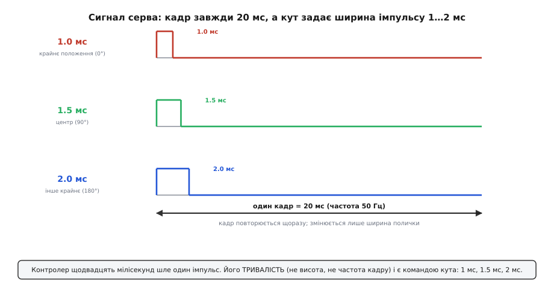
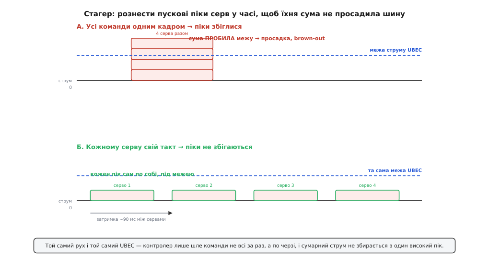

# ⚙️ Керуємо сервами на UBEC-шині, не садячи її в brown-out

Живлення в моделі ви вже маєте: UBEC узяв напругу тягового акумулятора й віддав рівні 5 В на спільну плюсову шину приймача. Задача цієї вставки починається там, де закінчується сама коробочка UBEC. Він нічого не «слухає» — у нього немає ані цифрового входу, ані регістра. Керує сервами **контролер**, а UBEC лише годує їх струмом. І весь фокус у тому, що серва — навантаження **непокірне**: воно тягне струм не рівно, а ривками, і якщо кілька серв смикнуться в один момент, їхні ривки складуться в один високий пік, який просадить шину нижче порога роботи приймача. Це і є **brown-out** — коротке провалля напруги, від якого приймач перезавантажується, а модель на частку секунди глухне.

Отже, задача звучить так: **згенерувати з контролера правильний сигнал для серв, що живляться з UBEC-шини 5 В, і зробити це так, щоб пікові ривки серв не збіглися в часі й не пробили струмову межу UBEC.** Плюс — навчити контролер **самому бачити**, коли шина все-таки просідає, щоб не гадати про причину «плаваючих» збоїв, а мати число у вольтах.

Домен тут наскрізь залізний: генерація імпульсів із точністю до мікросекунд, робота з апаратним таймером, АЦП. Тому весь код нижче — реальний C/C++ під три середовища: Arduino (ATmega — Uno, Nano), ESP-IDF і STM32 HAL. Задача в них одна — апаратний таймер відміряє поличку, АЦП міряє шину, — а двері до цього заліза в кожного свої, і саме на цій різниці спотикаються найчастіше. Не псевдокод — те, що заллється й запрацює.

## Що взагалі шле контролер у серво

Перш ніж керувати, треба точно розуміти, **чим** керуєш. Хобі-серво слухає не рівень напруги й не «число по шині». Воно слухає **тривалість імпульсу**, який приходить на сигнальний провід приблизно щодвадцять мілісекунд. Цей протокол старий, аналоговий і напрочуд простий.

Раз на **20 мс** (тобто з частотою **50 Гц**) контролер має видати на сигнальну ніжку короткий додатний імпульс. Його **ширина** й є командою кута:

```
ширина імпульсу   кут вала серва
─────────────────────────────────
   1.0 мс          одне крайнє положення   (умовно 0°)
   1.5 мс          середина                (90°)
   2.0 мс          інше крайнє             (180°)
```

Проміжні ширини дають проміжні кути лінійно: 1.25 мс — це чверть ходу, 1.75 мс — три чверті. Сам кадр (період 20 мс) майже не важить — серва терплять і 15, і 25 мс між імпульсами; важить саме **тривалість полички**. Висота імпульсу — це просто логічна одиниця (3.3 чи 5 В, серву байдуже, аби впевнено «високо»), і вона теж не несе інформації. Уся команда захована в часі.



*Кадр завжди 20 мс, а кут задає тривалість імпульсу від 1 до 2 мс. Ні висота, ні частота кадру не несуть команди — лише ширина полички. Тому згенерувати сигнал серва означає рівно одне: точно відміряти цю мілісекундну поличку.*

Це стандарт де-факто, а не жорсткий припис: більшість серв упевнено ходять у діапазоні 1.0–2.0 мс, деякі беруть ширший 0.5–2.5 мс (і тоді 1.5 мс усе одно центр), а конкретні краї варто звірити з паспортом серва — інакше на краях ходу воно впреться в механічний упор і даремно гудітиме під струмом. Докладніше про сам привід, його механіку й трипровідний роз'єм — у [хобі-серво](topic:hw-motion/hobby-servo); а сам принцип «команда захована в тривалості імпульсу» — це звичайний [ШІМ](topic:hw-arch/pwm-on-mcu), тільки з дуже специфічними мілісекундними числами.

> 🔧 **Навіщо це.** Зрозумівши, що серву керує **час**, ви одразу бачите, чому платформи різняться. Відміряти поличку в 1.5 мс із точністю до мікросекунд — робота апаратного таймера; таймер із виходом порівняння є в кожному МК, але двері до нього всюди свої. На Arduino цю точність ховає бібліотека `Servo`; в ESP-IDF ви задаєте її самі через блок LEDC; на STM32 — через канал PWM таймера. Плутанина «чому серво тремтить/не доходить до краю» майже завжди — це неточно відміряна поличка, а не «погане серво».

## Генеруємо сигнал: один апаратний таймер, троє дверей до нього

Писати відлік імпульсів руками (крутити ніжкою й рахувати мікросекунди в циклі) — погана ідея: будь-яка інша робота в програмі зіб'є тайминг, і серво засмикається. Тому поличку відміряє **апаратний таймер**, а ми лише кажемо йому бажану ширину. Це вміє будь-який МК із таймером — різняться лише двері.

На **Arduino** є бібліотека `Servo`. Вона на тлі, через переривання таймера, сама генерує коректний 50-Гц сигнал на будь-якій цифровій ніжці й дає два способи задати команду: `write(кут)` у градусах (0…180) або, точніше, `writeMicroseconds(мкс)` прямо в мікросекундах ширини. Другий спосіб чесніший — ви бачите ту саму поличку, про яку йшлося вище.

На **ESP32** (в ESP-IDF) готової `Servo` немає, та вона й не потрібна: «рідний» і точніший шлях — апаратний блок **LEDC**, той самий, що генерує ШІМ. Ви кажете йому частоту 50 Гц і високу роздільність (16 біт зручно), а тоді задаєте **скважність** так, щоб ширина ввімкненого часу дорівнювала потрібним мікросекундам. Тут є арифметика, і її варто розуміти, а не списувати. При частоті 50 Гц період — 20000 мкс; при 16-бітній роздільності повний період ділиться на 2¹⁶ = 65536 сходинок. Отже одному відліку скважності відповідає:

```
крок скважності = 20000 мкс / 65536 ≈ 0.305 мкс на одиницю
```

Щоб отримати поличку в `pulse_us` мікросекунд, беремо стільки сходинок, скільки їх уміщується в цю ширину:

```
duty = pulse_us · 65536 / 20000
перевірка (центр 1500 мкс): 1500 · 65536 / 20000 = 4915
перевірка (край  1000 мкс): 1000 · 65536 / 20000 = 3277
```

> 🔧 **Навіщо це.** Ось чому для серв на ESP32 беруть саме високу роздільність. Якби ви взяли 8 біт (256 сходинок на весь 20-мс кадр), крок скважності був би 20000/256 ≈ 78 мкс — грубіше за третину градуса… ні, гірше: увесь робочий діапазон серва (1000…2000 мкс) уклався б лише в (2000−1000)/78 ≈ 13 сходинок. Тринадцять положень на 180° — серво стрибало б кутами. 16 біт дають ~3277 сходинок на той самий діапазон — рух виходить плавним. Роздільність ШІМ тут прямо перетворюється на роздільність кута.

На **STM32** ту саму роботу робить канал **PWM** апаратного таймера, і там арифметика найкоротша: прескалером задають тик 1 мкс, регістром автоперезавантаження — 20000 тиків кадру, а в регістр порівняння пишуть **просто ширину полички в мікросекундах** — 1000…2000, без жодного перерахунку у скважність.

Ось той самий скелет трьома вкладками — ідіоматично для кожної платформи. Усі три роблять одне: заводять кілька серв і дають функцію «повернути серво номер N у кут A».

:::tabs
```arduino
// ── Керування сервами на UBEC-шині. Arduino (Uno/Nano, ATmega328) ──
// Бібліотека Servo сама генерує 50-Гц сигнал через апаратний таймер.
// Команду задаємо в МІКРОСЕКУНДАХ ширини — чесніше за градуси.
#include <Servo.h>

const uint8_t  N = 4;                 // скільки серв на шині
const uint8_t  PIN[N] = {3, 5, 6, 9}; // сигнальні ніжки (будь-які цифрові)
Servo servo[N];

const uint16_t US_MIN = 1000;         // край ходу, мкс (звірити з паспортом!)
const uint16_t US_MID = 1500;         // центр
const uint16_t US_MAX = 2000;         // інший край

// градуси 0..180 → мікросекунди 1000..2000 (лінійно)
uint16_t angleToUs(uint8_t deg) {
  if (deg > 180) deg = 180;
  return US_MIN + (uint32_t)(US_MAX - US_MIN) * deg / 180;
}

void setup() {
  for (uint8_t i = 0; i < N; i++) {
    servo[i].attach(PIN[i]);          // таймер починає гнати сигнал
    servo[i].writeMicroseconds(US_MID); // старт із центру — безпечний кут
  }
}

// Повернути одне серво в кут. Ширину пише таймер, ми лише задаємо число.
void moveServo(uint8_t i, uint8_t deg) {
  servo[i].writeMicroseconds(angleToUs(deg));
}

void loop() {
  moveServo(0, 45);   // приклад: розкидати серва по кутах
  moveServo(1, 135);
  delay(1000);
}
```
```esp-idf
// ── Керування сервами на UBEC-шині. ESP-IDF (ESP32, driver/ledc.h) ──
// Свій сигнал 50 Гц робимо апаратним LEDC; ширину рахуємо в скважність.
// 16 біт роздільності → плавний кут (~3277 сходинок на робочий діапазон).
#include "freertos/FreeRTOS.h"
#include "freertos/task.h"
#include "driver/ledc.h"

#define N 4
#define PERIOD_US 20000u                       // 1/50 Гц у мікросекундах
#define DUTY_MAX  ((1u << 16) - 1u)            // 16-бітна скважність

static const int PIN[N] = {25, 26, 27, 14};    // будь-які GPIO-виходи
static const ledc_channel_t CH[N] = {LEDC_CHANNEL_0, LEDC_CHANNEL_1,
                                     LEDC_CHANNEL_2, LEDC_CHANNEL_3};
static const uint16_t US_MIN = 1000, US_MID = 1500, US_MAX = 2000;

// мікросекунди ширини → відлік скважності LEDC
static uint32_t us_to_duty(uint16_t us) { return (uint32_t)us * DUTY_MAX / PERIOD_US; }

static uint16_t angle_to_us(uint8_t deg) {
    if (deg > 180) deg = 180;
    return US_MIN + (uint32_t)(US_MAX - US_MIN) * deg / 180;
}

void servo_init(void) {
    ledc_timer_config_t tim = {
        .speed_mode      = LEDC_LOW_SPEED_MODE,
        .duty_resolution = LEDC_TIMER_16_BIT,
        .timer_num       = LEDC_TIMER_0,
        .freq_hz         = 50,                 // 20-мс кадр
        .clk_cfg         = LEDC_AUTO_CLK,
    };
    ESP_ERROR_CHECK(ledc_timer_config(&tim));
    for (int i = 0; i < N; i++) {
        ledc_channel_config_t ch = {
            .gpio_num   = PIN[i],
            .speed_mode = LEDC_LOW_SPEED_MODE,
            .channel    = CH[i],
            .intr_type  = LEDC_INTR_DISABLE,
            .timer_sel  = LEDC_TIMER_0,
            .duty       = us_to_duty(US_MID),  // старт із центру — безпечний кут
            .hpoint     = 0,
        };
        ESP_ERROR_CHECK(ledc_channel_config(&ch));
    }
}

// Повернути одне серво в кут. Ширину жене таймер, ми лише задаємо число.
void servo_write(uint8_t i, uint8_t deg) {
    ledc_set_duty(LEDC_LOW_SPEED_MODE, CH[i], us_to_duty(angle_to_us(deg)));
    ledc_update_duty(LEDC_LOW_SPEED_MODE, CH[i]);
}

void app_main(void) {
    servo_init();
    for (;;) {
        servo_write(0, 45);   // приклад: розкидати серва по кутах
        servo_write(1, 135);
        vTaskDelay(pdMS_TO_TICKS(1000));
    }
}
```
```stm32
// ── Керування сервами на UBEC-шині. STM32 (HAL, канал PWM таймера) ──
// Таймер налаштований у CubeMX: прескалер дає тик 1 мкс, ARR = 20000-1
// → кадр 20 мс. Тоді регістр порівняння (CCR) — це ПРЯМО ширина полички
// в мікросекундах, без жодної арифметики скважності.
#include "stm32f4xx_hal.h"

extern TIM_HandleTypeDef htim3;        // TIM3: чотири канали = чотири серва

#define N 4
static const uint32_t CH[N] = {TIM_CHANNEL_1, TIM_CHANNEL_2,
                               TIM_CHANNEL_3, TIM_CHANNEL_4};

static const uint16_t US_MIN = 1000;   // край ходу, мкс (звірити з паспортом!)
static const uint16_t US_MID = 1500;   // центр
static const uint16_t US_MAX = 2000;   // інший край

// градуси 0..180 → мікросекунди 1000..2000 (лінійно)
static uint16_t AngleToUs(uint8_t deg) {
  if (deg > 180) deg = 180;
  return US_MIN + (uint32_t)(US_MAX - US_MIN) * deg / 180;
}

void ServoInit(void) {
  for (uint8_t i = 0; i < N; i++) {
    __HAL_TIM_SET_COMPARE(&htim3, CH[i], US_MID);  // старт із центру
    HAL_TIM_PWM_Start(&htim3, CH[i]);              // таймер починає гнати сигнал
  }
}

// Повернути одне серво в кут: пишемо мікросекунди просто в регістр порівняння.
void ServoMove(uint8_t i, uint8_t deg) {
  __HAL_TIM_SET_COMPARE(&htim3, CH[i], AngleToUs(deg));
}

int main(void) {
  HAL_Init();  SystemClock_Config();  MX_TIM3_Init();
  ServoInit();
  for (;;) {
    ServoMove(0, 45);    // приклад: розкидати серва по кутах
    ServoMove(1, 135);
    HAL_Delay(1000);
  }
}
```
:::

Два рішення в цьому скелеті закладені навмисне, і обидва — про безпеку живлення, а не про красу коду.

**Старт із центру.** На ініціалізації (`setup()`, `servo_init()`, `ServoInit()`) кожне серво одразу отримує `US_MID` (1500 мкс). Причина не косметична: поки контролер не сказав серву, куди йти, деякі серва «шукають» позицію активно, тягнучи струм. Задавши всім центр від першої мілісекунди, ви прибираєте випадкові смикання одразу після ввімкнення живлення — а це, як побачимо, найнебезпечніший для шини момент.

**Команда в мікросекундах, не в градусах.** І `writeMicroseconds`, і `us_to_duty`, і запис у регістр порівняння показують справжню ширину полички. Градусна `write(90)` теж працює, але ховає число, а нам це число ще знадобиться, коли міритимемо, скільки саме серво «доходить» до краю без просадки.

## Головна пастка: чому не можна рухати всі серва разом

Тепер — центральна ідея всієї вставки, заради якої вона й написана. Код вище **вміє** повернути кілька серв. Спокуса — крутнути їх усі одним рядком, «щоб спрацювали разом». Саме тут UBEC і садиться.

Придивімося, що фізично робить серво в момент команди. Поки воно стоїть і тримає позицію без опору, воно тягне копійки — десятки міліампер. Але щойно ви дали нову ціль, мотор усередині серва **рвучко стартує**, щоб довести вал у нову точку, — і в цей момент струм підскакує в рази. Пусковий (а тим паче застопорений, коли вал упреться в напір повітря чи упор) струм серва — це **у 5–10 разів** більше за струм спокою; для звичайного серва це легко 0.6–1.5 А замість «сплячих» ста міліампер. Це підтверджена, типова поведінка колекторного двигуна під навантаженням: у момент рушання опір обмотки ще не «наздогнала» зустрічна ЕРС, і крізь неї проскакує кидок.

А тепер складіть кидки. Якщо ви скомандували чотирьом сервам рушити **в один кадр**, їхні пускові піки **збігаються в часі** — і UBEC бачить не чотири окремі стрибки по черзі, а **один сумарний**, учетверо вищий:

```
пік одного серва:          ~0.9 А
чотири серва РАЗОМ:  4 · 0.9 = 3.6 А   в один момент
тривалий струм UBEC:        3.0 А
3.6 А > 3.0 А  →  шина просідає, brown-out
```

Пробили межу — напруга на шині 5 В провалюється, приймач ловить провал живлення й може перезавантажитися. У найгірший момент — у різкому маневрі, коли пілот і смикнув усі поверхні одразу — модель на частку секунди втрачає керування. Це не гіпотеза, а класична причина падінь моделей і збоїв багатосервних механізмів; галузева порада «для більш ніж двох-трьох серв бери окреме живлення» росте саме звідси.

Рішення напрочуд дешеве й повністю програмне: **не подавай усі команди в один момент — рознеси їх у часі**. Хай перше серво рушить зараз, друге — за 80–100 мс, третє — ще за стільки, і так далі. Кожен пусковий пік тоді стоїть **сам по собі**, встигає осісти до наступного, і сумарний струм ніколи не збирається в одну високу голку. Це і є **стагер** (від англ. *to stagger* — розставляти вроздріб, зі зсувом).



*Той самий рух, той самий UBEC. Угорі команди подано всі за раз — піки збіглися й сума пробила межу. Унизу контролер шле їх по черзі — піки не збігаються, і шина тримає напругу. Різниця лише в тому, коли надіслано команди, а не в залізі.*

> 🔧 **Навіщо це.** Стагер нічого не коштує: ні зайвої деталі, ні потужнішого UBEC — лише кілька рядків коду й непомітні для ока сто мілісекунд. А рятує він від найпідступнішого класу аварій, бо brown-out не палить деталь і не кидає винятку: він просто на мить опускає напругу так, що приймач «моргнув». Без стагера ви ганяєтеся за «плаваючим» перезавантаженням тижнями; зі стагером проблема зникає в корені — пікам просто нема коли скластися.

## Стагер у коді: розкладаємо піки в часі

Наївний стагер — це блокувальна пауза між командами (`delay()`, `HAL_Delay()`, `vTaskDelay()`). Вона працює, але глушить програму на час пауз: поки серва розходяться, контролер не читає радіо, не міряє живлення, нічого. У реальній моделі так не можна — керування має лишатися живим. Тому робочий стагер роблять **без блокування**: заводимо «розклад» рухів і в кожному оберті головного циклу дивимося, чиє серво вже пора рушити за монотонним лічильником часу (`millis()` в Arduino, `HAL_GetTick()` на STM32, `esp_timer_get_time()` в ESP-IDF).

Ідея така. Кожному серву призначаємо його ціль і **момент**, коли його дозволено зрушити (свій зсув від старту черги). У циклі перевіряємо годинник: настав час серва i — віддаємо йому команду **одне**, не чіпаючи інших. Піки виходять рознесеними рівно на заданий крок:

:::tabs
```arduino
// ── Неблокувальний стагер: рознести пуски серв у часі. Arduino ──
// Замість delay() ведемо розклад і в loop() дивимось на millis().
// Керування лишається живим — радіо й монітор працюють між пусками.
#include <Servo.h>

const uint8_t N = 4;
const uint8_t PIN[N] = {3, 5, 6, 9};
Servo servo[N];

const uint16_t STAGGER_MS = 90;      // крок між пусками серв, мс
uint8_t  target[N];                  // куди кожне серво має піти, градуси
uint32_t dueAt[N];                   // момент (millis), коли дозволено рушити
bool     pending[N];                 // чи чекає це серво своєї черги

uint16_t angleToUs(uint8_t deg) {
  if (deg > 180) deg = 180;
  return 1000 + (uint32_t)1000 * deg / 180;
}

// Задати нову «розкладку» цілей: серва рушать по черзі, а не разом.
void scheduleMove(const uint8_t deg[N]) {
  uint32_t now = millis();
  for (uint8_t i = 0; i < N; i++) {
    target[i]  = deg[i];
    dueAt[i]   = now + (uint32_t)i * STAGGER_MS;  // i-те чекає i кроків
    pending[i] = true;
  }
}

void setup() {
  for (uint8_t i = 0; i < N; i++) {
    servo[i].attach(PIN[i]);
    servo[i].writeMicroseconds(1500);
    pending[i] = false;
  }
}

// Викликати ЧАСТО (щооберту loop): видає команди, коли настав їхній час.
void serviceStagger() {
  uint32_t now = millis();
  for (uint8_t i = 0; i < N; i++) {
    if (pending[i] && (int32_t)(now - dueAt[i]) >= 0) {
      servo[i].writeMicroseconds(angleToUs(target[i]));  // рушаємо ОДНЕ
      pending[i] = false;
    }
  }
}

void loop() {
  // приклад: раз на 3 с розкидати серва по нових кутах — по черзі
  static uint32_t last = 0;
  if (millis() - last > 3000) {
    uint8_t goal[N] = {30, 60, 120, 150};
    scheduleMove(goal);
    last = millis();
  }
  serviceStagger();     // піки рознесені; тут-таки читаємо радіо, міряємо шину…
}
```
```esp-idf
// ── Неблокувальний стагер на ESP-IDF. Той самий принцип. ──
// Розклад пусків + монотонний esp_timer; команди йдуть по черзі,
// задача не блокується — між пусками крутиться решта роботи.
#include "freertos/FreeRTOS.h"
#include "freertos/task.h"
#include "esp_timer.h"

#define N 4
#define STAGGER_MS 90                  // крок між пусками серв, мс

static uint8_t target[N];              // куди кожне серво має піти, градуси
static int64_t due_at[N];              // момент (мс), коли дозволено рушити
static bool    pending[N];             // чи чекає це серво своєї черги

static int64_t now_ms(void) { return esp_timer_get_time() / 1000; }

// Задати нову «розкладку» цілей: серва рушать по черзі, а не разом.
void schedule_move(const uint8_t deg[N]) {
    int64_t now = now_ms();
    for (int i = 0; i < N; i++) {
        target[i]  = deg[i];
        due_at[i]  = now + (int64_t)i * STAGGER_MS;   // i-те чекає i кроків
        pending[i] = true;
    }
}

// Викликати ЧАСТО: видає команди, коли настав їхній час.
void service_stagger(void) {
    int64_t now = now_ms();
    for (int i = 0; i < N; i++) {
        if (pending[i] && now - due_at[i] >= 0) {
            servo_write(i, target[i]);            // рушаємо ОДНЕ
            pending[i] = false;
        }
    }
}

void servo_task(void *arg) {
    servo_init();                                 // усі серва — у центр
    int64_t last = 0;
    for (;;) {
        if (now_ms() - last > 3000) {   // раз на 3 с нові кути — по черзі
            const uint8_t goal[N] = {30, 60, 120, 150};
            schedule_move(goal);
            last = now_ms();
        }
        service_stagger();      // піки рознесені; тут-таки радіо, вимір шини…
        vTaskDelay(pdMS_TO_TICKS(5));
    }
}
```
```stm32
// ── Неблокувальний стагер на STM32 (HAL). Той самий принцип. ──
// Розклад пусків + HAL_GetTick() (мілісекунди від старту); команди йдуть
// по черзі, головний цикл не спиняється жодним HAL_Delay.
#include "stm32f4xx_hal.h"

#define N 4
#define STAGGER_MS 90

static uint8_t  target[N];
static uint32_t dueAt[N];
static bool     pending[N];

// Задати нову «розкладку» цілей: серва рушать по черзі, а не разом.
void ScheduleMove(const uint8_t deg[N]) {
  uint32_t now = HAL_GetTick();
  for (uint8_t i = 0; i < N; i++) {
    target[i]  = deg[i];
    dueAt[i]   = now + (uint32_t)i * STAGGER_MS;   // i-те чекає i кроків
    pending[i] = true;
  }
}

// Викликати ЧАСТО (щооберту головного циклу).
void ServiceStagger(void) {
  uint32_t now = HAL_GetTick();
  for (uint8_t i = 0; i < N; i++) {
    if (pending[i] && (int32_t)(now - dueAt[i]) >= 0) {
      ServoMove(i, target[i]);                     // рушаємо ОДНЕ
      pending[i] = false;
    }
  }
}

int main(void) {
  HAL_Init();  SystemClock_Config();  MX_TIM3_Init();
  ServoInit();                          // усі серва — у центр
  uint32_t last = 0;
  for (;;) {
    if (HAL_GetTick() - last > 3000) {  // раз на 3 с нові кути — по черзі
      const uint8_t goal[N] = {30, 60, 120, 150};
      ScheduleMove(goal);
      last = HAL_GetTick();
    }
    ServiceStagger();      // піки рознесені; тут-таки радіо, вимір шини…
  }
}
```
:::

Три деталі цього стагера варті окремого слова, бо вони відрізняють робочий код від наївного.

**Порівняння часу через різницю, а не «більше».** Умова записана як `(int32_t)(now - dueAt[i]) >= 0`, а не `now >= dueAt[i]`. Це не примха. Лічильник часу рано чи пізно **переповнюється** (на 32 бітах — приблизно раз на 49.7 доби) й обертається через нуль. Пряме `now >= dueAt` у момент обертання дає хибний висновок, а віднімання з приведенням до знакового типу коректно працює й через переповнення — класичний прийом для будь-якого 32-бітного лічильника (`millis()` в Arduino, `HAL_GetTick()` на STM32; 64-бітний `esp_timer_get_time()` цієї біди не має взагалі, тому у вкладці ESP-IDF приведення й немає). Для моделі, яку вмикають на хвилини, це рідко стріляє, але писати правильно коштує тих самих символів.

**Рушаємо строго по одному.** У циклі спрацьовує лише те серво, чий час настав, і воно тут-таки знімає з себе `pending`. Навіть якщо два моменти опиняться поруч, команди підуть у різні оберти головного циклу — а він крутиться тисячі разів на секунду, тож піки все одно рознесені мікро- й мілісекундами. Ніякого «раптом усі разом».

**Крок стагера — під ваш UBEC.** `STAGGER_MS = 90` — розумний початок: пусковий кидок серва встигає осісти за кілька десятків мілісекунд, тож 80–100 мс дають пікам не перекриватися. Слабший UBEC або голодніші серва — беріть крок більший (150 мс); потужніший UBEC із запасом — можна й менший. Число підбирають під конкретну пару «UBEC + серва», а не беруть на віру.

## Хай контролер сам бачить просадку: моніторинг через АЦП

Стагер прибирає **причину** brown-out. Але корисно ще й **бачити** наслідок — реально виміряти, чи тримає шина 5 В під навантаженням, чи все-таки просідає. Це перетворює невидиму апаратну проблему на явне число: замість «здається, під навантаженням щось не так» — конкретні «шина = 4.6 В, тривога».

Ідея та сама, що й для будь-якого моніторингу живлення: завести напругу шини на вивід АЦП контролера й порівнювати з порогом. Одна перепона — рівні. АЦП міряє напругу лише у власному вікні — до опорної, а вона майже завжди нижча за 5 В (3.3 В на ESP32 і STM32; на ATmega за опорну тут беруть внутрішні 1.1 В — див. нижче); заводити 5 В прямо на вхід АЦП **не можна** — спалите вивід. Тому напругу шини спершу **зменшують резистивним дільником** (двома резисторами), а вже цю зменшену копію подають на АЦП і в коді множать назад. Сам вивід дільника, вибір номіналів під діапазон АЦП і тонкощі опорної напруги докладно розібрані в [моніторі просідання рейки](topic:cat-hw-power/yp-08-power/proj-rail-monitor.md) — тут не повторюватимемо, а візьмемо готовий результат: дільник, що вкладає 5 В у безпечне вікно АЦП, плюс кілька рядків читання.

Далі — платформозалежна дрібниця: чим саме прочитати вивід і як перевести відлік у вольти. Робота скрізь однакова — запустити перетворення, взяти відлік, помножити на ціну поділки й на коефіцієнт дільника; різниця лише в тому, звідки береться опорна напруга. ESP32 має **калібрований** API, що повертає одразу мілівольти на піні (він враховує заводський розкид опори чипа); на ATmega й STM32 ціну поділки рахують з відомої опорної. Ось монітор, який можна прямо вставити поруч зі стагером — він доповнює головний цикл, не блокуючи його:

:::tabs
```arduino
// ── Монітор просадки UBEC-шини. Arduino (Uno/Nano, ATmega328) ──
// Опорну беремо ВНУТРІШНЮ (1.1 В): міряти власне живлення відносно
// нього самого безглуздо — відношення не зміниться, хоч би шина сіла.
// Дільник під 1.1 В: R1=47к (згори, від шини), R2=10к (до землі):
//   Uвузол = 5.0 · 10/57 = 0.877 В  (нижче за опорну — безпечно)
//   назад:  Uшини = Uвузол · (R1+R2)/R2 = Uвузол · 5.7

const uint8_t  PIN_RAIL = A0;
const float    DIV = (47000.0f + 10000.0f) / 10000.0f;   // = 5.7
const float    VREF_MV = 1100.0f;     // внутрішня опорна ATmega328
const uint16_t BROWNOUT_MV = 4600;    // поріг тривоги, мВ на шині

void setupRailMonitor() {
  analogReference(INTERNAL);          // 1.1 В; перше читання після зміни — викинути
  analogRead(PIN_RAIL);
  Serial.begin(115200);
}

uint16_t readRailMv() {
  uint32_t acc = 0;
  for (uint8_t i = 0; i < 8; i++)     // усереднення 8 вибірок — прибрати шум
    acc += analogRead(PIN_RAIL);      // 0..1023
  float nodeMv = (acc / 8.0f) * VREF_MV / 1023.0f;
  return (uint16_t)(nodeMv * DIV);    // назад у мілівольти шини
}

// Викликати нечасто (напр. раз на 100 мс) з loop() — не блокує.
void serviceRailMonitor() {
  static uint32_t last = 0;
  if (millis() - last < 100) return;
  last = millis();

  uint16_t mv = readRailMv();
  if (mv < BROWNOUT_MV) {
    Serial.print(F("BROWNOUT! шина = ")); Serial.print(mv);
    Serial.println(F(" мВ — рознеси рухи / послаб навантаження"));
    // тут-таки реакція: НЕ починати нову розкладку серв, поки шина не встане,
    // запалити червоний LED, знизити кількість одночасних серв…
  }
}
```
```esp-idf
// ── Монітор просадки UBEC-шини. ESP-IDF (adc_oneshot + калібрування) ──
// Дільник зменшує 5 В до безпечного для АЦП вікна; калібрування віддає
// мілівольти на піні з поправкою на заводський розкид чипа.
// Дільник: R1=15к (згори, від шини), R2=10к (до землі) → k = 0.4.
//   Uвузол = 5.0 · 0.4 = 2.0 В  (у лінійній зоні АЦП ESP32)
//   назад:  Uшини = Uвузол · (R1+R2)/R2 = Uвузол · 2.5
#include "esp_adc/adc_oneshot.h"
#include "esp_adc/adc_cali.h"
#include "esp_adc/adc_cali_scheme.h"
#include "esp_timer.h"
#include "esp_log.h"

#define RAIL_CH     ADC_CHANNEL_6      // GPIO34 на ADC1: вхід-лише, зручний для АЦП
#define DIV         2.5f               // (15к+10к)/10к
#define BROWNOUT_MV 4600               // поріг тривоги, мВ на шині
static const char *TAG = "rail";

static adc_oneshot_unit_handle_t adc1;
static adc_cali_handle_t cali;

void rail_monitor_init(void) {
    adc_oneshot_unit_init_cfg_t unit = { .unit_id = ADC_UNIT_1 };
    ESP_ERROR_CHECK(adc_oneshot_new_unit(&unit, &adc1));
    adc_oneshot_chan_cfg_t ch = {           // послаблення 12 дБ → вікно ~0..3.1 В
        .atten = ADC_ATTEN_DB_12, .bitwidth = ADC_BITWIDTH_DEFAULT };
    ESP_ERROR_CHECK(adc_oneshot_config_channel(adc1, RAIL_CH, &ch));

    adc_cali_line_fitting_config_t c = {    // класичний ESP32 калібрують прямою
        .unit_id = ADC_UNIT_1, .atten = ADC_ATTEN_DB_12,
        .bitwidth = ADC_BITWIDTH_DEFAULT };
    ESP_ERROR_CHECK(adc_cali_create_scheme_line_fitting(&c, &cali));
}

uint16_t rail_read_mv(void) {
    int acc = 0, raw = 0, mv = 0;
    for (int i = 0; i < 8; i++) {           // усереднення 8 вибірок — прибрати шум
        ESP_ERROR_CHECK(adc_oneshot_read(adc1, RAIL_CH, &raw));
        acc += raw;
    }
    ESP_ERROR_CHECK(adc_cali_raw_to_voltage(cali, acc / 8, &mv));  // калібровані мВ
    return (uint16_t)(mv * DIV);            // назад у мілівольти шини
}

// Викликати нечасто (напр. раз на 100 мс) із задачі — не блокує.
void rail_monitor_service(void) {
    static int64_t last = 0;
    int64_t now = esp_timer_get_time() / 1000;
    if (now - last < 100) return;
    last = now;

    uint16_t mv = rail_read_mv();
    if (mv < BROWNOUT_MV) {
        ESP_LOGW(TAG, "BROWNOUT! шина = %u мВ — рознеси рухи / послаб навантаження", mv);
        // тут-таки реакція: НЕ починати нову розкладку серв, поки шина не встане,
        // запалити червоний LED, знизити кількість одночасних серв…
    }
}
```
```stm32
// ── Монітор просадки UBEC-шини. STM32 (HAL, ADC1) ──
// Дільник зменшує 5 В до вікна АЦП (опорна = 3.3 В); читаємо відлік
// і множимо назад. Канал і 12 біт налаштовані в CubeMX.
// Дільник: R1=15к (згори, від шини), R2=10к (до землі) → k = 0.4.
//   Uвузол = 5.0 · 0.4 = 2.0 В  (< 3.3 В — безпечно)
//   назад:  Uшини = Uвузол · (R1+R2)/R2 = Uвузол · 2.5
#include "stm32f4xx_hal.h"

extern ADC_HandleTypeDef hadc1;       // вхід шини заведено на канал ADC1

#define DIV         2.5f              // (15к+10к)/10к
#define VREF_MV     3300.0f           // опорна плати
#define ADC_FULL    4095.0f           // 12 біт
#define BROWNOUT_MV 4600              // поріг тривоги, мВ на шині

uint16_t RailReadMv(void) {
  uint32_t acc = 0;
  for (uint8_t i = 0; i < 8; i++) {   // усереднення 8 вибірок — прибрати шум
    HAL_ADC_Start(&hadc1);
    HAL_ADC_PollForConversion(&hadc1, 10);
    acc += HAL_ADC_GetValue(&hadc1);
  }
  HAL_ADC_Stop(&hadc1);
  float nodeMv = (acc / 8.0f) * VREF_MV / ADC_FULL;
  return (uint16_t)(nodeMv * DIV);    // назад у мілівольти шини
}

// Викликати нечасто (напр. раз на 100 мс) з головного циклу — не блокує.
void RailMonitorService(void) {
  static uint32_t last = 0;
  if (HAL_GetTick() - last < 100) return;
  last = HAL_GetTick();

  uint16_t mv = RailReadMv();
  if (mv < BROWNOUT_MV) {
    printf("BROWNOUT! шина = %u мВ — рознеси рухи / послаб навантаження\r\n", mv);
    // тут-таки реакція: НЕ починати нову розкладку серв, поки шина не встане,
    // запалити червоний LED, знизити кількість одночасних серв…
  }
}
```
:::

І тут ховається одна пастка, специфічна саме для UBEC-моніторингу, — назву її прямо, бо на ній губляться. **Повільний АЦП-монітор ловить осідання, а не голку.** Дільник плюс усереднення восьми вибірок плюс пауза 100 мс — це монітор **тренду**: він чудово бачить, що шина **просіла й тримається** низько під тривалим навантаженням. Але наносекундно-мілісекундну **голку** просадки в момент пускового кидка серва він розмиє й, найпевніше, пропустить — саме тоді, коли вона й стається. Це не вада коду, а межа методу: ловити коротку голку — робота швидкого компаратора чи спеціалізованого супервізора живлення, а не програмного циклу з АЦП.

Що ж тоді дає цей монітор, якщо коротку голку він проґавлює? Дві дуже корисні речі. По-перше, він ловить **систематичне** осідання: якщо ваш UBEC слабенький (клон, що бреше про свої ампери), під сталим навантаженням серв шина осяде — і монітор це покаже числом. По-друге, він дає **зворотний зв'язок для стагера**: побачив, що шина близька до порога, — контролер може діяти обережніше (не запускати нову розкладку рухів, поки напруга не відновиться, збільшити крок стагера). Разом стагер і монітор працюють у парі: перший **не дає** пікам скластися, другий **стежить**, чи справді шина тримається, і дозволяє реагувати, коли щось пішло не так.

> 🔧 **Навіщо це.** Найдешевша страховка від найтихішого збою. Кілька копійчаних резисторів у дільнику й десяток рядків коду перетворюють «модель іноді дивно моргає» на «шина = 4.55 В під час залпу елеронів» — конкретне число в тому ж терміналі, де й решта відладки. А головне — монітор і стагер посилюють одне одного: маючи вимір, ви бачите, чи правильно підібрали крок стагера, замість гадати.

## Складність і пастки: де реально втрачають хвилини й моделі

Код вище правильний. Але між правильним кодом і моделлю, що надійно керується, лежить кілька мін, і майже всі — на межі коду й живлення. Пройдімося по них у порядку, в якому вони найчастіше стріляють.

### Одночасний старт усіх серв — головна причина падінь

Це причина номер один, і саме тому їй присвячено півстатті. Спокуса подати всі команди одним рядком величезна — «хай спрацюють разом, синхронно». Наслідок — складені пікові струми, просадка шини, brown-out приймача в найгірший момент. Ліки — **стагер**: рознесіть пуски на 80–150 мс, і піки перестануть збігатися. Правило залізне: **скільки б серв ви не рухали, ніколи не подавайте їм команди в один кадр — завжди по черзі.**

### Пусковий стрибок самого UBEC при вмиканні живлення

Окрема, тонша пастка — **момент подачі живлення**. У самого UBEC на виході стоять конденсатори; коли ви під'єднуєте акумулятор, вони заряджаються ривком, і на вході коротко тече великий пусковий струм (звідси й іскра на роз'ємі, яку ви бачите). Це нормально для UBEC. Але накладіть на цей же момент серва, що після подачі живлення «шукають» позицію й теж тягнуть кидок, — і найперші мілісекунди роботи стають **найголоднішими** за всю роботу моделі. Саме тому на ініціалізації вище кожне серво одразу отримує центр (1500 мкс): визначена ціль від першої мілісекунди прибирає зайві пошукові смикання, поки шина ще стабілізується. Не давайте сервам стартувати «наосліп» одразу після ввімкнення.

### Вибір напруги: 5 чи 6 вольт — і чому це не байдуже

Багато UBEC перемикаються між **5 В** і **6 В**, і вибір — не дрібниця. Вища напруга дає сервам відчутно **більше моменту й швидкості** (серво — це моторчик, і 6 В крутять його жвавіше за 5 В), тож у пілотажних моделях 6 В беруть зумисне, заради різкішого керма. Але за це треба платити: **не всі серва терплять 6 В**. Аналогові й дешеві або старі серва часто розраховані лише на 4.8–6 В із натяжкою, а то й на 5 В; подасте 6 В на таке — ризикуєте спалити його електроніку чи мотор. Тому правило: **6 В — тільки якщо паспорт кожного серва на шині це дозволяє**; є хоч одне «5-вольтове» серво — уся шина мусить бути 5 В, бо шина спільна й напругу на ній ділять усі. І окремо: занизька напруга теж шкодить — серва на просілих 4.5 В «туплять», повільнішають і легше провокують ту саму просадку. Виставляйте UBEC свідомо під найслабше серво, а не «на око».

### Замало струму в UBEC — і жоден стагер не врятує

Стагер рознедить **пікові кидки**, але він не збільшує **сумарний тривалий** струм, який шина може віддавати. Якщо ваші серва навіть у спокої (тримаючи позицію проти напору) сукупно тягнуть більше, ніж UBEC дає тривало, — шина осяде незалежно від будь-якого стагера. Тут допомагає лише правильний вибір коробочки: сумарний робочий струм серв беруть із запасом (×1.5–2), а не «впритул». Стагер і моніторинг — це про **пікову** динаміку; достатній тривалий струм UBEC — окрема, базова умова, і код її не замінює.

### Дратівливе тремтіння серва («джиттер») — часто це живлення, не сигнал

Насамкінець — симптом, який женуть у код, а винне живлення. Серво, що стоїть на місці, але дрібно **тремтить** чи «дзижчить», новачок кидається лагодити генерацією сигналу — і марно. Причин дві, і обидві частіше поза кодом. Перша — **просілі або шумні 5 В**: якщо шина під навантаженням гуляє, серво без упину «переприцілюється», звідси й тремтіння; лікують достатнім UBEC і стагером (щоб сусідні серва не смикали шину під це). Друга — **брудна земля чи довгі тонкі сигнальні дроти**, на які наводиться завада. Перш ніж переписувати генерацію імпульсів, перевірте живлення осцилографом чи бодай монітором вище: чи не просідає шина, чи впевнено тримається 5 В. Код чіпайте останнім — рівно як із будь-яким «плаваючим» багом, коріння якого насправді в живленні.

## Що з цього винести

Керування сервами на UBEC-шині зводиться до двох різних задач, які легко сплутати. Перша — **згенерувати сигнал**: віддати серву поличку 1.0–2.0 мс раз на 20 мс, руками цього не роблять, поличку відміряє апаратний таймер: на Arduino його ховає `Servo`, в ESP-IDF ви задаєте частоту 50 Гц і скважність через LEDC (16-бітна роздільність перетворюється на плавність кута), на STM32 пишете мікросекунди просто в регістр порівняння каналу PWM. Друга, важливіша, — **не посадити шину**: пусковий струм серва в 5–10 разів вищий за струм спокою, і якщо кілька серв рушать в один кадр, їхні піки складаються в голку, що пробиває межу UBEC і кидає приймач у brown-out.

Ліки на це — **стагер**: рознести команди в часі на 80–150 мс, щоб піки не збігалися; коштує кілька рядків неблокувального коду й непомітні для ока мілісекунди, а прибирає цілий клас «плаваючих» перезавантажень у корені. Поруч ставлять **АЦП-монітор** через дільник — він ловить не миттєву голку, а систематичне осідання шини й дає стагеру зворотний зв'язок: бачиш просадку — дій обережніше. А по-справжньому хвилини й моделі з'їдають п'ять місць на межі коду й живлення: **одночасний старт усіх серв** (рознось у часі), **пусковий стрибок при вмиканні** (старт із центру, не наосліп), **напруга 5 проти 6 В** (тільки під паспорт найслабшого серва), **замалий струм UBEC** (жоден стагер не замінить достатньої коробочки) і **тремтіння від просілого живлення** (перевір шину, перш ніж лізти в сигнал). Тримайте цю п'ятірку в голові — і серва слухатимуться коду точно, а шина триматиме свої 5 В навіть у найрізкішому маневрі.
