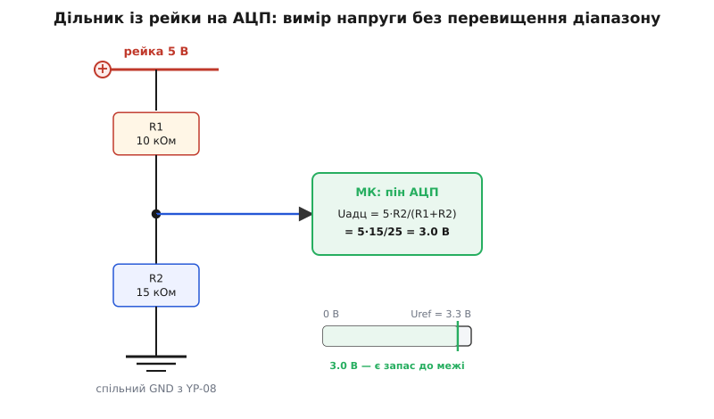

# ⚙️ Монітор просідання рейки: АЦП стереже живлення

Модуль YP-08 нічого не «слухає». У ньому немає ані виводу дозволу (enable), ані шини I²C, ані регістра, куди контролер міг би записати команду — це джерело живлення, і вся його «мова» вичерпується двома джамперами й вимикачем під пальцями людини. Тому проєкт навколо нього не про те, як цим модулем **керувати** (керувати нема чим), а про протилежне: як **зробити так, щоб контролер сам відчував стан своєї рейки** й помічав, коли лінійна плата починає здаватися під навантаженням.

Потреба тут не вигадана. Лінійний регулятор під струмом просідає й гріється; варто трохи перевантажити 5-вольтову рейку — і замість рівних п'яти вольтів на ній опиняється 4.6, потім 4.3, а тепловий захист AMS1117 узагалі здатен на мить «відпустити» вихід. Логіка на 3.3 В цього довго не помічає (нижній регулятор тримає свої 3.3 В, поки вхід йому дає бодай ~4.6 В), а от периферія, що живиться прямо з 5-вольтової рейки — реле, RGB-стрічка, серворульова машинка — уже блимає й смикається. Добре, коли контролер бачить це число **сам** і встигає щось зробити: запалити червоний світлодіод, кинути рядок у лог, від'єднати ненажерливе навантаження, — а не мовчки чекати, доки просадка дійде до нього самого й система перезавантажиться посеред роботи.

Цей ефект — коротке падіння живлення нижче порогу надійної роботи — має усталену назву **brownout** (буквально «пригасання», за аналогією з приглушенням світла в мережі під перевантаженням). Наша задача звучить так: **виміряти напругу рейки з коду й підняти тривогу, щойно вона просіла нижче заданого порогу.**

> 🔧 **Навіщо це.** Просадка рейки — найтихіший клас збоїв. Він не кидає виняток і не палить деталь; він просто ненадовго опускає напругу так, що якийсь один вузол починає брехати — давач віддає сміття, радіо не встигає передати пакет, дисплей блимає. Без вимірювання ти шукаєш «плаваючий баг» у коді тижнями, а причина — на осцилографі: рейка дихає під навантаженням. Монітор перетворює невидиму апаратну проблему на явний прапорець, який видно в тому ж терміналі, де й решта відладки.

## Ідея: рейка вища за АЦП, тож її треба «зменшити»

Аналого-цифровий перетворювач (АЦП) контролера вміє міряти напругу лише у власному вузькому вікні — від нуля до своєї **опорної напруги** (reference, Uref). У класичного Arduino Uno (мікроконтролер ATmega328) це вікно за замовчуванням дорівнює напрузі живлення, тобто ≈5 В. У модулів на ESP32 та більшості сучасних 3.3-вольтових плат верх вікна — близько **3.3 В** (а насправді ще нижчий — до цього повернемося, бо саме тут ховається перша пастка).

Тепер зіштовхнемо це з тим, що ми хочемо міряти. Рейку 3.3 В контролер на 3.3-вольтовому АЦП виміряти прямо **не може**: 3.3 В — це і є верх його шкали, а рейка ще й може стрибнути трохи вище, і тоді вхід АЦП опиниться понад опорою — у кращому разі покаже «стелю» й перестане розрізняти, у гіршому — вивід перевантажиться. Рейку 5 В на такому контролері виміряти прямо **тим паче не можна**: 5 В — це майже півтора діапазони, пряме під'єднання 5-вольтової рейки до 3.3-вольтового входу АЦП спалить вивід.

Вихід простий і старий, як сама схемотехніка: якщо напруга завелика для приладу — **поділи її наперед**. Два резистори послідовно від рейки до землі утворюють **резистивний дільник напруги**: у точці між ними висить рівно та частка вхідної напруги, яку задає співвідношення плечей. Ми беремо цю зменшену копію рейки, заводимо її на вивід АЦП — і міряємо вже безпечне число, яке потім у коді помножимо назад, щоб дізнатися справжню напругу рейки.

> Резистивний дільник — це два резистори R1 і R2, послідовно з'єднані між напругою й землею; напруга в їхньому спільному вузлі дорівнює вхідній, помноженій на R2/(R1+R2). Струм крізь обидва однаковий, тож напруга «ділиться» пропорційно опорам — на меншому плечі падає менша частка. Докладний вивід і поведінка під навантаженням — у [статті про дільник напруги](topic:hw-analog/voltage-divider).

Уся схема моніторингу — це той дільник плюс три рядки коду. Ось як вона виглядає для рейки 5 В на 3.3-вольтовому контролері:


*Рейка йде через верхнє плече R1, у вузлі знімається зменшена копія напруги й подається на АЦП; земля дільника — спільна з YP-08, інакше вимір не має сенсу.*

## Вибір номіналів: щоб копія рейки лягла в діапазон із запасом

Співвідношення плечей задає, у скільки разів ми зменшуємо рейку. Формула дільника:

```
Uвузол = Uрейки · R2 / (R1 + R2)
```

Нам треба підібрати R1 і R2 так, щоб за **максимальної очікуваної** напруги рейки Uвузол не перевищувало опору АЦП — і ще лишало трохи запасу згори, бо рейка інколи стрибає вище номіналу, а біля самої стелі АЦП поводиться найгірше.

**Умова: рейка 5 В, АЦП із опорою ≈3.3 В. Ціль — щоб 5 В на рейці давали ≈3.0 В у вузлі (0.3 В запасу під стелю).**

Коефіцієнт зменшення, який нам потрібен:

```
k = Uвузол / Uрейки = 3.0 / 5.0 = 0.6
```

Отже треба R2/(R1+R2) = 0.6. Найпростіша пара, що це дає:

```
R1 = 10 кОм,  R2 = 15 кОм
k = 15 / (10 + 15) = 15 / 25 = 0.6
Uвузол(5 В)   = 5.0 · 0.6 = 3.00 В   ✓ у діапазоні
Uвузол(5.2 В) = 5.2 · 0.6 = 3.12 В   ✓ ще з запасом
```

Чому саме десятки кілоом, а не одиниці й не мегаоми? Тут стикаються дві протилежні вимоги, і десятки кілоом — розумний компроміс між ними.

**Знизу номінали обмежує зайвий струм і тепло.** Дільник висить на рейці постійно й тече крізь себе струм, який просто йде в землю без користі:

```
Iдільника = Uрейки / (R1 + R2) = 5.0 / 25000 = 0.2 мА
```

0.2 мА — це нічого для нашої рейки, і на цьому струмі дільник розсіює ~1 мВт тепла. А якби ми взяли R1 = 100 Ом, R2 = 150 Ом (те саме співвідношення 0.6!), струм став би 20 мА — стільки ж, скільки жере цілий світлодіод, і це вже помітне зайве навантаження на ту саму лінійну плату, стан якої ми намагаємося берегти. Ставити на бідну рейку паразитний дільник, що сам її підвантажує, — очевидна дурість.

**Згори номінали обмежує вхід АЦП.** І тут — головна апаратна пастка всього проєкту.

> 🔧 **Навіщо це.** Дільник — не «безкоштовне» вікно у напругу. Він постійно точить струм із рейки й постійно розсіює тепло; для монітора живлення обидва ефекти хочеться тримати мізерними, тож плечі беруть у десятках кілоом. Але щойно опір плечей росте, прокидається протилежна біда — АЦП перестає встигати його «дочитати». Тому діапазон номіналів затиснутий з обох боків, і десятки кілоом — вузька смуга, де і струм малий, і АЦП ще щасливий.

## Пастка номер один: вихідний опір дільника проти входу АЦП

Вхід АЦП — не ідеальний вольтметр із нескінченним опором. Усередині нього стоїть **пристрій вибірки-зберігання** (sample-and-hold): крихітний конденсатор, який на момент вимірювання під'єднується до входу й має **зарядитися до напруги, що на вході**, за відведений на це короткий час. Заряджає його — джерело сигналу, тобто наш дільник. А те, як швидко зарядиться конденсатор, залежить від опору, крізь який він заряджається, — і цей опір задає саме дільник.

Для дільника опір, яким він «дивиться» на АЦП (його вихідний опір), — це R1 і R2, з'єднані **паралельно** (бо для змінної складової і рейка, і земля — це та сама «тверда» точка):

```
Rвих = R1 · R2 / (R1 + R2) = 10000 · 15000 / 25000 = 6000 Ом = 6 кОм
```

Документація на ATmega328 (мозок Arduino Uno) прямо застерігає: **джерело сигналу для АЦП має мати опір не більший за ≈10 кОм**, інакше конденсатор вибірки-зберігання (близько 14 пФ у вхідному вузлі) не встигає зарядитися за стандартний час перетворення, і вимір «недобирає» — показує менше, ніж є насправді. Наші 6 кОм у цю межу вкладаються з запасом — це ще одна причина, чому пара 10 кОм / 15 кОм зручна: підвищиш номінали до сотень кілоом заради меншого струму — і вилізеш за 10 кОм, отримавши повільне, заниження вимірювання.

*(Статус: підтверджено технічною документацією Microchip/Atmel на ATmega328P — рекомендація «джерело ≤ 10 кОм» і опис вхідної ємності ~14 пФ вузла вибірки-зберігання.)*

Що робити, коли дільник таки мусить бути високоомним (наприклад, міряєш вищу напругу й не хочеш палити струм)? Три робочі шляхи:

- **Конденсатор у вузлі.** Невеликий конденсатор (100 нФ) від вузла дільника до землі створює локальний «резервуар» заряду поруч із піном АЦП: конденсатору вибірки-зберігання є звідки миттєво черпнути заряд, і високий опір дільника вже не тисне на швидкість. Плата — трохи повільніша реакція на швидкі стрибки напруги, але для монітора живлення (де нас цікавлять повільні просадки, а не наносекундні голки) це якраз доречно.
- **Довша пауза перед читанням.** Багато АЦП дозволяють збільшити час вибірки; повільніше — зате точно.
- **Просто не задирати номінали.** Найнадійніше: тримайся десятків кілоом, і проблеми немає зовсім.

## Пастка номер два: опорна напруга — не те, що написано

Ми весь час рахували, ніби опора АЦП — рівно 3.3 В (чи рівно 5 В). У житті це число **гуляє**, і якщо його не врахувати, монітор буде тихо брехати на кілька відсотків — саме там, де ми намагаємося зловити просадку в ті самі кілька відсотків.

На Arduino Uno опора за замовчуванням дорівнює напрузі живлення (AVcc) — а її дає нам… та сама рейка 5 В із YP-08, яка під навантаженням просідає. Виходить порочне коло: рейка просіла з 5.0 до 4.6 В — і **опора АЦП просіла разом із нею**. АЦП міряє відношення входу до опори; коли обидва падають синхронно, відношення не змінюється, і монітор просадки **не побачить узагалі**. Це найпідступніша пастка в усьому проєкті: інструмент вимірювання «дрейфує» разом із тим, що вимірює.

Рятунок — дати АЦП **незалежну, стабільну опору**, яка не залежить від рейки:

- На ATmega328 є вбудоване джерело опори **1.1 В** (вмикається `analogReference(INTERNAL)`). Воно не пливе за живленням — але тоді вікно вимірювання всього 0…1.1 В, і дільник треба перерахувати вже під нього (тобто зменшувати рейку сильніше). Зате просадку рейки ти тепер бачиш чесно.
- Ще краще — не міряти рейку прямо, а виміряти **саме внутрішні 1.1 В відносно живлення** (АЦП уміє взяти опорою AVcc, а входом — внутрішнє джерело). Знаючи, що джерело — 1.1 В, і бачачи, який код воно дає, обчислюєш саму AVcc, тобто напругу рейки, **взагалі без зовнішнього дільника**. Класичний трюк «виміряти власне живлення»; для 5-вольтової рейки він елегантний, бо не жере жодного зайвого виводу й струму.

На ESP32 своя версія тієї ж біди, і навіть гостріша. По-перше, опора його АЦП — індивідуальна для кожного чипа: **від 1000 до 1200 мВ** замість ідеальних 1100, і два однакові з вигляду модулі покажуть на тій самій напрузі різні числа, поки не врахуєш калібрування. По-друге, щоб узагалі дотягтися вимірюванням до 3.3 В, ESP32 вмикає вхідний послаблювач (attenuation) на 11–12 дБ — і саме на цьому режимі його АЦП **помітно нелінійний** біля верху шкали: комфортний, лінійний діапазон — приблизно до **2.45 В**, а вище число «загинається» й насичується. Практичний наслідок: **на ESP32 не націлюй дільник на 3.0 В** — заганяй максимум рейки в ~2.4 В, тобто зменшуй сильніше. Для рейки 5 В підійде, наприклад, R1 = 15 кОм, R2 = 10 кОм (k = 0.4 → 5.0·0.4 = 2.0 В), і весь робочий діапазон лишиться в лінійній зоні.

*(Статус: підтверджено документацією Espressif — опора АЦП ESP32 варіює 1000…1200 мВ; на 11/12 дБ послаблення характеристика нелінійна, лінійний діапазон приблизно до 2.45 В; калібрувальний API коригує обидва ефекти через заводські дані та таблицю відповідності.)*

На щастя, у ESP32 обидві ці болячки лікує **вбудоване калібрування**: заводські коефіцієнти кожного чипа зашиті в його eFuse, а API повертає вже виправлену напругу в мілівольтах — треба лише ним скористатися замість наївного «код × щось». Нижче так і зроблено.

> 🔧 **Навіщо це.** Опора — це «лінійка», якою АЦП міряє все інше. Якщо лінійка гумова (пливе за живленням) або в кожного примірника своя (розкид від чипа до чипа) — усі виміри спотворені рівно настільки ж, і жодне ретельне рахування дільника цього не виправить. Тому серйозний монітор живлення завжди спирається на опору, **незалежну від рейки, що вимірюється**: внутрішнє джерело на AVR, заводське калібрування на ESP32.

## Пастка номер три: спільна земля — інакше вимір беззмістовний

Найтихіша й найчастіша помилка початківця: завести на АЦП тільки **сигнальний** дріт від дільника й забути з'єднати **землю** контролера із землею YP-08. Схема виглядає повною, дільник на місці — а числа стрибають випадково або показують нісенітницю.

Причина фундаментальна. Напруга — це завжди **різниця** між двома точками; «3 В» саме по собі не існує, існує «3 В **відносно чогось**». АЦП міряє свій вхід відносно **своєї** землі. Дільник ділить рейку відносно **землі рейки**. Якщо ці дві землі не з'єднані в одну точку, то потенціал «нуля» в контролера й у модуля різний і плаваючий, і АЦП міряє свій вхід відносно неправильної точки відліку — виходить сміття.

Тому **перший дріт** у цьому проєкті — не сигнальний, а земляний: GND контролера в ту саму спільну землю, що й «мінус» YP-08 (він, до речі, спільний для 5 В, 3.3 В і входу модуля — саме тому на одному макеті й уживаються різні рівні). Добра новина: якщо контролер **живиться** від тієї ж рейки YP-08, спільна земля вже є сама собою через живлення, і окремий дріт не потрібен. Але якщо контролер живиться окремо (свій USB, інший блок) — землю доводиться зводити руками, і без цього монітор не працює.

> 🔧 **Навіщо це.** «Забув землю» — помилка, яку не видно очима: усі кольорові дроти на місці, схема виглядає зібраною. А підступність у тому, що іноді воно навіть ніби працює — паразитний зворотний шлях через інші з'єднання дає хоч якийсь спільний нуль, — і збій плаваючий. Звичка тягнути землю **першою**, ще до сигналу, економить години пошуку «чому АЦП бреше».

## Робочий код: прочитати, перерахувати, зловити просадку

Логіка монітора однакова на будь-якому контролері й вкладається у три кроки:

1. **Прочитати АЦП** — дістати або сире число (код від 0 до максимуму), або вже готові мілівольти.
2. **Перерахувати назад у напругу рейки** — врахувати опору (перевести код у напругу на піні) і дільник (помножити на (R1+R2)/R2).
3. **Порівняти з порогом** і, якщо нижче, підняти тривогу.

Ключова арифметика третього кроку — **обернути дільник**. У вузлі ми маємо Uвузол = Uрейки · k; отже назад:

```
Uрейки = Uвузол · (R1 + R2) / R2 = Uвузол / k
для базової пари 10к/15к:  Uрейки = Uвузол · 25 / 15 = Uвузол · 1.667
перевірка: 3.00 В у вузлі → 3.00 · 1.667 = 5.00 В рейки  ✓
```

Одне застереження до коду нижче: пара 10 кОм / 15 кОм із малюнка — це **ілюстративний випадок** для АЦП із опорою рівно 3.3 В. Реальні контролери такої опори здебільшого не мають (ми щойно бачили чому), тож **кожна вкладка бере свою пару резисторів під свою опору** — і, відповідно, свій множник DIV, виписаний просто в коментарі коду. Принцип той самий; числа підігнані під конкретне залізо.

Нижче — той самий монітор трьома способами, під три найтиповіші середовища для цієї задачі. Це залізо, тож ядро — C/C++ (Arduino й ESP-IDF), а поруч MicroPython, яким на ESP32 такі речі роблять чи не найчастіше саме новачки. Кожна вкладка — не переклад, а **ідіоматичний** для свого середовища варіант: різні API читання, різні опори, різний спосіб дістати чесні мілівольти.

:::tabs
```cpp
// Arduino (ATmega328, напр. Uno/Nano) — рейка 5 В.
// Опора — ВНУТРІШНІ 1.1 В (не пливуть за живленням!),
// тож дільник масштабуємо саме під 1.1 В, а не під 5 В.
// Щоб 5.2 В рейки давали <1.1 В у вузлі: k ≈ 0.2 → R1=39к, R2=10к.
//   Uвузол(5.2) = 5.2 · 10/49 = 1.06 В  ✓ під 1.1 В
//   Uрейки = Uвузол · (39+10)/10 = Uвузол · 4.9

const uint8_t  PIN_RAIL = A0;
const float    R1 = 39000.0f,  R2 = 10000.0f;
const float    VREF = 1.100f;              // внутрішнє джерело ATmega328
const float    DIV  = (R1 + R2) / R2;      // = 4.9, обернений коефіцієнт
const float    BROWNOUT = 4.6f;            // поріг тривоги, В

void setup() {
  Serial.begin(115200);
  analogReference(INTERNAL);               // опора = 1.1 В, НЕ живлення
  analogRead(PIN_RAIL);                    // перше читання — «розігнати» опору
  delay(2);
}

float readRailVolts() {
  // усереднення 8 вибірок прибирає шум молодшого розряду
  uint32_t acc = 0;
  for (uint8_t i = 0; i < 8; i++) acc += analogRead(PIN_RAIL);
  float code = acc / 8.0f;                 // 0..1023 (10-біт)
  float vNode = code * VREF / 1023.0f;     // напруга на піні
  return vNode * DIV;                      // назад у напругу рейки
}

void loop() {
  float v = readRailVolts();
  if (v < BROWNOUT) {
    Serial.print("BROWNOUT! рейка = ");
    Serial.print(v, 2);
    Serial.println(" В");
    // тут-таки реакція: запалити червоний LED, скинути навантаження…
  } else {
    Serial.print("рейка OK: ");
    Serial.print(v, 2);
    Serial.println(" В");
  }
  delay(200);
}
```
```c
// ESP-IDF v5 (ESP32) — рейка 5 В, АЦП 3.3-вольтового класу.
// На 12 дБ послаблення верх лінійності ~2.45 В, тож ділимо СИЛЬНІШЕ:
// R1=15к, R2=10к → k=0.4 → 5.2 В рейки дають 2.08 В у вузлі (у лінійній зоні).
// Мілівольти беремо з КАЛІБРУВАННЯ (враховує розкид опори 1000..1200 мВ).
#include "esp_adc/adc_oneshot.h"
#include "esp_adc/adc_cali.h"
#include "esp_adc/adc_cali_scheme.h"
#include "freertos/FreeRTOS.h"
#include "freertos/task.h"
#include "esp_log.h"

static const char *TAG = "rail";
#define R1 15000.0f
#define R2 10000.0f
#define DIV  ((R1 + R2) / R2)      // = 2.5, обернений коефіцієнт
#define BROWNOUT_MV 4600           // поріг у мілівольтах рейки

void app_main(void) {
    // 1) канал АЦП: GPIO34 = ADC1_CHANNEL_6 на класичному ESP32
    adc_oneshot_unit_handle_t adc;
    adc_oneshot_unit_init_cfg_t ucfg = { .unit_id = ADC_UNIT_1 };
    adc_oneshot_new_unit(&ucfg, &adc);

    adc_oneshot_chan_cfg_t ccfg = {
        .atten = ADC_ATTEN_DB_12,          // ~0..3.3 В (кол. DB_11)
        .bitwidth = ADC_BITWIDTH_DEFAULT,  // зазвичай 12 біт
    };
    adc_oneshot_config_channel(adc, ADC_CHANNEL_6, &ccfg);

    // 2) калібрування — воно й дає ЧЕСНІ мілівольти попри розкид опори
    adc_cali_handle_t cali = NULL;
    adc_cali_curve_fitting_config_t kcfg = {
        .unit_id  = ADC_UNIT_1,
        .atten    = ADC_ATTEN_DB_12,
        .bitwidth = ADC_BITWIDTH_DEFAULT,
    };
    adc_cali_create_scheme_curve_fitting(&kcfg, &cali);

    while (1) {
        int raw, mv, acc = 0;
        for (int i = 0; i < 8; i++) {          // усереднення від шуму
            adc_oneshot_read(adc, ADC_CHANNEL_6, &raw);
            adc_cali_raw_to_voltage(cali, raw, &mv);
            acc += mv;
        }
        int node = acc / 8;                     // мілівольти у вузлі (середнє)
        int rail = (int)(node * DIV);           // назад у мілівольти рейки

        if (rail < BROWNOUT_MV)
            ESP_LOGW(TAG, "BROWNOUT! рейка = %d мВ", rail);
        else
            ESP_LOGI(TAG, "рейка OK: %d мВ", rail);

        vTaskDelay(pdMS_TO_TICKS(200));
    }
}
```
```python
# MicroPython (ESP32) — рейка 5 В.
# read_uv() повертає МІКРОВОЛЬТИ, уже з заводським калібруванням —
# найпростіший чесний шлях, не треба знати опору вручну.
# 11 dB послаблення: лінійно приблизно до 2.45 В, тож ділимо сильніше:
# R1=15к, R2=10к → k=0.4 → 5.2 В рейки = 2.08 В у вузлі.
from machine import ADC, Pin
import time

R1, R2 = 15000, 10000
DIV = (R1 + R2) / R2          # = 2.5, обернений коефіцієнт
BROWNOUT = 4.6                # поріг тривоги, В

adc = ADC(Pin(34))
adc.atten(ADC.ATTN_11DB)      # діапазон ~0..3.3 В

def read_rail_volts():
    acc = 0
    for _ in range(8):        # усереднення від шуму
        acc += adc.read_uv()  # мікровольти у вузлі, калібровані
    v_node = acc / 8 / 1_000_000   # → вольти на піні
    return v_node * DIV             # → напруга рейки

while True:
    v = read_rail_volts()
    if v < BROWNOUT:
        print("BROWNOUT! рейка = {:.2f} В".format(v))
        # реакція: запалити LED, скинути навантаження…
    else:
        print("рейка OK: {:.2f} В".format(v))
    time.sleep_ms(200)
```
:::

Три деталі, спільні для всіх трьох варіантів, варто назвати прямо, бо вони відрізняють робочий монітор від наївного:

**Усереднення.** Молодший розряд АЦП завжди трохи «тремтить» від шуму; одиничне читання стрибає на кілька одиниць коду туди-сюди. Сума восьми вибірок із діленням прибирає це тремтіння майже задарма й робить поріг стабільним — інакше монітор блиматиме «brownout / OK / brownout» на рівній рейці біля самого порогу.

**Гістерезис (варто додати в реальному коді).** Якщо рейка стоїть рівно на порозі 4.6 В, монітор смикатиметься між двома станами. Класичне лікування — **два** пороги: тривогу вмикати на 4.6 В, а знімати лише на 4.75 В. Проміжок між ними («мертва зона») не дає стану дрижати. У прикладах вище я лишив один поріг заради ясності ідеї, але у справжньому пристрої зроби два.

**Реакція, а не лише друк.** `print`/`ESP_LOG` — це для відладки за столом. У готовому виробі на просадку реагують дією: запалюють червоний світлодіод, знеструмлюють ненажерливе навантаження через транзистор, записують подію в лог із міткою часу, у критичному разі — переводять систему в безпечний режим до відновлення живлення. Монітор корисний рівно настільки, наскільки корисна його реакція.

## Складність і межі: що цей монітор може, а чого ні

Проєкт навмисно простий — і в цій простоті чесно окреслені його межі.

**Він бачить повільне, а не миттєве.** Дільник плюс усереднення плюс пауза 200 мс — це монітор **тренду**: він ловить, що рейка **осіла** під тривалим навантаженням. Наносекундну «голку» просадки від імпульсного струму (реле смикнулося, мотор стартонув) він розмиє й пропустить. Ловити такі короткі провали — робота компаратора або спеціалізованої мікросхеми нагляду за живленням (**supervisor / brown-out detector**), а не повільного програмного циклу з АЦП. Для нашої задачі — «рейка YP-08 сідає під логікою» — повільного монітора цілком досить, бо саме такі просадки нас і турбують.

**Точність — це точність опори й резисторів.** Уся будова спирається на два припущення: опора АЦП відома, і резистори дільника мають саме той номінал. Звичайні резистори — ±5 %, і два таких у дільнику дають до кількох відсотків похибки коефіцієнта; хочеш точніше — став 1 %-ві (а краще ще й одного номіналу поруч, щоб їхній розкид частково скорочувався). Опору ж на ESP32 обов'язково бери з калібрування, а на AVR — з незалежного внутрішнього джерела, як розібрано вище; наївне «код × 5.0 / 1023» на рейці, що сама ж і є опорою, — це вимірювання, яке не помічає того, що мало б помітити.

**Один вивід — одна рейка.** Кожна рейка, за якою хочеш стежити, — це свій дільник і свій вивід АЦП. На YP-08 рейок дві (5 В і 3.3 В); якщо цікавлять обидві — став два дільники (кожен під свою напругу й свій діапазон) і читай два канали. Спокуса заощадити й міряти лише 5-вольтову «бо вона просідає першою» здебільшого виправдана — бо 3.3-вольтовий регулятор живиться саме з 5-вольтової рейки, тож її просадка настає раніше й тягне за собою все інше.

Підсумок такий: **пасивний модуль не заважає контролеру знати власне живлення**. Кілька копійчаних резисторів у дільнику, чесна опора, спільна земля й три рядки коду перетворюють «здається, під навантаженням щось не так» на конкретне число у вольтах і явний прапорець brownout. Це найдешевша страховка від найтихішого класу збоїв — і вона цілком по силах у той самий вечір, коли ти вперше усунув YP-08 у рейки макетки.
