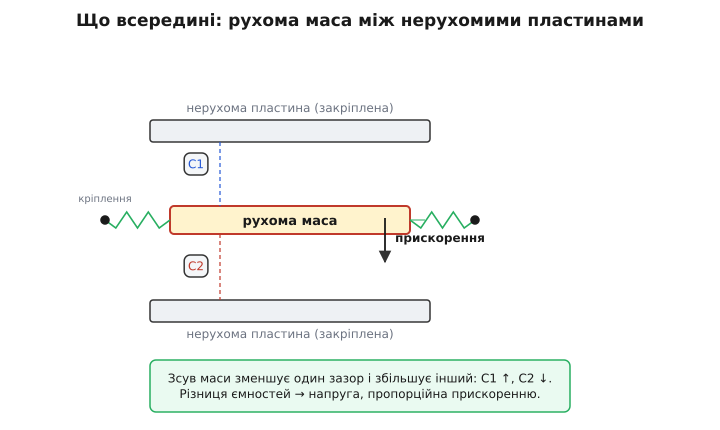
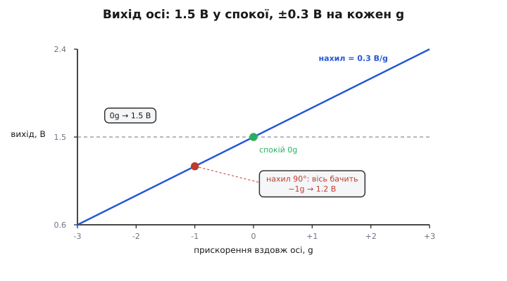
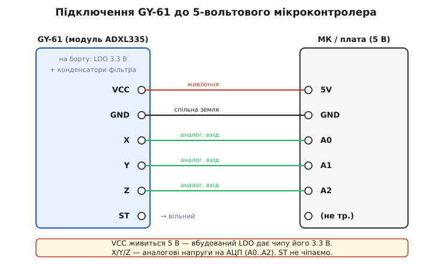

# GY-61 ADXL335 — 3-осьовий акселерометр

<preknowlist>
- [MEMS](topic:hw-sensing/mems) — мікромеханіка на кремнії: як рухома маса й ємнісний давач живуть в одному чипі (звідси й акселерометр).
- [Власне прискорення](topic:ph-mechanics/proper-acceleration) — що саме міряє акселерометр: не рух, а силу опори; тому в спокої він показує 1g угору, а у вільному падінні — нуль.
- [АЦП](topic:hw-analog/adc) — вихід ADXL335 аналоговий; щоб прочитати його числом, потрібне перетворення напруги в код.
- [Дільник напруги](topic:hw-analog/voltage-divider) — інтуїція ратіометричності: коли і давач, і опорна напруга АЦП живляться від однієї шини, їхнє відношення не залежить від точного значення живлення.
</preknowlist>

Візьміть у руку модуль GY-61 — маленьку синю (чи зелену) платку завбільшки з ніготь, із рядком контактів по краю: **VCC, GND, X, Y, Z, ST**. У центрі — крихітна чорна мікросхема 4×4 мм. Це **ADXL335** від Analog Devices, і всередині неї є те, у що важко повірити: справжня механічна маса на пружинах, вирізьблена з кремнію, менша за пилинку. Коли ви нахиляєте або трясете модуль, ця маса відхиляється — і чип перетворює її відхилення на три напруги. Прочитавши ці напруги, мікроконтролер дізнається, **куди й наскільки сильно** діє прискорення вздовж кожної з трьох осей.

Це найпростіший клас акселерометра для аматора: **аналоговий вихід**. Жодних шин, регістрів, протоколів — три ноги видають напругу, яку читає будь-який АЦП. Тому GY-61 — класична перша плата, щоб відчути, як узагалі працює вимірювання руху.

## Що він насправді міряє

Тут криється головне непорозуміння, і його варто прибрати одразу. Акселерометр міряє **не швидкість і не рух**. Він міряє **прискорення** — точніше, ту силу, з якою щось утримує його масу від вільного падіння.

Наслідок дивний, але фундаментальний: **нерухомий на столі акселерометр показує не нуль, а 1g угору**. Чому? Бо стіл штовхає його вгору, не даючи впасти до центру Землі. Давач відчуває саме цей поштовх. А якби ви його впустили — під час падіння він показав би **нуль** по всіх осях, бо ніщо вже не тисне на масу, вона летить разом із корпусом. Оце і є [власне прискорення](topic:ph-mechanics/proper-acceleration): давач бачить силу опори, а не рух крізь простір.

> 🔧 **Навіщо це.** Саме тому акселерометр працює як давач **нахилу**. Земне тяжіння — постійний вектор 1g, спрямований униз. Нахиливши плату, ви змінюєте, **як цей вектор розкладається** на три осі. Обчисливши, скільки з 1g припало на кожну вісь, дістаєте кут нахилу — без жодного руху, у повній статиці. На цьому тримається орієнтація екрана в телефоні й вирівнювання коптера.

## Як воно влаштоване всередині

Уявіть гребінець із зубцями, підвішений на тонких кремнієвих пружинах, — це **рухома маса** (proof mass, «пробна маса»). Поруч закріплені нерухомі зубці. Рухомі зубці заходять між нерухомими, не торкаючись, — виходять два повітряні зазори, тобто **два конденсатори**, C1 і C2.


*Прискорення змушує масу «відставати» й зсуватися відносно корпусу: один зазор меншає, другий більшає, тож C1 і C2 змінюються назустріч одна одній.*

Тепер прикладіть прискорення. За інерцією маса «хоче лишитися на місці», а корпус із нерухомими зубцями рушає — виходить, що маса **зсувається відносно корпусу**. Один зазор меншає (ємність росте), другий більшає (ємність падає). Чип вимірює **різницю** ємностей C1−C2: вона пропорційна зсуву, а зсув — прикладеному прискоренню (маса на пружині: сила = жорсткість × відхилення). Схема всередині перетворює цю різницю на напругу й підсилює її.

Такий підхід — **диференційний ємнісний давач на MEMS** — і робить чип надійним: різниця двох ємностей нечутлива до того, що впливає на обидві однаково (температурне розширення, дрейф живлення). Уся ця конструкція, разом з електронікою, вирізьблена поверхневою мікромеханікою в одному кристалі. Родовід цієї технології веде до [MEMS-акселерометра для подушок безпеки](topic:hw-sensing/mems): перший комерційний прилад такого роду — ADXL50 (Analog Devices, 1991) — народився саме щоб спрацьовувати airbag при ударі, і ADXL335 — прямий нащадок тієї лінійки, лише слабший на діапазон і ощадливіший.

Три такі структури, розвернуті по трьох взаємно перпендикулярних напрямках, дають три осі — X, Y, Z.

## Вихід: напруга, що лінійно залежить від прискорення

Кожна вісь видає **аналогову напругу**. Правило просте й лінійне:

```
Uвих = Uбіас + S · a
```

де `a` — прискорення вздовж осі (у g), `Uбіас` — напруга спокою (0g), `S` — чутливість (скільки вольтів на один g).

Для ADXL335 при живленні **Vs = 3.0 В** (типові значення з даташита):

```
Uбіас ≈ 1.5 В          (вихід при 0g — приблизно половина живлення)
S     ≈ 0.3 В/g        (300 мВ на кожен g; гарантований діапазон 270…330)
діапазон: ±3g          (± означає в обидва боки вздовж осі)
```


*Вихід росте лінійно: 1.5 В у спокої, +0.3 В на кожен додатний g і −0.3 В на кожен відʼємний. Нахил плати на 90° повертає вісь донизу — вона бачить −1g, вихід падає до 1.2 В.*

**Приклад: куди дивиться вісь Z, коли плата лежить рівно.**

```c
// Плата горизонтально, віссю Z угору. Тяжіння тисне на масу вниз,
// маса «провисає» так, ніби на плату діє +1g угору по Z.
// Uz = 1.5 + 0.3 * 1.0 = 1.8 В
// А осі X та Y лежать горизонтально — на них проєкція тяжіння нульова:
// Ux = Uy = 1.5 В (0g)
```

Перевернемо плату Z-віссю вниз — Z побачить −1g, вихід стане 1.5 − 0.3 = 1.2 В. Отак за трьома напругами відновлюють орієнтацію.

> 🔧 **Навіщо це «half-supply».** Біас = половина живлення обрано навмисно: так вихід має **однаковий запас** в обидва боки (може піти і вгору на +3g, і вниз на −3g, не впершись у 0 В чи у стелю). Це типове рішення для двополярного сигналу на однополярному живленні.

### Ратіометричність — тонкість, що рятує точність

І чутливість, і біас у ADXL335 **ратіометричні**: вони задані **часткою від живлення**, а не в абсолютних вольтах. При Vs = 3.0 В біас ≈ 1.5 В (половина). При Vs = 3.3 В біас підскочить до ≈ 1.65 В, а чутливість — приблизно до 330 мВ/g. Тобто числа «1.5 В» і «0.3 В/g» правдиві **лише для 3.0 В** — при іншому живленні вони масштабуються пропорційно.

Це не вада, а зручність — **якщо** живити давач і опору АЦП від **однієї шини**. Тоді АЦП міряє напругу теж як частку тієї самої шини (див. [АЦП](topic:hw-analog/adc)), і будь-яке коливання живлення скорочується у відношенні: те, що додалося до сигналу, додалося й до опори. Точне значення 3.3 В стає неважливим — лишається чисте відношення. Це та сама логіка, що й у [дільнику напруги](topic:hw-analog/voltage-divider), де вихід залежить від відношення опорів, а не від їхніх абсолютних величин.

## Модуль GY-61: що додано навколо чипа

Сам ADXL335 хоче живлення **1.8…3.6 В** — «голий» до 5-вольтової плати (класична Arduino Uno, AVR-контролери) його не підключити. Модуль GY-61 вирішує це за вас. На платі є:

- **LDO-стабілізатор 3.3 В** (часто XC6206/«662K» або аналог) — приймає 5 В із VCC і робить із них чисті 3.3 В для чипа. Тому модуль **толерантний до 5 В** на VCC, хоч сам давач працює від 3.3 В.
- **Конденсатори фільтра** — по живленню (розвʼязка, зазвичай 0.1 мкФ) і на виходах X/Y/Z. Конденсатор на кожному виході разом із вбудованим опором 32 кОм задає **смугу пропускання** (про це нижче).
- **Шість контактів** із підписами на шовкографії: VCC, GND, X, Y, Z, ST.

Що означає кожен пін:

| Пін | Призначення |
|-----|-------------|
| **VCC** | Живлення 3.3–5 В (через вбудований LDO) |
| **GND** | Спільна земля |
| **X** | Аналоговий вихід осі X |
| **Y** | Аналоговий вихід осі Y |
| **Z** | Аналоговий вихід осі Z |
| **ST** | Self-test (самоперевірка); у роботі — **лишити вільним** |

Пін **ST** — це вхід самоперевірки. Подавши на нього напругу живлення, ви **електростатично** відхиляєте кремнієву масу — так, ніби на давач подіяло реальне прискорення. Вихід ворухнеться (по осях X/Y приблизно на частку вольта, по Z трохи більше). Це спосіб переконатися, що механіка жива, не трясучи плату. У звичайній роботі ST **не чіпають** — лишають неприєднаним (усередині він підтягнутий так, щоб самоперевірка була вимкнена).

## Підключення до мікроконтролера

Схема гранично проста, бо вихід аналоговий: три ноги давача йдуть на три **аналогові входи** (АЦП) мікроконтролера.


*VCC живиться 5 В — вбудований LDO дає чипу його 3.3 В. Виходи X, Y, Z заходять на АЦП (наприклад, A0–A2). ST не підключають.*

- **VCC → 3.3 В або 5 В.** Обидва працюють завдяки LDO. Але є нюанс з опорою АЦП (нижче) — часто зручніше живити модуль **тим самим**, від чого працює опора АЦП.
- **GND → GND.** Спільна земля обовʼязкова, інакше напруги нема від чого відлічувати.
- **X, Y, Z → аналогові входи** — три будь-які виводи, заведені на канали АЦП (на Arduino Uno це A0–A2, на ESP32 — канали ADC1, скажімо GPIO32–34, на STM32 — PA0–PA2).
- **ST → нікуди** (вільний).

> 🔧 **Найважливіша пастка — узгодьте опору АЦП із живленням давача.** Якщо ви живите GY-61 від 5 В, біас стане ≈ 2.5 В, чутливість ≈ 500 мВ/g, а весь діапазон ±3g розтягнеться на ≈ 1…4 В. Якщо ж АЦП міряє відносно **3.3 В**, сигнал вилізе за стелю. І навпаки. Найнадійніше — **живити давач від тієї ж напруги, що править за опору АЦП** (обидва 3.3 В): тоді ратіометричність працює на вас, і код не залежить від точного значення живлення. Плутанина тут — найчастіша причина «неправильних» показів.

## Читаємо в коді

Прочитати вісь — це прочитати АЦП і перевести код у прискорення за формулою `a = (U − Uбіас) / S`. Від середовища залежать лише три речі: як зветься канал АЦП, яка його **повна шкала** в кодах (10 біт → 1023, 12 біт → 4095) і що править за опору. Нижче той самий розрахунок у трьох середовищах, коли і давач, і опора живляться від **3.3 В**:

:::tabs

```arduino
const float VREF   = 3.3f;    // опора АЦП = живлення давача (ратіометрично)
const float BIAS   = 1.65f;   // 0g при 3.3 В ≈ половина живлення
const float SENS   = 0.330f;  // чутливість при 3.3 В ≈ 330 мВ/g

float readAxisG(int pin) {
    int   raw = analogRead(pin);          // 0..1023 (10 біт)
    float u   = raw * VREF / 1023.0f;     // код → вольти
    return (u - BIAS) / SENS;             // вольти → g
}

void setup() {
    Serial.begin(115200);
}

void loop() {
    float ax = readAxisG(A0);
    float ay = readAxisG(A1);
    float az = readAxisG(A2);
    Serial.print(ax); Serial.print('\t');
    Serial.print(ay); Serial.print('\t');
    Serial.println(az);
    delay(50);
}
```

```esp-idf
#include "esp_adc/adc_oneshot.h"
#include "esp_log.h"
#include "freertos/FreeRTOS.h"
#include "freertos/task.h"

// Осі X/Y/Z на каналах ADC1 (у класичного ESP32 це GPIO32/33/34)
#define AX ADC_CHANNEL_4
#define AY ADC_CHANNEL_5
#define AZ ADC_CHANNEL_6

// Тут опора АЦП — НЕ живлення: усередині 1.1 В плюс атенюатор, тож повна
// шкала при 12 дБ ≈ 3.1 В. Ратіометричність не рятує — калібруйте самі.
static const float FULL = 3.10f;    // вольтів на верхньому коді
static const float BIAS = 1.65f;    // 0g при 3.3 В ≈ половина живлення
static const float SENS = 0.330f;   // чутливість при 3.3 В ≈ 330 мВ/g

static const char *TAG = "adxl335";
static adc_oneshot_unit_handle_t adc;

static float read_axis_g(adc_channel_t ch)
{
    int raw = 0;
    ESP_ERROR_CHECK(adc_oneshot_read(adc, ch, &raw));   // 0..4095 (12 біт)
    float u = raw * FULL / 4095.0f;                     // код → вольти
    return (u - BIAS) / SENS;                           // вольти → g
}

static void adxl_task(void *arg)
{
    while (1) {
        ESP_LOGI(TAG, "%.2f\t%.2f\t%.2f",
                 read_axis_g(AX), read_axis_g(AY), read_axis_g(AZ));
        vTaskDelay(pdMS_TO_TICKS(50));
    }
}

void app_main(void)
{
    adc_oneshot_unit_init_cfg_t unit = { .unit_id = ADC_UNIT_1 };
    ESP_ERROR_CHECK(adc_oneshot_new_unit(&unit, &adc));

    adc_oneshot_chan_cfg_t cfg = {
        .atten    = ADC_ATTEN_DB_12,        // до ESP-IDF 5.2 звалося ADC_ATTEN_DB_11
        .bitwidth = ADC_BITWIDTH_DEFAULT,   // на ESP32 — 12 біт
    };
    for (adc_channel_t ch = AX; ch <= AZ; ch++)
        ESP_ERROR_CHECK(adc_oneshot_config_channel(adc, ch, &cfg));

    xTaskCreate(adxl_task, "adxl", 3072, NULL, 5, NULL);
}
```

```stm32
#include "main.h"   // CubeMX: ADC1, канали IN0/IN1/IN2 (PA0/PA1/PA2), 12 біт

extern ADC_HandleTypeDef hadc1;

static const float VREF = 3.3f;     // опора АЦП = живлення давача (ратіометрично)
static const float BIAS = 1.65f;    // 0g при 3.3 В ≈ половина живлення
static const float SENS = 0.330f;   // чутливість при 3.3 В ≈ 330 мВ/g

// Три осі йдуть на один АЦП по черзі: перемикаємо його мультиплексор
// і робимо одне перетворення.
static float read_axis_g(uint32_t channel)
{
    ADC_ChannelConfTypeDef ch = {
        .Channel      = channel,
        .Rank         = ADC_REGULAR_RANK_1,
        // вихід давача має 32 кОм усередині — беремо найдовшу вибірку,
        // щоб конденсатор АЦП устиг зарядитися (назва константи залежить від серії)
        .SamplingTime = ADC_SAMPLETIME_239CYCLES_5,
    };
    HAL_ADC_ConfigChannel(&hadc1, &ch);

    HAL_ADC_Start(&hadc1);
    HAL_ADC_PollForConversion(&hadc1, 10);
    uint32_t raw = HAL_ADC_GetValue(&hadc1);   // 0..4095 (12 біт)
    HAL_ADC_Stop(&hadc1);

    float u = raw * VREF / 4095.0f;            // код → вольти
    return (u - BIAS) / SENS;                  // вольти → g
}

int main(void)
{
    HAL_Init();
    SystemClock_Config();
    MX_GPIO_Init();
    MX_ADC1_Init();
    MX_USART2_UART_Init();      // printf перенаправлено на UART

    while (1) {
        printf("%.2f\t%.2f\t%.2f\r\n",
               read_axis_g(ADC_CHANNEL_0),
               read_axis_g(ADC_CHANNEL_1),
               read_axis_g(ADC_CHANNEL_2));
        HAL_Delay(50);
    }
}
```

:::

На практиці числа `BIAS` і `SENS` варто **відкалібрувати** для свого екземпляра: розкид від чипа до чипа помітний (біас гуляє в межах ≈ 1.35…1.65 В при 3 В, чутливість ≈ 270…330 мВ/g). Найпростіше калібрування — повернути кожну вісь спершу вгору (+1g), потім вниз (−1g), записати два коди й порахувати з них справжні біас і чутливість:

```c
// Для однієї осі, маючи виміряні напруги при +1g і −1g:
// BIAS = (U_up + U_down) / 2;        // середина — це 0g
// SENS = (U_up − U_down) / 2.0f;     // піврозмаху на 1g — це чутливість В/g
```

Для нахилу (кута) з трьох осей рахують арктангенси; для рівня чи струшування досить порівнювати з порогом. Робочі приклади цих обчислень — у [proj-вставці](topic:cat-hw-sensors/adxl335/proj-adxl335.md): читання, калібрування двома точками, кут нахилу, фільтрація шуму й детектор поштовху.

## Шум і смуга пропускання

Аналоговий вихід «дихає» — до сигналу домішаний **шум**. Даташит задає його як **щільність шуму**: 150 мкg/√Гц по осях X та Y і **вдвічі більшу** — 300 мкg/√Гц — по осі Z (вертикальна вісь конструктивно шумніша). Скільки шуму вилізе в реальний сигнал, залежить від **смуги пропускання**: чим ширша смуга, тим більше шуму пролазить.

Смугу задає конденсатор на кожному виході разом із вбудованим опором 32 кОм — це звичайний [RC-фільтр нижніх частот](topic:hw-analog/rc-low-pass):

```
f(-3дБ) = 1 / (2 · π · 32000 · C)
```

**Приклад: конденсатор 0.1 мкФ на виході.**

```
f = 1 / (2 · π · 32000 · 0.1·10⁻⁶)
f = 1 / (2 · π · 32000 · 0.0000001)
f ≈ 50 Гц
```

Тобто 0.1 мкФ дає смугу ≈ 50 Гц — достатньо для нахилу й повільного руху, і при цьому добре душить шум. Хочете ловити швидку вібрацію — ставте менший конденсатор (ширша смуга, але й шумніше). Сам чип тягне до 1600 Гц по X/Y і до 550 Гц по Z; вужчу смугу обирають фільтром. Зверніть увагу: конденсатор впливає ще й на **час увімкнення** — прилад стає готовим приблизно через `160 · C` мілісекунд (C у мкФ), тож із 0.1 мкФ це ≈ 16 мс після подачі живлення.

> 🔧 **Навіщо звужувати смугу.** Кожен зайвий герц смуги — це зайвий шум у показах, тобто «тремтіння» останніх бітів АЦП. Якщо ви міряєте нахил (сигнал повільний), широка смуга не дає нічого, крім шуму. Обрізавши її до десятків герц, ви задарма покращуєте роздільність. Це загальне правило будь-якого аналогового вимірювання: **не пропускай смугу ширшу, ніж треба сигналу.**

## Межі й характер приладу

- **Діапазон ±3g** — це «людський» масштаб: нахил, жести, помірне струшування, вібрація машин. Удару, польоту чи різкого гальмування (десятки g) він **не виміряє** — вихід упреться в межу (насититься). Для таких задач беруть версії на ±16g і більше.
- **Витримує удар до 10 000 g** (короткий струс) — упустити плату не смертельно, хоч і не корисно.
- **Робоча температура −40…+85 °C.** Біас трохи дрейфує з температурою (≈ ±1 мg/°C), чутливість — ще менше (≈ ±0.01 %/°C).
- **Струм споживання ≈ 350 мкА** при 3 В — мізер, ідеально для приладів на батарейці.
- **Точність осей одна відносно одної** обмежена перехресною чутливістю ≈ ±1% (частина прискорення з однієї осі «протікає» в сусідню) — звичайна межа для дешевого MEMS.

Головний характер GY-61: **простий, аналоговий, ощадливий, на людський діапазон**. Його сила — у тому, що не треба нічого, крім трьох АЦП-входів; його межа — у тому, що аналоговий вихід ловить шум АЦП і не масштабується на великі прискорення. Коли потрібні цифрова шина, гіроскоп на додачу чи більший діапазон, беруть інтегральні IMU з цифровим інтерфейсом — але щоб **зрозуміти, що взагалі робить акселерометр**, аналоговий ADXL335 лишається найчеснішим за наочністю.
