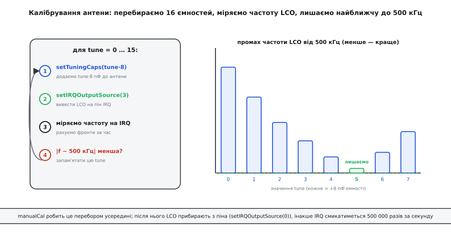
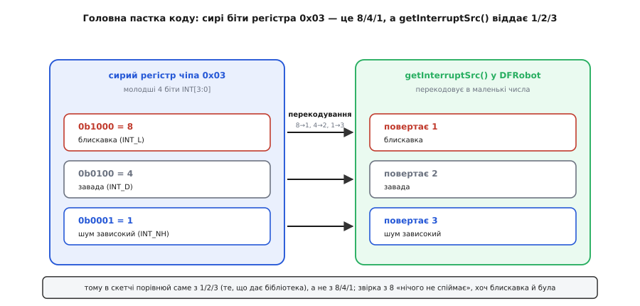

# ⚙️ Оживити SEN0290 у коді: калібрування антени й читання блискавок через DFRobot_AS3935

Увімкнути модуль блискавок у мікроконтролер — це не «підключив і читаєш число». Між живленням і першою вірною відстанню лежать три кроки, які легко проґавити, і кожен мовчки псує результат по-своєму: антену треба **підстроїти під саме цей екземпляр**, переривання треба **прочитати не одразу, а з паузою**, а причину події бібліотека віддає **не тими числами**, які пише даташит чіпа. Пропустиш перший — чутливість просідає, і далекі грози тонуть у шумі. Пропустиш другий — у журналі випадкові кілометри. Пропустиш третій — код чесно перевіряє «чи блискавка», порівнює з не тим числом і не ловить нічого, хоча розряд був.

Усе, що чіп уміє, живе в його регістрах, доступних по I²C: увімкнути, задати підсилення, підстроїти ємність антени, прочитати причину переривання. Зберімо повну робочу програму — від калібрування до розбору переривання — і, головне, розберімо, **чому** кожен крок стоїть саме там, де стоїть. В Arduino всю возню з регістрами ховає за десятком методів офіційна бібліотека **DFRobot_AS3935**; з неї й почнемо, бо так найвидніше задум. Поруч — той самий крок на ESP-IDF і STM32 HAL, де готової бібліотеки нема й регістр видно прямо. Наша робота — знати, що кожен виклик робить під капотом і де на цьому спотикаються.

## Задача

Треба, щоб мікроконтролер із під'єднаним по I²C модулем SEN0290:

- **відкалібрував антену** під конкретний екземпляр (підстроїв резонанс якнайближче до 500 кГц) — обов'язково після кожного вмикання живлення;
- **налаштувався** на місце: крита кімната чи відкритий простір, рівень фонового шуму, чи реагувати на завади;
- **чекав переривання** по фронту сигналу IRQ, не палячи такти на опитування піна в циклі;
- в обробнику **витримав паузу ~2 мс**, прочитав причину події й розгалузився: блискавка → показати відстань (км) та енергію розряду; завада чи шум → відреагувати інакше.

Уся апаратна частина — типова для Gravity-модуля: живлення 3.3–5.5 В, дві лінії I²C із підтяжками (на модулі вже стоять), окремий провід IRQ на вхідний GPIO, здатний будити по фронту. Адреса на шині ведеться DIP-перемикачем: **0x03** (за замовчуванням), **0x02** або **0x01**.

## Ідея

Робота ділиться на дві частини, і плутати їх — типова помилка новачка. Перша частина — **разове налаштування** на старті (`setup()` в Arduino, `app_main()` до головного циклу в ESP-IDF, ділянка ініціалізації в `main()` на STM32): оживити чіп, відкалібрувати антену, задати режим і пороги. Друга — **реакція на події**: короткий обробник переривання лише піднімає прапорець, а весь розбір іде в головному циклі, коли прапорець побачено.

Чому саме так, а не «читати відстань у циклі щосекунди»? Бо блискавка — подія рідкісна й коротка. Опитувати чіп у циклі означає або проґавити подію між опитуваннями, або марно смикати шину тисячі разів на секунду. Модуль сам підніме пін IRQ, коли буде що сказати; наша справа — прокинутися на цей фронт. Різницю між опитуванням і перериванням добре видно в [перериваннях](root:hw-arch/interrupts): переривання — це апаратний «стук у двері» замість того, щоб щосекунди відчиняти й перевіряти, чи хтось прийшов.

Друга ключова ідея — **калібрування живе окремо від нормальної роботи**. Під час калібрування пін IRQ тимчасово перестає бути виходом переривань і стає **виходом частоти внутрішнього гетеродину** (LCO, *local oscillator*): чіп жене на нього прямокутник із частотою антенного контуру, поділеною на дільник. Ми міряємо цю частоту, підбираємо ємність — і лише потім вертаємо піну його звичайну роль. Ці два режими піна не можуть співіснувати, тож калібрування — завжди окрема фаза до того, як почнеться слухання грози.

> 🔧 **Навіщо це.** Якщо змішати ролі — лишити LCO на піні й одразу чіпляти обробник переривань, — IRQ смикатиметься близько 500 000 разів за секунду (це ж частота гетеродину!), обробник захлинеться, і система зависне ще до першої блискавки. Тому дисципліна «спершу калібрування, потім робота, і не одночасно» — не стиль, а умова працездатності.

## Крок 0: адреса, піни, підключення бібліотеки

Бібліотека `DFRobot_AS3935` для I²C-варіанта дає клас `DFRobot_AS3935_I2C`. Його конструктор приймає **два числа: пін IRQ і адресу на шині**:

```cpp
DFRobot_AS3935_I2C(uint8_t irqPin, uint8_t devAddr);
```

Перше правило, на якому горять найчастіше: **адреса в коді має збігатися з тим, що виставлено DIP-перемикачем на платі**. Бібліотека дає три готові сталі — `AS3935_ADD1` (0x01), `AS3935_ADD2` (0x02), `AS3935_ADD3` (0x03). За замовчуванням модуль має 0x03. Як положення перемикача відповідає адресі — це питання [адресації на I²C](root:com-devices/i2c-addressing): 7-бітна адреса веденого задається апаратно, і ведучий звертається саме за нею; помилишся числом — чіп просто не відповість, `begin()` поверне помилку, і легко подумати, ніби «модуль мертвий», хоча він живий, лише слухає іншу адресу.

Пін IRQ — це номер того входу мікроконтролера, куди заведено провід IRQ модуля. Тонкість: не кожен GPIO вміє будити по перериванню. На класичному Arduino Uno зовнішні переривання є лише на пінах 2 і 3; на ESP32 та ESP8266 — майже на будь-якому; на STM32 лінія EXTI прив'язана до **номера** піна, тож PA0 і PB0 ділять одну лінію й перериваннями одночасно не працюють. Тому оголошуємо два числа з оглядкою на плату:

:::tabs
```arduino
#include <DFRobot_AS3935_I2C.h>

// ── Плата: під свій мікроконтролер ─────────────────────────────
#if defined(ESP32) || defined(ESP8266)
  #define IRQ_PIN            4        // будь-який GPIO з перериванням
#else
  #define IRQ_PIN            2        // Uno/Nano: тільки 2 або 3
#endif

#define AS3935_I2C_ADDR      AS3935_ADD3   // ЗВІРИТИ з DIP-перемикачем!

// ── Налаштування під місце ─────────────────────────────────────
#define AS3935_CAPACITANCE   96       // стартова ємність, пФ (кратна 8)

DFRobot_AS3935_I2C  lightning(IRQ_PIN, AS3935_I2C_ADDR);

volatile bool irqTriggered = false;   // прапорець із обробника переривання
```
```esp-idf
#include "driver/i2c.h"
#include "driver/gpio.h"
#include "esp_log.h"
#include "esp_timer.h"
#include "freertos/FreeRTOS.h"
#include "freertos/task.h"

// ── Плата: під свій мікроконтролер ─────────────────────────────
#define IRQ_GPIO             GPIO_NUM_4   // будь-який GPIO з перериванням
#define I2C_PORT             I2C_NUM_0
#define AS3935_ADDR          0x03         // ЗВІРИТИ з DIP-перемикачем!

// ── Налаштування під місце ─────────────────────────────────────
#define AS3935_CAPACITANCE   96           // стартова ємність, пФ (кратна 8)

static const char *TAG = "as3935";
static volatile bool irq_triggered = false;  // прапорець із обробника переривання

// Готової бібліотеки нема — говоримо з чіпом його регістрами напряму.
static esp_err_t as3935_write(uint8_t reg, uint8_t val) {
    uint8_t buf[2] = { reg, val };
    return i2c_master_write_to_device(I2C_PORT, AS3935_ADDR, buf, 2, pdMS_TO_TICKS(100));
}
static esp_err_t as3935_read(uint8_t reg, uint8_t *val) {
    return i2c_master_write_read_device(I2C_PORT, AS3935_ADDR, &reg, 1,
                                        val, 1, pdMS_TO_TICKS(100));
}
```
```stm32
#include "stm32f4xx_hal.h"
#include <stdbool.h>

// ── Плата: під свій мікроконтролер ─────────────────────────────
#define IRQ_PORT             GPIOB
#define IRQ_PIN              GPIO_PIN_0   // пін з вільною лінією EXTI0
#define AS3935_ADDR          (0x03 << 1)  // HAL чекає 8-бітну адресу: 7 біт ≪ 1

// ── Налаштування під місце ─────────────────────────────────────
#define AS3935_CAPACITANCE   96           // стартова ємність, пФ (кратна 8)

extern I2C_HandleTypeDef hi2c1;   // CubeMX: 400 кГц (підтяжки вже на модулі)
extern TIM_HandleTypeDef htim2;   // лічильник фронтів LCO для калібрування

volatile bool irqTriggered = false;   // прапорець із обробника переривання

// Готової бібліотеки нема — говоримо з чіпом його регістрами напряму.
static HAL_StatusTypeDef as3935_write(uint8_t reg, uint8_t val) {
    return HAL_I2C_Mem_Write(&hi2c1, AS3935_ADDR, reg,
                             I2C_MEMADD_SIZE_8BIT, &val, 1, 100);
}
static HAL_StatusTypeDef as3935_read(uint8_t reg, uint8_t *val) {
    return HAL_I2C_Mem_Read(&hi2c1, AS3935_ADDR, reg,
                            I2C_MEMADD_SIZE_8BIT, val, 1, 100);
}
```
:::

Число `AS3935_CAPACITANCE` — це початкова ємність підстроювання; чому 96, а не будь-яке інше, стане ясно за мить, коли дійдемо до калібрування. `volatile` на прапорці — обов'язкове: змінну міняє обробник переривання «поза» видимістю компілятора, і без `volatile` оптимізатор може вирішити, що вона ніколи не змінюється, і викинути перевірку в циклі.

## Крок 1: begin() — оживлення й перевірка шини

Перший крок скрізь однаковий: підняти I²C і переконатися, що за обраною адресою хтось відповідає. В Arduino це один виклик `begin()` — він не «вмикає давач у роботу», а лише ініціалізує обмін по шині й перевіряє, що чіп озивається; повертає **0 при успіху** і ненульове при збої:

:::tabs
```arduino
void setup() {
  Serial.begin(115200);

  while (lightning.begin() != 0) {          // 0 — успіх
    Serial.println("AS3935 не відповідає — звір адресу з DIP і дроти");
    delay(1000);
  }
  Serial.println("AS3935 на шині, адресу знайдено");
```
```esp-idf
void app_main(void) {
    i2c_config_t conf = {                   // те, що в Arduino робить Wire.begin()
        .mode             = I2C_MODE_MASTER,
        .sda_io_num       = GPIO_NUM_21,
        .scl_io_num       = GPIO_NUM_22,
        .sda_pullup_en    = GPIO_PULLUP_ENABLE,   // на Gravity-модулі підтяжки вже є
        .scl_pullup_en    = GPIO_PULLUP_ENABLE,
        .master.clk_speed = 400000,               // 400 кГц
    };
    ESP_ERROR_CHECK(i2c_param_config(I2C_PORT, &conf));
    ESP_ERROR_CHECK(i2c_driver_install(I2C_PORT, conf.mode, 0, 0, 0));

    uint8_t probe;                          // чи озивається чіп за цією адресою
    while (as3935_read(0x00, &probe) != ESP_OK) {
        ESP_LOGE(TAG, "AS3935 не відповідає — звір адресу з DIP і дроти");
        vTaskDelay(pdMS_TO_TICKS(1000));
    }
    ESP_LOGI(TAG, "AS3935 на шині, адресу знайдено");
```
```stm32
int main(void) {
    HAL_Init();
    SystemClock_Config();
    MX_GPIO_Init();
    MX_I2C1_Init();                         // 400 кГц, згенеровано CubeMX

    // Чи озивається чіп за цією адресою: 3 спроби, таймаут 100 мс
    while (HAL_I2C_IsDeviceReady(&hi2c1, AS3935_ADDR, 3, 100) != HAL_OK) {
        printf("AS3935 не відповідає — звір адресу з DIP і дроти\r\n");
        HAL_Delay(1000);
    }
    printf("AS3935 на шині, адресу знайдено\r\n");
```
:::

Що робить `begin()` усередині: піднімає I²C (`Wire.begin()`), виставляє тактову частоту шини (400 кГц) і пробує прочитати перші регістри чіпа. Якщо читання не вдалося — адреса не збіглася, обірвано дріт, немає підтяжок, — повертає ненуль. Цикл `while` тут навмисний: без живого давача далі йти немає сенсу, тож краще чесно зациклитися з підказкою, ніж мовчки калібрувати порожнечу. Механіка самого читання по регістрах — у [драйвері давача через реєстрову мапу](root:com-devices/register-map/proj-sensor-driver.md): назвати регістр, зробити повторний старт, забрати байти; тут це все сховано, але саме воно вирішує, чи `begin()` скаже «є» чи «нема».

> 🔧 **Навіщо це.** `begin() == 0` — єдина рання точка, де видно, що дроти й адреса правильні. Якщо його не перевіряти, а одразу калібрувати, то на мертвій шині калібрування «пройде» (методи ж нічого не повертають), і плутанина спливе аж на етапі, коли давач роками мовчить у відповідь на грозу.

## Крок 2: defInit — скинути чіп у відомий стан

Перед налаштуванням варто привести регістри до заводських значень, щоб не успадкувати сміття від попереднього сеансу (чіп зберігає стан, поки живлення є):

:::tabs
```arduino
  lightning.defInit();          // скинути регістри до типових
```
```esp-idf
    as3935_write(0x3C, 0x96);              // PRESET_DEFAULT: регістри → заводські
    vTaskDelay(pdMS_TO_TICKS(2));
    as3935_write(0x3D, 0x96);              // CALIB_RCO: перекалібрувати RC-генератори
    vTaskDelay(pdMS_TO_TICKS(2));
```
```stm32
    as3935_write(0x3C, 0x96);              // PRESET_DEFAULT: регістри → заводські
    HAL_Delay(2);
    as3935_write(0x3D, 0x96);              // CALIB_RCO: перекалібрувати RC-генератори
    HAL_Delay(2);
```
:::

Це особливо важливо на столі, де ту саму плату перепрошивають десятки разів: без скидання нове налаштування лягає поверх старого, і поведінка «пливе» між прошивками. Один рядок — і старт завжди з чистого аркуша.

## Крок 3: калібрування антени — серце налаштування

Тепер найважливіше й найцікавіше. Антена модуля — рамкова котушка Coilcraft у парі з конденсатором; разом вони утворюють коливальний контур, налаштований у резонанс на ~500 кГц. Але котушка й конденсатор мають розкид, тож резонанс «з коробки» ледь промахується. Усередині чіпа є банк підстроювальних конденсаторів — **16 сходинок від 0 до 120 пФ, по 8 пФ** — які додаються паралельно антені. Мета калібрування: перебрати ці 16 значень і лишити те, за якого частота антенного контуру найближча до 500 кГц. Допустиме відхилення — **±3.5 %**.

Як узагалі виміряти цю частоту, коли антена схована в модулі? Чіп уміє **вивести частоту свого гетеродину LCO прямо на пін IRQ** — як цифровий прямокутник, поділений на дільник (16/32/64/128). Мікроконтролер рахує фронти цього прямокутника за відомий час і так дізнається частоту. Це підтверджує даташит ams: «з налаштуванням регістра REG0x08[7]=1 можна вивести на IRQ резонансну частоту антени як цифровий сигнал; зовнішній блок вимірює цю частоту й підстроює антену, додаючи чи прибираючи внутрішні конденсатори регістром REG0x08[3:0]».



*manualCal робить цей перебір усередині; після нього LCO обов'язково прибирають з піна, інакше IRQ смикатиметься 500 000 разів за секунду.*

Фізика резонансного підстроювання — чому додавання ємності зсуває частоту й чому саме резонанс дає вибірковість — розкрита в [узгодженні опору антени](root:com-medium/antenna-feedline-matching-and-balun): контур пропускає свою резонансну частоту й гасить решту, а ємність зсуває цю частоту.

Найпростіший шлях у бібліотеці — метод `manualCal`, який робить кілька дій одним викликом:

```cpp
void manualCal(uint8_t capacitance, uint8_t location, uint8_t disturber);
```

Під капотом `manualCal` виконує послідовність (це видно з коду бібліотеки):

1. `powerUp()` — вивести чіп із режиму сну;
2. `setOutdoors()` або `setIndoors()` — за параметром `location` (**1 = outdoor, 0 = indoor**);
3. `disturberEn()` або `disturberDis()` — за параметром `disturber` (**0 = вимкнути реакцію на завади**);
4. `setIRQOutputSource(0)` — прибрати будь-який гетеродин з піна IRQ (вернути йому роль переривань);
5. `setTuningCaps(capacitance)` — виставити задану ємність підстроювання.

Ось де стає ясно число 96. `manualCal` **не перебирає** 16 варіантів сам — він просто ставить ту ємність, яку ти передав. Тобто «калібрування» через `manualCal` чесне лише тоді, коли ти вже знаєш правильну ємність для свого екземпляра. Значення 96 пФ — це типова серединка, з якою модуль часто потрапляє в допуск ±3.5 %, тож для швидкого старту згодиться:

:::tabs
```arduino
  // Швидкий старт: типова ємність, кімната, реагувати на завади
  lightning.manualCal(AS3935_CAPACITANCE,   // 96 пФ
                      /*location*/ 0,        // 0 = indoor (кімната)
                      /*disturber*/ 1);      // 1 = disturberEn (реагувати)
```
```esp-idf
    // Те саме, що manualCal, — але кожен його крок видно окремим регістром
    uint8_t r;
    ESP_ERROR_CHECK(as3935_write(0x00, 0x12 << 1));   // AFE_GB=0b10010 (indoor), PWD=0
    ESP_ERROR_CHECK(as3935_read(0x03, &r));
    ESP_ERROR_CHECK(as3935_write(0x03, r & ~0x20));   // MASK_DIST=0 — реагувати на завади
    ESP_ERROR_CHECK(as3935_read(0x08, &r));
    ESP_ERROR_CHECK(as3935_write(0x08, (r & 0xF0) | (AS3935_CAPACITANCE / 8)));
                                                      // TUN_CAP=12 → 96 пФ
```
```stm32
    // Те саме, що manualCal, — але кожен його крок видно окремим регістром
    uint8_t r;
    as3935_write(0x00, 0x12 << 1);              // AFE_GB=0b10010 (indoor), PWD=0
    as3935_read(0x03, &r);
    as3935_write(0x03, r & ~0x20);              // MASK_DIST=0 — реагувати на завади
    as3935_read(0x08, &r);
    as3935_write(0x08, (r & 0xF0) | (AS3935_CAPACITANCE / 8));  // TUN_CAP=12 → 96 пФ
```
:::

Уважно з семантикою чисел: у `manualCal` **location=0 означає indoor**, а не outdoor, і **disturber=1 означає ввімкнути** реакцію на завади. Це часто читають навпаки, бо в англійському прикладі стоять іменовані сталі (`AS3935_INDOORS`, `AS3935_DIST_EN`), за якими число не видно. Плутанина тут дає давач, який «на столі глухий»: якщо помилково передати location=1 (outdoor), підсилення впаде, і слабкі кімнатні сигнали губляться.

### Правильне калібрування: перебір усіх 16 ємностей

Якщо хочеться зробити по-справжньому — знайти найкращу ємність саме для цієї плати, а не сподіватися на 96, — перебираємо всі 16 значень самі, міряючи частоту LCO. Ідея така: для кожної `tune` від 0 до 15 виставляємо `setTuningCaps(tune*8)`, вмикаємо вивід LCO на IRQ через `setIRQOutputSource(3)`, рахуємо фронти за фіксований час, множимо на дільник — і лишаємо ту `tune`, за якої частота найближча до 500 кГц.

`setIRQOutputSource(irqSelect)` керує тим, що виходить на пін IRQ (регістр 0x08, біти 7:5): значення **3** → вивести LCO (антенну частоту, REG0x08[7]), **2** → SRCO, **1** → TRCO, **0** → нічого (пін знову працює як вихід переривань). Для калібрування антени нам потрібне саме `setIRQOutputSource(3)`.

:::tabs
```arduino
// Порахувати частоту LCO для заданої ємності tune (0..15).
// Повертає виміряну частоту в Гц (уже помножену на дільник).
uint32_t measureLco(uint8_t tune) {
  lightning.setTuningCaps(tune * 8);        // 0, 8, 16 … 120 пФ
  lightning.setIRQOutputSource(3);          // вивести LCO на пін IRQ
  delay(2);                                 // дати сигналу устоятися

  // Рахуємо фронти на піні IRQ за вікно 100 мс.
  const uint32_t windowMs = 100;
  uint32_t edges = 0;
  int last = digitalRead(IRQ_PIN);
  uint32_t t0 = millis();
  while (millis() - t0 < windowMs) {
    int now = digitalRead(IRQ_PIN);
    if (now == HIGH && last == LOW) edges++; // порахувати фронт ↑
    last = now;
  }
  lightning.setIRQOutputSource(0);          // ПРИБРАТИ LCO з піна!

  // Дільник за замовчуванням — 16 (LCO_FDIV). Частота антени:
  //   f = фронти / час · дільник
  //   edges за 0.1 с → множимо на 10, щоб дістати за секунду, тоді ·16
  return edges * (1000UL / windowMs) * 16UL;
}

// Перебрати 16 ємностей, знайти ту, де частота найближча до 500 кГц.
uint8_t findBestCaps() {
  const int32_t target = 500000;            // 500 кГц
  uint8_t best = 0;
  int32_t bestErr = INT32_MAX;
  for (uint8_t tune = 0; tune < 16; tune++) {
    int32_t f = (int32_t)measureLco(tune);
    int32_t err = f > target ? f - target : target - f;   // |f − 500 кГц|
    Serial.print("tune="); Serial.print(tune);
    Serial.print("  f="); Serial.print(f);
    Serial.print("  промах="); Serial.println(err);
    if (err < bestErr) { bestErr = err; best = tune; }
  }
  Serial.print("Найкраща ємність: tune="); Serial.print(best);
  Serial.print(" ("); Serial.print(best * 8); Serial.println(" пФ)");
  return best;
}
```
```esp-idf
// Порахувати частоту LCO для заданої ємності tune (0..15).
// Повертає виміряну частоту в Гц (уже помножену на дільник).
static uint32_t measure_lco(uint8_t tune) {
    uint8_t r;
    as3935_read(0x08, &r);
    as3935_write(0x08, (r & 0xF0) | (tune & 0x0F));   // TUN_CAP: 0, 8, 16 … 120 пФ
    as3935_read(0x08, &r);
    as3935_write(0x08, r | 0x80);                     // DISP_LCO=1 → LCO на пін IRQ
    vTaskDelay(pdMS_TO_TICKS(2));                     // дати сигналу устоятися

    // Рахуємо фронти на піні IRQ за вікно 100 мс.
    const int64_t window_us = 100000;
    uint32_t edges = 0;
    int last = gpio_get_level(IRQ_GPIO);
    int64_t t0 = esp_timer_get_time();
    while (esp_timer_get_time() - t0 < window_us) {
        int now = gpio_get_level(IRQ_GPIO);
        if (now == 1 && last == 0) edges++;           // порахувати фронт ↑
        last = now;
    }
    as3935_read(0x08, &r);
    as3935_write(0x08, r & ~0xE0);                    // ПРИБРАТИ гетеродин з піна!

    // edges за 0.1 с → ·10, щоб дістати за секунду; дільник LCO_FDIV = 16
    return edges * 10U * 16U;
}

// Перебрати 16 ємностей, знайти ту, де частота найближча до 500 кГц.
static uint8_t find_best_caps(void) {
    const int32_t target = 500000;                    // 500 кГц
    uint8_t best = 0;
    int32_t best_err = INT32_MAX;
    for (uint8_t tune = 0; tune < 16; tune++) {
        int32_t f = (int32_t)measure_lco(tune);
        int32_t err = f > target ? f - target : target - f;   // |f − 500 кГц|
        ESP_LOGI(TAG, "tune=%u  f=%ld  промах=%ld", tune, (long)f, (long)err);
        if (err < best_err) { best_err = err; best = tune; }
    }
    ESP_LOGI(TAG, "Найкраща ємність: tune=%u (%u пФ)", best, best * 8);
    return best;
}
```
```stm32
// Порахувати частоту LCO для заданої ємності tune (0..15).
// Повертає виміряну частоту в Гц (уже помножену на дільник).
// TIM2 налаштовано в CubeMX як лічильник ЗОВНІШНЬОГО такту з піна IRQ
// (Clock Source = ETR2 / TI1) — залізо рахує фронти саме, без такту процесора.
static uint32_t MeasureLco(uint8_t tune) {
    uint8_t r;
    as3935_read(0x08, &r);
    as3935_write(0x08, (r & 0xF0) | (tune & 0x0F));   // TUN_CAP: 0, 8, 16 … 120 пФ
    as3935_read(0x08, &r);
    as3935_write(0x08, r | 0x80);                     // DISP_LCO=1 → LCO на пін IRQ
    HAL_Delay(2);                                     // дати сигналу устоятися

    __HAL_TIM_SET_COUNTER(&htim2, 0);
    HAL_TIM_Base_Start(&htim2);
    HAL_Delay(100);                                   // вікно 100 мс
    HAL_TIM_Base_Stop(&htim2);
    uint32_t edges = __HAL_TIM_GET_COUNTER(&htim2);

    as3935_read(0x08, &r);
    as3935_write(0x08, r & ~0xE0);                    // ПРИБРАТИ гетеродин з піна!

    // edges за 0.1 с → ·10, щоб дістати за секунду; дільник LCO_FDIV = 16
    return edges * 10U * 16U;
}

// Перебрати 16 ємностей, знайти ту, де частота найближча до 500 кГц.
static uint8_t FindBestCaps(void) {
    const int32_t target = 500000;                    // 500 кГц
    uint8_t best = 0;
    int32_t bestErr = INT32_MAX;
    for (uint8_t tune = 0; tune < 16; tune++) {
        int32_t f = (int32_t)MeasureLco(tune);
        int32_t err = f > target ? f - target : target - f;   // |f − 500 кГц|
        printf("tune=%u  f=%ld  промах=%ld\r\n", tune, (long)f, (long)err);
        if (err < bestErr) { bestErr = err; best = tune; }
    }
    printf("Найкраща ємність: tune=%u (%u пФ)\r\n", best, best * 8);
    return best;
}
```
:::

Зверни увагу на два рядки, які легко забути й тим усе зламати. Перший — `delay(2)` після `setIRQOutputSource(3)`: гетеродину треба мить, щоб устоятися, інакше перші виміри брехливі. Другий, і критичний, — `setIRQOutputSource(0)` **наприкінці кожного виміру**: якщо не прибрати LCO з піна, він і далі жене 500-кілогерцовий прямокутник, а щойно ти чіпляєш обробник переривань — той захлинається. Прибрати гетеродин — не косметика, а умова, щоб система взагалі жила далі.

Спосіб рахунку тут навмисно простий — програмний підрахунок фронтів у циклі за вікно 100 мс (де під рукою є лічильник зовнішнього такту, як TIM2 на STM32, роботу краще віддати залізу). Для калібрування (одноразово, у `setup()`, коли поспішати нікуди) цієї точності досить: 100 мс дають десятки тисяч фронтів, тож похибка одиничного фронта губиться. Дільник 16 — заводський (`LCO_FDIV=0`); якщо міняв його `setLcoFdiv`, постав відповідне число замість 16.

Маючи `findBestCaps`, повне калібрування в `setup()` стає чесним:

:::tabs
```arduino
  uint8_t best = findBestCaps();            // знайти ємність для ЦІЄЇ плати
  lightning.manualCal(best * 8,             // застосувати знайдену ємність
                      /*location*/ 0,        // indoor
                      /*disturber*/ 1);      // реагувати на завади
```
```esp-idf
    uint8_t best = find_best_caps();        // знайти ємність для ЦІЄЇ плати
    as3935_read(0x08, &r);
    as3935_write(0x08, (r & 0xF0) | best);  // застосувати знайдену ємність
    as3935_write(0x00, 0x12 << 1);          // indoor, чіп увімкнено
    as3935_read(0x03, &r);
    as3935_write(0x03, r & ~0x20);          // реагувати на завади
```
```stm32
    uint8_t best = FindBestCaps();          // знайти ємність для ЦІЄЇ плати
    as3935_read(0x08, &r);
    as3935_write(0x08, (r & 0xF0) | best);  // застосувати знайдену ємність
    as3935_write(0x00, 0x12 << 1);          // indoor, чіп увімкнено
    as3935_read(0x03, &r);
    as3935_write(0x03, r & ~0x20);          // реагувати на завади
```
:::

> 🔧 **Навіщо це.** Різниця між «поставив 96 наосліп» і «перебрав і знайшов найкраще» — це різниця між антеною, що ледь у допуску, й антеною, точно налаштованою на 500 кГц. У чистому радіоефірі різниця мала; на межі чутливості, де ловиш далеку грозу зі слабким сигналом, точне калібрування додає ті кілька децибел, що вирішують, почуєш розряд чи ні. І робити це треба **після кожного вмикання живлення** — розкид від температури й екземпляра не дозволяє «запам'ятати раз і назавжди».

## Крок 4: тонке налаштування під місце

`manualCal` уже задав indoor/outdoor і disturber, але два пороги варто виставити явно — вони найсильніше впливають на баланс «чутливість проти хибних тривог».

**Крита чи відкрита установка.** Якщо не поклався на параметр `manualCal`, режим можна задати окремо:

:::tabs
```arduino
  lightning.setIndoors();      // у приміщенні: більше підсилення
  // lightning.setOutdoors();  // надворі: менше підсилення
```
```esp-idf
    // Підсилення вхідного тракту — поле AFE_GB, біти 5:1 регістра 0x00
    as3935_read(0x00, &r);
    as3935_write(0x00, (r & ~0x3E) | (0x12 << 1));  // 0b10010 — indoor
    // as3935_write(0x00, (r & ~0x3E) | (0x0E << 1));  // 0b01110 — outdoor
```
```stm32
    // Підсилення вхідного тракту — поле AFE_GB, біти 5:1 регістра 0x00
    as3935_read(0x00, &r);
    as3935_write(0x00, (r & ~0x3E) | (0x12 << 1));  // 0b10010 — indoor
    // as3935_write(0x00, (r & ~0x3E) | (0x0E << 1));  // 0b01110 — outdoor
```
:::

Усередині стіни й дах гасять радіохвилю, тож сигнал слабший — режим indoor піднімає підсилення вхідного тракту. Надворі сигнал сильніший, і outdoor його зменшує, щоб близький розряд не «зашкалив» приймач. Це та сама ручка, що найчастіше винна, коли «на столі нічого не ловить»: у кімнаті потрібен саме indoor.

**Поріг фонового шуму.** Чіп постійно міряє рівень радіошуму; якщо шум вищий за поріг, чіп навіть не шукає розрядів (марно) і шле переривання «шум зависокий»:

:::tabs
```arduino
  lightning.setNoiseFloorLvl(2);   // 0..7; менше — чутливіше, але й
                                   // більше хибних «зашумлено»
```
```esp-idf
    // Поріг шуму — поле NF_LEV, біти 6:4 регістра 0x01
    as3935_read(0x01, &r);
    as3935_write(0x01, (r & ~0x70) | (2 << 4));   // 0..7; менше — чутливіше, але й
                                                  // більше хибних «зашумлено»
```
```stm32
    // Поріг шуму — поле NF_LEV, біти 6:4 регістра 0x01
    as3935_read(0x01, &r);
    as3935_write(0x01, (r & ~0x70) | (2 << 4));   // 0..7; менше — чутливіше, але й
                                                  // більше хибних «зашумлено»
```
:::

Аргумент — рівень 0..7. Нижчий рівень робить давач чутливішим, але поблизу джерел завад (блок живлення, USB-хаб, монітор) сипатимуться переривання «шум зависокий». Вищий рівень терпить більше шуму, та може приглушити далекі слабкі розряди. Типова серединка — 2; якщо в журналі суцільний «шум», підніми, а не опускай.

**Реакція на завади.** Якщо завад багато й вони лише засмічують журнал, реакцію на них можна вимкнути:

:::tabs
```arduino
  lightning.disturberEn();     // реагувати на завади (слати переривання)
  // lightning.disturberDis(); // ігнорувати завади (тиша по disturber)
```
```esp-idf
    // Реакція на завади — біт MASK_DIST (5) регістра 0x03
    as3935_read(0x03, &r);
    as3935_write(0x03, r & ~0x20);   // 0 — реагувати (слати переривання)
    // as3935_write(0x03, r | 0x20); // 1 — ігнорувати (тиша по disturber)
```
```stm32
    // Реакція на завади — біт MASK_DIST (5) регістра 0x03
    as3935_read(0x03, &r);
    as3935_write(0x03, r & ~0x20);   // 0 — реагувати (слати переривання)
    // as3935_write(0x03, r | 0x20); // 1 — ігнорувати (тиша по disturber)
```
:::

Вимкнена реакція (`disturberDis`) не означає, що завади зникли — вона лише припиняє смикати переривання на кожну розпізнану заваду. Зручно, коли давач стоїть біля техніки й «disturber» лише шумить у журналі, а цікавлять тільки блискавки.

Насамкінець переконаємося, що чіп справді ввімкнено (`manualCal` це вже зробив через `powerUp()`, але явність не завадить, особливо якщо налаштовуєш без `manualCal`):

:::tabs
```arduino
  lightning.powerUp();         // вивести з режиму сну (AFE ON)
  Serial.println("Налаштування завершено, слухаємо грозу");
```
```esp-idf
    as3935_read(0x00, &r);
    as3935_write(0x00, r & ~0x01);   // PWD=0 — вивести з режиму сну (AFE ON)
    as3935_write(0x3D, 0x96);        // після пробудження RC-генератори перекалібрувати
    vTaskDelay(pdMS_TO_TICKS(2));
    ESP_LOGI(TAG, "Налаштування завершено, слухаємо грозу");
```
```stm32
    as3935_read(0x00, &r);
    as3935_write(0x00, r & ~0x01);   // PWD=0 — вивести з режиму сну (AFE ON)
    as3935_write(0x3D, 0x96);        // після пробудження RC-генератори перекалібрувати
    HAL_Delay(2);
    printf("Налаштування завершено, слухаємо грозу\r\n");
```
:::

## Крок 5: підключити переривання

Тепер повертаємо піну IRQ його головну роль і чіпляємо обробник. Обробник має бути **гранично коротким** — лише підняти прапорець; жодного I²C-обміну чи друку в лог усередині, бо переривання не місце для повільних дій.

IRQ модуля активний **високий** — подія піднімає пін, тож ловимо **фронт вгору**: `RISING` в Arduino, `GPIO_INTR_POSEDGE` в ESP-IDF, `GPIO_MODE_IT_RISING` у CubeMX:

:::tabs
```arduino
  pinMode(IRQ_PIN, INPUT);
  attachInterrupt(digitalPinToInterrupt(IRQ_PIN), onLightningIrq, RISING);
}   // кінець setup()

// Обробник переривання: КОРОТКО — лише прапорець.
void onLightningIrq() {
  irqTriggered = true;
}
```
```esp-idf
    gpio_config_t io = {
        .pin_bit_mask = 1ULL << IRQ_GPIO,
        .mode         = GPIO_MODE_INPUT,
        .pull_up_en   = GPIO_PULLUP_DISABLE,
        .pull_down_en = GPIO_PULLDOWN_ENABLE,   // IRQ активний високий → тягнемо вниз
        .intr_type    = GPIO_INTR_POSEDGE,      // фронт ↑
    };
    ESP_ERROR_CHECK(gpio_config(&io));
    ESP_ERROR_CHECK(gpio_install_isr_service(0));
    ESP_ERROR_CHECK(gpio_isr_handler_add(IRQ_GPIO, on_lightning_irq, NULL));

// Обробник переривання: КОРОТКО — лише прапорець.
// IRAM_ATTR — щоб виклик не чекав на flash-кеш.
static void IRAM_ATTR on_lightning_irq(void *arg) {
    irq_triggered = true;
}
```
```stm32
    // Пін IRQ у CubeMX: GPIO_MODE_IT_RISING, Pull-down, лінія EXTI0 увімкнена.
    // Тут лишається тільки дозволити переривання цієї лінії:
    HAL_NVIC_SetPriority(EXTI0_IRQn, 5, 0);
    HAL_NVIC_EnableIRQ(EXTI0_IRQn);

// Обробник переривання: КОРОТКО — лише прапорець.
// HAL кличе цей callback з EXTI0_IRQHandler для всіх ліній — звіряємо пін.
void HAL_GPIO_EXTI_Callback(uint16_t GPIO_Pin) {
    if (GPIO_Pin == IRQ_PIN) irqTriggered = true;
}
```
:::

Номер піна й номер лінії переривання — різні речі на кожному мікроконтролері, і жорстке число тут — класична помилка. В Arduino переклад робить `digitalPinToInterrupt(IRQ_PIN)`; в ESP-IDF лінію заводить `gpio_isr_handler_add` за номером GPIO; у STM32 лінія EXTI визначена номером піна, а обробник ловиться в спільному `HAL_GPIO_EXTI_Callback`. Спільна вимога й друга: обробник має лежати там, звідки викликається миттєво — на ESP32 це IRAM (`IRAM_ATTR`), і в Arduino-скетчі на ESP32 атрибут теж треба дописати: `void IRAM_ATTR onLightningIrq()`.

## Крок 6: головний цикл — розбір події

Уся суть — тут. Цикл чекає прапорець, а побачивши його, робить **три речі в суворому порядку**: витримує паузу, читає причину, розгалужується.



*Порівнюй саме з 1/2/3 — те, що дає бібліотека, — а не з 8/4/1 із даташита; звірка з 8 «нічого не спіймає», хоч блискавка й була.*

:::tabs
```arduino
void loop() {
  if (!irqTriggered) return;          // подій немає — нічого не робимо
  irqTriggered = false;               // скинути прапорець одразу

  delay(2);                           // ← КРИТИЧНО: дати чіпу досипати

  uint8_t src = lightning.getInterruptSrc();

  if (src == 1) {                     // 1 = блискавка
    uint8_t  distKm = lightning.getLightningDistKm();
    uint32_t energy = lightning.getStrikeEnergyRaw();

    Serial.print("БЛИСКАВКА! відстань ~");
    if (distKm == 1) {
      Serial.println("гроза прямо над головою (поза шкалою)");
    } else if (distKm == 63) {
      Serial.println("надто далеко для оцінки (за межею)");
    } else {
      Serial.print(distKm); Serial.println(" км до фронту грози");
    }
    Serial.print("енергія розряду (сире число): ");
    Serial.println(energy);

  } else if (src == 2) {             // 2 = завада від техніки
    Serial.println("Завада (disturber) — поруч щось шумить");

  } else if (src == 3) {             // 3 = зависокий шум
    Serial.println("Шум зависокий — підніми поріг або віднеси давач");

  } else {                           // 0 = неочікувано
    Serial.println("Переривання без зрозумілої причини");
  }
}
```
```esp-idf
    while (1) {                                  // продовження app_main
        if (!irq_triggered) {                    // подій немає — віддати такт іншим
            vTaskDelay(pdMS_TO_TICKS(10));
            continue;
        }
        irq_triggered = false;                   // скинути прапорець одразу

        vTaskDelay(pdMS_TO_TICKS(2));            // ← КРИТИЧНО: дати чіпу досипати

        uint8_t src;
        as3935_read(0x03, &src);                 // читання скидає IRQ у низький
        src &= 0x0F;                             // сирі біти чіпа: 8 / 4 / 1

        if (src == 0x08) {                       // 0b1000 = блискавка
            uint8_t dist, e0, e1, e2;
            as3935_read(0x07, &dist);  dist &= 0x3F;
            as3935_read(0x04, &e0);              // енергія: 0x04 + 0x05 + 0x06[4:0]
            as3935_read(0x05, &e1);
            as3935_read(0x06, &e2);
            uint32_t energy = ((uint32_t)(e2 & 0x1F) << 16) | ((uint32_t)e1 << 8) | e0;

            if (dist == 1)       ESP_LOGI(TAG, "БЛИСКАВКА! гроза прямо над головою");
            else if (dist == 63) ESP_LOGI(TAG, "БЛИСКАВКА! надто далеко для оцінки");
            else                 ESP_LOGI(TAG, "БЛИСКАВКА! ~%u км до фронту грози", dist);
            ESP_LOGI(TAG, "енергія розряду (сире число): %lu", (unsigned long)energy);

        } else if (src == 0x04) {                // 0b0100 = завада від техніки
            ESP_LOGW(TAG, "Завада (disturber) — поруч щось шумить");

        } else if (src == 0x01) {                // 0b0001 = зависокий шум
            ESP_LOGW(TAG, "Шум зависокий — підніми поріг або віднеси давач");

        } else {                                 // 0 = неочікувано
            ESP_LOGW(TAG, "Переривання без зрозумілої причини");
        }
    }
}
```
```stm32
    while (1) {                                  // продовження main
        if (!irqTriggered) continue;             // подій немає — нічого не робимо
        irqTriggered = false;                    // скинути прапорець одразу

        HAL_Delay(2);                            // ← КРИТИЧНО: дати чіпу досипати

        uint8_t src;
        as3935_read(0x03, &src);                 // читання скидає IRQ у низький
        src &= 0x0F;                             // сирі біти чіпа: 8 / 4 / 1

        if (src == 0x08) {                       // 0b1000 = блискавка
            uint8_t dist, e0, e1, e2;
            as3935_read(0x07, &dist);  dist &= 0x3F;
            as3935_read(0x04, &e0);              // енергія: 0x04 + 0x05 + 0x06[4:0]
            as3935_read(0x05, &e1);
            as3935_read(0x06, &e2);
            uint32_t energy = ((uint32_t)(e2 & 0x1F) << 16) | ((uint32_t)e1 << 8) | e0;

            if (dist == 1)       printf("БЛИСКАВКА! гроза прямо над головою\r\n");
            else if (dist == 63) printf("БЛИСКАВКА! надто далеко для оцінки\r\n");
            else                 printf("БЛИСКАВКА! ~%u км до фронту грози\r\n", dist);
            printf("енергія розряду (сире число): %lu\r\n", (unsigned long)energy);

        } else if (src == 0x04) {                // 0b0100 = завада від техніки
            printf("Завада (disturber) — поруч щось шумить\r\n");

        } else if (src == 0x01) {                // 0b0001 = зависокий шум
            printf("Шум зависокий — підніми поріг або віднеси давач\r\n");

        } else {                                 // 0 = неочікувано
            printf("Переривання без зрозумілої причини\r\n");
        }
    }
}
```
:::

Розберімо три пастки, що ховаються в цих кількох рядках.

**Пауза 2 мс — не забаганка, а вимога даташита.** Одразу після події чіп ще кілька мілісекунд досипає всередині: уточнює статистику й відстань. Даташит ams каже прямо: «щоразу як видано переривання, зовнішній блок має зачекати 2 мс перед читанням регістра переривань». Прочитаєш `getInterruptSrc()` одразу після фронту — дістанеш недостовірне значення, часто 0 чи випадкове. Саме на цьому спотикаються перші спроби: код читає «миттєво» й дивується випадковим числам. Витримка 2 мс усе лікує.

**Значення 1/2/3 — від бібліотеки, а НЕ 8/4/1 із даташита.** Це найковарніша пастка саме цієї бібліотеки. Сирий регістр чіпа 0x03 у молодших чотирьох бітах кодує причину так: `0b1000` (=8) блискавка, `0b0100` (=4) завада, `0b0001` (=1) шум. Але метод `getInterruptSrc()` бібліотеки DFRobot **перекодовує** ці біти в маленькі числа: читає нібл, і 8 віддає як **1**, 4 як **2**, 1 як **3**. Тобто в скетчі треба порівнювати `src == 1` для блискавки — а хтось, начитавшись даташита, пише `src == 8` і не ловить нічого, хоча розряд був. Обидва боки цього перекодування показані на фігурі вище; тримайся того, що віддає бібліотека. Без бібліотеки — на ESP-IDF чи STM32, де регістр 0x03 читаєш сам, — порівнюєш саме з сирими 8/4/1: перекодування є рисою бібліотеки, а не чіпа.

**Читання причини скидає IRQ.** Пін IRQ вертається в низький стан, щойно прочитано регістр переривань (це теж із даташита: «шина IRQ повертається в низький, коли регістр переривань прочитано»). Тобто виклик `getInterruptSrc()` не лише каже причину — він і «квитирує» подію, готуючи чіп до наступної. Тому читати причину треба рівно раз на подію; не прочитаєш — пін лишиться високим, і нового фронту (а отже, нового переривання) не буде.

Про краї шкали відстані варто знати окремо. `getLightningDistKm()` віддає число кілометрів, але два значення особливі: **1** означає «гроза прямо над головою» (розряд надто близько, поза нижнім краєм шкали), а **63** — «надто далеко, поза верхнім краєм» (чіп не може оцінити відстань). Проміжні значення — власне оцінка від ~5 до 40 км сходинками. Показати «1 км» замість «над головою» — дрібна, але прикра неточність у застосунку раннього попередження, де саме близька гроза найважливіша.

## Складність і пастки, зібрано

Повний скетч короткий, але кожен його рядок стоїть на своєму місці не випадково. Ось де на цьому модулі спотикаються найчастіше:

- **Адреса ≠ DIP.** Число в конструкторі (`AS3935_ADD3` тощо) має точно збігатися з положенням DIP-перемикача на платі. Не збіглося — `begin()` поверне ненуль, а виглядає як «мертвий модуль». Спершу звір адресу, потім усе інше.

- **Пропущене калібрування після POR.** Антену треба калібрувати **після кожного вмикання живлення** (*power-on reset*): розкид екземпляра й температура не дають «запам'ятати раз». Забув — чутливість просіла, далекі грози тонуть у шумі. Клади калібрування в код старту (`setup()`, `app_main()`, ініціалізація в `main()`), не в разовий «сервісний» режим.

- **LCO лишили на піні IRQ.** Після виводу гетеродину для вимірювання (`setIRQOutputSource(3)`) **обов'язково** вернути `setIRQOutputSource(0)`. Інакше пін жене 500-кілогерцовий прямокутник, обробник переривань захлинається, система висне. `manualCal` це робить сам; ручний перебір — ні, стеж власноруч.

- **Читання одразу після IRQ.** Між фронтом IRQ і `getInterruptSrc()` — пауза **2 мс** (вимога даташита). Без неї причина події читається недостовірно: випадкові числа, «примарні» блискавки або тиша там, де подія була.

- **Порівняння з 8/4/1 замість 1/2/3.** `getInterruptSrc()` віддає перекодовані числа: **1** блискавка, **2** завада, **3** шум. Сирі біти чіпа (8/4/1) сюди не годяться (а от читаючи регістр 0x03 напряму, без бібліотеки, звіряєшся саме з ними) — звірка з ними мовчки не ловить нічого. Це помилка саме рівня бібліотеки, і найпідступніша, бо код виглядає «правильним за даташитом».

- **Indoor у кімнаті.** На столі в приміщенні — режим **indoor** (більше підсилення); outdoor у кімнаті глушить слабкі сигнали, і давач «нічого не ловить». Надворі й у чистому ефірі — outdoor.

- **location=0 — це indoor, disturber=1 — це ввімкнути.** У `manualCal(cap, location, disturber)` семантику чисел легко переплутати: location **0 = indoor**, disturber **1 = реагувати**. Плутанина дає глухий давач або мовчання по заваді. Краще передавати іменовані сталі бібліотеки, де сенс видно.

- **Джерела завад поруч.** Тримай модуль подалі від імпульсних блоків живлення, USB-хабів, моторів, реле й моніторів. Інакше — потік «disturber» (`src==2`) або «шум зависокий» (`src==3`) забиває справжні події. Часто «давач не працює» лікується просто перенесенням його на 30 см далі від блока живлення.

- **volatile на прапорці.** Змінну, яку міняє обробник переривання, оголошуй `volatile` — інакше оптимізатор може «оптимізувати» перевірку в циклі до вічної неправди, і `loop()` ніколи не побачить події.

- **Обробник — тільки прапорець.** Жодного I²C чи друку в лог усередині обробника переривання. Весь розбір — у головному циклі, коли прапорець уже піднято. Довгий обробник блокує систему й губить наступні події.

Загалом SEN0290 через `DFRobot_AS3935` — це три чесні кроки: `begin()` (звірити шину), калібрування антени (перебір ємностей або хоча б `manualCal` із типовим числом), і цикл із паузою 2 мс та розбором `getInterruptSrc()` за значеннями 1/2/3. Пропустиш будь-який — модуль не «зламається», а тихо брехатиме чи мовчатиме. Пройдеш усі три уважно — дістанеш надійне раннє попередження про грозу, що чує розряд за десятки кілометрів, задовго до першого грому.
