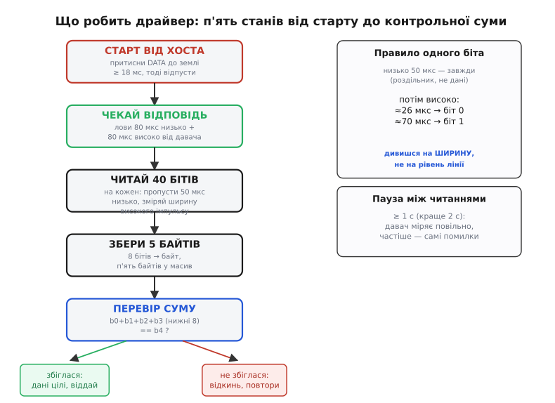
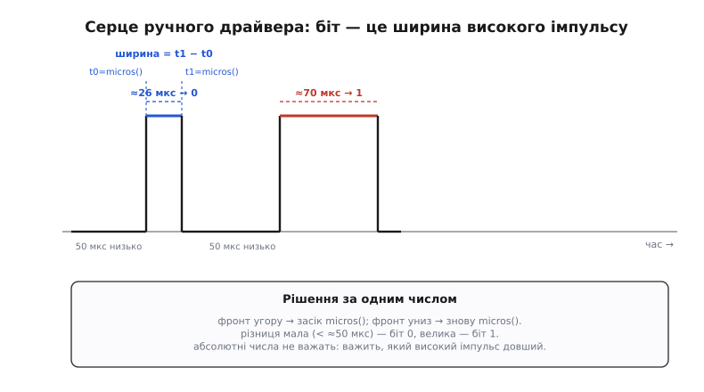

# ⚙️ Читаємо DHT11 із коду: від готової бібліотеки до власного драйвера на мікросекундах

Витягти з DHT11 два числа можна двома дуже різними способами, і корисно пройти обидва. Перший — за півхвилини під'єднати чужу бібліотеку й отримати температуру та вологість двома викликами; так роблять у реальних проєктах, і це правильно. Другий — написати драйвер самому, ловлячи фронти й міряючи мікросекунди голими ніжками. Другий шлях щодня нікому не потрібен, але саме він показує, **що насправді робиться під тими двома викликами**, і без нього ви не зрозумієте ні звідки береться `NAN`, ні чому давач мовчить, ні як його перенести на платформу, під яку готової бібліотеки нема. Тож розберемо обидва — і зробимо це так, щоб код можна було вставити в проєкт і він запрацював.

## Задача

DHT11 говорить власним «однодротовим» протоколом Aosong: не UART, не I²C, не SPI — своя послідовність імпульсів по єдиній лінії DATA. Хост будить давач довгим притисканням лінії до землі, давач відповідає й шле **40 бітів** — п'ять байтів (ціла й дробова вологість, ціла й дробова температура, контрольна сума), де **значення кожного біта закодоване в тривалості високого імпульсу**: короткий (≈26 мкс) — нуль, довгий (≈70 мкс) — одиниця. Опитувати давач можна не частіше ніж раз на секунду.

Це створює для програміста дві окремі задачі. Перша, легка: **скористатися чужим кодом**, що вже вміє все це, і не наламати дров у тих кількох місцях, де новачки таки ламають (перевірка помилки, пауза, тип давача). Друга, повчальна: **зробити все власноруч** — сформувати стартовий імпульс потрібної довжини, дочекатися відповіді, зловити сорок бітів, зміряти ширину кожного високого імпульсу через `micros()`, зібрати байти, перевірити суму. І окремий поворот — **перенести цей ручний драйвер на іншу платформу** (з Arduino на STM32), де немає ні `pinMode`, ні `micros`, а є регістри й лічильники таймера.

## Ідея

Обидва шляхи спираються на ту саму механіку, просто на різній глибині.

**Готова бібліотека** ховає весь тонкий тайминг за фасадом із двох дій: «ініціалізуй давач на цій ніжці» і «дай мені число». Усередині вона робить рівно те, що ми розберемо нижче руками, але ви цього не бачите — і не мусите бачити, поки все працює. Ваша робота зводиться до трьох дрібниць: сказати їй правильний тип давача (DHT11, не DHT22), тримати паузу між читаннями й **перевіряти, чи читання взагалі вдалося**.

**Ручний драйвер** — це маленький скінченний автомат (англ. *state machine* — [машина станів](root:hw-digital/finite-state-machines), система, що по черзі проходить через кілька означених станів), що крокує по фазах протоколу. Уся суть — у вимірюванні часу: замість «читати рівень лінії» ми **засікаємо, скільки лінія трималася високою**, і за цим числом вирішуємо, нуль це чи одиниця.


*Драйвер проходить п'ять станів: розбудити давача стартовим імпульсом, дочекатися його відповіді (80 мкс низько + 80 мкс високо), зловити 40 бітів, зібрати їх у 5 байтів і перевірити контрольну суму. Правило одного біта незмінне: низька частина 50 мкс — завжди роздільник, а значення несе тривалість наступної високої частини.*

Ключова думка, яку варто засвоїти раз і назавжди: **ми дивимося не на рівень лінії, а на ширину імпульсу**. Рівень лінії під час передавання бітів весь час стрибає низько-високо однаково для нуля й для одиниці — відрізняє їх лише те, **як довго** тримається високий стан. Тому серце ручного драйвера — це вимірювання проміжку між двома фронтами.


*Обидва біти виглядають однаково — низька частина, тоді висока. Різниця лише в ширині високої: зловивши фронт угору, засікаємо micros(); зловивши фронт униз, засікаємо ще раз; різниця й каже, нуль це чи одиниця. Абсолютні числа не важать — важить, який високий імпульс довший.*

## Шлях перший: готова бібліотека

Почнемо з того, як це роблять на практиці. Для Arduino стандарт — бібліотека `DHT sensor library` від [Adafruit](https://github.com/adafruit/DHT-sensor-library) (ставиться з менеджера бібліотек; тягне за собою `Adafruit Unified Sensor`). Аналоги є під інші платформи, але API скрізь однакове за суттю: конструктор, `begin()`, `readTemperature()`, `readHumidity()`.

Ось повний робочий кістяк — не фрагмент, а те, що компілюється й крутиться:

```cpp
#include <DHT.h>

#define DHT_PIN   2         // ніжка МК, куди прийшла лінія DATA
#define DHT_TYPE  DHT11     // саме DHT11 — НЕ DHT22 і не AM2302

DHT dht(DHT_PIN, DHT_TYPE);

void setup() {
    Serial.begin(9600);
    dht.begin();            // налаштувати ніжку в потрібний режим
    delay(1500);            // дати давачу очуняти після подачі живлення
}

void loop() {
    delay(2000);            // ≥ 1 с між читаннями; беремо 2 с із запасом

    float h = dht.readHumidity();      // % RH
    float t = dht.readTemperature();   // °C (без аргументу — Цельсій)

    // Давач міг не відповісти — тоді бібліотека повертає NAN.
    // Це не виняток, а звичайний робочий випадок: перевіряти ОБОВ'ЯЗКОВО.
    if (isnan(h) || isnan(t)) {
        Serial.println(F("DHT11 не відповів — пропускаю це читання"));
        return;             // просто чекаємо наступного проходу циклу
    }

    Serial.print(F("Вологість: "));
    Serial.print(h, 0);                // 0 знаків після крапки: DHT11 і так цілі
    Serial.print(F(" %   Температура: "));
    Serial.print(t, 0);
    Serial.println(F(" C"));
}
```

Розберемо, чому кожен рядок саме такий — бо в цих дрібницях і ховаються всі граблі.

**`DHT dht(DHT_PIN, DHT11)`** — тут ви кажете бібліотеці дві речі: на якій ніжці давач і **якого він типу**. Другий аргумент критичний. DHT11 і DHT22 (він же AM2302) мають **однаковий формат кадру** — ті самі п'ять байтів, — але **по-різному упаковують число**. У DHT11 дробові байти завжди нульові, а ціле — це прямо градуси й відсотки. У DHT22 ті самі два байти складаються в 16-бітове число, помножене на 10 (тобто 235 означає 23.5 °C). Тому якщо ви вкажете не той тип, код **скомпілюється й запуститься**, обмін відбудеться, але числа поїдуть у кілька разів — бібліотека розпакує кадр за чужою формулою. Це підступна помилка саме тому, що нічого не «падає».

**`dht.begin()`** налаштовує ніжку (переводить її в потрібний початковий стан) і готує внутрішній стан бібліотеки. Викликається один раз у `setup()`.

**`delay(1500)` у `setup()`** — не забаганка. DHT11 після подачі живлення потребує **близько секунди, щоб зробити перше вимірювання**; спитати його одразу — означає майже гарантовано отримати `NAN`. Півтори секунди паузи прибирають цю проблему на старті.

**`delay(2000)` у циклі** тримає частоту опитування нижче 1 Гц. Це межа самого давача: він міряє повільно, і якщо смикати його частіше, він або віддасть старе значення, або відповість помилкою. Два повних числа щодві секунди — цілком досить для температури в кімнаті, яка все одно не стрибає.

**`isnan(h) || isnan(t)`** — найважливіший рядок у всьому скетчі. Коли давач не відповів (не поставили підтяжку, поганий контакт, спитали надто швидко, наводка збила контрольну суму), бібліотека повертає `NAN` (англ. *not a number* — «не число», спеціальне значення `float`, що означає «результату немає»). Показати його як температуру не можна — вийде сміття. `isnan()` — єдиний спосіб це число впіймати: порівнювати з чимось через `==` марно, бо `NAN` не дорівнює навіть самому собі. Пропустивши це читання, ми спокійно дочекаємося наступного.

> 🔧 **Навіщо це.** Дев'ять із десяти скарг «мій DHT11 показує дурню» знімаються трьома звичками з цього скетча: **правильний тип** у конструкторі, **пауза ≥ 1–2 с** між читаннями й **перевірка `isnan`** після кожного. Давач за своєю природою час від часу пропускає окреме читання — це нормально, і код мусить це переживати мовчки, а не виводити випадкове число. Якщо ви ловите ці три речі, готової бібліотеки для більшості задач цілком досить, і власний драйвер писати не треба.

Одна тонкість про час виконання. Виклик `readHumidity()` чи `readTemperature()` **блокує** мікроконтролер приблизно на **20–25 мілісекунд** — саме стільки триває стартовий імпульс плюс передавання сорока бітів. Для простого скетча це неважливо, але якщо у вас є щось чутливе до часу (свій розбір іншого протоколу, миготіння світлодіодом за таймінгом), пам'ятайте, що на ці мілісекунди все інше стоїть. До того ж бібліотека Adafruit кешує результат: якщо ви викликаєте `readHumidity()` і `readTemperature()` підряд, вона робить лише **один** обмін і віддає обидва числа з нього (за замовчуванням не частіше ніж раз на 2 секунди), тож два виклики поспіль — не два притискання лінії, а одне.

## Шлях другий: власний драйвер на Arduino

Тепер знімемо капот. Напишемо те саме без бібліотеки — щоб побачити кожну затримку й зрозуміти, за що відповідає кожна мікросекунда. Це той код, що дає розуміння; у щоденній роботі беруть бібліотеку, але хто хоч раз написав драйвер сам, той більше не боїться однодротового обміну.

Драйвер складається з двох частин: **розбудити давача** (стартовий імпульс + приймання відповіді) і **зловити 40 бітів** (вимірювання ширини кожного високого імпульсу). Почнемо з повного коду, тоді розберемо його по фазах.

```cpp
#define DHT_PIN 2                 // ніжка з лінією DATA

// Повертає true, якщо читання вдалося; кладе результат у temp/hum.
bool dht11_read(int *temp, int *hum) {
    uint8_t bytes[5] = {0, 0, 0, 0, 0};

    // ── Фаза 1: стартовий імпульс від хоста ──
    pinMode(DHT_PIN, OUTPUT);
    digitalWrite(DHT_PIN, LOW);   // притискаємо лінію до землі
    delay(20);                    // ≥ 18 мс — будимо давача (беремо 20 із запасом)
    digitalWrite(DHT_PIN, HIGH);  // коротко відпускаємо
    delayMicroseconds(30);        // 20–40 мкс, поки давач «прокидається»
    pinMode(DHT_PIN, INPUT_PULLUP); // віддаємо лінію: тепер говорить давач

    // ── Фаза 2: чекаємо відповідь давача (80 мкс низько + 80 мкс високо) ──
    if (!wait_level(LOW,  100)) return false;  // давач притиснув лінію
    if (!wait_level(HIGH, 100)) return false;  // давач відпустив (80 мкс низько)
    if (!wait_level(LOW,  100)) return false;  // кінець 80 мкс високо — старт даних

    // ── Фаза 3: 40 бітів, значення = ширина високого імпульсу ──
    for (int i = 0; i < 40; i++) {
        if (!wait_level(HIGH, 100)) return false;  // пропускаємо 50 мкс низько
        uint32_t t0 = micros();                    // фронт угору — засікли час
        if (!wait_level(LOW, 100)) return false;   // чекаємо фронт униз
        uint32_t width = micros() - t0;            // ширина високого імпульсу

        // ширина ~26 мкс → 0, ~70 мкс → 1; поріг посередині (~50 мкс)
        bytes[i / 8] <<= 1;                         // звільняємо місце під новий біт
        if (width > 50) bytes[i / 8] |= 1;          // довгий імпульс → одиниця
    }

    // ── Фаза 4: контрольна сума ──
    uint8_t sum = bytes[0] + bytes[1] + bytes[2] + bytes[3];
    if (sum != bytes[4]) return false;             // не збіглося — читання зіпсоване

    *hum  = bytes[0];   // ціла частина вологості (байт 2 у DHT11 завжди 0)
    *temp = bytes[2];   // ціла частина температури (байт 4 завжди 0)
    return true;
}
```

Помічник `wait_level` — це той шматок, що чекає, поки лінія набуде потрібного рівня, і **не дає програмі зависнути навіки**, якщо давач замовк:

```cpp
// Чекає, поки на ніжці з'явиться рівень level, але не довше за timeout (мкс).
// Повертає true, якщо дочекалися; false — якщо вийшов час (давач не відповів).
bool wait_level(int level, uint32_t timeout) {
    uint32_t start = micros();
    while (digitalRead(DHT_PIN) != level) {
        if (micros() - start > timeout) return false;  // захист від зависання
    }
    return true;
}
```

Тепер пройдімо по фазах і зрозуміймо **кожну затримку** — саме в них уся суть, і саме їх новачки ставлять навмання.

**Фаза 1, `delay(20)`.** Ми переводимо ніжку у вихід, притискаємо лінію до землі й **тримаємо низько 20 мілісекунд**. Це і є стартова команда «прокинься». Датащит вимагає **щонайменше 18 мс**; ми беремо 20 із запасом, бо піти *довше* можна, а от коротше — ні: якщо притиснути менш як на 18 мс, давач не впізнає старт і не відповість. Це найдовша пауза в усьому обміні, і вона єдина міряється мілісекундами, а не мікросекундами — решта протоколу летить у сотні разів швидше.

**Фаза 1, `delayMicroseconds(30)`.** Відпустивши лінію (перевівши в `HIGH`), ми чекаємо **20–40 мкс**, поки давач «отямиться» й почне відповідати. Беремо 30 — середину діапазону. Одразу після цього переводимо ніжку у **вхід із підтяжкою** (`INPUT_PULLUP`): віддаємо лінію давачу, і тепер притискати її до землі буде вже він. Підтяжка потрібна, щоб між імпульсами лінія сама поверталася вгору.

> 🔧 **Навіщо це.** `INPUT_PULLUP` тут вмикає **внутрішню** підтяжку мікроконтролера (≈20–50 кОм). На голому 4-піновому сенсорі вона допомагає, але надійніше все одно поставити **зовнішній** резистор 4.7–10 кОм: внутрішня заслабка для довших ліній і швидких фронтів, і на ній читання починають збоїти. На трипіновому модулі зовнішня підтяжка вже стоїть на платі — тоді `INPUT_PULLUP` просто вмикає ще одну паралельно, це не шкодить.

**Фаза 2, три очікування рівня.** Прокинувшись, давач сам притискає лінію низько на **80 мкс**, тоді відпускає й тримає високо ще **80 мкс** — це його «чую тебе, готуюся». Ми не міряємо ці 80 мкс точно, нам вистачає **дочекатися переходів**: спершу лінія падає (давач притиснув), потім піднімається (кінець 80 мкс низько), потім знову падає (кінець 80 мкс високо — і одразу починається перший біт). Кожне очікування захищене таймаутом 100 мкс: якщо давача нема або він завис, `wait_level` поверне `false`, і вся функція чесно скаже «не вдалося», а не зависне назавжди.

**Фаза 3, серце драйвера.** Сорок разів поспіль ми робимо те саме. Кожен біт починається з **50 мкс низько** — це роздільник, він однаковий для нуля й одиниці, тож ми просто чекаємо, поки лінія підніметься (`wait_level(HIGH, ...)`). Щойно вона піднялася — **засікаємо `micros()`** у `t0`. Тепер чекаємо, поки лінія впаде (`wait_level(LOW, ...)`), і **знову засікаємо `micros()`**. Різниця `micros() - t0` — це **ширина високого імпульсу**. Далі рішення: якщо ширина більша за поріг (беремо 50 мкс — акурат між 26 і 70), це **одиниця**, інакше **нуль**.

Складання байтів варте окремого погляду. `bytes[i / 8]` вибирає, у який із п'яти байтів іде поточний біт: біти 0–7 — у байт 0, біти 8–15 — у байт 1, і так далі. `bytes[i / 8] <<= 1` **зсуває вже накопичені біти вліво**, звільняючи наймолодшу позицію під новий; `if (width > 50) bytes[i / 8] |= 1` **ставить одиницю** в цю позицію, якщо імпульс довгий (нуль ставити не треба — зсув уже поклав туди нуль). Так, біт за бітом, старший приходить першим, і байт збирається в правильному порядку. Це та сама техніка «зсунув і вкинув біт», що й у будь-якому [побітовому збиранні числа](root:hw-digital/basic-gates/proj-bitwise-c.md).

**Фаза 4, контрольна сума.** Склавши всі п'ять байтів, беремо **суму перших чотирьох** і порівнюємо з п'ятим. Тут ховається приємна дрібниця: датащит каже брати «нижні 8 бітів суми», але оскільки `sum` оголошено як `uint8_t` (8-бітове без знаку), воно **саме собою** обрізається до восьми бітів при переповненні — тобто арифметика по модулю 256 виходить безкоштовно, нічого додатково маскувати не треба. Збіглося — дані цілі, розкладаємо їх (вологість — байт 0, температура — байт 2; дробові байти 1 і 3 у DHT11 нульові, тож їх ігноруємо). Не збіглося — повертаємо `false`, і код нагорі просто спитає давача ще раз.

Виклик у скетчі виходить чистий:

```cpp
void setup() {
    Serial.begin(9600);
    delay(1500);                  // даємо давачу очуняти після ввімкнення
}

void loop() {
    int t, h;
    if (dht11_read(&t, &h)) {
        Serial.print(F("T = ")); Serial.print(t);
        Serial.print(F(" C, RH = ")); Serial.print(h); Serial.println(F(" %"));
    } else {
        Serial.println(F("читання не вдалося — повторю"));
    }
    delay(2000);                  // ≥ 1 с між читаннями
}
```

> 🔧 **Навіщо це.** Зверніть увагу, як **таймаути** в `wait_level` роблять драйвер надійним. Без них перше ж мовчання давача (висмикнули дріт, поганий контакт) підвісило б `while` навіки, і весь мікроконтролер став би колом. З таймаутом драйвер за частку мілісекунди здається, повертає `false`, і система живе далі — покаже «читання не вдалося» й спробує наступного разу. **Ніколи не пишіть очікування рівня без стелі за часом** — це різниця між прошивкою, що переживе відключений давач, і тією, що від нього зависає.

Одне важливе застереження до цього коду. Він **міряє час, і поки міряє, ядро зайняте лише цим**. Якщо посеред приймання біта втрутиться [переривання](root:hw-arch/interrupts) (наприклад, системний таймер Arduino, що тікає у фоні), воно **розтягне вимірювання** одного імпульсу на кілька мікросекунд — і біт може зчитатися не так. На щастя, поріг у нас із великим запасом (50 мкс між 26 і 70), тож коротке переривання зазвичай не перекине рішення. Але якщо читання систематично збоять, а електрика в порядку — варто **заборонити переривання** на час приймання кадру (`noInterrupts()` перед обміном, `interrupts()` після). Ціна — ті самі ~25 мс усе інше стоїть; для термометра прийнятно.

## Шлях третій: той самий драйвер на STM32

Тепер найцікавіше для розуміння — **перенести драйвер на іншу платформу**. Візьмемо STM32 (лінійка мікроконтролерів на ядрі ARM Cortex-M від STMicroelectronics), який часто програмують не через Arduino, а через бібліотеку HAL (англ. *hardware abstraction layer* — [шар абстракції заліза](root:sys-dron/ardupilot-layers), проміжок між кодом і регістрами) від виробника. Функції інші, але **логіка й усі затримки — ті самі**: протокол же належить давачу, а не платформі. Це чудова ілюстрація того, що драйвер — це послідовність станів у часі, і його можна відтворити на будь-якому залізі, що вміє смикати ніжку й міряти мікросекунди.

Дві речі на STM32 влаштовані інакше, ніж на Arduino, і саме їх треба замінити.

**Перше — напрямок ніжки міняється не `pinMode`, а перенастроюванням регістра.** На Arduino ми легко перемикали ніжку між виходом і входом. На STM32 те саме роблять через HAL, перенастроюючи вивід (`GPIO_MODE_OUTPUT_PP` для виходу, `GPIO_MODE_INPUT` для входу). Це трохи багатослівніше, але суть та сама: спершу ми женемо лінію (вихід), тоді слухаємо (вхід).

**Друге — і головне — немає готового `micros()`.** Arduino дає його з коробки; на STM32 мікросекундний час треба **організувати самому**. Найпоширеніший спосіб — узяти вільний **апаратний таймер** і налаштувати його так, щоб він тікав рівно раз на мікросекунду; тоді його лічильник — це і є наш `micros()`. Ось як це заводять:

```c
// Припускаємо: TIM2 налаштований у CubeMX так, щоб тікати раз на 1 мкс.
// Для цього Prescaler = (частота_шини_таймера в МГц) − 1.
// Напр. якщо TIM2 живиться від 72 МГц → Prescaler = 71,
// тоді лічильник збільшується на 1 кожну мікросекунду.

static inline uint32_t micros(void) {
    return __HAL_TIM_GET_COUNTER(&htim2);   // лічильник = мікросекунди
}

// Затримка в мікросекундах через той самий таймер.
static void delay_us(uint32_t us) {
    uint32_t start = __HAL_TIM_GET_COUNTER(&htim2);
    while ((uint32_t)(__HAL_TIM_GET_COUNTER(&htim2) - start) < us) { }
}
```

Тут ховається важлива думка, яку легко проґавити. **Чому `Prescaler = частота_в_МГц − 1`?** Дільник (англ. *prescaler* — [подільник частоти](root:hw-digital/counters), що ділить вхідні такти перед лічильником) ділить тактову частоту таймера на `Prescaler + 1`. Якщо таймер живиться від 72 МГц і ми хочемо, щоб лічильник цокав раз на мікросекунду (тобто на 1 МГц), треба поділити 72 на 72 — звідси `Prescaler + 1 = 72`, тобто `Prescaler = 71`. Візьмете інше число — і весь ваш час «попливе»: пороги 26/70 мкс перестануть відповідати реальним імпульсам, і драйвер читатиме сміття. Тому **перша річ, яку перевіряють**, коли ручний драйвер на STM32 не працює, — чи справді таймер тікає раз на мікросекунду.

> 🔧 **Навіщо це.** Це головний урок переносу драйвера: **протокол не змінився, змінилася лише «лінійка часу»**. На Arduino мікросекунди дає система, на STM32 ви будуєте їх із таймера, десь-інде — з лічильника циклів ядра. Але щойно ви маєте чесний `micros()` і спосіб смикати ніжку, **решта коду переноситься майже дослівно** — ті самі фази, ті самі затримки 18 мс / 30 мкс / поріг 50 мкс, та сама контрольна сума. Зрозумівши це, ви перенесете DHT11 (та й будь-який часовий протокол) на будь-яке залізо.

Сам драйвер на STM32 з HAL виглядає так — порівняйте його з Arduino-версією рядок у рядок, фази ідентичні:

```c
#define DHT_PORT  GPIOA
#define DHT_PIN   GPIO_PIN_1

// Перемкнути ніжку у вихід (push-pull) або у вхід.
static void dht_output(void) {
    GPIO_InitTypeDef g = {0};
    g.Pin = DHT_PIN;  g.Mode = GPIO_MODE_OUTPUT_PP;
    g.Pull = GPIO_NOPULL;  g.Speed = GPIO_SPEED_FREQ_LOW;
    HAL_GPIO_Init(DHT_PORT, &g);
}
static void dht_input(void) {
    GPIO_InitTypeDef g = {0};
    g.Pin = DHT_PIN;  g.Mode = GPIO_MODE_INPUT;
    g.Pull = GPIO_PULLUP;   // внутрішня підтяжка (зовнішній резистор усе одно бажаний)
    HAL_GPIO_Init(DHT_PORT, &g);
}

static inline int dht_get(void) {   // прочитати рівень лінії: 1 або 0
    return HAL_GPIO_ReadPin(DHT_PORT, DHT_PIN) == GPIO_PIN_SET;
}

// Чекати рівень level не довше timeout мкс; 1 — дочекалися, 0 — вийшов час.
static int wait_level(int level, uint32_t timeout) {
    uint32_t start = micros();
    while (dht_get() != level) {
        if ((uint32_t)(micros() - start) > timeout) return 0;
    }
    return 1;
}

// Читання. Повертає 1 при успіху; результат — у *temp, *hum.
int dht11_read(int *temp, int *hum) {
    uint8_t bytes[5] = {0, 0, 0, 0, 0};

    // ── Фаза 1: стартовий імпульс ──
    dht_output();
    HAL_GPIO_WritePin(DHT_PORT, DHT_PIN, GPIO_PIN_RESET); // притиснули низько
    HAL_Delay(20);                                        // ≥ 18 мс (мілісекунди!)
    HAL_GPIO_WritePin(DHT_PORT, DHT_PIN, GPIO_PIN_SET);   // відпустили
    delay_us(30);                                         // 20–40 мкс
    dht_input();                                          // віддали лінію давачу

    // ── Фаза 2: відповідь давача (80 мкс низько + 80 мкс високо) ──
    if (!wait_level(0, 100)) return 0;
    if (!wait_level(1, 100)) return 0;
    if (!wait_level(0, 100)) return 0;

    // ── Фаза 3: 40 бітів ──
    for (int i = 0; i < 40; i++) {
        if (!wait_level(1, 100)) return 0;   // пропустили 50 мкс низько
        uint32_t t0 = micros();
        if (!wait_level(0, 100)) return 0;   // дочекалися фронту вниз
        uint32_t width = micros() - t0;      // ширина високого імпульсу

        bytes[i / 8] <<= 1;
        if (width > 50) bytes[i / 8] |= 1;   // довгий → 1
    }

    // ── Фаза 4: контрольна сума ──
    if ((uint8_t)(bytes[0] + bytes[1] + bytes[2] + bytes[3]) != bytes[4])
        return 0;

    *hum  = bytes[0];
    *temp = bytes[2];
    return 1;
}
```

Це той самий скінченний автомат — ті самі п'ять станів, ті самі числа 20 мс, 30 мкс, поріг 50 мкс, та сама сума по модулю 256. Змінилися лише **імена інструментів**: `pinMode` став парою `dht_output`/`dht_input`, `digitalWrite` — `HAL_GPIO_WritePin`, `digitalRead` — `HAL_GPIO_ReadPin`, а `micros()` ми змайстрували з таймера. Логіка ж — власність протоколу, і вона незмінна.

Одна платформна тонкість, про яку варто знати: STM32 буває значно **швидший** за Arduino (десятки й сотні мегагерц проти 16), тож його порожні цикли очікування крутяться дуже щільно — це добре для точності вимірювання. Але той самий факт означає, що звичайні `micros()`-затримки на швидкому ядрі точніші, ніж на повільному, де сам виклик функції з'їдає помітну частку мікросекунди. Для DHT11 із його широкими порогами (50 мкс запасу) це не проблема ні там, ні там, але для строгіших протоколів різниця платформ стає відчутною.

## Складність і пастки

Зберемо в одному місці все, на чому губиться час із власним драйвером DHT11 — і те, що болить незалежно від того, свій код чи бібліотека.

**Стартовий імпульс закороткий.** Найчастіша помилка ручного драйвера: людина ставить `delay(1)` чи `delayMicroseconds(500)` замість повних **≥ 18 мс**. Давач не впізнає такий короткий старт і мовчить — усі наступні очікування падають у таймаут. Тримайте старт **не менш як 18 мс** (беріть 20 із запасом); довше — можна, коротше — ні.

**Очікування без таймауту зависає систему.** Якщо писати `while (digitalRead(pin) != level) { }` без стелі за часом, то перше ж мовчання давача (від'єднали дріт, поганий контакт) підвісить мікроконтролер назавжди. **Кожне** очікування рівня мусить мати таймаут і чесно повертати «не вдалося». Це різниця між прошивкою, що переживає відключений давач, і тією, що від нього намертво зависає.

**Плутанина одиниці й нуля через поріг.** Значення біта — у ширині високого імпульсу: ~26 мкс це нуль, ~70 мкс це одиниця. Поріг беруть **посередині** (≈50 мкс): ширше — одиниця, вужче — нуль. Якщо поставити поріг надто близько до 26 або до 70, шум чи переривання перекинуть окремі біти, і контрольна сума не збіжеться. Середина діапазону дає найбільший запас.

**«Попливлий» час на STM32.** Якщо ручний драйвер на STM32 читає суцільне сміття, а електрика в порядку — майже завжди винен **неправильно налаштований таймер**: лічильник тікає не раз на мікросекунду. Перевірте `Prescaler` (має бути `частота_таймера_в_МГц − 1`) і що таймер узагалі запущено (`HAL_TIM_Base_Start`). Поки `micros()` бреше, усі пороги 26/70 мкс безглузді.

**Немає підтяжки на голому сенсорі.** Це болить однаково і з бібліотекою, і з власним драйвером: 4-піновий голий DHT11 без зовнішнього резистора підтяжки на лінії DATA просто не виходить на зв'язок — лінія висить у повітрі. `INPUT_PULLUP` (внутрішня підтяжка) інколи рятує на коротких проводах, але надійний шлях — **зовнішній резистор 4.7–10 кОм** між DATA і VCC. Трипіновий модуль цей резистор уже має на платі.

**Опитування частіше ніж раз на секунду.** DHT11 фізично міряє повільно; спитаєте його кілька разів на секунду — отримаєте старе значення або помилку, а не свіжіші дані. Тримайте **≥ 1 с** (краще 2 с) між читаннями. Це стосується обох шляхів однаково.

**Читання одразу після ввімкнення.** Давачу треба **близько секунди після подачі живлення**, щоб зробити перше вимірювання. Спитаєте його в перший момент `setup()` — майже напевно отримаєте `NAN` (з бібліотекою) або таймаут (зі своїм драйвером). Дайте секунду-дві паузи на старті.

**Переривання розтягують вимірювання.** Якщо системне [переривання](root:hw-arch/interrupts) вклиниться посеред приймання біта, воно додасть кілька мікросекунд до виміряної ширини. Широкий поріг (50 мкс) зазвичай це прощає, але якщо читання систематично збоять при справній електриці — **забороніть переривання** на час приймання кадру (`noInterrupts()`/`interrupts()` на Arduino, `__disable_irq()`/`__enable_irq()` на STM32). Ціна — ~25 мс, поки все інше стоїть.

**Не той тип у бібліотеці (DHT11 ↔ DHT22).** Найпідступніша, бо нічого не падає: код компілюється, обмін іде, а числа неправильні. DHT11 і DHT22 мають однаковий кадр, але різну упаковку числа. Для DHT11 у конструкторі має стояти саме `DHT11`, а не `DHT22`/`AM2302`. У власному драйвері цієї пастки немає — там ви самі розкладаєте байти, — але з'являється дзеркальна: якщо колись переведете код на DHT22, доведеться **змінити розпакування** (у DHT22 два байти складаються в число × 10, і температура буває від'ємна, тож старший біт — це знак).

**Довгий провід псує кадр.** Однодротовий обмін чутливий до довжини лінії й наводок. На проводі понад метр без екрана контрольна сума починає не збігатися — і бібліотека віддасть `NAN`, і власний драйвер поверне «не вдалося». Тримайте DATA-провід коротким; треба далеко — зменшуйте опір підтяжки, беріть екранований кабель або виносьте подалі сам мікроконтролер, а не давача.

Підсумок простий. Для реального проєкту беріть **готову бібліотеку** й ловіть три речі: правильний тип, паузу ≥ 1 с, перевірку `isnan`. Власний драйвер пишіть, коли хочете **зрозуміти протокол** або **перенести його туди, де бібліотеки нема**, — і тоді пам'ятайте, що вся суть у чесному `micros()`, широкому порозі 50 мкс і таймаутах на кожному очікуванні. А головне, що варто винести: цей драйвер — не магія, а маленький автомат, що крокує по фазах протоколу й **міряє ширину імпульсів**; зрозумівши це на DHT11, ви впораєтеся з будь-яким часовим однодротовим давачем.
