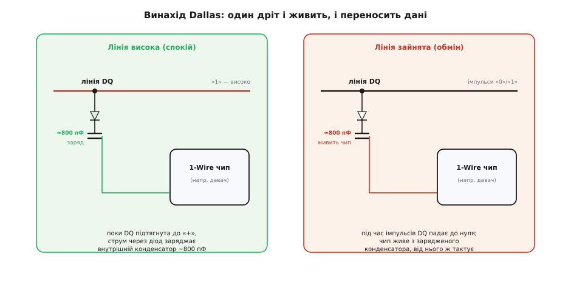
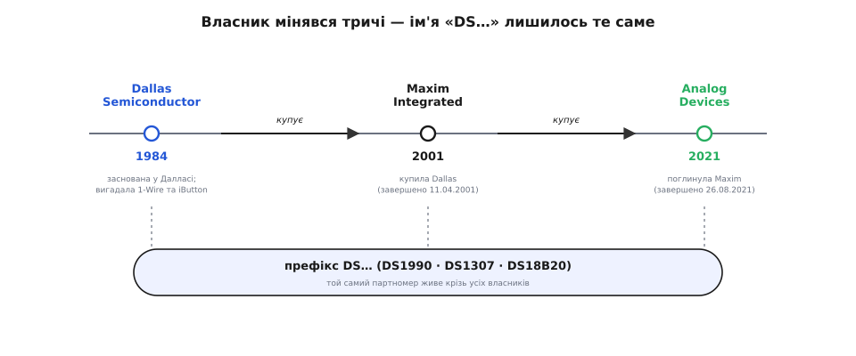

# 📜 Один дріт на все: як Dallas Semiconductor і чому досі «DS»

Візьміть у руку DS18B20 і подивіться на ім'я. Літери «DS» — це ініціали компанії, якої вже двадцять із гаком років немає: **Dallas Semiconductor**. Число після них присвоєно за правилами тієї самої фірми. А випускає давач сьогодні зовсім інша, третя за рахунком корпорація на іншому кінці країни. Ім'я пережило свого власника — і не одного. Це не випадковість і не сентиментальність: за трьома літерами стоїть конкретний інженерний винахід, який виявився настільки вдалим, що його назва стала для покупця важливішою за назву того, хто його зараз штампує.

Розберімо цю історію по-справжньому — не «фірма зробила чип», а *що саме* довелося вигадати, *чому* саме ця дрібна техаська компанія, і *чому* її ім'я досі живе на пластиковому корпусі давача, попри дві поглинальні угоди на мільярди доларів.

## Дивина, з якої все почалося: провід, що робить дві роботи

Щоб оцінити винахід, треба спершу побачити, що в ньому дивного. Будь-який цифровий пристрій традиційно потребує **щонайменше трьох проводів**: живлення («плюс»), землю («мінус») і хоча б одну лінію сигналу. Це здається законом природи — адже сигнал це зміна напруги, а щоб напрузі було відносно чого мінятися, потрібне стабільне живлення поряд. Заберіть у мікросхеми живлення — і їй нічим думати; заберіть сигнальну лінію — і вона німа. Три дроти — це, здавалося, мінімум, нижче якого не опустишся.

Dallas Semiconductor опустилася. Наприкінці 1980-х її інженери зробили шину, у якій **один-єдиний провід** (плюс спільна земля, яку часто й так уже проклали) переносить **і живлення, і дані одночасно**. Вони назвали її **1-Wire** — «один дріт». І фокус тут не словесний: пристрій справді живиться з тієї самої лінії, якою слухає команди й відповідає.

Як таке взагалі можливо? Ключ — у тому, що дані по цифровій лінії йдуть **не безперервно, а короткими поштовхами**, і між поштовхами лінія довго стоїть у високому стані. Ось цю паузу давач і використовує. Ідея елегантна до нахабства.



*Секрет «одного дроту» — крихітний конденсатор усередині чипа. Поки лінія підтягнута до «+» (спокій), струм через діод заряджає цей конденсатор. Коли починається обмін і лінія падає до нуля імпульсами, чип відрізаний від зовнішнього живлення — але живе з накопиченого заряду. Дані й живлення поділяють одну й ту саму лінію в часі, а не в просторі.*

Причинний ланцюжок такий. Лінію в спокої тримає високою [підтяжка](topic:hw-digital/floating-pullups) до «плюса». Поки вона висока, усередині кожного 1-Wire-пристрою струм через діод **заряджає крихітний конденсатор** — близько 800 пФ. Це його особистий запас енергії. Коли майстер шини починає обмін, він **притягує лінію до нуля** короткими імпульсами (так кодуються біти) — і на ці мікросекунди пристрій відрізаний від зовнішнього «плюса». Але він не гасне: він живе з того самого конденсатора, який щойно зарядив, і навіть тактується від нього. Щойно імпульс минув і лінія знову піднялась — конденсатор доливається. Пристрій балансує на межі, як людина, що дихає лише у паузах власної розмови, — і саме тому «один дріт» не міф, а робоча інженерія.

> 🔧 **Навіщо це.** Ось чому паразитне живлення DS18B20 — не химерна опція, а **пряма спадкоємиця засадничої ідеї 1-Wire**. Коли ви з'єднуєте VDD давача з землею й живите його «з даних», ви користуєтеся рівно тим механізмом, який Dallas закладала в шину від початку: конденсатор усередині кристала, що заряджається в паузах. І звідси ж ростуть усі його примхи — потреба в сильній підтяжці на час перетворення (коли струму треба більше, ніж дає тонкий резистор), збої при кількох давачах на слабкому живленні. Розуміючи *чому* так задумано, ви перестаєте боротися з давачем і починаєте йому підігравати.

Але сама по собі «економія дроту» — недостатня причина, щоб винаходити цілу шину. За нею стояла конкретна, дуже приземлена задача.

## Задача, що народила шину: як напхати пам'ять у монетку

Dallas Semiconductor не сиділа й не мріяла про красиві протоколи. Вона хотіла продати **носій даних розміром із ґудзик** — і саме ця мета продиктувала «один дріт».

Уявіть, що ви робите електронний ключ чи бирку: крихітну сталеву монетку, всередині якої мікросхема пам'яті. Людина торкається нею зчитувача — і той читає, що записано. Скільки контактів має бути в такої монетки? Кожен зайвий контакт — це складніший корпус, складніший зчитувач, гірший контакт при дотику, дорожче виробництво. Ідеал — **один контакт плюс корпус**. Корпус монетки (її сталеве тіло) стає землею, а весь обмін і живлення мусять пройти через **єдину другу точку дотику**. Ось де три дроти — розкіш, якої нема куди подіти: у монетки фізично немає місця на три виводи.

Саме ця конструктивна межа й породила 1-Wire. Шину зробили **не «щоб гарно», а щоб мікросхема з єдиним сигнальним контактом могла і живитися, і говорити**. Технічний винахід тут — прямий наслідок форм-фактора монетки, а не абстрактна елегантність.

Із цієї монетки виросла ціла родина продуктів, яку Dallas назвала спершу **Touch Memory** («пам'ять від дотику»), а згодом перебрендувала на славнозвісний **iButton**. Розберімо назви чесно, бо навколо них плутанина.

**Touch Memory** Dallas представила **1991 року** — і сама розповідала, що ідею підгледіла в канцелярських наліпок Post-it: мікросхему запакували в **сталевий корпус завбільшки з монету в п'ять центів**, а на зворот наклеїли смужку клею, щоб бирку можна було приліпити до чого завгодно — від товару на конвеєрі до перепустки працівника. *(Дату 1991 і «нікелевий» розмір узгоджено подають кілька незалежних історій компанії — статус: усталено.)*

**iButton** — це та сама лінійка під пізнішою маркою (*button* — «ґудзик»), у міцному корпусі з нержавіючої сталі, схожому на батарейку-таблетку 16 мм. Перше покоління вийшло близько **1992 року**, і одне з найяскравіших його застосувань — **електронний гаманець**: у монетку записували гроші, і нею платили за проїзд у транспорті — зокрема в Туреччині та інших країнах. До **1999 року** Dallas відвантажила понад **30 мільйонів** таких носіїв під маркою iButton, а за весь час їх продано більш ніж **130 мільйонів** по світу. *(Числа 30 млн до 1999-го й 130 млн загалом, як і транспортне застосування в Туреччині, наводять галузеві історії Dallas — статус: усталено. Точний рік першого iButton у джерелах трохи плаває між 1991 і 1992 — розрізняймо: сама технологія Touch Memory — 1991, бренд iButton першого покоління — приблизно 1992.)*

> 🔧 **Навіщо це.** Ця монеткова родина — не бічний сюжет, а **корінь, з якого росте DS18B20**. Той самий 64-бітний код, яким ви адресуєте десяток давачів на спільній шині, придумали не для термометрів — його придумали, щоб **кожна монетка-ключ мала унікальний серійний номер**, як номер банкноти чи паспорта. Електронний ключ безглуздий, якщо два ключі однакові; тому Dallas вшивала в кожен виріб неповторний код ще на заводі. Термометр DS18B20 просто **успадкував цю рису** — і завдяки їй ви можете повісити тридцять давачів на один дріт. Історія монетки прямо пояснює, чому ваш давач уміє те, що вміє.

## Хто це зробив: техасці, що пішли з Mostek

За абревіатурою «DS» стоять живі люди, і варто назвати їх точно, бо навколо технічних історій легко наростають безіменні «інженери компанії».

Dallas Semiconductor заснували **1984 року** в місті **Даллас** (штат Техас, США) — звідси й ім'я. Головна постать — **Він Протро** (*C. Vincent «Vin» Prothro*), американський підприємець, який до того, з 1977 по 1982 рік, був президентом і згодом виконавчим директором іншої техаської напівпровідникової фірми — **Mostek**, піонера мікросхем пам'яті. Разом із ним компанію збирали **колишні колеги з Mostek**: доктор **Чао Ч. Май** (*Chao C. Mai*) і **Майкл Л. Болан** (*Michael L. Bolan*), обидва теж вихідці з Mostek, а роль президента й операційного директора взяв венчурний інвестор **Джон В. Сміт-молодший** (*John W. Smith, Jr.*). *(Склад засновників і зв'язок із Mostek підтверджують кілька незалежних історій компанії — статус: усталено.)*

Деталь, що з Mostek, — не дрібниця, а пояснення характеру фірми. Mostek була **майстром пам'яті** — динамічної RAM, енергонезалежних комірок, точної роботи з кремнієм. Люди, які вийшли звідти й заснували Dallas, принесли з собою саме цю ДНК: **пам'ять і мікс аналогового з цифровим**. Не дивно, що першими їхніми хітами стали не процесори, а **годинники реального часу з батарейкою** (ті, що тримають дату в комп'ютері, коли він вимкнений) і **енергонезалежна RAM** — мікросхеми, у яких Dallas на роки стала ринковим лідером. Той самий фах — «зберегти дані в крихітному кремнії й не загубити» — природно привів до монеток-носіїв, а від них до 1-Wire.

Був у ранньої Dallas і свідомий принцип, який Болан сформулював ще 1985 року приблизно так: «Наша головна обіцянка — **не закохуватися в жоден один продукт**». Компанія навмисне тримала широкий асортимент, щоб не залежати від однієї вдалої мікросхеми. Ця настанова теж лишила слід: замість одного «чарівного» чипа Dallas вибудувала **цілі родини** дрібних корисних приладів під спільним префіксом — і серед них згодом опинилися цифрові термометри.

> 🔧 **Навіщо це.** Розрізняти, *хто саме* що зробив, — та сама дисципліна, що рятує від імперських «фірма-геній зробила все» міфів. Тут вона проста й чесна: конкретна техаська компанія, конкретні люди з конкретним минулим у пам'яті-мікросхемах, конкретна ринкова задача (монетка-носій). Жодної легенди, жодного «геніального одинака» — інженерна робота команди з ясним фахом. Коли наступного разу почуєте «цей протокол винайшли в такій-то країні», згадайте, як корисно замість країни назвати компанію, місто й прізвища — і перевірити їх.

## Родина «DS»: чому термометр опинився серед ключів

Тепер стає видно, звідки взявся сам DS18B20 і чому він поділяє шину з електронними ключами.

Маючи вже готову шину 1-Wire і культуру «багато дрібних приладів під спільним іменем», Dallas почала **вішати на цю шину що завгодно корисне**. Логіка була залізна: якщо ми навчилися одним дротом адресувати й живити мікросхему з унікальним кодом — то на цей дріт можна повісити не лише пам'ять, а й **давачі**. І пішла лінійка приладів із префіксом **DS**, де перші цифри часто натякали на рід:

```
DS1990   — Serial Number iButton: монетка з унікальним 64-бітним кодом
DS1307   — годинник реального часу (RTC), знайомий кожному ардуїнщику
DS1820 / DS18S20 / DS18B20  — цифрові термометри на 1-Wire
DS2401   — просто «кремнієвий серійний номер» у корпусі транзистора
```

Придивіться до цього ряду — і DS18B20 перестає бути дивиною. Він **не «термометр, який чомусь говорить дивною шиною»**, а природний член родини, де кожен виріб має вшитий код і живе на одному дроті. Термометр тут — просто монетка-носій, у яку замість гаманця поклали давач температури. Уся інфраструктура (шина, адресація, [контрольна сума](topic:com-modulation/crc), паразитне живлення) вже існувала — лишалося додати чутливий елемент і АЦП.

Префікс «DS» розшифровується прямо: **D**allas **S**emiconductor. Це не таємничий код і не абревіатура функції — це ініціали фірми, приліплені до кожного її виробу, як фабричне клеймо. І саме тому він такий живучий: клеймо не міняють від того, що фабрику продали.

> 🔧 **Навіщо це.** Знати родину «DS» практично корисно, бо ці чипи **досі повсюдні** і часто трапляються разом. Той самий годинник DS1307 і термометр DS18B20 — рідні брати одного роду, з однією логікою іменування й спільним походженням. Побачивши «DS» на початку партномера, ви одразу знаєте його родовід: це спадок Dallas Semiconductor, з великою ймовірністю — щось із 1-Wire-світу або сусіднього. Ім'я несе інформацію.

## Ім'я, що пережило власника: Dallas → Maxim → Analog Devices

Найцікавіше в цій історії — те, що назви фірми давно немає, а її клеймо живе. Проведімо корпоративну нитку точно, за датами.



*Власник змінювався тричі, а партномер лишався той самий. Dallas Semiconductor заснували 1984-го; Maxim Integrated купила її 2001-го; Analog Devices поглинула Maxim 2021-го. Крізь усі три епохи наскрізною ниткою проходить префікс «DS…» — DS1990, DS1307, DS18B20, — бо переучувати ринок на нове ім'я дорожче, ніж лишити старе клеймо.*

**Maxim Integrated купує Dallas (2001).** Угоду оголосили **29 січня 2001 року**: каліфорнійська **Maxim Integrated Products** купувала Dallas Semiconductor приблизно за **2.5 мільярда доларів** — обміном акцій (кожна акція Dallas ставала 0.6515 акції Maxim). Угоду **завершили 11 квітня 2001 року**, і акції Dallas перестали торгуватися на Нью-Йоркській біржі. *(Обидві дати й сума підтверджені корпоративними документами угоди й тогочасними галузевими виданнями — статус: усталено.)* Maxim купувала не лише продукти, а й фах Dallas у цифровому та мікс-сигнальному CMOS-дизайні й додаткову фабрику. З того моменту 1-Wire-чипи стали випускати під маркою **Maxim** — але зі **старими партномерами DS**, бо інженери й покупці по всьому світу вже знали ці номери напам'ять, і міняти їх означало б посіяти хаос у документації, коді й складах.

**Analog Devices поглинає Maxim (2020–2021).** Через два десятиліття Maxim сама стала здобиччю. **13 липня 2020 року** велика напівпровідникова корпорація **Analog Devices** (ADI) оголосила про об'єднання з Maxim — цілковито обміном акцій, оцінивши об'єднану компанію в десятки мільярдів. Угоду **завершили 26 серпня 2021 року**. *(Дата оголошення й дата закриття підтверджені корпоративними повідомленнями обох компаній — статус: усталено.)* Так Dallas Semiconductor, поглинена Maxim ще 2001-го, разом із нею дісталась Analog Devices. Сьогодні на офіційних сторінках і даташитах DS18B20 стоїть **Analog Devices** — третій за рахунком власник імені «DS».

Чому ж через дві угоди й майже сорок років ім'я **DS18B20** не змінилося ні на літеру? Причина суто практична, і вона повчальна. Партномер у світі електроніки — це **контракт**: під ним закріплено даташит, поведінку, цоколівку, а головне — **гори чужого коду, друкованих плат, специфікацій і складських каталогів**, що посилаються саме на ці символи. Мільйони пристроїв у світі містять рядок `DS18B20` у своїй прошивці й документації. Перейменувати чип означало б змусити весь цей світ переписатися — заради чого? Ім'я працює, ім'я впізнаване, ім'я несе репутацію надійності. Тому кожен новий власник робив розумну річ: **лишав клеймо як є**. Ринок купує «DS18B20», а не «виріб Analog Devices номер такий-то» — і власник не воює з цією звичкою, а користається нею.

> 🔧 **Навіщо це.** Тут захований урок, ширший за один давач: **у техніці ім'я часто переживає того, хто його дав, бо міняти усталений партномер дорожче, ніж зберегти**. Це пояснює цілий клас «привидів» у сучасній електроніці — чипи, що досі носять ініціали неіснуючих фірм. Практично для вас це означає просту річ: не дивуйтеся, коли шукаєте даташит «Dallas DS18B20», а знаходите сайт Analog Devices — це той самий чип, та сама специфікація, просто третій власник під старою вивіскою. Ім'я — надійніший орієнтир, ніж назва поточного виробника.

## Що з цієї історії варто винести

Ця розповідь — не хроніка злиттів, а пояснення того, *чому давач у вашій руці саме такий*, і в ній сходиться кілька уроків, ширших за долю однієї техаської фірми.

Перший — **винахід часто диктує задача, а не натхнення**. 1-Wire з'явилася не тому, що комусь захотілося красивого протоколу, а тому, що в монетку-ключ фізично не влізало три контакти. Обмеження форм-фактора породило інженерне рішення — конденсатор, що живить чип у паузах між бітами. Це часта картина в історії техніки: найелегантніші рішення народжуються з найприземленіших обмежень, а не з абстрактних мрій.

Другий — **риси приладу мають родовід**. Унікальний 64-бітний код DS18B20, завдяки якому ви вішаєте десятки давачів на один дріт, придумали не для термометрів, а для електронних ключів-гаманців, де кожен виріб мусив бути неповторним, як банкнота. Термометр успадкував цю рису разом із усією шиною. Коли розумієш походження функції, перестаєш сприймати її як магію й починаєш бачити логіку.

Третій — **ім'я живе за власними законами, окремо від власника**. «DS» — це клеймо фірми, якої немає з 2001 року, а число присвоєно за її правилами; випускає давач третя за рахунком корпорація. Ім'я вціліло не з сентиментів, а з холодного розрахунку: переучувати світ на новий партномер дорожче, ніж зберегти старий. Ця сама логіка тримає на плаву сотні «привидів» у сучасній електроніці.

І наостанок — практичне, заради чого все й розказано. Тримаючи DS18B20, ви тримаєте кінець довгого ланцюга: техаські інженери, що пішли з Mostek і принесли фах пам'яті; монетка-ключ, якій бракувало контактів; шина, що навчила один дріт і живити, і говорити; унікальний код, придуманий для електронних гаманців; і дві мільярдні угоди, які змінили власника, але не посміли зачепити ім'я. Літери «DS» на пластиковому корпусі — не випадковість і не прикраса. Це підпис конкретних людей під конкретним винаходом, який спрацював настільки добре, що пережив саму компанію.

---

*Статус доказовості. Ключові факти звірено з відкритими джерелами: заснування Dallas Semiconductor 1984 року в Далласі за участі Віна Протро та колишніх колег із Mostek; походження 1-Wire як шини, де один провід несе живлення й дані через внутрішній конденсатор (~800 пФ); Touch Memory — 1991, iButton першого покоління — близько 1992, транспортне застосування (Туреччина), 30 млн носіїв до 1999-го та 130 млн загалом; префікс «DS» = Dallas Semiconductor; купівля Maxim Integrated (оголошено 29.01.2001, завершено 11.04.2001, ≈2.5 млрд доларів обміном акцій) і поглинання Maxim компанією Analog Devices (оголошено 13.07.2020, завершено 26.08.2021). Точний рік першого iButton у джерелах вагається між 1991 і 1992 — у тексті це розрізнено (технологія Touch Memory — 1991; бренд iButton — приблизно 1992). Рік створення самої шини 1-Wire джерела датують кінцем 1980-х (близько 1989–1990); подано саме як період, а не як точну дату, бо первинні документи датують по-різному.*
