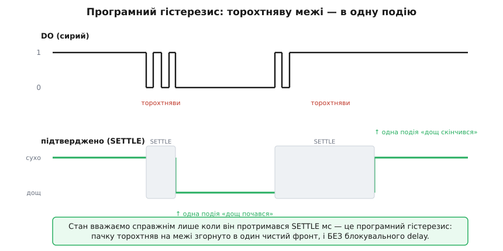
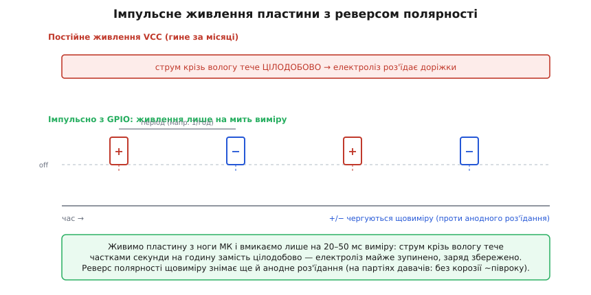

# ⚙️ proj: прошивка давача дощу — від «блимнути на краплю» до автономної метеостанції

Давач дощу віддає прошивці два дуже різні дроти, і майже вся якість пристрою — у тому, як їх читати. Цифровий вихід DO — це один біт «поріг перетнуто чи ні», уже зважений гвинтиком-тримером на платі. Аналоговий вихід AO — сира напруга з подільника, ще не збіднена до біта, з якої видно не лише «є вода / нема», а й приблизно скільки її. Наївний скетч «якщо DO низько — блимни» напишеться за хвилину й одразу почне поводитися незбагненно: перша ж хмаринка дасть чергу з десятка «дощ почався / скінчився», нічний туман збреше «дощ», а пороги, підглянуті в чужому прикладі, на вашій платі не спрацюють зовсім. Кожна з цих бід має точну причину в тому, що всередині сидить половинка операційного підсилювача, загнана в режим порівняння, а зовні мокне пластина-змінний-резистор — і кожну біду знімає конкретний прийом у прошивці.

Розберемо п'ять речей, на яких тримається серйозна робота з цим давачем, і кожну доведемо до робочого коду під Arduino та ESP32. Перше — як читати DO так, щоб на межі «сухо/мокро» не сипалися хибні події, і зробити це **без жодного блокувального `delay`**. Друге — як читати AO через [АЦП](root:hw-analog/adc) і ставити поріг **числом у коді**, відкалібрувавши його під свій екземпляр за п'ять хвилин. Третє — як живити давач **імпульсно**, вмикаючи лише на мить виміру, і як на **оголеній пластині** ще й **міняти полярність щовиміру**, щоб електроліз не з'їв доріжки за місяці. Четверте — як відсіяти росу й туман логікою «дощ, лише якщо мокро довше за N хвилин». П'яте — три пастки, у які падають усі: неуніверсальні пороги `analogRead`, перевернута полярність DO на різних партіях і узгодження рівнів на 3.3-вольтовій системі. Код тут — справжня прошивка на C++ для Arduino-середовища, яку можна залити без переписування.

> 🔧 **Навіщо це.** Різниця між іграшкою й пристроєм, що переживе зиму надворі, — саме в цих прийомах. Розумний дім, який знімає білизну з балкона; теплиця, що закриває кватирку на дощ; автономна метеостанція на батарейках, яка рахує, скільки годин за добу лило, — усі вони читають ті самі два дроти, і всі ламаються однаково, якщо читати наївно. Опанувавши прошивку тут, ви носитимете її від давача до давача: усередині завжди буде поріг, брязкіт переходів на межі й контактна пластина, яку гризе постійний струм.

## Що саме приходить на ногу: два дроти, дві моделі сигналу

Перш ніж писати бодай рядок, треба чітко уявити, який електричний сигнал дає кожен вихід, — бо логіка прошивки прямо випливає з форми сигналу, а не з інтуїції «дощ → одиниця».

**DO — готовий біт, але брудний на межі.** Усередині плати сигнал пластини порівнюється з порогом-гвинтиком половинкою [операційного підсилювача](root:hw-analog/opamp) LM358, яку змусили працювати [компаратором](root:hw-analog/comparator). На класичній полярності в спокої (сухо) DO тримає «1», а достатня волога перекидає його на «0». Здавалося б, чистий біт — та є пастка, яку конче знати. LM358 у цій схемі працює **без гістерезису** (гр. *hystéresis* — відставання): у нього нема «мертвої зони» довкола порога, де він тримав би свій стан. А сигнал пластини — не рівна лінія: краплі падають поштовхами, плівка води тремтить, напруга дрібно коливається якраз довкола порога. Без гістерезису вихід на кожне таке тремтіння перекидається туди-сюди — на початку й наприкінці дощу DO видає не один чистий фронт, а **пачку** коротких переходів. Це не поломка, а прямий наслідок голого ОП без гістерезису; і саме цю пачку доведеться гасити в коді.

**AO — сира напруга, повний спектр вологи.** Це напруга з середньої точки подільника «пластина + постійний резистор», яка йде на компаратор, але виведена ще й назовні окремим штирем. Вона не збіднена до біта: суха пластина дає один рівень, залита — інший, а між ними — плавна шкала. Важливий напрямок: на класичному модулі **більше води означає нижчу напругу**, тож і **менше число** з АЦП. Прочитавши AO, ви бачите не голе «спрацював поріг», а всю силу зволоження — і поріг тоді ставите самі, числом, з будь-яким запасом.

Із цих двох моделей і виростають два стилі прошивки. Читати DO — просто (готовий біт), але треба гасити торохтняву й пам'ятати, що полярність на різних партіях буває перевернута. Читати AO — трохи більше роботи (АЦП, калібрування), зате ви володієте порогом і бачите тенденцію. Реальний надійний пристрій часто бере обидва: DO як швидкий грубий тригер, AO — щоб підтвердити й оцінити силу. Розберемо кожен, а тоді зберемо разом.

## DO без торохтняви: програмний гістерезис на millis, без жодного delay

Почнемо з найпростішого читання й одразу зробимо його правильно. Задача: світити світлодіодом, поки дощить, і друкувати **рівно одне** повідомлення на початок дощу й одне на кінець — попри пачку торохтняв на межі.

Спокуса зробити «як у лоб» велика й хибна: спіймали перехід — поставили `delay(500)`, мовляв, перечекаємо тремтіння. Це працює в навчальному скетчі й розвалює будь-який реальний пристрій, бо `delay` **заморожує геть усе**: поки програма спить ці півсекунди, вона не читає інших давачів, не оновлює дисплей, не відповідає на кнопки. У метеостанції з годинником, екраном і радіо `delay` — майже завжди помилка.

Правильний прийом — **неблокуючий програмний гістерезис**: замість спати, програма **запам'ятовує, коли стан змінився**, і приймає нове значення лише тоді, коли воно **протрималося** якийсь час (скажімо, 400 мс). Годинник для цього — `millis()`, лічильник мілісекунд від старту плати; він тікає сам, не спиняючи програму. Ідея точно та сама, що й у надійному читанні кнопки: не вір миттєвому рівню, вір рівню, що встояв.


*Верхня доріжка — сирий DO: у спокої «1», а на межі зволоження вихід тремтить пачкою коротких переходів (LM358 без гістерезису). Нижня — підтверджений стан: новий рівень приймаємо, лише коли він протримався вікно SETTLE (сірі смуги). Пачку на вході згорнуто в одну чисту подію на кожен край дощу — і без жодного delay, програма весь час вільна.*

Ось скетч під Arduino Uno. Полярність — класична: спокій «1» (сухо), дощ «0».

:::tabs
```cpp
const uint8_t RAIN = 2;             // цифровий вихід DO давача
const uint8_t LED  = 13;            // вбудований світлодіод плати
const unsigned long SETTLE = 400;   // скільки стан має протриматися, мс

bool raining   = false;             // поточний ПІДТВЕРДЖЕНИЙ стан
bool candidate = false;             // стан, який щойно побачили на нозі
unsigned long changedAt = 0;        // коли кандидат уперше з'явився

void setup() {
    pinMode(RAIN, INPUT);           // push-pull-вихід LM358 → підтяжка не потрібна
    pinMode(LED, OUTPUT);
    Serial.begin(9600);
}

void loop() {
    // DO: 0 = дощ, 1 = сухо. Робимо булеве «зараз дощить?»
    bool now = (digitalRead(RAIN) == LOW);

    // показ змінився — запам'ятовуємо як кандидата й засікаємо час
    if (now != candidate) {
        candidate = now;
        changedAt = millis();
    }

    // приймаємо новий стан, ЛИШЕ коли кандидат протримався SETTLE мс —
    // це програмний гістерезис проти торохтняви межі
    if (candidate != raining && millis() - changedAt > SETTLE) {
        raining = candidate;
        digitalWrite(LED, raining);
        Serial.println(raining ? "дощ почався" : "дощ скінчився");
    }
    // програма НЕ спить: сюди можна вставити будь-яку іншу роботу
}
```
```micropython
from machine import Pin
import time

RAIN = Pin(2, Pin.IN)               # цифровий вихід DO давача
LED  = Pin(13, Pin.OUT)             # вбудований світлодіод плати
SETTLE = 400                        # скільки стан має протриматися, мс

raining   = False                   # поточний ПІДТВЕРДЖЕНИЙ стан
candidate = False                   # стан, який щойно побачили на нозі
changed_at = time.ticks_ms()        # коли кандидат уперше з'явився

while True:
    # DO: 0 = дощ, 1 = сухо. Робимо булеве «зараз дощить?»
    now = (RAIN.value() == 0)

    # показ змінився — запам'ятовуємо як кандидата й засікаємо час
    if now != candidate:
        candidate = now
        changed_at = time.ticks_ms()

    # приймаємо новий стан, ЛИШЕ коли кандидат протримався SETTLE мс —
    # це програмний гістерезис проти торохтняви межі
    if candidate != raining and time.ticks_diff(time.ticks_ms(), changed_at) > SETTLE:
        raining = candidate
        LED.value(raining)
        print("дощ почався" if raining else "дощ скінчився")
    # програма НЕ спить: сюди можна вставити будь-яку іншу роботу
```
:::

Серце коду — дві умови, і кожна несе вагу. Перша, `now != candidate`, ловить **будь-яку** зміну на нозі й щоразу перезапускає таймер: поки лінія торохтить, `changedAt` постійно оновлюється, і відлік «скільки протрималося» весь час скидається в нуль. Друга, `millis() - changedAt > SETTLE`, приймає новий стан лише коли він **устояв** довше за вікно — тобто торохтняви скінчилися й лінія завмерла. Пачка коротких переходів на межі так і не проб'ється у `raining`: кожен новий стрибок скидає таймер, і жоден не встигає «дозріти». А коли дощ по-справжньому почався й DO ліг у стійкий «0», кандидат нарешті протримується всі 400 мс — і ми друкуємо рівно одне «дощ почався».

Зверніть увагу на **арифметику з відніманням часу**. Ми пишемо `millis() - changedAt > SETTLE`, а не `millis() > changedAt + SETTLE`. Це не примха стилю: `millis()` переповнюється (обнуляється) приблизно раз на 50 діб, і форма з відніманням переживає це переповнення коректно завдяки тому, як поводиться беззнакова арифметика, а форма з додаванням — ні. Для метеостанції, що має жити місяцями, це різниця між «працює завжди» і «раз на 50 діб дуріє на одну добу». Правило просте: **порівнюй різницю часів, а не суми**.

> 🔧 **Навіщо це.** Вікно SETTLE — фізичний параметр вашої задачі, а не магічне число. Для «почався/скінчився дощ» 300–600 мс саме враз: реальний дощ не вмикається й не вимикається швидше. Якби ви цим самим прийомом ловили окремі краплі (навіщось), вікно треба було б куди коротше. Замале вікно — вернеться торохтняви; заwidele — проґавите короткий дощ. Крутіть це число під свою подію.

Той самий скетч під ESP32 відрізняється лише дрібницями — номером ноги (у ESP32 «цифрова» будь-яка GPIO) і швидкістю порту:

:::tabs
```cpp
const uint8_t RAIN = 4;             // DO на GPIO4
const uint8_t LED  = 2;             // вбудований світлодіод (на більшості плат GPIO2)
const unsigned long SETTLE = 400;

bool raining = false, candidate = false;
unsigned long changedAt = 0;

void setup() {
    pinMode(RAIN, INPUT);
    pinMode(LED, OUTPUT);
    Serial.begin(115200);
}

void loop() {
    bool now = (digitalRead(RAIN) == LOW);
    if (now != candidate) { candidate = now; changedAt = millis(); }
    if (candidate != raining && millis() - changedAt > SETTLE) {
        raining = candidate;
        digitalWrite(LED, raining);
        Serial.println(raining ? "дощ почався" : "дощ скінчився");
    }
}
```
```micropython
from machine import Pin
import time

RAIN = Pin(4, Pin.IN)               # DO на GPIO4
LED  = Pin(2, Pin.OUT)              # вбудований світлодіод (на більшості плат GPIO2)
SETTLE = 400

raining, candidate = False, False
changed_at = time.ticks_ms()

while True:
    now = (RAIN.value() == 0)
    if now != candidate:
        candidate = now
        changed_at = time.ticks_ms()
    if candidate != raining and time.ticks_diff(time.ticks_ms(), changed_at) > SETTLE:
        raining = candidate
        LED.value(raining)
        print("дощ почався" if raining else "дощ скінчився")
```
:::

Логіка ідентична — і це навмисно: сам прийом гістерезису на `millis()` переносний між платформами без змін, різняться тільки константи оточення.

Якщо ж пристрій має робити щось важке й ризикує проґавити навіть DO між проходами циклу, читання варто перевести на **переривання** по зміні рівня, а весь гістерезис лишити в головному циклі за прапорцем. Тонкощі вибору «опитування чи переривання» (коли який, чому ISR має бути короткою, чому на ESP32 потрібен `IRAM_ATTR`) — окрема тема сама по собі, і вона детально розібрана в кроці курсу [опитування проти переривань](root:embedded/polling-vs-interrupts). Для дощу, що змінюється повільно, щільного опитування в неблокуючому циклі майже завжди досить: провалів шириною в мікросекунди тут нема, події тривають секунди.

## AO через АЦП: поріг числом і п'ятихвилинне калібрування

Читати DO зручно, але ви прив'язані до порога, який хтось накрутив гвинтиком, і бачите лише «спрацював / ні». Читання AO знімає обидва обмеження: ви бачите всю шкалу зволоження й ставите поріг **змінною в коді** — хоч удень грубіше, хоч уночі чутливіше, хоч підбираючи автоматично.

Одразу межа, щоб не було ілюзій: це не дощомір. Число з АЦП — груба міра «наскільки мокро», а не міліметри опадів; воно залежить від живлення, від резистора подільника на вашій платі й від чистоти пластини. Але для «сухо / волого / залито» й для стеження за тенденцією цього досить.

Ключова думка калібрування: **абсолютні числа порогів не переносяться між екземплярами**, тож їх треба здобути **на своїй платі** — і це справа п'яти хвилин. Заливаємо скетч, що просто ллє сирий `analogRead` у монітор, і дивимося дві опорні точки: скільки давач показує **сухим** і скільки — коли пластину **побризкати водою**. Між ними — ваш реальний розмах, і вже по ньому ставимо межі із запасом.

:::tabs
```cpp
const uint8_t AO = A0;              // аналоговий вихід давача на A0

void setup() {
    Serial.begin(9600);
}

void loop() {
    int v = analogRead(AO);         // 0..1023 на Uno; менше = мокріше
    Serial.println(v);              // ← дивимося сухе й мокре значення
    delay(300);
}
```
```micropython
from machine import ADC, Pin
import time

ao = ADC(Pin(34))                   # аналоговий вихід давача (ESP32: ADC1)
ao.atten(ADC.ATTN_11DB)             # повна шкала ~3.3 В

while True:
    v = ao.read()                   # 0..4095 на ESP32; менше = мокріше
    print(v)                        # ← дивимося сухе й мокре значення
    time.sleep_ms(300)
```
:::

Припустімо, монітор показав: суха пластина дає близько 900, а щедро побризкана падає до ~250. Тоді розумні пороги — з відступом від країв, щоб дрібний шум не перекидав рішення: скажімо, «сухо» вище 800, «залито» нижче 350, а між ними «волого». Впишемо це в робочий скетч і додамо гістерезис — але тепер **аналоговий**, двопороговий, бо на числі це навіть природніше, ніж на біті:

:::tabs
```cpp
const uint8_t AO = A0;
const int DRY_ENTER = 800;          // вище цього вважаємо «сухо»
const int WET_ENTER = 500;          // нижче цього вважаємо «дощ»
//   ЗВЕРНІТЬ УВАГУ: DRY_ENTER > WET_ENTER — між ними «мертва зона» гістерезису

bool raining = false;

void setup() {
    Serial.begin(9600);
}

void loop() {
    int v = analogRead(AO);         // менше число = мокріше

    // двопороговий гістерезис прямо на числі:
    //   у «дощ» переходимо, лише впавши НИЖЧЕ WET_ENTER;
    //   у «сухо» — лише піднявшись ВИЩЕ DRY_ENTER.
    if (!raining && v < WET_ENTER) raining = true;
    if ( raining && v > DRY_ENTER) raining = false;

    Serial.print("AO = "); Serial.print(v);
    Serial.println(raining ? "  → дощ" : "  → сухо");
    delay(200);
}
```
```micropython
from machine import ADC, Pin
import time

ao = ADC(Pin(34))
ao.atten(ADC.ATTN_11DB)
DRY_ENTER = 800                     # вище цього вважаємо «сухо»
WET_ENTER = 500                     # нижче цього вважаємо «дощ»
#   ЗВЕРНІТЬ УВАГУ: DRY_ENTER > WET_ENTER — між ними «мертва зона» гістерезису

raining = False

while True:
    v = ao.read()                   # менше число = мокріше

    # двопороговий гістерезис прямо на числі:
    #   у «дощ» переходимо, лише впавши НИЖЧЕ WET_ENTER;
    #   у «сухо» — лише піднявшись ВИЩЕ DRY_ENTER.
    if not raining and v < WET_ENTER:
        raining = True
    if raining and v > DRY_ENTER:
        raining = False

    print("AO =", v, "  → дощ" if raining else "  → сухо")
    time.sleep_ms(200)
```
:::

Ось у чому сила двопорогового підходу й чому це **справжній гістерезис**, тепер уже реалізований нами, а не залізом. Між `WET_ENTER` (500) і `DRY_ENTER` (800) лежить **мертва зона** шириною 300 відліків. Щоб оголосити дощ, сигналу мало впасти нижче 500; а щоб скасувати — вирости аж вище 800. Поки число блукає всередині зони (а саме там воно й тремтить на межі зволоження), рішення **не міняється** — стан «залипає». Це та сама «мертва зона», якої катастрофічно бракує голому LM358 на DO; ми повернули її в коді, і тепер жодне тремтіння порога не дає хибних перемикань. За шириною зони стоїть простий компроміс: вужча — давач чутливіший до слабких змін, але ближчий до торохтняви; ширша — рішення твердіше, але треба помітніша зміна вологи, щоб його перекинути.

Числа `analogRead` на різних платах різні не лише через екземпляр давача, а й через саму опорну напругу АЦП — вона гуляє від живлення й від плати. Якщо потрібні не «свої відліки», а перерахунок у реальні вольти чи стабільність між приладами, тут стає в пригоді зовнішня опора й калібрування АЦП; механіка цього розібрана в кроці [калібрування АЦП зовнішньою опорою](root:embedded/adc-reference-calibration). Для порогового давача дощу калібрувати достатньо у **власних відліках** — важить не абсолютний вольтаж, а надійно відрізнити суху пластину від мокрої на **цьому** приладі.

### Той самий вимір на ESP32 — і його тонкощі

На ESP32 ідея та сама, але АЦП інший, і дві його особливості конче знати, інакше цифри дуритимуть.

По-перше, **розрядність**: АЦП тут 12-бітний, значення 0–4095, а не 0–1023. Тому й пороги, і будь-які межі — під ширшу шкалу.

По-друге — і це головне джерело незбагненних «то читає, то ні» — **не всяку ногу можна читати, коли працює Wi-Fi**. АЦП ESP32 поділений на два блоки: ADC1 (виводи GPIO32–39) і ADC2 (частина інших). Коли радіо вмикається, живлення відбирається від ADC2, і читання з ADC2-ноги при активному Wi-Fi повертає сміття — часто просто максимум шкали. Для будь-якого проєкту з мережею (а метеостанція майже завжди в мережі) заводьте AO **тільки на ногу з ADC1** — наприклад, GPIO34, GPIO35, GPIO32 чи GPIO33. Це не забаганка, а джерело найбільш загадкових багів на ESP32.

Практично корисно ще й те, що на ESP32 сирий `analogRead` можна замінити на `analogReadMilliVolts()` — воно повертає вже **відкалібровані мілівольти**, використовуючи заводські дані калібрування, зашиті в кристал (eFuse Vref). Це обходить частину нелінійності АЦП і робить пороги трохи переноснішими між екземплярами ESP32. Пам'ятайте лише, що АЦП ESP32 галасливий і «сліпий» на самих краях шкали — приблизно нижче 0.1 В він тримає нуль, а біля 3.1 В залипає у стелю, — тож не ставте пороги в цих крайніх зонах.

:::tabs
```cpp
const uint8_t AO = 34;              // ADC1! GPIO34 безпечний при Wi-Fi
const int DRY_ENTER_MV = 2400;      // пороги — тепер у мілівольтах
const int WET_ENTER_MV = 1500;

bool raining = false;

void setup() {
    Serial.begin(115200);
    analogReadResolution(12);       // 0..4095, якщо читати сирий analogRead
}

void loop() {
    int mv = analogReadMilliVolts(AO);   // відкалібровані мілівольти

    if (!raining && mv < WET_ENTER_MV) raining = true;
    if ( raining && mv > DRY_ENTER_MV) raining = false;

    Serial.print("AO = "); Serial.print(mv); Serial.print(" мВ");
    Serial.println(raining ? "  → дощ" : "  → сухо");
    delay(200);
}
```
```micropython
from machine import ADC, Pin
import time

ao = ADC(Pin(34))                   # ADC1! GPIO34 безпечний при Wi-Fi
ao.atten(ADC.ATTN_11DB)             # повна шкала ~3.3 В
DRY_ENTER_MV = 2400                 # пороги — тепер у мілівольтах
WET_ENTER_MV = 1500

raining = False

while True:
    mv = ao.read_uv() // 1000        # відкалібровані мілівольти (read_uv → мкВ)

    if not raining and mv < WET_ENTER_MV:
        raining = True
    if raining and mv > DRY_ENTER_MV:
        raining = False

    print("AO =", mv, "мВ", "  → дощ" if raining else "  → сухо")
    time.sleep_ms(200)
```
:::

Логіка двопорогового гістерезису ідентична Uno-версії — різняться лише одиниці (мілівольти замість сирих відліків), ширша шкала й обов'язковий вибір ноги ADC1. Саме тому варто тримати рішення про поріг окремо від читання: перенести код на іншу плату — це поміняти константи й спосіб читання, а не логіку.

## Пластина під струмом гине: імпульсне живлення й реверс полярності

Тепер найпідступніша пастка контактних давачів вологи, бо вона вбиває пластину повільно й непомітно. Поки на пластину подано живлення, між двома гребінками стоїть **постійна напруга**. Щойно їх замикає волога, крізь неї тече постійний струм — і вода під струмом поводиться як електроліт: починається **електроліз** (гр. *lýsis* — розклад). Метал доріжки-«плюса» (анода) поступово розчиняється й переноситься, доріжки окиснюються, вкриваються нальотом; з кожним дощем мідь роз'їдається дедалі більше, «мокрий» опір пластини повзе вгору, спрацювання стає млявим, а врешті давач перестає бачити навіть добрий дощ. Дешеві пластини без захисного покриття вигоряють так за кілька місяців надворі — бульбашки на доріжках під краплею видно вже за хвилини роботи.

Причина — саме **постійний струм крізь вологу під постійною напругою**, тож і ліки випливають прямо з причини, і їх два, що складаються. Але перш ніж їх застосувати, треба ясно уявити будову модуля, бо саме її нехтування — найдорожча помилка цього розділу.

**Модуль — це дві окремі речі.** Гребінчаста пластина, що мокне, — пасивний резистор із двома виводами, і більш нічого. Плата з LM358, тримером і роз'ємами — це вже активна електроніка, яку живлять від VCC/GND. Пластина під'єднується до цієї плати двома дротами й стає нижнім плечем подільника; компаратор і вихід AO сидять на активній платі. Ця різниця вирішує все нижче: **пасивну пластину можна живити як завгодно — хоч перевертати полярність, — а от активну плату з операційним підсилювачем можна живити лише правильною полярністю, інакше кристал згорить.**

**Перше ліки — не тримати пластину під напругою постійно.** Живіть її не з шини VCC цілодобово, а імпульсно, вмикаючи лише на коротку мить виміру: прокинулись, подали живлення, зачекали, поки напруга усталиться, зчитали, зняли живлення. Тоді струм крізь вологу тече не цілодобово, а частками секунди на годину — і пластина живе в рази довше. Це заразом різко ощадить енергію, що критично для метеостанції на батарейках: між вимірами весь вузол знеструмлений. (Скільки саме він з'їдає в спокої й де ще тече паразитний струм — окрема інженерна вправа, [аудит струму спокою плати](root:embedded/sleep-current-audit).)

Якщо ви лишаєте модуль **цілим** (з платою LM358), імпульсне живлення робиться найпростіше й найбезпечніше так: **комутуйте живлення всього модуля**. Заведіть його VCC не на постійні 3.3 В, а на ногу мікроконтролера (для кількох міліампер ноги досить; для більшого струму чи чистішого рішення — через ключ на польовому транзисторі, яким лише керує GPIO). Перед виміром подали живлення, дали LM358 і подільнику усталитися, зчитали AO, зняли живлення — і між вимірами вся плата мертва, струму крізь вологу нема зовсім.

> ⚠️ **Не плутайте комутацію з реверсом.** Живлення всього модуля можна лише **вмикати й вимикати**, але **ніколи не перевертати** (VCC↔GND). Усередині LM358 на входах живлення сидять захисні діоди; подана навпаки напруга відкриває їх, крізь кристал б'є струм — і підсилювач гине за одну таку інверсію. Тому реверс полярності — прийом **не для плати, а лише для голої пластини** (нижче), яку від плати доведеться від'єднати.

Ось закінчений скетч під ESP32, що лишає модуль цілим і просто імпульсно його живить: подає VCC на час виміру, читає AO з ноги ADC1, застосовує двопороговий гістерезис, а між вимірами тримає модуль знеструмленим.

:::tabs
```cpp
// Давач дощу цілим модулем: імпульсно живимо VCC модуля з GPIO,
// читаємо AO з ADC1 лише під час короткого вікна. БЕЗ реверсу полярності —
// перевертати живлення плати з LM358 не можна.

const uint8_t PWR = 26;             // живлення VCC модуля (нога GPIO або ключ на транзисторі)
const uint8_t AO  = 34;             // аналоговий вихід модуля → ADC1

const unsigned long PERIOD    = 60000UL; // період між вимірами, мс (тут 1 хв)
const unsigned long SETTLE_MS = 30;      // усталення LM358 + подільника
const int DRY_ENTER_MV = 2400;
const int WET_ENTER_MV = 1500;

bool raining = false;
unsigned long lastMeasure = 0;

// один вимір: подати живлення на весь модуль, усталити, зчитати AO, зняти живлення
int measureOnce() {
    digitalWrite(PWR, HIGH);            // подали живлення на весь модуль
    delay(SETTLE_MS);                   // LM358 і подільник усталюються
    int mv = analogReadMilliVolts(AO);
    digitalWrite(PWR, LOW);             // зняли живлення — струму крізь вологу нема
    return mv;
}

void setup() {
    Serial.begin(115200);
    analogReadResolution(12);
    pinMode(PWR, OUTPUT);
    digitalWrite(PWR, LOW);             // старт — модуль знеструмлений
}

void loop() {
    if (millis() - lastMeasure >= PERIOD) {
        lastMeasure = millis();
        int mv = measureOnce();

        if (!raining && mv < WET_ENTER_MV) raining = true;
        if ( raining && mv > DRY_ENTER_MV) raining = false;

        Serial.print("AO = "); Serial.print(mv); Serial.print(" мВ  → ");
        Serial.println(raining ? "дощ" : "сухо");
    }
    // весь інший час модуль знеструмлений, МК вільний (тут доречний і сон)
}
```
```micropython
# Давач дощу цілим модулем: імпульсно живимо VCC модуля з GPIO,
# читаємо AO з ADC1 лише під час короткого вікна. БЕЗ реверсу полярності —
# перевертати живлення плати з LM358 не можна.

from machine import ADC, Pin
import time

PWR = Pin(26, Pin.OUT)              # живлення VCC модуля (нога GPIO або ключ на транзисторі)
ao  = ADC(Pin(34))                  # аналоговий вихід модуля → ADC1
ao.atten(ADC.ATTN_11DB)

PERIOD    = 60000                   # період між вимірами, мс (тут 1 хв)
SETTLE_MS = 30                      # усталення LM358 + подільника
DRY_ENTER_MV = 2400
WET_ENTER_MV = 1500

raining = False
last_measure = time.ticks_ms()

# один вимір: подати живлення на весь модуль, усталити, зчитати AO, зняти живлення
def measure_once():
    PWR.value(1)                    # подали живлення на весь модуль
    time.sleep_ms(SETTLE_MS)        # LM358 і подільник усталюються
    mv = ao.read_uv() // 1000
    PWR.value(0)                    # зняли живлення — струму крізь вологу нема
    return mv

PWR.value(0)                        # старт — модуль знеструмлений

while True:
    if time.ticks_diff(time.ticks_ms(), last_measure) >= PERIOD:
        last_measure = time.ticks_ms()
        mv = measure_once()

        if not raining and mv < WET_ENTER_MV:
            raining = True
        if raining and mv > DRY_ENTER_MV:
            raining = False

        print("AO =", mv, "мВ  →", "дощ" if raining else "сухо")
    # весь інший час модуль знеструмлений, МК вільний (тут доречний і сон)
```
:::

Одне застереження до живлення VCC прямо з ноги: модуль тягне струм своїх індикаторів і LM358 — зазвичай кілька міліампер, що нозі до снаги, але якщо на платі яскраві світлодіоди або ви живите кілька давачів, поставте між шиною й модулем ключ на польовому транзисторі, а ногою лише керуйте затвором. Тоді нога не несе струму навантаження, а тільки вмикає й вимикає живлення.

**Друге ліки — міняти полярність щовиміру, і лише на голій пластині.** Електроліз роз'їдає передусім **анод** — ту доріжку, що стоїть плюсом. Якщо щоразу плюсом ставити то одну гребінку, то другу, жодна не встигає систематично роз'їдатися: знос розмазується й майже спиняється. Це давно відомий прийом для резистивних вологочутливих електродів — розворот струму не дає аноду гинути однобоко. Але, як сказано вище, перевертати полярність **усього модуля** не можна — згорить LM358. Тому реверс роблять інакше: **пластину від'єднують від плати-компаратора й живлять напряму двома ногами мікроконтролера, а середину подільника читають власним АЦП МК — плата з LM358 у цьому режимі не бере участі зовсім.**

Схема проста. Одну гребінку пластини заводимо на ногу DRV_A, другу — на DRV_B; між DRV_A і аналоговою ногою МК ставимо власний **опорний резистор** (10 кОм–1 МОм, під свою пластину), а сама пластина з'єднує аналогову ногу з DRV_B. На парному вимірі DRV_A робимо «плюсом» (HIGH), DRV_B — «мінусом» (LOW); на непарному — навпаки, і струм крізь пластину тече у зворотний бік. Оскільки при розвороті плечі подільника міняються ролями, «сире» число АЦП теж перевертається — тому на розвернутому вимірі беремо доповнення (повна шкала мінус відлік), щоб «менше = мокріше» лишалося правдою в обох напрямках.


*Дві стратегії струму крізь пластину. Постійна напруга (червоне) тримає струм крізь вологу без упину — електроліз гризе анод. Живлення короткими вікнами з ніг МК (зелене) подають лише на 20–50 мс виміру раз на період (напр. раз на годину), тож струм тече частками секунди на годину; а що полярність +/− чергується щовиміру, анодне роз'їдання розмазується між доріжками й майже спиняється.*

Ось закінчений скетч під ESP32, що поєднує обидва ліки на голій пластині: живить її з двох GPIO з реверсом полярності, читає середину власного подільника лише під час короткого вікна, застосовує двопороговий гістерезис і між вимірами тримає пластину відірваною (Hi-Z).

:::tabs
```cpp
// Реверс полярності на ГОЛІЙ пластині (плата LM358 не задіяна).
// Гребінки пластини — на GPIO25 і GPIO26; між GPIO25 і GPIO34 — опорний
// резистор R_ref, сама пластина — між GPIO34 і GPIO26. Читаємо GPIO34 (ADC1).

const uint8_t DRV_A = 25;           // гребінка A + опорний резистор до NODE
const uint8_t DRV_B = 26;           // гребінка B
const uint8_t NODE  = 34;           // середина подільника → ADC1
const int ADC_FS = 4095;            // повна шкала 12-біт АЦП

const unsigned long PERIOD    = 60000UL; // період між вимірами, мс (тут 1 хв)
const unsigned long SETTLE_MS = 30;      // усталення напруги на подільнику
const int DRY_ENTER = 2600;         // пороги — у нормованих відліках, калібрувати
const int WET_ENTER = 1500;

bool raining = false;
bool flip = false;                  // чергування полярності
unsigned long lastMeasure = 0;

// один вимір: подати полярність, усталити, зчитати середину, знеструмити,
// а тоді нормувати так, щоб «менше = мокріше» незалежно від напрямку струму
int measureOnce(bool reversed) {
    uint8_t hi = reversed ? DRV_B : DRV_A;   // яка гребінка «плюс» цього разу
    uint8_t lo = reversed ? DRV_A : DRV_B;
    pinMode(hi, OUTPUT); digitalWrite(hi, HIGH);
    pinMode(lo, OUTPUT); digitalWrite(lo, LOW);
    delay(SETTLE_MS);                        // коротке усталення напруги на подільнику
    int raw = analogRead(NODE);
    // знеструмлюємо пластину: обидві ноги у Hi-Z, струм крізь вологу спинено
    pinMode(hi, INPUT);
    pinMode(lo, INPUT);
    // при розвороті плечі міняються місцями → відлік інвертується; вирівнюємо
    return reversed ? (ADC_FS - raw) : raw;
}

void setup() {
    Serial.begin(115200);
    analogReadResolution(12);
    pinMode(DRV_A, INPUT);          // старт — пластина знеструмлена (Hi-Z)
    pinMode(DRV_B, INPUT);
}

void loop() {
    if (millis() - lastMeasure >= PERIOD) {
        lastMeasure = millis();
        int v = measureOnce(flip);           // полярність — по черзі
        flip = !flip;

        if (!raining && v < WET_ENTER) raining = true;
        if ( raining && v > DRY_ENTER) raining = false;

        Serial.print("вологість = "); Serial.print(v); Serial.print("  → ");
        Serial.println(raining ? "дощ" : "сухо");
    }
    // весь інший час пластина у Hi-Z, МК вільний (тут доречний і сон)
}
```
```micropython
# Реверс полярності на ГОЛІЙ пластині (плата LM358 не задіяна).
# Гребінки пластини — на GPIO25 і GPIO26; між GPIO25 і GPIO34 — опорний
# резистор R_ref, сама пластина — між GPIO34 і GPIO26. Читаємо GPIO34 (ADC1).

from machine import ADC, Pin
import time

DRV_A = 25                          # гребінка A + опорний резистор до NODE
DRV_B = 26                          # гребінка B
ADC_FS = 4095                       # повна шкала 12-біт АЦП
node = ADC(Pin(34))                 # середина подільника → ADC1
node.atten(ADC.ATTN_11DB)

PERIOD    = 60000                   # період між вимірами, мс (тут 1 хв)
SETTLE_MS = 30                      # усталення напруги на подільнику
DRY_ENTER = 2600                    # пороги — у нормованих відліках, калібрувати
WET_ENTER = 1500

raining = False
flip = False                        # чергування полярності
last_measure = time.ticks_ms()

# один вимір: подати полярність, усталити, зчитати середину, знеструмити,
# а тоді нормувати так, щоб «менше = мокріше» незалежно від напрямку струму
def measure_once(reversed):
    hi = DRV_B if reversed else DRV_A   # яка гребінка «плюс» цього разу
    lo = DRV_A if reversed else DRV_B
    Pin(hi, Pin.OUT).value(1)
    Pin(lo, Pin.OUT).value(0)
    time.sleep_ms(SETTLE_MS)            # коротке усталення напруги на подільнику
    raw = node.read()
    # знеструмлюємо пластину: обидві ноги у Hi-Z, струм крізь вологу спинено
    Pin(hi, Pin.IN)
    Pin(lo, Pin.IN)
    # при розвороті плечі міняються місцями → відлік інвертується; вирівнюємо
    return (ADC_FS - raw) if reversed else raw

Pin(DRV_A, Pin.IN)                  # старт — пластина знеструмлена (Hi-Z)
Pin(DRV_B, Pin.IN)

while True:
    if time.ticks_diff(time.ticks_ms(), last_measure) >= PERIOD:
        last_measure = time.ticks_ms()
        v = measure_once(flip)          # полярність — по черзі
        flip = not flip

        if not raining and v < WET_ENTER:
            raining = True
        if raining and v > DRY_ENTER:
            raining = False

        print("вологість =", v, "  →", "дощ" if raining else "сухо")
    # весь інший час пластина у Hi-Z, МК вільний
```
:::

Три речі в цьому коді вирішальні. Перше — **знеструмлення через `INPUT`**: обидві гребінки переводимо у високоімпедансний стан (Hi-Z, `pinMode(pin, INPUT)`), фактично відриваючи пластину від живлення; струм крізь вологу спиняється повністю, а не просто «падає до нуля вольтів». Друге — **пауза `SETTLE_MS` на усталення**: подільник із пластиною не миттєвий, і якщо читати АЦП одразу після подання живлення, зловиш перехідний процес; кількадесят мілісекунд дають напрузі влягтися. Третє — **нормування розвернутого виміру**: коли `DRV_A` і `DRV_B` міняються ролями, «сире» число АЦП перевертається, тому на непарному вимірі повертаємо `ADC_FS - raw` — і тоді «менше = мокріше» справджується завжди, а двопороговий гістерезис працює на однорідній шкалі. Між вимірами (тут ціла хвилина) уся пластина у Hi-Z — сюди природно лягає режим сну мікроконтролера, і тоді середній струм давача падає до майже нуля.

Обидва скетчі переносяться на Arduino Uno дослівно — лише замість `analogReadMilliVolts` і 12-бітної шкали беремо сирий `analogRead` (0–1023, тож `ADC_FS = 1023` і пороги в цій шкалі), а замість GPIO25/26/34 — будь-які дві цифрові ноги для живлення й `A0` для середини подільника. Механіка «подати → усталити → зчитати → відірвати» ідентична.

> 🔧 **Навіщо це.** Якщо давач стоятиме надворі місяцями, постійне живлення пластини — прихована бомба сповільненої дії: за півроку доріжки роз'їсть, і ви думатимете, що «зламався модуль», хоча зносилася лише пластина (а вона — розхідник, її легко замінити окремо). Для стаціонарного пристрою від мережі досить **простого імпульсного живлення цілого модуля** (перший скетч) — воно вже різко зменшує електроліз і майже задарма ощадить батарею, а плату LM358 лишає незайманою. **Реверс полярності на голій пластині** (другий скетч) додають, коли хочуть, щоб пластина жила роками; ціна за це — відмова від готового компаратора на платі й власний подільник, який читає АЦП мікроконтролера.

## Роса й туман: логіка «дощ, лише якщо мокро довше за N хвилин»

Є ще одна пастка, і вона не в залізі, а в самій природі того, що давач міряє. Пластина реагує на **будь-яку провідну вологу**, а не лише на краплі згори: роса, що осідає під ранок, ранковий туман, волога плівка від високої вологості — усе це замикає доріжки незгірш дощу. Для «полити город, якщо сухо» це байдуже, а от «зачинити кватирку теплиці на дощ» від роси спрацьовуватиме щоранку намарно.

Розрізнити дощ і росу за миттєвим показом давача **неможливо** — вони дають ту саму мокру пластину. Але їх добре розрізняє **час і характер**. Дощ приходить відносно швидко й тримає пластину мокрою **стійко й довго**; роса намокає повільно й часто сходить, щойно підніметься сонце; коротка мжичка чи бризки — це секунди. Звідси проста, але дієва логіка: **вважати дощем лише таке зволоження, що протрималося довше за N хвилин** (скажімо, 3–5). Це той самий гістерезис-на-часі, що ми робили проти торохтняви, але з вікном не в сотні мілісекунд, а в хвилини — щоб відсіяти вже не електричне тремтіння, а короткочасні природні явища.

Зберемо це в закінчений скетч. Він читає DO (для економії — але з AO працює так само), і оголошує «дощ» лише коли пластина мокра **безперервно** довше за поріг часу; щойно вона підсихає, лічильник скидається. Так роса, що приходить і йде, і коротка мжичка порогу часу не набирають, а справжній дощ — набирає.

```cpp
// Відсів роси/туману: «дощ» лише коли мокро БЕЗПЕРЕРВНО довше за N хвилин.
// DO давача на D2 (класична полярність: 0 = мокро, 1 = сухо).

const uint8_t RAIN = 2;
const unsigned long RAIN_MIN_MS = 3UL * 60UL * 1000UL;  // 3 хвилини стійкої вологи
const unsigned long DRY_CLEAR_MS = 30UL * 1000UL;       // 30 с сухо → скидаємо

bool wet = false;                   // миттєво мокро (сира ознака)
bool declaredRain = false;          // ПІДТВЕРДЖЕНИЙ дощ
unsigned long wetSince = 0;         // відколи безперервно мокро
unsigned long drySince = 0;         // відколи безперервно сухо

void setup() {
    pinMode(RAIN, INPUT);
    Serial.begin(9600);
}

void loop() {
    bool nowWet = (digitalRead(RAIN) == LOW);
    unsigned long t = millis();

    if (nowWet) {
        if (!wet) { wet = true; wetSince = t; }   // щойно намокло — засікаємо
        drySince = 0;
        // мокро вже досить довго → це справжній дощ
        if (!declaredRain && t - wetSince >= RAIN_MIN_MS) {
            declaredRain = true;
            Serial.println(">>> ДОЩ підтверджено (мокро > 3 хв)");
        }
    } else {
        if (wet) { wet = false; drySince = t; }   // щойно висохло — засікаємо
        wetSince = 0;
        // сухо вже досить довго → дощ скінчився
        if (declaredRain && t - drySince >= DRY_CLEAR_MS) {
            declaredRain = false;
            Serial.println(">>> сухо, дощ скінчився");
        }
    }
}
```

Логіка тримається на двох таймерах-«відколи». `wetSince` рахує, як довго пластина мокра **безперервно**: щойно вона на мить підсихає, гілка `else` скидає `wet`, і наступне намокання почне відлік наново — отже, коротка роса, що приходить і сходить, ніколи не набере трьох хвилин поспіль. Симетрично `drySince` вимагає, щоб перед оголошенням кінця дощу пластина побула сухою стійкі 30 секунд, — інакше пауза між зливами розірвала б один дощ на два. Пороги `RAIN_MIN_MS` і `DRY_CLEAR_MS` — це і є ваша політика: підняли перший — суворіше відсіваєте росу ціною запізнілої реакції на дощ; підняли другий — твердіше склеюєте перерви в зливі.

Це, звісно, не ідеальний розрізнювач: затяжний густий туман на годину все ж набере поріг і збреше «дощ», а дуже коротка, але справжня злива на дві хвилини — не встигне. Стовідсотково відрізнити дощ від роси одним контактним давачем не можна; для суворих задач його комбінують з іншими ознаками (температура точки роси, різкість намокання, окремий догрів пластини, що випарює росу). Але для побутової теплиці чи балкона правило «мокро довше за N хвилин» відсіює переважну частину хибних тривог майже задарма — самою логікою в коді.

## Три пастки, у які падають усі

Модуль дешевий і на вигляд примітивний, і саме тому легко впасти в помилку, що виглядає як «залізо бракує», а насправді — недогляд у підході. Три з них — найчастіші й найпідступніші.

**Пастка 1: пороги `analogRead` з чужого прикладу не працюють.** Це найпоширеніше «в сусіда працює, а в мене ні». Числа з АЦП **не переносяться між екземплярами** — і не тому, що приклад поганий, а тому, що конкретне число залежить від напруги живлення, від номіналу постійного резистора в подільнику саме вашої плати й від чистоти пластини. На додачу опорна напруга АЦП сама гуляє від плати до плати. Лік простий і обов'язковий: **відкалібруйте свій екземпляр** — залийте скетч, що ллє сирий відлік, подивіться сухе й побризкане значення на **вашому** давачі й аж тоді впишіть свої пороги із запасом. П'ять хвилин калібрування рятують від годин здогадок. Ніколи не беріть чужі 800/400 як істину.

**Пастка 2: перевернута полярність DO на різних партіях.** Класична плата в спокої тримає DO у «1» (сухо), а дощ притискає до «0». Але розводка модуля на різних партіях гуляє: буває, який вхід компаратора «+», а який «−», розведено навпаки, і тоді все перевертається — спокій «0», дощ «1». Скетч, написаний під чужу полярність, поводитиметься точно навпаки: «дощить» у суху погоду й мовчить під зливою. Лік — **не вірити чужому малюнку, а прочитати полярність спокою на своїй платі в `setup`** і будувати логіку від неї, а не від константи. Ось акуратний спосіб: у `setup` (коли пластина явно суха) один раз читаємо DO й запам'ятовуємо цей рівень як «сухо», а «дощем» вважаємо протилежний.

:::tabs
```cpp
const uint8_t RAIN = 2;
bool dryLevel;                      // рівень DO у спокої — визначимо на старті

void setup() {
    pinMode(RAIN, INPUT);
    Serial.begin(9600);
    delay(50);
    dryLevel = digitalRead(RAIN);   // ПРИПУСКАЄМО: на старті пластина суха
    Serial.print("рівень 'сухо' на цій платі = ");
    Serial.println(dryLevel ? "HIGH" : "LOW");
}

void loop() {
    bool nowWet = (digitalRead(RAIN) != dryLevel);   // мокро = НЕ як у спокої
    // ... далі звична логіка гістерезису/відсіву на булевому nowWet ...
}
```
```micropython
from machine import Pin
import time

RAIN = Pin(2, Pin.IN)

time.sleep_ms(50)
dry_level = RAIN.value()            # ПРИПУСКАЄМО: на старті пластина суха
print("рівень 'сухо' на цій платі =", "HIGH" if dry_level else "LOW")

while True:
    now_wet = (RAIN.value() != dry_level)   # мокро = НЕ як у спокої
    # ... далі звична логіка гістерезису/відсіву на булевому now_wet ...
```
:::

Прийом коштує одного рядка, а робить скетч **байдужим до полярності партії**: хоч спокій «1», хоч «0» — «мокро» завжди означає «не так, як було в суху погоду на старті». Єдина умова — на момент `setup` пластина має бути справді суха (інакше давач «запам'ятає» дощ за норму). Для стаціонарного пристрою це майже завжди так; для параної можна звіритися ще й з AO.

**Пастка 3: узгодження рівнів на 3.3-вольтовій системі.** Модуль живиться в широкому діапазоні, тож спокуса запитати його від 5 В, а сигнал завести на 3.3-вольтовий ESP32, велика — і хибна. Виходи DO й AO виставляють напругу **приблизно до рівня живлення давача**: якщо живити плату 5 вольтами, «висока» DO буде близько 5 В, і сира напруга AO теж може сягати ~5 В. А входи 3.3-вольтового мікроконтролера здебільшого **не терплять** напруги, помітно вищої за свою шину: 5 В на ногу ESP32 — прямий шлях спалити вхід. Лік найпростіший і найнадійніший: **живіть модуль тією ж напругою, що й логіка вашого контролера** — 3.3 В на ESP32, 5 В на Arduino Uno. Тоді і DO, і AO не вилазять за дозволений рівень входу, і жодних перетворювачів рівня не треба.

Ця напруга живлення до того ж підпирає ваші пороги AO: полічіть їх під ту саму шину. На 3.3-вольтовому живленні повна шкала АЦП відповідає 3.3 В, а не 5 В, тож і сухе, і мокре значення будуть іншими, ніж на 5-вольтовій платі, — ще одна причина калібрувати на своєму приладі, а не переносити числа. І окрема тонкість LM358: його вихід у цій схемі **не дотягує до самих країв** — «низько» на DO може сидіти не в чистому нулі, а на кількасот мілівольтів вище, бо вихідний каскад LM358 з одним живленням погано притягує до землі. Для читання [логічних рівнів](root:hw-digital/logic-levels-as-ranges) це зазвичай не біда (кількасот мілівольтів мікроконтролер ще впевнено бачить як «0»), але якщо ваша межа «0/1» на вході жорстка, тримайте це в голові й перевірте реальний рівень «низько» на своїй платі вольтметром.

> 🔧 **Навіщо це.** Ці три пастки — не рідкісні крайнощі, а рутина: майже кожен, хто вмикає такий давач уперше, спотикається бодай об одну. Дві хвилини на калібрування свого екземпляра, один рядок на самовизначення полярності в `setup` і одне правило «живлення під логіку плати» знімають переважну частину «чому воно не працює». Це дешева страховка проти найдовших витрат часу.

## Складність і пастки — коротко

Зберемо все, на чому спотикаються, з причиною й ліками кожного:

- **Пачка «почався/скінчився» на початок дощу.** Це не поломка, а **LM358 без гістерезису**: сигнал тремтить на межі, DO перекидається чергою. Лік — неблокуючий програмний гістерезис на `millis` (стан справжній, лише коли протримався SETTLE), як у першому скетчі, або двопороговий гістерезис на AO. Ніколи не глушіть це через `delay` — заморозите весь пристрій.

- **Пороги з чужого прикладу не спрацьовують.** Числа `analogRead` **не переносяться** — залежать від живлення, резистора подільника й чистоти пластини. Відкалібруйте свій екземпляр: виведіть сирий відлік, побризкайте водою, впишіть власні межі із запасом.

- **Давач «показує дощ» у суху погоду або мовчить під зливою.** Найімовірніше — **перевернута полярність DO** цієї партії. Не вірте чужому малюнку: прочитайте рівень спокою в `setup` і будуйте логіку від нього (мокро = «не як у спокої»).

- **На ESP32 аналогове читання дає випадкові числа.** Майже завжди — AO заведено на **ADC2-ногу при ввімкненому Wi-Fi**, а ADC2 із радіо несумісний. Перевісьте AO на ногу ADC1 (GPIO32–39). Плюс пам'ятайте: АЦП ESP32 галасливий і сліпий на самих краях шкали — не ставте пороги біля 0 і біля повної шкали, а для вольтів беріть `analogReadMilliVolts`.

- **Давач із часом слабшає й перестає бачити дощ.** **Електроліз** роз'їв доріжки від постійного струму крізь вологу. Живіть його **імпульсно** (вмикати лише на час виміру), а не постійно: для стаціонарного пристрою досить комутувати живлення **цілого модуля**, а щоб пластина жила роками — від'єднайте її від плати LM358 й живіть напряму двома ногами МК із **реверсом полярності щовиміру**. Головне: полярність вільно розвертайте **лише на голій пластині** — перевертати живлення самого модуля з LM358 не можна, згорить підсилювач. Вигорілу пластину замініть, вона розхідник.

- **«Дощ» щоранку, хоча дощу нема.** Давач ловить **будь-яку провідну вологу** — росу й туман теж. Відсівайте їх логікою «дощ, лише якщо мокро безперервно довше за N хвилин»; повністю відрізнити дощ від роси одним контактним давачем не можна.

- **Спалив вхід ESP32 або дивні рівні.** **Неузгодження рівнів**: живили модуль 5 В, а сигнал завели на 3.3-вольтову ногу. Живіть давач тією ж напругою, що й логіка контролера, — і DO, і AO тоді в межах дозволеного.

- **Лічильник чи таймер дуріє раз на кілька тижнів.** Форма перевірки часу `t > since + WINDOW` ламається на переповненні `millis()` (раз на ~50 діб). Завжди порівнюйте **різницю**: `t - since > WINDOW` — беззнакова арифметика переживає переповнення правильно.

Головне про прошивку цього давача тримається на одній думці: **залізо віддає лише грубий поріг і брудний сигнал на межі, а вся якість пристрою — у тому, як ви це читаєте.** Гасіть торохтняву часом, а не сном; ставте поріг числом з AO, відкалібрувавши його на своєму приладі; живіть пластину імпульсно з реверсом полярності, щоб не гнити; відсівайте росу правилом «мокро довше за N хвилин»; і завжди звіряйте полярність та рівні своєї конкретної плати. Ці прийоми переносяться на будь-який контактний давач вологи — ґрунту, рівня, протікання: усередині завжди пластина під струмом, поріг на компараторі й тремтіння на межі.
