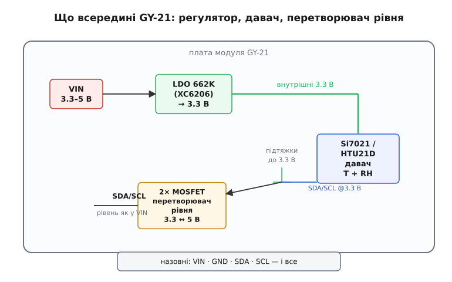
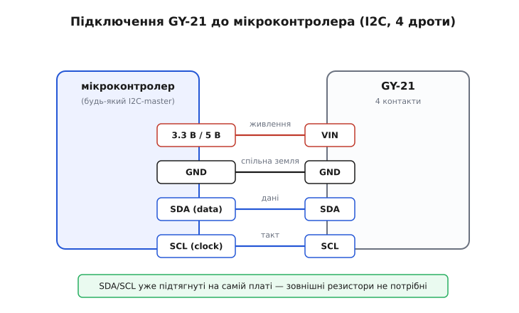

# GY-21 (Si7021 / HTU21D) — температура і вологість

<preknowlist>
- [Шина I2C](topic:com-devices/i2c-bus) — дві лінії SDA/SCL, ведучий і ведений, адреса пристрою; без цього не зрозуміти, як мікроконтролер розмовляє з давачем.
- [GY-серія брейкаут-модулів](topic:cat-hw-sensors/gy-series) — що таке дешева платка-переходник під голу мікросхему й що спільного має вся родина «GY-».
- [Відносна вологість повітря](topic:ph-thermodynamics/relative-humidity) — що означає «60 % RH»: скільки водяної пари в повітрі проти максимуму при цій температурі.
</preknowlist>

На макетній платі лежить чорний прямокутничок завбільшки з ніготь, з якого назовні стирчать чотири ніжки: `VIN`, `GND`, `SDA`, `SCL`. Це **GY-21** — крихітний модуль, що вимірює одразу дві речі: температуру повітря й відносну вологість. Уся робота вже зроблена всередині: не треба ні опорних резисторів, ні аналогового входу, ні калібрування. Мікроконтролер шле по двох дротах короткий запит — і за кілька мілісекунд отримує назад готове число: скільки градусів і скільки відсотків вологи. Ця стаття — про те, як упізнати такий модуль, що в нього всередині, чим Si7021 відрізняється від HTU21D, як його під'єднати й прочитати, і де саме він вас підведе.

Назва «GY-21» — це маркування **плати**, а не давача. Плата належить до великої [GY-серії](topic:cat-hw-sensors/gy-series) — сотень дрібних брейкаут-модулів, кожен із яких виносить одну мікросхему на зручну гребінку контактів. Тому саму спільну історію серії тут не переказуємо — гляньте оглядову статтю родини. Нас цікавить конкретно ця платка й давач на ній.

### Що на платі: давач, регулятор, перетворювач рівня

Придивіться до GY-21, і ви впізнаєте кілька деталей. Головна — квадратна металева мікросхема давача розміром із зернину, у корпусі **DFN** із заводською решіткою-мембраною зверху: крізь неї до чутливого шару доходить повітря. Це і є вимірювач. А довкола — обв'язка, яка й робить із голої мікросхеми зручний модуль.

Найважливіша частина обв'язки — маленький **регулятор напруги 662K** (це маркування мікросхеми [XC6206](topic:cat-hw-power/xc6206) у корпусі SOT-23) на звороті плати. Річ у тім, що сам давач живиться від напруги не вище **3.6 В**, а більшість дешевих плат-контролерів на кшталт Arduino Uno працюють від 5 В. Якби ви подали 5 В прямо на давач, ви б його спалили. Регулятор стоїть посередині: приймає на вхід будь-що від 3.3 до 5 В і видає давачу стабільні 3.3 В. Саме тому GY-21 можна безпечно живити хоч від 3.3-вольтового ESP32, хоч від 5-вольтового Arduino — за це відповідає цей регулятор.

Але живлення — півсправи. Лінії I2C (`SDA`, `SCL`) теж працюють на рівнях напруги, і якщо давач усередині «мислить» у 3.3 В, а контролер шле по шині 5 В, рівні не збігаються. Тому на платі стоять **два польові транзистори** — перетворювачі рівня (по одному на `SDA` і `SCL`). Це класична схема на двох MOSFET-ах, що зшиває 3.3-вольтову сторону давача з тим рівнем, який приходить іззовні. Через них назовні ви бачите лінії I2C уже в тій напрузі, якою живите модуль. Плюс на платі є **підтяжкові резистори** на лініях `SDA`/`SCL` — тому зовнішні підтяжки чіпляти не треба, шина вже готова.


*Устрій GY-21: вхідне живлення (3.3–5 В) стабілізується регулятором `662K` до 3.3 В; від них живиться давач Si7021/HTU21D і його підтяжки; дві лінії I2C виходять назовні крізь перетворювач рівня на двох MOSFET-ах, тому їхній логічний рівень дорівнює напрузі `VIN`.*

> 🔧 **Навіщо це.** Саме регулятор і перетворювач рівня роблять GY-21 таким зручним у практиці: ви не думаєте про напруги. Візьміть голу мікросхему Si7021 (без плати) — і мусите самі підвести їй рівно 3.3 В та узгодити рівні шини, інакше давач мовчить або гине. GY-21 ховає цей клопіт: чотири дроти, будь-яке живлення в межах 3.3–5 В — і працює.

### Два давачі під одним маркуванням: Si7021 і HTU21D

Тут криється пастка для новачка. На платах із маркуванням «GY-21» трапляється **два різних давачі** — і продавці рідко кажуть, який саме перед вами. Один — **Si7021** виробництва Silicon Labs. Другий — **HTU21D** виробництва Measurement Specialties (яку 2014 року купила TE Connectivity). Обидва — «цифрові давачі відносної вологості з виходом температури», обидва в тому самому корпусі DFN, обидва говорять по I2C з **тією самою адресою 0x40** і **тими самими командами**. Тому для більшості коду вони взаємозамінні: та сама бібліотека читає і той, і той.

Чому взагалі так вийшло? Обидві мікросхеми — нащадки давача **SHT21** фірми Sensirion; коли той став популярним, конкуренти зробили свої сумісні варіанти з тією самою розпіновкою й майже тим самим протоколом. Тому модуль «GY-21» проєктували так, щоб на нього ставав будь-який із цих сумісних чипів. Різниця між ними — у дрібницях, важливих лише в межових випадках:

- **Швидкість реакції на вологість.** HTU21D наздоганяє зміну вологості помітно швидше (кілька секунд), Si7021 — повільніше (за незалежними вимірами, десятки секунд). Якщо вам треба ловити швидкі стрибки вологи, HTU21D кращий.
- **Точність.** Обидва дають близько **±2 %** відносної вологості й **±0.3…0.4 °C** температури в робочому діапазоні — на око однаково.
- **Доступність.** Si7021 виробник **зняв з виробництва** (за оголошенням Silicon Labs — на початку 2025 року), тож нові платки дедалі частіше йдуть саме з HTU21D або іншими сумісними чипами.

Практичний висновок простий: пишіть код так, щоб він не залежав від того, який саме чип на платі. Оскільки адреса, команди й формули однакові, це виходить само собою — і ви навіть можете не знати, який давач у вас у руках.

> 🔧 **Навіщо це.** Не витрачайте час, намагаючись «точно визначити» чип за виглядом плати — це майже неможливо, бо корпус той самий. Замість цього прочитайте **електронний серійний номер** давача (є окрема команда) або просто покладіться на сумісність: якщо код працює з Si7021, він працює й з HTU21D. Розрізняти їх треба лише коли критична швидкість реакції на вологість — тоді шукайте плату явно з HTU21D.

### Що воно вимірює і в яких межах

Давач видає два числа. **Температуру** — у діапазоні від −40 до +125 °C (типова точність ±0.4 °C десь від 0 до 70 °C, до країв діапазону похибка більша). **Відносну вологість** — від 0 до 100 % (типова точність ±2 % у робочому вікні приблизно 5–95 %). Обидві величини вже **відкалібровані на заводі**: калібрувальні коефіцієнти зашиті в незмінну пам'ять кожної мікросхеми, тому давачі взаємозамінні й нічого підстроювати не треба.

Усередині сидить два окремих чутливих елементи. **Вологість** міряє ємнісний давач: тонкий полімер між обкладинками вбирає з повітря молекули води, від чого змінюється його ємність — а її мікросхема переводить у число. **Температуру** міряє вбудований температурний давач на кристалі; він потрібен і сам по собі, і для того, щоб уточнити показ вологості (ємність полімеру залежить від температури, і чип це компенсує).

За замовчуванням давач видає вологість із роздільністю **12 біт**, температуру — **14 біт**. Це можна змінити через регістр налаштувань, але для більшості задач стандартні значення й так надлишкові: 12 біт по вологості — це роздільність краще ніж 0.05 %, куди дрібніше за реальну похибку ±2 %.

Один важливий нюанс: **на шині I2C може жити лише один такий давач**. Адреса `0x40` зашита намертво й не змінюється джамперами — на відміну від багатьох інших модулів, де адресу можна зсунути. Якщо вам треба два давачі вологості на одній шині, доведеться або ставити мультиплексор I2C, або вішати другий давач на окрему пару ніжок.

### Як під'єднати

Підключення елементарне — чотири дроти, і всі підписані на платі.


*Розводка пін-у-пін: `VIN` — на живлення контролера (3.3 або 5 В, як зручно), `GND` — спільна земля, `SDA` і `SCL` — на однойменні лінії I2C мікроконтролера. Підтяжкові резистори вже на платі, тому зовнішні не потрібні.*

- **`VIN`** — на живлення. Будь-що від 3.3 до 5 В: за стабілізацію відповідає регулятор на платі. Зручно взяти той самий рівень, яким живиться контролер, — тоді й лінії I2C вийдуть у тій самій напрузі.
- **`GND`** — на спільну землю з контролером. Без спільної землі шина не працює.
- **`SDA`** — на лінію даних I2C контролера.
- **`SCL`** — на лінію такту I2C контролера.

На платі ESP32 стандартні ніжки I2C — часто `GPIO21` (SDA) і `GPIO22` (SCL), але їх можна перепризначити майже на будь-які. На Arduino Uno це `A4` (SDA) і `A5` (SCL). Уся хитрість — не переплутати `SDA` зі `SCL`; якщо переплутати, давач просто не відгукнеться, і скан шини нічого не покаже за адресою `0x40`.

### Як його читати: команда, пауза, три байти

Тепер найцікавіше — як із давача дістати число. Логіка одна для температури й вологості, відрізняється лише командний байт.

Ведучий (контролер) шле давачу **один командний байт**. Для вологості це `0xF5`, для температури — `0xF3` (це режим «без утримання шини» — давач не тримає лінію зайнятою, поки міряє). Отримавши команду, давач **починає вимір**, і на це йому потрібен час — до кількох мілісекунд (для вологості довше, для температури коротше). Поки він міряє, читати ще нічого. Тому контролер робить паузу, а потім **читає з давача три байти**: старший байт результату, молодший байт результату і байт **контрольної суми** (CRC).

Два байти результату складають у 16-бітне число — сире значення виміру. Але тут дрібниця, на якій спотикаються: **два молодших біти цього числа — не дані, а службові прапорці** (зокрема, тип виміру). Їх треба обнулити, наклавши маску `0xFFFC` (тобто «залишити всі біти, крім двох найменших»), інакше похибка в кілька останніх одиниць просочиться в результат.

Далі сире число переводять у людські одиниці за формулами з документації давача. Вони прості й лінійні:

```formula
Температура (°C) = 175.72 · raw / 65536 − 46.85
Вологість   (%)  = 125.0  · raw / 65536 −  6.0
```

Тут `raw` — те саме 16-бітне число (уже з обнуленими молодшими бітами), а `65536` — це 2¹⁶, повний розмах шістнадцяти бітів. Формули однакові й для Si7021, і для HTU21D — ще одна причина, чому код не мусить розрізняти чипи.

Розберімо на конкретному прикладі, як із трьох байтів вийти на температуру.

**Давач повернув байти `0x66`, `0x8C` у відповідь на команду температури `0xF3`.**
:::tabs
```cpp
// Складаємо два байти в 16-бітне сире значення:
uint16_t raw = ((uint16_t)0x66 << 8) | 0x8C;   // = 0x668C = 26252

// Обнуляємо два службових біти (маска 0xFFFC):
raw &= 0xFFFC;                                   // 0x668C = 0b...1100 -> без змін тут

// Переводимо у градуси за формулою давача:
float t = 175.72f * raw / 65536.0f - 46.85f;
//        175.72 * 26252 / 65536 - 46.85
//      = 175.72 * 0.400574   - 46.85
//      ≈ 70.40               - 46.85
//      ≈ 23.55 °C
```
```python
# Складаємо два байти в 16-бітне сире значення:
raw = (0x66 << 8) | 0x8C          # = 0x668C = 26252

# Обнуляємо два службових біти (маска 0xFFFC):
raw &= 0xFFFC                      # 0x668C = 0b...1100 -> без змін тут

# Переводимо у градуси за формулою давача:
t = 175.72 * raw / 65536 - 46.85
#   175.72 * 26252 / 65536 - 46.85
# = 175.72 * 0.400574   - 46.85
# ≈ 70.40               - 46.85
# ≈ 23.55 °C
```
:::
Отже, `0x668C` відповідає приблизно **23.6 °C** — типова кімнатна температура. Так само з вологістю, тільки командний байт `0xF5` і своя формула.

> 🔧 **Навіщо це.** Байт контрольної суми — не формальність. Лінії I2C на макетній платі з довгими дротами ловлять перешкоди, і зіпсований байт дасть безглузде число (скажімо, −45 °C у теплій кімнаті). CRC дозволяє це **зловити**: контролер перераховує суму з двох отриманих байтів і звіряє з третім; не збіглося — вимір відкидаємо й повторюємо. У серйозній прошивці цю перевірку роблять завжди, а не «коли є час».

Готова бібліотека ховає всі ці кроки — і команду, і паузу, і маску, і формули, і перевірку CRC — за парою простих викликів. Що саме з цього біжить по дротах — команди, тайміти, маска, CRC-8 із тестовими векторами, регістр налаштувань і скидання — зібрано в [довіднику протоколу GY-21](topic:cat-hw-sensors/gy-21/api-si7021.md). А готовий приклад застосування — кімнатний монітор клімату з тривогою за вологістю, від бібліотечного старту до аварійного просушування давача — розібрано в [проєкті на GY-21](topic:cat-hw-sensors/gy-21/proj-si7021.md).

### Чого стерегтися

Кілька речей, на яких найчастіше обпікаються.

**Самопрогрів.** Давач видає трохи завищену температуру, якщо міряти надто часто: власне живлення й вимір трохи гріють кристал, а поряд сидить давач вологості, який від того «бачить» нижчу вологість, ніж є насправді. Тому не опитуйте його в щільному циклі — раз на кілька секунд більш ніж досить. Якщо треба мірити частіше, у давача є вбудований нагрівач (окремий регістр вмикає його для випарювання конденсату), але це вже для особливих випадків, і в звичайному режимі його тримають вимкненим.

**Конденсат.** Якщо давач винести з тепла на холод (або навпаки), на мембрані осідає волога, і показ вологості надовго «залипає» на 100 %, поки крапельки не випаруються. Це не поломка — просто фізика. У вологих умовах допомагає той самий вбудований нагрівач.

**Плутанина з рівнем шини.** Хоч на платі й є перетворювач рівня, деякі дешеві клони йдуть без нього або з несправним — тоді 5-вольтова логіка може не «дотягуватися» до давача, і читання плаває. Якщо GY-21 працює лише коли живиться від 3.3 В, а від 5 В мовчить — це підозра саме на перетворювач рівня.

**Один давач на шину.** Ще раз: адреса `0x40` незмінна. Два GY-21 на одній парі `SDA`/`SCL` конфліктуватимуть.

**Не для рідин і бруду.** Це давач **повітря**. Крапля води, пил, пара розчинників на мембрані псують полімер і показ. Для вимірювання вологи в ґрунті чи воді потрібні зовсім інші давачі.

Підсумок: GY-21 — це майже ідеальний «побутовий» давач клімату. Дешевий, точний як для аматорської задачі, живиться від чого завгодно в межах 3.3–5 В, читається двома простими I2C-запитами й не потребує калібрування. Його беруть у метеостанції, зволожувачі, теплиці, «розумні» кімнатні датчики — усюди, де треба знати температуру й вологість повітря з пристойною точністю й мінімумом мороки.
