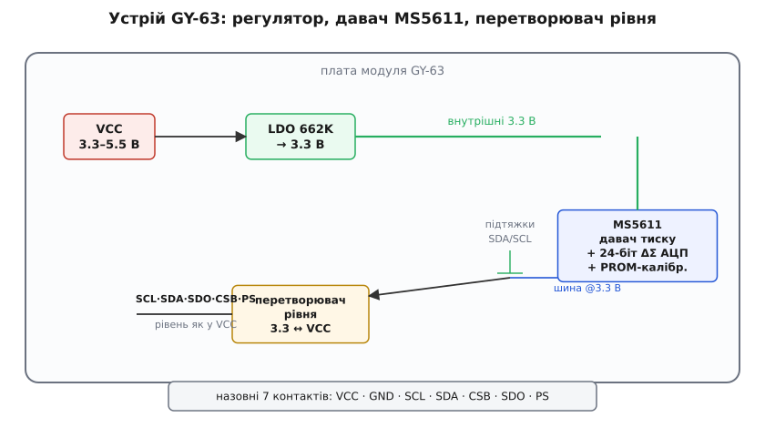
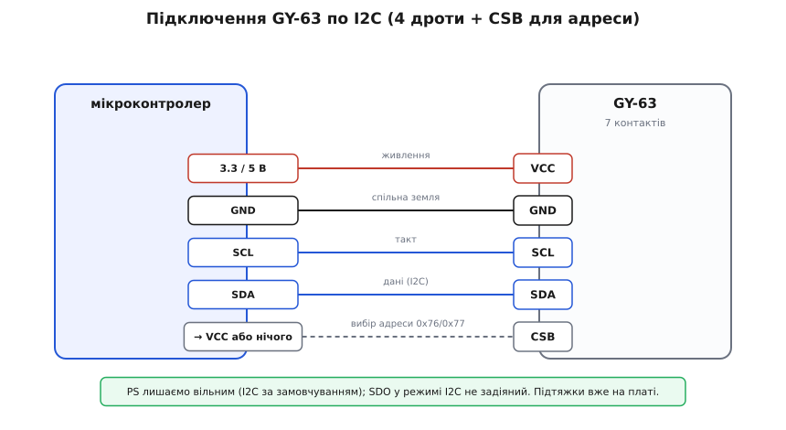
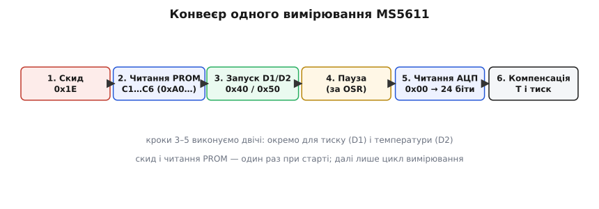

# GY-63 — прецизійний барометр MS5611

<preknowlist>
- [Шина I2C](root:com-devices/i2c-bus) — дві лінії SDA/SCL, ведучий і ведений, адреса пристрою: без цього не зрозуміти, як мікроконтролер розмовляє з давачем.
- [Шина SPI](root:com-devices/spi-bus) — чотири лінії (такт, дані туди, дані назад, вибір кристала): GY-63 уміє й так, і треба знати різницю.
- [Атмосферний тиск](root:ph-mechanics/atmospheric-pressure) — що таке тиск повітря, у чому міряється (мбар/гПа) і як він падає з висотою: сенс усього, що робить цей давач.
- [GY-серія брейкаут-модулів](root:cat-hw-sensors/gy-series) — що таке дешева платка-переходник під голу мікросхему й що спільного має вся родина «GY-».
</preknowlist>

На макетній платі лежить маленький синій або чорний прямокутник, а посеред нього — блискучий металевий ковпачок завбільшки з піврисинки, у якому пробита крихітна дірочка. Крізь ту дірочку до чутливого шару доходить повітря. Це **GY-63** — модуль атмосферного тиску на мікросхемі **MS5611**, і його головна риса не в тому, що він міряє тиск (це вміє й дешевший BMP280), а в тому, наскільки **дрібно** він його розрізняє. Він ловить різницю тиску, яка відповідає зміні висоти всього на **10 сантиметрів** — тобто «бачить», піднялися ви з підлоги на стіл чи ні. Саме тому його ставлять у висотоміри, варіометри (прилад, що показує швидкість підйому/спуску) і польотні контролери дронів. Ця стаття — про те, як упізнати такий модуль, що в нього всередині, як його під'єднати одразу двома способами й, найголовніше, як витягти з нього те саме точне число, бо сирі дані з MS5611 без обробки не значать нічого.

Назва «GY-63» — це маркування **плати**, а не давача. Плата належить до великої [GY-серії](root:cat-hw-sensors/gy-series) — сотень дрібних брейкаут-модулів, кожен із яких виносить одну мікросхему на зручну гребінку контактів. Тому спільну історію серії тут не переказуємо. Нас цікавить конкретна платка і мікросхема на ній.

### Звідки взявся MS5611 і чому «прецизійний»

Сам давач народився не в аматорському світі, а у швейцарській фірмі **Intersema Sensoric SA** з містечка Беве (Bevaix) — вона десятиліттями робила високоточні барометричні модулі для наручних годинників-висотомірів, метеостанцій і авіації. Наприкінці 2007 року (угода закрилася 28 грудня) Intersema купила американська **Measurement Specialties**, а та згодом стала частиною **TE Connectivity** — тому на сучасних даташитах ви бачите саме її логотип. Префікс «MS» у назві добре лягає на обидві компанії, але корінь давача — швейцарський MEMS-досвід виготовлення альтиметрів. Це не безіменний китайський чип: за ним стоїть родовід прецизійних приладів, і саме тому він точніший за масові барометри. *(Джерела: анонс придбання Intersema у Measurement Specialties, даташит MS5611-01BA03 від TE Connectivity — статус: усталено.)*

Ця різниця в походженні — не про престиж, а про те, чого чекати від давача. MS5611 несе заводську калібрувальну таблицю з шести коефіцієнтів і формули компенсації другого порядку — того, чого в найдешевших барометрах немає. За це ви платите трохи вищою ціною й трохи складнішим кодом, але натомість дістаєте повторюваність приладового рівня.

### Що воно вимірює і наскільки дрібно

MS5611 — це давач **абсолютного** тиску: він міряє тиск повітря відносно вакууму (а не відносно чогось іншого), тому годиться і як барометр, і як висотомір. Робочий діапазон — від **10 до 1200 мбар** (мілібар = гектопаскаль, гПа), що з великим запасом накриває земну атмосферу: на рівні моря близько 1013 мбар, на висоті 3–4 км — близько 650 мбар.

Точність у робочому вікні 450–1100 мбар — близько **±1.5 мбар**; за його межами трохи гірша, до ±2.5 мбар. Але ключове число інше — **роздільність**. При найвищому режимі згладжування давач розрізняє кроки тиску аж до **0.012 мбар**. Переведіть це у висоту: біля землі 0.012 мбар ≈ 10 см повітряного стовпа. Ось звідки славнозвісні «10 сантиметрів висоти».

Тут важливо не сплутати два різних поняття. **Точність** (accuracy) — наскільки абсолютне число близьке до правди; вона обмежена ±1.5 мбар, тобто «скільки саме зараз мілібар» давач знає з похибкою десь метр-півтора висоти. **Роздільність** (resolution) — найдрібніша зміна, яку він помічає; вона в сто разів краща. Для висотоміра саме роздільність і цінна: абсолютну висоту над рівнем моря ви все одно калібруєте по відомій точці, а от **зміну** висоти — «набрали ми метр чи ні» — давач ловить чудово. Дрон утримує задану висоту саме завдяки роздільності, а не абсолютній точності.

Крім тиску, давач віддає й **температуру** власного кристала. Вона потрібна не сама по собі (хоча її можна читати), а насамперед щоб **виправити показ тиску**: чутливість кремнієвої мембрани залежить від температури, і без цієї поправки барометр «попливе» на кілька мілібар при зміні погоди в кімнаті.

### Що на платі GY-63

Придивіться до модуля — і впізнаєте ту саму обв'язку, що й на інших GY-платах. У центрі — мікросхема давача MS5611 у крихітному корпусі QFN з металевим ковпачком і дірочкою для повітря. Довкола — деталі, що роблять із голого чипа зручний модуль.

По-перше, **регулятор напруги** (типово в корпусі SOT-23, маркування на кшталт «662K» — це XC6206 на 3.3 В). Сам MS5611 живиться напругою не вище **3.6 В**, а на гребінку модуля приходить те, що дає плата-носій: 5-вольтові родини (класичний Arduino Uno на AVR і будь-яка інша плата з 5 В на гребінці) подають 5 В, сучасні 3.3-вольтові (ESP32, STM32, RP2040) — 3.3 В. Регулятор приймає на вхід будь-що від 3.3 до 5.5 В і видає давачу стабільні 3.3 В — тому GY-63 не боїться 5-вольтового живлення.

По-друге, **перетворювач рівня** на лініях зв'язку. Давач усередині «мислить» у 3.3 В; якщо контролер шле по шині 5-вольтові рівні, їх треба узгодити, інакше в кращому разі давач мовчить, у гіршому — псується вхід. Класична схема на польових транзисторах зшиває 3.3-вольтову сторону давача із зовнішнім рівнем. По-третє, **підтяжкові резистори** на лініях I2C — тому для простого підключення зовнішні підтяжки не потрібні.


*Устрій GY-63: вхідне живлення (3.3–5.5 В) стабілізується регулятором до 3.3 В; від них живиться давач MS5611 із вбудованим 24-бітним ΔΣ-АЦП і заводською пам'яттю калібрування (PROM); лінії шини виходять назовні крізь перетворювач рівня, тому їхній логічний рівень дорівнює напрузі `VCC`.*

Назовні виходять **сім контактів** — і саме сім, а не чотири, бо MS5611 уміє розмовляти двома різними мовами. Ось вони:

- **`VCC`** — живлення, 3.3–5.5 В.
- **`GND`** — спільна земля.
- **`SCL`** — лінія такту (спільна для обох режимів).
- **`SDA`** — лінія даних. У режимі I2C це двонапрямна `SDA`; у режимі SPI це вхід даних у давач (`MOSI`, він же `SDI`).
- **`CSB`** — вибір кристала (Chip Select). У SPI — «слухай мене» (активний низький рівень). У I2C цей самий пін задає **адресу**.
- **`SDO`** — вихід даних із давача (`MISO`). Потрібен лише в SPI.
- **`PS`** — вибір протоколу (Protocol Select). Високий рівень (або лишити вільним, бо на платі підтягнуто) → **I2C**; низький (на землю) → **SPI**.

### Два способи під'єднати: I2C і SPI

Оце і є головна особливість GY-63 проти простіших барометрів: він дає вибір інтерфейсу, і ви обираєте під задачу.

**I2C — коли важлива простота.** Дві лінії, `SCL` і `SDA`, на однойменні ніжки контролера, плюс живлення й земля — і все; далі з ними працює штатний I2C-ведучий вашого середовища (у Arduino це `Wire`, в ESP-IDF — драйвер `i2c_master`, у STM32 HAL — `HAL_I2C_Master_Transmit`/`_Receive`, у Linux — `/dev/i2c-*`). Пін `PS` лишаєте вільним (плата сама підтягне його вгору й обере I2C). Пін `SDO` у цьому режимі не задіяний. Лишається `CSB`, і він тут відповідає за адресу:

```
CSB не під'єднаний (або на GND)  →  адреса 0x77
CSB на VCC                        →  адреса 0x76
```

Ця пара адрес — приємна дрібниця: два GY-63 можна повісити на **одну** шину I2C, задавши одному `0x76`, іншому `0x77`. Але не більше двох: третьої адреси немає.

**SPI — коли важлива швидкість або чистота сигналу.** Тоді `PS` на землю, і задіюються всі чотири лінії: `SCL` (такт), `SDA` як вхід (`MOSI`), `SDO` як вихід (`MISO`), `CSB` як вибір кристала. SPI не має адрес — кожен давач вибираєте окремою лінією `CSB`, тому давачів на шині може бути скільки завгодно, і працює вона на вищих частотах, ніж I2C. На дронах з їхніми довгими шлейфами й вимогою швидко опитувати барометр частіше беруть саме SPI.


*Розводка пін-у-пін для режиму I2C: `VCC` — на живлення контролера (3.3 або 5 В), `GND` — спільна земля, `SCL`/`SDA` — на однойменні лінії I2C; `CSB` на `VCC` дає адресу `0x76`, вільний `CSB` — `0x77`. Пін `PS` лишаємо вільним (обирає I2C), `SDO` у цьому режимі не потрібен. Підтяжки вже на платі.*

Вибір інтерфейсу — не примха, а рішення під задачу. На повільній метеостанції з одним давачем зручніший I2C: менше дротів. А от у польотному контролері, де барометр опитують сотні разів на секунду й поряд гудуть мотори, I2C з його відкритими лініями й повільним тактом ловить перешкоди — тому там переходять на SPI. GY-63 дозволяє те саме залізо пустити по будь-якому шляху, лише перемкнувши `PS`.

### Найважливіше: сире число з MS5611 саме по собі нічого не значить

Ось де GY-63 принципово відрізняється від наївного давача. Ви не можете просто «прочитати тиск». Замість готового значення давач віддає **два сирих 24-бітних числа** — умовно `D1` (сирий тиск) і `D2` (сира температура) — і **шість калібрувальних коефіцієнтів**, зашитих на заводі в його внутрішню пам'ять (**PROM**). Тиск у мілібарах ви мусите **обчислити самі** з цих восьми чисел за формулами виробника. Це плата за точність: кожна мікросхема відкалібрована індивідуально, її персональні коефіцієнти лежать усередині, і тільки поєднавши їх із сирими вимірами, ви дістанете правильне число.

Тому обмін із давачем — це невеликий **конвеєр**, а не одне читання.


*Конвеєр роботи з MS5611: при старті — скид і одноразове читання шести коефіцієнтів `C1…C6` з PROM; далі в циклі — запуск перетворення (окремо для тиску `D1` і температури `D2`), пауза на час перетворення, читання 24 бітів АЦП і, нарешті, обчислення температури й компенсованого тиску за формулами.*

Кроки такі. **При старті** ведучий шле команду **скиду** (`0x1E`) — вона змушує давач перезавантажити калібрувальну пам'ять у робочі регістри. Потім читає **шість коефіцієнтів** `C1…C6`: у PROM вони лежать за адресами `0xA2, 0xA4, … 0xAC` (адреса `0xA0` — заводські дані й контрольна сума, `0xAE` — CRC). Це робиться **раз** — коефіцієнти незмінні.

Далі в циклі вимірювання. Щоб дістати сирий тиск `D1`, шлемо команду запуску перетворення тиску (`0x40` плюс поправка на режим згладжування), **чекаємо**, поки давач перетворює (АЦП дельта-сигма працює не миттєво), а тоді командою читання АЦП (`0x00`) забираємо 24 біти. Так само окремою командою (`0x50` плюс режим) запускаємо перетворення температури й читаємо `D2`. Тобто один повний вимір — це **два** перетворення, тиск і температура, кожне зі своєю паузою.

Час паузи залежить від **режиму згладжування** (OSR, oversampling ratio) — скільки разів АЦП усереднює. Що більше усереднень, то дрібніша роздільність і тихіший шум, але й довша пауза:

```
OSR 256   →  ~0.6 мс   роздільність ~0.065 мбар
OSR 512   →  ~1.2 мс   ~0.042 мбар
OSR 1024  →  ~2.3 мс   ~0.027 мбар
OSR 2048  →  ~4.6 мс   ~0.018 мбар
OSR 4096  →  ~9.0 мс   ~0.012 мбар   ← ті самі «10 см»
```

Пауза критична: якщо прочитати АЦП **раніше**, ніж перетворення закінчилось, отримаєте попереднє або сміттєве значення. Тому або витримуєте час із таблиці із запасом, або опитуєте давач, поки він не звільниться.

### Формули компенсації: як із восьми чисел вийти на тиск

Тепер серце теми — як `D1`, `D2` і `C1…C6` перетворюються на градуси й мілібари. Це саме той обов'язковий рахунок, без якого барометр не працює. Розберімо його від сенсу, а не як магію.

Спершу знаходимо, **наскільки поточна температура відрізняється від опорної**, при якій калібрували. Коефіцієнт `C5` — це сира температура в точці калібрування, а `C6` — на скільки одиниць змінюється сира температура на кожен градус. Різницю сирого виміру й опори позначають `dT`:

```
dT   = D2 − C5 · 2⁸
TEMP = 2000 + dT · C6 / 2²³
```

`TEMP` виходить у сотих частках градуса: `2000` означає 20.00 °C, тому значення `2035` — це 20.35 °C. Множники `2⁸` і `2²³` — просто масштаб, у якому виробник зберігає коефіцієнти цілими числами (щоб рахунок ішов у цілій арифметиці, без чисел з комою — це важливо на слабких мікроконтролерах).

Тепер головне — тиск. Мембрана давача має дві характеристики, що **пливуть із температурою**: **зсув** (`OFFSET` — що вона показує при нульовому тиску) і **чутливість** (`SENS` — на скільки змінюється показ на одиницю тиску). Обидві уточнюємо на поточну температуру через щойно знайдений `dT`:

```
OFF  = C2 · 2¹⁶ + (C4 · dT) / 2⁷
SENS = C1 · 2¹⁵ + (C3 · dT) / 2⁸
```

Тут `C2` і `C1` — це зсув і чутливість у точці калібрування, а `C4` і `C3` — їхні температурні поправки. Логіка прозора: беремо заводське значення й додаємо поправку, пропорційну тому, наскільки ми відійшли від опорної температури.

Маючи виправлені `OFF` і `SENS`, дістаємо тиск із сирого `D1`:

```
P = (D1 · SENS / 2²¹ − OFF) / 2¹⁵
```

`P` виходить у сотих мілібара: `100009` означає 1000.09 мбар. Ось і все перше наближення.

**Другий порядок — для холоду.** У теплій кімнаті на цьому можна спинитись, але на морозі (у дрона на висоті буває −20 °C і нижче) залишкова похибка стає помітною, і виробник дає **компенсацію другого порядку**. Вона вмикається лише коли `TEMP` нижче 20 °C і додатково підсилюється нижче −15 °C:

:::tabs
```cpp
// поправки другого порядку (у цілій арифметиці)
if (TEMP < 2000) {                       // нижче 20 °C
    int64_t t2 = (int64_t)dT * dT >> 31;
    int64_t off2  = 5 * (int64_t)(TEMP - 2000) * (TEMP - 2000) / 2;
    int64_t sens2 = 5 * (int64_t)(TEMP - 2000) * (TEMP - 2000) / 4;
    if (TEMP < -1500) {                   // нижче −15 °C — ще сильніше
        off2  += 7 * (int64_t)(TEMP + 1500) * (TEMP + 1500);
        sens2 += 11 * (int64_t)(TEMP + 1500) * (TEMP + 1500) / 2;
    }
    TEMP -= t2;
    OFF  -= off2;
    SENS -= sens2;
}
```
```python
# поправки другого порядку (Python: цілі — довільної точності, // — цілий поділ)
if TEMP < 2000:                          # нижче 20 °C
    t2    = dT * dT >> 31
    off2  = 5 * (TEMP - 2000) * (TEMP - 2000) // 2
    sens2 = 5 * (TEMP - 2000) * (TEMP - 2000) // 4
    if TEMP < -1500:                     # нижче −15 °C — ще сильніше
        off2  += 7 * (TEMP + 1500) * (TEMP + 1500)
        sens2 += 11 * (TEMP + 1500) * (TEMP + 1500) // 2
    TEMP -= t2
    OFF  -= off2
    SENS -= sens2
```
:::

Після цих поправок формулу тиску рахують ще раз — уже з виправленими `OFF` і `SENS`. У теплі гілку просто пропускають, і код працює швидше.

Розгляньмо повний рахунок на конкретних числах.

**Давач повернув `D1 = 9085466`, `D2 = 8569150`, а з PROM прочитано `C1=40127, C2=36924, C3=23317, C4=23282, C5=33464, C6=28312` (типові значення з даташита MS5611).**
:::tabs
```cpp
// 1) температура:
int32_t dT   = 8569150 - 33464L * 256;      // = 8569150 - 8566784 = 2366
int32_t TEMP = 2000 + ((int64_t)dT * 28312 >> 23);
//             2000 + (2366*28312)/8388608  ≈ 2000 + 7  = 2007  → 20.07 °C

// 2) зсув і чутливість (виправлені на температуру):
int64_t OFF  = (int64_t)36924 * 65536 + ((int64_t)23282 * dT >> 7);
//           = 2420113408 + (23282*2366)/128  ≈ 2420113408 + 430472 = 2420543880
int64_t SENS = (int64_t)40127 * 32768 + ((int64_t)23317 * dT >> 8);
//           = 1314682368 + (23317*2366)/256  ≈ 1314682368 + 215516 = 1314897884

// 3) тиск:
int32_t P = (((int64_t)9085466 * SENS >> 21) - OFF) >> 15;
//         ≈ ( (9085466*1314897884)/2097152 - 2420543880 ) / 32768
//         ≈ 100009  → 1000.09 мбар
```
```python
# 1) температура:
dT   = 8569150 - 33464 * 256                # = 8569150 - 8566784 = 2366
TEMP = 2000 + (dT * 28312 >> 23)
#             2000 + (2366*28312)/8388608  ≈ 2000 + 7  = 2007  → 20.07 °C

# 2) зсув і чутливість (виправлені на температуру):
OFF  = 36924 * 65536 + (23282 * dT >> 7)
#           = 2420113408 + (23282*2366)/128  ≈ 2420113408 + 430472 = 2420543880
SENS = 40127 * 32768 + (23317 * dT >> 8)
#           = 1314682368 + (23317*2366)/256  ≈ 1314682368 + 215516 = 1314897884

# 3) тиск:
P = ((9085466 * SENS >> 21) - OFF) >> 15
#         ≈ ( (9085466*1314897884)/2097152 - 2420543880 ) / 32768
#         ≈ 100009  → 1000.09 мбар
```
:::
Отже, ці сирі числа означають **20.07 °C** і **1000.1 мбар** — типова кімната трохи нижче стандартного тиску. Температура вище 20 °C, тож гілку другого порядку пропускаємо. Саме цей приклад із даташита зручний для перевірки власного коду: підставте ті самі `C`-коефіцієнти й `D`-значення — і мусите дістати рівно ці числа.

Зрозуміти цей рахунок варто, навіть якщо потім користуєшся готовою бібліотекою. Коли барометр показує дурницю — −40 °C у теплій кімнаті чи тиск 300 мбар на столі, — причина майже завжди тут: переплутаний порядок байтів у 24-бітному числі, пропущений `2⁸` при `C5`, або перерахунок у 32-бітній змінній, де добуток `D1 · SENS` переповнюється (він не влазить у 32 біти — потрібні **64**). І навпаки: лише знаючи, звідки береться роздільність, ви свідомо обираєте OSR — гнатися за 4096 і 9-мілісекундною паузою є сенс тільки там, де ті 10 см справді потрібні.

Готова бібліотека ховає весь конвеєр — скид, читання PROM, запуск перетворень, паузи, обидва порядки компенсації — за парою викликів. Як зібрати на ній робочий барометр і варіометр — вимір тиску й температури, обчислення висоти, «обнулення» висоти в поточній точці, вибір OSR — розібрано в [прикладі коду для GY-63](root:cat-hw-sensors/gy-63/proj-ms5611.md). А коли готова бібліотека не підходить — треба свій драйвер, робота по SPI чи голий регістровий доступ, — увесь байтовий протокол MS5611 (команди, карта PROM, перевірка контрольної суми CRC-4 і сам код компенсації в 64-бітній арифметиці) зібрано в [довіднику по сирому MS5611](root:cat-hw-sensors/gy-63/api-ms5611.md).

### Від тиску до висоти

Раз давач бачить тиск так дрібно, найчастіша задача — перевести тиск у **висоту**. Атмосфера влаштована так, що тиск падає з висотою за відомим законом (у нижніх кілометрах — приблизно експоненційно; докладніше — у статті про [атмосферний тиск](root:ph-mechanics/atmospheric-pressure)). Стандартна барометрична формула дає висоту з поточного тиску `P` і опорного тиску на рівні моря `P₀`:

```
h ≈ 44330 · (1 − (P / P₀)^0.1903)      // метри
```

Число `P₀` (тиск на рівні моря, типово близько 1013.25 мбар) залежить від погоди, тому **абсолютну** висоту без свіжого `P₀` точно не порахуєш — саме тому альтиметри дозволяють «обнулити» висоту в поточній точці. А от **зміну** висоти давач ловить чудово: набрали ви метр чи ні — видно одразу, і жодна погода цьому не заважає, бо `P₀` за секунди підйому не змінюється. Ось чому MS5611 живе саме там, де важлива відносна висота: дрони, парапланерні варіометри, сходові лічильники кроків.

### Чого стерегтися

Кілька речей, на яких обпікаються найчастіше.

**Світло вбиває точність.** Це головна пастка саме MS5611. Кремнієва мембрана давача **чутлива до світла** — яскраве сонце чи навіть кімнатна лампа, що світить прямо в дірочку ковпачка, дають стрибки показу в кілька мілібар (метри «висоти» на рівному місці). Тому на дронах давач заклеюють шматочком **чорного поролону**: він пропускає повітря (тиск проходить), але не пропускає світло. Якщо ваш барометр «плаває» при зміні освітлення — це воно.

**Протяг і різкий тиск.** Давач такий чутливий, що ловить навіть подих, помах руки поряд, зачинення дверей у кімнаті, вітер у дірочку. Для стабільного показу його ховають від прямого потоку повітря — той самий поролон допомагає й тут, згладжуючи миттєві поштовхи.

**64 біти в рахунку — обов'язково.** Найпоширеніша помилка коду: рахувати компенсацію у 32-бітних змінних. Добуток `D1 · SENS` — це число близько 10¹⁹, воно **не влазить** у 32 біти й тихо переповнюється, даючи безглуздий тиск. Проміжні `OFF`, `SENS` і добутки мусять бути **64-бітними** (`int64_t`).

**Пауза після команди.** Прочитати АЦП раніше, ніж перетворення завершилось, — і замість виміру дістанете сміття або старе значення. Витримуйте час із таблиці OSR із запасом.

**Не BMP280 і не «той самий код».** GY-63 (MS5611) зовні схожий на дешевші барометри BMP180/BMP280, але це **інші** мікросхеми з іншими адресами, командами й формулами компенсації. Бібліотека від BMP280 із MS5611 не заговорить. Тому спершу впевніться, який саме чип на платі: маркування «GY-63» майже завжди означає MS5611, тоді як «GY-BMP280» чи «GY-68» — зовсім інші давачі.

**Один момент про самопрогрів.** У режимі частого опитування (сотні вимірів на секунду) давач трохи гріється власним споживанням, і його температура повзе вгору — компенсація це враховує, але якщо ви ще й вимірюєте температуру повітря цим самим давачем, вона вийде трохи завищеною. Для тиску це неважливо (компенсація по фактичній температурі кристала й потрібна), а от як термометр повітря MS5611 не найкращий.

Коли ж брати саме MS5611, а не простіший барометр? Відповідь — у слові «відносна». Якщо задача вимагає ловити зміну висоти до десятка сантиметрів — варіометр планериста, утримання висоти дрона, лічильник поверхів, — роздільність MS5611 виправдовує і вищу ціну, і 64-бітну арифметику, і поролон від світла. А для простого журналу погоди чи грубого висотоміра, де метр туди-сюди не критичний, дешевший [BMP280](root:cat-hw-sensors/gy-bmp280) зробить те саме меншим коштом — там прецизія MS5611 просто лежатиме без діла.
