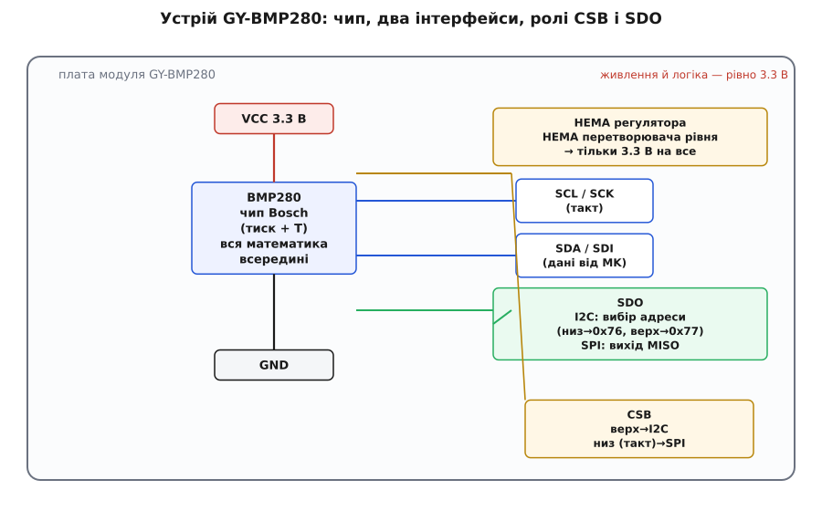
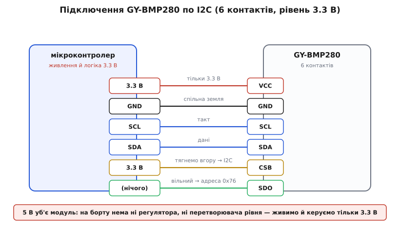

# GY-BMP280 — барометр і висотомір (BMP280)

<preknowlist>
- [Шина I²C](topic:com-devices/i2c-bus) — дві лінії SDA/SCL, ведучий і ведений, обмін байтами по регістрах; головний спосіб говорити з цим модулем.
- [Шина SPI](topic:com-devices/spi-bus) — чотири лінії (такт, дані туди й назад, вибір пристрою); другий інтерфейс, який той самий чип теж уміє.
- [Атмосферний тиск](topic:ph-mechanics/atmospheric-pressure) — що таке тиск повітряного стовпа, чому він падає з висотою і в яких одиницях його міряють (гПа/Па).
- [GY-серія брейкаут-модулів](topic:cat-hw-sensors/gy-series) — що таке дешева платка-переходник під голу мікросхему й що спільного має вся родина «GY-».
</preknowlist>

Візьміть у руку маленьку синю платку розміром із поштову марку, з якої стирчить гребінка на шість ніжок, а посередині сидить блискучий металевий квадратик завбільшки з макове зерно з крихітною діркою зверху. Це **GY-BMP280** — модуль, що вимірює **атмосферний тиск** і **температуру**. Дірка в металевій кришці чипа — не дефект: крізь неї повітря доходить до мембрани всередині, а мембрана відчуває, з якою силою на неї тисне атмосфера. А з тиску, якщо знати тиск унизу, легко порахувати **висоту** — тому цей давач так люблять у квадрокоптерах, метеостанціях і фітнес-браслетах, що рахують сходинки. Ця стаття — про те, як упізнати цю платку, що на ній насправді є (і, головне, чого на ній *немає*), як її під'єднати, не спаливши, і чому «сире» число з чипа саме по собі нічого не означає, поки ви не проженете його крізь заводські коефіцієнти.

Назва «GY-BMP280» складається з двох частин, і їх варто одразу розвести. **BMP280** — це сам давач, мікросхема виробництва **Bosch Sensortec** (німецький підрозділ Bosch, що робить MEMS-давачі для смартфонів). А «GY-» — це маркування дешевої **плати-переходника**, що виносить цю мікросхему на зручну гребінку; такою самою приставкою названі сотні інших модулів, і спільну історію цієї [GY-серії](topic:cat-hw-sensors/gy-series) тут не переказуємо — гляньте оглядову статтю родини. Нас цікавить конкретно ця платка з конкретним чипом на ній.

### Що це міряє і навіщо

BMP280 видає два числа: **тиск** і **температуру**. Тиск — у діапазоні від **300 до 1100 гПа** (гектопаскалів; 1 гПа = 1 мілібар — стара одиниця, яку досі люблять метеорологи). Щоб відчути межі: на рівні моря нормальний тиск близько 1013 гПа, а 300 гПа — це десь на висоті понад 9 кілометрів, вище за Еверест. Температуру давач міряє в діапазоні **−40…+85 °C**, але тут криється тонкість, до якої ще повернемося: температурний вимір потрібен BMP280 насамперед *не* заради самої температури, а щоб уточнити тиск. Повітря — це давач повітря; вологість BMP280 **не** міряє (це робить його старший брат BME280, і саме тут новачки найчастіше плутаються — про це нижче).

Головна цінність — не сам тиск, а **висота**, яку з нього рахують. Атмосферний тиск падає з висотою за відомим законом: що вище піднімаєшся, то менший стовп повітря над тобою тисне. Тому, порівнявши поточний тиск із тиском на землі, можна оцінити, на скільки метрів ви піднялися. BMP280 робить це з точністю до метра-двох — достатньо, щоб дрон утримував висоту, а браслет відрізнив другий поверх від третього.

> 🔧 **Навіщо це.** У квадрокоптері GPS дає висоту грубо — з похибкою в кілька метрів, і вона стрибає. Барометр натомість чутливий до найменшої зміни висоти: піднявся апарат на півметра — тиск ледь-ледь упав, і давач це ловить. Тому в польотних контролерах барометр і GPS працюють у парі: GPS дає абсолютну прив'язку, барометр — плавне й чутке утримання висоти. Без барометра дрон «плаває» вгору-вниз; з ним — стоїть як укопаний.

### BMP280 проти BME280 — одна буква, велика різниця

Перше, на чому спотикаються: на вигляд платки з написом «GY-BMP280» і «GY-BME280» майже однакові — той самий синій текстоліт, той самий металевий чип. Але це **різні давачі**. **BMP**280 міряє тиск і температуру. **BME**280 міряє тиск, температуру **й вологість** — усередині в нього є ще й ємнісний давач вологи, як у побутових гігрометрах. Літера в назві — `P` проти `E` — і є вся різниця.

Чому це важливо на практиці? По-перше, ціна: BME280 дорожчий, і недобросовісні продавці іноді продають дешевший BMP280 під виглядом BME280. По-друге, код: якщо ваша програма чекає від давача вологість, а на платі стоїть BMP280, вологості вона не дочекається — читатиме сміття з неіснуючого регістра. Розрізнити чипи можна програмно: у кожного свій **ідентифікатор**, який лежить у регістрі `0xD0` (BMP280 повертає `0x58`, BME280 — `0x60`). Тому перший крок будь-якої прошивки — прочитати цей байт і переконатися, що на платі саме те, на що ви розраховуєте.

BMP280, своєю чергою, — прямий нащадок давача **BMP180** (а той замінив ще старіший BMP085). Bosch представила BMP280 у 2012 році як наступне покоління: він точніший (роздільність тиску виросла з 1 Па до 0.16 Па), економніший (споживання впало приблизно вчетверо, до одиниць мікроампер) і менший. Тому в нових проєктах беруть саме BMP280, а BMP180 лишився в старих. Спільну лінійку барометрів Bosch — чим відрізняються BMP180, BMP280, BME280 і новіші, як обирати між ними — винесено в окрему [історію родини барометрів Bosch](topic:cat-hw-sensors/gy-bmp280/hist-bosch-barometers.md): звідки взявся барометр-на-чипі, навіщо він знадобився смартфонам і як лінійка розвивалася.

### Головна пастка: на платі немає ні регулятора, ні перетворювача рівня

А тепер — найважливіша річ про цю конкретну платку, і саме тут вона підступніша за багатьох родичів по GY-серії. Багато GY-модулів (скажімо, GY-21 з давачем вологості) несуть на борту **регулятор напруги** й **перетворювач рівня** — тому їх можна безпечно живити хоч від 5 В, хоч від 3.3 В, і вони самі розберуться. **GY-BMP280 цього не має.** Сам чип BMP280 живиться напругою не вище **3.6 В**, і на типовій дешевій платці «GY-BMP280» (та сама, що подекуди маркована «GY-BMP280-3.3») стоїть лише сам чип із кількома конденсаторами й підтяжками — і жодного регулятора, жодного перетворювача рівня.

Наслідок прямий і жорсткий: **живити й керувати цим модулем можна тільки 3.3 В**. Подасте на нього 5 В — з великою ймовірністю спалите чип. Заведете 5-вольтові лінії I²C від Arduino Uno — у кращому разі давач мовчатиме, у гіршому постраждає. Це не примха, а фізика: у чипа немає нічого, що б захистило його від зайвого вольта.


*Устрій GY-BMP280: чип живиться від 3.3 В (регулятора на платі немає), назовні виходять лінії обох інтерфейсів. Піни `CSB` і `SDO` — подвійного призначення: `CSB` вибирає I²C чи SPI, а `SDO` в режимі I²C задає адресу (0x76 або 0x77), у режимі SPI ж служить виходом даних.*

> 🔧 **Навіщо це.** Це рятує від найпоширенішої причини «мертвого» модуля. Якщо ви звикли, що GY-платки прощають 5 В, GY-BMP280 вас покарає. Тому: контролер бажано брати 3.3-вольтовий (ESP32, STM32, Raspberry Pi Pico) — тоді все живлення й уся логіка природно на 3.3 В, і жодних клопотів. Якщо ж у вас 5-вольтова Arduino Uno, доведеться самому поставити зовнішній перетворювач рівня на лінії I²C й живити VCC від 3.3-вольтового виходу плати — інакше або тиша, або дим.

### Шість ніжок і два інтерфейси

На гребінці GY-BMP280 — **шість контактів**, і це більше, ніж у простих I²C-модулів, саме тому, що BMP280 уміє говорити **двома** мовами: по I²C і по SPI. Той самий чип, ті самі дані — але два різні способи їх передати. Розберімо кожен пін.

- **`VCC`** — живлення. **Тільки 3.3 В** (див. вище). Це найважливіше.
- **`GND`** — спільна земля з контролером. Без неї нічого не працює.
- **`SCL` / `SCK`** — лінія такту. У режимі I²C це `SCL` (тактова лінія шини), у режимі SPI — `SCK` (тактовий сигнал). Один фізичний пін, дві ролі.
- **`SDA` / `SDI`** — лінія даних *до* давача. У I²C це двонаправлена `SDA`; у SPI — `SDI` (дані, що входять у чип, тобто MOSI з боку контролера).
- **`CSB`** — «вибір чипа» (Chip Select, риска зверху означає «активний низьким»). Саме цей пін вирішує, яким інтерфейсом користуватися. Тримаєте `CSB` **притягнутим до VCC** (високий рівень) — чип працює по **I²C**. Починаєте смикати `CSB` тактами вибору — чип перемикається на **SPI**. Тому для I²C правило просте: `CSB` — на 3.3 В.
- **`SDO`** — теж пін подвійного призначення. У режимі SPI це вихід даних `MISO` (дані *від* чипа до контролера). А в режимі I²C він задає **адресу давача на шині**: притягнутий до землі — адреса `0x76`, притягнутий до VCC — адреса `0x77`. На типовій платі до `SDO` вже під'єднаний резистор, що тягне його донизу, тому «за замовчуванням» модуль сидить на `0x76`; лишите пін вільним — буде `0x76`, кинете на VCC — стане `0x77`.

Оці два піни подвійного призначення — `CSB` і `SDO` — і є вся хитрість шести ніжок. Розберетеся з ними один раз — і більше не плутатимете.

> 🔧 **Навіщо це.** Можливість зсунути адресу на `0x77` через `SDO` — це не дрібниця, а спосіб повісити **два** барометри на одну шину I²C: один лишаєте на `0x76`, другому притягуєте `SDO` до VCC — і він стає `0x77`. Так, наприклад, роблять диференційний вимір: один давач усередині корпусу, другий зовні, і за різницею тисків рахують швидкість повітря. Без двох адрес довелося б городити мультиплексор.

### Як під'єднати по I²C

Найчастіший спосіб — I²C: дві лінії даних плюс живлення, і два «керівні» піни, які просто ставимо в потрібне положення й забуваємо.


*Розводка пін-у-пін по I²C: `VCC` — на 3.3 В (і тільки!), `GND` — спільна земля, `SCL`/`SDA` — на однойменні лінії I²C контролера, `CSB` — притягнути до 3.3 В (щоб чип обрав I²C), `SDO` — лишити вільним (адреса `0x76`) або кинути на VCC для `0x77`.*

- **`VCC`** → 3.3 В контролера. Ніколи не 5 В.
- **`GND`** → спільна земля.
- **`SCL`** → лінія такту I²C (на ESP32 часто `GPIO22`, на Pico — `GP5`, на Arduino — `A5`).
- **`SDA`** → лінія даних I²C (на ESP32 часто `GPIO21`, на Pico — `GP4`, на Arduino — `A4`).
- **`CSB`** → на 3.3 В. Це вмикає режим I²C. Забудете притягнути — чип може «зависнути» між інтерфейсами й не відгукуватись.
- **`SDO`** → лишіть вільним для адреси `0x76`, або на 3.3 В для `0x77`.

Щодо **підтяжок** на лініях `SDA`/`SCL`: на самій платі GY-BMP280 зазвичай стоять резистори підтяжки, тому для короткого з'єднання зовнішні не потрібні. Але якщо на шині вже висить кілька пристроїв або дроти довгі — підтяжки з різних плат складаються паралельно й можуть виявитися заслабкими; тоді додають одну пару зовнішніх резисторів приблизно 4.7 кОм до 3.3 В. Якщо шина «не бачить» давача при скануванні — перше, що варто перевірити після напруги й `CSB`, це саме підтяжки.

Якщо вам потрібен **SPI** (наприклад, шина I²C уже забита або треба вища швидкість — SPI тут тягне до 10 МГц проти 3.4 МГц у I²C), розводка інша: `CSB` заводять на окремий вихід контролера й керують ним, `SDA/SDI` стає входом даних, `SDO` — виходом, `SCL/SCK` — тактом. Але для більшості аматорських задач I²C простіший, і саме його беруть за замовчуванням.

### Чому «сире» число нічого не означає без калібрування

А тепер — те, що відрізняє BMP280 від простого термометра й що конче треба зрозуміти, перш ніж писати код. Коли ви питаєте в давача тиск, він **не** повертає вам готові гектопаскалі. Він повертає **сире 20-бітне число** — просто відлік свого внутрішнього аналого-цифрового перетворювача. Це число *пов'язане* з тиском, але не дорівнює йому: залежність нелінійна, до того ж помітно «пливе» від температури й від індивідуальних особливостей кожного конкретного екземпляра чипа.

Bosch розв'язала це так. Кожну мікросхему на заводі **індивідуально калібрують** і зашивають у її незмінну пам'ять (NVM) набір **калібрувальних коефіцієнтів** — для температури це `dig_T1`, `dig_T2`, `dig_T3`, для тиску `dig_P1`…`dig_P9`. Ці коефіцієнти лежать у регістрах, починаючи з адреси `0x88`, і в кожного чипа вони *свої*. Щоб дістати справжній тиск, треба:

```
1. один раз прочитати з давача всі калібрувальні коефіцієнти (dig_T*, dig_P*);
2. прочитати сирий 20-бітний відлік температури й сирий 20-бітний відлік тиску;
3. прогнати сиру температуру крізь її формулу → отримати справжню °C
   і побічний продукт t_fine (число, що несе «температурну поправку»);
4. прогнати сирий тиск крізь його формулу, ВЖИВАЮЧИ t_fine → отримати справжні Па.
```

Ключова й неочевидна деталь — той самий **`t_fine`**. Температуру BMP280 міряє не лише (і не стільки) заради самої температури, а щоб порахувати цю поправку: мембрана тиску трохи по-різному поводиться при різній температурі, і `t_fine` це компенсує. Тому **порядок обов'язковий**: спершу температура (вона дає `t_fine`), і лише потім тиск (він `t_fine` вживає). Порахуєте тиск, не оновивши температуру, — отримаєте похибку, що росте, коли давач нагрівається чи охолоджується.

Самі формули — довгі поліноми з десятком коефіцієнтів; Bosch дає їх готовим еталонним кодом на C прямо в документації, і саме його (а не власні спроби) варто брати за основу. Повний розбір — звідки беруться ці коефіцієнти, як улаштована компенсаційна формула крок за кроком, чим цілочисловий (fixed-point) варіант відрізняється від варіанта з рухомою комою, і чому для найкращої точності потрібна 64-бітна арифметика — винесено в [математику компенсації BMP280](topic:cat-hw-sensors/gy-bmp280/math-compensation.md).

> 🔧 **Навіщо це.** Це пояснює, чому не можна просто «прочитати регістр тиску й вивести число» — вийде беззмістовний відлік на кшталт 415000, а не 1013 гПа. І чому не можна писати драйвер «на око»: коефіцієнти в кожного чипа свої, формула нелінійна, температурна поправка обов'язкова. На щастя, усю цю роботу вже зроблено в готових бібліотеках — вам лишається знати, що вона є, і не дивуватися сирим числам, якщо колись поліземо в регістри напряму.

### Від тиску до висоти

Останній крок — перетворити тиск у висоту, заради чого барометр здебільшого й беруть. Залежність тиску від висоти в атмосфері описує **барометрична формула**; у спрощеному вигляді, зручному для мікроконтролера, висоту рахують так:

```
h = 44330 · (1 − (p / p₀) ^ 0.1903)
```

Тут `p` — виміряний тиск, `p₀` — опорний тиск «на нулі висоти» (звідки відлічуємо), `44330` і `0.1903` — сталі, що випливають зі стандартної моделі атмосфери. Розберімо на прикладі.

**Давач показує тиск `p = 954.6 гПа`; за опорний беремо тиск на рівні моря `p₀ = 1013.25 гПа`.**
```c
float p  = 954.6f;      // виміряний тиск, гПа
float p0 = 1013.25f;    // опорний тиск на рівні моря, гПа

float h = 44330.0f * (1.0f - powf(p / p0, 0.1903f));
//        44330 * (1 - (954.6/1013.25)^0.1903)
//      = 44330 * (1 - (0.94211)^0.1903)
//      = 44330 * (1 - 0.98867)
//      = 44330 * 0.011327
//      ≈ 502 м
```
Отже, тиск 954.6 гПа відповідає висоті приблизно **500 метрів** над рівнем моря — типово для міста в передгір'ї.

Але тут — головне застереження, і його треба засвоїти твердо: **абсолютна висота настільки точна, наскільки точний ваш `p₀`**. Погода щодня зсуває тиск на рівні моря на десятки гПа, а кожен гПа — це приблизно 8 метрів висоти. Тому якщо взяти `p₀ = 1013.25` (стандарт), а насправді сьогодні антициклон і на рівні моря 1030 гПа, ваша «висота» промахнеться на сотню з гаком метрів. Через це барометр чудово міряє **зміну** висоти (піднявся дрон на метр — тиск упав, і це видно миттєво), але **абсолютну** висоту дає надійно лише тоді, коли ви знаєте справжній місцевий `p₀` — наприклад, звірили давач на землі перед злетом. У квадрокоптерах саме так і роблять: перед стартом запам'ятовують поточний тиск як «нуль», і далі рахують висоту *відносно* нього.

### Що з цим робити в коді

На практиці ніхто не пише компенсаційні поліноми руками — беруть готову бібліотеку, яка ховає і читання коефіцієнтів, і `t_fine`, і формули за парою простих викликів. Найпоширеніша під Arduino-ядро — `Adafruit_BMP280`: створюєте об'єкт, викликаєте `begin(0x76)` (або `0x77`), а далі `readTemperature()`, `readPressure()` і `readAltitude(seaLevelhPa)` повертають готові градуси, паскалі й метри. Повний робочий приклад на C/C++ — від перевірки ідентифікатора чипа (`0x58` проти `0x60`, щоб не сплутати з BME280) до читання тиску, температури й висоти, з налаштуванням передискретизації та фільтра й типовими пастками (той самий порядок «температура перед тиском», вибір адреси, звірка I²C) — винесено в [API-вставку модуля](topic:cat-hw-sensors/gy-bmp280/api-bmp280.md).

### Чого стерегтися

Кілька речей, на яких обпікаються найчастіше.

**5 вольтів — смерть.** Ще раз, бо це причина №1 мертвих модулів: на платі немає регулятора й перетворювача рівня. Живлення й уся логіка — рівно 3.3 В. Сумніваєтеся в контролері — виміряйте його вихід перед підключенням.

**Плутанина з BME280.** Платки схожі. Якщо код чекає вологість, а її немає, — прочитайте регістр `0xD0`: `0x58` це BMP280 (без вологості), `0x60` — BME280 (з вологістю). Не покладайтеся на напис продавця.

**Забутий `CSB`.** У режимі I²C `CSB` треба притягнути до VCC. Лишите «висіти в повітрі» — чип може не визначитися, який інтерфейс йому обрати, і мовчатиме. Багато дешевих плат уже мають підтяжку `CSB` до VCC, але не всі — перевірте.

**Самопрогрів.** Як і будь-який давач температури поряд із власною електронікою, BMP280 трохи гріється сам і при частому опитуванні показує температуру на частку градуса вищу за справжню. Для тиску це майже байдуже (компенсація це враховує), а от як термометр повітря BMP280 — посередній: його температура радше «службова», для поправки тиску, ніж точний вимір клімату. Треба точну температуру повітря — беріть окремий давач.

**Абсолютна висота «пливе» з погодою.** Барометр не знає, який зараз тиск на рівні моря, — ви мусите йому сказати. Без свіжого `p₀` абсолютна висота промахується на десятки метрів. Надійне застосування — **зміна** висоти від запам'ятованого «нуля».

**Це давач повітря.** Дірочка в кришці чипа веде до чутливої мембрани. Крапля води, пил, потік розчинника, різкий подув просто в отвір — усе це псує вимір або сам давач. У вологих чи брудних умовах модуль ховають за пилозахисною мембраною або в продувний, але захищений корпус.

Підсумок: GY-BMP280 — дешевий, точний і економний спосіб дати мікроконтролеру відчуття атмосферного тиску, а з нього — висоти з точністю до метра. Він читається двома простими I²C-запитами, уміє й SPI, дозволяє повісити на шину два давачі різними адресами. Плата за це — сувора вимога 3.3 В (жодного регулятора на борту), обов'язкова заводська компенсація сирого числа й розуміння, що абсолютна висота настільки правдива, наскільки правдивий ваш опорний тиск. Його беруть у дрони, метеостанції, висотоміри, «розумні» годинники — усюди, де треба знати, наскільки високо ти є і як міняється погода.
