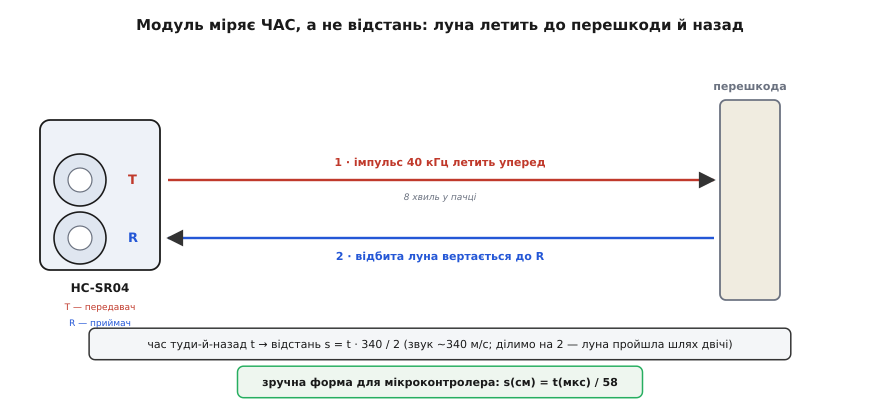
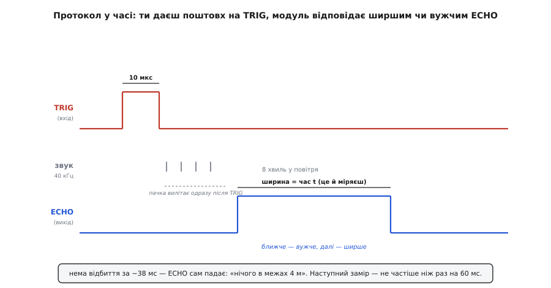
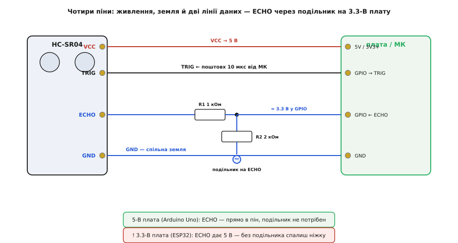

# HC-SR04 — ультразвуковий далекомір

<preknowlist>
- [Хвилі й звук](topic:ph-waves/sine-wave) — звук це механічне збурення повітря, що поширюється зі скінченною швидкістю (~340 м/с) і відбивається від перешкод; на цьому тримається весь принцип модуля.
- [GPIO-регістри](topic:sf-devices/gpio-registers) — як із коду підняти чи опустити одну ніжку мікроконтролера; саме так формують поштовх на TRIG і читають ECHO.
- [millis / micros — час у мікроконтролері](topic:sf-devices/millis-micros) — як програмно виміряти проміжок часу з точністю до мікросекунд; ширину імпульсу ECHO ти переводиш у відстань саме через цей час.
- [Логічні рівні як діапазони](topic:hw-digital/logic-levels-as-ranges) — що таке 5-вольтова й 3.3-вольтова логіка й чому не можна наосліп подавати 5 В на ніжку 3.3-В плати.
- [Подільник напруги](topic:hw-analog/voltage-divider) — два резистори, що ділять напругу в заданому відношенні; ним «збивають» 5-вольтовий ECHO до безпечних 3.3 В.
</preknowlist>

Це та сама блакитна платка з двома сріблястими «очима», схожими на маленькі динаміки, яку бачиш чи не в кожному першому Arduino-проєкті: паркувальний радар, «розумне» сміттєве відро, робот, що не в'їжджає в стіну, вимірювач рівня води в баку. **HC-SR04** — ультразвуковий далекомір (англ. *ultrasonic ranging module* — модуль ультразвукового вимірювання відстані): він визначає, як далеко перед ним перешкода, не торкаючись її, за допомогою звуку, якого людина не чує. Коштує копійки, підключається чотирма дротами й дає відстань від приблизно двох сантиметрів до чотирьох метрів. Саме через це поєднання дешевизни й простоти він став стандартним «зором на дотик» для аматорської робототехніки.

Підступність у тому, що за простотою «підключив і читаєш сантиметри» ховається жорсткий протокол у часі та одна пастка з напругою, на якій новачки палять ніжки плат. Модуль не віддає відстань готовим числом — він віддає **імпульс, ширина якого і є вимірюваний час**, а перевести цей час у сантиметри й вчасно його зловити мусиш ти сам. Розберімо цю платку так, щоб упізнати її серед інших, підключити з першого разу без диму й розуміти, що коїться, коли числа стрибають або їх нема зовсім.

## Що це насправді таке

Два циліндрики на платі — не динаміки, а **ультразвукові перетворювачі** (англ. *transducer* — перетворювач): пристрої, що перетворюють електрику на звук і навпаки. Лівий (позначений T або Tx) — передавач: на нього подають швидкозмінну напругу, і його мембрана дрижить, штовхаючи повітря. Правий (R або Rx) — приймач: коли на його мембрану натрапляє звукова хвиля, вона дрижить і наводить крихітну напругу. Обидва працюють на частоті **40 кГц** — це вдвічі вище за поріг людського слуху (~20 кГц), тому звук модуля для нас беззвучний, звідси й «ультра» (лат. *ultra* — понад, за межею).

Між перетворювачами на платі сидить невелика схема керування з мікроконтролером: вона за твоєю командою жене на передавач пачку коливань, слухає приймачем відлуння й вимірює час між «пострілом» і «поверненням». Цей час вона віддає тобі назовні у вигляді імпульсу.

> 🔧 **Навіщо це.** Уся суть далекоміра в тому, що звук у повітрі летить **повільно й зі сталою швидкістю** — близько 340 метрів за секунду. Світло чи радіо на такій дистанції вертаються за наносекунди, і щоб зловити цей час, потрібна дорога швидка електроніка. А звук на відстань кількох метрів витрачає **мілісекунди** — час, який легко зміряти найдешевшим мікроконтролером. Ось чому саме звуком, а не світлом, дешево міряти близькі відстані. Луна летить туди й назад, і якщо знаєш її швидкість та час у польоті — знаходиш відстань.

## Принцип: міряємо час, а не відстань

Ключ до розуміння модуля — усвідомити, що він **не міряє відстань**. Він міряє **час**. Відстань з нього рахуєш уже ти.

Послідовність така. Ти даєш модулю команду «міряй». Він жене на передавач **пачку з восьми коливань** на 40 кГц — короткий «клац» ультразвуку, що летить уперед конусом. Ця хвиля мчить крізь повітря, натрапляє на перешкоду й частина її відбивається назад. Відбита луна повертається до приймача. Модуль засік момент пострілу й момент повернення — різниця між ними і є час польоту туди-й-назад.


*Передавач T «стріляє» пачкою з восьми хвиль 40 кГц уперед; відбита від перешкоди луна вертається до приймача R. Модуль знає час туди-й-назад — відстань з нього рахують за швидкістю звуку, поділивши шлях навпіл.*

Далі проста арифметика. Звук пройшов від модуля до перешкоди й назад — тобто **подвійну** відстань. Якщо час польоту `t`, а швидкість звуку `v ≈ 340` м/с, то шлях луни `v·t`, а відстань до перешкоди — половина цього:

```
s = v · t / 2
```

Ділимо на два, бо луна пройшла дорогу двічі — туди й назад. Підставмо числа в зручних одиницях. Швидкість звуку 340 м/с — це 0.034 см за мікросекунду. Тоді:

```
s(см) = 0.034 · t(мкс) / 2 = t(мкс) / 58.8  ≈  t(мкс) / 58
```

Оце «поділи мікросекунди на 58» — і є вся математика далекоміра. Виміряв, що луна летіла 580 мкс, — перешкода за 10 см. Летіла 5800 мкс — за метр. Саме цю формулу зашивають у код, і саме її наводить документація модуля.

> 🔧 **Навіщо це.** Число 58 не свята константа — воно тримається на швидкості звуку, а та **залежить від температури повітря**. При 0 °C звук летить ~331 м/с, при 25 °C — вже ~346 м/с, тобто на кілька відсотків швидше. Якщо міряти на морозі коефіцієнтом для теплої кімнати, кожен метр «попливе» на пару сантиметрів. Для паркувального радара це байдуже, а для точного вимірювача рівня — ні; там температуру беруть окремим давачем і підправляють швидкість. Поки що досить пам'ятати: точність модуля впирається не так у саму платку, як у те, що повітря буває різне.

## Часовий протокол: TRIG і ECHO

Тепер найважливіше для того, хто пише код, — **як саме** ти командуєш модулем і як він відповідає. Уся розмова йде двома ніжками: **TRIG** (від *trigger* — спусковий гачок) і **ECHO** (англ. *echo* — луна).

Щоб запустити вимір, ти подаєш на TRIG короткий імпульс: піднімаєш ніжку у високий рівень рівно на **10 мікросекунд** і опускаєш назад. Це той «спусковий гачок». Побачивши його, модуль сам, без твоєї участі, жене в повітря пачку з восьми хвиль 40 кГц.

Одразу після пострілу модуль піднімає ніжку **ECHO** у високий рівень — і тримає її високою рівно доти, доки не повернеться луна. Щойно приймач зловив відлуння, ECHO падає назад у нуль. Отже, **ширина високого імпульсу на ECHO дорівнює часу польоту** `t` — тому самому, який ти ділиш на 58. Твоя робота — виставити гачок і виміряти, скільки мікросекунд ECHO протримався високим.


*Ти даєш на TRIG імпульс 10 мкс; модуль випускає пачку й піднімає ECHO. Ширина ECHO дорівнює часу польоту t — ближча перешкода дає вужчий імпульс, дальша ширший. Нема відбиття за ~38 мс — ECHO падає сам, сигналячи «порожньо».*

Два числа тут варто запам'ятати, бо на них спотикаються.

**Перше — тайм-аут на ~38 мілісекунд.** Якщо перед модулем нічого немає (перешкода далі за 4 метри, або луна розсіялась і не повернулась), ECHO не може висіти високим вічно. Приблизно через 38 мс модуль сам опускає його — це сигнал «у межах досяжності порожньо». У коді це критично: не можна чекати кінця ECHO нескінченно, бо його може й не бути.

**Друге — пауза між вимірами не менша за ~60 мілісекунд.** Після пострілу в повітрі ще довго тиняється відлуння від стін, стелі, підлоги. Якщо вистрелити наступну пачку надто швидко, приймач зловить «хвіст» від попереднього пострілу й видасть маячню. Тому між замірами витримують хоча б 60 мс — це обмежує частоту вимірювань приблизно до 15–16 разів на секунду, чого для більшості задач з головою.

## Чотири ніжки: живлення й дві лінії даних

На платі — гребінка з **чотирьох контактів**, розкладка стандартна майже в усіх виробників:

```
Пін    Призначення
────────────────────────────────────────────
VCC    живлення +5 В
TRIG   вхід: сюди ти даєш імпульс 10 мкс
ECHO   вихід: звідси знімаєш імпульс завширшки в час польоту
GND    земля (спільна з мікроконтролером)
```

VCC і GND — живлення: модуль хоче **5 вольтів** і бере в спокої близько 15 міліампер, тож живиться напряму від тієї ж п'ятивольтової шини, що й Arduino. TRIG — вхід, ним керуєш ти. ECHO — вихід, ним відповідає модуль.

І ось тут головна пастка всієї платки. Модуль живиться від 5 В, тому й **ECHO видає повні 5 вольтів** у високому рівні. Для п'ятивольтової плати на кшталт Arduino Uno це рідна напруга — ECHO заводять прямо в будь-який цифровий пін, і все гаразд. Але дедалі частіше модуль чіпляють до плат, що живлять свою логіку **3.3 вольтами** — ESP32, ESP8266, STM32, Raspberry Pi Pico. Їхні ніжки розраховані щонайбільше приблизно на 3.6 В, і п'ять вольтів з ECHO їх **пошкоджує**: у кращому разі глючить, у гіршому — випалює вхід назавжди.


*VCC, TRIG і GND ідуть напряму. ECHO для 3.3-В плати заводять через подільник із двох резисторів (1 кОм і 2 кОм), що збиває 5 В до безпечних ~3.3 В. Для 5-В плати подільник не потрібен — ECHO йде прямо в пін.*

Рятунок простий — **подільник напруги** на лінії ECHO. Два резистори послідовно від ECHO до землі, а сигнал у ніжку мікроконтролера знімаєш із точки між ними. Типово беруть верхній резистор 1 кОм, нижній 2 кОм: тоді на ніжку припадає дві третини від п'яти вольтів, тобто [приблизно 3.3 В](topic:hw-analog/voltage-divider). TRIG навпаки — це вхід модуля, і 3.3-вольтового імпульсу від плати йому зазвичай вистачає, щоб спрацювати, тож TRIG заводять напряму.

> 🔧 **Навіщо це.** Це та помилка, через яку «новий модуль одразу здох». Перевір напругу логіки своєї плати **перш ніж** тицяти ECHO в пін: 5 В — заводь прямо, 3.3 В — тільки через подільник (два резистори коштують копійки). Існують і новіші версії модуля — HC-SR04+ чи «3V3-сумісні», що самі узгоджують рівні й живляться від 3.3 В без подільника; але класична синя платка, якої в продажу найбільше, — саме п'ятивольтова, і подільник для неї обов'язковий.

## Куди дивиться модуль і чого не бачить

Далекомір не «бачить» точку прямо перед собою — він засвічує ультразвуком **конус** приблизно 15 градусів завширшки й повертає відстань до **найближчого** об'єкта, що потрапив у цей конус. Це має практичні наслідки. Тонкий стовпчик збоку модуль помітить, навіть якщо цілишся повз нього. Дрібну перешкоду просто перед носом — теж, але не скажеш, ліворуч вона чи праворуч: кутового розрізнення в нього немає, лише «щось на такій-от відстані».

Ще важливіше — **не все відбиває звук однаково**. Найкраще луна вертається від рівної твердої поверхні, поставленої **перпендикулярно** до модуля: стіна, коробка, дно бака. А от:

- **М'які й пухнасті речі** (тканина, штори, поролон, сніг) звук глушать — луна виходить квола, і модуль може їх «не побачити». Тут працює [акустичне поглинання](topic:ph-waves/molecular-relaxation-sound-absorption): пориста поверхня гасить хвилю замість відбити.
- **Гладка поверхня під кутом** відбиває пачку **вбік**, а не назад — як промінь ліхтаря від дзеркала, поставленого косо. Луна не повертається до приймача, і рівна стіна під нахилом «зникає». Це найпідступніший випадок: перешкода є, а модуль її не бачить.
- **Дуже близькі об'єкти** (ближче ~2 см) модуль теж не міряє: луна повертається раніше, ніж передавач договорив свою пачку, і збиває вимір. Тому знизу є «сліпа зона».

> 🔧 **Навіщо це.** Знання цих меж рятує від годин ловлення «привидів». Робот, що не бачить косо поставленої стіни й в'їжджає в неї, — не зламаний, він просто отримав луну, яка полетіла вбік. Вимірювач рівня води, що глючить над піною, — теж норма: піна поглинає звук. Якщо об'єкт малий, м'який, косий або надто близький — HC-SR04 не помічник; там беруть інфрачервоний чи лазерний далекомір з іншою фізикою.

## Як читати його з коду

Робота з модулем у прошивці зводиться до трьох дій, які повторюєш у циклі: смикнути TRIG, зміряти ширину ECHO, поділити на 58. Ось найпростіший робочий приклад для Arduino — без бібліотек, «як воно є всередині»:

**Один вимір відстані в сантиметрах**
:::tabs
```cpp
const int TRIG_PIN = 9;
const int ECHO_PIN = 10;

void setup() {
    pinMode(TRIG_PIN, OUTPUT);
    pinMode(ECHO_PIN, INPUT);
    Serial.begin(9600);
}

long measureCm() {
    // 1. Спусковий імпульс: 10 мкс високого рівня на TRIG
    digitalWrite(TRIG_PIN, LOW);
    delayMicroseconds(2);
    digitalWrite(TRIG_PIN, HIGH);
    delayMicroseconds(10);
    digitalWrite(TRIG_PIN, LOW);

    // 2. Ширина високого імпульсу на ECHO = час польоту в мкс.
    //    Тайм-аут 30000 мкс, щоб не зависнути, коли луни немає.
    long t = pulseIn(ECHO_PIN, HIGH, 30000);

    if (t == 0) return -1;          // нічого не почули (порожньо/далеко)
    return t / 58;                  // мкс → см
}

void loop() {
    long cm = measureCm();
    if (cm < 0) Serial.println("out of range");
    else        { Serial.print(cm); Serial.println(" cm"); }
    delay(60);                       // пауза між вимірами ≥ 60 мс
}
```
```micropython
from machine import Pin, time_pulse_us
from time import sleep_ms, sleep_us

TRIG = Pin(9, Pin.OUT)
ECHO = Pin(10, Pin.IN)

def measure_cm():
    # 1. Спусковий імпульс: 10 мкс високого рівня на TRIG
    TRIG.low()
    sleep_us(2)
    TRIG.high()
    sleep_us(10)
    TRIG.low()

    # 2. Ширина високого імпульсу на ECHO = час польоту в мкс.
    #    Тайм-аут 30000 мкс, щоб не зависнути, коли луни немає.
    t = time_pulse_us(ECHO, 1, 30000)

    if t < 0:                    # нічого не почули (порожньо/далеко)
        return -1
    return t // 58              # мкс → см

while True:
    cm = measure_cm()
    if cm < 0:
        print("out of range")
    else:
        print(cm, "cm")
    sleep_ms(60)                 # пауза між вимірами ≥ 60 мс
```
```python
import time
import RPi.GPIO as GPIO

TRIG_PIN = 9
ECHO_PIN = 10

GPIO.setmode(GPIO.BCM)
GPIO.setup(TRIG_PIN, GPIO.OUT)
GPIO.setup(ECHO_PIN, GPIO.IN)

def measure_cm():
    # 1. Спусковий імпульс: 10 мкс високого рівня на TRIG
    GPIO.output(TRIG_PIN, GPIO.LOW)
    time.sleep(2e-6)
    GPIO.output(TRIG_PIN, GPIO.HIGH)
    time.sleep(10e-6)
    GPIO.output(TRIG_PIN, GPIO.LOW)

    # 2. Ширина високого імпульсу на ECHO = час польоту в мкс.
    #    Тайм-аут 30000 мкс, щоб не зависнути, коли луни немає.
    deadline = time.monotonic() + 0.030
    while GPIO.input(ECHO_PIN) == 0:
        if time.monotonic() > deadline:
            return -1            # нічого не почули (порожньо/далеко)
    start = time.monotonic()
    while GPIO.input(ECHO_PIN) == 1:
        if time.monotonic() > deadline:
            return -1
    t = (time.monotonic() - start) * 1_000_000  # с → мкс

    return int(t // 58)          # мкс → см

while True:
    cm = measure_cm()
    if cm < 0:
        print("out of range")
    else:
        print(cm, "cm")
    time.sleep(0.060)            # пауза між вимірами ≥ 60 мс
```
:::

Тут `pulseIn` робить головне — вимірює, скільки мікросекунд ECHO протримався високим, і повертає цей час. Три речі, які **обов'язково** мусять бути на місці, інакше модуль поводитиметься дивно:

1. **Тайм-аут у `pulseIn`.** Без третього аргументу `pulseIn` чекатиме імпульс **майже секунду**, якщо його немає, і весь скетч на цей час замре. Обмежуємо очікування (тут 30 мс — трохи більше за апаратні 38 мс модуля вистачить, а можна й точніше).
2. **Пауза ≥ 60 мс** наприкінці циклу — щоб відлуння попереднього пострілу вляглося.
3. **Перевірка на нуль/від'ємне** — «немає луни» це не «нуль сантиметрів», а «поза досяжністю»; плутати їх не можна.

Цей ручний спосіб має ваду: `pulseIn` **блокує** — поки триває вимір (до 30 мс), мікроконтролер не робить нічого іншого. Для робота, що має ще й крутити моторами й слухати команди, це задовго. Тому в реальних проєктах беруть готову бібліотеку — вона читає ECHO на перериваннях, не блокуючи програму, і додає корисне (медіанний фільтр проти поодиноких сплесків, робота з багатьма модулями відразу). Як користуватися нею й що вона робить під капотом — розібрано в окремому [практикумі з коду для HC-SR04](topic:cat-hw-sensors/hc-sr04/api-newping.md), від найпростішого `ping_cm()` до неблокувального читання й фільтрації шуму.

## Коротко про головне

HC-SR04 — дешевий ультразвуковий далекомір на 5 В, що міряє відстань від ~2 см до ~4 м, «стріляючи» пачкою звуку на 40 кГц і засікаючи час повернення луни. Він віддає не число, а **імпульс на ECHO завширшки в час польоту**; відстань рахуєш сам за формулою `см = мкс / 58`. Команда на вимір — імпульс 10 мкс на TRIG; між вимірами тримай паузу ≥ 60 мс. Дивиться конусом ~15°, бачить лише найближчу тверду перпендикулярну поверхню й не помічає м'якого, косого чи надто близького. Головна пастка — ECHO видає 5 В: на 3.3-вольтову плату його заводять **лише через подільник**, інакше палять ніжку. Усе решта — чотири дроти й три рядки коду.
