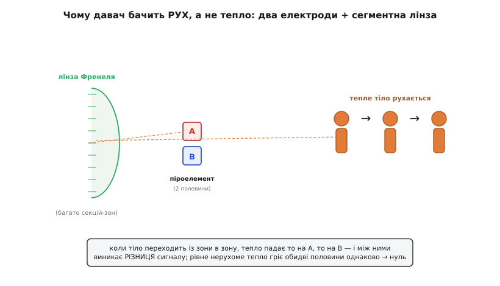
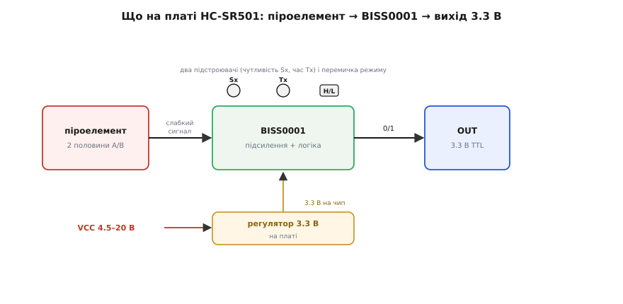
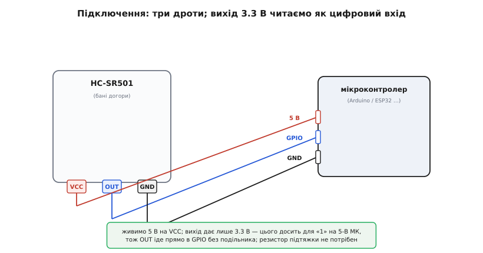
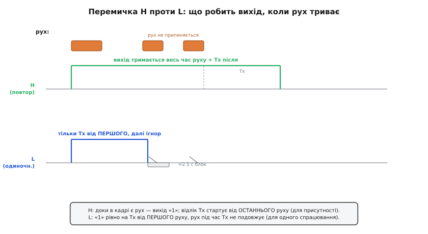

# HC-SR501 — PIR-давач руху

<preknowlist>
- [Піроелектричний ефект](topic:ph-condensed/pyroelectric-effect) — деякі кристали дають короткий сплеск заряду, коли їхня температура *змінюється*; на стале тепло не реагують.
- [Лінза Френеля](topic:ph-waves/fresnel-lens) — плаский «нарізаний» замінник опуклої лінзи: фокусує, майже не додаючи товщини й ваги.
- [Електромагнітний спектр](topic:ph-electromagnetism/em-spectrum) — тепле тіло світить у інфрачервоному діапазоні, невидимому оком; саме це випромінювання ловить давач.
- [Компаратор](topic:hw-analog/comparator) — схема, що каже «більше/менше за поріг» одним цифровим бітом; так слабкий сигнал перетворюється на чисте 0/1.
- [GPIO](topic:hw-digital/gpio) — цифровий вивід мікроконтролера, який уміє прочитати логічний рівень «високо/низько» на нозі.
</preknowlist>

Біла напівпрозора баня завбільшки з ніготь великого пальця сидить на маленькій зеленій платі приблизно 32 на 24 міліметри. Знизу з плати стирчать три штирки, поряд — два оранжеві коліщатка-підстроювачі й перемичка на три ноги. Це **HC-SR501** — найпоширеніший у світі аматорський давач руху: те, що вмикає світло в під'їзді, коли ви заходите, будить нічник, коли дитина встає, або надсилає сигнал тривоги, коли хтось перетнув кімнату. Коштує копійки, живиться від будь-чого в межах кількох вольтів і віддає готову відповідь «є рух / нема руху» одним проводом — навіть без бібліотеки.

Абревіатура PIR (англ. *Passive InfraRed* — пасивний інфрачервоний) містить головну ідею й головну пастку водночас. **Пасивний** — бо давач нічого не випромінює сам, лише *слухає* інфрачервоне світло, яке йде від теплих тіл довкола (на відміну від активних давачів на зразок ультразвукового [HC-SR04](topic:cat-hw-sensors/hc-sr04), що самі шлють імпульс і чекають луни). А от слово, якого в назві немає, але яке визначає всю поведінку приладу, — **рух**. HC-SR501 не вміє сказати «у кімнаті хтось є». Він уміє сказати лише «щось тепле щойно *ворухнулося*». Це не вада конкретного модуля, а прямий наслідок фізики, на якій він стоїть, — і поки цього не відчути, код із ним поводитиметься загадково.

### Чому давач бачить рух, а не тепло

Усе починається з крихітного кристалика під банею — **піроелектричного елемента** (грец. *pýr* — вогонь). Це матеріал, у якому [зміна температури](topic:ph-condensed/pyroelectric-effect) народжує короткий сплеск електричного заряду. Ключове слово — *зміна*. Якщо кристал нагріти й тримати теплим, заряду немає: сплеск виникає лише поки температура *повзе* вгору або вниз. Тепле нерухоме тіло поруч гріє елемент рівно й постійно — і елемент мовчить. А от коли тепле тіло *рухається*, потік інфрачервоного світла на кристал то зростає, то спадає, температура смикається — і кристал відгукується.

Але одного кристала мало, і тут — перший інженерний хід, що робить давач розумним. Усередині не один чутливий майданчик, а **два, поставлені поряд**, увімкнені *назустріч* один одному: один дає плюс, другий — мінус, а схема бачить лише їхню *різницю*. Навіщо так? Щоб відрізнити рух людини від того, що заважає. Уявіть, що сонце визирнуло з-за хмари й нагріло весь давач одразу — обидві половини нагріваються однаково, їхні сплески рівні й протилежні, різниця — нуль. Так само з поступовим прогрівом кімнати чи вашим власним теплом, що рівномірно оточує прилад. А коли людина *переходить* повз, її тепло падає спершу на одну половину, і лише за мить — на другу. На коротку хвилю різниця стає ненульовою — і саме цей момент давач ловить як «рух».


*Дві половини елемента (A і B) увімкнені назустріч: схема реагує лише на їхню різницю. Коли тіло переходить із зони в зону, тепло падає то на A, то на B — виникає сплеск різниці. Рівномірне нерухоме тепло гріє обидві половини однаково, різниця нульова — давач мовчить. Тому він бачить саме рух, а не присутність.*

> 🔧 **Навіщо це.** Диференційна пара — не хитрість для краси, а те, що робить давач придатним для життя. Без неї він спрацьовував би від сонячного зайчика, від увімкненого обігрівача, від власного нагріву на сонці — суцільні хибні тривоги. Пара «дві половини назустріч» гасить усе, що діє на прилад *рівномірно*, і лишає тільки те, що зачепило спершу одну половину, а тоді другу, тобто локальний рух. Це та сама ідея, що й у диференційному підсиленні: спільна завада вирахувалась, корисна різниця лишилась.

### Куди дивиться баня: лінза Френеля

Гола пара кристаликів «бачить» лише вузьку смужку простору просто перед собою — цього мало для кімнати. Роботу «дивитися широко» бере на себе та сама біла баня — це не прикраса й не захисний ковпак, а **лінза Френеля** (на честь Оґюстена Френеля, франц. фізика XIX ст.). Звичайна опукла лінза, щоб зібрати світло з широкого кута на маленький елемент, мусила б бути товстою й важкою. [Лінза Френеля](topic:ph-waves/fresnel-lens) робить те саме тонкою пластинкою: її поверхню ніби «нарізали» на концентричні кільця й зібрали докупи, лишивши тільки заломлювальні грані.

Але тут баня робить дещо хитріше, ніж проста лінза. Її поділено на **багато маленьких сегментів-лінзочок**, і кожна дивиться у *свій* окремий шматок простору — свою вузьку «зону». Разом вони вкривають широкий конус: типово близько **120 градусів** по горизонталі й до **7 метрів** углиб (ближчі 3 метри — найнадійніше). А головне — саме сегменти й створюють рух, який ловить елемент. Коли людина йде впоперек поля зору, її тепло по черзі потрапляє то в одну зону, то в наступну, то в дальшу — і на елементі це виглядає як низка спалахів, як миготіння смужок жалюзі, коли повз них ідеш. Кожен перехід «зона → сусідня зона» — це той самий сплеск різниці на парі кристалів. Тому людина, що йде *впоперек* давача, помітна набагато краще, ніж та, що йде *прямо на нього*: у першому випадку вона щомиті перетинає межі зон, у другому — довго лишається в одній.

### Що на платі: від слабкого сплеску до чистого 0/1

Сплеск заряду з піроелемента — мізерний і потонулий у шумі; напряму з ним нічого не зробиш. Уся інша начинка модуля існує, щоб цей сплеск підсилити, очистити й перетворити на цифровий сигнал, який зрозуміє мікроконтролер. Серцем тут працює одна мікросхема — **BISS0001** (виробник — Silvan Chip Electronics; це КМОН-контролер PIR-давачів, «аналогове мислення в цифровій обгортці»). Вона робить усе за один прохід: усередині — операційні підсилювачі, що піднімають слабкий сигнал елемента, [компаратор](topic:hw-analog/comparator) (бідиректорний детектор рівня), який спрацьовує, коли сплеск різниці перевищив поріг, і логіка витримки часу, що тримає вихід увімкненим потрібний проміжок.


*Слабкий сигнал двох половин елемента йде в BISS0001; той підсилює його, порівнює з порогом і на виході дає чисте «0» або «1» рівнем 3.3 В. Живлення (від 4.5 до 20 В на VCC) спершу проходить через окремий регулятор на 3.3 В, який годує чип стабільною напругою. Чутливість і час витримки задають два підстроювачі (Sx, Tx), а режим — перемичка H/L.*

Тут ховається важлива для схемотехніки деталь: **вхідна напруга й вихідний рівень — це різні речі**. На плату можна подати живлення в широкому діапазоні — паспортно **від 4.5 до 20 вольтів** (типово 5 В), — але BISS0001 усередині працює від стабільних **3.3 вольтів**, які дає окремий маленький [регулятор](topic:hw-power/ldo) на платі. Тому й вихідний штирок OUT видає у стані «є рух» саме **3.3 вольта**, а не стільки, скільки ви подали на живлення. Це не помилка й не поломка — так і задумано.

> 🔧 **Навіщо це.** Про рівень 3.3 В на виході треба знати заздалегідь, бо він визначає, як давач стикувати. Гарна новина: 3.3 В — це впевнена логічна «1» і для 5-вольтової логіки (Arduino Uno та інші AVR), і поготів для 3.3-вольтової (ESP32, більшість STM32), тож OUT заходить у цифровий вхід **прямо, без подільника й без підсилення**. Погана можлива несподіванка: якщо ви живите модуль від 3.3 В (не від 5 В), то регулятору може забракнути запасу напруги — 3.3 В на вході мінус втрати на регуляторі дадуть менше, ніж чипу треба, і давач поводитиметься капризно або не запуститься. Тому надійно живити HC-SR501 саме від **5 В**, навіть коли решта схеми на 3.3 В: вихід усе одно буде 3.3-вольтовий і сумісний з обома світами.

### Три піни й підключення

HC-SR501 навмисне зроблено дурнозахищеним: усього **три виводи**, і жодного інтерфейсу вивчати не треба. Порядок штирків залежить від партії, тож завжди звіряйтеся з підписами на самій платі (крихітні літери біля пінів), а не з чужим малюнком:

- **VCC** — живлення, сюди 5 В (можна від 4.5 до 20 В).
- **OUT** — вихід: 3.3 В, коли є рух; 0 В, коли немає.
- **GND** — спільний нуль (мінус живлення).


*Три дроти — і все: VCC на «плюс» живлення (5 В), GND на спільний нуль, OUT просто в будь-який цифровий вивід мікроконтролера. Вихід дає лише 3.3 В — цього досить для впевненої «1» на 5-вольтовому МК, тож подільник напруги чи підтяжка не потрібні. Давач ставлять банею назовні, туди, куди має дивитися.*

Читати такий вихід у прошивці — найпростіше, що є: налаштувати ногу на вхід і питати її рівень. Ось один і той самий робочий приклад у трьох середовищах — він вмикає світлодіод, поки давач бачить рух:

**Умова.** OUT давача заведено на звичайний цифровий вхід мікроконтролера, світлодіод — на цифровий вихід. Переривання тут не потрібне: рівень тримається секундами, тож вистачає простого опитування. У прикладах це D2/D13 на Arduino, GPIO4/GPIO2 на ESP32 і PA0/PC13 на STM32. Треба засвічувати світлодіод, коли є рух.

:::tabs
```arduino
const uint8_t PIR = 2;     // OUT давача
const uint8_t LED = 13;    // вбудований світлодіод

void setup() {
    pinMode(PIR, INPUT);   // вихід давача сам штовхає рівень — підтяжка не потрібна
    pinMode(LED, OUTPUT);
    Serial.begin(9600);
}

void loop() {
    int motion = digitalRead(PIR);   // 1 = є рух, 0 = немає
    digitalWrite(LED, motion);
    if (motion) Serial.println("рух!");
    delay(50);
}
```

```esp-idf
#include "driver/gpio.h"
#include "esp_log.h"
#include "freertos/FreeRTOS.h"
#include "freertos/task.h"

#define PIR GPIO_NUM_4     // OUT давача
#define LED GPIO_NUM_2     // світлодіод плати

static const char *TAG = "pir";

void app_main(void) {
    gpio_config_t in = {
        .pin_bit_mask  = 1ULL << PIR,
        .mode          = GPIO_MODE_INPUT,
        .pull_up_en    = GPIO_PULLUP_DISABLE,    // вихід давача сам штовхає рівень
        .pull_down_en  = GPIO_PULLDOWN_DISABLE,
        .intr_type     = GPIO_INTR_DISABLE,
    };
    ESP_ERROR_CHECK(gpio_config(&in));
    ESP_ERROR_CHECK(gpio_set_direction(LED, GPIO_MODE_OUTPUT));

    while (1) {
        int motion = gpio_get_level(PIR);        // 1 = є рух, 0 = немає
        gpio_set_level(LED, motion);
        if (motion) ESP_LOGI(TAG, "рух!");
        vTaskDelay(pdMS_TO_TICKS(50));
    }
}
```

```stm32
#include "main.h"          // CubeMX: PA0 — GPIO_Input без підтяжки (давач штовхає
                           // рівень сам), PC13 — GPIO_Output push-pull

#define PIR_PORT  GPIOA
#define PIR_PIN   GPIO_PIN_0      // OUT давача
#define LED_PORT  GPIOC
#define LED_PIN   GPIO_PIN_13     // світлодіод плати

void pir_loop(void) {              // викликати з main() після MX_GPIO_Init()
    while (1) {
        GPIO_PinState motion = HAL_GPIO_ReadPin(PIR_PORT, PIR_PIN);  // SET = є рух
        HAL_GPIO_WritePin(LED_PORT, LED_PIN, motion);
        if (motion == GPIO_PIN_SET) printf("рух!\r\n");   // printf виведено в UART
        HAL_Delay(50);
    }
}
```
:::

Ніякої бібліотеки, ніякого протоколу: одне читання рівня ноги — хоч `digitalRead`, хоч `gpio_get_level`, хоч `HAL_GPIO_ReadPin` — повертає готову відповідь, бо всю розумну роботу вже зробила BISS0001 на платі. Але одна засторога перетворює цей простенький код на джерело головного болю, якщо про неї не знати, — прогрів.

> 🔧 **Навіщо це.** Коли на HC-SR501 щойно подали живлення, він **не готовий одразу**: йому треба **30–60 секунд**, щоб «звикнути» до кімнати — усталити рівень фонового інфрачервоного тепла, від якого він відлічуватиме зміни. Протягом цієї хвилини вихід може безпідставно смикатися — то «1», то «0». Класична пастка новачка: залив скетч, давач одразу «спрацював сам по собі», людина півдня шукає ваду в коді, якої немає. Правильно — після ввімкнення живлення дати приладу спокійно постояти хвину (не махати перед ним руками) і лише тоді довіряти його виходу; у серйозній прошивці перші секунди після старту виходу давача просто ігнорують.

### Два коліщатка й перемичка: як налаштувати поведінку

Два оранжеві підстроювачі на платі — це не прикраса, а те, чим давач підганяють під задачу; крутять їх маленькою викруткою. Один задає **чутливість** (позначають Sx, англ. *sensitivity*), другий — **час витримки** (Tx, англ. *time delay*).

**Чутливість (Sx)** регулює, як далеко давач «дістає»: приблизно від 3 до 7 метрів. Проти годинникової стрілки — дальність меншає, за годинниковою — росте. Це не «гучність підсилення» в чистому вигляді, а радше поріг: більша чутливість — давач ловить слабший (дальший) рух, але й легше зривається на завади.

**Час витримки (Tx)** задає, **скільки вихід лишається у «1» після того, як рух помічено**, — від кількох секунд до кількох хвилин (типово приблизно від 5 секунд до 5 хвилин; у різних клонів межі гуляють, трапляється й від пів секунди). Саме цей час, а не тривалість самого руху, визначає, як довго горітиме ваше світло після одного проходу. Легко переплутати: людина махнула рукою частку секунди, а вихід тримає «1» усі виставлені, скажімо, тридцять секунд — це не помилка, це і є витримка Tx.

А тепер найтонше й найважливіше — **перемичка H/L** (маленький джампер на три ноги). Вона задає, що робити, якщо рух *не припиняється* під час витримки, і від неї залежить, придатний давач для «присутності» чи лише для «одного спрацювання».


*Верхня доріжка (H, повторний): щойно з'явився рух — вихід «1», і поки рух триває, він так і тримається; відлік витримки Tx стартує заново від останнього поміченого руху. Нижня доріжка (L, одиночний): вихід стає «1» рівно на час Tx від першого руху, а рух, що триває далі, не подовжує цей час; після падіння виходу настає короткий (близько 2.5 с) сліпий проміжок. H — для стеження за присутністю, L — для одного чистого спрацювання на подію.*

Розберімо обидва положення на пальцях, бо назви заплутують.

**H — повторний запуск** (англ. *repeat / retriggering*, іноді підписують «Hold»). У цьому режимі кожен новий рух під час витримки **перезапускає відлік** Tx із нуля. Наслідок: поки перед давачем хтось ворушиться, вихід тримається у «1» *безперервно*, і опуститься лише тоді, коли рух припиниться *і* спливе повний час Tx після останнього поворуху. Це те, що потрібно для освітлення, яке має **горіти, поки ви в кімнаті**: доки рухаєтесь — світло не гасне.

**L — одиночний запуск** (англ. *single trigger / non-repeat*). Тут перший рух дає «1» рівно на час Tx — і крапка: рух, що триває далі, **ігнорується**, відлік не подовжується. Через час Tx вихід падає незалежно від того, чи ще хтось перед давачем. Це зручно, коли треба **одне чисте спрацювання на подію** — наприклад, надіслати один сигнал тривоги чи один кадр із камери, не забиваючи канал повторами, поки об'єкт рухається.

> 🔧 **Навіщо це.** Вибір H чи L — найчастіша причина «давач поводиться не так, як я хочу», і жодним кодом це не лікується — це апаратна перемичка. Хочете світло, що горить, поки людина в кімнаті, — ставте **H**: інакше (на L) світло згасне через виставлений час, навіть якщо людина ще там, бо її подальший рух не подовжує витримку. Навпаки, хочете одну подію на прохід (лічильник відвідувачів, один знімок) — ставте **L**, щоб один об'єкт не давав шквалу повторних спрацювань. І ще: після того як вихід у режимі L опустився, є короткий сліпий проміжок близько **2.5 секунди**, коли давач нового руху не помічає, — тому дуже частіші за це події він рахувати не встигне.

### Як упізнати й чого стерегтися

HC-SR501 упізнається з першого погляду: біла кругла (рідше квадратна) баня з дрібними гранями-сегментами діаметром близько 23 мм, під нею — зелена плата ~32×24 мм, знизу три штирки з кроком 2.54 мм, поряд два підстроювачі й триногий джампер. З того самого сімейства бувають менші й простіші родичі (наприклад, мініатюрний **AM312** — без перемички й підстроювачів, одразу на 3.3 В), але саме HC-SR501 з його двома коліщатками й вибором режиму — робоча конячка аматорської електроніки.

Наостанок — перелік того, на чому спотикаються найчастіше, з причиною кожної біди:

- **Давач «спрацьовує сам» одразу після ввімкнення.** Майже завжди це не рух, а **прогрів**: перші 30–60 секунд вихід нестабільний, поки прилад звикає до кімнати. Дайте йому постояти хвину й не рухайтесь перед ним; у коді ігноруйте старт.
- **Світло гасне, хоча людина ще в кімнаті.** Перемичка стоїть у **L** (одиночний): подальший рух не подовжує витримку. Для присутності треба **H** (повторний).
- **Одна людина дає багато спрацювань поспіль.** Навпаки — стоїть **H**, а вам потрібне одне спрацювання на подію: перекиньте на **L**.
- **Хибні тривоги від тепла, протягів, сонця.** Диференційна пара гасить *рівномірні* завади, але **різкий локальний** рух гарячого повітря (протяг від батареї, штора над обігрівачем, промінь сонця, що повзе по підлозі) вона сприймає як рух тіла. Приберіть давач від прямого сонця, вікон, кватирок і гарячих поверхонь; зменшіть чутливість Sx.
- **Занадто велика дальність ловить рух у сусідній кімнаті / коридорі.** Скрутіть чутливість Sx проти годинникової стрілки або звузьте поле зору (частину сегментів лінзи можна закрити непрозорою стрічкою).
- **Людина, що йде прямо на давач, помічається погано.** Це фізика сегментної лінзи: рух *упоперек* поля зору перетинає межі зон і помітний краще, ніж рух *уздовж*. Ставте давач так, щоб типовий шлях людини йшов *поперек* його погляду (наприклад, збоку від дверей, а не навпроти них).
- **Живлення від 3.3 В — давач мовчить або капризує.** Регулятору бракує запасу напруги. Живіть від **5 В**; вихід усе одно лишиться 3.3-вольтовим і сумісним із 3.3-В логікою.

Що з HC-SR501 робити в коді — читати вихід, ігнорувати прогрів, гасити тремтіння сигналу й будувати з нього освітлення, охорону чи лічильник — зібрано в [окремому проєкті-вставці](topic:cat-hw-sensors/hc-sr501/proj-pir-firmware.md) з робочими прикладами під Arduino та ESP32. А головне про сам прилад тримається на одному реченні: він не бачить, що *хтось є*, — він бачить, що *щось тепле щойно рушило*, і вся правильна робота з ним випливає з цієї єдиної думки.
