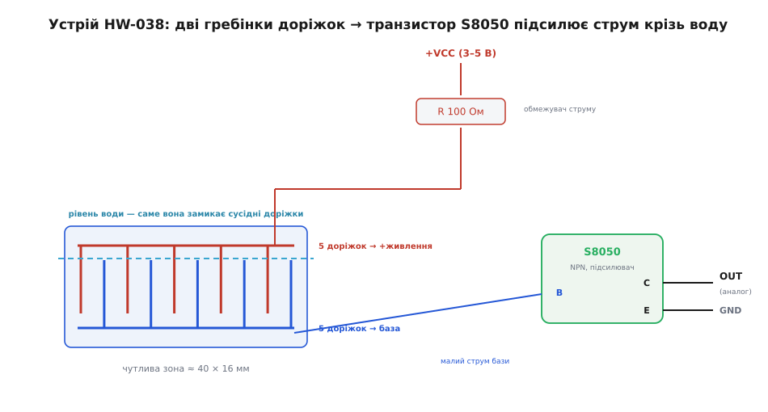
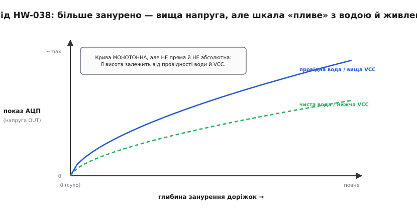
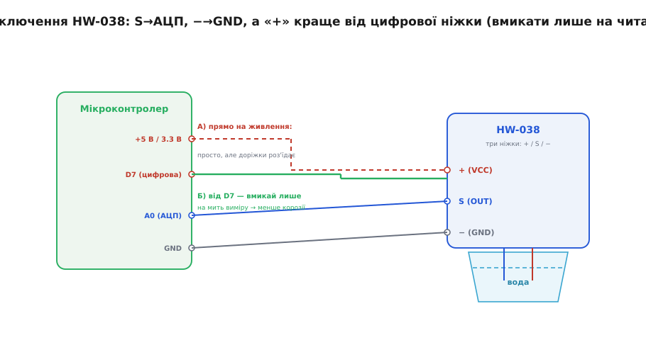

# HW-038 — давач рівня води

<preknowlist>
- [Провідність](root:ph-condensed/conductivity) — чому вода (з розчиненими солями) проводить струм, а чиста майже ні; від чого залежить її опір.
- [Аналого-цифрове перетворення (АЦП)](root:hw-analog/adc) — як мікроконтролер міряє напругу й перетворює її на число.
- [Транзистор як підсилювач/ключ (BJT)](root:hw-components/bjt-switch) — як малий струм у базі NPN керує більшим струмом колектора.
- [Керування ніжкою з коду (GPIO-регістри)](root:sf-devices/gpio-registers) — як із програми підняти чи опустити один вивід мікроконтролера.
- [Електроліз](root:ph-electromagnetism/electrolysis) — чому постійний струм крізь воду роз'їдає занурені металеві доріжки.
</preknowlist>

Це один із тих модулів, що лежать у кожному наборі «100 деталей для Arduino» і виглядають підозріло просто: вузька синя (рідше чорна) платка завдовжки з півмізинця, з десятком паралельних мідних смужок-«зубців» на одному кінці й трьома ніжками на іншому. Опускаєш зубці у воду — на виході з'являється напруга, і що глибше занурено, то вона вища. За копійки й три дроти виходить «вимірювач рівня води»: чи є вода в піддоні, чи не переповнилась ємність, чи не залило підвал.

Назва **HW-038** — просто заводський артикул безіменного китайського виробника; жодного слова-кореня за нею немає, розшифровувати нема чого. Той самий модуль продають і як «Water Level Sensor», і під десятком інших ярликів — усередині те саме. Уся суть — у тому, як ці мідні зубці перетворюють глибину води на напругу, і, головне, у тому, чого від такого давача **не варто чекати**. Розберімо річ так, щоб упізнати її, під'єднати з першого разу, витягти число в коді — і наперед знати, де вона підводить і чому довго не живе.

## Що це насправді таке

Придивімося до робочого кінця плати. Там не суцільна пластина, а **гребінка**: десять тонких мідних доріжок ідуть паралельно, як зубці двох вкладених одна в одну виделок. П'ять доріжок належать одній «виделці», п'ять — іншій, і вони чергуються: зубець одної, зубець другої, знову першої. Таке взаємопроникне розташування (англ. *interdigitated* — «пальці навзаєм») тут не примха дизайну, а сама основа роботи.

Одна виделка (її п'ять доріжок) через резистор на **100 Ом** приєднана до **живлення** (+). Друга виделка веде до **бази маленького транзистора** на платі. Поки повітря — між сусідніми зубцями розрив, струму нема. Занурюємо гребінку у воду — і вода, як провідник, **замикає проміжки** між зубцями обох виделок. Тепер від «плюсової» виделки крізь воду до «базової» тече малесенький струм.


*Десять доріжок чергуються двома «виделками»: п'ять ідуть на живлення через резистор 100 Ом, п'ять — на базу транзистора. Вода замикає проміжки між зубцями й пропускає малий струм у базу; транзистор S8050 підсилює його, і на виході OUT з'являється напруга. Що глибше занурено гребінку, то більше пар зубців у воді — то більший сумарний струм і вища напруга.*

Цей крихітний струм сам по собі мікроконтролеру не показати — він надто слабкий. Тому на платі стоїть **транзистор** — [біполярний NPN, що працює підсилювачем](root:hw-components/bjt-switch): малий струм у його базі керує помітно більшим струмом у колекторі. На типовому HW-038 це транзистор із маркуванням **S8050** (поширений дешевий NPN у корпусі TO-92 або SOT-23). Він перетворює кволий «водяний» струм у пристойну напругу на виводі **OUT** — таку, що АЦП мікроконтролера її вже спокійно бачить.

> 🔧 **Навіщо це.** Уся хитрість — у транзисторі. Без нього довелося б заводити мікроскопічний струм крізь воду прямо на вхід АЦП, а такий сигнал потонув би в шумах і навіть не ворухнув би відліку. Транзистор-підсилювач робить давач придатним для звичайної п'ятивольтової Arduino без жодної додаткової обв'язки: три дроти — і на аналоговому вході вже осмислена напруга. Плата за цю простоту — груба, «пливка» точність, про яку далі.

## Чому «рівень» — це насправді «скільки зубців у воді»

Тут ховається головне непорозуміння, через яке люди розчаровуються в цьому давачі. Він **не міряє висоту стовпа води в сантиметрах**. Він міряє, **яка частина його власної гребінки занурена**.

Механізм такий. Кожна пара сусідніх зубців під водою — це маленький «місток» струму. Що глибше опущено гребінку, то більше таких пар опинилося у воді, то більше містків працює **паралельно**, то менший їхній сумарний опір і тим більший струм у базу транзистора. Тому напруга на виході росте разом із глибиною занурення. Але прив'язана вона не до якогось абсолютного рівня, а до **довжини змоченої частини самих доріжок**. Виведи давач із води по-іншому нахиленим — і число зміниться, хоч рівень той самий.

І це ще не вся біда. Струм крізь воду залежить не лише від того, скільки зубців занурено, а й від **того, яка це вода**. Морська чи водопровідна з розчиненими солями [проводить добре](root:ph-condensed/conductivity) — струм великий, напруга висока. Дистильована чи дощова майже не проводить — той самий рівень дасть куди менший сигнал. Крім того, вихід залежить і від **напруги живлення**: годуй давач від 5 В — одні числа, від 3.3 В — інші.


*Занурюєш глибше — напруга росте, і росте монотонно, тож порівнювати «більше/менше води» можна. Але сама висота кривої не фіксована: провідніша вода чи вища VCC піднімають її, чиста вода чи нижча VCC — опускають. Тому давач дає відносну шкалу під конкретну воду й конкретне живлення, а не абсолютні сантиметри.*

Висновок, який варто засвоїти ще до покупки: **HW-038 — якісний, а не кількісний давач**. Він добре відповідає на питання «води більше чи менше, ніж було?», «чи дійшла вона до цього рівня?», «є вода чи сухо?». Він **погано** відповідає на «скільки саме міліметрів води в баку?» — для цього потрібне калібрування під конкретну рідину, і навіть тоді результат попливе, щойно зміниться склад води чи температура. Хочеш справжні сантиметри незалежно від того, що за рідина, — це інша фізика й інший давач (ультразвуковий далекомір над поверхнею, ємнісний чи поплавковий рівнемір).

> 🔧 **Навіщо це.** Обирай HW-038 під задачу, де досить **порогу чи тенденції**. Сигналізатор «піддон кондиціонера повний → вимкни», «у трюмі з'явилася вода → ввімкни помпу», «полив закінчив стікати» — його стихія. А от «показати рівень у баку у відсотках із похибкою пару відсотків» — не для нього: сьогодні бак долили дощівкою, завтра водопровідною, і вся твоя шкала з'їхала. Зрозумієш це наперед — не будеш потім боротися з «плаваючими» показами.

## Характеристики: скромні й чесні

Числа тут прості, бо й пристрій простий.

```
Параметр            Значення
──────────────────────────────────────────────
Живлення            DC 3–5 В
Струм споживання    < 20 мА
Вихід               аналоговий (напруга, росте з рівнем)
Чутлива зона        ≈ 40 × 16 мм (довжина гребінки × ширина)
Ніжки               3: S (OUT) / + (VCC) / − (GND)
Робоча температура  зазвичай 10–30 °C
```

Кілька зауваг, кожна з наслідком. **Живлення 3–5 В** означає, що давач однаково працює і з п'ятивольтовою Arduino Uno, і з трипроцентовим ESP32 чи STM32 — тільки пам'ятай, що від різної напруги він дає різні числа, тож калібрувати треба під ту саму, з якою потім працюватимеш. **Струм до 20 мА** — небагато, але й немало: це якраз стільки, що звичайна цифрова ніжка мікроконтролера (яка витягує 20–40 мА) може живити давач напряму — а живлення з керованої ніжки якраз і рятує гребінку від корозії. **Чутлива зона близько 40 мм** завдовжки — це вся робоча глибина: глибше гребінки води давач уже не «бачить», нижче її кінця — теж ні.

## Три ніжки

Виводів рівно три, і на платі вони підписані — читай напис, а не вгадуй за розташуванням, бо в різних партіях порядок буває різний:

```
Позначка      Призначення
──────────────────────────────────────────────
S  (або OUT)  аналоговий вихід — на вхід АЦП мікроконтролера
+  (або VCC)  живлення 3–5 В
−  (або GND)  земля
```

Ніяких перемичок, підтяжок чи вибору адреси — все, що є, це «дай живлення, візьми аналоговий сигнал». Саме тому давач такий популярний у перших проєктах: сплутати нема чого, крім хіба полярності живлення (не переплутай + і −, інакше в кращому разі не працюватиме, у гіршому — нашкодиш платі).

## Підключення пін-у-пін

Найпростіший варіант — три дроти:

```
HW-038          Мікроконтролер
──────────────────────────────────────────
 +  (VCC)  ────  +5 В (або 3.3 В)
 S  (OUT)  ────  аналоговий вхід (напр. A0)
 −  (GND)  ────  GND
```

Сигнальну ніжку **S** ведемо на **аналоговий** вхід — той, що вміє міряти напругу (на Arduino Uno це A0…A5, на ESP32 — піни з АЦП). На звичайний цифровий вхід її вести теж можна, але тоді ти втратиш усю «аналоговість» і матимеш лише «мокро/сухо» з випадковим порогом — сенсу в такому давачі майже не залишиться.

Але є **кращий** спосіб під'єднати живлення, і саме він відрізняє того, хто розуміє цей давач, від того, хто просто зібрав схему з картинки. Замість того щоб вести **+** прямо на постійні 5 В, заведи його на **цифрову ніжку** мікроконтролера (скажімо, D7):


*Сигнал S іде на аналоговий вхід A0, земля — на GND. Живлення «+» можна взяти двома способами. A) Прямо на постійні 5 В — просто, але доріжки під струмом у воді швидко роз'їдаються. Б) Від цифрової ніжки D7 — тоді програма вмикає живлення тільки на мить виміру, а решту часу давач знеструмлений, тож корозія майже спиняється.*

Чому саме так живити краще — це головна причина, чому такі давачі взагалі довго не живуть, і про неї варто сказати окремо.

## Корозія: чому давач «вмирає» і як його рятувати

Опусти цю гребінку у воду й тримай під постійною напругою — і за кілька днів-тижнів вона почне псуватися: мідь темніє, вкривається нальотом, покази пливуть і врешті давач бреше або мовчить. Це не брак, а фізика.

Коли крізь воду тече **постійний струм** в один бік, у ній іде [електроліз](root:ph-electromagnetism/electrolysis): на одній доріжці метал окислюється й потроху **йде у воду** (іони міді мігрують), на іншій осідає наліт із розчинених у воді речовин. Це той самий процес, що роз'їдає занурені металеві електроди в будь-якій «водяній» електроніці. Що вища напруга й що солоніша (провідніша) вода — то швидше. Постійна однобока полярність — найгірше, бо руйнування накопичується весь час в одному напрямку.

Звідси й порятунок: **не тримати давач під струмом постійно**. Води потрібне число раз на кілька секунд (а часто й раз на хвилину) — то навіщо гнати струм крізь гребінку решту часу? Живимо давач **тільки на мить виміру**: підняли живлення, зачекали, поки сигнал усталиться, зчитали АЦП, зняли живлення. Якщо давач живиться від постійних 5 В, так не зробиш — а от якщо його **+** заведено на цифрову ніжку, програма керує живленням сама. У результаті гребінка перебуває під струмом частки секунди на кожен вимір, а не цілодобово — і корозія сповільнюється в сотні разів.

> 🔧 **Навіщо це.** Це найголовніша практична порада щодо цього давача, і вона майже нічого не коштує — лише один зайвий дріт на цифрову ніжку й пара рядків коду. Хто про неї не знає, той через тиждень-два дивується, чому «новий давач почав брехати», і викидає його. Хто знає — той годує гребінку струмом лише на час виміру, і той самий копійчаний модуль служить місяцями. Якщо давачу судилося довго стояти у воді, це не забаганка, а обов'язок.

Повне живлення тільки на час виміру подовжує життя, але не робить давач вічним: розхідник він і є розхідник. Для по-справжньому довгих застосувань беруть безконтактні методи (ємнісні чи ультразвукові рівнеміри), де метал узагалі не торкається води. Але для дешевого сигналізатора трюк із цифровою ніжкою — найкраще, що можна зробити.

## Як витягти число в коді

Зчитати давач — це просто прочитати аналоговий вхід. Уся «розумність» коду — у двох речах: **живити давач лише на час виміру** (проти корозії) і **не вірити абсолютному числу без калібрування**.

Ось робочий кістяк на Arduino, який робить і те, і те:

:::tabs
```cpp
#define WATER_POWER_PIN  7    // цифрова ніжка живить давач (+ HW-038)
#define WATER_SIGNAL_PIN A0   // аналоговий вхід ← S (OUT) давача

void setup() {
    Serial.begin(9600);
    pinMode(WATER_POWER_PIN, OUTPUT);
    digitalWrite(WATER_POWER_PIN, LOW);   // за замовчуванням давач знеструмлений
}

int readWaterLevel() {
    digitalWrite(WATER_POWER_PIN, HIGH);  // подали живлення на гребінку
    delay(10);                            // ~10 мс, щоб сигнал усталився
    int value = analogRead(WATER_SIGNAL_PIN);  // 0..1023 на 10-бітному АЦП
    digitalWrite(WATER_POWER_PIN, LOW);   // одразу знеструмили — менше корозії
    return value;
}

void loop() {
    int level = readWaterLevel();

    // Пороги ПІД СВОЮ воду — визнач їх дослідом, не бери чужі!
    if (level < 50)        Serial.println("сухо");
    else if (level < 400)  Serial.println("трохи води");
    else                   Serial.println("багато води");

    delay(1000);   // раз на секунду досить; давач і так не живимо постійно
}
```
```micropython
from machine import Pin, ADC
import time

power = Pin(7, Pin.OUT)          # цифрова ніжка живить давач (+ HW-038)
power.value(0)                   # за замовчуванням давач знеструмлений
signal = ADC(Pin(26))            # аналоговий вхід ← S (OUT) давача

def read_water_level():
    power.value(1)               # подали живлення на гребінку
    time.sleep_ms(10)            # ~10 мс, щоб сигнал усталився
    value = signal.read_u16()    # 0..65535 на 16-бітному АЦП
    power.value(0)               # одразу знеструмили — менше корозії
    return value

while True:
    level = read_water_level()

    # Пороги ПІД СВОЮ воду — визнач їх дослідом, не бери чужі!
    if level < 3200:             # ~50/1023 у масштабі 0..65535
        print("сухо")
    elif level < 25600:          # ~400/1023 у масштабі 0..65535
        print("трохи води")
    else:
        print("багато води")

    time.sleep(1)                # раз на секунду досить; давач і так не живимо постійно
```
:::

Розберімо, чому код саме такий. `pinMode(WATER_POWER_PIN, OUTPUT)` і `digitalWrite(..., LOW)` у `setup()` роблять ніжку живлення керованою й одразу лишають давач вимкненим. У `readWaterLevel()` ми **вмикаємо** живлення, чекаємо коротку паузу (гребінка й вхід АЦП мають устоятися — 10 мс із запасом), **читаємо** `analogRead()` і **зразу вимикаємо**. Так гребінка під струмом лише ці 10 мс на кожен вимір.

Число з `analogRead()` — від 0 до 1023 (на 10-бітному АЦП Arduino Uno; на ESP32 діапазон інший). Але саме тут головна пастка: **абсолютні пороги 50 і 400 у прикладі — умовні**. Твоя вода, твоє живлення, твоя гребінка дадуть інші числа. Тому правильний шлях — **відкалібрувати самому**: опусти давач на «порожній» рівень, подивись у `Serial`, яке число; долий води до «повного» — запиши інше; а тоді став пороги між ними. Чужі константи з інтернету майже завжди не підійдуть.

> 🔧 **Навіщо це.** Дві звички роблять цей давач корисним, а не капризним. Перша — **живи його лише на час виміру** (той трюк із цифровою ніжкою): без неї давач швидко з'їдає сам себе. Друга — **завжди калібруй пороги під свою воду й своє живлення**, а не копіюй чужі числа: інакше «мокро» спрацьовуватиме то занадто рано, то занадто пізно. Зробиш обидві — і копійчаний модуль працюватиме передбачувано місяцями.

Повніший приклад — **із багатоточковим калібруванням (кілька відомих рівнів → таблиця чи лінійна прив'язка), усередненням кількох `analogRead` проти шуму, гістерезисом на порозі (щоб помпа не «дрижала» на межі) й версією під ESP32 з його ширшим АЦП** — зібрано в окремій [API-вставці «HW-038 у коді: живлення, калібрування, гістерезис»](root:cat-hw-sensors/hw-038-water-level/proj-hw038-driver.md).

## Куди він годиться, а куди ні

Зведімо, щоб не помилитися ще на етапі задуму.

**Годиться** там, де потрібен **поріг або тенденція**, а не точний рівень: сигналізатор переливу (піддон, акваріум, бак), «є вода в трюмі → вмикай помпу», контроль, чи стекла вода після поливу, індикатор «сухо / трохи / багато». Скрізь, де досить грубих «сходинок» і де вода більш-менш однакова за складом, HW-038 — дешеве й достатнє рішення.

**Не годиться** там, де важить **абсолютний рівень у одиницях**: скільки міліметрів у баку, який відсоток наповнення, точний об'єм. Для цього його показ надто залежить від складу води, температури й напруги живлення. Так само не бери його для **тривалого занурення без керування живленням** — корозія з'їсть гребінку. І не чекай від нього роботи з **чистою чи дистильованою водою** — вона майже не проводить, і сигнал буде кволий та нестабільний.

## Граблі, на яких спотикаються всі

Майже кожна проблема з HW-038 — з цього короткого списку, і майже кожна має просту причину.

**Давач «бреше» через кілька днів роботи — це корозія.** Гребінку тримали під постійною напругою у воді, і доріжки роз'їло. Заведи живлення на цифрову ніжку й вмикай його лише на час виміру. Якщо гребінка вже потемніла й вкрилася нальотом — почисти або заміни, чистого сигналу з роз'їденої не буде.

**Числа «пливуть», хоч рівень не міняється.** Найчастіше — змінилася вода (долили іншу) або живлення нестабільне. Пам'ятай: давач міряє провідність, а не висоту; під іншу воду треба перекалібрувати. Тримай і стабільне живлення тими самими 5 (чи 3.3) В.

**Показує майже нуль, хоч гребінка у воді.** Найімовірніше, вода занадто чиста (дистильована, дощова) — вона майже не проводить. Або переплутано ніжки живлення, або сигнал заведено не на аналоговий, а на цифровий вхід.

**Мій поріг «мокро» спрацьовує не там, де в прикладі.** Так і має бути: абсолютні числа в чужому коді — не твої. Відкалібруй пороги під свою воду й своє живлення, знявши покази на «сухо» й на «повно».

**На межі помпа то вмикається, то вимикається (дрижить).** Сигнал біля порога трохи шумить, і кожен дрібний коливок перемикає стан. Постав **гістерезис**: вмикай на одному рівні, вимикай на трохи іншому, а не на тому самому — тоді на межі нічого не «дрижатиме».

**Хочу справжні сантиметри — не виходить.** І не вийде цим давачем: він якісний, а не кількісний. Для абсолютного рівня незалежно від рідини потрібен інший принцип — ультразвуковий далекомір над водою, ємнісний або поплавковий рівнемір.
