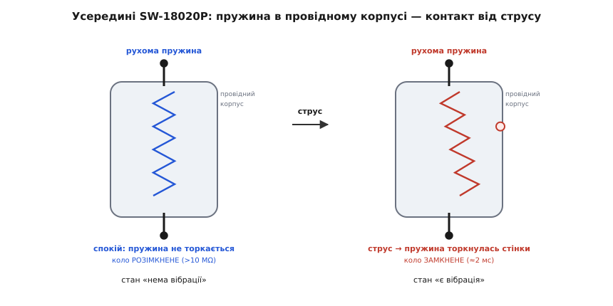
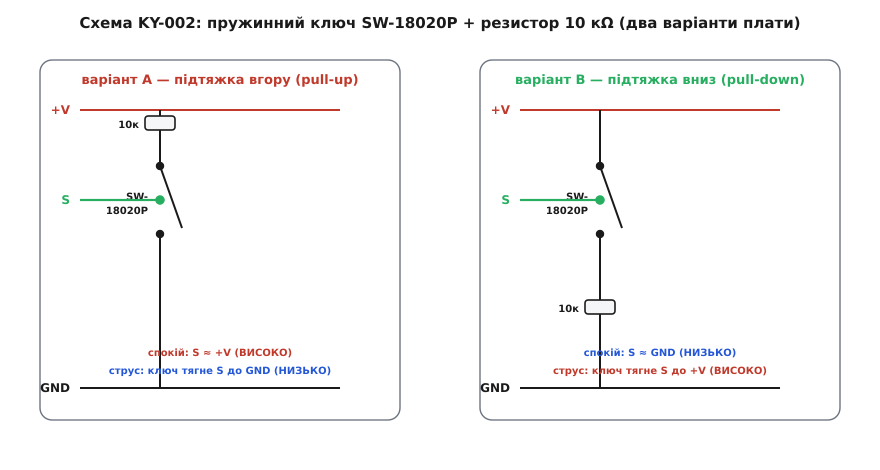
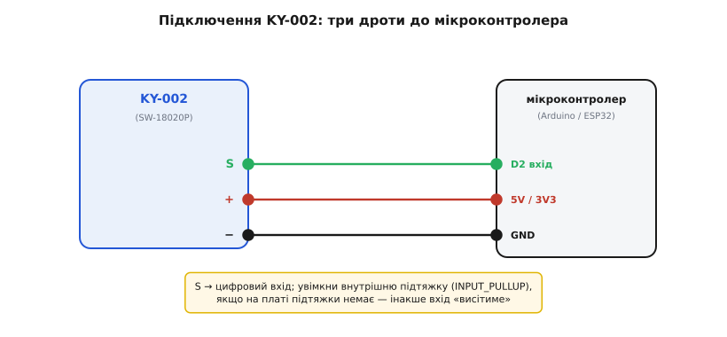

# KY-002 — давач вібрації (SW-18020P)

<preknowlist>
- [KY-серія (Keyes 37-в-1)](topic:cat-hw-sensors/ky-series) — спільна порода цих синіх платок: три штирі, живлення 3.3–5 В, «номер важливіший за виробника»; KY-002 — один із її модулів.
- [GPIO](topic:hw-digital/gpio) — цифровий вивід мікроконтролера, який уміє прочитати логічний рівень «високо/низько» на нозі; саме туди йде вихід давача.
- [Рівні «0» і «1»](topic:hw-digital/logic-levels-as-ranges) — що таке логічний «високо» й «низько» як діапазони напруги; від цього залежить, чи прочитає плата вихід давача правильно.
- [Підтяжка й «висячий» вхід](topic:hw-digital/floating-pullups) — чому цифровий вхід без підтяжки ловить наведення й показує сміття, і як резистор до живлення чи землі задає йому визначений рівень спокою.
- [Брязкіт контактів](topic:hw-digital/contact-debounce) — чому механічний контакт замикається не чисто, а короткою чергою «замкнув-розімкнув»; без розуміння цього код рахуватиме один струс за десяток.
</preknowlist>

На синій платці завбільшки з поштову марку сидить крихітний металевий циліндрик, схожий на обрізаний набій або на товсту таблетку з двома ніжками. Знизу — три штирі гребінки, і більш нічого: ні мікросхеми, ні підстроювального гвинтика, ні світлодіода-індикатора звіддалік. Це **KY-002** — найпростіший давач вібрації в аматорському наборі. Постукайте по столу, на якому він лежить, зруште його, дайте легкого стусана — і на його сигнальному виводі промайне короткий імпульс. Цей модуль — те, що будить іграшку від струсу, вмикає сигналізацію, коли хтось торкнувся дверей, або дає мікроконтролеру знати, що прилад упав чи його трясуть.

Уся суть KY-002 тримається на одному факті, і поки його не відчути, код із давачем поводитиметься незбагненно: **це не вимірювач вібрації, а вібраційний вимикач**. Він не скаже, наскільки сильно трясе й з якою частотою — він уміє лише замкнутися на коротку мить, коли струс перевищив поріг. По суті це звичайний вимикач, тільки натискає його не палець, а поштовх. Усе інше — і як його читати, і чому «один стук» перетворюється на купу спрацювань, і навіщо йому підтяжка — випливає з цієї єдиної думки.

KY-002 — член [KY-серії](topic:cat-hw-sensors/ky-series): те саме походження (бренд Keyes), той самий формат синьої платки на три штирі, та сама всеїдність за живленням. Спільну породу серії — звідки взялися ці модулі, чому «номер важливіший за виробника» й чому середній штир зазвичай живлення — розібрано в оглядовій статті родини; повторювати її тут не будемо. Наша розмова — суто про **специфіку KY-002**: що за деталь усередині, як улаштована його схема, чому вона має аж два несумісні варіанти й що з усього цього випливає для прошивки.

## Що за деталь усередині: пружинний вимикач SW-18020P

Серце модуля — один-єдиний компонент з підписом **SW-18020P** (той самий металевий циліндрик). Це не мікросхема й не якийсь «датчик» у звичному сенсі, а хитро зроблений механічний вимикач. Розберімо його на очах, бо все інше — надбудова над ним.

Усередині герметичного корпусу натягнута гнучка **пружинка**, припаяна одним кінцем до верхнього виводу. Сам корпус — металевий і **провідний**, і він з'єднаний з другим виводом. У спокої пружинка стоїть по осі й нікуди не торкається: між двома виводами — розрив, коло розімкнене. Опір у цьому стані величезний, паспортно **понад 10 мегаомів** — фактично обрив. Але щойно циліндрик струснути, пружинка за інерцією хитається вбік і на коротку мить **торкається стінки корпусу** — два виводи замикаються. Опір падає майже до нуля (паспортно **менше 10 омів**), струм проходить. Вібрація скінчилася — пружинка вгамувалася, контакт розімкнувся.


*Механізм пружинного вимикача. Один вивід іде на пружину, другий — на провідний корпус. Спокій: пружина по осі, коло розімкнене (>10 МΩ). Струс у будь-який бік: пружина за інерцією торкається стінки, коло замкнене (<10 Ω) приблизно на 2 мілісекунди. Це вимикач, який натискає інерція, а не палець.*

Тут — перша важлива риса саме цього давача. SW-18020 — **ненапрямлений** (англ. *non-directional*): пружина може хитнутися в будь-який бік, тож давач спрацьовує від струсу під **будь-яким кутом**, хоч поклади його плазом, хоч постав боком. Це відрізняє його від суто **нахилових** вимикачів на кульці (як-от [SW-520D](topic:cat-hw-sensors/sw-520d) чи модуль [KY-020](topic:cat-hw-sensors/ky-020-tilt)), де важить саме орієнтація в полі тяжіння: там кулька перекочується й замикає контакт, коли деталь нахилили. KY-002 нахил у спокої майже не відчуває — його стихія саме **струс, поштовх, вібрація**, а не повільний перекид.

Друга риса — **тривалість** замикання. Виробник дає «час провідності» близько **2 мілісекунд**: контакт замкнений мигцем. Це не помилка й не вада — так поводиться будь-яка пружина: вона не прилипає до стінки, а відскакує. Наслідок величезний для коду: один добрий струс дає не одне рівне «замкнено», а **чергу коротких дотиків** — пружина торкнулася, відскочила, торкнулася знову, доки коливання не згасли. Для мікроконтролера це виглядає як серія імпульсів на кілька мілісекунд кожен. Саме звідси й береться класична пастка «постукав раз — лічильник намотав десять».

> 🔧 **Навіщо це.** Те, що контакт замикається на ~2 мс і торохтить чергою, диктує спосіб читання. Опитувати вивід повільним читанням рівня раз на 50 мс — і ви **проґавите** імпульс: у момент опитування пружина цілком може бути вже розімкнена. Тому надійно ловлять струс або дуже частим опитуванням у щільному циклі, або (краще) **перериванням по фронту** — залізо саме зафіксує момент замикання, навіть якщо він тривав мілісекунду. А щоб одна подія-струс не рахувалась багато разів через торохтіння, спрацювання **притлумлюють у часі** — після першого імпульсу ігнорують вхід кілька десятків мілісекунд. Це той самий [брязкіт контактів](topic:hw-digital/contact-debounce), що й у звичайної кнопки, тільки натискає її вібрація.

Ще дві паспортні цифри варто тримати в голові, бо вони окреслюють межі застосування. По-перше, **ресурс** — понад **200 000 спрацювань**: багато для іграшки чи сигналізації, але це механіка, і вона зношується, тож для мільйонів циклів на секунду давач не годиться. По-друге, **робочий струм** через замкнений контакт треба тримати малим (десятки міліампер щонайбільше) — це тонка пружинка, а не силовий ключ; комутувати нею навантаження напряму не можна, її діло — подати слабкий сигнал на вхід мікроконтролера.

## Схема KY-002: пружина, резистор — і два несумісні варіанти

Плата навколо SW-18020P гранично проста. Крім самого вимикача, на ній лише **один резистор на 10 кілоомів** і гребінка на три штирі — жодної активної електроніки. Але саме цей один резистор і породжує головну особливість (і головну плутанину) KY-002, тож розберімо, що він робить.

Гола пара «вимикач + вхід мікроконтролера» не працює. Поки контакт розімкнений, сигнальний вивід ні до чого не під'єднаний — він **«висить у повітрі»**, і мікроконтролер читає на ньому не чесний рівень, а випадкове наведення: то «0», то «1» від найменшої завади. Щоб у стані спокою вивід мав **визначений рівень**, його треба м'яко «притягнути» резистором до одного з полюсів живлення — до плюса або до землі. Це і є [підтяжка](topic:hw-digital/floating-pullups): слабкий резистор задає рівень, коли ключ розімкнений, а замкнений ключ його пересилює. Резистор саме слабкий (10 кОм), щоб замкнений вимикач легко «перебивав» його й тягнув вивід у протилежний бік, і щоб через нього не текло дарма багато струму.

І ось тут — **розвилка, яка робить KY-002 підступним модулем**. Виробники розводять цей резистор **двома різними способами**, і від цього залежить, який рівень вихід дає у спокої, а який — під час струсу. Обидва варіанти зовні однакові, обидва продають як «KY-002», і вгадати наосліп неможливо.


*Два варіанти розводки того самого модуля. Ліворуч (pull-up): 10 кΩ тягне S до живлення, тож у спокої S ≈ +V (ВИСОКО), а струс замикає S на землю — сигнал падає в НИЗЬКО. Праворуч (pull-down): 10 кΩ тягне S до землі, S у спокої ≈ GND (НИЗЬКО), а струс підтягує S до живлення — сигнал стрибає у ВИСОКО. Полярність спрацювання протилежна — тому логіку в коді звіряй саме зі своєю платою.*

Проговоримо обидва положення, бо в них легко заплутатися:

- **Варіант A — підтяжка вгору (pull-up).** Резистор 10 кОм з'єднує сигнальний вивід S із живленням (+V). У спокої S підтягнутий угору — рівень **ВИСОКО** («1»). Пружинний вимикач стоїть між S і землею; струс замикає його, і S на мить сідає на землю — рівень падає в **НИЗЬКО** («0»). Тобто **спокій = 1, струс = 0**.
- **Варіант B — підтяжка вниз (pull-down).** Дзеркально: резистор тягне S до землі, у спокої S — **НИЗЬКО** («0»). Вимикач стоїть між S і живленням; струс підтягує S до плюса — рівень стрибає у **ВИСОКО** («1»). Тобто **спокій = 0, струс = 1**.

Полярність спрацювання **протилежна**. Скетч, написаний під один варіант («струс — це коли на вході 0»), на іншій платі ловитиме за струс саме **спокій** і зчиниться навпаки. Ось чому будь-яка чесна інструкція до KY-002 радить не покладатися на «має бути так», а **перевірити свою конкретну плату**.

> 🔧 **Навіщо це.** Практичне правило звучить просто: **не програмуй KY-002 наосліп — спершу поглянь, який рівень він дає в спокої.** Залийте найпростішу програму, що друкує прочитаний рівень у консоль, і подивіться: якщо в тиші стабільно «1», а від стуку проскакує «0» — у вас pull-up (варіант A), реагуйте на падіння в нуль; якщо навпаки — pull-down (варіант B), ловіть стрибок у одиницю. Дві хвилини цієї перевірки економлять годину нерозуміння, «чому давач спрацьовує весь час, а від стуку затихає». І пишіть логіку так, щоб її легко перевернути одним рядком (порівняння з рівнем спокою), а не зашивайте «0» чи «1» намертво — тоді код переживе будь-який варіант плати.

Є ще один, найлукавіший випадок: трапляються дешеві KY-002, де підтяжки на платі **немає зовсім** — лише вимикач між сигналом і одним із полюсів, а резистор або відсутній, або стоїть послідовно як обмежувач струму. Тоді у спокої вивід просто **висить**, і давач «спрацьовує сам по собі» від наведення. Лікується це не паянням, а вмиканням **внутрішньої підтяжки мікроконтролера**: такий резистор усередині виводу має майже кожен GPIO, і його вмикають одним рядком налаштування входу (в Arduino це режим `INPUT_PULLUP`, в ESP-IDF — прапорець `pull_up_en`, на STM32 — `GPIO_PULLUP` у налаштуванні виводу) — про це нижче.

## Три штирі й підключення

Виводів у KY-002 — **три**, як у більшості KY-модулів, і цоколівка спільна для серії. Порядок штирів на різних партіях гуляє, тож звіряйтеся з **буквами на самій платі**, а не з чужим малюнком:

- **S** — сигнал (Signal): вихід вимикача, той вивід, що йде на цифровий вхід мікроконтролера.
- **середній (+ / VCC)** — живлення: 3.3 В або 5 В. На KY-модулях живлення навмисне посаджене в середину, щоб випадково не подати його не туди.
- **− (GND)** — спільна земля.

За живленням KY-002 невибагливий — працює і від **3.3 В, і від 5 В**; усередині ж лише пружина й резистор, вибирати нічого. Живіть його **під логіку своєї плати**: на 3.3-вольтовій платі беріть 3.3 В, щоб вихід не перевищив дозволеного рівня входу. Пружинний вимикач — пасивний, тож на відміну від складніших давачів KY-002 не має ні прогріву, ні часу стабілізації: подали живлення — він готовий тієї ж миті.


*Три дроти — і все. S іде в будь-який цифровий вивід (тут D2), середній штир — на живлення (5 В або 3.3 В під логіку плати), − — на спільну землю. Якщо на конкретній платі підтяжки немає, у коді вмикають внутрішню підтяжку (INPUT_PULLUP), інакше вхід «висітиме» й ловитиме сміття.*

Читати такий давач у прошивці — по суті читати кнопку. Від мікроконтролера тут треба лише три речі, і вони є в будь-якого: **цифровий вхід із внутрішньою підтяжкою**, будь-який вихід під світлодіод і **лічильник мілісекунд**, щоб гасити торохтіння. Нижче та сама програма у трьох середовищах; вона написана під найбезпечніший випадок — з **підтяжкою вгору**, коли спокій = «1», а струс дає «0» (це підходить і для варіанта A, і для плати без власної підтяжки):

**Умова.** Вивід S під'єднано до цифрового входу з увімкненою внутрішньою підтяжкою (спокій — «1»); світлодіод — на будь-якому цифровому виході (в Arduino це звично D2 і вбудований D13). Треба світити світлодіодом, поки давач бачить струс, і рахувати струси в консоль.

:::tabs

```arduino
const uint8_t SHOCK = 2;      // вивід S давача
const uint8_t LED   = 13;     // вбудований світлодіод
unsigned long lastHit = 0;    // час останнього зарахованого струсу
unsigned long count   = 0;    // лічильник струсів

void setup() {
    pinMode(SHOCK, INPUT_PULLUP);  // підтяжка вгору: спокій = 1, струс тягне до 0
    pinMode(LED, OUTPUT);
    Serial.begin(9600);
}

void loop() {
    int level = digitalRead(SHOCK);   // 1 = спокій, 0 = контакт замкнувся
    digitalWrite(LED, level == LOW);  // світимо, поки бачимо замикання

    // рахуємо струс, але не частіше ніж раз на 200 мс — гасимо торохтіння пружини
    if (level == LOW && millis() - lastHit > 200) {
        lastHit = millis();
        Serial.print("струс #");
        Serial.println(++count);
    }
    delay(5);   // щільний цикл, щоб не проґавити короткий контакт
}
```

```esp-idf
#include "driver/gpio.h"
#include "esp_log.h"
#include "esp_timer.h"
#include "freertos/FreeRTOS.h"
#include "freertos/task.h"

#define SHOCK  GPIO_NUM_4     // вивід S давача
#define LED    GPIO_NUM_2     // світлодіод на платі

static const char *TAG = "ky002";

void app_main(void)
{
    gpio_config_t in = {
        .pin_bit_mask = 1ULL << SHOCK,
        .mode         = GPIO_MODE_INPUT,
        .pull_up_en   = GPIO_PULLUP_ENABLE,     // спокій = 1, струс тягне до 0
        .pull_down_en = GPIO_PULLDOWN_DISABLE,
        .intr_type    = GPIO_INTR_DISABLE,
    };
    ESP_ERROR_CHECK(gpio_config(&in));

    gpio_config_t out = {
        .pin_bit_mask = 1ULL << LED,
        .mode         = GPIO_MODE_OUTPUT,
        .pull_up_en   = GPIO_PULLUP_DISABLE,
        .pull_down_en = GPIO_PULLDOWN_DISABLE,
        .intr_type    = GPIO_INTR_DISABLE,
    };
    ESP_ERROR_CHECK(gpio_config(&out));

    int64_t  last_hit = 0;    // мікросекунди останнього зарахованого струсу
    unsigned count    = 0;

    while (1) {
        int level = gpio_get_level(SHOCK);   // 1 = спокій, 0 = контакт замкнувся
        gpio_set_level(LED, level == 0);     // світимо, поки бачимо замикання

        int64_t now = esp_timer_get_time();
        // рахуємо струс, але не частіше ніж раз на 200 мс — гасимо торохтіння пружини
        if (level == 0 && now - last_hit > 200000) {
            last_hit = now;
            ESP_LOGI(TAG, "струс #%u", ++count);
        }
        // щільний цикл; щоб 5 мс не округлилися до нуля, тик FreeRTOS
        // піднімають до 1000 Гц (CONFIG_FREERTOS_HZ), інакше крок буде 10 мс
        vTaskDelay(pdMS_TO_TICKS(5));
    }
}
```

```stm32
#include "main.h"   // CubeMX: SHOCK_Pin — вхід із GPIO_PULLUP, LED_Pin — вихід

int main(void)
{
    HAL_Init();
    SystemClock_Config();
    MX_GPIO_Init();            // підтяжка вгору на SHOCK_Pin: спокій = 1, струс тягне до 0
    MX_USART2_UART_Init();     // printf перенаправлено на UART

    uint32_t last_hit = 0;     // мілісекунди останнього зарахованого струсу
    uint32_t count    = 0;

    while (1) {
        // 1 = спокій, 0 = контакт замкнувся
        GPIO_PinState level = HAL_GPIO_ReadPin(SHOCK_GPIO_Port, SHOCK_Pin);

        // світимо, поки бачимо замикання
        HAL_GPIO_WritePin(LED_GPIO_Port, LED_Pin,
                          level == GPIO_PIN_RESET ? GPIO_PIN_SET : GPIO_PIN_RESET);

        // рахуємо струс, але не частіше ніж раз на 200 мс — гасимо торохтіння пружини
        uint32_t now = HAL_GetTick();
        if (level == GPIO_PIN_RESET && now - last_hit > 200) {
            last_hit = now;
            printf("струс #%lu\r\n", (unsigned long)++count);
        }
        HAL_Delay(5);   // щільний цикл, щоб не проґавити короткий контакт
    }
}
```

:::

Ключова тут не сама перевірка рівня, а **вікно 200 мілісекунд**: без нього один добрий стук намотав би десяток спрацювань через торохтіння контакту. Це найпростіший спосіб приборкати брязкіт — «після зарахованого струсу не рахувати нічого ще 200 мс». І зверніть увагу на **внутрішню підтяжку вгору** (`INPUT_PULLUP`, `pull_up_en`, `GPIO_PULLUP` — назва різна, суть одна): вона рятує навіть на платах без власної підтяжки, бо задає виводу визначену «1» у спокої. Якщо ж ваша плата виявилась варіантом B (pull-down, спокій = «0»), логіку перевертають одним рядком — реагують на високий рівень замість низького — і внутрішню підтяжку тоді вмикають униз (це вміє більшість мікроконтролерів, крім класичного AVR) або не вмикають зовсім.

Цей приклад лише показує принцип. Надійне читання KY-002 у реальному пристрої — з перериванням по фронту замість опитування, з акуратним придушенням брязкоту без блокувальних затримок, з підрахунком «сили» струсу за кількістю імпульсів і з захистом від хибних спрацювань — зібрано в [окремому проєкті-вставці](topic:cat-hw-sensors/ky-002-vibration/proj-ky002-shock.md) з робочими скетчами під Arduino та ESP32.

## Як упізнати й чого стерегтися

KY-002 упізнається миттєво: синя платка «поштова марка», а на ній — характерний **металевий циліндрик із двома ніжками** (сам SW-18020P), знизу три штирі з кроком 2.54 мм, і **жодної мікросхеми чи підстроювача**. Саме відсутність гвинтика-підстроювача й LM393 відрізняє його від «порогових» KY-модулів (звукового [KY-038](topic:cat-hw-sensors/ky-038-mic), полум'яного [KY-026](topic:cat-hw-sensors/ky-026-flame)): там мікросхема-компаратор і регулювання чутливості, тут — гола механіка. Ту саму деталь SW-18020P ставлять і на безіменні модулі без напису «KY», і продають окремо як компонент, тож циліндрик з двома ніжками — надійніша прикмета, ніж напис на платі.

Наостанок — перелік того, на чому спотикаються з KY-002 найчастіше, з причиною кожної біди:

- **Давач «спрацьовує сам по собі» без жодного струсу.** Найчастіше — **висячий вхід**: на платі немає підтяжки, а внутрішню ви не ввімкнули, тож вивід ловить наведення. Лік — увімкнути внутрішню підтяжку в коді. Друга можлива причина — надто чутлива установка місця: KY-002 ловить будь-яку вібрацію, зокрема гудіння стола від сусіднього мотора чи кроки поруч.
- **Логіка спрацьовує навпаки: у спокої «тривога», від струсу «тиша».** У вас **інший варіант плати** (pull-up проти pull-down), ніж припускав код. Перевірте рівень спокою читанням виводу й переверніть порівняння (низько ↔ високо).
- **Один стук рахується багато разів.** Це **торохтіння пружини**: контакт за один струс замикається чергою коротких дотиків. Додайте вікно придушення (ігнорувати нові спрацювання кілька десятків–сотень мілісекунд після першого) — як `lastHit` у прикладі вище.
- **Давач взагалі не помічає струсу.** Найчастіше — **надто рідке опитування**: читання виводу раз на десятки мілісекунд проскакує повз 2-мілісекундний контакт. Опитуйте щільно або переходьте на переривання по фронту. Рідше — стерта механіка (вичерпаний ресурс) чи занадто слабкий поштовх для цієї моделі.
- **Хочеться виміряти «силу» вібрації, а виходить лише 0/1.** Це в природі давача: SW-18020P — **вимикач, а не вимірювач**. Грубу оцінку сили дає лише непрямо — скільки разів і як щільно замкнувся контакт за проміжок часу; для справжнього вимірювання прискорення потрібен акселерометр на кшталт [ADXL335](topic:cat-hw-sensors/adxl335) чи [MPU-6050](topic:cat-hw-sensors/mpu6050), який віддає число, а не подію.
- **Спроба комутувати ним навантаження (світлодіод, реле) напряму.** Пружина тонка, її діло — слабкий сигнал; десятки міліампер вона ще стерпить, силовий струм — ні. Керуйте навантаженням через мікроконтролер чи транзистор, а вимикач лишіть на сигнальній лінії.

Головне про KY-002 тримається на одному реченні: він не міряє вібрацію, а лише **на мить замикається від струсу** — і вся правильна робота з ним (переривання, придушення брязкоту, звірка полярності зі своєю платою) прямо випливає з того, що всередині — крихітний пружинний вимикач, який натискає інерція.
