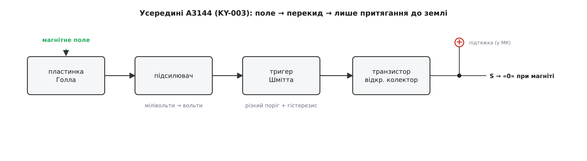
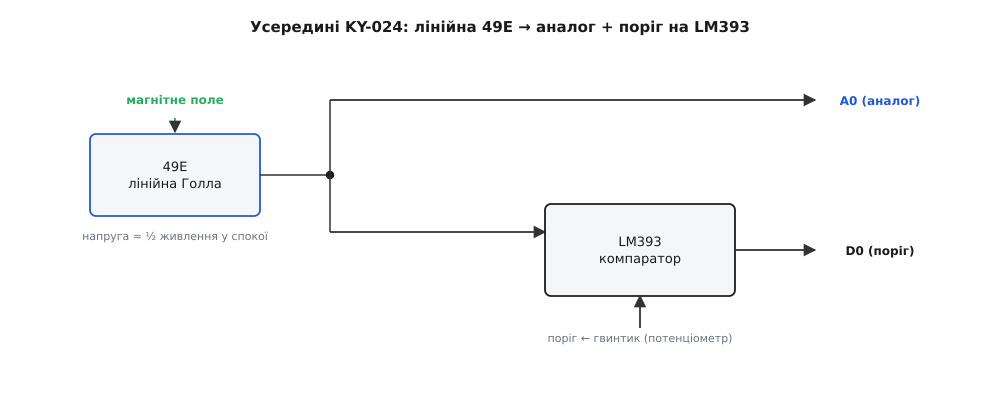
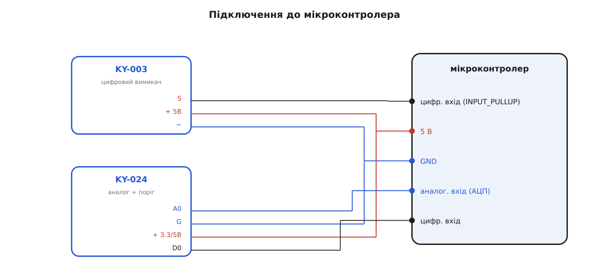

# KY-003 / KY-024 — давач Голла

<preknowlist>
- [Ефект Голла](topic:ph-condensed/hall-effect) — у пластинці зі струмом, покладеній у магнітне поле, збоку зʼявляється напруга, поперечна і струму, і полю; вона і є те, що вимірює давач.
- [KY-серія (Keyes 37-в-1)](topic:cat-hw-sensors/ky-series) — що таке KY-модуль: чутливий елемент на маленькій платі з готовою гребінкою на 2–4 штирі; звідки походить нумерація й формат.
- [Компаратор](topic:hw-analog/comparator) — схема, що каже «більше/менше за поріг» одним цифровим бітом; на ній стоїть цифровий вихід KY-024 і весь KY-003.
- [Тригер Шмітта](topic:hw-analog/schmitt-trigger) — компаратор із памʼяттю (гістерезис): вмикається на одному порозі, вимикається на нижчому, тож на межі не деренчить.
- [Вихід з відкритим колектором](topic:hw-components/open-collector-output) — вихід, що вміє лише притягувати лінію до землі, а «одиницю» дає зовнішня підтяжка; саме так поводиться сигнал KY-003.
- [АЦП](topic:hw-analog/adc) — як мікроконтролер перетворює аналогову напругу на число; без нього аналоговий вихід KY-024 — просто вольти.
</preknowlist>

Дві сині платки завбільшки з поштову марку, кожна з чорним корпусом-«крапелькою» на трьох ніжках, наведеним просто в край плати. На одній — гребінка на три штирі й один світлодіод, на другій — гребінка на чотири, підстроювальний гвинтик і два світлодіоди. Це два способи зробити те саме: **відчути магніт, не торкаючись його**. **KY-003** каже коротко — «магніт є / магніту нема», одним цифровим бітом. **KY-024** каже докладніше — «магніт ось такої сили й такого полюса», цілою напругою, і водночас уміє те саме «є / нема», що й KY-003. Обидві виростають з одного фізичного явища й з однієї крихітної мікросхеми під тим чорним корпусом — і щойно розумієш, що там усередині, поведінка обох перестає бути загадковою.

Обидві належать до [KY-серії](topic:cat-hw-sensors/ky-series) — тієї самої родини китайських навчальних модулів, де все зроблено за спільним лекалом: чутливий елемент, посаджений на маленьку плату з мінімальною обвʼязкою й стандартною гребінкою. Спільну історію, формат і манеру родини описано окремо; тут — лише те, що властиве саме давачам Голла: що за елемент під корпусом, чим цифровий варіант відрізняється від аналогового, як їх під'єднати й де чекає підступ.

## Що вони насправді відчувають: не метал, а магнітне поле

Найважливіше, від чого залежить усе інше, — обидва модулі реагують **не на метал і не на дотик, а на магнітне поле**. Піднесіть до KY-003 залізний ключ — нічого; піднесіть маленький неодимовий магніт — спрацює, і навіть крізь тонку пластикову стінку, крізь дерево, крізь власний палець. Давач бачить саме магніт, тому корпус приладу для нього прозорий: магнітне поле проходить крізь усе, крім самого заліза й іншого магніту.

Працює це на **[ефекті Голла](topic:ph-condensed/hall-effect)** (на честь Едвіна Голла, амер. фізика, що відкрив явище 1879 року, ще студентом). Суть коротко: якщо крізь тонку пластинку напівпровідника пропустити струм і покласти пластинку в магнітне поле, перпендикулярне до неї, то на бічних гранях зʼявиться крихітна напруга — **напруга Голла**. Магнітне поле відхиляє рухомі носії заряду вбік (та сама сила, що закручує заряджену частинку в полі), заряди збираються біля одного краю — і між краями виникає різниця потенціалів. Що сильніше поле, то більша ця напруга; змінить поле полюс — напруга змінить знак. Ось і весь принцип: **поле → поперечна напруга**, лінійно й зі знаком полюса.

Ця напруга мізерна — одиниці мілівольтів. Тому голу пластинку Голла ніхто на плату не ставить: усередині чорної «крапельки» сидить готова **мікросхема-давач Голла**, де поруч із чутливою пластинкою на тому самому кристалі вже вбудовано підсилювач, який піднімає ці мілівольти до придатного рівня, і схему температурної компенсації, щоб покази не «пливли» від нагріву. Різниця між KY-003 і KY-024 — саме в тому, **яка** це мікросхема і що вона робить із підсиленою напругою далі.

> 🔧 **Навіщо це.** Безконтактність — головна причина, чому давач Голла всюди. Ним рахують оберти колеса (магніт на спиці — щомиті проїжджає повз давач), ловлять, зачинені чи відчинені двері (магніт на стулці, давач на рамі), визначають кінцеве положення в 3D-принтері й верстаті, міряють струм у дроті через поле, що той струм створює. Скрізь, де треба відчути рух чи положення **без тертя, без зношуваних контактів і крізь перепону**, — це давач Голла. Механічний контакт з часом окислюється й вигоряє; магнітне поле нічого не торкається, тож давач служить практично вічно.

## KY-003: цифровий вимикач на A3144

KY-003 — це давач-**вимикач**. Під корпусом у нього стоїть мікросхема **A3144** (виробник — Allegro MicroSystems; трапляються ідентичні за поведінкою A3144E, AH3144, OH3144, 3144EUA). Це не просто пластинка Голла з підсилювачем — це **уніполярний перемикач Голла**: усередині, крім чутливого елемента й підсилювача, стоїть [тригер Шмітта](topic:hw-analog/schmitt-trigger) з порогом, а на виході — транзистор із [відкритим колектором](topic:hw-components/open-collector-output). Розберімо, що це означає на практиці, бо звідси випливає і логіка сигналу, і головна пастка підключення.

**Уніполярний** — значить, реагує лише на **один** полюс. A3144 спрацьовує, коли до маркованого боку корпусу підносять **південний** полюс магніту достатньої сили; північний полюс, піднесений тим самим боком, її не вмикає. Тригер Шмітта всередині перетворює плавне наростання поля на різкий перекид: поле перевалило поріг увімкнення — вихід клацнув, і не деренчить на межі, бо вимикається вже на трохи нижчому полі (гістерезис). Тому KY-003 не вміє сказати «поле ось таке» — тільки «поле перевалило поріг» чи ні. Це цифровий давач за самою природою елемента.

**Відкритий колектор** — це та деталь, через яку новачки найчастіше отримують «мертвий» вихід, і її треба зрозуміти. Вихідний транзистор A3144 уміє робити рівно одне: **притягувати сигнальну ногу до землі**. Піднести «одиницю» він не вміє взагалі — у нього просто немає для цього виходу. Тому без сторонньої допомоги нога в стані «магніту нема» висить у повітрі (не «1», а невизначено — [так званий плаваючий вхід](topic:hw-components/open-collector-output)), і мікроконтролер читатиме з неї випадкове сміття. Щоб зʼявилася чітка «1», лінію треба **підтягнути до живлення резистором** — і тоді вона поводиться так:

```
магніту нема  → транзистор відпущений → підтяжка тягне лінію вгору → на нозі «1»
є магніт (S)  → транзистор притискає   → лінію силою тягне до землі → на нозі «0»
```

Тобто KY-003 **активний у нулі**: спрацювання — це LOW, а не HIGH. Це збиває з пантелику, поки не звикнеш, зате звільняє від зайвої деталі: підтяжку **не треба паяти самому**. Кожен мікроконтролер має підтяжку, вбудовану в саму ногу, і вмикають її одним рядком налаштування виводу: в Arduino це `INPUT_PULLUP`, в ESP-IDF — `pull_up_en` у `gpio_config`, у STM32 HAL — `GPIO_PULLUP` у `GPIO_InitTypeDef`. На платі KY-003, щоправда, є свій світлодіод із резистором на 680 Ом, що світиться, коли є магніт; але цей світлодіод не робить із виходу повноцінну «1» — внутрішня підтяжка мікроконтролера все одно потрібна.


*Усередині A3144: поле діє на пластинку Голла (крихітна поперечна напруга), підсилювач її піднімає, тригер Шмітта клацає на порозі, а вихідний транзистор з відкритим колектором уміє лише притягнути сигнал до землі. «Одиницю» дає зовнішня підтяжка (вбудована в мікроконтролер, вмикається як INPUT_PULLUP). Тому вихід активний у нулі: магніт → 0, нема магніту → 1.*

## KY-024: аналоговий вихід плюс поріг на LM393

KY-024 — це вже давач-**вимірювач**, зроблений навколо іншого елемента: лінійної мікросхеми Голла **49E** (вона ж SS49E). Слово «лінійна» — ключове й протилежне до KY-003. 49E не має всередині ні тригера, ні порога; вона просто віддає **напругу, пропорційну полю**, без жодних клацань. У спокої, коли магніту немає, на її виході стоїть приблизно **половина напруги живлення** (біля 2.5 В при живленні 5 В). Піднесіть один полюс — напруга плавно піде вгору; піднесіть протилежний — плавно вниз. Так давач передає і **силу** поля, і його **полюс** однією аналоговою величиною, що гойдається навколо середини.

> 🔧 **Навіщо це.** Спокій «на половині живлення» — не примха, а вимога вимірювати поле обох знаків одним однополярним виходом. Мікросхема не вміє видати відʼємну напругу, тож нуль поля вона кладе не в 0 В, а посередині діапазону: тоді для одного полюса є куди рости вгору, для протилежного — куди падати вниз. У коді це означає, що «немає магніту» — це не нуль з АЦП, а число близько середини шкали (близько 512 на 10-бітному [АЦП](topic:hw-analog/adc) і близько 2048 на 12-бітному); силу поля міряють як **відхилення від цієї середини** в обидва боки, а знак відхилення каже, який полюс.

Щоб той самий модуль умів і просту відповідь «є / нема» (як KY-003), на платі KY-024 поряд із 49E стоїть **компаратор LM393** (подвійний диференційний компаратор; тут задіяно одну половину). Аналоговий сигнал 49E заходить на один вхід компаратора, а на другий подано **опорну напругу з підстроювального гвинтика (потенціометра)**. Щойно поле стане достатнім, аби аналоговий сигнал перетнув цей поріг, компаратор перекидає **цифровий вихід**. Гвинтик крутить саме поріг: туго закрутиш — давач реагуватиме лише на сильний, близький магніт; попустиш — ловитиме й слабший, дальший. На аналоговий вихід гвинтик не впливає ніяк — той завжди віддає повну картину поля.

Звідси й **чотири** ноги замість трьох у KY-003: окремо аналоговий вихід (повна напруга поля), окремо цифровий (поріг спрацював чи ні). Два світлодіоди на платі: один — живлення (світиться завжди), другий — стан цифрового виходу (спалахує, коли поле перевалило поріг). А ще важлива дрібниця про живлення: 49E разом із LM393 працюють у широкому діапазоні **2.7–6.5 В**, тож KY-024, на відміну від KY-003, спокійно живиться і від **3.3-вольтової** плати (ESP32, STM32), а не лише від 5 В.


*Лінійна 49E дає напругу, пропорційну полю (у спокої ≈ половина живлення). Ця напруга йде двома шляхами: напряму на аналоговий вихід A0 і на компаратор LM393. Другий вхід компаратора — опорна напруга з потенціометра (поріг). Перевалило поле поріг — цифровий вихід D0 клацнув. Гвинтик рухає лише поріг цифрового виходу; аналоговий завжди віддає повну картину.*

## Піни й підключення

Обидва модулі під'єднуються трьома-чотирма дротами без жодного протоколу. Порядок штирків завжди звіряйте з підписами на самій платі (дрібні літери біля гребінки), бо між партіями він гуляє.

**KY-003 — три ноги:**
- **S** — сигнал (відкритий колектор; «0» коли є магніт, «1» коли нема — за наявності підтяжки).
- **середня** — живлення, 5 В (A3144 паспортно тримає 4.5–24 В; 3.3 В — нижче норми, працюватиме ненадійно).
- **−** — спільний нуль (земля).

**KY-024 — чотири ноги:**
- **A0** — аналоговий вихід (повна напруга поля, ≈ половина живлення у спокої).
- **G** — земля.
- **+** — живлення, 2.7–6.5 В (годиться і 3.3 В, і 5 В).
- **D0** — цифровий вихід (клацає на порозі, заданому гвинтиком).


*Зліва KY-003: живлення 5 В, земля, сигнал S у цифровий вивід — з увімкненою внутрішньою підтяжкою (INPUT_PULLUP), бо вихід відкритий колектор. Справа KY-024: живлення (3.3 або 5 В), земля, аналоговий A0 в аналоговий вхід АЦП, цифровий D0 — у звичайний цифровий вивід. Обом більше нічого не треба.*

## Читаємо в коді

**KY-003 — «є магніт / нема».** Уся хитрість — увімкнути внутрішню підтяжку й памʼятати, що спрацювання це LOW.

**Умова.** Сигнал S під'єднано до будь-якого цифрового виводу з внутрішньою підтяжкою (D3 на Arduino, GPIO4 на ESP32, PA0 на STM32), поруч — світлодіод. Треба засвічувати світлодіод, поки давач бачить магніт.

:::tabs
```arduino
const uint8_t HALL = 3;    // S давача KY-003
const uint8_t LED  = 13;   // вбудований світлодіод

void setup() {
    pinMode(HALL, INPUT_PULLUP);   // без підтяжки нога висить — читатимеш сміття
    pinMode(LED, OUTPUT);
    Serial.begin(9600);
}

void loop() {
    // вихід активний у нулі: LOW = є магніт
    bool magnet = (digitalRead(HALL) == LOW);
    digitalWrite(LED, magnet);
    if (magnet) Serial.println("магніт!");
    delay(50);
}
```
```esp-idf
#include "driver/gpio.h"
#include "freertos/FreeRTOS.h"
#include "freertos/task.h"
#include "esp_log.h"

#define HALL  GPIO_NUM_4           // S давача KY-003
#define LED   GPIO_NUM_2           // світлодіод на платі
static const char *TAG = "hall";

void app_main(void) {
    gpio_config_t in = {
        .pin_bit_mask = 1ULL << HALL,
        .mode         = GPIO_MODE_INPUT,
        .pull_up_en   = GPIO_PULLUP_ENABLE,    // без підтяжки нога висить — читатимеш сміття
        .pull_down_en = GPIO_PULLDOWN_DISABLE,
        .intr_type    = GPIO_INTR_DISABLE,
    };
    ESP_ERROR_CHECK(gpio_config(&in));
    gpio_config_t out = { .pin_bit_mask = 1ULL << LED, .mode = GPIO_MODE_OUTPUT };
    ESP_ERROR_CHECK(gpio_config(&out));

    // давач живиться від 5 В, але вихід у нього відкритий колектор:
    // рівень «1» задає підтяжка на 3.3 В, тож нозі ESP32 нічого не загрожує
    while (1) {
        bool magnet = (gpio_get_level(HALL) == 0);   // активний у нулі: 0 = є магніт
        gpio_set_level(LED, magnet);
        if (magnet) ESP_LOGI(TAG, "магніт!");
        vTaskDelay(pdMS_TO_TICKS(50));
    }
}
```
```stm32
#include "main.h"                  // HALL_Pin / LED_Pin — імена з CubeMX

int main(void) {
    HAL_Init();
    SystemClock_Config();
    __HAL_RCC_GPIOA_CLK_ENABLE();
    __HAL_RCC_GPIOC_CLK_ENABLE();

    GPIO_InitTypeDef gi = {0};
    gi.Pin  = HALL_Pin;            // PA0 — S давача KY-003
    gi.Mode = GPIO_MODE_INPUT;
    gi.Pull = GPIO_PULLUP;         // без підтяжки нога висить — читатимеш сміття
    HAL_GPIO_Init(HALL_GPIO_Port, &gi);

    gi.Pin   = LED_Pin;            // PC13 — світлодіод плати
    gi.Mode  = GPIO_MODE_OUTPUT_PP;
    gi.Pull  = GPIO_NOPULL;
    gi.Speed = GPIO_SPEED_FREQ_LOW;
    HAL_GPIO_Init(LED_GPIO_Port, &gi);

    while (1) {
        // вихід активний у нулі: GPIO_PIN_RESET = є магніт
        bool magnet = (HAL_GPIO_ReadPin(HALL_GPIO_Port, HALL_Pin) == GPIO_PIN_RESET);
        HAL_GPIO_WritePin(LED_GPIO_Port, LED_Pin, magnet ? GPIO_PIN_SET : GPIO_PIN_RESET);
        if (magnet) printf("магніт!\r\n");
        HAL_Delay(50);
    }
}
```
:::

Жодної бібліотеки не треба на жодній платформі — одне читання стану ноги повертає готову відповідь, бо всю роботу зробила A3144. Забудете ввімкнути підтяжку — і давач «спрацьовуватиме сам по собі» від наведень на висячій нозі; це класична пастка, а не поломка модуля.

**KY-024 — і сила поля, і поріг.** Тут читаємо аналоговий вихід через [АЦП](topic:hw-analog/adc), а цифровий — як звичайний вхід. Оскільки «спокій» — це середина шкали, силу поля рахуємо як відхилення від виміряної на старті нульової лінії.

**Умова.** Аналоговий вихід A0 давача — на вхід АЦП (A0 на Arduino, GPIO34 на ESP32, PA0 на STM32), цифровий D0 — на звичайний цифровий вивід. Треба показувати відхилення поля від спокою і полюс, а також стан порогового виходу.

:::tabs
```arduino
const uint8_t A_PIN = A0;   // аналоговий вихід 49E
const uint8_t D_PIN = 3;    // цифровий вихід компаратора

int baseline = 512;         // нульова лінія (≈ половина шкали)

void setup() {
    pinMode(D_PIN, INPUT);
    Serial.begin(9600);
    // за 200 мс без магніту запамʼятовуємо реальний спокій
    long acc = 0;
    for (int i = 0; i < 64; i++) { acc += analogRead(A_PIN); delay(3); }
    baseline = acc / 64;
}

void loop() {
    int raw   = analogRead(A_PIN);   // 0..1023
    int delta = raw - baseline;      // >0 один полюс, <0 протилежний

    Serial.print("поле: ");
    Serial.print(delta);
    Serial.print(delta > 0 ? " (N-бік) " : (delta < 0 ? " (S-бік) " : " (нема) "));
    // цифровий вихід: клацає на порозі гвинтика (типово активний у нулі)
    Serial.println(digitalRead(D_PIN) == LOW ? " [поріг!]" : "");
    delay(100);
}
```
```esp-idf
#include "driver/gpio.h"
#include "esp_adc/adc_oneshot.h"
#include "freertos/FreeRTOS.h"
#include "freertos/task.h"
#include "esp_log.h"

#define A_CHAN  ADC_CHANNEL_6      // ADC1_CH6 — це GPIO34, аналоговий вихід 49E
#define D_PIN   GPIO_NUM_4         // цифровий вихід компаратора
static const char *TAG = "ky024";
static adc_oneshot_unit_handle_t adc1;

static int sample(void) {
    int v = 0;
    ESP_ERROR_CHECK(adc_oneshot_read(adc1, A_CHAN, &v));
    return v;                      // 0..4095
}

void app_main(void) {
    gpio_config_t d = { .pin_bit_mask = 1ULL << D_PIN, .mode = GPIO_MODE_INPUT,
                        .pull_up_en = GPIO_PULLUP_ENABLE };
    ESP_ERROR_CHECK(gpio_config(&d));

    adc_oneshot_unit_init_cfg_t unit = { .unit_id = ADC_UNIT_1 };   // ADC1 не свариться з Wi-Fi
    ESP_ERROR_CHECK(adc_oneshot_new_unit(&unit, &adc1));
    adc_oneshot_chan_cfg_t ch = { .atten = ADC_ATTEN_DB_12, .bitwidth = ADC_BITWIDTH_DEFAULT };
    ESP_ERROR_CHECK(adc_oneshot_config_channel(adc1, A_CHAN, &ch));

    long acc = 0;                  // ~0.6 с без магніту: тик FreeRTOS 10 мс, дрібнішої паузи нема
    for (int i = 0; i < 64; i++) { acc += sample(); vTaskDelay(pdMS_TO_TICKS(10)); }
    int baseline = acc / 64;       // нульова лінія ≈ половина шкали (12 біт: ≈2048)

    while (1) {
        int delta = sample() - baseline;   // >0 один полюс, <0 протилежний
        ESP_LOGI(TAG, "поле: %d %s%s", delta,
                 delta > 0 ? "(N-бік)" : (delta < 0 ? "(S-бік)" : "(нема)"),
                 gpio_get_level(D_PIN) == 0 ? " [поріг!]" : "");   // поріг гвинтика
        vTaskDelay(pdMS_TO_TICKS(100));
    }
}
```
```stm32
#include "main.h"                  // A0 → PA0 (ADC1_IN0), D0 → D0_Pin із GPIO_PULLUP

extern ADC_HandleTypeDef hadc1;

static uint16_t sample(void) {
    HAL_ADC_Start(&hadc1);
    HAL_ADC_PollForConversion(&hadc1, 10);
    uint16_t v = HAL_ADC_GetValue(&hadc1);   // 0..4095
    HAL_ADC_Stop(&hadc1);
    return v;
}

int main(void) {
    HAL_Init();
    SystemClock_Config();
    MX_GPIO_Init();
    MX_ADC1_Init();

    long acc = 0;                  // за ~200 мс без магніту запамʼятовуємо реальний спокій
    for (int i = 0; i < 64; i++) { acc += sample(); HAL_Delay(3); }
    int baseline = (int)(acc / 64);   // ≈ половина шкали (живлення 3.3 В, 12 біт: ≈2048)

    while (1) {
        int delta = (int)sample() - baseline;   // >0 один полюс, <0 протилежний
        const char *pole = delta > 0 ? "(N-бік)" : (delta < 0 ? "(S-бік)" : "(нема)");
        printf("поле: %d %s%s\r\n", delta, pole,
               HAL_GPIO_ReadPin(D0_GPIO_Port, D0_Pin) == GPIO_PIN_RESET ? " [поріг!]" : "");
        HAL_Delay(100);
    }
}
```
:::

Калібрування нульової лінії на старті — не примха: точна середина в кожного екземпляра 49E трохи своя й ще й плаває від живлення, тож зафіксувати «спокій» разом при ввімкненні (поки біля давача точно нема магніту) надійніше, ніж вписати 512 наосліп. Готовий C++-код обох варіантів — і як зробити з KY-003 лічильник обертів на перериваннях — зібрано в [прикладі-драйвері](topic:cat-hw-sensors/ky-003-hall/proj-hall-driver.md).

> 🔧 **Навіщо це.** Різниця «цифровий проти аналогового» вирішує, який модуль брати. Треба лише факт «двері відчинені» чи «колесо зробило оберт» — беріть KY-003: дешевше, простіше, один біт, жодного АЦП. Треба **виміряти** — наскільки сильне поле, з якого боку полюс, як близько магніт, побудувати безконтактний важіль-джойстик чи стежити за плавним зближенням — потрібен аналоговий вихід KY-024 (або близький KY-035, теж на 49E, але без цифрового каналу). Цифровий вихід KY-024 при цьому лишається безкоштовним бонусом: та сама плата дає і число, і поріг.

## Чого стерегтися

Кілька пасток випливають прямо з фізики й схемотехніки цих модулів, і всі вони — не дефекти, а поведінка «за задумом», якщо про неї знати.

**Полярність важить.** Уніполярний KY-003 бачить лише один полюс, піднесений до маркованого боку корпусу. Якщо магніт «не спрацьовує» — переверніть його або піднесіть іншим боком давача, перш ніж вирішити, що модуль мертвий. У KY-024 те саме проявляється інакше: не той полюс просто хитне аналоговий вихід у протилежний бік від очікуваного.

**Сила й відстань.** Це давач ближньої дії. Слабкий магніт-«таблетка» спрацює лише впритул; для впевненого спрацювання на сантиметр-два потрібен добрий неодимовий магніт. Не чекайте від нього реакції на магніт через півкімнати — поле спадає з відстанню дуже швидко.

**Живлення KY-003.** A3144 паспортно хоче 4.5–24 В. На 3.3-вольтовій платі KY-003 може поводитися капризно або мовчати — його місце на **5 В**. Якщо вся схема на 3.3 В, а давач Голла потрібен саме там, беріть KY-024: його 49E+LM393 працюють від 2.7 В і з 3.3-вольтовою логікою дружать без застережень.

**Активний у нулі.** І сигнал KY-003, і (зазвичай) цифровий D0 KY-024 дають **LOW** при спрацюванні. Переплутати легко: чекаєш HIGH, а давач «нічого не робить». Тримайте в голові, що для цих модулів «спрацювало» = 0.
