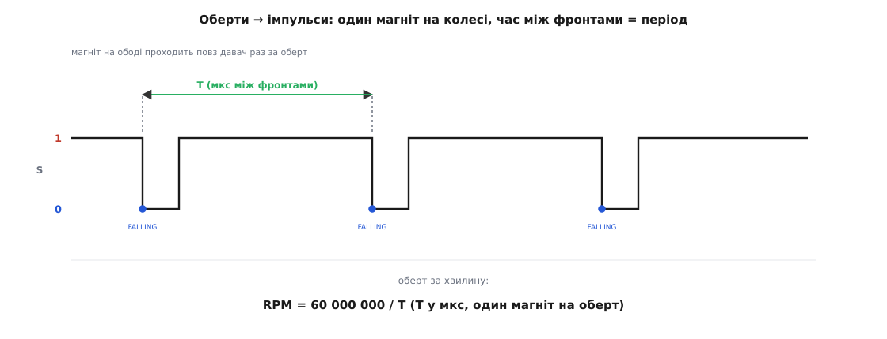
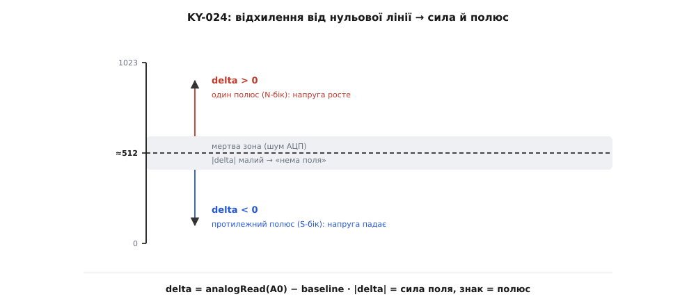

# ⚙️ Драйвер давачів Голла: тахометр на перериванні та вимірювач поля

<preknowlist>
- [Апаратне переривання](topic:hw-arch/interrupts) — механізм, коли зміна на нозі МК миттєво відриває процесор від головного циклу й запускає короткий обробник; на ньому тримається точний підрахунок швидких імпульсів.
- [Ключове слово volatile](topic:sf-lang/volatile) — сказати компілятору, що змінну міняє хтось поза видимим кодом (обробник переривання), тож її не можна кешувати в регістрі; без нього лічильник обертів «застигне».
- [АЦП](topic:hw-analog/adc) — як МК перетворює аналогову напругу на ціле число; крок квантування, опорна напруга, чому 10-бітний АЦП дає 0..1023.
- [Брязкіт контактів (bounce)](topic:hw-digital/contact-debounce) — чому механічний перемикач на одному натисканні дає пачку імпульсів; для розуміння, коли Голл-давач від цього вільний, а коли ні.
</preknowlist>

Прочитати давач Голла в лоб — легко: одне читання цифрового входу для KY-003, один відлік АЦП для аналогового KY-024 (в Arduino це `digitalRead` і `analogRead`). Цього досить, щоб блимнути світлодіодом. Але щойно давач ставлять у справжню задачу — порахувати оберти колеса, зміряти швидкість, зробити безконтактний важіль, — наївне читання в циклі розсипається. Колесо на трьох тисячах обертів дає імпульс кожні двадцять мілісекунд, а якщо магнітів на ободі кілька — то кожні кілька мілісекунд; головний цикл, у якому є хоч одна затримка чи повільний друк у порт (`delay(100)`, `Serial.print` в Arduino), ці імпульси **проґавить**. Аналоговий вихід лінійної мікросхеми 49E, прочитаний одним сирим відліком АЦП, смикається від шуму на кілька одиниць туди-сюди, і без калібрування «нуль поля» гуляє від екземпляра до екземпляра й від напруги живлення. Тут — робочі драйвери, що ці проблеми знімають: тахометр на апаратному перериванні для KY-003 і охайний вимірювач поля для KY-024, з реальним кодом під Arduino, ESP-IDF і STM32 HAL й з поясненням, **чому** кожен рядок саме такий.

## Задача 1: рахувати оберти, не втрачаючи жодного

Уявімо звичну річ — виміряти оберти вентилятора, колеса робота чи вала двигуна. Спосіб класичний і дешевий: приклеїти до рухомої частини маленький магніт, а поряд, на нерухомій рамі, поставити KY-003 так, щоб магніт проходив просто повз нього раз за оберт. Кожен прохід — один провал сигналу в нуль (давач активний у нулі, магніт → LOW). Порахувавши ці провали за час, дістанемо оберти.

Наївна спроба виглядає так (записана в Arduino, але хиба та сама в будь-якому середовищі) — і саме так робити **не треба**:

```arduino
// ЯК НЕ ТРЕБА: підрахунок у головному циклі
int count = 0;
bool prev = HIGH;
void loop() {
    bool now = digitalRead(HALL);
    if (prev == HIGH && now == LOW) count++;   // спіймали спад
    prev = now;
    Serial.println(count);   // ← поки це друкується, магніт проскочив
    delay(100);              // ← а тут ми взагалі спимо й нічого не бачимо
}
```

Проблема не в логіці розпізнавання спаду — вона правильна. Проблема в тому, що між двома викликами `digitalRead` процесор зайнятий іншим: друкує в порт, спить у `delay`. Провал сигналу триває стільки, скільки магніт фізично перед давачем, — на швидкому валу це якісь мікросекунди. Якщо саме в ці мікросекунди `loop()` застряг у `Serial.println`, імпульсу **ніби й не було**. Що швидше крутиться вал, то більше імпульсів губиться, і покази занижуються тим сильніше, чим цікавіший режим. Це не полагодити прискоренням циклу: завжди знайдеться `delay` чи повільна операція, що припаде на момент імпульсу.

### Ідея: віддати лічбу апаратному перериванню

Правильний інструмент — **[апаратне переривання](topic:hw-arch/interrupts)**. Мікроконтролер уміє стежити за ногою сам, схемно, паралельно з виконанням головного коду. Ми кажемо йому: «щойно на цій нозі станеться спад — кинь усе, що робиш, виконай ось цю коротку функцію й вернися назад». Функцію звуть **обробником переривання** (ISR, interrupt service routine). Тепер уже неважливо, чим зайнятий `loop()`: навіть якщо він застряг у `delay`, спад сигналу відірве процесор від сну, той збільшить лічильник і повернеться спати. Жоден імпульс не губиться, бо ловить його не програма, а залізо.

Хоч би який був контролер, ви кажете йому три речі: **яку ногу** слухати, **на який фронт** реагувати і **яку функцію** викликати. Різняться лише імена:

:::tabs
```arduino
attachInterrupt(digitalPinToInterrupt(HALL), onPulse, FALLING);
```

```esp-idf
gpio_config_t cfg = {
    .pin_bit_mask = 1ULL << HALL_GPIO,
    .mode         = GPIO_MODE_INPUT,
    .pull_up_en   = GPIO_PULLUP_ENABLE,   // відкритий колектор → підтяжка
    .intr_type    = GPIO_INTR_NEGEDGE,    // спадний фронт: магніт зайшов
};
gpio_config(&cfg);
gpio_install_isr_service(0);
gpio_isr_handler_add(HALL_GPIO, on_pulse, NULL);
```

```stm32
/* ногу описано в CubeMX як GPIO_EXTI, Pull-up, Falling edge —
   лишається дозволити лінію переривання й написати обробник */
HAL_NVIC_SetPriority(EXTI0_IRQn, 5, 0);
HAL_NVIC_EnableIRQ(EXTI0_IRQn);

void HAL_GPIO_EXTI_Callback(uint16_t pin) {   // сюди приходить фронт
    if (pin == HALL_Pin) on_pulse();
}
```
:::

Розберімо ці три речі на Arduino-виклику, бо кожна несе сенс. `digitalPinToInterrupt(HALL)` перетворює номер ноги на номер лінії переривання — не всі ноги вміють переривання, і ця функція знімає з нас клопіт памʼятати, яка нога на яку лінію лягає (на класичній Arduino Uno переривання вміють лише D2 і D3; на ESP32 і STM32 — майже будь-яка нога). `onPulse` — імʼя нашої ISR. `FALLING` — момент спрацювання: **саме спадний фронт**, перехід з HIGH у LOW. Це критичний вибір і він прямо випливає з того, що KY-003 активний у нулі: магніт зайшов → сигнал упав → спад → одне спрацювання на прохід. Якби ми взяли `RISING`, ловили б момент, коли магніт **іде геть**; узяли б `CHANGE` — ловили б і захід, і відхід, тобто по **два** спрацювання на оберт, і оберти вийшли б удвічі завищені. `FALLING` дає рівно один рахунок на прохід магніту — те, що треба.


*Один магніт на ободі дає один провал сигналу за оберт. Апаратне переривання ловить кожен спадний фронт (FALLING) незалежно від того, чим зайнятий головний цикл. Час T між двома сусідніми фронтами — це період одного оберту; звідси RPM = 60 000 000 / T, якщо T у мікросекундах і магніт один.*

### Найпростіший тахометр: рахуємо імпульси у вікні

Найлегший спосіб дістати оберти — рахувати імпульси за фіксований проміжок часу («вікно») і множити. Порахували 50 імпульсів за чверть секунди — значить, 200 за секунду, тобто 200 обертів за секунду (12000 за хвилину), якщо магніт один. Від контролера тут треба лише три речі: вхід із підтяжкою, переривання на спадному фронті й будь-який лічильник мілісекунд. Ось повний робочий драйвер — той самий у трьох середовищах:

:::tabs
```arduino
const uint8_t HALL = 2;          // S давача KY-003 → D2 (лінія переривання на Uno)

volatile uint32_t pulses = 0;    // лічильник, який чіпає ISR — ОБОВʼЯЗКОВО volatile

void onPulse() {                 // ISR: якнайкоротша
    pulses++;
}

void setup() {
    pinMode(HALL, INPUT_PULLUP); // відкритий колектор → внутрішня підтяжка обовʼязкова
    Serial.begin(115200);
    attachInterrupt(digitalPinToInterrupt(HALL), onPulse, FALLING);
}

const uint32_t WINDOW_MS = 250;  // вікно вимірювання
uint32_t windowStart = 0;

void loop() {
    if (millis() - windowStart >= WINDOW_MS) {
        // атомарно зчитуємо й обнуляємо лічильник (див. пояснення нижче)
        noInterrupts();
        uint32_t n = pulses;
        pulses = 0;
        interrupts();
        windowStart += WINDOW_MS;

        // n імпульсів за WINDOW_MS мілісекунд; магніт один → n обертів за вікно
        float rpm = (float)n * (60000.0 / WINDOW_MS);
        Serial.print("RPM: ");
        Serial.println(rpm, 0);
    }
    // тут головний цикл вільний робити будь-що — імпульси не губляться
}
```

```esp-idf
#include "driver/gpio.h"
#include "freertos/FreeRTOS.h"
#include "freertos/task.h"
#include "esp_log.h"

#define HALL_GPIO  GPIO_NUM_4    // S давача KY-003 → GPIO4
#define WINDOW_MS  250           // вікно вимірювання
static const char *TAG = "tacho";

static portMUX_TYPE mux = portMUX_INITIALIZER_UNLOCKED;
static volatile uint32_t pulses = 0;   // лічильник, який чіпає ISR

static void IRAM_ATTR on_pulse(void *arg) {   // ISR у RAM: якнайкоротша
    pulses++;
}

void app_main(void) {
    gpio_config_t cfg = {
        .pin_bit_mask = 1ULL << HALL_GPIO,
        .mode         = GPIO_MODE_INPUT,
        .pull_up_en   = GPIO_PULLUP_ENABLE,   // відкритий колектор → підтяжка
        .intr_type    = GPIO_INTR_NEGEDGE,    // спад: магніт зайшов
    };
    gpio_config(&cfg);
    gpio_install_isr_service(0);
    gpio_isr_handler_add(HALL_GPIO, on_pulse, NULL);

    while (1) {
        vTaskDelay(pdMS_TO_TICKS(WINDOW_MS));

        portENTER_CRITICAL(&mux);          // цілісне зчитування й обнулення
        uint32_t n = pulses;
        pulses = 0;
        portEXIT_CRITICAL(&mux);

        float rpm = (float)n * (60000.0f / WINDOW_MS);
        ESP_LOGI(TAG, "RPM: %.0f", rpm);
    }
}
```

```stm32
#include "main.h"

#define WINDOW_MS 250                  // вікно вимірювання

volatile uint32_t pulses = 0;          // лічильник, який чіпає ISR

/* нога описана в CubeMX: GPIO_EXTI, Pull-up, Falling edge —
   відкритий колектор → підтяжка обовʼязкова */
void HAL_GPIO_EXTI_Callback(uint16_t pin) {   // ISR: якнайкоротша
    if (pin == HALL_Pin) pulses++;
}

int main(void) {
    HAL_Init();
    SystemClock_Config();
    MX_GPIO_Init();                    // тут же вмикається EXTI на нозі
    uint32_t windowStart = HAL_GetTick();

    while (1) {
        if (HAL_GetTick() - windowStart < WINDOW_MS) continue;
        windowStart += WINDOW_MS;

        __disable_irq();               // цілісне зчитування й обнулення
        uint32_t n = pulses;
        pulses = 0;
        __enable_irq();

        // n імпульсів за WINDOW_MS мілісекунд; магніт один → n обертів за вікно
        float rpm = (float)n * (60000.0f / WINDOW_MS);
        printf("RPM: %.0f\r\n", rpm);   // printf перенаправлено на UART
    }
}
```
:::

Три деталі цього коду не випадкові, і кожна — типове місце помилки.

**`volatile` на лічильнику.** Змінну `pulses` міняє обробник переривання — код, якого компілятор у головному циклі «не бачить». Без слова `volatile` оптимізатор має право вирішити, що між ітераціями `pulses` ніхто не чіпає, зчитати її раз у регістр і більше з памʼяті не перечитувати. Тоді `loop()` читатиме застаріле значення, а справжній лічильник у памʼяті ростиме окремо — тахометр «застигне» на випадковому числі. `volatile` наказує компілятору щоразу лізти в памʼять по свіже значення. Це не робить доступ атомарним (див. далі) — лише забороняє кешування. Пояснення механізму — у нотатці про [volatile](topic:sf-lang/volatile).

**Атомарне зчитування.** `pulses` — 32-бітна, а ядро AVR у Arduino Uno восьмибітне: воно читає й пише чотири байти окремими інструкціями. Уявіть: `loop()` прочитав два байти з чотирьох, і саме тут прилетів імпульс — ISR інкрементувала `pulses`, змінивши байти, які ми ще не дочитали. Дістанемо покручене число, склеєне з половини старого й половини нового значення (це зветься «розірваний доступ», torn read). Тому на час зчитування й обнулення ми **гасимо переривання** (`noInterrupts()`), робимо операцію цілісною й **знову вмикаємо** (`interrupts()`). Дужки навколо коротенькі — переривання вимкнено на кілька тактів, ніщо не втратиться. На 32-бітних платах (ESP32, STM32) читання 32-бітного слова саме собою атомарне, але звичка гасити переривання навколо спільних даних — правильна й переносна.

> 🔧 **Навіщо це.** «Торн-рід» рідко трапляється й тому підступний: код працює тижнями, а раз на кілька годин тахометр стрибає на абсурдне число. Полагодити постфактум важко — баг не відтворюється на замовлення. Тому цілісний доступ до спільних із ISR даних роблять одразу, а не «коли зʼявиться проблема»: тут вартість акуратності — три рядки й кілька тактів, а вартість помилки — плаваючий глюк, що зʼїсть день налагодження.

**ISR якнайкоротша.** Поки виконується обробник переривання, увесь інший код стоїть — включно з таймерами, що рахують `millis()`, і з прийомом даних по UART. Довга ISR тому шкодить усій системі. Правило залізне: в обробнику — мінімум, зазвичай інкремент лічильника чи запис одного значення, і геть звідти. **У жодному разі не викликайте `Serial.print`, `delay` чи щось довге всередині ISR** — на багатьох платах це просто підвісить систему (той самий `Serial` сам працює на перериваннях, які в ISR вимкнено). Уся «важка» робота — обчислення RPM, друк — робиться в головному циклі, а ISR лише збирає сирі імпульси.

### Точніший тахометр: міряємо період, а не рахуємо у вікні

Підрахунок у вікні має вроджену ваду на **малих** обертах. Крутиться вал повільно — за 250 мс може впасти нуль, один, два імпульси. З таким дробом на всю шкалу покази стрибають грубими сходинками (0 → 240 → 480 RPM) і смикаються, бо один зайвий-незайвий імпульс міняє результат удвічі. Ширше вікно згладить, але зробить тахометр повільним — реакція на зміну швидкості затягнеться на секунди.

Коли треба гладко міряти саме **повільні** оберти чи ловити оберт-до-оберту, переходять від лічби до **вимірювання періоду**: засікти час між двома сусідніми спадами. Один оберт — це один період T між фронтами; звідси прямо оберти за хвилину. Момент фронту нам відомий точно — його зафіксувала ISR, — тож і час між фронтами відомий з точністю таймера, а не з грубістю вікна:

```
RPM = 60 000 000 / T        (T — період у мікросекундах, один магніт на оберт)
```

Число `60 000 000` — це кількість мікросекунд у хвилині (60 секунд × 1 000 000). Ділимо його на період одного оберту в мікросекундах — дістаємо оберти за хвилину. Якщо магнітів на ободі не один, а `POLES` штук, то за оберт буде `POLES` фронтів, період між сусідніми — це `1/POLES` оберту, і формулу ділять на число магнітів.

Реалізація ловить у ISR не лічильник, а **час** кожного фронту й зберігає інтервал до попереднього. Мікросекундну мітку часу дає будь-який контролер — питання лише, звідки її брати: з програмного лічильника чи просто з таймера, який на STM32 уміє захопити її сам, апаратно:

:::tabs
```arduino
const uint8_t HALL  = 2;
const uint8_t POLES = 1;          // скільки магнітів на оберт

volatile uint32_t lastEdge   = 0; // час попереднього фронту, мкс
volatile uint32_t period     = 0; // останній виміряний період, мкс
volatile bool     gotPulse   = false;

void onPulse() {
    uint32_t now = micros();      // мітка часу фронту; micros() в ISR на AVR читати можна
    if (lastEdge != 0) {          // перший фронт лише задає початок відліку — періоду ще нема
        period   = now - lastEdge;
        gotPulse = true;
    }
    lastEdge = now;               // інтервал рахуємо від попереднього фронту
}

void setup() {
    pinMode(HALL, INPUT_PULLUP);
    Serial.begin(115200);
    attachInterrupt(digitalPinToInterrupt(HALL), onPulse, FALLING);
}

const uint32_t STOP_US = 2000000; // 2 с без імпульсів → вважаємо, що зупинилось

void loop() {
    noInterrupts();
    uint32_t T    = period;
    uint32_t last = lastEdge;
    bool     fresh = gotPulse;
    gotPulse = false;
    interrupts();

    float rpm;
    if (micros() - last > STOP_US) {
        rpm = 0;                       // давно немає імпульсів — вал стоїть
    } else if (fresh && T > 0) {
        rpm = 60000000.0 / ((float)T * POLES);
    } else {
        return;                        // нового періоду ще нема — нічого не оновлюємо
    }

    Serial.print("RPM: ");
    Serial.println(rpm, 1);
    delay(100);                        // друк не заважає лічбі — імпульси ловить ISR
}
```

```esp-idf
#include "driver/gpio.h"
#include "freertos/FreeRTOS.h"
#include "freertos/task.h"
#include "esp_timer.h"
#include "esp_log.h"

#define HALL_GPIO GPIO_NUM_4
#define POLES     1              // скільки магнітів на оберт
#define STOP_US   2000000        // 2 с без імпульсів → вважаємо, що зупинилось
static const char *TAG = "tacho";

static portMUX_TYPE mux = portMUX_INITIALIZER_UNLOCKED;
static volatile int64_t lastEdge = 0;   // час попереднього фронту, мкс
static volatile int64_t period   = 0;   // останній виміряний період, мкс
static volatile bool    gotPulse = false;

static void IRAM_ATTR on_pulse(void *arg) {
    int64_t now = esp_timer_get_time();  // мкс від старту; в ISR читати можна
    if (lastEdge != 0) {                 // перший фронт лише задає початок відліку
        period   = now - lastEdge;
        gotPulse = true;
    }
    lastEdge = now;
}

void app_main(void) {
    gpio_config_t cfg = {
        .pin_bit_mask = 1ULL << HALL_GPIO,
        .mode         = GPIO_MODE_INPUT,
        .pull_up_en   = GPIO_PULLUP_ENABLE,
        .intr_type    = GPIO_INTR_NEGEDGE,
    };
    gpio_config(&cfg);
    gpio_install_isr_service(0);
    gpio_isr_handler_add(HALL_GPIO, on_pulse, NULL);

    while (1) {
        portENTER_CRITICAL(&mux);
        int64_t T = period, last = lastEdge;
        bool fresh = gotPulse;
        gotPulse = false;
        portEXIT_CRITICAL(&mux);

        if (esp_timer_get_time() - last > STOP_US) {
            ESP_LOGI(TAG, "RPM: 0.0");            // давно немає імпульсів — вал стоїть
        } else if (fresh && T > 0) {
            ESP_LOGI(TAG, "RPM: %.1f", 60000000.0f / ((float)T * POLES));
        }                                         // інакше нового періоду ще нема
        vTaskDelay(pdMS_TO_TICKS(100));
    }
}
```

```stm32
#include "main.h"
extern TIM_HandleTypeDef htim2;   // TIM2 CH1 у режимі Input Capture, спадний фронт;
                                  // прескалер підібрано так, щоб такт = 1 мкс
#define POLES   1
#define STOP_US 2000000u

volatile uint32_t lastEdge = 0;   // захоплений такт попереднього фронту
volatile uint32_t period   = 0;   // останній виміряний період, мкс
volatile uint8_t  gotPulse = 0;

/* мітку часу знімає сам таймер — програма дізнається про фронт уже з нею */
void HAL_TIM_IC_CaptureCallback(TIM_HandleTypeDef *htim) {
    if (htim->Instance != TIM2) return;
    uint32_t now = HAL_TIM_ReadCapturedValue(htim, TIM_CHANNEL_1);
    if (lastEdge != 0) {          // перший фронт лише задає початок відліку
        period   = now - lastEdge;   // TIM2 32-бітний → різниця вірна й через переповнення
        gotPulse = 1;
    }
    lastEdge = now;
}

int main(void) {
    HAL_Init();
    SystemClock_Config();
    MX_GPIO_Init();
    MX_TIM2_Init();
    HAL_TIM_IC_Start_IT(&htim2, TIM_CHANNEL_1);

    while (1) {
        __disable_irq();
        uint32_t T = period, last = lastEdge;
        uint8_t  fresh = gotPulse;
        gotPulse = 0;
        __enable_irq();

        if (__HAL_TIM_GET_COUNTER(&htim2) - last > STOP_US) {
            printf("RPM: 0.0\r\n");               // давно немає імпульсів — вал стоїть
        } else if (fresh && T > 0) {
            printf("RPM: %.1f\r\n", 60000000.0f / ((float)T * POLES));
        }                                         // інакше нового періоду ще нема
        HAL_Delay(100);
    }
}
```
:::

Тут зʼявляється тонкість, якої у віконному варіанті не було: **зупинку треба ловити окремо**. Метод періоду знає лише інтервали між фронтами; коли фронти перестали приходити — вал зупинився, — period просто застигає на останньому значенні, і без додаткової перевірки тахометр вічно показуватиме останню швидкість зупиненого вала. Тому ми дивимося, скільки минуло від останнього фронту (`micros() - last`): перевалило поріг `STOP_US` — рапортуємо нуль. Поріг беруть трохи більшим за найповільніший очікуваний оберт, інакше на малих обертах тахометр блиматиме нулем між справжніми імпульсами.

> 🔧 **Навіщо це.** Вибір «вікно проти періоду» — не академічний. Тахометр обертів двигуна, де важлива плавність на холостому ходу, роблять на періоді. Лічильник загального пробігу колеса робота, де треба просто накопичувати оберти, — на лічбі у вікні (чи взагалі на сумарному лічильнику без вікна). Часто в одному пристрої живуть обидва: сумарний `pulses++` для пройденого шляху й `period` для миттєвої швидкості — обидва рахує та сама ISR, ловлячи той самий фронт.

### Тремтіння: коли Голл-давач деренчить і що з цим робити

Механічна кнопка на одному натисканні дає пачку хибних імпульсів — [брязкіт контактів](topic:hw-digital/contact-debounce). Виникає резонне питання: чи не «дзвенить» так само KY-003, і чи не нарахує наш лічильник зайвого? Відповідь тонша за «так» чи «ні», і розуміти її варто, бо від неї залежить, чи потрібен вам захист від тремтіння взагалі.

За **ідеального** проходу магніту KY-003 **не тремтить**, і причина — [тригер Шмітта](topic:hw-analog/schmitt-trigger) всередині A3144. Він має гістерезис: вмикається на одному порозі поля, вимикається на помітно нижчому. Поки магніт наближається монотонно, сигнал перекидається рівно раз — на порозі ввімкнення — і не деренчить на межі, бо для вимкнення полю треба впасти значно нижче. Вихід чистий, один фронт на прохід. Це принципова перевага перед механічним контактом: тремтіння прибрано схемно, ще в давачі.

Тремтіння зʼявляється, коли прохід **не ідеальний**. Магніт слабкий і проходить рівно на межі спрацювання, ледь дотягуючи до порога, — поле гуляє біля точки перекиду, і давач може клацнути кілька разів. Або магніт складної форми (кілька полюсів поряд) дає полю кілька локальних максимумів за один прохід. Або — найпідступніше — до одного давача близько **два** магніти чи два полюси, і вони по черзі його вмикають, тоді як механічно це «один оберт». У цих випадках сирий лічильник справді нарахує зайвого.

Захист у коді простий: після зарахованого фронту **ігнорувати наступні протягом короткого «мертвого часу»**. Якщо ми знаємо, що фізично два справжні оберти не можуть статися ближче ніж, скажімо, за мілісекунду (бо стільки вал просто не встигне), то будь-який фронт, що прийшов раніше ніж через мілісекунду після попереднього, — це тремтіння, і його викидаємо просто в ISR:

:::tabs
```arduino
const uint32_t DEBOUNCE_US = 1000;   // менший за найкоротший реальний період оберту

volatile uint32_t pulses   = 0;
volatile uint32_t lastEdge = 0;

void onPulse() {
    uint32_t now = micros();
    if (now - lastEdge < DEBOUNCE_US) return;  // надто рано → тремтіння, ігноруємо
    lastEdge = now;
    pulses++;
}
```

```esp-idf
#define DEBOUNCE_US 1000             // менший за найкоротший реальний період оберту

static volatile uint32_t pulses   = 0;
static volatile int64_t  lastEdge = 0;

static void IRAM_ATTR on_pulse(void *arg) {
    int64_t now = esp_timer_get_time();
    if (now - lastEdge < DEBOUNCE_US) return;  // надто рано → тремтіння, ігноруємо
    lastEdge = now;
    pulses++;
}
```

```stm32
#define DEBOUNCE_US 1000             // менший за найкоротший реальний період оберту

extern TIM_HandleTypeDef htim2;      // вільно біжить, такт = 1 мкс

volatile uint32_t pulses   = 0;
volatile uint32_t lastEdge = 0;

void HAL_GPIO_EXTI_Callback(uint16_t pin) {
    if (pin != HALL_Pin) return;
    uint32_t now = __HAL_TIM_GET_COUNTER(&htim2);
    if (now - lastEdge < DEBOUNCE_US) return;  // надто рано → тремтіння, ігноруємо
    lastEdge = now;
    pulses++;
}
```
:::

Тут ховається пастка, дзеркальна до тремтіння: `DEBOUNCE_US` треба брати **меншим** за найкоротший **справжній** період оберту, інакше на високих обертах ми почнемо викидати вже й реальні імпульси й занижувати покази. Тобто цей поріг — компроміс: досить великий, щоб зʼїсти дзвін, і досить малий, щоб пропустити найшвидший робочий оберт. Якщо ваш магніт і монтаж дають чистий сигнал (а добрий неодимовий магніт, що проходить впевнено, зазвичай його дає), програмний антидребезг тут узагалі не потрібен — на відміну від механічної кнопки, де він майже обовʼязковий.

## Задача 2: зміряти силу й полюс поля через KY-024

Тепер інша задача — не «є магніт чи нема», а **скільки** його й **з якого боку**. Приклади: безконтактний важіль-джойстик, де сила натиску передається зближенням магніту з давачем; стеження за плавним підходом рухомої частини; груба магнітометрія (виявити, з якого боку піднесли магніт). Тут потрібен аналоговий вихід KY-024 на лінійній 49E — і читати його одним наївним відліком АЦП замало з двох причин: спокій кожного екземпляра трохи свій, а сирий відлік смикається від шуму.

### Ідея: калібрувати нуль на старті й міряти відхилення

Лінійна 49E у спокої (без поля) віддає приблизно **половину напруги живлення** — за паспортом Honeywell, типово 2.5 В при 5 В живлення, а точніше 2.25–2.75 В у діапазоні розкиду екземплярів; чутливість — близько 2.5 мВ на гаус (25 мВ на мілітеслу). Але «приблизно половина» — саме приблизно: у конкретного вашого чипа нуль може стояти на 2.42 В, у сусіднього — на 2.58 В, і ще він трохи повзе від напруги живлення й температури. Якщо вписати в код магічне «512» (половина 10-бітної шкали), то навіть без магніту `delta` вийде не нуль, а якийсь зсув, і всі виміри поїдуть.

Ліки — не вгадувати нуль, а **виміряти його на старті**. При ввімкненні, коли біля давача свідомо немає магніту, беремо кілька десятків відліків АЦП, усереднюємо — і це наша **нульова лінія** (baseline) саме для цього екземпляра, цього живлення, цієї миті. Далі силу поля рахуємо як **відхилення** поточного відліку від цієї лінії, а знак відхилення каже полюс: в один бік напруга від половини росте, в протилежний — падає.


*Нульова лінія (baseline) — виміряний на старті спокій, близько середини шкали АЦП. Поточний відлік мінус baseline дає delta: додатне — один полюс, відʼємне — протилежний, модуль — сила поля. Вузька мертва зона навколо нуля відкидає дрібне тремтіння відліків, щоб шум не читався як слабке поле.*

### Робочий вимірювач поля

Від контролера тут потрібні лише вхід АЦП, звичайний цифровий вхід і затримка — усе решта арифметика:

:::tabs
```arduino
const uint8_t A_PIN = A0;        // аналоговий вихід 49E → A0
const uint8_t D_PIN = 3;         // цифровий вихід компаратора (поріг гвинтика)

int baseline = 512;              // нульова лінія — уточнимо на старті
const int DEADBAND = 4;          // мертва зона: |delta| нижче цього → «нема поля»

int readAveraged(uint8_t pin, uint8_t n) {
    long acc = 0;
    for (uint8_t i = 0; i < n; i++) { acc += analogRead(pin); delayMicroseconds(200); }
    return acc / n;
}

void setup() {
    pinMode(D_PIN, INPUT);
    Serial.begin(115200);
    delay(50);                        // хай живлення й вихід 49E устояться
    baseline = readAveraged(A_PIN, 64);   // калібрування нуля (біля давача НЕ має бути магніту!)
    Serial.print("baseline = ");
    Serial.println(baseline);
}

void loop() {
    int raw   = readAveraged(A_PIN, 8);   // трохи усереднити проти шуму
    int delta = raw - baseline;

    Serial.print("поле: ");
    if (delta > DEADBAND) {
        Serial.print(delta);  Serial.print("  (N-бік)");
    } else if (delta < -DEADBAND) {
        Serial.print(delta);  Serial.print("  (S-бік)");
    } else {
        Serial.print("~0    (нема)");
    }

    // цифровий вихід D0: клацає на порозі, заданому гвинтиком (зазвичай активний у нулі)
    if (digitalRead(D_PIN) == LOW) Serial.print("   [поріг!]");
    Serial.println();
    delay(100);
}
```

```esp-idf
#include "esp_adc/adc_oneshot.h"
#include "driver/gpio.h"
#include "freertos/FreeRTOS.h"
#include "freertos/task.h"
#include "esp_rom_sys.h"
#include "esp_log.h"

#define A_CHAN   ADC_CHANNEL_6      // GPIO34 — аналоговий вихід 49E
#define D_GPIO   GPIO_NUM_25        // цифровий вихід компаратора (поріг гвинтика)
#define DEADBAND 16                 // мертва зона на 12-бітній шкалі
static const char *TAG = "hall";

static adc_oneshot_unit_handle_t adc;

static int read_averaged(int n) {   // трохи усереднити проти шуму
    long acc = 0;
    for (int i = 0; i < n; i++) {
        int raw;
        adc_oneshot_read(adc, A_CHAN, &raw);
        acc += raw;
        esp_rom_delay_us(200);
    }
    return (int)(acc / n);
}

void app_main(void) {
    adc_oneshot_unit_init_cfg_t unit = { .unit_id = ADC_UNIT_1 };
    adc_oneshot_new_unit(&unit, &adc);
    adc_oneshot_chan_cfg_t ch = { .bitwidth = ADC_BITWIDTH_DEFAULT,
                                  .atten    = ADC_ATTEN_DB_12 };
    adc_oneshot_config_channel(adc, A_CHAN, &ch);

    gpio_config_t d = { .pin_bit_mask = 1ULL << D_GPIO, .mode = GPIO_MODE_INPUT };
    gpio_config(&d);

    vTaskDelay(pdMS_TO_TICKS(50));         // хай живлення й вихід 49E устояться
    int baseline = read_averaged(64);      // біля давача НЕ має бути магніту!
    ESP_LOGI(TAG, "baseline = %d", baseline);

    while (1) {
        int delta = read_averaged(8) - baseline;
        const char *pole = delta >  DEADBAND ? "N-бік"
                         : delta < -DEADBAND ? "S-бік" : "нема";
        // цифровий вихід D0 зазвичай активний у нулі
        ESP_LOGI(TAG, "поле: %d  (%s)%s", delta, pole,
                 gpio_get_level(D_GPIO) == 0 ? "   [поріг!]" : "");
        vTaskDelay(pdMS_TO_TICKS(100));
    }
}
```

```stm32
#include "main.h"
extern ADC_HandleTypeDef hadc1;   // канал на нозі аналогового виходу 49E

#define DEADBAND 16               // мертва зона на 12-бітній шкалі

static uint16_t readAveraged(uint8_t n) {   // трохи усереднити проти шуму
    uint32_t acc = 0;
    for (uint8_t i = 0; i < n; i++) {
        HAL_ADC_Start(&hadc1);
        HAL_ADC_PollForConversion(&hadc1, 10);
        acc += HAL_ADC_GetValue(&hadc1);
        HAL_ADC_Stop(&hadc1);
    }
    return (uint16_t)(acc / n);
}

int main(void) {
    HAL_Init();
    SystemClock_Config();
    MX_GPIO_Init();               // D_Pin — звичайний вхід
    MX_ADC1_Init();

    HAL_Delay(50);                       // хай живлення й вихід 49E устояться
    int baseline = readAveraged(64);     // біля давача НЕ має бути магніту!
    printf("baseline = %d\r\n", baseline);

    while (1) {
        int delta = (int)readAveraged(8) - baseline;
        const char *pole = delta >  DEADBAND ? "N-бік"
                         : delta < -DEADBAND ? "S-бік" : "нема";
        // цифровий вихід D0 зазвичай активний у нулі
        int over = (HAL_GPIO_ReadPin(D_GPIO_Port, D_Pin) == GPIO_PIN_RESET);
        printf("поле: %d  (%s)%s\r\n", delta, pole, over ? "   [поріг!]" : "");
        HAL_Delay(100);
    }
}
```
:::

Розберімо, що тут несе вагу.

**Усереднення (oversampling).** Один відлік АЦП дає число, що смикається на ±1–2 одиниці від шуму АЦП і наведень. Для порогового «є/нема» це неважливо, але коли міряємо саме слабкі відхилення, такий тремт читається як фантомне поле. Тому і baseline, і робочі відліки беремо усередненими: на старті — по 64 значення (нуль треба знати точно, спішити нікуди), у циклі — по 8 (компроміс між згладжуванням і швидкістю). Усереднення N відліків давить випадковий шум приблизно в √N разів — 64 відліки зменшують його разів у вісім.

**Мертва зона (deadband).** Навіть після усереднення `delta` у спокої не стоїть як укопаний на нулі — гуляє на одиницю-дві. Якщо ловити будь-яке ненульове `delta` як поле, давач вічно рапортуватиме кволе «поле» з шуму. `DEADBAND` — вузький коридор навколо нуля, у якому ми свідомо кажемо «поля нема»; реагуємо лише коли відхилення впевнено виходить за нього. Ширину беруть трохи більшою за розмах шуму в спокої (тут 4 одиниці 10-бітної шкали, тобто 16 на 12-бітній), але не завеликою, бо все, що в коридорі, ми не побачимо — занадто широка мертва зона осліпить давач до слабких полів.

**Полюс за знаком.** Уся принадність лінійного давача — що напрямок відхилення каже полюс. `delta > 0` — поле, що піднімає напругу вище спокою (умовно N-бік), `delta < 0` — що опускає (S-бік). Що з них «північ» фізично — залежить від того, яким боком повернуто чип, тож підписи N/S тут умовні; що справді важить — два полюси дають відхилення **протилежних знаків**, і код їх розрізняє.

**Цифровий вихід — задарма.** Та сама плата дає і аналогове число (повна картина поля), і цифрове D0 — просту відповідь «поле перевалило поріг», де поріг крутять гвинтиком. Ми читаємо D0 звичайним читанням цифрового входу поряд з аналоговим виміром; це корисно, коли треба і плавна величина для логіки, і готовий різкий сигнал спрацювання (наприклад, для швидкої реакції чи для того самого переривання).

### На 3.3-вольтовій платі: ESP32 і STM32

KY-024, на відміну від KY-003, живиться від 2.7 до 6.5 В, тож дружить із 3.3-вольтовими платами напряму. Але при переході на ESP32 чи STM32 у гру входять три відмінності, кожна з яких мовчки псує виміри, якщо про неї не знати.

**Розрядність і опорна напруга АЦП.** На Arduino Uno АЦП 10-бітний (0..1023) з опорою 5 В, тож «половина шкали» ≈ 512 і водночас ≈ 2.5 В. На ESP32 АЦП **12-бітний** (0..4095) з опорою ≈ 3.3 В; на більшості STM32 — теж 12-бітний, опора 3.3 В. Тому жорстко вписаний `512` там безглуздий двічі: і шкала інша (половина — це 2048), і 49E живиться від 3.3 В, тож її спокій — половина **від 3.3 В**, тобто ≈1.65 В, що на 12-бітній шкалі з опорою 3.3 В знову дасть ≈2048. Мораль та сама, лише гучніша: **не вписуйте нуль числом — міряйте його на старті**, і код автоматично підлаштується під будь-яку розрядність і опору. Наведений вище код працює за будь-якої розрядності й опори без переробки саме тому, що `baseline` він **вимірює**, а не задає.

**Нелінійність АЦП ESP32.** Вбудований АЦП ESP32 сумно відомий помітною нелінійністю й зсувом, надто на краях діапазону (біля 0 і біля повної шкали). Для наших **відносних** вимірів (відхилення від власного нуля поблизу середини шкали) це майже не шкодить — ми працюємо в середині, де крива найрівніша, і міряємо різницю, а не абсолют. Але якщо потрібна точна абсолютна напруга поля, на ESP32 варто ввімкнути калібрування АЦП (у сучасному фреймворку — `esp_adc_cal` / відповідні виклики Arduino-core) або взяти зовнішній АЦП. Для «сильніше/слабше, N чи S» вистачає і сирого.

**Не подавайте 5 В на 3.3-вольтовий вхід.** Це не специфіка Голла, а загальне правило, але тут у нього є конкретна пастка. Якщо запитати сам KY-024 від 5 В (бо «він же тримає до 6.5»), то його аналоговий вихід гойдатиметься навколо 2.5 В і в піку сягне під 4 В — а це подається просто на ногу АЦП 3.3-вольтової плати, яка вище 3.3 В не терпить. Наслідок — від спотворених показів до вигорілого входу. Тому на 3.3-вольтовій системі **живіть KY-024 від тих самих 3.3 В**, що й плату: тоді і його спокій (≈1.65 В), і весь розмах виходу лишаються в дозволеному вікні АЦП. Це ще одна причина, чому «міряти нуль на старті» — правильно: при живленні 3.3 В baseline сам стане ≈2048, без жодних правок коду.

## Складність і пастки: усе, на чому спотикаються

Зберімо разом граблі обох драйверів — не як список страшилок, а з механізмом, щоб кожну можна було впізнати за симптомом.

**Плаваючий вхід без підтяжки (KY-003).** Забули ввімкнути підтяжку входу (`INPUT_PULLUP` в Arduino, `pull_up_en` в `gpio_config`, Pull-up у CubeMX) — і відкритий колектор A3144 у стані «нема магніту» лишає ногу висіти в повітрі. Вона ловить наведення від мережі, від дротів, від власної руки, і давач «спрацьовує сам по собі»: лічильник накручує оберти на нерухомому валу, переривання сиплються без причини. Симптом — імпульси є, магніту нема. Ліки — увімкнена внутрішня підтяжка; вона й дає чітку «1» у спокої.

**Забутий `volatile` (тахометр).** Лічильник, який чіпає ISR, без `volatile` компілятор закешує, і головний цикл читатиме застигле число. Симптом — оберти стоять на місці (часто на 0) попри те, що вал крутиться й світлодіод давача блимає. Ліки — `volatile` на кожній змінній, спільній між ISR і `loop()`.

**Розірваний доступ до 32-бітного лічильника (тахометр на AVR).** На восьмибітному ядрі читання 32-бітної змінної не атомарне; імпульс, що прилетів посеред читання, дає склеєне з двох половинок сміття. Симптом — тахометр здебільшого правильний, але зрідка викидає абсурдний стрибок. Ліки — `noInterrupts()/interrupts()` навколо доступу до спільних багатобайтних даних.

**Важка ISR.** `Serial.print` чи `delay` усередині обробника переривання підвішують систему або калічать час (`Serial` сам працює на перериваннях, які в ISR вимкнено). Симптом — плата гальмує, губить дані по UART, зависає при активному давачі. Ліки — тримати ISR у кілька рядків: інкремент чи запис одного значення й вихід.

**Хибний фронт (`CHANGE` замість `FALLING`).** Взяли `CHANGE` — ловите і захід магніту, і його відхід, тобто по два спрацювання на оберт, і RPM завищено рівно вдвічі. Симптом — оберти стабільно вдвічі більші за очікувані. Ліки — `FALLING` для активного-в-нулі KY-003 (один рахунок на прохід).

**Живлення KY-003 нижче 4.5 В.** A3144 паспортно хоче 4.5–24 В. На 3.3-вольтовій платі KY-003 капризує або мовчить — не тому, що зламаний, а тому, що недогодований. Симптом — давач працює нестабільно чи не реагує, хоча схема зібрана правильно. Ліки — живити KY-003 від 5 В; якщо вся система на 3.3 В і Голл потрібен саме там, брати KY-024 (його 49E+LM393 працюють від 2.7 В).

**Плин нульової лінії 49E (KY-024).** Вписаний числом нуль («512») не збігається з реальним спокоєм конкретного екземпляра, а той ще й повзе від живлення й температури. Симптом — навіть без магніту `delta` не нуль, усі виміри зі зсувом; на іншій платі чи при іншому живленні зсув інший. Ліки — вимірювати baseline на старті (усередненням, за свідомої відсутності магніту поряд) і рахувати відхилення від нього, а не від магічного числа.

**Полярність магніту.** Уніполярний KY-003 бачить лише один полюс, піднесений до маркованого боку корпусу; не той полюс його не вмикає взагалі. Симптом — магніт «не працює», хоча давач цілий. Ліки — перевернути магніт або піднести іншим боком, перш ніж вирішувати, що модуль мертвий. У KY-024 те саме проявляється мʼякше: не той полюс просто хитне аналоговий вихід у протилежний від очікуваного бік — і код це побачить як зміну знака `delta`.

**Опорна напруга й розрядність АЦП на 3.3 В (KY-024).** Перенесли скетч з Uno на ESP32/STM32, а нуль лишили «512» — і на 12-бітній шкалі з опорою 3.3 В усе поїхало. Симптом — після зміни плати виміри безглузді, хоча код той самий. Ліки — не хардкодити нуль (міряти на старті) і памʼятати, що півшкали там 2048, а не 512; для точних абсолютних вимірів — калібрувати АЦП ESP32.

Кожна з цих пасток — не дефект модуля, а наслідок того, як улаштовані відкритий колектор, лінійний давач і апаратне переривання. Знаючи механізм, симптом упізнаєш за секунди; не знаючи — згаєш вечір на «зламаний давач», який насправді працює точно за задумом.
