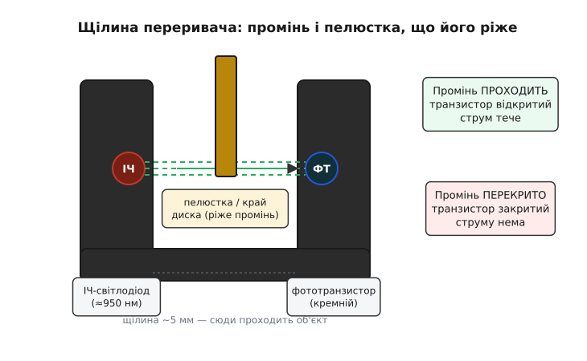
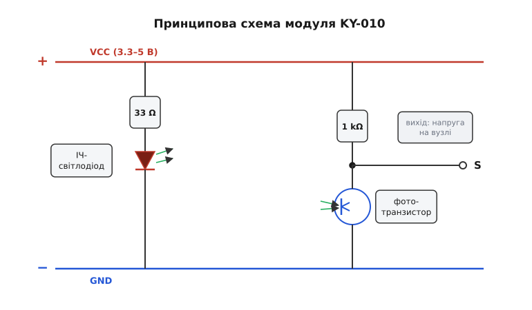
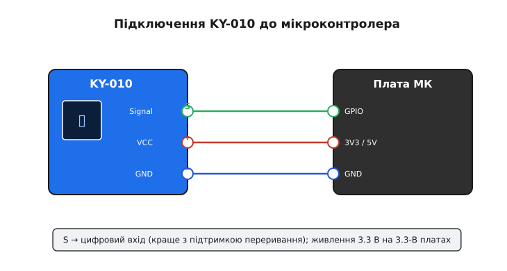

# KY-010 — оптичний переривач

<preknowlist>
- [KY-серія (Keyes 37-в-1)](topic:cat-hw-sensors/ky-series) — спільне походження, вигляд і 3-пінова цоколівка цих навчальних модулів; тут описано лише специфіку KY-010.
- [Світлодіод](topic:hw-motion/led) — прямий струм, послідовний резистор-обмежувач; чому діод світить і чому його не вмикають без опору.
- [Фототранзистор і оптопара](topic:hw-components/optocoupler) — транзистор, у якому світло грає роль базового струму: відкривається під освітленням, закривається в темряві.
- [GPIO — цифровий вхід](topic:hw-digital/gpio) — що таке HIGH/LOW на піні МК, навіщо резистор підтяжки (pull-up/pull-down) і що таке «висячий» вхід.
</preknowlist>

Уяви лічильник обертів на валу двигуна: треба знати, скільки разів провернулась вісь, але торкатися її не можна — тертя, знос, іскра. Розв'язок напрошується сам: посади на вал тонкий диск із прорізами, а збоку постав «ворота», крізь які проходить край диска. Крізь ворота світить невидимий промінь; коли між прорізами проходить суцільний край — промінь перекрито, коли надходить проріз — промінь знову пробивається. Кожне «перекрито → відкрито» — один зубець диска пролетів. Нічого не тертя об вал, самé світло рахує оберти.

Ці «ворота зі світлом» і є **оптичний переривач** (англ. *photo interrupter*, від гр. *phōs* — світло). KY-010 — навчальний модуль, що ставить такий переривач на маленьку плату з готовою обв'язкою, щоб його можна було одразу під'єднати до мікроконтролера трьома дротами. Він не вимірює освітленість кімнати й не «бачить» перешкоду попереду — він стежить рівно за однією річчю: чи стоїть щось у його щілині.

> 🔧 **Навіщо це.** Найпоширеніші застосування — рахувати оберти (тахометр, спідометр велосипеда), ловити край механізму (кінцевик у 3D-принтері, «додому» для каретки), рахувати предмети на конвеєрі, зчитувати щілинний енкодер. Скрізь, де рух треба перетворити на послідовність цифрових імпульсів **без механічного контакту**, оптичний переривач — перший інструмент, по який тягнешся.

KY-010 належить до [KY-серії — навчальних модулів Keyes](topic:cat-hw-sensors/ky-series): спільний формат плати, ті самі три піни, та сама філософія «один давач — одна плата для макетування». Спільну історію серії й загальний вигляд шукай там; тут — лише те, що робить саме KY-010 переривачем.

## Що це фізично

Серце модуля — щілинний оптичний переривач у чорному пластиковому корпусі у формі літери «U» (типовий представник класу — компонент ITR9606 виробництва Everlight та його аналоги). У корпусі одна навпроти одної стоять дві деталі: **інфрачервоний світлодіод** і **фототранзистор**. Між ними — повітряний проміжок близько 5 мм; саме в цей проміжок і заходить об'єкт.


*Ліворуч світить ІЧ-діод, праворуч його промінь ловить фототранзистор. Заходить пелюстка — промінь перекрито, транзистор закривається; вийшла — промінь знову проходить, транзистор відкривається.*

Чому саме інфрачервоне світло, а не видиме? Причин дві, і обидві практичні. По-перше, кремнієвий фототранзистор найчутливіший саме в ближньому інфрачервоному діапазоні — на ~950 нм (нанометр, 10⁻⁹ м) кремній відгукується сильніше, ніж на видимі кольори, тож пара «ІЧ-діод + кремнієвий транзистор» дає найбільший сигнал за найменший струм. По-друге, невидимий промінь не заважає оку й не збиває з пантелику: пристрій працює, а «лампочки» не видно.

Корпус чорний і матовий не для краси. Чорний пластик глушить стороннє світло, щоб фототранзистор реагував лише на «свій» промінь від сусіднього діода, а не на сонце з вікна чи лампу зі стелі. Це вже перша підказка про межу застосування: пряме яскраве світло, спрямоване в щілину, здатне «засліпити» давач і зіпсувати відлік — про це нижче.

Важливо, чим KY-010 **не** є. Він не рефлекторний: діод і транзистор дивляться один на одного впритул (*through-beam*, «наскрізь»), а не світять уперед і ловлять відбиття. Тому він не годиться, щоб помітити перешкоду за 10 см — для цього є [інфрачервоні давачі перешкод](topic:cat-hw-sensors/ir-obstacle) з окремою оптикою й компаратором. KY-010 бачить лише те, що фізично пройшло крізь його щілину.

## Плата й три піни

Сам переривач має чотири виводи (два — на діод, два — на транзистор), і вмикати його «голим» незручно: діод спалиш без резистора, а вихід транзистора нема на чому «читати». Модуль KY-010 знімає цей клопіт — додає рівно два резистори й виводить усе на три штирі з кроком 2.54 мм.


*Ліва вітка: 33 Ω обмежує струм ІЧ-діода. Права вітка: фототранзистор і навантажувальний резистор 1 kΩ утворюють дільник; вихід S — це напруга на вузлі між ними.*

Розберімо схему по вітках, бо в ній — уся суть роботи модуля.

**Ліва вітка — світло.** Від живлення через резистор **33 Ω** струм тече в інфрачервоний діод і далі на землю. Резистор тут — обмежувач: діод сам по собі майже не має опору, і без цього резистора струм зріс би до руйнівного. Проста оцінка показує, навіщо він і яке значення обрали.

**Приклад: який струм тече в ІЧ-діод при 5 В**
:::tabs
```cpp
// Спад напруги на інфрачервоному діоді ≈ 1.2 В (типово для GaAs 950 нм).
// Решта напруги гаситься на резисторі 33 Ω.
float Vcc   = 5.0;     // живлення, В
float Vled  = 1.2;     // спад на діоді, В
float R     = 33.0;    // обмежувальний резистор, Ом

float I = (Vcc - Vled) / R;   // закон Ома для вітки
// I = (5.0 - 1.2) / 33 = 3.8 / 33 ≈ 0.115 А ≈ 115 мА
```
```micropython
# Спад напруги на інфрачервоному діоді ≈ 1.2 В (типово для GaAs 950 нм).
# Решта напруги гаситься на резисторі 33 Ω.
Vcc  = 5.0     # живлення, В
Vled = 1.2     # спад на діоді, В
R    = 33.0    # обмежувальний резистор, Ом

I = (Vcc - Vled) / R   # закон Ома для вітки
# I = (5.0 - 1.2) / 33 = 3.8 / 33 ≈ 0.115 А ≈ 115 мА
```
:::
Вийшло ~115 мА — це вже чимало, і на 5 В діод світить яскраво, з добрим запасом сигналу. На 3.3 В струм падає приблизно до `(3.3 − 1.2) / 33 ≈ 64 мА` — світло тьмяніше, але переривач упевнено працює. Ось чому модуль тримає діапазон живлення 3.3–5 В: обидва краї дають достатньо світла, щоб транзистор чітко «бачив» промінь.

**Права вітка — читання.** Фототранзистор увімкнено колектором до навантажувального резистора **1 kΩ** (той іде до живлення), а емітером — на землю. Разом резистор і транзистор утворюють дільник напруги, а вихід **S** знімається з їхнього спільного вузла. Далі — головна логіка приладу:

- **Промінь проходить** (щілина вільна) → фототранзистор освітлено → він **відкритий**, добре проводить струм → тягне вузол S донизу, ближче до землі → на S **низька напруга**.
- **Промінь перекрито** (в щілині об'єкт) → транзистор у темряві → **закритий**, струму майже нема → резистор 1 kΩ підтягує вузол S до живлення → на S **висока напруга**.

Отже фізика приладу проста: **світло → вихід низький, темрява → вихід високий**. Об'єкт у щілині створює темряву, тож «є об'єкт» відповідає високому рівню на цьому вузлі. Саме тому в описах KY-010 часто пишуть «сигнал іде HIGH, коли промінь перекрито».

Тут — найважливіше застереження всієї статті, і воно про чесність. Полярність виходу залежить від того, **з якого саме вузла** конкретна ревізія плати знімає сигнал: якщо з колектора (як на схемі вище) — «перекрито = HIGH»; якщо натомість навантаження стоїть у вітці емітера, а вихід беруть звідти — усе перевертається на «перекрито = LOW». Різні партії KY-010 і різні їхні клони розведено по-різному, тож в інтернеті трапляються обидва твердження — і обидва бувають правдиві для своєї плати. **Ніколи не покладайся на полярність з чужого опису — виміряй свою плату вольтметром або коротким скетчем**, перш ніж будувати на ній логіку. Нижче саме так і зробимо.

Ще одна риса, спільна для «сирого» виходу переривача: між станами він змінюється **плавно**, а не миттєвим стрибком. Поки край диска повільно наповзає на промінь, транзистор частково прикривається — напруга на S не перескакує, а плавно повзе. На відміну від [давачів з компаратором LM393](topic:cat-hw-sensors/sound-lm393), у KY-010 компаратора на борту немає: він віддає аналоговий схил, і чистий цифровий фронт із нього мусить зробити або поріг мікроконтролера, або ваш код. Для повільного руху це означає обов'язковий захист від «дрижання» (докладно — далі).

## Як підключити

Три піни підписані на платі й підключаються без несподіванок.


*Три дроти: сигнал S — на цифровий вхід (краще з підтримкою переривання), живлення «+» — на 3.3 чи 5 В плати, «−» — на землю.*

- **«−» (GND)** — до землі мікроконтролера. Спільна земля обов'язкова, інакше рівні виходу нема від чого відлічувати.
- **«+» (VCC)** — до живлення. На платах з 3.3-вольтовими входами (ESP32, більшість STM32) живи модуль від 3.3 В, щоб вихід не перевищив допустимий рівень входу. На 5-вольтовому Arduino Uno — від 5 В.
- **«S» (Signal)** — до цифрового входу. Якщо збираєшся ловити швидкі імпульси (оберти, край на льоту), обери пін з апаратним **перериванням** — так жоден імпульс не загубиться між опитуваннями.

Підтяжку на вході здебільшого вмикати не треба: навантажувальний резистор 1 kΩ на платі вже задає обом станам виразну напругу, вихід не «висить». Це відрізняє KY-010 від суто-ключових модулів на кшталт [геркона KY-021](topic:cat-hw-sensors/ky-021-reed), де без підтяжки вхід лишається невизначеним.

## Робота в коді

Оскільки полярність плати наперед невідома, розумний перший крок — **не вгадувати її, а виміряти**. Ось скетч-калібратор: він показує, який рівень відповідає вільній щілині, а який — перекритій. Запусти його, посунь у щілину аркуш паперу — і прочитай правду про свою плату.

**Приклад: визначаємо полярність своєї плати**
:::tabs
```cpp
const int PIN_S = 2;   // сигнал KY-010 на цифровому вході D2

void setup() {
  pinMode(PIN_S, INPUT);
  Serial.begin(9600);
  Serial.println("Заводь щілину то вільною, то перекритою — дивись на рівень:");
}

void loop() {
  int level = digitalRead(PIN_S);
  Serial.println(level ? "HIGH" : "LOW");
  delay(200);
}
```
```micropython
from machine import Pin
import time

pin_s = Pin(2, Pin.IN)   # сигнал KY-010 на цифровому вході GP2

print("Заводь щілину то вільною, то перекритою — дивись на рівень:")
while True:
    level = pin_s.value()
    print("HIGH" if level else "LOW")
    time.sleep_ms(200)
```
:::
Побачив, що перекрита щілина дає, скажімо, HIGH, — зафіксуй це в одній іменованій константі, і решта коду перестане залежати від ревізії плати:

:::tabs
```cpp
const int PIN_S     = 2;
const int BLOCKED   = HIGH;   // ← постав те, що показав калібратор саме на ТВОЇЙ платі

bool isBlocked() {
  return digitalRead(PIN_S) == BLOCKED;
}
```
```micropython
from machine import Pin

pin_s   = Pin(2, Pin.IN)
BLOCKED = 1              # ← постав те, що показав калібратор саме на ТВОЇЙ платі

def is_blocked():
    return pin_s.value() == BLOCKED
```
:::

Тепер типова задача — **порахувати проходи** (зубці диска, предмети на стрічці). Наївний `if (isBlocked()) count++;` у циклі порахує не проходи, а кількість опитувань, поки об'єкт стоїть у щілині. Рахувати треба **переходи** — момент, коли щілина щойно перекрилась. Це різниця між станом і подією, і плутанина тут — найчастіша помилка новачка.

**Приклад: рахуємо проходи по фронту, з захистом від дрижання**
:::tabs
```cpp
const int PIN_S      = 2;
const int BLOCKED    = HIGH;      // з калібрування вище
const unsigned long GUARD = 3;    // «мертвий час», мс — гасить дрижання на схилі

volatile unsigned long count = 0;
bool     prev = false;            // попередній стан щілини
unsigned long tEdge = 0;          // час останнього зарахованого фронту

void setup() {
  pinMode(PIN_S, INPUT);
  Serial.begin(9600);
}

void loop() {
  bool now = (digitalRead(PIN_S) == BLOCKED);
  unsigned long t = millis();

  // цікавить лише фронт «вільно → перекрито» і не частіше, ніж раз на GUARD мс
  if (now && !prev && (t - tEdge) > GUARD) {
    count++;
    tEdge = t;
    Serial.println(count);
  }
  prev = now;
}
```
```micropython
from machine import Pin
import time

PIN_S   = 2
BLOCKED = 1              # з калібрування вище
GUARD   = 3             # «мертвий час», мс — гасить дрижання на схилі

pin_s = Pin(PIN_S, Pin.IN)
count = 0
prev  = False           # попередній стан щілини
t_edge = 0              # час останнього зарахованого фронту

while True:
    now = (pin_s.value() == BLOCKED)
    t = time.ticks_ms()

    # цікавить лише фронт «вільно → перекрито» і не частіше, ніж раз на GUARD мс
    if now and not prev and time.ticks_diff(t, t_edge) > GUARD:
        count += 1
        t_edge = t
        print(count)
    prev = now
```
:::
Логіка `now && !prev` спрацьовує рівно один раз на кожне входження об'єкта в щілину — на **передньому фронті**. Віконце `GUARD` у кілька мілісекунд відсікає багаторазові хибні спрацювання, коли край диска повзе через промінь і напруга кілька разів перетинає поріг туди-сюди (те саме «дрижання контактів», тільки оптичне, від плавного схилу без компаратора). Для дуже швидких валів цю саму логіку по фронту переносять у обробник переривання — щоб апаратура ловила кожен зубець, а не пропускала його між двома `digitalRead`. Готовий каркас драйвера — лічильник на перериванні, переведення в оберти за хвилину, вимірювання швидкості — винесено в [приклад-проєкт з робочим кодом](topic:cat-hw-sensors/ky-010-interrupter/proj-ky010-counter.md).

## Чого стерегтися

**Полярність — не вгадуй.** Повторю, бо це головна пастка: різні плати KY-010 дають протилежні рівні. Завжди калібруй, як показано вище, і ховай полярність в одну константу.

**Плавний схил, не чистий фронт.** Без компаратора вихід повзе, а не стрибає. На повільному русі це дає багаторазові хибні переходи — рятує захист «мертвим часом» або зовнішній тригер Шмітта, якщо потрібен ідеально чистий фронт.

**Стороннє світло.** Сильне інфрачервоне джерело — пряме сонце, лампа розжарювання, інший ІЧ-давач поряд — може пробитися в щілину повз чорний корпус і тримати транзистор відкритим, навіть коли об'єкт стоїть. У яскравому оточенні прикрий щілину від засвітки або обери переривач з глибшим корпусом.

**Бруд і пил.** Щілину легко засмітити: волосинка, крапля мастила, пил на прозорих вікнах діода й транзистора послаблюють промінь і збивають поріг. У курному місці (принтер, верстат) щілину періодично чистять.

**Струм діода.** ~115 мА на 5 В — це струм лише цього модуля; кілька переривачів на одній 3.3-вольтовій платі здатні перевищити її бюджет живлення. Рахуй сумарний струм, коли ставиш їх пачкою.

**Тонкий прозорий об'єкт нічого не перекриє.** Якщо через щілину проходить прозора для інфрачервоного плівка або дуже вузький край, промінь її не «помітить» — переривачу потрібен непрозорий об'єкт, ширший за промінь.

KY-010 — саме той випадок, коли простий давач розкриває глибоку ідею: рух перетворюється на цифру не механічним контактом, а тінню, що перетинає промінь. Зрозумівши його три піни й одну асиметрію («світло — низько, темрява — високо», з поправкою на ревізію плати), ти маєш усе, щоб порахувати оберти, зловити край чи полічити предмети — надійно й без жодного тертя.
