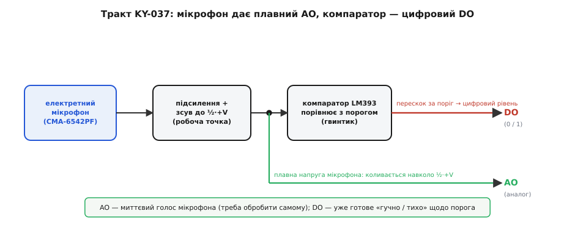
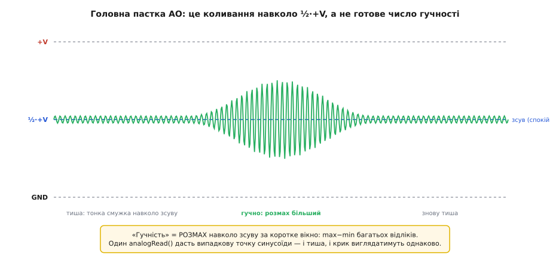
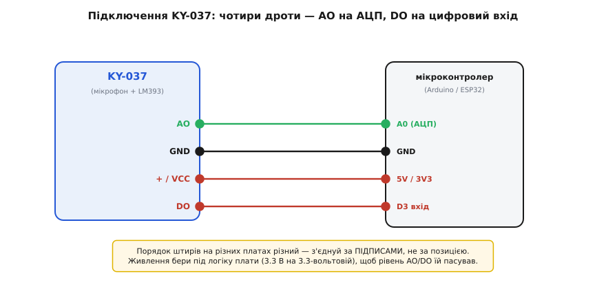

# KY-037 — давач звуку (великий мікрофон)

<preknowlist>
- [KY-серія (Keyes 37-в-1)](topic:cat-hw-sensors/ky-series) — спільна порода синіх платок: гребінка, живлення 3.3–5 В, «номер важливіший за виробника» і три лекала розмови з платою; KY-037 — компараторне лекало серії.
- [Компаратор](topic:hw-analog/comparator) — схема, що одним бітом каже «більше/менше за поріг»; це серце цифрового виходу KY-037 (мікросхема LM393).
- [АЦП](topic:hw-analog/adc) — як мікроконтролер перетворює напругу на число; без нього аналоговий вихід давача — просто вольти, які нема куди подіти.
- [GPIO](topic:hw-digital/gpio) — цифровий вивід мікроконтролера, що читає логічний рівень «високо/низько»; туди йде цифровий вихід давача.
- [Рівні «0» і «1»](topic:hw-digital/logic-levels-as-ranges) — що таке 5-вольтова й 3.3-вольтова логіка як діапазони напруги; від цього залежить, чи не спалить вихід модуля вхід плати.
</preknowlist>

Серед синіх платок аматорського набору KY-037 упізнається одразу: на ній сидить **великий сріблястий циліндрик мікрофона** — помітно більший за все навколо, — поряд чорна коробочка мікросхеми з написом LM393, синій підстроювальний гвинтик і два світлодіоди. Це давач звуку: він «чує» повітря навколо й дає мікроконтролеру знати, коли стало голосно. Ним будять пристрій від оплеску, вмикають підсвітку від звуку, ставлять грубий «детектор шуму» — усюди, де треба реагувати на звук, але справжній мікрофонний тракт із оцифруванням був би надмірним.

І тут-таки причаїлася головна плутанина цього модуля, через яку більшість перших проєктів із ним поводяться незбагненно. **KY-037 сам по собі не «вимірює гучність»** — усередині живуть два різні тракти, і кожен віддає щось своє. Один каже просте «так/ні»: перевищив звук поставлений тобою поріг — чи ні. Другий віддає **плавний, миттєвий голос мікрофона** — тонку хвилю напруги, з якої гучність ще треба видобути самому. Плутати їх — і буде класичне «давач показує якесь сміття». Тож розберімо чесно, що ця платка вміє насправді, як улаштована й що з цього випливає для коду.

## Родина, до якої він належить

KY-037 — типовий член [KY-серії](topic:cat-hw-sensors/ky-series): те саме походження (бренд Keyes), той самий формат синьої платки з гребінкою, та сама всеїдність за живленням 3.3–5 В. Спільну породу серії — звідки взялися ці модулі, чому номер важливіший за виробника, і три лекала, за якими вони розмовляють із платою, — розібрано в оглядовій статті родини; повторювати її тут не будемо. Досить сказати, що KY-037 працює за **другим лекалом серії — компараторним**: мікрофон дає аналоговий сигнал, а мікросхема-компаратор порівнює його з порогом і видає цифрове «так/ні». Саме тому в модуля чотири виводи, а не три, і синій гвинтик збоку.

Ще одне про родину, важливе для впізнавання. У наборі є **два дуже схожі звукові модулі** — KY-037 і його менший брат [KY-038](topic:cat-hw-sensors/ky-038-mic). Начиння в них те саме: електретний мікрофон, компаратор LM393, гвинтик-поріг, два виходи. Різниця — у **розмірі й чутливості**: KY-037 більший, з великим мікрофонним капсулем і трохи вищою чутливістю, тоді як KY-038 — компактніший і з дещо інакшою обв'язкою, спрямованою на кращу завадостійкість. З погляду коду вони **взаємозамінні** — той самий спосіб читання, ті самі пастки. Тому все, що нижче, стосується обох; окремо про менший варіант — у статті [KY-038](topic:cat-hw-sensors/ky-038-mic). А те, що ці два модулі — лише «модульна» подача тієї самої мікросхемної схеми, узагальнено в описі [класу звукових давачів на LM393](topic:cat-hw-sensors/sound-lm393); KY-037 — його найбільша, найчутливіша реалізація.

## Що всередині: мікрофон і компаратор

Щоб код із KY-037 перестав дивувати, треба побачити його тракт від першопричини — від звукової хвилі до бітів на виводах. Розберімо його по ланцюгу.

**Спочатку — електретний мікрофон.** Той великий сріблястий циліндрик (у типової партії — капсуль **CMA-6542PF**) перетворює коливання повітря на коливання напруги. Усередині — тонка металізована плівка (мембрана) навпроти нерухомої пластини; разом вони утворюють крихітний конденсатор. Плівка **електретна** (від англ. *electret* — «electric» + «magnet»): вона назавжди несе вбудований заряд, як магніт назавжди несе поле. Звук хитає мембрану, відстань між обкладками змінюється, а що заряд зафіксований — змінюється напруга на конденсаторі. Так тиск повітря стає слабким електричним сигналом. Це той самий принцип, що й у сучасних цифрових [MEMS-мікрофонів](topic:hw-sensing/mems-microphone), лише капсуль тут аналоговий і завеликий проти кремнієвого.

Сигнал із мікрофона мізерний — одиниці мілівольтів, — тож поряд стоїть **підсилювач**, який його піднімає до розмаху, зручного для решти схеми. І тут з'являється риса, без якої не зрозуміти аналоговий вихід. Звук — величина **знакозмінна**: тиск то більший за атмосферний, то менший, тож «чистий» сигнал мікрофона гойдається навколо нуля, і в плюс, і в мінус. Але мікроконтролер (і його АЦП) живиться від одного полюса й **не вміє читати від'ємну напругу** — нижче нуля для нього не існує. Тому схема штучно **піднімає всю хвилю на середину живлення**: у спокої, коли тихо, вихід стоїть не на нулі, а приблизно на **½·+V** (близько 1.65 В при живленні 3.3 В або 2.5 В при 5 В). Звук хитає сигнал уже навколо цієї «робочої точки» — угору й униз від неї. Ця половинна напруга спокою — не поломка, а навмисний **зсув** (англ. *DC bias*), і саме нерозуміння його породжує половину помилок із давачем.

> 🔧 **Навіщо це.** Тримай у голові: у **тиші аналоговий вихід KY-037 — не нуль, а половина живлення**. Новачок міряє його вольтметром, бачить ~1.6 В «нізвідки» й вирішує, що модуль несправний. Насправді це та сама робоча точка, навколо якої гойдається звук. Гучність ховається не в самому рівні, а в **розмаху коливань навколо цієї половини** — і саме звідси її треба діставати в коді (нижче покажу як).

**Далі — компаратор LM393.** Це серце «цифрової» половини модуля. [Компаратор](topic:hw-analog/comparator) — проста, але потужна річ: у нього два входи, і він лише порівнює, на якому напруга вища, видаючи на виході цифрове «так» або «ні». На один вхід заведено сигнал мікрофона, на другий — **опорну напругу порога**, яку ти задаєш тим самим синім гвинтиком (це підстроювальний резистор — дільник, що дає на вихід будь-яку частку живлення). Щойно звук стане голоснішим за поставлений поріг, напруга сигналу перескочить опорну — і компаратор перекине вихід. Стало тихіше — перекине назад. Так плавна хвиля перетворюється на чисте цифрове «гучно / не гучно».

Мікросхема LM393 містить **два** таких компаратори (звідси «393» — здвоєний), але модуль використовує лише один; другий просто не задіяний. І ще одна дрібниця з наслідками: вихід LM393 — **відкритий колектор**. Це означає, що сам він уміє лише «притягувати» вихід до землі, а «вгору» його тягне підтяжковий резистор на платі. Практично тобі цього знати не треба — на модулі підтяжка вже стоїть, — але саме через відкритий колектор на різних платах цифровий вихід буває перевернутий, і про це трохи згодом.


*Два тракти в одному модулі. Мікрофон і підсилювач дають плавну напругу, що коливається навколо половини живлення. Ця напруга розгалужується: одна гілка йде прямо назовні як аналоговий вихід AO (миттєвий голос мікрофона — обробляй сам), друга — на компаратор LM393, що порівнює її з порогом (гвинтик) і віддає готовий цифровий DO «гучно / тихо».*

## Чотири виводи й два світлодіоди

Оскільки в модуля два тракти, у нього й **чотири виводи** (у KY-серії проста платка має три, а компараторна — чотири). Позначення на різних партіях підписані по-різному й **стоять у різному порядку**, тож звіряйся з буквами на самій платі, а не з чужим малюнком:

- **+ / VCC** — живлення, 3.3 В або 5 В.
- **G / GND** — спільна земля.
- **DO (Digital Out)** — цифровий вихід компаратора: «0» або «1» залежно від того, перескочив звук поріг чи ні. Поріг рухаєш гвинтиком.
- **AO (Analog Out)** — аналоговий вихід: та сама плавна напруга мікрофона (навколо ½·+V), яку читаєш АЦП.

Два світлодіоди на платі — не прикраса, вони підказують стан:

- **LED1 (живлення)** світиться постійно, щойно подано живлення, — груба перевірка, що модуль узагалі ввімкнений.
- **LED2 (спрацювання)** прив'язаний до цифрового виходу: він спалахує рівно тоді, коли звук перевищив поріг. Це неоціненний інструмент **налаштування гвинтиком**: крутиш поріг і дивишся, за якої гучності LED2 починає реагувати саме на потрібний звук, а не на фоновий шум. По суті LED2 показує тобі очима те, що прочитає код на піні DO.

> 🔧 **Навіщо це.** Гвинтик виставляй **за світлодіодом LED2, а не наосліп**. У тиші кімнати крути поріг, поки LED2 щойно згасне (модуль перестає спрацьовувати від фонового шуму); тоді перевір, що потрібний звук — оплеск, стук, голос — його впевнено запалює. Це двохвилинне налаштування — і DO почне давати чесне «є подія / нема», без якого код ловитиме або все підряд, або нічого.

Тепер — головна пастка, заради якої й варто розрізняти два виходи.

## Головна пастка: що насправді на аналоговому виході

Спокуса очевидна: «хочу число гучності — прочитаю аналоговий вихід одним `analogRead`». І тут майже всі спотикаються, бо **один відлік AO не каже про гучність нічого**.

Причина — у зсуві, про який ішлося вище. На AO не «рівень гучності», а **миттєве значення звукової хвилі**, що прудко гойдається навколо ½·+V. Прочитавши його один раз, ти впіймаєш **випадкову точку синусоїди**: сигнал якраз міг бути на гребені, у западині чи на середині. І в глибокій тиші, і під час крику одиничний `analogRead` однаково легко поверне значення, близьке до половини живлення, — бо саме там хвиля проходить двічі за період. Тому «тихо/гучно» за одним відліком **не відрізниш**: обидва дають плюс-мінус те саме число.


*Аналоговий вихід у часі. Пунктир посередині — робоча точка ½·+V (рівень спокою). У тиші сигнал ледь тремтить навколо неї; коли гучно — розгойдується широко вгору й униз. «Гучність» — це не рівень, а РОЗМАХ навколо зсуву: max−min по багатьох відліках за коротке вікно. Один analogRead дасть випадкову точку — і тиша, і крик тоді виглядають однаково.*

Правильний спосіб дістати гучність із AO випливає прямо з картинки: **зміряти розмах хвилі за коротке вікно**. Береш багато відліків підряд за кілька мілісекунд, запам'ятовуєш найбільше й найменше значення — і **різниця max−min** і є мірою гучності: у тиші вона крихітна, при голосному звуці — велика. Ось як це виглядає в прошивці:

**Умова.** AO під'єднано до аналогового входу A0. Треба за кожні ~50 мс оцінити гучність як розмах сигналу й вивести число, зручне для порівняння.

:::tabs
```cpp
const uint8_t MIC = A0;           // аналоговий вихід KY-037
const unsigned long WINDOW = 50;  // вікно вимірювання, мс

int measureLoudness() {
    unsigned long t0 = millis();
    int hi = 0, lo = 1023;        // межі діапазону АЦП (10-біт)
    while (millis() - t0 < WINDOW) {
        int v = analogRead(MIC);  // миттєва точка хвилі
        if (v > hi) hi = v;
        if (v < lo) lo = v;
    }
    return hi - lo;               // РОЗМАХ: тиша ≈ мало, гучно ≈ багато
}

void setup() { Serial.begin(9600); }

void loop() {
    int loud = measureLoudness();
    Serial.println(loud);         // спробуй у тиші й під оплеск — числа різні
}
```
```micropython
from machine import ADC, Pin
from time import ticks_ms, ticks_diff

mic = ADC(Pin(26))            # аналоговий вихід KY-037
WINDOW = 50                   # вікно вимірювання, мс

def measure_loudness():
    t0 = ticks_ms()
    hi, lo = 0, 65535         # межі діапазону read_u16 (16-біт)
    while ticks_diff(ticks_ms(), t0) < WINDOW:
        v = mic.read_u16()    # миттєва точка хвилі
        if v > hi:
            hi = v
        if v < lo:
            lo = v
    return hi - lo            # РОЗМАХ: тиша ≈ мало, гучно ≈ багато

while True:
    loud = measure_loudness()
    print(loud)               # спробуй у тиші й під оплеск — числа різні
```
:::

Різниця `hi - lo` — не готові децибели, а **сирі одиниці АЦП**, але їх цілком досить, щоб відрізнити тишу від звуку й порівняти з власним порогом. Якщо треба справжня гучність у знайомих одиницях — доведеться калібрувати давач за еталоном, бо електретні капсулі різняться між собою, а підсилення на модулі не нормоване.

> 🔧 **Навіщо це.** Правило одне: **AO читають вікном, а не крапкою**. Хочеш число гучності — набирай пачку відліків і бери розмах (`max−min`) або, точніше, середньоквадратичне відхилення від середнього. Один `analogRead` для звуку **непридатний** — це найчастіша причина, чому «аналоговий давач звуку показує однакове й у тиші, і під музику». А коли тобі не потрібне число, а лише факт «стало голосно» — не мороч голови з AO взагалі: для цього є цифровий вихід.

## Цифровий вихід: коли треба лише «так/ні»

Якщо завдання — просто зреагувати на голосний звук (сплеск, стук, «стало шумно»), цифровий вихід DO значно простіший за AO: уся робота з вікном і розмахом уже зроблена **залізом** — компаратор сам порівнює сигнал із порогом. Твій код лише читає готовий біт.

**Умова.** DO під'єднано до цифрового входу D3, поріг виставлено гвинтиком за LED2. Треба засвітити вбудований світлодіод на час, поки давач чує звук понад поріг.

:::tabs
```cpp
const uint8_t SOUND = 3;          // цифровий вихід KY-037
const uint8_t LED   = 13;         // вбудований світлодіод плати

void setup() {
    pinMode(SOUND, INPUT);
    pinMode(LED, OUTPUT);
    Serial.begin(9600);
}

void loop() {
    int hit = digitalRead(SOUND);  // спрацював поріг чи ні
    digitalWrite(LED, hit);        // світимо, поки є звук понад поріг
    Serial.println(hit);
}
```
```micropython
from machine import Pin

sound = Pin(3, Pin.IN)            # цифровий вихід KY-037
led = Pin(25, Pin.OUT)           # вбудований світлодіод плати

while True:
    hit = sound.value()          # спрацював поріг чи ні
    led.value(hit)               # світимо, поки є звук понад поріг
    print(hit)
```
:::

Але тут — **своя пастка полярності**, і вона родом із відкритого колектора LM393. На частині плат DO у спокої тримає «1» (ВИСОКО), а звук роняє його в «0» (НИЗЬКО) — тобто подія це `LOW`; на інших усе навпаки. Однозначного «завжди так» немає: залежить від того, як конкретна плата розвела компаратор і підтяжку. За даташитом самого модуля (наприклад, від Joy-IT) DO **зростає** в «1» при перевищенні порога, але дешеві безіменні клони часто інвертовані. Тому перед тим як зашивати логіку, **поглянь очима**: у тиші подивись, що друкує `digitalRead` у монітор, і як поводиться LED2, — а тоді підлаштуй порівняння під свою плату.

> 🔧 **Навіщо це.** Не програмуй DO наосліп. Залий скетч, що друкує `digitalRead(SOUND)`, і послухай: якщо в тиші стабільно «1», а від гучного звуку проскакує «0» — подія у тебе `LOW`, реагуй на падіння; якщо навпаки — `HIGH`. І пиши так, щоб полярність легко перевернути одним рядком (порівняння зі станом спокою), а не зашивай «0» чи «1» намертво — тоді той самий код переживе будь-яку партію модуля. Те саме стосується й аналогового виходу: на деяких платах (той-таки Joy-IT) AO **інвертований** — голосніше дає *нижчу* напругу; для розмаху `max−min` це байдуже (різниця та сама), але якщо колись читатимеш абсолютний рівень — май це на увазі.

Ще важлива межа: DO дає **лише «перевищено / ні»**, і поки звук голосний — вихід тримається в стані події безперервно, а не «пікає» один раз на сплеск. Якщо тобі треба рахувати окремі події (кожен оплеск — один раз), лови саме **перехід** рівня (фронт), а не сам рівень, і, як у будь-якій пороговій схемі, додай трохи **гістерезису** в часі, щоб один затяжний звук чи тремтіння біля порога не намотали десяток спрацювань. Це той самий підхід «поріг + гістерезис», що й у [тригера Шмітта](topic:hw-analog/schmitt-trigger): не реагувати на кожне мікроколивання біля межі.

## Як під'єднати

Підключення просте — чотири дроти, і жодних зовнішніх деталей не треба (уся обв'язка вже на платі):

- **+ / VCC** — на живлення плати. Модуль всеїдний, працює і від 3.3 В, і від 5 В. Живи його **під логіку своєї плати**: на 3.3-вольтовій платі бери 3.3 В, щоб рівень на DO/AO не перевищив дозволеного для входу. На 5-вольтовій Arduino дай 5 В — заразом дістанеш ширший розмах на AO, читати легше.
- **G / GND** — на спільну землю плати.
- **AO** — на **аналоговий** вхід (той, що вміє АЦП, наприклад A0), якщо потрібне число гучності.
- **DO** — на будь-який **цифровий** вхід, якщо потрібен лише факт «гучно/тихо».

Часто задіюють **лише один** із двох виходів — той, що потрібен під задачу: DO для реакції на подію, AO для вимірювання рівня. Обидва одразу тягнуть, коли хочеться і грубого «спрацювало» від заліза, і числа для тоншого аналізу.


*Чотири дроти до плати. AO йде на аналоговий вхід (A0, через АЦП) для числа гучності; DO — на цифровий вхід для готового «так/ні». Живлення бери під логіку плати. Порядок штирів на різних партіях різний — з'єднуй за ПІДПИСАМИ на платі, а не за позицією.*

Готовий короткий скетч для найпоширенішого сценарію «оплеск вмикає, оплеск вимикає», з правильним читанням фронту DO та гістерезисом, зібрано в [окремому проєкті-вставці](topic:cat-hw-sensors/ky-037-mic/proj-ky037-driver.md) — з робочими прикладами під Arduino та ESP32 і для DO, і для аналізу AO.

## Як упізнати й чого стерегтися

KY-037 упізнається за **великим сріблястим мікрофонним циліндриком** (помітно більшим, ніж на KY-038), мікросхемою LM393, синім гвинтиком-порогом, двома світлодіодами і **чотирма** штирями. Якщо мікрофон дрібний і плата компактніша — це радше KY-038; якщо гвинтика й мікросхеми немає взагалі, а на платі лише пасивний елемент — це вже інший тип давача, не звуковий компараторний.

Наостанок — перелік того, на чому спотикаються з KY-037 найчастіше, з причиною кожної біди:

- **Аналоговий вихід «однаковий» і в тиші, і під звук.** Найчастіше — читаєте AO **одним `analogRead`**, а він ловить випадкову точку хвилі. Лік — вимірювати **розмах** (`max−min`) за коротке вікно, як у прикладі вище.
- **У тиші на AO ~1.6 В (або ~2.5 В) «нізвідки», модуль здається несправним.** Це навмисний **зсув ½·+V** — робоча точка, навколо якої гойдається звук. Так і має бути.
- **Цифровий вихід спрацьовує «навпаки»: у спокої тривога, від звуку тиша.** У вас **інвертований DO** (варіант плати чи клон). Перевірте рівень спокою `digitalRead` і переверніть порівняння (`LOW ↔ HIGH`).
- **DO спрацьовує від найменшого шурхоту або, навпаки, мовчить на все.** Поріг **не налаштований**. Виставте гвинтик за LED2: у тиші щоб щойно згас, на потрібний звук — щоб упевнено спалахував.
- **Один оплеск рахується багато разів.** DO тримається в стані події, поки звук голосний, а біля порога ще й тремтить. Ловіть **фронт** (перехід рівня), а не сам рівень, і додайте вікно придушення на кілька десятків мілісекунд.
- **Хочеться точних децибелів, а виходять «сирі» числа.** Це в природі модуля: підсилення не нормоване, капсулі різняться. KY-037 добрий для **відносних** суджень (голосніше/тихіше, є звук/нема); для абсолютного рівня потрібне калібрування за еталоном або спеціалізований мікрофонний модуль.
- **Давач реагує на власне живлення / наводки, «фонить».** Довгі дроти до AO ловлять наведення, а брудне живлення підмішує гул. Тримайте дріт до AO коротким, живіть модуль від чистого джерела; для DO це менш критично, бо поріг відсікає дрібні коливання.

Головне про KY-037 тримається на одному розрізненні: **DO — це готове «гучно/тихо» від компаратора** (простий біт, поріг гвинтиком), а **AO — сирий, миттєвий голос мікрофона навколо ½·+V**, з якого гучність треба видобути вікном. Побачиш ці два тракти окремо — і давач, який доти «показував сміття», стане простим і передбачуваним.
