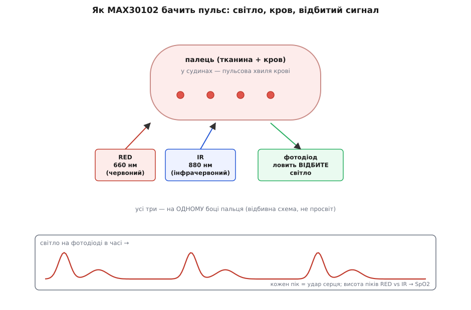
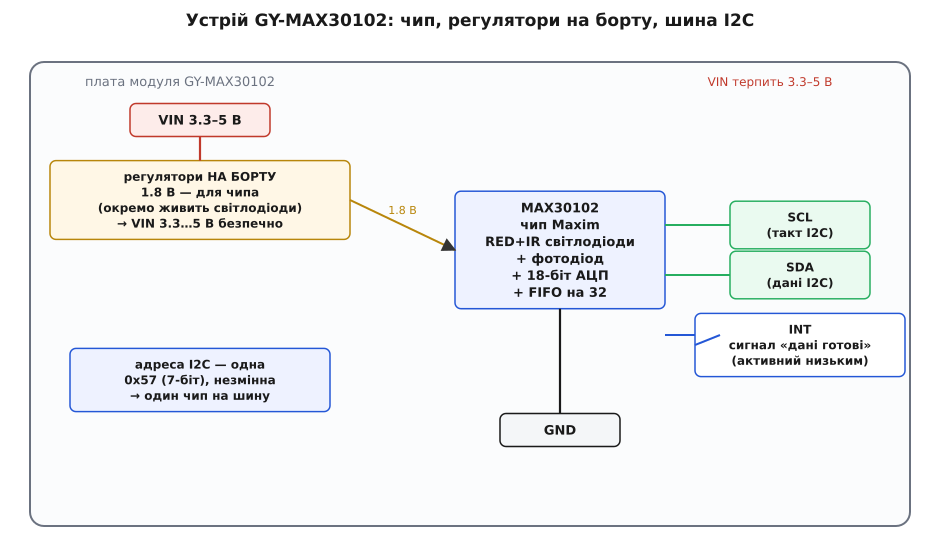
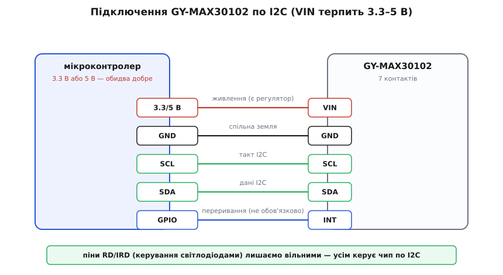

# GY-MAX30102 — давач пульсу і SpO2

<preknowlist>
- [Шина I²C](root:com-devices/i2c-bus) — дві лінії SDA/SCL, ведучий і ведений, обмін байтами по регістрах; єдиний спосіб говорити з цим модулем.
- [Світлодіод](root:hw-motion/led) — напівпровідник, що світить, коли крізь нього тече струм; тут їх два, різних кольорів.
- [Фізика фотодіода-давача](root:hw-sensing/photodetector-physics) — напівпровідник, що з падаючого світла робить струм; ним давач «бачить» відбите світло.
- [GY-серія брейкаут-модулів](root:cat-hw-sensors/gy-series) — що таке дешева платка-переходник під голу мікросхему і що спільного має вся родина «GY-».
</preknowlist>

Візьміть у руку маленьку червонувату платку завбільшки з ніготь великого пальця. З одного її боку — гребінка контактів, а з другого сидить чорне віконце завбільшки з рисове зерно, за яким ховаються два світлодіоди й крихітне око-фотодіод. Прикладіть подушечку пальця до цього віконця — і за секунду мікросхема почне бачити, як б'ється ваше серце, і рахувати, скільки кисню несе ваша кров. Це **GY-MAX30102** — оптичний давач пульсу й насичення крові киснем (SpO2), той самий принцип, що працює в фітнес-браслетах і «розумних» годинниках на зап'ястку. Ця стаття — про те, як упізнати цю платку, що ховається за чорним віконцем, як воно взагалі вміє «бачити» пульс крізь шкіру, як під'єднати модуль до мікроконтролера й чому число, яке він видає, саме по собі ще не пульс, поки над ним не попрацює алгоритм.

Назву варто одразу розвести на дві частини. **MAX30102** — це сама мікросхема-давач, виробництва **Maxim Integrated** (американська компанія з Каліфорнії, яку 2021 року купила Analog Devices — тому в новіших документах чип підписаний уже як ADI). А «GY-» — маркування дешевої **плати-переходника**, що виносить цю мікросхему на зручну гребінку й додає навколо неї те, чого голому чипу бракує для життя. Спільну історію [GY-серії](root:cat-hw-sensors/gy-series) тут не переказуємо — гляньте оглядову статтю родини; нас цікавить конкретно ця платка з конкретним чипом.

## Що воно міряє і як це взагалі можливо

MAX30102 видає два потоки чисел, з яких зовнішня програма рахує дві величини: **частоту серцебиття** (пульс, ударів за хвилину) і **насичення крові киснем** — SpO2 (від *saturation of peripheral oxygen*, насичення киснем на периферії), у відсотках. Здорова людина в спокої має пульс десь 60–100 ударів за хвилину і SpO2 близько 95–99 %.

Але як шматочок кремнію бачить пульс крізь непрозорий палець? Тут — уся суть, і вона напрочуд красива. Метод називають **фотоплетизмографією** (гр. *plethysmos* — наповнення, *graphein* — записувати): «запис наповнення світлом». Ідея така. Кров поглинає світло. З кожним ударом серця артерії наповнюються кров'ю трохи більше, тоді знову спадають — і разом із цим ледь-ледь міняється, скільки світла тканина пропускає й відбиває. Якщо посвітити в палець і уважно стежити за яскравістю світла, що вертається, ви побачите слабеньке пульсування в такт серцю. Оце пульсування і є пульсова хвиля.

MAX30102 робить це так: усередині чипа два світлодіоди — **червоний** (довжина хвилі близько 660 нм) і **інфрачервоний** (близько 880 нм) — по черзі підсвічують тканину, а поряд сидить **фотодіод**, який ловить світло, що відбилося назад від пальця. Важливо, що всі три — джерела й приймач — стоять на **одному** боці, тож світло не проходить палець наскрізь, а відбивається (це називають **відбивною**, рефлективною схемою, на відміну від просвітної, як у лікарняних прищіпках на палець). Чип багато разів за секунду замірює яскравість відбитого світла й віддає ці відліки назовні. Мікроконтролер бачить хвилясте число, у якому «сховані» удари серця.


*Принцип відбивної фотоплетизмографії: два світлодіоди й фотодіод — на одному боці пальця. З кожним ударом артерії наповнюються кров'ю, відбите світло ледь тьмянішає, і фотодіод малює хвилю, де кожен пік — удар серця. Різне поглинання червоного й інфрачервоного світла дає SpO2.*

> 🔧 **Навіщо це.** Розуміти сам принцип конче потрібно, бо він одразу пояснює головні пастки роботи з модулем. Сигнал слабенький — корисне пульсування становить лічені відсотки від загального рівня світла, решта то стала «підсвітка» тканини. Тому давач боїться руху пальця (артефакти рухом забивають слабку хвилю), боїться стороннього світла, що потрапляє повз палець, і вимагає рівного, не надто сильного й не надто слабкого притискання. Знаєте це — і не дивуєтеся, чому «сирі» відліки без обробки виглядають як мало осмислений шум.

А чому світлодіодів саме два, і навіщо для SpO2 потрібні різні кольори? Бо насичення киснем рахують саме з **різниці**. Кров буває двох видів: насичена киснем (оксигемоглобін, яскраво-червона) і без кисню (дезоксигемоглобін, темніша). Ці два види по-різному поглинають червоне й інфрачервоне світло: насичена киснем кров краще пропускає червоне, а «порожня» — гірше. Тому, порівнявши, наскільки сильно пульсує червоний сигнал відносно інфрачервоного, можна вирахувати частку кисню в крові. Один колір дав би тільки пульс; два кольори дають ще й SpO2. Саме тому в чипі рівно два світлодіоди різних довжин хвиль — це не забаганка, а фізична необхідність методу.

## MAX30102 проти MAX30100 — не плутати покоління

На ринку живуть схожі за назвою давачі, і початківці їх плутають. **MAX30100** — попереднє покоління того самого сімейства. Різниця не косметична: MAX30102 має точніший **18-бітний** аналого-цифровий перетворювач (у MAX30100 було 14 біт), інакшу цоколівку й інакше внутрішнє живлення, а інфрачервоний світлодіод у нього світить на 880 нм (у MAX30100 було 940 нм). Практичний висновок простий: **код і бібліотеки для MAX30100 і MAX30102 різні** — регістри й адреси відрізняються, тож драйвер від одного до іншого без переробки не підходить. Є ще старший брат **MAX30101** (три світлодіоди, додано зелений — популярний для вимірів на зап'ястку, де зелене світло стабільніше до руху). Тому, беручи модуль, спершу переконайтеся, який саме чип на ньому стоїть, і беріть бібліотеку рівно під нього.

## Головна відмінність цієї платки: живлення вже приборкане

А тепер — найважливіша річ про цю **конкретну** платку, і тут вона поводиться протилежно до багатьох родичів по GY-серії. Сам чип MAX30102 усередині живиться низькою напругою: **1.8 В** для цифрової частини й аналогіки та окрема лінія (близько 3.3–5 В) для потужних світлодіодів. Голий чип, поданий 5 В на цифровий вхід, помер би миттєво.

Але типовий модуль GY-MAX30102 **вже несе на борту регулятори напруги** — маленькі мікросхеми, що з вхідних 3.3–5 В роблять потрібні чипу 1.8 В і живлять світлодіоди. Через це вхід живлення модуля позначено `VIN` (а не `VCC` чи `3V3`), і він **безпечно терпить і 3.3, і 5 В**. Це рівно навпаки до, скажімо, [GY-BMP280](root:cat-hw-sensors/gy-bmp280), який регулятора не має і 5 В його вбиває. Тож якщо ви звикли, що GY-платки треба ретельно тримати на 3.3 В, — тут можна видихнути: MAX30102-модуль дружить і з 5-вольтовою Arduino Uno, і з 3.3-вольтовим ESP32.


*Устрій GY-MAX30102: на борту стоять регулятори, тому `VIN` терпить 3.3–5 В; чипу вони дають 1.8 В. Назовні виходять дві лінії I²C (`SCL`/`SDA`), сигнал `INT` («дані готові») та живлення. Адреса на шині одна й незмінна — `0x57`, тому два таких чипи на одну шину не повісиш.*

> 🔧 **Навіщо це.** Це знімає найпоширенішу тривогу новачка — «а не спалю я його п'ятьма вольтами?». З цим модулем не спалите: регулятор на борту про це подбає. Але не переносьте цю поблажливість на **лінії I²C**: рівні `SDA`/`SCL` мусять збігатися з логікою вашого контролера. Якщо контролер 3.3-вольтовий, а ви живите модуль 5 В, підтяжки на платі можуть тягнути шину до 5 В — і це вже небезпечно для ніжок 3.3-вольтового чипа. Правило безпечне й просте: живіть модуль тією ж напругою, що й логіка контролера, і тоді рівні шини самі стануть правильні.

## Контакти модуля

На гребінці GY-MAX30102 зазвичай **сім** підписаних контактів. Розберімо кожен.

- **`VIN`** — живлення. Терпить **3.3–5 В** завдяки регулятору на борту. Живіть напругою логіки контролера (див. вище).
- **`GND`** — спільна земля з контролером. Без неї нічого не працює.
- **`SCL`** — тактова лінія I²C.
- **`SDA`** — лінія даних I²C.
- **`INT`** — вихід переривання (interrupt). Чип смикає його **в низький рівень**, коли має готові дані або настала якась подія (наприклад, наповнився буфер). Пін не обов'язковий: можна й без нього, періодично опитуючи давач; але з `INT` контролер не марнує час на порожні опитування, а реагує лише тоді, коли є що читати.
- **`IRD`** та **`RD`** — виводи керування інфрачервоним і червоним світлодіодами. У штатному режимі їх **не чіпають** — усім усередині керує сам чип по командах з I²C. Ці піни виведені радше для екзотичних сценаріїв; для звичайного застосування лишіть їх вільними.

Головне, що варто засвоїти про цоколівку: **для роботи достатньо чотирьох ліній** — `VIN`, `GND`, `SCL`, `SDA`. П'ятий, `INT`, — приємне, але не обов'язкове доповнення. А `RD`/`IRD` у типовому проєкті просто не потрібні.

## Адреса на шині — одна й незмінна

Тут — важлива відмінність від багатьох I²C-давачів. MAX30102 має **фіксовану** 7-бітну адресу на шині — `0x57`, і змінити її **не можна**: піна-перемикача адреси в чипі немає. У документації Maxim адреса часто записана у 8-бітній формі — `0xAE` для запису й `0xAF` для читання; це те саме `0x57`, просто зсунуте на біт ліворуч із доданим бітом «читання/запис». Бібліотеки очікують саме 7-бітне `0x57`.

Практичний наслідок прямий: **два давачі MAX30102 на одну шину I²C повісити не вийде** — вони конфліктуватимуть за адресу. Треба два — або розводьте їх на дві окремі шини I²C (багато контролерів мають кілька), або ставте між ними I²C-мультиплексор. Для типової задачі «один палець — один давач» це, звісно, байдуже.

## Як під'єднати по I²C

Підключення — найпростіше з можливих: чотири лінії, п'ята за бажанням.


*Розводка пін-у-пін по I²C: `VIN` — на живлення (тією ж напругою, що й логіка контролера), `GND` — спільна земля, `SCL`/`SDA` — на однойменні лінії I²C, `INT` — на вільний GPIO (за бажанням, для реакції на «дані готові»). Піни `RD`/`IRD` не чіпаємо.*

- **`VIN`** → живлення контролера (3.3 В для 3.3-вольтового МК, 5 В для 5-вольтового).
- **`GND`** → спільна земля.
- **`SCL`** → лінія такту I²C (на ESP32 часто `GPIO22`, на Pico — `GP5`, на Arduino Uno — `A5`).
- **`SDA`** → лінія даних I²C (на ESP32 часто `GPIO21`, на Pico — `GP4`, на Arduino Uno — `A4`).
- **`INT`** → будь-який вільний вхід GPIO, якщо хочете працювати за перериванням; інакше лишіть вільним.
- **`RD`**, **`IRD`** → лишіть вільними.

Щодо **підтяжок** на `SDA`/`SCL`: на самій платі GY-MAX30102 зазвичай уже стоять резистори підтяжки до живлення, тож для короткого з'єднання зовнішні не потрібні. Якщо ж на шині вже висить кілька пристроїв або дроти довгі, і давач не відгукується — перевірте підтяжки: іноді паралельне складання кількох плат робить їх заслабкими, і тоді додають одну зовнішню пару приблизно 4.7 кОм.

## Що приходить від давача і чому це ще не пульс

А тепер — те, що конче зрозуміти, перш ніж писати код, і де ховається головна праця. Коли ви читаєте дані з MAX30102, він **не** повертає вам «пульс 72» чи «SpO2 98 %». Він повертає **сирі відліки яскравості** — окремо для червоного світлодіода й окремо для інфрачервоного, по 18 біт кожен. Це просто числа, скільки світла впало на фотодіод у кожен момент. Пульс і SpO2 з них **рахує вже ваш код** (або алгоритм у бібліотеці).

Щоб контролер не мусив вихоплювати кожен відлік точно вчасно, у чипі є **буфер FIFO** (*first in, first out* — «першим прийшов, першим пішов») на **32** пари відліків. Давач сам складає туди виміри з обраною частотою (від 50 до 3200 відліків за секунду), а контролер вичитує їх пачками, коли зручно — сам чи за сигналом `INT`. Це рятує від жорсткого реального часу: не встиг вихопити один відлік — нічого, вони почекають у черзі.

Далі із цих сирих хвиль треба видобути власне пульс і SpO2, і це окрема, нетривіальна робота:

```
1. читаємо з FIFO пари відліків (червоний, інфрачервоний);
2. відкидаємо сталу «підсвітку» — лишаємо тільки пульсуючу складову;
3. згладжуємо шум і артефакти руху (фільтр);
4. знаходимо піки хвилі — це удари серця; відстань між піками → пульс;
5. рахуємо співвідношення пульсацій червоного й інфрачервоного → SpO2.
```

Найтонше тут — **крок 4 і 5**. Знайти піки в зашумленій хвилі надійно (не порахувавши шумовий горбик за удар і не пропустивши слабкий справжній) — це вже алгоритм, і робити його «на око» не варто. На щастя, готові бібліотеки роблять усе це за вас: приймають сирі відліки й повертають готові число пульсу й SpO2. Повний розбір роботи в коді — від запуску давача й налаштування яскравості світлодіодів та частоти до читання FIFO й обчислення пульсу/SpO2, з робочим прикладом на C/C++ і типовими пастками (рух пальця, стороннє світло, надто слабке чи надто сильне притискання) — винесено в [API-вставку модуля](root:cat-hw-sensors/max30102/proj-max30102.md).

> 🔧 **Навіщо це.** Це пояснює, чому не можна «прочитати регістр і вивести пульс» — виходить хвиля яскравості, а не число ударів. І чому перший запуск часто розчаровує: сирий сигнал стрибає, значення «плавають», поки алгоритм не набере кількох секунд стабільної хвилі. Терпіння й нерухомий палець — половина успіху; друга половина — правильна бібліотека, що вміє з цієї хвилі дістати надійні піки.

## Чого стерегтися

Кілька речей, на яких обпікаються найчастіше.

**Це не медичний прилад.** MAX30102 чудовий, щоб бачити пульс і грубо оцінювати SpO2 в аматорських і фітнес-проєктах, — але це **не** сертифікований пульсоксиметр. Його SpO2 приблизна, чутлива до притискання, руху, температури пальця й кольору шкіри. Не використовуйте його для медичних рішень; для здоров'я потрібен сертифікований прилад.

**Рух і стороннє світло — вороги сигналу.** Корисна пульсова хвиля — лічені відсотки сигналу. Ворухнули пальцем — і артефакт руху перекриває її з головою. Яскраве світло повз палець засвічує фотодіод. Тому давач притискають нерухомо й прикривають від зовнішнього світла; на зап'ясток його ставлять у корпусі, що щільно прилягає до шкіри.

**Притискання має бути «в міру».** Притиснете надто слабко — між шкірою й віконцем лишається щілина, світло тікає, сигнал кволий. Притиснете надто сильно — передавлюєте капіляри, і пульсова хвиля зникає взагалі. Потрібне рівне, легке, стабільне прилягання. Це найчастіша причина «давач нічого не показує».

**Плутанина з MAX30100 і MAX30101.** Три схожі чипи, різні регістри й адреси. Візьмете бібліотеку не під той чип — не запрацює. Спершу переконайтеся, що на платі саме MAX30102, і беріть драйвер рівно під нього.

**Одна адреса — один давач на шину.** Адреса `0x57` фіксована; два MAX30102 на одну шину не вживуться. Треба два — розводьте на різні шини I²C або через мультиплексор.

**Світлодіоди гріються й споживають.** Потужні світлодіоди на повній яскравості помітно їдять струм і трохи гріють віконце. Для роботи від батареї яскравість світлодіодів і частоту відліків знижують до розумного мінімуму, а між вимірами чип присипляють (у нього є режим спокою з майже нульовим споживанням).

Підсумок: GY-MAX30102 — дешевий і компактний спосіб дати мікроконтролеру «відчути» пульс і насичення крові киснем тим самим оптичним методом, що й фітнес-браслети. Два світлодіоди (червоний і інфрачервоний) підсвічують палець, фотодіод ловить відбите світло, а з ледь помітного пульсування яскравості алгоритм видобуває удари серця й SpO2. Модуль зручний: регулятор на борту дозволяє живити його і від 3.3, і від 5 В, а розмовляє він простим I²C по чотирьох лініях. Плата за це — сира хвиля замість готового числа (пульс і SpO2 рахує ваш код), сувора вимога до нерухомості пальця й розуміння, що це давач для проєктів і фітнесу, а не медичний прилад.
