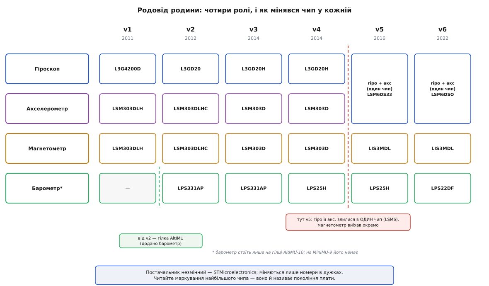

# 📜 Родовід чипів: чому ST раз у раз перекроювала начинку

Візьміть три плати Pololu з полиці — MinIMU-9 v3, v5 і v6 — і покладіть поряд. Формат той самий, обв'язка та сама, місце під гребінку те саме. А от найбільші мікросхеми на них — геть різні, з різними написами, різною кількістю ніжок, різними внутрішніми регістрами. Ось цей парадокс — «плата та сама, кремній інший» — і є головна загадка родини. Pololu ніколи не міняла свою карту з примхи: карту вона тримала якнайдовше незмінною, а міняла її щоразу тому, що **під нею мінявся ринок інерційних чипів ST**. Кожне покоління плати — це чесний відбиток того, який давач у ST був на той рік найкращим.

Тому історія родини — це насправді історія кремнію під нею. Розберімо її покоління за поколінням, з конкретними партномерами й датами, а тоді відповімо на єдине питання, яке за всім цим стоїть: **навіщо STMicroelectronics раз у раз кидала одну лінійку давачів і переходила на іншу** — і що це щоразу означало для того, хто плату тримав у руках і писав під неї код.

> 🔧 **Навіщо це.** Практична вигода від цього родоводу дуже приземлена. Ви натрапляєте на плату з написом «LSM303D» у чужому проєкті, або на форумі радять «візьми приклад для L3GD20» — і без родоводу ці літери нічого не кажуть. А з ним ви миттю розумієте: це інерціал покоління v3, окремий гіроскоп і окремий «акселерометр+магнетометр», приклади під нього шукати серед старих. Знання лінійки перетворює загадковий рядок партномера на точну координату в часі.

## Звідки взялася сама ідея карти

Щоб зрозуміти, чому чипи мінялися так часто, треба спершу відчути, з чим Pololu мала справу. На зламі 2000-х і 2010-х MEMS-давачі (англ. *micro-electro-mechanical systems* — мікроелектромеханічні системи) щойно подешевшали настільки, що гіроскоп чи акселерометр перестали бути коштовною екзотикою й почали з'являтися в кожному телефоні. STMicroelectronics — франко-італійська компанія, один зі світових лідерів у цих давачах — випускала їх десятками, і кожні кілька кварталів на світ виходив новий, тихіший, точніший, дешевший.

Але всі ці чудові чипи мали одну спільну ваду для аматора й інженера-прототипувальника: їх фізично неможливо взяти в руки. Корпус два-три міліметри, контактні майданчики під днищем із кроком 0.5 мм, живлення суворо 3.3 вольта, потрібні зовнішні деталі. Pololu — американська компанія з Лас-Вегаса, що виросла на робототехнічних дрібницях, — побачила тут просту нішу: узяти найкращий на цей місяць інерційний чип ST і **посадити його на карту** (англ. *carrier* — тримач). Розпаяти на заводі, додати регулятор, зсувачі рівнів, вивести все на гребінку з кроком 2.54 мм — і віддати людині деталь, з якою вона реально попрацює на столі.

І тут криється причина всієї подальшої мінливості. Карта — це **обгортка навколо чужого кремнію**. Поки ST випускала новий, кращий інерціал, Pololu була змушена переспівувати свою карту під нього: лишити обгортку, замінити начинку. Родина живе з того самого 2011 року й досі саме тому, що ST за ці роки жодного разу не зупинилася.

## Перше покоління: два чипи на дев'ять осей (2011)

Найперша MinIMU-9 — та, що без номера версії, — вийшла близько 2011 року й задала лекало всій родині. Дев'ять осей вона збирала з **двох** мікросхем ST:

```
Гіроскоп:              L3G4200D    (3 осі кутової швидкості)
Акселерометр + магн.:  LSM303DLH   (3 осі прискорення + 3 осі поля)
```

Уже тут видно поділ, що протримається чотири покоління: **гіроскоп окремо, а акселерометр із магнетометром — разом**, в одному кристалі серії LSM303. Чому саме так? Бо на той момент ST так свої чипи й компонувала. Гіроскоп L3G4200D був самостійним виробом, а LSM303 — популярною «електронною платівкою компаса з нахилом», де магнітне поле й прискорення жили в одному корпусі, бо їх часто й вимірювали разом (класичний нахилокомпенсований компас). Pololu просто взяла дві найкращі ST-цеглинки, що покривали потрібні дев'ять осей, і склала їх на карту.

Барометра тут ще не було — MinIMU-9 першого покоління давала рівно дев'ять інерційних осей, і жодної гілки «з висотоміром» ще не існувало.

> Доказовість: **підтверджено**. Партномери L3G4200D + LSM303DLH стоять просто в назві товару на сторінці Pololu (product 1264), там же — статус «знято з виробництва, замінено на MinIMU-9 v2». Точний місяць релізу Pololu на сторінці не наводить; непряма прив'язка — бібліотека LSM303 із підтримкою цього чипа з'явилася в грудні 2011-го, тож апаратно плата була вже в обігу того року. Тому «2011» тут — **обґрунтована оцінка** за слідами бібліотек, а не офіційна дата з блогу.

## Друге покоління: тихіший гіроскоп і поява висотоміра (2012)

MinIMU-9 **v2** з'явилася 2012 року й лишила поділ незмінним — знову два чипи, — але **обидва оновила** на новіше покоління тих самих ліній ST:

```
Гіроскоп:              L3GD20      (тихіший, стійкіший до вібрації за L3G4200D)
Акселерометр + магн.:  LSM303DLHC  (ширший діапазон, краща роздільність поля)
```

Причина оновлення — рівно та, що потім повторюватиметься щоразу: ST випустила кращі версії обох чипів. Новий гіроскоп L3GD20 менше «чув» звук і вібрацію (стара MEMS-механіка мала прикру звичку відгукуватися на акустичний шум — свист двигуна збивав покази), а новий LSM303DLHC давав ширший діапазон прискорення й точніший компас. Плата ще й стала на чверть меншою. Ціна цього поступу — нові чипи мали інші адреси на шині I²C, тож старий код під v1 просто так не заводився.

Саме до цього покоління прив'язана перша поява **другої гілки родини**. Разом із інерціалом v2 Pololu випустила й **AltIMU-10** — ту саму карту, але з доданим четвертим чипом, барометром:

```
Барометр:              LPS331AP    (тиск → висота над рівнем моря)
```

Так родина розділилася навпіл — на дев'ятиосьову MinIMU-9 і десятиосьову (за традицією підрахунку) AltIMU-10. Ідея «Alt» проста: інерційні давачі знають, ЯК тіло повернуте й куди пришвидшується, але не знають, на якій воно **висоті**. Барометр цю прогалину закриває, і саме тому AltIMU-10 стала платою для всього літального.

> Доказовість: **підтверджено з застереженням щодо дати**. Партномери v2 (L3GD20 + LSM303DLHC) — у назві товару Pololu (product 1268); склад першого AltIMU-10 (L3GD20 + LSM303DLHC + LPS331AP) — у назві product 1269, зі статусом «замінено на v4». Прив'язку «2012» дає історія бібліотеки AHRS: підтримку MinIMU-9 v2 додали у версії 1.2.0 6 липня 2012 року. Отже, апаратно v2 вийшла приблизно тоді ж — **сильна непряма оцінка**, а не дата з офіційного анонсу.

## Третє й четверте покоління: той самий інерціал, кращий висотомір (2014)

Тут родовід стає особливо повчальним, бо показує тонку різницю між «оновили начинку» й «переставили лише один чип».

**v3** вийшла 17 березня 2014 року (це вже точна дата — з блогу Pololu) і знову оновила **обидва інерційні чипи** на найновіші тодішні лінії ST:

```
Гіроскоп:              L3GD20H     (ще тихіший, ще ощадливіший за струмом)
Акселерометр + магн.:  LSM303D     (ширший діапазон поля, точніший і стабільніший гіро… власне акс.)
Барометр (AltIMU-10):  LPS331AP    (поки той самий, що на v2)
```

Головний зиск v3 — нижче споживання, стабільніший гіроскоп і ширший діапазон компаса. І саме тут Pololu вперше додала окремий вивід **SA0** для зсуву I²C-адрес, щоб дві однакові плати можна було повісити на одну шину, не сплутавши.

А тепер тонкість. **v4** — це, по суті, **не нове покоління інерціалу взагалі**. AltIMU-10 v4 несе **той самий** L3GD20H і **той самий** LSM303D, що й v3. Змінилася рівно одна мікросхема — **барометр**:

```
Барометр:              LPS25H      замість LPS331AP  (краща точність, менший шум)
```

Тобто v4 — це v3 із перевзутим висотоміром, і тільки. Чому Pololu взагалі підвищила номер версії заради однієї заміни? Бо для покупця важить весь склад плати: людина, що бере AltIMU-10, купує саме барометр як частину пакета, і чесно назвати новий склад новою версією — простіше, ніж пояснювати, що «інерціал старий, а тиск новий». Показово, що на гілці MinIMU-9 (де барометра немає) окремої v4 фактично й не було потреби виділяти — мінятися там не було чому.

> Доказовість: **підтверджено, дата v3 точна**. Реліз v3 (17.03.2014) — з блогу Pololu «New products: MinIMU-9 and AltIMU-10 v3». Тотожність інерціалу v3 і v4 та заміну барометра LPS331AP → LPS25H прямо стверджує сторінка AltIMU-10 v4 (product 2470): «той самий L3GD20H і LSM303D, що на v3… новіший барометр LPS25H, точніший і тихіший за LPS331AP». Прив'язку «2014» до v4 підпирає й історія бібліотеки LPS: підтримку LPS25H додали 3 червня 2014-го.

## П'яте покоління: великий перелом — гіро й акселерометр в одному чипі (2016)

Ось точка, заради якої цей родовід і варто читати. Досі кожне оновлення було «те саме, але новіше»: гіроскоп окремо, акселерометр із магнетометром разом. **v5**, що вийшла 4 лютого 2016 року, вперше **перекроїла сам поділ функцій** — не просто замінила чипи, а перетасувала, який чип за що відповідає:

```
Гіроскоп + акселерометр:  LSM6DS33   ← ОБИДВА в одному кристалі
Магнетометр:              LIS3MDL    ← виїхав окремо
Барометр (AltIMU-10):     LPS25H     (той самий, що на v4)
```

Порівняйте зі старим поділом — і побачите, що межі провели по-новому. Раніше в одному корпусі жили **акселерометр і магнетометр** (LSM303), а гіроскоп сидів окремо (L3G). Тепер в одному корпусі — **гіроскоп і акселерометр** (LSM6DS33), а магнетометр вигнали в окремий кристал (LIS3MDL). Функції ті самі, дев'ять осей ті самі, але «шви» між чипами пройшли інакше.

Це не забаганка Pololu, а віддзеркалення глибокого зсуву в самій ST. Компанія випустила лінійку **iNEMO** — «модуль інерційного вимірювання в одному корпусі», де гіроскоп і акселерометр зроблено як **системний пакет** (англ. *system-in-package*). І в цьому є груба фізична логіка, яку варто розжувати.

Гіроскоп і акселерометр роблять **з тієї самої MEMS-механіки** — крихітні кремнієві масики на пружних підвісах, що зміщуються від сили. Прискорення зсуває масу прямо; обертання зсуває її через силу Коріоліса. Технологія травлення, корпусування, та сама CMOS-обв'язка для зчитування — по суті **спільні**. Тримати їх на одному кристалі природно: та сама фабрика, той самий процес, менше корпусів. А от магнетометр — **інша фізика**: він міряє магнітне поле магніторезистивними елементами, це окрема плівкова технологія, яку до MEMS-масиків не приклеїш дешево. Тому історично магнетометр і клали то з акселерометром (бо компас із нахилом зручний), то окремо — і коли ST навчилася класти шість «рухових» осей в один тихий кристал, окремий магнетометр став логічним рішенням.

```
Стара логіка (v1–v4):   [ гіро ] + [ акс + магн ]      ← два чипи, шов між рухом і полем
Нова логіка (v5+):      [ гіро + акс ] + [ магн ]       ← два чипи, шов між рухом і полем інакше
```

Ефект для того, хто плату тримає: **дев'ять осей тепер збираються з двох інших чипів**, з іншими регістрами, іншими адресами, іншим порядком байтів. Плата лишилася сумісною за виводами зі старою (те саме місце, ті самі піни живлення й шини), але **код під v3/v4 на v5 не заведеться** — його треба переписати під LSM6DS33 і LIS3MDL. Це класична пастка: апаратно нова плата стає на місце старої, а прошивка мовчки не працює, бо всередині геть інший кремній.

> Доказовість: **підтверджено, дата точна**. Реліз v5 (04.02.2016) і склад (LSM6DS33 + LIS3MDL, на AltIMU-10 ще LPS25H) — з блогу Pololu «New products: MinIMU-9 and AltIMU-10 v5 IMU boards». Там же прямо: «нові версії сумісні за виводами з попередніми, але код під старі версії доведеться змінити, бо змінилися мікросхеми». Що LSM6DS33 — це iNEMO-пакет «3D-акселерометр + 3D-гіроскоп в одному корпусі», підтверджує документація ST. Прив'язку до 2016-го дублює й історія бібліотеки LSM6: перший реліз (підтримка LSM6DS33) — 19 січня 2016-го.

## Шосте покоління: той самий крій, тихіший кремній (2022)

Після великого перелому v5 родина знайшла форму, яку тримає й досі. **v6** нічого не перекроює — вона лишає новий поділ («шість рухових осей в одному чипі + магнетометр окремо») недоторканим і просто ставить **новіші, тихіші** мікросхеми на ті самі ролі:

```
Гіроскоп + акселерометр:  LSM6DSO    замість LSM6DS33  (менший шум, вища гранична частота гіро)
Магнетометр:              LIS3MDL    (той самий — його не було сенсу міняти)
Барометр (AltIMU-10):     LPS22DF    замість LPS25H     (точніший, тихіший, набагато вища частота)
```

Логіка тут уже знайома: ST випустила наступника iNEMO-модуля — **LSM6DSO**, з нижчим шумом і вищою максимальною частотою виводу гіроскопа, — і Pololu перевзула плату під нього. Магнетометр LIS3MDL лишили як був: він і на v5 добре справлявся, а окремого стимулу міняти саме його не з'явилося. На гілці AltIMU-10 заразом оновили й барометр — з LPS25H на LPS22DF, теж заради меншого шуму й помітно вищої частоти виводу.

Найприємніше в v6 — м'якість переходу. Оскільки поділ функцій той самий, що на v5, і чипи спорідненого сімейства (LSM6DSO — прямий наступник LSM6DS33), Pololu змогла зробити **одну бібліотеку**, що охоплює обидва інерційні чипи й сама впізнає, який перед нею за регістром ідентифікації. Тому код під v5 часто заводиться на v6 майже без правок — на відміну від стрибка v4→v5, де довелося переписувати все.

> Доказовість: **склад підтверджено, дата — обґрунтована оцінка**. Партномери v6 (LSM6DSO + LIS3MDL, на AltIMU-10 ще LPS22DF) стоять у назвах товарів Pololu (product 2862 і 2863), зі статусом «активний, рекомендований». Що LSM6DSO дає «менший шум і вищу граничну частоту гіро» проти LSM6DS33 — прямо на сторінці v6. Окремого блогу-анонсу з датою для v6 Pololu, схоже, не публікувала (на сторінці «On the blog (0)»), тож рік беремо за слідами бібліотек: підтримку LSM6DSO додано у бібліотеку LSM6 2 вересня 2022-го, а LPS22DF — у бібліотеку LPS 8 червня 2023-го. Отже, апаратно v6 з'явилася приблизно у 2022-му (гілка MinIMU-9) з дозріванням гілки AltIMU-10 до 2023-го — **сильна непряма прив'язка**, а не офіційна дата.

Зведімо весь родовід в одну картину — хто кого замінив у кожній із чотирьох ролей:


*Постачальник незмінний — усі чипи від STMicroelectronics; міняються лише номери в дужках. Зелений пунктир (між v1 і v2) — поява гілки AltIMU-10 з барометром. Червоний пунктир (між v4 і v5) — перелом, коли гіроскоп і акселерометр злилися в один чип LSM6, а магнетометр виїхав окремо. Дати v3 і v5 — точні (блог Pololu); решта — оцінки за слідами бібліотек.*

## То навіщо ж ST усе це робила

Тепер, коли лінійка розкладена, видно, що за всіма замінами стоять не примхи, а три чіткі, раз у раз повторювані причини. Кожна заміна чипа — це одна з них або їхня суміш.

**Причина перша — тихіші MEMS.** Це наскрізний мотив усього родоводу. Ранні MEMS-гіроскопи мали негарну звичку відгукуватися на звук і вібрацію: механічний резонатор усередині «чув» акустику, і свист двигуна чи гудіння корпусу підмішувалися в покази кутової швидкості. Кожне нове покоління ST давало **менший шум і кращу стійкість до вібрації** — саме це вело від L3G4200D до L3GD20, далі до L3GD20H, а потім і всередині iNEMO від LSM6DS33 до LSM6DSO. Для інерціалу шум — ворог номер один: із нього росте дрейф кута, і що тихіший давач, то довше оцінка орієнтації тримається чесною, поки її не поправить [поєднання давачів](root:com-signal/sensor-fusion).

**Причина друга — консолідація: менше чипів на ту саму функцію.** Це те, що вибухнуло у v5. Тримати гіроскоп і акселерометр окремими кристалами — марнотратно, коли їх роблять з тієї самої механіки. Злиття їх в один корпус (iNEMO) дає менший розмір, простішу розводку, дешевше виробництво і, що важливо для інерціалу, **кращу синхронність**: обидва давачі тактуються з одного джерела, тож їхні відліки точно збігаються в часі — а для злиття даних фільтром це просто подарунок. Магнетометр при цьому чесно виносять окремо, бо його плівкову фізику до MEMS-масиків дешево не приклеїш.

**Причина третя — вищі частоти виводу.** Що швидший об'єкт, то частіше треба питати давач, інакше рух «розмажеться» між відліками. Дрон, що різко кренить, стабілізатор камери, що ловить тремтіння руки, — усім їм потрібні сотні, а то й тисячі відліків на секунду. Новіші чипи ST раз у раз піднімали **максимальну частоту виводу** (англ. *output data rate*, ODR): і LSM6DSO проти LSM6DS33, і барометр LPS22DF проти LPS25H виграють саме тут. Вища частота — це можливість керувати швидшим об'єктом, не «сліпнучи» між вимірами.

```
Що гнало кожну заміну чипа:
  тихіші MEMS      → менший дрейф кута, стійкість до вібрації й звуку
  консолідація     → менше корпусів, краща синхронність гіро й акс.
  вищі частоти ODR → керування швидшим рухом без «розмазування»
```

І над усіма трьома — четверта, комерційна: ринкова конкуренція штовхала ST **щоразу давати більше за ті самі або менші гроші**. Pololu цим просто користувалася: щойно ST випускала кращий інерціал, Pololu переспівувала карту й пропонувала, за її ж словами про v5, «кращі характеристики за нижчою ціною». Ось чому родина не завмерла на якійсь одній «остаточній» версії — бо кремній під нею не завмирав ніколи.

## Що цей родовід означає на практиці

За всією хронологією стоїть один простий, дуже приземлений наслідок, заради якого її й варто тримати в голові: **у цій родині назва версії — це не косметика, а точна вказівка, який кремній усередині**. Дві плати з однаковим написом «MinIMU-9», але різними номерами версій — це буквально різні мікросхеми з різними регістрами. Тому перше, що робиш, беручи до рук незнайому плату родини: читаєш **дужки в її повній назві** (Pololu завжди чесно перелічує чипи) або маркування на найбільшому кристалі — і за цим партномером точно знаєш покоління, а отже, яку бібліотеку й документацію брати.

Другий наслідок — про сумісність, і він двоякий. **За виводами** Pololu тримає покоління сумісними: нова плата апаратно стає на місце старої, ті самі піни, те саме місце. Але **за кодом** сумісність рветься там, де міняються чипи — а надто на переломі v4→v5, де перекроїли самий поділ функцій. Тому «поставив нову плату замість старої, і воно поїхало» справджується лише для живлення й механіки; прошивку майже завжди доводиться бодай підправити, а через великий перелом — і переписати. Єдиний острівець спокою — пара v5↔v6, яку Pololu свідомо накрила однією бібліотекою, тож там перехід найм'якший.

І третій, найзагальніший. Ця родина — маленький, але чесний портрет того, як узагалі влаштований прогрес у давачах: **обгортка (карта) живе довго й майже не змінюється, а всередині раз у раз оновлюється чужий кремній**, ідучи за трьома вічними бажаннями інженера — щоб було тихіше, компактніше і швидше. Хто цю логіку відчув на Pololu, той упізнає її потім усюди — у будь-якій платі-носії навколо будь-якого чипа, що дозріває швидше за плату під ним.
