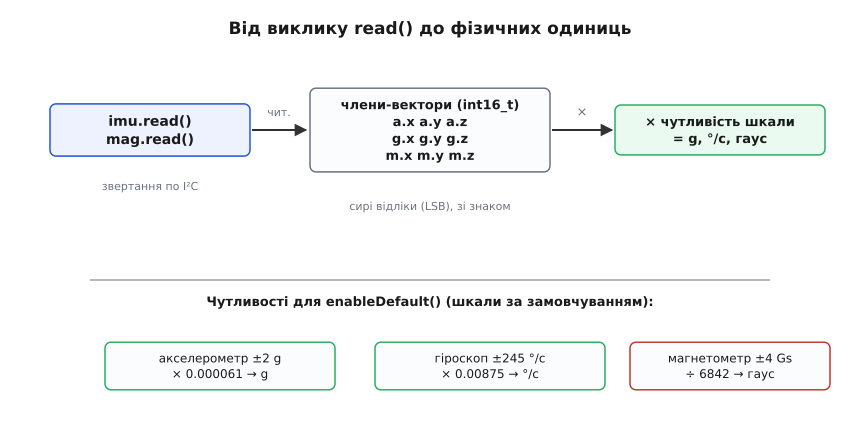

# ⚙️ Дев'ять осей у коді: бібліотеки LSM6 і LIS3MDL, від сирих відліків до g, °/с і гаусів

<preknowlist>
- [Шина I²C](root:com-devices/i2c) — дві лінії SCL/SDA, 7-бітна адреса, ACK/NACK, підтяжки до плюса; на цьому стоїть і `init()`, і будь-яке читання регістрів.
- [Цілі типи C](root:sf-lang/integer-types-c) — `int16_t` як 16-бітне ціле зі знаком (−32768…32767); чому вісь може бути від'ємною й що станеться, поклавши її в `uint16_t`.
</preknowlist>

Плата під'єднана чотирма дротами, живлення є, на шині вона відгукується — а далі порожнеча: числа треба ще дістати. І тут легко зробити зайву роботу. Можна писати в кожен керувальний регістр вручну, склеювати байти, пам'ятати, що акселерометр починається з `0x28`, а гіроскоп з `0x22`, — і на кожній із дев'яти осей мати шанс переплутати зсув чи знак. А можна взяти дві готові бібліотеки від самого Pololu, які роблять цю чорну роботу за тебе: `LSM6` для акселерометра з гіроскопом і `LIS3MDL` для магнетометра. Тоді весь код зводиться до трьох дій на кожен чип — знайти, увімкнути, прочитати — і до одного множення, щоб перевести сире число у фізику.

Обманлива короткість тут така сама, як завжди з бібліотеками: `imu.read()` виглядає як одна невинна стрічка, але мовчки припускає, що ти **не переплутав, який об'єкт відповідає за який чип**, **не забув `enableDefault()`**, **не сплутав сирі відліки з джі** і що **шина взагалі жива** (підтяжки на місці). Не так — і замість руху отримаєш нулі, сталу тисячу чи −1 на всіх осях. Тож пройдімо весь шлях по-справжньому, реальним C++ під Arduino-ядро (він однаково збирається під класичну Arduino й під ESP32), а не псевдокодом «для ілюстрації».

Три задачі підряд, кожна відповідає на одне питання першого вечора:

1. **Як прочитати шість осей руху** — акселерометр і гіроскоп через `LSM6`.
2. **Як додати три осі поля** — магнетометр через `LIS3MDL`, і чому це окремий об'єкт.
3. **Як перевести сирі відліки у g, °/с і гауси** — одне множення на чутливість, звідки беруться числа.

А наприкінці — розбір п'яти пасток, що дають майже всі скарги «читаю, а маячня»: переплутані об'єкти чипів, забутий `enableDefault()`, сире замість фізичного, `int16_t` проти `uint16_t` і мертва шина без підтяжок.

## Задача 1: шість осей руху — об'єкт `LSM6`

Почнімо з мікросхеми, заради якої модуль і купують, — LSM6DS33, тривісний акселерометр плюс тривісний гіроскоп в одному корпусі. Бібліотека `LSM6` обгортає її так, що вся розмова з чипом ховається за трьома методами.

### Ідея: знайти чип, увімкнути давачі, читати вектори

Модель роботи гранично проста. Ти створюєш **один об'єкт** класу `LSM6` — він представляє мікросхему. Тоді викликаєш три речі по черзі, і кожна знімає окреме питання:

- **`init()`** — знаходить чип на шині. Метод сам пробує обидві можливі адреси (`0x6B` за замовчуванням і `0x6A`, якщо SA0 притягнутий до землі), читає регістр упізнання `WHO_AM_I` і, упізнавши LSM6DS33, запам'ятовує адресу всередині. Повертає `true`, якщо давач знайдено, і `false`, якщо на шині його немає. Це твій єдиний чесний спосіб зрозуміти, чи взагалі під'єднано залізо, — тому результат **обов'язково перевіряють**.
- **`enableDefault()`** — вмикає обидва давачі з розумними налаштуваннями за замовчуванням. Після подачі живлення чип **спить**: акселерометр і гіроскоп вимкнені, читання дасть сталі нулі. Цей виклик прописує в керувальні регістри частоту вимірів і повну шкалу (±2 g для акселерометра, ±245 °/с для гіроскопа) — і давачі починають міряти. Забути його — найпопулярніша причина «одні нулі» (пастка 2).
- **`read()`** — зчитує свіжі виміри обох давачів однією операцією й кладе їх у два **вектори-члени** об'єкта: `a` (акселерометр) і `g` (гіроскоп). Після виклику дані доступні як `imu.a.x`, `imu.a.y`, `imu.a.z` і `imu.g.x`, `imu.g.y`, `imu.g.z` — сирі 16-бітні цілі зі знаком.

Отут ключова тонкість, яка вбиває чи не половину перших спроб: `a` і `g` — це **сирі відліки** (англ. *raw counts*, LSB), а не джі й не градуси за секунду. `imu.a.z` у спокої покаже щось близько 16384, а не «1.0». Число саме собою фізичного змісту не має, доки його не помножиш на чутливість (задача 3). Бібліотека навмисно віддає сирі відліки: вони точні (ціле, без втрат на float), і перевести їх у будь-які одиниці — твоє рішення.

> 🔧 **Навіщо це.** `init()` не забаганка ввічливості, а безкоштовний детектор «а чи є взагалі чип». Якщо він повернув `false`, проблема не в решті коду — вона нижче: дроти, живлення, адреса, підтяжки. Перевіряючи його результат і зупиняючись на `false`, ти economиш вечір: не шукаєш баг у формулах переведення, коли байти фізично не доходять до плати.

### Робочий скетч: шість осей у термінал

:::tabs
```cpp
#include <Wire.h>
#include <LSM6.h>

LSM6 imu;                       // об'єкт = мікросхема LSM6DS33

void setup() {
  Serial.begin(9600);
  Wire.begin();                 // на ESP32/STM32/Pico задай свої ніжки: Wire.begin(21, 22);

  if (!imu.init()) {            // знайти чип; false = його на шині немає
    Serial.println("LSM6DS33 не знайдено — перевір дроти, живлення, підтяжки");
    while (1);                  // далі немає сенсу — зупиняємось
  }
  imu.enableDefault();         // увімкнути акселерометр (±2 g) і гіроскоп (±245 °/с)
}

void loop() {
  imu.read();                  // оновити a.x/a.y/a.z та g.x/g.y/g.z

  char buf[64];
  // %6d — шестизнакове поле, щоб стовпчики не «стрибали»
  snprintf(buf, sizeof(buf), "A: %6d %6d %6d   G: %6d %6d %6d",
           imu.a.x, imu.a.y, imu.a.z,
           imu.g.x, imu.g.y, imu.g.z);
  Serial.println(buf);

  delay(100);                  // 10 разів на секунду — вистачить, щоб дивитись очима
}
```
```micropython
from machine import I2C, Pin
import struct, time

ADDR = 0x6B                     # адреса LSM6DS33 (0x6A, якщо SA0 до землі)
WHO_AM_I, CTRL1_XL, CTRL2_G, OUTX_L_G = 0x0F, 0x10, 0x11, 0x22

i2c = I2C(0, scl=Pin(22), sda=Pin(21))   # підніми свою шину зі своїми ніжками

def init():                     # знайти чип; False = його на шині немає
    return ADDR in i2c.scan() and i2c.readfrom_mem(ADDR, WHO_AM_I, 1)[0] == 0x69

def enable_default():           # акселерометр (±2 g) і гіроскоп (±245 °/с)
    i2c.writeto_mem(ADDR, CTRL1_XL, b'\x80')   # 1.66 кГц, ±2 g
    i2c.writeto_mem(ADDR, CTRL2_G,  b'\x80')   # 1.66 кГц, ±245 °/с

def read():                     # свіжі виміри обох давачів; вертає (g, a) як int16
    raw = i2c.readfrom_mem(ADDR, OUTX_L_G | 0x80, 12)  # гіро + аксель, 6 int16 LE
    return struct.unpack('<6h', raw)           # gx,gy,gz, ax,ay,az

if not init():                  # знайти чип; False = його на шині немає
    raise SystemExit("LSM6DS33 не знайдено — перевір дроти, живлення, підтяжки")
enable_default()                # увімкнути акселерометр і гіроскоп

while True:
    gx, gy, gz, ax, ay, az = read()  # оновити відліки руху
    # {:6d} — шестизнакове поле, щоб стовпчики не «стрибали»
    print("A: {:6d} {:6d} {:6d}   G: {:6d} {:6d} {:6d}".format(ax, ay, az, gx, gy, gz))
    time.sleep_ms(100)          # 10 разів на секунду — вистачить, щоб дивитись очима
```
:::

Залий, відкрий термінал на 9600 — і поповзуть шість чисел. Полеж плату рівно на столі: у стовпчику `A` два числа будуть близькі до нуля, а одне (та вісь, що дивиться вгору) — близько ±16384; це на неї тисне земне тяжіння. Похитай плату — акселерометр заворушиться. Крутни її на місці — заворушиться гіроскоп у стовпчику `G`, а в спокої його числа повернуться майже до нуля (з дрібним ненульовим «сидінням» — це нормальний зсув, який калібрують окремо).

Кілька моментів, які варто зрозуміти, а не просто скопіювати.

**Чому `Wire.begin()` окремим рядком.** Бібліотека `LSM6` розмовляє з чипом через стандартну шину `Wire`, але **сама її не піднімає з потрібними ніжками**. На класичній Arduino (UNO/Nano) I²C прибитий до `A4`=SDA, `A5`=SCL — досить `Wire.begin()` без аргументів. На ESP32/STM32/Pico ніжки задаєш ти: `Wire.begin(SDA, SCL)` **перед** `imu.init()`, інакше `init()` шукатиме чип на дефолтних виводах ядра й нічого не знайде. Це та сама пастка «спершу підніми свою шину», що ловить усіх на I²C-периферії.

**Чому `while(1)` після невдалого `init()`.** Якщо чип не знайдено, немає сенсу крутити `loop()` і читати сміття. Зупинка на місці з чітким повідомленням у терміналі — це діагностика: ти одразу бачиш, що проблема на рівні «залізо не відповідає», а не в математиці. У реальному пристрої замість `while(1)` тут була б спроба переініціалізації чи сигнал помилки, але для налагодження зупинка найчесніша.

**Чому `snprintf`, а не купа `Serial.print`.** Форматований рядок фіксованої ширини (`%6d`) вирівнює стовпці — числа не «стрибають» ліворуч-праворуч, коли одне стало тризначним, а сусіднє чотиризначним. З десятком окремих `Serial.print(imu.a.x); Serial.print(" ");` те саме виходить, але читати рухомий стовпчик значно важче. Це дрібниця, але саме вона робить термінал придатним для «дивитись очима, чи все живе».

Якщо тобі потрібен лише один давач із двох, є вужчі методи: `imu.readAcc()` оновлює тільки вектор `a`, `imu.readGyro()` — тільки `g`. `read()` робить обидва за одну транзакцію й на практиці зручніший, бо на MinIMU-9 акселерометр і гіроскоп однаково потрібні майже завжди.

## Задача 2: три осі поля — окремий об'єкт `LIS3MDL`

Дев'ята вісь — магнітне поле, і тут перша концептуальна пастка: магнетометр **це інша мікросхема**. LSM6DS33 не має магнетометра взагалі; за поле відповідає окремий кристал LIS3MDL зі **своєю адресою** (`0x1E`, або `0x1C` при SA0 до землі) і **своєю бібліотекою** `LIS3MDL`. Тому й об'єкт — окремий, і плутати їхні члени не можна (це пастка 1, найпідступніша).

### Ідея: та сама трійка методів, але свій об'єкт і свій вектор

Механіка дзеркальна до `LSM6`, і це навмисно — Pololu тримає бібліотеки однаковими на дотик:

- **`init()`** — знаходить LIS3MDL на шині (пробує обидві адреси), перевіряє `WHO_AM_I`, повертає `true`/`false`.
- **`enableDefault()`** — вмикає магнетометр із налаштуваннями за замовчуванням: режим найвищої якості на всіх осях, частота 10 Гц, повна шкала **±4 гауси**.
- **`read()`** — зчитує поле й кладе у **вектор-член `m`**: `mag.m.x`, `mag.m.y`, `mag.m.z`, знову сирі 16-бітні цілі зі знаком.

Зверни увагу на назву вектора: у магнетометра він `m` (magnetometer), не `a` і не `g`. Три бібліотеки — три різні члени: `a`/`g` в об'єкті LSM6, `m` в об'єкті LIS3MDL. Плутанина «читаю `imu.m.x`» або «читаю `mag.a.x`» просто не збереться (такого члена немає) — а от прочитати не з того **об'єкта** легко, і компілятор тебе не спинить.

### Робочий скетч: дев'ять осей разом

Тепер зіллємо все — обидва чипи, дев'ять осей — в одну програму. Обидва об'єкти живуть на **тій самій шині I²C** (одні дроти SCL/SDA), просто мають різні адреси, тож звертаються по черзі й не заважають один одному.

:::tabs
```cpp
#include <Wire.h>
#include <LSM6.h>
#include <LIS3MDL.h>

LSM6    imu;                    // акселерометр + гіроскоп (0x6B)
LIS3MDL mag;                    // магнетометр            (0x1E)

void setup() {
  Serial.begin(9600);
  Wire.begin();                 // одна шина на обидва чипи (ESP32: Wire.begin(21, 22))

  if (!imu.init()) {
    Serial.println("LSM6DS33 не знайдено");
    while (1);
  }
  imu.enableDefault();

  if (!mag.init()) {
    Serial.println("LIS3MDL не знайдено");
    while (1);
  }
  mag.enableDefault();
}

void loop() {
  imu.read();                   // a.* та g.* — рух
  mag.read();                   // m.*        — поле

  char buf[96];
  snprintf(buf, sizeof(buf),
           "A:%6d %6d %6d  G:%6d %6d %6d  M:%6d %6d %6d",
           imu.a.x, imu.a.y, imu.a.z,
           imu.g.x, imu.g.y, imu.g.z,
           mag.m.x, mag.m.y, mag.m.z);
  Serial.println(buf);

  delay(100);
}
```
```micropython
from machine import I2C, Pin
import struct, time

IMU = 0x6B                      # LSM6DS33: акселерометр + гіроскоп
MAG = 0x1E                      # LIS3MDL:  магнетометр — інший чип, інша адреса

i2c = I2C(0, scl=Pin(22), sda=Pin(21))   # одна шина на обидва чипи

def imu_init():
    return IMU in i2c.scan() and i2c.readfrom_mem(IMU, 0x0F, 1)[0] == 0x69
def imu_enable():               # аксель (±2 g) + гіро (±245 °/с)
    i2c.writeto_mem(IMU, 0x10, b'\x80')
    i2c.writeto_mem(IMU, 0x11, b'\x80')
def imu_read():                 # (gx,gy,gz, ax,ay,az) — рух
    return struct.unpack('<6h', i2c.readfrom_mem(IMU, 0x22 | 0x80, 12))

def mag_init():
    return MAG in i2c.scan() and i2c.readfrom_mem(MAG, 0x0F, 1)[0] == 0x3D
def mag_enable():               # магнетометр: висока якість, 10 Гц, ±4 гауси
    i2c.writeto_mem(MAG, 0x20, b'\x70')
    i2c.writeto_mem(MAG, 0x21, b'\x00')
    i2c.writeto_mem(MAG, 0x22, b'\x00')
    i2c.writeto_mem(MAG, 0x23, b'\x0C')
def mag_read():                 # (mx,my,mz) — поле
    return struct.unpack('<3h', i2c.readfrom_mem(MAG, 0x28 | 0x80, 6))

if not imu_init():
    raise SystemExit("LSM6DS33 не знайдено")
imu_enable()

if not mag_init():
    raise SystemExit("LIS3MDL не знайдено")
mag_enable()

while True:
    gx, gy, gz, ax, ay, az = imu_read()   # a.* та g.* — рух
    mx, my, mz = mag_read()               # m.*        — поле
    print("A:{:6d} {:6d} {:6d}  G:{:6d} {:6d} {:6d}  M:{:6d} {:6d} {:6d}".format(
          ax, ay, az, gx, gy, gz, mx, my, mz))
    time.sleep_ms(100)
```
:::

Дев'ять чисел у рядку — повний портрет руху й орієнтації в сирому вигляді. Піднеси магніт до плати — стовпчик `M` різко змінить числа; прибери — повернуться до фонового земного поля. Це швидка перевірка, що магнетометр живий і не переплутаний з рештою.

Одну важливу річ про **осі** тут треба сказати прямо, бо вона кусає при злитті даних. LSM6DS33 і LIS3MDL — фізично різні кристали, розміщені на платі кожен по-своєму. Тому вісь X магнетометра **не обов'язково дивиться туди ж**, куди вісь X акселерометра. Поки ти просто друкуєш числа — байдуже. Але щойно почнеш рахувати орієнтацію (нахил з акселерометра плюс азимут з магнетометра), доведеться звірити розмітку осей на самій платі й, найпевніше, десь поміняти знак чи переставити осі магнетометра, щоб усі три давачі дивилися в одну систему координат. Бібліотека цього за тебе не робить — вона чесно віддає те, що виміряв кожен чип у своїй власній системі.

> 🔧 **Навіщо це.** Розуміння «це два незалежні чипи на одній шині» рятує від найбезглуздіших багів. Людина бачить один модуль, думає «один давач» — і дивується, чому `imu` нічого не знає про поле, або пише магнітні осі в акселерометрові члени. Тримаючи в голові дві мікросхеми, два об'єкти, два набори членів (`a`/`g` і `m`), ти будуєш код правильно з першого разу, а не ловиш «магнетометр не читається», коли просто звернувся не до того об'єкта.

## Задача 3: сире → фізичне, одне множення на чутливість

Числа поповзли, але вони сирі: `imu.a.z ≈ 16384` замість «1 g», `mag.m.x ≈ 6842` замість «1 гаус». Останній крок — перевести відліки у фізичні одиниці. Це не якийсь алгоритм, а **одне множення** на сталу, що зветься **чутливість** (англ. *sensitivity*) — скільки фізичної величини припадає на один відлік. Уся хитрість лише в тому, щоб узяти правильну сталу під ту повну шкалу, яку виставив `enableDefault()`.

### Ідея: відлік × чутливість = фізика

Давач усередині перетворює аналогову величину на ціле число пропорційно. Пропорція така: повна шкала (наприклад, ±2 g) розкладається на весь діапазон 16-бітного цілого зі знаком (−32768…32767). Тому один відлік «важить» фіксовану порцію фізичної величини, і щоб отримати цю величину, відлік просто множать на цю порцію:

```
фізична величина = сирий_відлік × чутливість
```

Значення чутливості беруть з даташита під **конкретну повну шкалу**. `enableDefault()` у цих бібліотеках виставляє відомі шкали, тож і сталі відомі наперед. Для налаштувань за замовчуванням, які ставить `enableDefault()`:

```
Акселерометр  (±2 g)     : 0.061 мг/LSB   = 0.000061 g на відлік
Гіроскоп      (±245 °/с) : 8.75 мград/с/LSB = 0.00875 °/с на відлік
Магнетометр   (±4 гауси) : 6842 LSB/гаус   → 1/6842 ≈ 0.000146 гаус на відлік
```

Зверни увагу на **два способи запису**, які легко переплутати. Акселерометр і гіроскоп даються як «скільки фізики на один відлік» (множник) — тож множимо. Магнетометр історично дається навпаки — «скільки відліків на один гаус» (6842 LSB/гаус) — тож або ділимо на 6842, або множимо на обернене 1/6842. Це не помилка даташита, а різна традиція для різних давачів; головне — не сплутати напрям (пастка 3).

### Робочий скетч: живі g, °/с і гауси

:::tabs
```cpp
#include <Wire.h>
#include <LSM6.h>
#include <LIS3MDL.h>

LSM6    imu;
LIS3MDL mag;

// Чутливості для налаштувань за замовчуванням enableDefault():
const float ACC_G     = 0.000061f;   // g на відлік        (±2 g)
const float GYRO_DPS  = 0.00875f;    // °/с на відлік      (±245 °/с)
const float MAG_GAUSS = 1.0f / 6842; // гаус на відлік     (±4 гауси)

void setup() {
  Serial.begin(9600);
  Wire.begin();

  if (!imu.init() || !mag.init()) {
    Serial.println("давач не знайдено — перевір I2C");
    while (1);
  }
  imu.enableDefault();
  mag.enableDefault();
}

void loop() {
  imu.read();
  mag.read();

  // сире (int16_t) → фізичне (float), кожну вісь на свою чутливість:
  float ax = imu.a.x * ACC_G,    ay = imu.a.y * ACC_G,    az = imu.a.z * ACC_G;
  float gx = imu.g.x * GYRO_DPS, gy = imu.g.y * GYRO_DPS, gz = imu.g.z * GYRO_DPS;
  float mx = mag.m.x * MAG_GAUSS, my = mag.m.y * MAG_GAUSS, mz = mag.m.z * MAG_GAUSS;

  Serial.print("a[g]: ");
  Serial.print(ax, 2); Serial.print(' ');
  Serial.print(ay, 2); Serial.print(' ');
  Serial.print(az, 2);

  Serial.print("   g[dps]: ");
  Serial.print(gx, 1); Serial.print(' ');
  Serial.print(gy, 1); Serial.print(' ');
  Serial.print(gz, 1);

  Serial.print("   m[Gs]: ");
  Serial.print(mx, 3); Serial.print(' ');
  Serial.print(my, 3); Serial.print(' ');
  Serial.println(mz, 3);

  delay(100);
}
```
```micropython
from machine import I2C, Pin
import struct, time

IMU, MAG = 0x6B, 0x1E
i2c = I2C(0, scl=Pin(22), sda=Pin(21))

# Чутливості для налаштувань за замовчуванням enable_default():
ACC_G     = 0.000061      # g на відлік        (±2 g)
GYRO_DPS  = 0.00875       # °/с на відлік      (±245 °/с)
MAG_GAUSS = 1.0 / 6842    # гаус на відлік     (±4 гауси)

def imu_read():
    return struct.unpack('<6h', i2c.readfrom_mem(IMU, 0x22 | 0x80, 12))
def mag_read():
    return struct.unpack('<3h', i2c.readfrom_mem(MAG, 0x28 | 0x80, 6))

if IMU not in i2c.scan() or MAG not in i2c.scan():
    raise SystemExit("давач не знайдено — перевір I2C")
i2c.writeto_mem(IMU, 0x10, b'\x80'); i2c.writeto_mem(IMU, 0x11, b'\x80')
i2c.writeto_mem(MAG, 0x20, b'\x70'); i2c.writeto_mem(MAG, 0x23, b'\x0C')

while True:
    gx, gy, gz, ax, ay, az = imu_read()
    mx, my, mz = mag_read()

    # сире (int16) → фізичне (float), кожну вісь на свою чутливість:
    ax, ay, az = ax * ACC_G,    ay * ACC_G,    az * ACC_G
    gx, gy, gz = gx * GYRO_DPS, gy * GYRO_DPS, gz * GYRO_DPS
    mx, my, mz = mx * MAG_GAUSS, my * MAG_GAUSS, mz * MAG_GAUSS

    print("a[g]: {:.2f} {:.2f} {:.2f}".format(ax, ay, az), end='')
    print("   g[dps]: {:.1f} {:.1f} {:.1f}".format(gx, gy, gz), end='')
    print("   m[Gs]: {:.3f} {:.3f} {:.3f}".format(mx, my, mz))

    time.sleep_ms(100)
```
:::

Тепер числа читаються як фізика. Плата рівно на столі — вісь, що дивиться вгору, показує близько `1.00` g, дві інші близько `0`; повний вектор прискорення в спокої має довжину рівно 1 g (це земне тяжіння, зручна вбудована перевірка справності). Гіроскоп у спокої — біля `0.0` °/с, при повороті стрибає до десятків-сотень. Магнетометр — десяті долі гауса (земне поле ≈ 0.25–0.65 гауса залежно від місця).

Весь ланцюжок перетворення — три кроки, і жодного складнішого за множення:



*Метод `read()` заповнює вектори-члени сирими 16-бітними цілими; кожну вісь множимо на чутливість, що відповідає шкалі за замовчуванням, — і маємо фізичні одиниці.*

**Приклад: перевірити, що вісь Z справді показує 1 g.** Плата лежить рівно, Z дивиться вгору, шкала ±2 g:

:::tabs
```cpp
int16_t raw = imu.a.z;          // сирий відлік, у спокої ≈ 16384
float   g   = raw * 0.000061f;  // × чутливість ±2 g
// raw = 16384  →  g = 16384 × 0.000061 ≈ 0.9994 ≈ 1.00
```
```micropython
raw = imu_read()[5]             # сирий відлік a.z, у спокої ≈ 16384
g   = raw * 0.000061            # × чутливість ±2 g
# raw = 16384  →  g = 16384 × 0.000061 ≈ 0.9994 ≈ 1.00
```
:::

Число 16384 не випадкове: при чутливості 0.061 мг/LSB одному g відповідає рівно 1/0.000061 ≈ 16384 відліки, тож повна шкала ±2 g лягає точно в ±32768 — увесь діапазон `int16_t`. Ось чому важливо тримати сирі значення саме в **знаковому** типі (пастка 4): половина діапазону — від'ємна (вісь дивиться вниз — прискорення −1 g), і без знака ці −1 g перетворяться на абсурдні 65535-подібні числа.

> 🔧 **Навіщо це.** Розділення «сире окремо, фізичне окремо» — не педантизм. Сирі відліки точні й дешеві: жодного float у гарячому циклі, ідеально для фільтра орієнтації, що крутиться сотні разів на секунду. Множиш на чутливість лише там, де справді треба показати людині або порівняти з фізичним порогом (наприклад, «нахил більше 30°»). Знаючи чутливість своєї шкали, ти вільно ходиш між сирим і фізичним — і не дивуєшся, чому «акселерометр показує шістнадцять тисяч».

## Складність і пастки — п'ять причин «читаю, а маячня»

Тепер найцінніше: конкретні симптоми й що за ними стоїть. Майже всі скарги на ці бібліотеки зводяться до п'яти, і кожну впізнати за виглядом чисел у терміналі за секунди.

**1. Переплутані об'єкти чипів — акселерометрові осі в магнетометрові члени й навпаки.** Найпідступніша, бо код **компілюється** й **щось показує**. Симптом: одна група з дев'яти чисел поводиться «не по-своєму» — магнітні осі не реагують на магніт, зате смикаються від нахилу, або навпаки. Причина — звернення не до того об'єкта: `imu` знає лише `a` і `g` (LSM6DS33), `mag` знає лише `m` (LIS3MDL), це **дві різні мікросхеми з різними адресами**. Помилка типу «взяв поле з `imu`» неможлива буквально (в `imu` немає члена `m`), але «викликав `imu.read()`, а друкую після цього старі `mag.m.*`, забувши `mag.read()`» — цілком реальна: магнітні числа застигнуть. Лік: тримай чітко в голові дві мікросхеми — `imu` (рух, `a`/`g`) і `mag` (поле, `m`) — і оновлюй кожну своїм `read()`.

**2. Одні нулі (або стала, що не ворушиться) — забутий `enableDefault()`.** Класика: `init()` повернув `true` (чип знайдено!), а `read()` дає незмінні нулі чи одне й те саме число, хоч тряси плату. Причина — давач **після живлення спить**, і `init()` його не будить: він лише знаходить чип і запам'ятовує адресу. Прокидається чип від `enableDefault()`, який прописує частоту й шкалу в керувальні регістри. Пропустив цей виклик — давач вимкнений, віддає стале «нічого». Лік очевидний, коли знаєш: після кожного вдалого `init()` став `enableDefault()`. Це стосується **обох** чипів окремо — і `imu`, і `mag`.

**3. Числа є, рухаються, але масштаб абсурдний — сире прийняли за фізичне (або переплутали напрям чутливості).** Дві близькі, але різні хиби.
- **Забули помножити на чутливість.** Друкуєш `imu.a.z` як є й дивуєшся «акселерометр показує 16384 замість 1». Це сирий відлік, не g. Лік: помнож на 0.000061 (для ±2 g). Те саме з гіроскопом (× 0.00875) і магнетометром.
- **Переплутали напрям чутливості магнетометра.** Акселерометр і гіроскоп даються як «фізика на відлік» — множимо. Магнетометр дається як «6842 відліки на гаус» — треба **ділити** на 6842 (або множити на 1/6842). Помножив магнітний відлік на 6842 замість поділити — отримаєш мільйони «гаусів» замість десятих. Лік: для магнетометра `гаус = відлік / 6842`.

**4. На одній осі стрибок до ~65000 замість від'ємного числа — `uint16_t` замість `int16_t`.** Симптом: одна вісь замість плавного переходу через нуль (наприклад, нахилив плату — прискорення пішло з +1 g у −1 g) раптом «перескакує» на ~65535 і повзе вниз. Причина — сирі відліки поклали в **беззнаковий** тип. `a`/`g`/`m` у бібліотеці — `int16_t` (зі знаком, −32768…32767), бо давач чесно віддає від'ємні значення, коли вісь дивиться в протилежний бік. Скопіювавши значення в `uint16_t` чи `unsigned`, ти втрачаєш знак: −1 стає 65535. Лік: тримай сирі значення в `int16_t` (як їх і віддає бібліотека), а на фізичні переводь у `float`, який знак зберігає природно. Це прямо пов'язано з тим, як влаштовані [цілі зі знаком](root:sf-lang/integer-types-c): старший біт — це знак, і беззнакова інтерпретація того ж бітового візерунка дає велике додатне число.

**5. `init()` повертає `false` — мертва або напівжива шина.** Симптом: у терміналі одразу «давач не знайдено», `while(1)` зупинив програму. Це не про код переведення й не про об'єкти — це **фізика шини нижче за бібліотеку**. Причини за спаданням частоти:
- **Немає підтяжок на SCL/SDA.** [Шина I²C](root:com-devices/i2c) працює на відкритому стоці: лінії має хтось підтягувати до плюса резисторами (типово 2.2–10 кОм). Часто підтяжки вже є на боці МК або на самій шині — але якщо на шині немає нічого з підтяжками, лінії «висять», і `init()` не докличеться чипа. Лік: додай підтяжки до 3.3 В на обидві лінії.
- **Шина піднята не на тих ніжках.** На ESP32/STM32/Pico забув `Wire.begin(SDA, SCL)` зі своїми виводами — бібліотека шукає чип на дефолтних ніжках ядра, де його немає. Лік: підніми свою шину **перед** `init()`.
- **Живлення чи дроти.** Немає 3.3/5 В на VIN, переплутані SCL/SDA, холодна пайка. Лік: перевір живлення тестером і контакти; сам `while(1)` із чітким повідомленням уже підказав, що байти не доходять.

Тонкість, специфічна саме для цього модуля: **не подавай 5 В на пін SA0**. Лінії SCL/SDA на платі Pololu захищені зсувачами рівня й терплять п'ятивольтову логіку, а SA0 — прямий вхід тривольтового чипа. П'ять вольтів на ньому — пошкодження. Керуй SA0 лише притяганням до GND (щоб зсунути пару адрес на `0x6A`/`0x1C`) або лишай як є.

## Що варто запам'ятати

Робота з дев'ятьма осями через бібліотеки Pololu — це кілька невеликих звичок, що знімають майже всі проблеми. **Дві мікросхеми — два об'єкти:** `LSM6 imu` тримає рух у членах `a`/`g`, `LIS3MDL mag` тримає поле в члені `m`; вони сидять на одній шині, але це різні чипи з різними адресами, і плутати їх — перше джерело багів. **Трійка методів на кожен чип:** `init()` (знайти й перевірити результат — `false` означає «залізо не відповідає»), `enableDefault()` (розбудити давачі — без нього самі нулі), `read()` (оновити члени свіжими сирими відліками). **Сире окремо, фізичне окремо:** `a`/`g`/`m` — це `int16_t`-відліки, не g і не гауси; фізику дає одне множення на чутливість своєї шкали (0.000061 g, 0.00875 °/с, а для магнетометра — ділення на 6842).

А коли числа поводяться дивно — читай їх як діагностику. Одні нулі кричать «забув `enableDefault()`». Абсурдний масштаб — «не помножив на чутливість» або «переплутав напрям для магнетометра». Стрибок на ~65000 — «поклав знакове в беззнаковий тип». `init()` повернув `false` — «шина нижче не працює: підтяжки, ніжки, живлення». Одна група осей не реагує на своє — «звернувся не до того об'єкта чи забув його `read()`». Упізнавши ці п'ять облич, ти заводиш повний дев'ятивісний модуль за кілька хвилин — і не гадаєш навмання, коли термінал показує «шістнадцять тисяч».
