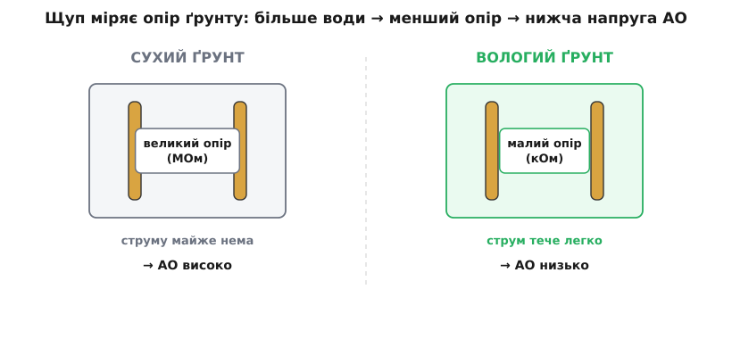
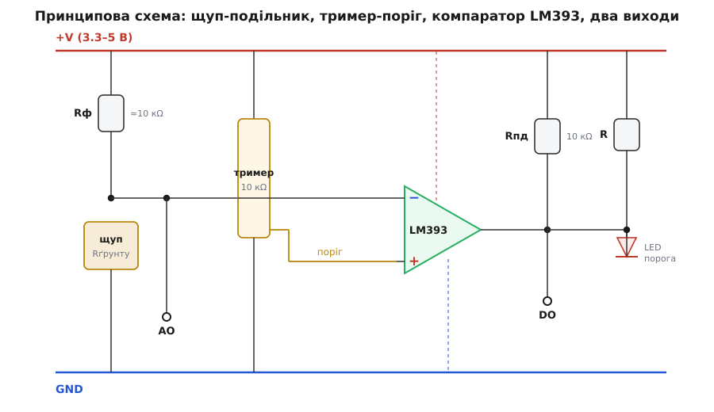
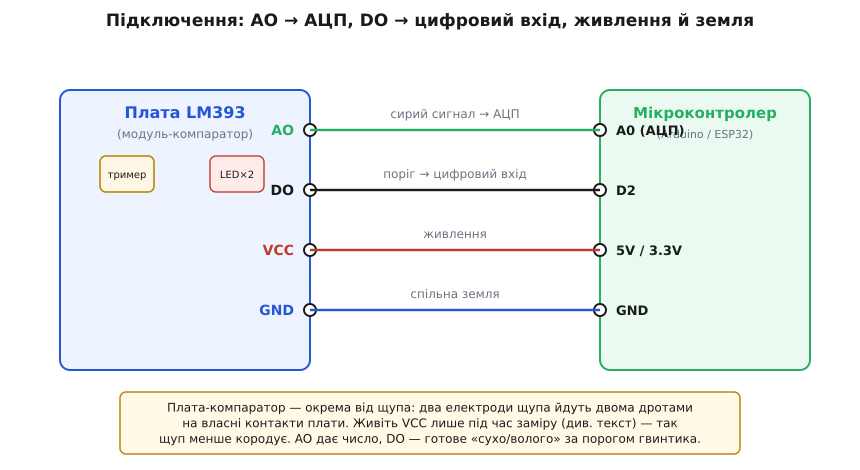

# Давач вологості ґрунту (+LM393)

<preknowlist>
- [Компаратор](root:hw-analog/comparator) — схема, що одним цифровим бітом каже «більше/менше за поріг»; це серце цифрового виходу цього модуля.
- [АЦП](root:hw-analog/adc) — як мікроконтролер перетворює аналогову напругу на число; саме через АЦП читають корисний вихід AO цього давача.
- [Потенціометр](root:hw-components/potentiometer) — подільник напруги з рухомим повзунком; синій гвинтик на платі — це він, ним крутять поріг.
- [Підтяжки](root:hw-digital/floating-pullups) — навіщо лінію тягне вгору резистор і чому вихід із відкритим колектором без підтяжки читається як сміття.
- [Рівні «0» і «1»](root:hw-digital/logic-levels-as-ranges) — що таке логічне «високо» й «низько» як діапазони напруги; від цього залежить, чи прочитає плата цифровий вихід правильно.
- [GPIO](root:hw-digital/gpio) — цифровий вивід мікроконтролера, куди йде вихід DO давача.
- [Закон Ома](root:hw-analog/ohms-law) — напруга = струм · опір; без цього зв'язку не зрозуміти, чому волога в ґрунті перетворюється на напругу.
</preknowlist>

У наборі юного електронника майже завжди лежить дві однакові вилки-гребінці з жовтими доріжками під золото, від них — два дроти на маленьку синю платку з чорною восьминогою мікросхемою **LM393**, синім гвинтиком і парою світлодіодів. Це «давач вологості ґрунту»: те, що встромляють у горщик із квіткою, аби автоматичний поливач сам вирішив, коли пора лити воду, або аби пристрій моргнув, щойно земля пересохла. Коштує копійки, живиться від тих самих кількох вольтів, що й уся аматорська дрібнота, і віддає відповідь навіть двома способами — і числом, і готовим «сухо/волого».

Уся суть цього щупа тримається на одній фізичній думці, і поки її не відчути, покази здаватимуться примхливими: **вологий ґрунт проводить струм краще, ніж сухий**. Щуп нічого не «нюхає» й не міряє воду напряму — він міряє **електричний опір ґрунту між двома своїми пластинами**, а опір цей падає, коли землю змочити. Чому падає, звідки береться число, навіщо гвинтик, чому цей щуп сумнозвісно недовговічний і як подовжити йому життя парою рядків коду — усе прямо випливає з цього єдиного факту. Розберімо річ так, щоб упізнати її серед іншого заліза, під'єднати з першого разу, витягти корисний сигнал і наперед знати, де вона любить підводити.

## Чому волога — це менший опір

Візьмімо суху землю. Це піщинки, глина, крихти органіки — здебільшого діелектрик: вільних носіїв заряду в ній обмаль, тож між двома металевими пластинами, встромленими в сухий ґрунт, струм майже не тече. Опір такого проміжку — величезний, мегаоми й вище.

Тепер полиймо. Ключове не сама вода — чиста дистильована вода теж кепський провідник, — а те, що **ґрунтова волога завжди з розчиненими солями**: рештки добрив, мінерали, іони з самого ґрунту. Молекула солі у воді розпадається на іони (гр. *ión* — той, що йде: заряджена частинка, що мандрує до електрода), і ось ці рухливі іони й переносять заряд від однієї пластини до другої. Що вологіша земля — то більше суцільних водяних містків із розчиненими солями між частинками, то легше йдуть іони, то **менший опір**. Сухий ґрунт розриває ці містки — опір злітає.

Далі працює звичайний [закон Ома](root:hw-analog/ohms-law). Пластини щупа й ґрунт між ними — це просто резистор, чий опір `Rґрунту` міняється з вологістю. Якщо ввімкнути цей резистор у **подільник напруги** з другим, сталим резистором, то напруга в середній точці подільника поповзе за опором ґрунту — тобто за вологістю. Мокра земля (малий `Rґрунту`) дає одну напругу, суха (великий `Rґрунту`) — іншу. Оцю напругу вже легко перетворити на число.


*Щуп — це резистор, зроблений із самого ґрунту. Суха земля майже не проводить (опір у мегаомах), волога з розчиненими солями проводить добре (опір у кілоомах). Увімкнений у подільник, цей мінливий опір перетворює вологість на напругу, яку читає плата.*

> 🔧 **Навіщо це.** Звідси одразу два практичні наслідки. По-перше, давач реагує не на «воду» саму по собі, а на **провідність**, тож на його покази впливає засоленість і добрива: та сама волога у двох різних ґрунтах дасть різні числа. По-друге, це не абсолютний вимірювач вологості у відсотках — це **відносний** прилад: «зараз вологіше чи сухіше, ніж було». Для «полити квітку, коли пересохне» цього досить; для наукового виміру «скільки саме відсотків води в цьому ґрунті» — ні, і жодне калібрування не зробить із нього лабораторний прилад.

## Дві частини: щуп і плата-компаратор

Річ, яку продають як один давач, насправді складається з **двох окремих плат**, з'єднаних дротами, і це варто розуміти, бо кородує з них лише одна.

**Перша — сам щуп.** Це та вилка з двома провідними доріжками (найчастіше з дешевого лудженого міддю текстоліту). Дві доріжки — це дві пластини нашого «ґрунтового резистора»; більше на щупі нічого немає, лише два контакти на виводи. Устромлений у землю, він і є той мінливий опір `Rґрунту`.

**Друга — маленька плата з LM393.** Тут живе вся електроніка: фіксований резистор подільника, синій гвинтик-поріг, компаратор і світлодіоди. До неї щуп під'єднують двома дротами. Саме ця плата перетворює опір ґрунту спершу на напругу, а потім — за бажанням — на готовий цифровий сигнал.

Розділення тут не примха. Кородує в землі тільки щуп — дешева розхідна деталь; розумну плату з мікросхемою тримають на сухому. Коли доріжки щупа з'їсть корозія (а їх з'їсть, про це нижче), викидають лише щуп, а плату лишають.

## Роль LM393: перетворити «вологіше» на чистий біт

Напруга з подільника — це аналоговий сигнал, що плавно повзе з вологістю. Мікроконтролеру часто зручніше отримати просте «сухо / волого», і саме для цього на платі стоїть **LM393**. Це не підсилювач і не «датчик», а [компаратор](root:hw-analog/comparator): схема, що порівнює дві напруги на входах і на виході дає лише одне з двох — «перша більша» або «перша менша». Ніякої середини: вихід або притиснутий до нуля, або відпущений.

На один вхід компаратора заведено сигнал зі щупа, на другий — **опорну напругу-поріг**, яку задає синій гвинтик. Гвинтик — це [підстроювальний резистор (тример)](root:hw-components/potentiometer), увімкнений подільником: крутиш його — рухаєш поріг. Поки ґрунт вологий і напруга сигналу з одного боку порога, компаратор тримає один стан; щойно земля пересохла настільки, що сигнал перейшов поріг, — компаратор перекидається, і вихід стрибає. Отак «стало сухіше за встановлену межу» перетворюється на чистий цифровий фронт, який мікроконтролер бачить як подію.

Вихід LM393 — **з відкритим колектором** (англ. *open collector*): мікросхема вміє лише **притягувати вихід до землі**, а «відпустити вгору» сама не може — угору вихід тягне зовнішній резистор [підтяжки](root:hw-digital/floating-pullups). На платі модуля така підтяжка вже стоїть, тож поведінка виходу залежить від того, як розведений цей конкретний модуль; звичайно вихід тримається одного рівня в «нормі» й перекидається на протилежний за порогом. Практично важить одне: **перевір напрям на своїй платі `digitalRead`, перш ніж писати логіку**, — бо полярність «сухо = 1 чи 0» на різних партіях гуляє.

## Принципова схема: як усе з'єднано

Зберімо частини в одну схему. Вона проста, бо активної електроніки тут лише одна мікросхема, а решта — щуп, гвинтик і кілька резисторів.


*Опір ґрунту `Rґрунту` (щуп) увімкнено подільником із фіксованим `Rф` між живленням і землею. Напруга з їхньої середньої точки — це сирий сигнал вологості: вона виведена просто на штир AO (для АЦП) і водночас подана на компаратор. Тример задає поріг на другий вхід LM393. Коли сигнал переходить поріг, відкритий колектор притискає вихід до землі — на штирі DO стрибає рівень і засвічується світлодіод порога. Другий світлодіод показує лише, що подано живлення.*

Пройдімо схему за течією сигналу. **Ліворуч** — щуп: від шини живлення через фіксований резистор `Rф` (порядку 10 кОм) до вузла, а від вузла через опір ґрунту `Rґрунту` — на землю. У цьому вузлі й народжується сира напруга вологості. Волога земля (малий `Rґрунту`) притягує вузол ближче до землі, суха (великий `Rґрунту`) відпускає його вгору. Від цього ж вузла сигнал іде у двох напрямках: просто на штир **AO** (щоб мікроконтролер прочитав його АЦП) і на вхід компаратора.

**Посередині** — тример на 10 кОм, увімкнений подільником між живленням і землею; його повзунок знімає частину напруги й подає її як **поріг** на другий вхід LM393. Крутиш гвинтик — поріг повзе, і межа «сухо/волого» зсувається.

**Серце** — трикутник LM393. Він порівнює сигнал щупа з порогом; коли сигнал переходить межу, вихід перекидається. **Праворуч** — вихід: відкритий колектор із резистором підтяжки `Rпд` (зазвичай 10 кОм) до живлення дає штир **DO**, а паралельно висить **світлодіод порога**, що загоряється при спрацюванні — зручний вбудований індикатор, аби наживо бачити, коли давач перетнув межу. Окремо горить **світлодіод живлення**. Ось і вся електроніка: подільник зі щупом, тример-поріг, компаратор, підтяжка, два світлодіоди.

## Чотири штирі й підключення

Плата-компаратор зазвичай має **чотири штирі** (окремо від двох контактів під щуп), і на різних партіях цоколівка гуляє — звіряйтеся з **буквами на самій платі**:

- **AO** (analog out) — аналоговий вихід: сира напруга вологості просто з подільника. Іде на вхід [АЦП](root:hw-analog/adc) мікроконтролера. **Це найкорисніший вихід цього давача.**
- **DO** (digital out) — цифровий вихід компаратора: готове «сухо/волого» за порогом гвинтика. Іде на цифровий вхід.
- **VCC** — живлення: 3.3 В або 5 В.
- **GND** — спільна земля.

За живленням модуль невибагливий: LM393 працює в широкому діапазоні, тож плата однаково жива і від 5-вольтової Arduino, і від 3.3-вольтового ESP32. Живіть її **під логіку своєї плати** — на 3.3-вольтовій системі беріть 3.3 В, аби вихід і сигнал AO не перевищили дозволеного рівня входу й не спалили АЦП.


*Щуп двома дротами під'єднано до плати-компаратора, а вже плата чотирма штирями — до мікроконтролера. AO дає число (веди на АЦП), DO — готовий поріг (на цифровий вхід); часто досить лише одного з них. Живлення й земля — як звичайно, під логіку плати.*

На відміну від багатьох давачів, тут **аналоговий вихід AO — головний, а не запасний**. Причина проста: вологість — величина, що плавно міняється, і знати «зараз 640, а вчора було 710» набагато корисніше, ніж голе «сухо/волого». Через AO ви читаєте АЦП, самі ставите будь-який поріг у коді (та ще й кілька — «полити», «тривога, зовсім суха»), будуєте гістерезис, згладжуєте шум. Цифровий DO лишає всю цю гнучкість позаду одного гвинтика. Тому типова порада: **читайте AO, а DO лишайте для найпростіших схем**, де мікроконтролеру бракує аналогового входу або де потрібне суто «увімкни насос».

Читати AO у прошивці — по суті читати будь-який аналоговий вхід. Ось скетч, що знімає рівень вологості, усереднює кілька замірів проти шуму й вирішує, чи час поливати, з гістерезисом, аби насос не смикався біля самого порога:

**Умова.** AO під'єднано до аналогового входу A0, живлення й земля заведені. Що вологіше — то менша напруга (типово для цих плат), тож більше число АЦП означає сухіше. Треба вмикати «полити», коли земля пересохла за поріг, і вимикати лише коли добре зволожилась, — без сіпання на межі.

:::tabs
```cpp
const uint8_t SOIL = A0;         // штир AO давача
const int DRY = 700;             // сухіше за це — вмикаємо полив
const int WET = 450;             // вологіше за це — вимикаємо
bool watering = false;           // поточний стан насоса

int readSoil() {                 // середнє з 8 замірів — глушимо шум
    long sum = 0;
    for (int i = 0; i < 8; i++) { sum += analogRead(SOIL); delay(2); }
    return sum / 8;
}

void setup() {
    Serial.begin(9600);
}

void loop() {
    int v = readSoil();          // більше = сухіше
    if (!watering && v > DRY) watering = true;   // пересохло → полив
    if ( watering && v < WET) watering = false;  // зволожилось → стоп

    Serial.print("вологість(АЦП)="); Serial.print(v);
    Serial.println(watering ? "  [полив]" : "  [сухо стоїть]");
    delay(1000);
}
```
```micropython
from machine import ADC, Pin
from time import sleep_ms

soil = ADC(Pin(34))              # штир AO давача (вхід АЦП)
soil.atten(ADC.ATTN_11DB)        # повний діапазон 0..3.3 В

DRY = 2800                       # сухіше за це — вмикаємо полив
WET = 1800                       # вологіше за це — вимикаємо
watering = False                 # поточний стан насоса

def read_soil():                 # середнє з 8 замірів — глушимо шум
    total = 0
    for _ in range(8):
        total += soil.read()
        sleep_ms(2)
    return total // 8

while True:
    v = read_soil()              # більше = сухіше
    if not watering and v > DRY:
        watering = True          # пересохло → полив
    if watering and v < WET:
        watering = False         # зволожилось → стоп

    print("вологість(АЦП)=", v, "  [полив]" if watering else "  [сухо стоїть]")
    sleep_ms(1000)
```
:::

Тут головне — не сама перевірка, а **два різні пороги** `DRY` і `WET`. Якби межа була одна, давач біля неї коливався б через шум і насос смикався б увімкнув-вимкнув по десять разів на секунду. Розвівши пороги (увімкнути при 700, вимкнути аж при 450), ми лишаємо **зону спокою** — це і є гістерезис (гр. *hystérēsis* — відставання: вихід «запізнюється», тримаючи стан, поки величина не пройде далеко за межу). Конкретні числа тут умовні: реальні пороги ви знімете самі — застромивши щуп у суху й у щойно политу землю й глянувши, які числа дає ваш ґрунт із вашою платою.

Надійніша робота в реальному пристрої — з рідкими замірами й сплячим мікроконтролером заради батарейки, з увімкненням живлення щупа лише на час заміру (проти корозії, про це нижче), з читанням і AO, і DO, з калібруванням із коду — зібрана в [окремому проєкті-вставці](root:cat-hw-sensors/soil-moisture/proj-soil-moisture.md) з робочими скетчами під Arduino та ESP32.

## Головна вада: щуп кородує — і як цьому зарадити

Тепер про те, через що резистивний щуп має кепську славу. Пропускаючи струм крізь вологий ґрунт, ми запускаємо **електроліз** (гр. *ēlektron* + *lýsis* — розклад): постійний струм між пластинами розкладає воду й солі, а метал самих пластин при цьому окиснюється й розчиняється в ґрунті. Пластина-анод (та, з якої струм виходить у ґрунт) поступово роз'їдається — доріжки зеленіють, вкриваються нальотом, тоншають і зрештою розриваються. У постійно вологій, ще й удобреній землі дешевий щуп може здохнути за **лічені тижні** — від кількох тижнів до кількох місяців, залежно від ґрунту, струму й металу доріжок. Це не брак конкретного примірника, а прямий наслідок самого способу заміру: пускаємо струм крізь землю — значить, кородуємо.

Проти цього є кілька заходів, і найдієвіший — **не тримати щуп під струмом постійно**. Мікроконтролеру не потрібно міряти вологість щосекунди: земля висихає годинами. Тож живлення на щуп подають **лише на частку секунди перед заміром**, а решту часу тримають знеструмленим. Немає струму — немає електролізу; так життя щупа продовжують у рази. Практично роблять просто: **живлять VCC давача не від постійної шини, а від вільного цифрового виводу мікроконтролера** — піднімають його в «1» на мілісекунди перед `analogRead`, знімають після:

**Умова.** VCC давача під'єднано не до шини живлення, а до цифрового виводу D7; AO — на A0. Треба вмикати давач лише на час заміру, аби щуп менше кородував.

:::tabs
```cpp
const uint8_t POWER = 7;         // VCC давача живимо з цифрового виводу
const uint8_t SOIL  = A0;

void setup() {
    pinMode(POWER, OUTPUT);
    digitalWrite(POWER, LOW);    // у спокої давач знеструмлений
    Serial.begin(9600);
}

int measure() {
    digitalWrite(POWER, HIGH);   // подали живлення на щуп
    delay(10);                   // даємо напрузі усталитися
    int v = analogRead(SOIL);    // швидко зняли
    digitalWrite(POWER, LOW);    // одразу знеструмили — щуп «відпочиває»
    return v;
}

void loop() {
    Serial.println(measure());
    delay(60000);                // міряємо раз на хвилину, а не безперервно
}
```
```micropython
from machine import ADC, Pin
from time import sleep_ms, sleep

power = Pin(7, Pin.OUT)          # VCC давача живимо з цифрового виводу
soil = ADC(Pin(34))             # штир AO (вхід АЦП)
soil.atten(ADC.ATTN_11DB)

power.value(0)                   # у спокої давач знеструмлений

def measure():
    power.value(1)               # подали живлення на щуп
    sleep_ms(10)                 # даємо напрузі усталитися
    v = soil.read()              # швидко зняли
    power.value(0)               # одразу знеструмили — щуп «відпочиває»
    return v

while True:
    print(measure())
    sleep(60)                    # міряємо раз на хвилину, а не безперервно
```
:::

Кілька мілісекунд струму раз на хвилину замість цілодобового постійного — і швидкість корозії падає в десятки разів. (Зважте лише на межу виводу по струму: якщо щуп у мокрій солоній землі тягне більше, ніж вивід уміє віддати, живіть давач через транзистор-ключ, а виводом лише керуйте.) Другий, слабший захід — **золочені або нержавні щупи**: дорожчі версії вкривають доріжки імерсійним золотом, що не окиснюється; допомагає, але від електролізу самої металізації остаточно не рятує.

А радикальне рішення — **зовсім не пускати струм крізь ґрунт**. Саме так працює [ємнісний давач вологості](root:cat-hw-sensors/capacitive-soil): замість опору він міряє діелектричну проникність ґрунту (вода різко її піднімає), а електроди сховані під суцільним лаком і металом ґрунту **не торкаються** — тож і кородувати немає чому. Живе роками замість тижнів; ціна — трохи складніша електроніка (генератор на платі) і трохи інша поведінка. Якщо давач має стояти в горщику місяцями, резистивний щуп раз у раз доведеться міняти, а ємнісний — поставив і забув.

> 🔧 **Навіщо це.** Якщо ви ставите полив «на постійно» — не бетонуйте резистивний щуп у важкодоступному місці: він там згниє й тихо почне брехати (роз'їдена доріжка дає завищений опір → давач вважатиме вологу землю сухою й заллє рослину). Для довготривалих установок або живіть щуп імпульсно з виводу, або одразу беріть ємнісний. Резистивний гарний там, де він дешевий і замінний: досліди, тимчасові збірки, навчання, разові виміри.

## Як упізнати й чого стерегтися

Набір упізнається миттєво: **вилка-щуп із двома жовтими доріжками** плюс окрема маленька синя плата з восьминогою мікросхемою **LM393**, синім підстроювальним гвинтиком і парою світлодіодів, на краю — чотири штирі (AO, DO, VCC, GND) і два контакти під дроти щупа. Саме два роздільні шматки (щуп + плата) відрізняють його від суцільних давачів; саме гвинтик і LM393 — від щупів без порогу.

Схема «аналоговий давач + LM393-компаратор + гвинтик-поріг → цифровий вихід» тут та сама, що на [звуковому давачі](root:cat-hw-sensors/sound-lm393) (де замість щупа мікрофон), [давачі дощу](root:cat-hw-sensors/funduino-rain) чи багатьох давачах диму й світла: розпізнавши її раз, ви впізнаватимете її на десятках плат — скрізь однакова поведінка виходу DO (поріг, а не міра; відкритий колектор) і однаковий спосіб читати. Міняється лише те, що на вході.

Наостанок — на чому спотикаються найчастіше, з причиною кожної біди:

- **Покази «стрибають» і не повторюються.** Здебільшого — **поганий контакт щупа із ґрунтом** (устромили мілко, земля пухка, довкола доріжок повітря) або сам шум АЦП. Устромляйте щуп глибше й щільніше та усереднюйте кілька замірів у коді, як `readSoil()` вище.
- **Через тиждень-два давач бреше — вважає вологу землю сухою.** Класична **корозія доріжок**: роз'їдений анод дає завищений опір. Лік — імпульсне живлення щупа (вмикати лише на замір) або перехід на ємнісний давач; згнилий щуп замініть.
- **Те саме число в сухій і вологій землі; регулювання гвинтиком не діє на AO.** Гвинтик крутить **тільки поріг цифрового DO** — на аналоговий AO він **не впливає**. Якщо міняли гвинтик, чекаючи зміни числа з AO, — то марно; гвинтик рухає лише межу спрацювання DO.
- **DO «завжди сухо» або «завжди волого».** Майже завжди — **не накручений поріг**: гвинтик у крайньому положенні. Крутіть повільно, поки на межі вашої землі світлодіод порога не почне перемикатися; світлодіод — зручний індикатор під час налаштування.
- **Різні ґрунти дають різні числа при однаковій вологості.** Це **природа резистивного методу**: він міряє провідність, а вона залежить від солей і добрив. Калібруйте під конкретний ґрунт (зняли число для сухого й для політого) і не переносьте пороги наосліп з одного горщика на інший.
- **Спалив аналоговий вхід на 3.3-вольтовій платі.** Живили давач 5 вольтами, а AO завели на 3.3-вольтовий АЦП — сигнал перевищив дозволене. Живіть давач **під логіку плати**: на ESP32 — 3.3 В.
- **Дві «однакові» плати поводяться інакше (сухо = 1 в однієї, = 0 в іншої).** Різні партії розводять компаратор по-різному, тож полярність DO гуляє. **Перевіряйте `digitalRead` у сухій і вологій землі**, перш ніж писати логіку, і не покладайтеся на чужий скетч.

Головне про цей давач тримається на одному реченні: він не міряє воду, а міряє **опір ґрунту, що падає з вологістю**, — і вся правильна робота з ним (читати корисний AO через АЦП, ставити пороги з гістерезисом у коді, живити щуп імпульсно проти корозії, звіряти полярність DO зі своєю платою) прямо випливає з того, що всередині — два електроди в землі, подільник напруги й компаратор LM393, який перетворює «стало сухіше» на чистий біт.
