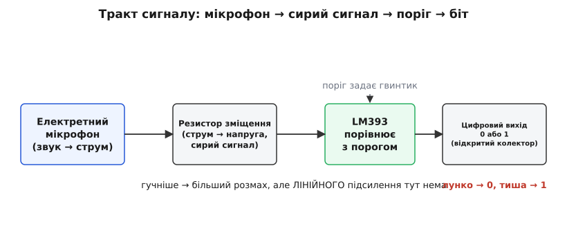
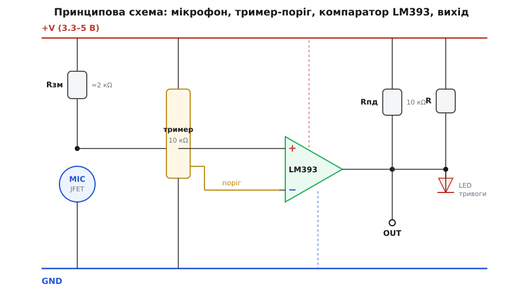
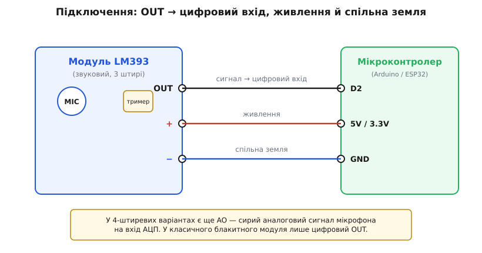

# Звуковий давач з мікрофоном (LM393)

<preknowlist>
- [Компаратор](root:hw-analog/comparator) — схема, що одним цифровим бітом каже «більше/менше за поріг»; це серце цього модуля й джерело всієї його поведінки.
- [Електретний мікрофон](root:hw-sensing/electret-microphone) — крихітний конденсаторний мікрофон із вбудованим JFET-транзистором; дає слабенький сигнал і сам себе майже не підсилює.
- [Рівні «0» і «1»](root:hw-digital/logic-levels-as-ranges) — що таке логічне «високо» й «низько» як діапазони напруги; від цього залежить, чи прочитає плата вихід давача правильно.
- [Підтяжка й «висячий» вхід](root:hw-digital/floating-pullups) — навіщо лінію тягне вгору резистор і чому вихід із відкритим колектором без підтяжки читається як сміття.
- [GPIO](root:hw-digital/gpio) — цифровий вивід мікроконтролера, який уміє прочитати логічний рівень на нозі; саме туди йде вихід давача.
- [АЦП](root:hw-analog/adc) — як мікроконтролер перетворює аналогову напругу на число; потрібне лише для варіантів модуля з аналоговим виходом AO.
</preknowlist>

На маленькій платі кольору електрик стирчить сріблястий циліндрик завбільшки з таблетку — мікрофон, а поруч чорна восьминога мікросхема з написом **LM393**, синій підстроювальний гвинтик і один-два світлодіоди. Знизу — гребінка на три (рідше чотири) штирі. Це найдешевший «звуковий давач» аматорської електроніки: те, що вмикає лампу від бавовни в долоні, будить робота від гучного звуку чи запускає сигналізацію, коли поряд щось грюкнуло. Коштує копійки, живиться від будь-чого в межах кількох вольтів і віддає готову відповідь одним проводом.

Уся суть цього модуля тримається на одному факті, і поки його не відчути, код із давачем поводитиметься незбагненно: **це не вимірювач гучності, а поріг гучності**. Він не скаже, скільки децибелів у кімнаті й навіть не покаже, чи стало трохи гучніше — він уміє лише клацнути «так» тієї миті, коли звук перескочив рівень, який ви накрутили гвинтиком. По суті це вимикач, який натискає не палець, а достатньо гучний звук. Усе інше — і чому він глухий до тихих звуків, і навіщо гвинтик, і чому один плеск дає купу спрацювань — прямо випливає з цієї єдиної думки. Розберімо цю річ так, щоб упізнати її серед іншого заліза, під'єднати з першого разу, витягти з неї сигнал у коді й наперед знати, де вона любить підводити.

## Що всередині: мікрофон, який майже не підсилює

Щоб зрозуміти, чому давач ловить лише гучне, треба глянути на його вхідний елемент — **електретний мікрофон** (гр. *ḗlektron* — бурштин, + *magnḗtis* — магніт: назва підкреслює «застиглий» заряд, як у постійного магніту застигле поле). Це крихітний конденсаторний мікрофон, і працює він хитро. Одна його обкладка — тонка мембрана з наперед вкладеним постійним зарядом; друга нерухома. Звукова хвиля тисне на мембрану, відстань між обкладками ледь-ледь міняється — а отже, міняється й [ємність цього крихітного конденсатора](root:hw-sensing/electret-microphone). Оскільки заряд застиглий і постійний, зміна ємності обертається зміною напруги на обкладках. Але напруга ця мізерна — одиниці мілівольтів, і знімати її треба, ніяк не навантажуючи крихітну ємність.

Тому в той самий корпус мікрофона заводчик уклав **польовий транзистор (JFET)** — саме він має настільки високий вхідний опір, що не «висмоктує» слабкий сигнал із мембрани. Транзистор перетворює зміну напруги на мембрані на зміну струму через себе. Але — і це ключове — назовні мікрофон має лише **два виводи** (стік і витік транзистора), і сам по собі струм у напругу не переганяє. Щоб цей струм став напругою, яку можна виміряти, зовні ставлять **резистор зміщення** від живлення до виводу мікрофона: струм тече крізь резистор, на ньому падає напруга, і саме її коливання й несуть звук.

Ось де народжується головна межа модуля. Уся «схема підсилення» тут — це один мікрофон із вбудованим транзистором плюс один резистор. **Справжнього підсилювача — окремого каскаду, що підняв би мілівольти до вольтів, — на класичній платі немає.** Тому сигнал, що приходить на мікросхему, залишається кволим: гучний ляскіт дає розмах у кількадесят мілівольтів, а тиха мова чи шурхіт майже тонуть у власному шумі. Це не поломка конкретного модуля, а прямий наслідок його дешевизни — і саме звідси випливає, що давач придатний ловити **гучне й раптове**, а не міряти рівень звуку.

> 🔧 **Навіщо це.** Не чекайте від цього модуля того, чого він не вміє. Виміряти рівень шуму в кімнаті, відрізнити тиху розмову від голосної, побудувати «шумомір» — не для нього: без справжнього підсилювача його сигнал надто слабкий і надто нелінійний. Його стихія — детектор подій: бавовна, стук, гучний окрик, дзенькіт скла. Якщо задача звучить як «зреагувати на різкий звук» — це той давач; якщо як «зміряти, наскільки гучно» — беріть модуль зі справжнім підсилювачем (на кшталт LM386) або мікрофон із аналоговим виходом і рахуйте розмах самі.

## Роль LM393: перетворити «трохи більше» на чистий біт

Кволий сигнал із мікрофона сам по собі мікроконтролеру незручний: це аналогова напруга, що дрібно тремтить довкола середнього рівня. Щоб перетворити її на просте «спрацювало / ні», на платі й стоїть **LM393** — це не підсилювач і не «датчик», а [компаратор](root:hw-analog/comparator): схема, яка порівнює дві напруги на своїх входах і на виході дає лише одне з двох — «перша більша» або «перша менша». Ніякої середини: вихід або притиснутий до нуля, або відпущений.

На один вхід компаратора заведено сигнал мікрофона, на другий — **опорну напругу-поріг**, яку задає той самий синій гвинтик. Гвинтик — це [підстроювальний резистор (тример)](root:hw-components/potentiometer), увімкнений подільником напруги: крутиш його — рухаєш поріг угору чи вниз. Поки звук тихий і розмах сигналу не дотягує до порога, компаратор тримає один стан; щойно гучний звук штовхнув сигнал за поріг — компаратор перекидається, і на виході стрибає рівень. Отак «сигнал ледь перевищив опорну лінію» перетворюється на чистий цифровий фронт, який мікроконтролер бачить як подію.


*Чотири станції сигналу. Мікрофон дає слабкий струм, резистор зміщення робить із нього сиру напругу — але лінійного підсилення тут немає, тож гучніше означає лише «більший розмах». Компаратор LM393 порівнює цей розмах із порогом (його крутить гвинтик) і видає одне з двох: лунко — «0», тиша — «1». Уся тонкість гучності стискається до одного біта.*

Тут ховається друга важлива риса, яку конче знати наперед: вихід LM393 — **з відкритим колектором** (англ. *open collector*). Це означає, що мікросхема вміє лише **притягувати вихід до землі**, коли спрацювала, а «відпустити вгору» сама не може — угору вихід має тягнути зовнішній резистор [підтяжки](root:hw-digital/floating-pullups). На платі модуля така підтяжка зазвичай уже стоїть, тож у спокої вихід тримається **ВИСОКО** («1»), а гучний звук на мить притискає його до землі — **НИЗЬКО** («0»). Полярність саме така: **тиша — одиниця, звук — нуль**. Це збиває з пантелику новачка, який очікує навпаки; але вона прямо випливає з того, що відкритий колектор уміє лише «тягнути вниз».

## Принципова схема: як усе з'єднано

Зберімо тепер усі частини в одну схему. Вона проста, бо активної електроніки тут лише одна мікросхема, а решта — мікрофон, гвинтик і кілька резисторів.


*Сигнал мікрофона (через резистор зміщення від +V) заходить на неінвертувальний вхід «+» компаратора; поріг від тримера — на інвертувальний «−». Поки сигнал нижчий за поріг, вихід відпущений і підтяжка Rпд тримає OUT угорі (спокій = «1»). Гучний звук піднімає сигнал вище порога, вихід притискається до землі (OUT = «0») і засвічує світлодіод тривоги. Другий світлодіод просто показує, що на плату подано живлення.*

Пройдімо схему за течією сигналу. **Ліворуч** — мікрофон: від шини живлення через резистор зміщення (≈2 кОм) до виводу мікрофона, а звідти — на землю; у точці між резистором і мікрофоном народжується сира звукова напруга, і саме звідти йде відведення на компаратор. **Посередині** — тример на 10 кОм, увімкнений між живленням і землею; його повзунок знімає частину напруги й подає її як **поріг**. Крутиш гвинтик — поріг повзе, і давач стає чутливішим (поріг ближче до тиші) або грубішим (поріг вище).

**Серце** — трикутник LM393. На вхід «+» приходить сигнал мікрофона, на вхід «−» — поріг. Коли напруга на «+» перевищує напругу на «−», вихід компаратора відпускається (стан спокою); коли гучний звук піднімає сигнал так, що… — насправді конкретна полярність залежить від того, який саме вхід куди заведений на вашій платі, і різні виробники розводять це по-різному. Практично важить одне: **у спокої вихід тримається одного рівня, а гучний звук перекидає його на протилежний**, і на класичному модулі спокій — це «1».

**Праворуч** — вихід. Відкритий колектор LM393 з'єднаний із резистором підтяжки (Rпд, зазвичай 10 кОм) до живлення — той і задає «1» у спокої. Паралельно висить **світлодіод тривоги**: він засвічується, коли вихід притискається до землі, тобто миготить на кожен гучний звук — зручний вбудований індикатор, щоб наживо бачити, чи ловить давач. Окремо стоїть **світлодіод живлення**, який просто горить, поки на плату подано напругу, і до сигналу відношення не має. Ось і вся електроніка: мікрофон, поріг, компаратор, підтяжка, два світлодіоди.

## Три штирі й підключення

Класичний блакитний модуль має **три штирі**, і цоколівка на різних партіях гуляє, тож звіряйтеся з **буквами на самій платі**, а не з чужим малюнком:

- **OUT** (інколи **DO** чи **S**) — цифровий вихід: той вивід, що йде на цифровий вхід мікроконтролера. У спокої «1», на гучний звук — короткий «0».
- **+ (VCC)** — живлення: 3.3 В або 5 В.
- **− (GND)** — спільна земля.

За живленням модуль невибагливий: LM393 працює в широкому діапазоні (від ~2 до 36 В), тож плата однаково жива і від 5-вольтової Arduino, і від 3.3-вольтового ESP32. Живіть її **під логіку своєї плати** — на 3.3-вольтовій системі беріть 3.3 В, щоб вихід не перевищив дозволеного рівня входу.


*Три дроти — і все. OUT іде в будь-який цифровий вивід (тут D2), + — на живлення під логіку плати, − — на спільну землю. Оскільки вихід цифровий і вже з підтяжкою на платі, узгодження рівнів чи зовнішній резистор не потрібні. Чотириштиреві варіанти додають AO — сирий аналоговий сигнал мікрофона на вхід АЦП.*

Читати такий давач у прошивці — по суті читати кнопку: потрібен лише один цифровий вивід, налаштований на вхід, і годинник, що вміє відміряти мілісекунди. Обидва є на будь-якому мікроконтролері, тож нижче — той самий приклад у трьох середовищах: він засвічує світлодіод на кожен гучний звук і рахує спрацювання, під класичну полярність — спокій «1», звук «0».

**Умова.** Вихід OUT заведено на довільний цифровий вхід (в Arduino це D2, в ESP-IDF — GPIO4, у STM32 — PA0), живлення й земля під'єднані; світлодіод-індикатор сидить на іншому цифровому виводі (Arduino D13, ESP32 GPIO2, STM32 PC13). Спокій дає «1», гучний звук — короткий «0». Треба блимати світлодіодом на кожен звук і рахувати події, не намотуючи по десятку на один плеск.

:::tabs

```arduino
const uint8_t SOUND = 2;      // вивід OUT давача
const uint8_t LED   = 13;     // вбудований світлодіод плати
unsigned long lastHit = 0;    // час останньої зарахованої події
unsigned long count   = 0;    // лічильник гучних звуків

void setup() {
    pinMode(SOUND, INPUT);    // на платі вже є підтяжка → спокій = 1
    pinMode(LED, OUTPUT);
    Serial.begin(9600);
}

void loop() {
    int level = digitalRead(SOUND);    // 1 = тиша, 0 = гучний звук
    digitalWrite(LED, level == LOW);   // світимо, поки давач бачить звук

    // рахуємо подію, але не частіше ніж раз на 150 мс —
    // інакше один плеск дасть чергу спрацювань
    if (level == LOW && millis() - lastHit > 150) {
        lastHit = millis();
        Serial.print("гучний звук #");
        Serial.println(++count);
    }
    delay(2);   // щільний цикл, щоб не проґавити короткий імпульс
}
```

```esp-idf
#include "driver/gpio.h"
#include "esp_log.h"
#include "esp_timer.h"
#include "freertos/FreeRTOS.h"
#include "freertos/task.h"

#define SOUND GPIO_NUM_4        // вивід OUT давача
#define LED   GPIO_NUM_2        // світлодіод плати
static const char *TAG = "sound";

static void sound_task(void *arg)
{
    gpio_config_t in = {
        .pin_bit_mask = 1ULL << SOUND,
        .mode = GPIO_MODE_INPUT,
        .pull_up_en = GPIO_PULLUP_DISABLE,   // підтяжка вже стоїть на платі давача
        .pull_down_en = GPIO_PULLDOWN_DISABLE,
        .intr_type = GPIO_INTR_DISABLE,
    };
    ESP_ERROR_CHECK(gpio_config(&in));
    ESP_ERROR_CHECK(gpio_set_direction(LED, GPIO_MODE_OUTPUT));

    int64_t last_hit = 0;       // мікросекунди останньої зарахованої події
    unsigned count = 0;

    while (1) {
        int level = gpio_get_level(SOUND);        // 1 = тиша, 0 = гучний звук
        gpio_set_level(LED, level == 0);          // світимо, поки давач бачить звук

        // рахуємо подію, але не частіше ніж раз на 150 мс —
        // інакше один плеск дасть чергу спрацювань
        int64_t now = esp_timer_get_time();
        if (level == 0 && now - last_hit > 150000) {
            last_hit = now;
            ESP_LOGI(TAG, "гучний звук #%u", ++count);
        }
        vTaskDelay(pdMS_TO_TICKS(2));   // щільний цикл, щоб не проґавити імпульс
    }
}

void app_main(void)
{
    xTaskCreate(sound_task, "sound", 3072, NULL, 5, NULL);
}
```

```stm32
#include "main.h"       // CubeMX: PA0 — вхід без підтяжки, PC13 — вихід push-pull

#define SOUND_PORT  GPIOA
#define SOUND_PIN   GPIO_PIN_0      // вивід OUT давача
#define LED_PORT    GPIOC
#define LED_PIN     GPIO_PIN_13     // світлодіод плати

int main(void)
{
    HAL_Init();
    SystemClock_Config();
    MX_GPIO_Init();         // підтяжка не потрібна: вона вже є на платі давача
    MX_USART2_UART_Init();  // printf перенаправлено на UART

    uint32_t last_hit = 0;  // HAL_GetTick() останньої зарахованої події
    uint32_t count = 0;

    while (1) {
        // GPIO_PIN_SET = тиша, GPIO_PIN_RESET = гучний звук
        GPIO_PinState level = HAL_GPIO_ReadPin(SOUND_PORT, SOUND_PIN);
        HAL_GPIO_WritePin(LED_PORT, LED_PIN,
                          level == GPIO_PIN_RESET ? GPIO_PIN_SET : GPIO_PIN_RESET);

        // рахуємо подію, але не частіше ніж раз на 150 мс —
        // інакше один плеск дасть чергу спрацювань
        uint32_t now = HAL_GetTick();
        if (level == GPIO_PIN_RESET && now - last_hit > 150) {
            last_hit = now;
            printf("гучний звук #%lu\r\n", (unsigned long)++count);
        }
        HAL_Delay(2);   // щільний цикл, щоб не проґавити короткий імпульс
    }
}
```

:::

Ключова тут не сама перевірка рівня, а **вікно 150 мілісекунд**. Один плеск — це не рівне «0», а серія коротких провалів: звукова хвиля коливається, розмах сигналу то перескакує поріг, то ні, тож компаратор кілька разів перекидається туди-сюди, поки звук не згас. Без вікна лічильник намотав би десяток «звуків» на одну бавовну. Правило просте: **після зарахованої події не рахувати нічого ще сотню-дві мілісекунд**. І зверніть увагу на дві мілісекунди паузи наприкінці циклу (`delay`, `vTaskDelay`, `HAL_Delay` — одне й те саме в трьох середовищах): опитувати вивід треба щільно, бо провал триває лічені мілісекунди — рідке читання раз на 50 мс легко проскочить повз нього.

Цей приклад лише показує принцип. Надійне читання в реальному пристрої — з перериванням по фронту замість опитування, з акуратним придушенням «торохтіння» без блокувальних затримок, з калібруванням порога з коду й (для 4-штиревих плат) із читанням аналогового AO та обчисленням розмаху сигналу — зібрано в [окремому проєкті-вставці](root:cat-hw-sensors/sound-lm393/api-sound-lm393.md) з робочими прикладами під Arduino та ESP32.

## Варіанти й рідня

Цей модуль — не один пристрій, а ціле гніздо схожих плат, і корисно знати, чим вони різняться, щоб не купити не те.

**Три штирі проти чотирьох.** Класична мала блакитна плата (її часто маркують **XD-74**) має **лише цифровий вихід** OUT — вона й є «звуковий давач з мікрофоном (LM393)» у чистому вигляді. Ширші варіанти виводять ще **AO** — сирий аналоговий сигнал мікрофона просто на штир, повз компаратор. Із AO ви можете завести сигнал на [АЦП](root:hw-analog/adc) мікроконтролера й самі рахувати розмах — але пам'ятайте: сигнал усе одно кволий і несилений, тож навіть через AO повноцінного шумоміра не вийде, лише грубша оцінка «тихо/гучно», ніж дає один біт DO.

**Ближча рідня — KY-модулі.** Той самий електретний мікрофон плюс LM393 плюс гвинтик стоять і на модулях [KY-038](root:cat-hw-sensors/ky-038-mic) та [KY-037](root:cat-hw-sensors/ky-037-mic) — це, по суті, ті самі схеми в іншому корпусі й з іншими дрібницями (KY-037 більший і має чутливіший мікрофон, обидва зазвичай виводять і AO, і DO). Усі вони — частина великої [KY-серії](root:cat-hw-sensors/ky-series) синіх аматорських модулів: спільний формат «плата-марка на три-чотири штирі», всеїдність за живленням і правило «номер важливіший за виробника». Спільну породу цих модулів — звідки вони взялися і чому такі однакові — розібрано в оглядовій статті родини; тут досить того, що звуковий давач на LM393 поводиться геть так само, як його KY-родичі, і код для них однаковий.

**Далека рідня за схемою.** Той самий фокус «аналоговий давач + LM393-компаратор + гвинтик-поріг → цифровий вихід» — не унікальний для звуку. За тим самим лекалом зроблено [давач вологості ґрунту](root:cat-hw-sensors/soil-moisture) (де замість мікрофона — два електроди в землі) і чимало давачів дощу, диму, світла. Розпізнавши цю схему раз, ви впізнаватимете її на десятках різних плат: скрізь, де на синій платі сидить восьминога мікросхема LM393 і синій гвинтик, шукайте однакову поведінку — «поріг, а не міра», відкритий колектор, спокій-«1».

> 🔧 **Навіщо це.** Практичний висновок: не вивчайте кожен такий модуль наново. Побачили LM393 і підстроювальний гвинтик — знайте, що перед вами **пороговий детектор** із цифровим виходом, який треба спершу відкалібрувати гвинтиком (накрутити поріг так, щоб у тиші давач мовчав, а на потрібний звук спрацьовував), а читати — як кнопку з придушенням брязкоту. Що саме давач на вході — звук, волога, дим — міняє лише, на що він реагує, але не спосіб роботи з ним у коді.

## Як упізнати й чого стерегтися

Модуль упізнається миттєво: синя плата, на ній сріблястий **циліндрик мікрофона** (часто з отвором-сіточкою збоку), восьминога мікросхема з написом **LM393**, **синій підстроювальний гвинтик** і один-два світлодіоди. Саме гвинтик і LM393 відрізняють його від давачів без порогу; саме мікрофон-циліндрик — від інших LM393-плат (де на його місці електроди, фоторезистор чи п'єзо).

Наостанок — перелік того, на чому спотикаються найчастіше, з причиною кожної біди:

- **Давач «спрацьовує весь час» або мовчить на будь-який звук.** Майже завжди — **не накручений поріг**. Гвинтик стоїть у крайньому положенні: або поріг так низько, що давач ловить власний шум і тримає «тривогу» постійно, або так високо, що його не пробиває навіть крик. Лік — повільно крутити гвинтик, поки в тиші давач не замовкне, а на потрібний звук не почне спрацьовувати (світлодіод тривоги — зручний індикатор під час налаштування).
- **Логіка здається перевернутою: у спокої «тривога», на звук «тиша».** Це не помилка — на класичному модулі так і є: спокій — «1», звук — «0» (наслідок відкритого колектора з підтяжкою). Пишіть код під це; якщо ваша конкретна плата поводиться навпаки, переверніть порівняння одним рядком (поміняйте місцями «низько» й «високо»).
- **Один плеск рахується багато разів.** Це **природа звуку**: хвиля коливається, розмах сигналу кілька разів перескакує поріг, компаратор перекидається чергою. Додайте вікно придушення (ігнорувати нові спрацювання сотню-дві мілісекунд після першого) — як `lastHit` у прикладі вище.
- **Давач не помічає навіть гучних звуків.** Крім не накрученого порога, часта причина — **надто рідке опитування**: короткий провал на виході легко проскочити повільним циклом. Опитуйте щільно або переходьте на переривання по фронту.
- **Хочеться зміряти гучність, а виходить лише 0/1.** Це в природі давача: він **пороговий детектор, а не шумомір** — справжнього підсилювача на платі немає. Грубу оцінку дає хіба аналоговий AO (на 4-штиревих платах) через АЦП, та й то приблизну; для вимірювання рівня звуку потрібен модуль зі справжнім підсилювачем.
- **Дві плати «однакові», а поводяться інакше.** Різні партії мають різні мікрофони, різну підтяжку, іноді різну полярність і навіть різну цоколівку. Тому не покладайтеся на чужий малюнок — **звіряйте букви на своїй платі** й перевіряйте рівень спокою простим читанням виводу, перш ніж писати логіку.

Головне про цей давач тримається на одному реченні: він не міряє звук, а лише **клацає, коли звук перескочив накручений поріг** — і вся правильна робота з ним (накрутити гвинтик, читати як кнопку, придушити брязкіт, звірити полярність зі своєю платою) прямо випливає з того, що всередині — кволий мікрофон і компаратор LM393, який перетворює «трохи гучніше» на чистий біт.
