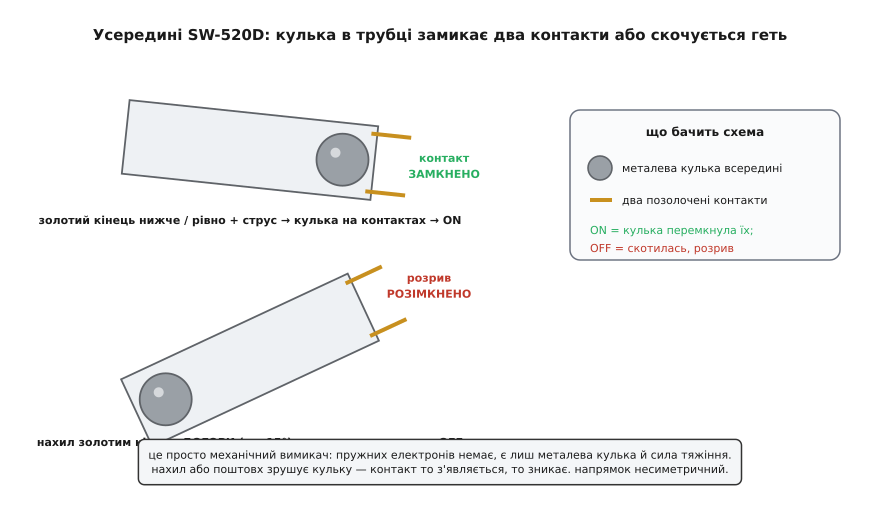
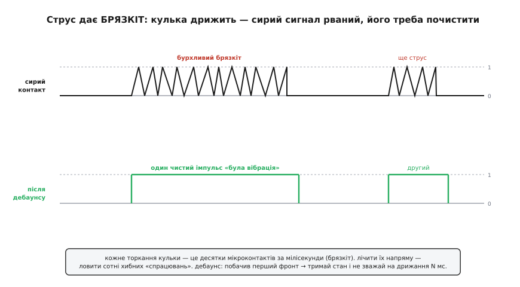
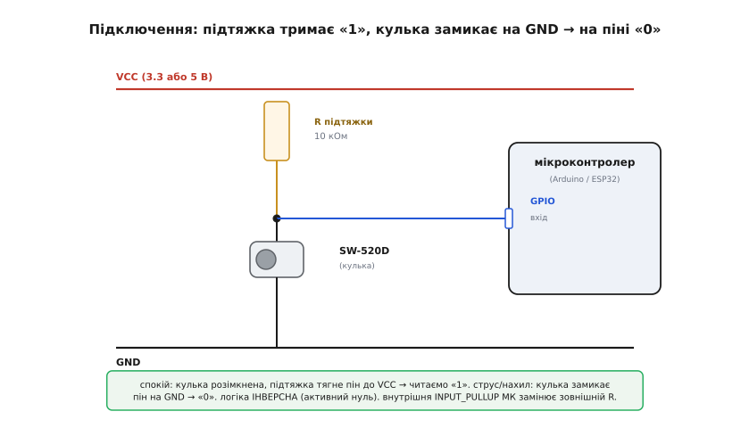

# SW-520D — давач нахилу/вібрації

<preknowlist>
- [GPIO](root:hw-digital/gpio) — цифровий вивід мікроконтролера вміє прочитати рівень «високо/низько» на нозі; саме так знімають стан цього давача.
- [Дільник напруги](root:hw-analog/voltage-divider) — резистор підтяжки й вимикач утворюють дільник, що задає рівень на піні, коли контакт розімкнений.
- [Тригер Шмітта](root:hw-analog/schmitt-trigger) — схема з гістерезисом, що перетворює дрижачий контакт на чисті фронти; пояснює, чому сирий вихід кулькового вимикача треба «чистити».
</preknowlist>

Уявіть чорну або сіру трубочку завбільшки з половину сірника — міліметрів тринадцять завдовжки й п'ять у діаметрі, з двома тонкими лудженими ніжками з одного кінця. Зовні вона схожа радше на конденсатор, ніж на давач. Це **SW-520D** — найдешевший спосіб дати мікроконтролерові відчуття, якого йому природно бракує: чи предмет **нахилили** й чи його **струснули**. Ним будять іграшку, коли її беруть у руки; вмикають підсвітку велосипеда від тряски дороги; ставлять грубу сигналізацію «хтось торкнувся коробки». Коштує він копійки, живлення й бібліотек не потребує, а всередині — жодної електроніки: лише металева кулька й сила тяжіння.

Саме ця простота й визначає все, що з ним треба знати. SW-520D — не акселерометр і не гіроскоп; він не скаже, **на скільки** градусів нахилений предмет чи **як сильно** його трусять. Він каже одне-єдине: контакт зараз **замкнений** або **розімкнений**. Уся хитрість — зрозуміти, від чого залежить це «замкнено/розімкнено», бо поводиться воно спершу загадково: давач несиметричний за напрямком і жахливо «брязкотливий». Розберемо, чому.

### Кулька в трубці — оце і весь давач

Розкрийте SW-520D подумки — і всередині виявиться разюче мало. У запаяній з обох боків трубці (корпус із поліетилену, ущільнений термоусадкою від пилу й вологи) лежить маленька **металева кулька** з нержавкої сталі, позолочена, вільна котитися вздовж. З одного кінця в трубку заходять два позолочені **контакти** на латунних ніжках, рознесені так, щоб кулька, докотившись до них, торкнулася обох водночас і **замкнула** їх між собою. Ось і вся конструкція: два контакти, одна кулька, порожнина, і закон тяжіння, що вирішує, де кульці лежати.

Логіка стає очевидною, щойно уявити нахил. Поки кулька лежить **біля контактного кінця** — вона перекриває обидва контакти, струм тече, давач **увімкнений** (ON, замкнено). Щойно трубку нахилити так, що кулька **скотиться геть** від контактів до глухого кінця, — місток зникає, коло розривається, давач **вимкнений** (OFF). Ніякого порогу «в градусах» усередині немає: є лише геометрія, за якої кулька або дістає до обох контактів, або ні.


*Усередині — металева кулька й два позолочені контакти на «золотому» кінці. Коли кулька дістає до обох контактів, вони замкнені (ON); коли нахил відкочує її геть — розрив (OFF). Порогу «в градусах» усередині немає, є лише геометрія: дістала кулька до контактів чи ні. Тому й поріг спрацювання несиметричний за напрямком.*

> 🔧 **Навіщо це.** Зрозуміти, що це **звичайний механічний вимикач**, а не «розумний» давач, — головне для роботи з ним. З цього одразу випливає все: він нічого не міряє, лише замикає коло; його стан читається як стан кнопки; він не потребує живлення сам по собі (живлення потрібне колу, яке він замикає); і він **однаково спрацює від нахилу й від тряски** — бо і те, й те зрушує кульку. Не шукайте в ньому регістрів, адрес чи протоколу: їх немає.

### Чому напрямок має значення: несиметрія

Тут ховається перша несподіванка, від якої SW-520D поводиться дивно, поки її не врахувати. Контакти сидять **лише з одного кінця** трубки — того, звідки стирчать ніжки (його часто звуть «золотим» кінцем за колір контактів). Тому поведінка залежить від того, **куди** саме ви нахиляєте.

Коли трубка лежить приблизно горизонтально або золотим кінцем **донизу** — кулька за тяжінням скочується **до контактів** і замикає їх: ON. Коли ж ви піднімаєте золотий кінець **догори** градусів на п'ятнадцять і більше — кулька скочується **від контактів** у протилежний, глухий бік: контакт зникає, OFF. А от якщо нахиляти в **інший** бік (глухим кінцем догори), кулька, навпаки, тим щільніше притискається до контактів — і стан майже не змінюється. Ось чому в описах пишуть, що це **односпрямований** (англ. *unidirectional*) давач: він чутливий до нахилу переважно в **одному** напрямку, а в протилежному майже байдужий.

Практичний висновок простий: **орієнтація давача на платі — це вибір, а не дрібниця**. Поставите його «золотим кінцем донизу» — у спокої матимете стабільний контакт (ON), а сигналом буде його **розмикання** при нахилі. Поставите «золотим догори» — навпаки, у спокої розрив (OFF), а нахил чи струс дадуть коротке **замикання**. Обидва варіанти робочі; головне — свідомо обрати, який стан для вашого пристрою означає «спокій», і не дивуватися потім, що давач «завжди увімкнений» — це ви його так поклали.

### Нахил і вібрація — одне й те саме явище

Може здатися дивним, що один прилад продають то як «давач нахилу», то як «давач вібрації». Насправді суперечності немає: **і те, й те — це рух кульки**. Повільний нахил перекочує кульку з одного кінця в інший — маємо давач нахилу. Різкий струс підкидає й трясе ту саму кульку — вона на мить відскакує від контактів і повертається, багато разів поспіль, — маємо давач вібрації. Механізм один, різниця лише в **характері** руху кульки.

Саме тому SW-520D не годиться там, де треба **розрізнити** нахил і тряску. Якщо предмет одночасно й нахиляють, і трусять, давач видасть суміш, з якої вихідне «замкнено/розімкнено» вже не розкладеш назад на «нахилили» й «струснули». Для такого потрібен [акселерометр](root:cat-hw-sensors/adxl335), що видає власне прискорення по трьох осях числом. SW-520D — інструмент грубий: він чудовий для «сталося щось механічне — зреагуй», але не для «виміряй, що саме сталося».

> 🔧 **Навіщо це.** Ця подвійність — і сила, і межа. Сила: одним копійчаним компонентом ви ловите **обидві** типові події — «предмет перехилили» й «предмет трусять», — і для сигналізації чи будильника-від-руху цього досить. Межа: не будуйте на ньому логіки, що покладається на **розрізнення** двох явищ або на **величину** руху. Щойно в задачі з'являється «наскільки сильно» чи «в який бік точно» — це вже не про SW-520D.

### Брязкіт: чому сирий вихід «шумить»

Друга, ще підступніша несподіванка — **брязкіт контактів** (англ. *contact bounce*). Металева кулька, торкаючись металевого контакту, не приклеюється намертво з першого дотику. Вона **відскакує** — як кулька, кинута на стіл, підстрибує кілька разів, поки заспокоїться. За ті кілька мілісекунд, поки кулька дрижить біля контактів, коло встигає замкнутися й розімкнутися **десятки разів** поспіль.

Для ока це одна подія — «торкнулося». Для мікроконтролера, що читає пін мільйони разів на секунду, це **злива** переходів 0↔1. Якщо ви наївно рахуєте кожен перехід як окреме спрацювання — один-єдиний струс дасть вам сотню хибних «спрацювань» замість одного. Прочитати такий сигнал напряму не можна: його треба спершу **очистити**.


*Кожне торкання кульки — це десятки мікроконтактів за мілісекунди (брязкіт): сирий вихід рветься між 0 і 1. Лічити ці переходи напряму — ловити сотні хибних «спрацювань» з одного струсу. Дебаунс: побачив перший фронт — зафіксуй стан і не зважай на дрижання наступні кілька десятків мілісекунд; на виході — один чистий імпульс на подію.*

Лікують брязкіт двома шляхами. Апаратний — увімкнути на вхід [тригер Шмітта](root:hw-analog/schmitt-trigger) або RC-ланку, що згладжує дрижання перед тим, як воно дійде до піна. Програмний — **дебаунс** (англ. *debounce*, «прибрати відскок»): у прошивці, побачивши перший фронт, зафіксувати стан і **ігнорувати** пін наступні, скажімо, 20–50 мілісекунд, поки кулька не заспокоїться. Для аматорського застосування другий шлях простіший і майже завжди достатній — детально його розбираємо в окремому [конспекті про усунення брязкоту](root:sf-devices/switch-debounce). Головне засвоїти зараз: **сирий вихід SW-520D без обробки давати в лічильник не можна** — захлинеться.

### Електричні межі: маленький вимикач для маленьких струмів

Оскільки це механічні контакти, а не транзистор, у SW-520D є жорсткі електричні межі — і виходити за них не можна, бо контакти просто **згорять** або **приваряться**. За паспортом виробника (BAILIN Electronics):

```
Робоча напруга  : до 12 В
Робочий струм   : до 20 мА (номінальний тепловий)
Опір у замкненому стані : < 10 Ом
Опір ізоляції (розімкнено) : > 10 МОм
Час провідності (стабілізації) : ≈ 20 мс
Робоча температура : до +100 °C
Ресурс          : ≈ 200 000 циклів
```

Кожне число тут — практичне обмеження. **До 12 В і до 20 мА** означає, що безпосередньо цим вимикачем можна керувати лише **слабким** колом — засвітити світлодіод через резистор, підтягнути логічний вхід, — але **не** ввімкнути мотор чи реле напряму: сильніший струм спалить контакти. **Опір у замкненому стані менш як 10 Ом** — це не ідеальний нуль: у точних вимірюваннях цю «зайву» десятку ом варто пам'ятати, хоча для цифрового читання вона неважлива. **Ресурс близько 200 тисяч спрацювань** — багато для сигналізації, але скінченно: у застосунку, де давач клацає щосекунди, це вичерпається за кілька діб, і тоді краще брати безконтактний акселерометр.

> 🔧 **Навіщо це.** Найчастіша помилка початківця — спробувати кульковим вимикачем **напряму** ввімкнути навантаження: лампочку на 100 мА, зумер, реле. Контакти на 20 мА такого струму не витримають — приваряться в замкненому стані або підгорять і перестануть проводити. Правило: SW-520D **тільки подає сигнал** слабкому колу (логічний вхід МК, база транзистора, вхід оптрона), а вже те коло вмикає силу. Думайте про нього як про **кнопку**, а не як про вимикач живлення.

### Як під'єднати: підтяжка й активний нуль

Оскільки SW-520D — це просто вимикач із двома невзаємозамінно **байдужими до полярності** ніжками (жодного «плюса» й «мінуса», підключайте будь-яким боком), під'єднують його рівно так само, як звичайну кнопку до мікроконтролера. Сам по собі замкнений або розімкнений контакт **не задає напруги** на піні — розімкнений вимикач лишає пін «висіти» в невизначеному стані, де він ловитиме наводки й читатиметься випадково. Тому обов'язковий елемент схеми — **резистор підтяжки** (англ. *pull-up*).

Класичне ввімкнення: один кінець давача — на **землю** (GND), другий — у **цифровий вхід** [GPIO](root:hw-digital/gpio); а від того ж входу вгору, до живлення, іде резистор підтяжки (типово 10 кОм). Разом підтяжка й вимикач утворюють [дільник напруги](root:hw-analog/voltage-divider): поки давач **розімкнений**, підтяжка тягне пін до живлення — читаємо логічну **«1»**; щойно кулька **замкне** давач на землю — пін притискається до нуля, читаємо **«0»**.


*Резистор підтяжки тримає пін біля живлення, поки контакт розімкнений — читаємо «1». Коли кулька замикає давач на землю, пін притискається до «0». Логіка виходить ІНВЕРСНОЮ (активний нуль): подія — це поява нуля. Зовнішній резистор можна не ставити взагалі — увімкнути внутрішню підтяжку МК режимом INPUT_PULLUP.*

Тут важлива деталь, що часто збиває з пантелику: логіка виходить **інверсною**. «Нічого не відбувається» — це **«1»**, а «спрацювало» — це **«0»**. Це прямий наслідок схеми «вимикач на землю з підтяжкою вгору», і плутати тут легко, поки не звикнеш читати «нуль означає подію». Приємна новина: майже кожен мікроконтролер має **вбудовану** підтяжку, яку вмикають одним рядком коду (`INPUT_PULLUP`), — тоді зовнішній резистор не потрібен зовсім, а схема стискається до двох дротів: давач між піном і землею.

Читання в прошивці — точнісінько як у кнопки, з дебаунсом проти брязкоту:

**Умова.** Один вивід SW-520D на GND, другий — на пін D2 Arduino; вбудовану підтяжку вмикаємо в коді. Треба засвітити світлодіод плати на кожен струс/нахил, гасячи брязкіт.

:::tabs
```cpp
const uint8_t SW  = 2;      // вивід давача (другий — на GND)
const uint8_t LED = 13;     // вбудований світлодіод

void setup() {
  pinMode(SW, INPUT_PULLUP); // внутрішня підтяжка: спокій = HIGH
  pinMode(LED, OUTPUT);
}

void loop() {
  // активний НУЛЬ: подія = LOW (кулька замкнула на землю)
  if (digitalRead(SW) == LOW) {
    digitalWrite(LED, HIGH);
    delay(50);              // грубий дебаунс: перечекати брязкіт кульки
  } else {
    digitalWrite(LED, LOW);
  }
}
```
```micropython
from machine import Pin
import time

sw  = Pin(2, Pin.IN, Pin.PULL_UP)  # внутрішня підтяжка: спокій = 1
led = Pin(25, Pin.OUT)             # вбудований світлодіод

while True:
    # активний НУЛЬ: подія = 0 (кулька замкнула на землю)
    if sw.value() == 0:
        led.on()
        time.sleep_ms(50)          # грубий дебаунс: перечекати брязкіт кульки
    else:
        led.off()
```
:::

Цей приклад навмисне простий — тут `delay(50)` глушить і брязкіт, і решту роботи програми. У реальному пристрої дебаунс роблять **без блокування**, за таймером, а сам пін часто чіпляють на [апаратне переривання](root:hw-digital/wired-or), щоб МК прокидався від струсу, а не опитував давач у циклі. Робочий неблокувальний код і схему переривання зібрано в [проєкті-вставці про роботу з давачем](root:cat-hw-sensors/sw-520d/proj-sw520d.md).

### Готовий модуль проти голого давача

У продажу SW-520D трапляється у двох виглядах, і плутати їх не варто. Перший — **голий давач**: та сама трубочка з двома ніжками, яку ви впаюєте самі й самі додаєте підтяжку. Другий — **модуль на платі** (часто підписаний просто «tilt sensor module» або в KY-серії): там кульковий вимикач уже впаяний, поряд стоїть [компаратор](root:hw-analog/comparator) (зазвичай мікросхема LM393), резистор підтяжки, світлодіод-індикатор і три штирки — **VCC, GND, DO**. Компаратор перетворює стан контакту на чистий цифровий рівень і засвічує світлодіод, коли давач спрацював.

Різниця практична. Голий давач дешевший і гнучкіший (самі обираєте орієнтацію, підтяжку, логіку), але вимагає розуміння схеми. Модуль зручніший — три дроти, готовий цифровий вихід DO прямо в GPIO, видимий світлодіод для налагодження, — і живиться зазвичай від **3.3 або 5 В**. Але й модуль **не позбавляє від брязкоту**: компаратор дає чистий рівень, проте кожне тремтіння кульки він чесно передасть як окремий фронт, тож дебаунс у прошивці однаково потрібен. Якщо вам потрібне швидке макетування — беріть модуль; якщо компактність і контроль над схемою — голий давач і власна підтяжка.

Незалежно від вигляду, суть однакова: **металева кулька, дві контактні ніжки й сила тяжіння**. Усе інше — обв'язка навколо цього найпростішого механічного давача, який дає мікроконтролерові грубе, але надійне відчуття «мене нахилили» й «мене трусять».
