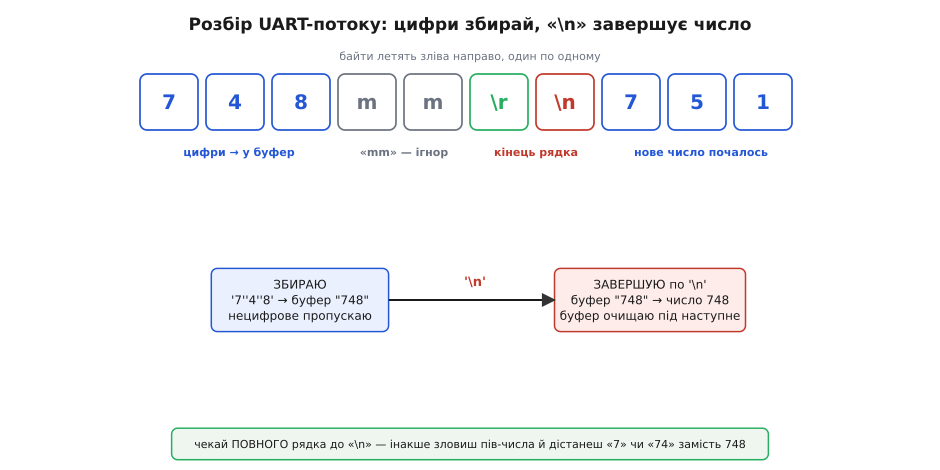

# ⚙️ TOF10120 у коді: читання, розбір потоку й кільце далекомірів

<preknowlist>
- [Шина I2C](topic:com-devices/i2c-bus) — дві лінії SDA/SCL, ведучий шле 7-бітну адресу, ведений відповідає ACK; на цьому стоїть і читання регістра, і зміна адреси.
- [Кадр UART](topic:com-devices/uart-frame) — старт-біт, вісім біт даних, стоп-біт; «9600 8N1» — саме про цей кадр, і на ньому тримається розбір потоку.
- [Асинхронна передача](topic:com-devices/async-serial) — обмін по TX/RX без спільного такту, приймач ловить край старт-біта сам; звідси й вимога до точного часу, і чому апаратний приймач надійніший за програмний.
</preknowlist>

Модуль підключено, живлення є, лазер (яким невидиме 940-нанометрове світло) тихо працює — а програма мовчить. Між «дроти на місці» і «на екрані повзуть чесні міліметри» лежить рівно один шар: код. І шар цей оманливо тонкий. По I2C відстань дістають трьома рядками; по UART її взагалі ніхто не питає — модуль сам, без упину, диктує число в лінію. Проте кожен із цих шляхів мовчки припускає, що ви поклали **правильне представлення адреси**, дочекалися **повного рядка** перед тим, як тлумачити цифри, і не сплутали, **який саме з двох регістрів** віддає згладжене число, а який — сире. Не вгадали — і замість `748` дістанете `-1`, `0`, `7` або кашу зі злиплих чисел.

Тож пройдімо весь шлях по-справжньому, реальним C/C++ під Arduino-ядро (він так само збирається під класичну Arduino, під ESP32 і під STM32 з ядром Arduino), а не псевдокодом «для ілюстрації». Числа адрес, регістрів і команд, на які спирається код, зведено в [довіднику інтерфейсу](topic:cat-hw-sensors/tof10120/api-tof10120.md) — тут зосередимося на робочому коді. Три задачі підряд, кожна відповідає на питання, що з'їдає перший вечір:

1. **Як витягти відстань по I2C** — і відрізнити «модуль не відповів» від «відповів нулем».
2. **Як розібрати безперервний текстовий потік по UART** у число — не зловивши пів-числа.
3. **Як говорити з модулем його мовою команд** — перемкнути режим, зсунути нуль, а головне — **розвести кілька модулів по адресах**, щоб повісити їх на одну шину.

## Задача 1: відстань по I2C — і чому важливо, який регістр

По I2C модуль поводиться як звичайний ведений із набором регістрів. Ведучий каже: «постав внутрішній вказівник на регістр N», далі «дай мені звідти стільки байтів» — і читає. Уся відстань — це один такий обмін.

Перша пастка тут навіть не в коді, а в **числі адреси**: у `Wire` кладуть **7-бітну** `0x52`, а не паспортний байт `0xA4` (це те саме число, лише зсунуте на біт; повний розбір — у [довіднику](topic:cat-hw-sensors/tof10120/api-tof10120.md)). Покладете `0xA4` замість `0x52` — `Wire` зверне не туди, модуль промовчить, а ви винитимете плату.

> 🔧 **Навіщо це.** Плутанина «0xA4 чи 0x52» — причина половини скарг «I2C не працює» на цьому модулі. Перш ніж лізти паяльником у підтяжки чи міняти плату, перевірте очевидне: чи поклали ви саме `0x52`. Якщо колись міняли адресу командою (задача 3) — шукайте вже за новою.

Друга тонкість, про яку мовчать «швидкі старти»: відстань лежить **не в одному регістрі, а у двох**. `0x00` — миттєва (сира) відстань: те, що давач зміряв цієї секунди, без згладжування; реагує вмить, але й стрибає від замору до замору. `0x04` — згладжена: усереднений, причесаний власним мікроконтролером результат; стабільніший показ, але з невеликою затримкою реакції на різку зміну. Обидва — по два байти, старший перший, число в міліметрах. Для плавного показу на екрані беріть `0x04`, для швидкого відстеження рухомої цілі чи керування в контурі — `0x00`.

### Робоче читання по I2C

Напишемо функцію, що читає будь-який із цих регістрів і **чесно розрізняє три випадки**: модуль не відповів на адресу, відповів менше ніж двома байтами, відповів нормально. Це важливо: якщо просто повернути `(hi << 8) | lo` без перевірок, то на відключеному модулі ви мовчки дістанете `0` або сміття й прийматимете за нього рішення.

:::tabs

```cpp
#include <Wire.h>

#define TOF_ADDR   0x52     // 7-бітна адреса (байт 0xA4 → 0x52)
#define REG_RAW    0x00     // миттєва (сира) відстань, 2 байти MSB-first
#define REG_FILT   0x04     // згладжена відстань, 2 байти MSB-first

// Повертає відстань у мм (0..~1993) або -1, якщо модуль не відповів як слід.
int tofReadReg(uint8_t reg) {
    Wire.beginTransmission(TOF_ADDR);
    Wire.write(reg);                       // куди поставити внутрішній вказівник
    if (Wire.endTransmission(false) != 0)  // repeated-start: не відпускаємо шину
        return -1;                         // ніхто не підтвердив адресу → нема модуля

    if (Wire.requestFrom(TOF_ADDR, (uint8_t)2) != 2)
        return -1;                         // прийшло менше двох байтів → збій обміну

    uint16_t hi = Wire.read();             // старший байт
    uint16_t lo = Wire.read();             // молодший байт
    return (int)((hi << 8) | lo);          // склали 16-бітне число, мм
}

void setup() {
    Wire.begin();                          // на ESP32/STM32/Pico тут задайте свої ніжки
    Serial.begin(115200);
}

void loop() {
    int mm = tofReadReg(REG_FILT);         // згладжена; для сирої — REG_RAW
    if (mm < 0)        Serial.println("TOF: нема відповіді");
    else if (mm == 0)  Serial.println("TOF: 0 (ціль надто близько / поза діапазоном?)");
    else { Serial.print(mm); Serial.println(" мм"); }
    delay(100);
}
```

```python
from machine import I2C, Pin
from time import sleep_ms

TOF_ADDR = 0x52     # 7-бітна адреса (байт 0xA4 → 0x52)
REG_RAW  = 0x00     # миттєва (сира) відстань, 2 байти MSB-first
REG_FILT = 0x04     # згладжена відстань, 2 байти MSB-first

i2c = I2C(0, scl=Pin(22), sda=Pin(21))     # ніжки — під свою плату

# Повертає відстань у мм (0..~1993) або -1, якщо модуль не відповів як слід.
def tof_read_reg(reg):
    try:
        # readfrom_mem сам робить repeated-start: пише регістр і зразу читає 2 байти
        b = i2c.readfrom_mem(TOF_ADDR, reg, 2)
    except OSError:
        return -1                          # ніхто не підтвердив адресу → нема модуля
    return (b[0] << 8) | b[1]              # старший, молодший → 16-бітне число, мм

sleep_ms(10)
while True:
    mm = tof_read_reg(REG_FILT)            # згладжена; для сирої — REG_RAW
    if mm < 0:
        print("TOF: нема відповіді")
    elif mm == 0:
        print("TOF: 0 (ціль надто близько / поза діапазоном?)")
    else:
        print(mm, "мм")
    sleep_ms(100)
```

:::

Тут кожен рядок несе сенс. `Wire.endTransmission(false)` завершує фазу «я поставив вказівник», але аргумент `false` каже: **не віддавай шину**, зараз буде читання (це так званий repeated-start — цілісний обмін «записав адресу регістра → одразу читаю»). Далі `requestFrom` просить рівно два байти й повертає, **скільки насправді прийшло** — якщо не два, обмін зірвався, і ми не вигадуємо число з повітря. Зсув `hi << 8` піднімає старший байт на його розряд, `| lo` домальовує молодший:

```
hi = 0x02, lo = 0xEC
(0x02 << 8) | 0xEC = 0x0200 | 0x00EC = 0x02EC = 748 мм
```

Окремо варто знати про **стелю**. Внутрішнє 16-бітне число впирається приблизно в `1993` мм (це `0x07C9`) — за паспортної верхньої межі 1800 мм. За дуже далекою чи темною ціллю, коли фотонів майже не вертається, деякі екземпляри модуля «застигають» на цьому максимумі й перестають оновлювати число, аж поки ціль не наблизиться. Тому розумно вважати значення близько 1993 мм підозрілим — це радше «нічого не бачу», ніж «ціль рівно там».

> 🔧 **Навіщо це.** Різниця між `-1` (нема модуля), `0` (ціль поза діапазоном) і «застиглими» ~1993 мм — це три різні несправності, і робот має реагувати на них по-різному: перше — перевір проводку, друге — ціль надто близько, третє — попереду порожньо або поверхня не відбиває. Зліпите їх в одне число — втратите цю діагностику.

## Задача 2: розібрати UART-потік у число

По UART TOF10120 за замовчуванням **не чекає запиту** — він сам, безперервно, диктує відстань текстом на швидкості **9600 8N1** (9600 біт за секунду, вісім біт даних, без парності, один стоп-біт, без апаратного керування потоком). У лінію летять ASCII-символи: десяткове число, за ним літери `mm`, і завершення рядка — повернення каретки й переведення рядка (`\r\n`). Тобто ви бачите в порту щось на кшталт:

```
748mm
751mm
749mm
```

Швидкість тут — саме **9600**, а не 115200, як у деяких сусідів. Це не випадковість і не скупість: на скромних 9600 навіть **програмна** емуляція послідовного порту встигає ловити біти без сміття, і це помітно спрощує життя на дрібних платах, де апаратних портів обмаль.

### Чому все-таки апаратний Serial

І все ж, коли є вибір, віддавайте перевагу **апаратному** приймачу. Причина — у природі асинхронного обміну. Приймач мусить сам, без спільного такту, зловити край старт-біта й потім відлічити рівні моменти для кожного біта; апаратний блок UART робить це залізом, паралельно з вашим кодом, і складає готові байти у власний буфер. **Програмний** послідовний порт (як-от Arduino `SoftwareSerial`) відлічує ці моменти **процесором у циклі**, тож поки він приймає байт, він зайнятий цілком і нічого іншого не робить. Варто вашому коду задлятися деінде — обробити перервання, покрутити крокового двигуна, вивести щось на дисплей — і `SoftwareSerial` **прогавить біти**, а ви дістанете кашу замість числа. Апаратний `Serial`/`Serial1` ловить байти у фоновому буфері незалежно від того, чим зайнятий ваш `loop()`, і байти чекають, доки ви до них дійдете.

> 🔧 **Навіщо це.** На модулі, що безперервно шле по кадру кожні кілька мілісекунд, програмний приймач у зайнятій програмі почне «губити» цифри рвано й непередбачувано — то `748`, то `74`, то `7 8`. Це найпідступніший різновид збою: він плаває, і його важко впіймати. Апаратний порт знімає цілий клас цих скарг одним рішенням.

### Синхронізація по кінцю рядка

Тепер головне про сам розбір. Байти прилітають **по одному**, і в будь-який момент, коли ви зазирнули в буфер, ви можете застати число **на півслові**: устигли прийти `7` і `4`, а `8` ще в дорозі. Якщо ви наївно збиратимете цифри й перекладатимете буфер у число «коли завгодно», то раз по раз ловитимете `7` чи `74` замість `748`. Це і є та сама пастка «злиплих і рваних чисел».

Розв'язок — **синхронізуватися по межі рядка**. Модуль після кожного числа шле `\r\n`; ці символи — надійний **розділювач**. Правило просте: доки летять цифри — накопичуй їх у буфер; літери `m` (від `mm`) — ігноруй; побачив кінець рядка (`\n`) — ось **тепер** буфер містить ціле число, переклади його й **очисти буфер** під наступне. Це маленький скінченний автомат на два стани: «збираю» і «завершую по `\n`».


*Байти приходять по одному, тож у будь-яку мить число можна застати недописаним. Ключ — чекати завершального «\n»: доти лише накопичувати цифри, а перекладати буфер у число рівно на кінці рядка. Так «7», «4», «8» зіллються в 748, а не вихопляться поодинці.*

Ось цей автомат у коді. Він не блокує програму: щоразу з'їдає **лише те, що вже є** в буфері порту, і повертає нове число тоді, коли рядок дійсно завершився.

:::tabs

```cpp
// Кладемо цифри в буфер; на кінці рядка віддаємо готове число.
// Повертає >=0, коли надійшло ЦІЛЕ нове число; -1, якщо рядок ще не завершено.
int tofPollUart() {
    static char buf[8];
    static uint8_t len = 0;

    while (Serial1.available()) {          // Serial1 — апаратний порт (див. нижче)
        char c = Serial1.read();

        if (c >= '0' && c <= '9') {        // цифра → накопичуємо
            if (len < sizeof(buf) - 1) buf[len++] = c;
        }
        else if (c == '\n') {              // кінець рядка → число готове
            buf[len] = '\0';
            int mm = (len > 0) ? atoi(buf) : -1;
            len = 0;                        // чистимо буфер під наступне число
            if (mm >= 0) return mm;
        }
        // усе інше ('m', '\r', пробіли, сміття) — просто пропускаємо
    }
    return -1;                              // цілого рядка ще нема
}

void setup() {
    Serial.begin(115200);                  // термінал у ПК
    Serial1.begin(9600);                   // TOF10120: 9600 8N1 (апаратний порт)
}

void loop() {
    int mm = tofPollUart();
    if (mm >= 0) { Serial.print(mm); Serial.println(" мм"); }
    // loop не блокується — тут може крутитися будь-яка інша робота
}
```

```python
from machine import UART, Pin

# 9600 8N1, апаратний порт; ніжки tx/rx — під свою плату.
uart = UART(1, baudrate=9600, tx=Pin(17), rx=Pin(16))

_buf = bytearray()

# Кладемо цифри в буфер; на кінці рядка віддаємо готове число.
# Повертає >=0, коли надійшло ЦІЛЕ нове число; None, якщо рядок ще не завершено.
def tof_poll_uart():
    global _buf
    while uart.any():                      # апаратний порт ловить байти у фоні
        c = uart.read(1)
        if b'0' <= c <= b'9':              # цифра → накопичуємо
            if len(_buf) < 7:
                _buf += c
        elif c == b'\n':                   # кінець рядка → число готове
            mm = int(_buf) if _buf else -1
            _buf = bytearray()             # чистимо буфер під наступне число
            if mm >= 0:
                return mm
        # усе інше (b'm', b'\r', пробіли, сміття) — просто пропускаємо
    return None                            # цілого рядка ще нема

while True:
    mm = tof_poll_uart()
    if mm is not None:
        print(mm, "мм")
    # цикл не блокується — тут може крутитися будь-яка інша робота
```

:::

Кілька тонкощів, що роблять цей код надійним. Буфер обмежений (`len < sizeof(buf) - 1`) — навіть якщо в лінію влетить сміття без кінця рядка, ми не переповнимо масив. Порожній рядок (два `\n` поспіль) не дасть фальшивого нуля, бо ми віддаємо число лише за `len > 0`. І `atoi` перекладає рядок у ціле — саме тому важливо, щоб на момент виклику в буфері лежало **все** число, а не його початок.

Про `Serial1`: на платах із кількома апаратними портами (ESP32 має аж три, багато STM32 — теж кілька) віддайте модулю окремий апаратний порт, а `Serial` лишіть для зв'язку з ПК. На класичній Arduino UNO/Nano апаратний порт **один** і зайнятий USB-терміналом; там або жертвуйте терміналом і чіпляйте модуль на `Serial`, або, якщо мусите мати обоє, беріть `SoftwareSerial` — але свідомо, з розумінням, що в зайнятій програмі він губитиме байти (саме тому вище стільки уваги апаратному порту).

## Задача 3: мова команд — говорити з модулем

Ось де TOF10120 цікавіший за простіших родичів: лінія `RXD` **не декоративна**. Модуль розуміє невелику мову текстових команд, і ними його налаштовують прямо з коду, без жодних перемичок. Граматику й повну таблицю команд зведено в [довіднику інтерфейсу](topic:cat-hw-sensors/tof10120/api-tof10120.md); коротко — команда це рядок `<дія><номер><значення>#`, де `s` задає параметр, `r` читає, а модуль відповідає `ok`, `fail` або значенням `L=0748`. Тут — як **надійно** надіслати команду й прочитати відповідь, і навіщо це найпотрібніше: розвести кілька модулів по адресах.

### Надіслати команду й прочитати відповідь

Команду мало «випхати» в лінію — треба **дочекатися й прочитати відповідь**, інакше ви не дізнаєтеся, прийнято її чи ні. Напишемо функцію, що шле рядок команди й збирає відповідь до кінця рядка або до тайм-ауту — щоб програма не зависла навіки, якщо модуль чомусь мовчить.

:::tabs

```cpp
// Шле команду (напр. "s3-1#") і збирає відповідь модуля до '\n' або тайм-ауту.
// Повертає true, якщо у відповіді трапилось "ok"; текст відповіді кладе в resp.
bool tofCommand(const char *cmd, char *resp, size_t respSize,
                uint32_t timeoutMs = 200) {
    while (Serial1.available()) Serial1.read();   // прибрати недочитаний потік

    Serial1.print(cmd);                            // напр. "s3-1#"

    size_t n = 0;
    uint32_t t0 = millis();
    while (millis() - t0 < timeoutMs) {
        while (Serial1.available()) {
            char c = Serial1.read();
            if (c == '\n' || c == '\r') {          // кінець рядка відповіді
                resp[n] = '\0';
                if (n > 0) return (strstr(resp, "ok") != NULL);
            } else if (n < respSize - 1) {
                resp[n++] = c;
            }
        }
    }
    resp[n] = '\0';
    return false;                                  // модуль не відповів вчасно
}

void applySettings() {
    char resp[16];

    // сира миттєва відстань
    if (tofCommand("s3-1#", resp, sizeof(resp))) Serial.println("режим: сира — ok");
    else Serial.print("режим: збій, відповідь=") , Serial.println(resp);

    // пасивний режим: більше не базікає сам
    tofCommand("s5-1#", resp, sizeof(resp));

    // юстування нуля: якщо модуль стабільно завищує на 5 мм — компенсуємо
    tofCommand("s1-05#", resp, sizeof(resp));

    // тепер відстань беремо на запит
    if (tofCommand("r6#", resp, sizeof(resp)))
        Serial.print("на r6# прийшло: "), Serial.println(resp);  // напр. L=0748
}
```

```python
from time import ticks_ms, ticks_diff

# Шле команду (напр. "s3-1#") і збирає відповідь модуля до '\n' або тайм-ауту.
# Повертає (ok, resp): ok=True, якщо у відповіді трапилось "ok"; resp — текст.
def tof_command(cmd, timeout_ms=200):
    while uart.any():                              # прибрати недочитаний потік
        uart.read()

    uart.write(cmd)                                # напр. "s3-1#"

    resp = bytearray()
    t0 = ticks_ms()
    while ticks_diff(ticks_ms(), t0) < timeout_ms:
        c = uart.read(1)
        if c is None:
            continue
        if c in (b'\n', b'\r'):                    # кінець рядка відповіді
            if resp:
                return (b"ok" in resp, resp.decode())
        else:
            resp += c
    return (False, resp.decode())                  # модуль не відповів вчасно

def apply_settings():
    # сира миттєва відстань
    ok, resp = tof_command("s3-1#")
    print("режим: сира — ok" if ok else "режим: збій, відповідь=" + resp)

    # пасивний режим: більше не базікає сам
    tof_command("s5-1#")

    # юстування нуля: якщо модуль стабільно завищує на 5 мм — компенсуємо
    tof_command("s1-05#")

    # тепер відстань беремо на запит
    ok, resp = tof_command("r6#")
    if ok:
        print("на r6# прийшло:", resp)             # напр. L=0748
```

:::

Дрібниця, що рятує від плаваючих збоїв: **перед** відправкою команди ми вичищаємо все, що вже накопичилося в приймальному буфері (`while (Serial1.available()) Serial1.read();`). Інакше, якщо модуль перед тим лишався в активному режимі й насипав у буфер чисел, ваша функція прийме **старе число замість `ok`** і вирішить, що команда провалилась. Тому логічний порядок такий: спершу `s5-1#` (замовкни), і лише потім спокійно ведіть діалог `r6#`.

Зверніть увагу на розбір відповіді на `r6#`: приходить не голе число, а `L=0748`. Якщо вам потрібне саме число, знайдіть у рядку `=` і візьміть `atoi` від того, що після нього:

:::tabs

```cpp
const char *eq = strchr(resp, '=');       // шукаємо '=' у "L=0748"
int mm = eq ? atoi(eq + 1) : -1;          // atoi("0748") = 748
```

```python
i = resp.find('=')                        # шукаємо '=' у "L=0748"
mm = int(resp[i + 1:]) if i >= 0 else -1  # int("0748") = 748
```

:::

### Навіщо міняти адресу: кілька модулів на одній шині

Найцінніша команда — `s7`, і ось чому. Штатно **всі** TOF10120 приходять з однаковою I2C-адресою `0xA4`. Повісите два таких на одну шину — і вони озиватимуться разом, спотворюючи дані одне одному: ведучий кличе `0x52`, а тягнуть лінію до нуля обидва. Шина стає непридатною. Щоб зібрати, скажімо, далекоміри «вперед» і «назад» на одному контролері по двох дротах SDA/SCL, треба **розвести їх за адресами** — і саме це робить `s7`.

Процедура така: під'єднайте **лише один** модуль (по UART), задайте йому нову адресу, від'єднайте, візьміть наступний і дайте йому іншу. Робити це «всі разом» не можна — команда по UART іде в конкретний модуль, а от якби ви міняли адресу по I2C, усі однаково-адресовані модулі отримали б її одночасно.

Значення в `s7` — це **байт** адреси (той, що `0xA4` у паспортному записі), не 7-бітне число, і тримати його треба **парним**: непарний байт зачепив би біт напрямку й дав би дробову 7-бітну адресу, яку `Wire` не адресує чисто (повний розбір байт↔7-біт — у [довіднику](topic:cat-hw-sensors/tof10120/api-tof10120.md)). Щоб отримати 7-бітну `0x55`, задають байт `0xAA` = 170 (`s7-170#`); `0x54` — байт `0xA8` = 168. На практиці для кількох модулів беруть охайний ряд рознесених адрес — наприклад `0x54`, `0x55`, `0x56`.

**Приклад: розвести три модулі.**

:::tabs

```cpp
// Виконати ПО ОДНОМУ модулю за раз (лише цей під'єднаний до UART).
// Значення s7 — БАЙТ адреси (7-бітна << 1), тому парне.
// 7-біт 0x54 → байт 0xA8 = 168; 0x55 → 0xAA = 170; 0x56 → 0xAC = 172
void setAddress(uint8_t byteAddr) {         // напр. 168, 170, 172
    char cmd[12], resp[16];
    snprintf(cmd, sizeof(cmd), "s7-%u#", byteAddr);   // "s7-168#"
    if (tofCommand(cmd, resp, sizeof(resp)))
        Serial.print("нова адреса задана, байт="), Serial.println(byteAddr);
    else
        Serial.print("не вдалося, відповідь="), Serial.println(resp);
    // нова адреса діє після перезапуску живлення модуля
}
```

```python
# Виконати ПО ОДНОМУ модулю за раз (лише цей під'єднаний до UART).
# Значення s7 — БАЙТ адреси (7-бітна << 1), тому парне.
# 7-біт 0x54 → байт 0xA8 = 168; 0x55 → 0xAA = 170; 0x56 → 0xAC = 172
def set_address(byte_addr):                 # напр. 168, 170, 172
    ok, resp = tof_command("s7-{}#".format(byte_addr))   # "s7-168#"
    if ok:
        print("нова адреса задана, байт=", byte_addr)
    else:
        print("не вдалося, відповідь=", resp)
    # нова адреса діє після перезапуску живлення модуля
```

:::

Задавши адреси, ви далі читаєте кожен модуль тим самим `tofReadReg` із задачі 1, підставляючи його 7-бітну адресу (`0x54`, `0x55`, `0x56`) замість `0x52`. Нова адреса **запам'ятовується** в модулі й переживає вимкнення живлення — тож юстуєте адреси раз, а користуєтеся завжди.

> 🔧 **Навіщо це.** Без `s7` шина I2C тримає рівно **один** TOF10120 — і мрія «кільце далекомірів навколо робота на двох дротах» нездійсненна. З `s7` кожен модуль дістає власне ім'я, і ведучий опитує їх по черзі, як окремі пристрої. Це головна причина, чому в цього модуля взагалі є мова команд, а не лише німий вихід відстані.

## Налаштування регістром замість команди

Усе, що задають командами по UART, **дублюється регістрами по I2C**: за кожним параметром стоїть регістр, який можна не лише читати, а й **писати** (повне зіставлення команда↔регістр — у [довіднику](topic:cat-hw-sensors/tof10120/api-tof10120.md)). Записати режим «сира відстань» можна двома рівноцінними способами — рядком `s3-1#` по UART або записом `1` у регістр `0x08` по I2C:

:::tabs

```cpp
// Спосіб UART:  надіслати рядок "s3-1#"
// Спосіб I2C:   записати 1 у регістр 0x08
void tofWriteMode(uint8_t rawMode) {        // 0 = згладжена, 1 = сира
    Wire.beginTransmission(TOF_ADDR);
    Wire.write(0x08);                        // регістр «режим даних»
    Wire.write(rawMode);                     // 0 або 1
    Wire.endTransmission();
}
```

```python
# Спосіб UART:  надіслати рядок "s3-1#"
# Спосіб I2C:   записати 1 у регістр 0x08
def tof_write_mode(raw_mode):               # 0 = згладжена, 1 = сира
    # регістр «режим даних» = 0x08, значення 0 або 1
    i2c.writeto_mem(TOF_ADDR, 0x08, bytes([raw_mode]))
```

:::

Так само зсув нуля пишуть у `0x06` (двобайтове число зі знаком, ±99 мм), а нову адресу — у `0x0F`. Обирайте канал за зручністю: якщо модуль і так на I2C-шині, налаштуйте його регістрами й не тягніть окремий UART; якщо він на UART — говоріть командами. Одне «але» щодо адреси: зміна через регістр `0x0F` по I2C дійде до **всіх** однаково-адресованих модулів на шині одночасно, тож для розведення кількох штук усе одно надійніше UART-команда `s7` по одному модулю за раз.

## Складність і пастки: де застрягають

Зберемо докупи місця, де код мовчить або бреше, — з механізмом кожного, а не просто списком.

**`0x52`, а не `0xA4`.** Бібліотека `Wire` чекає 7-бітну адресу; паспортний байт `0xA4` — це вже зі зсунутим бітом напрямку. Поклали `0xA4` — `Wire` адресує не туди, модуль німіє. Лік: `0x52`. Якщо колись міняли адресу — шукайте за новою (пройдіться сканером шини, якщо забули, яка вона).

**Перехрестя TX/RX.** У UART передавальна ніжка модуля (`TXD`) мусить іти на **приймальну** мікроконтролера (`RX`), а приймальна модуля (`RXD`) — на **передавальну** (`TX`). З'єднаєте «однойменне з однойменним» — не отримаєте ні байта, хоча живлення є й лазер світить. Це найчастіша причина мовчання UART-режиму, і в коді її не полагодити — лише в проводці.

**Пів-числа зі злиплого потоку.** Тлумачите буфер «коли завгодно» — ловите `7` чи `74` замість `748`. Лік — синхронізація по `\n` (задача 2): накопичуй цифри, віддавай число рівно на кінці рядка, тоді чисти буфер.

**Старе число замість `ok`.** Якщо перед командою в приймальному буфері вже лежать числа активного потоку, функція діалогу прийме їх за відповідь. Лік — вичистити буфер перед відправкою й/або спершу перевести модуль у пасив (`s5-1#`).

**Програмний порт у зайнятій програмі.** `SoftwareSerial` відлічує біти процесором; поки він зайнятий іншим (перервання, мотор, дисплей) — губить біти й дає кашу. Лік — апаратний `Serial1`, який ловить байти у фоновий буфер незалежно від `loop()`.

**Непарний байт у `s7`.** Значення `s7` — це байт адреси; непарне зачепить біт напрямку й дасть 7-бітну адресу, яку `Wire` не адресує чисто. Лік — лише парні байти (7-бітну адресу зсунуту ліворуч на біт).

**Замір крізь скло чи проти сонця.** Це не про код, але саме сюди списують «глючний давач». Прозоре скло промінь здебільшого **пропускає** — модуль побачить те, що **за** склом, а не саме скло; дзеркало **відведе** промінь убік. Пряме сонце засипає приймач фоновими інфрачервоними фотонами — дальність падає, а опівдні на вулиці давач може «осліпнути». І застиглі ~1993 мм — це радше «нічого не бачу», ніж «ціль там». Цільте в матову, приблизно перпендикулярну променю поверхню в приміщенні — і числа стануть чесними.

Пройшовши ці сім місць, ви змусите TOF10120 віддавати надійні міліметри обома каналами: сире чи згладжене число з потрібного регістра по I2C, чистий розібраний потік по UART і повний контроль над режимами через мову команд — аж до кільця далекомірів на одній шині.
