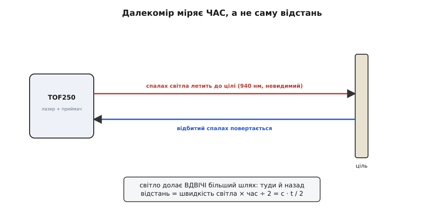
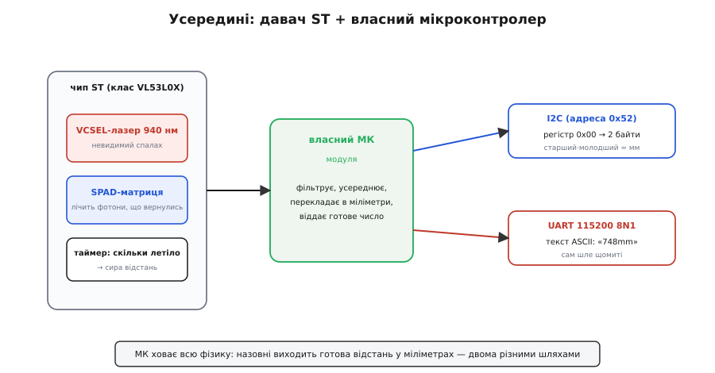
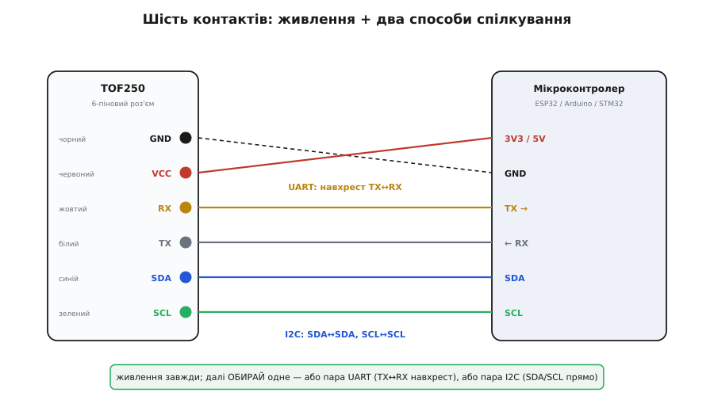

# TOF250 — лазерний далекомір

<preknowlist>
- [Шина I2C](root:com-devices/i2c-bus) — дві лінії SDA/SCL, ведучий і ведений, адреса пристрою, читання регістра; без цього не зрозуміти, як витягти відстань «регістром 0x00».
- [Асинхронна передача](root:com-devices/async-serial) — послідовний обмін по двох лініях TX/RX без спільного такту; потрібне, щоб зрозуміти UART-режим і навіщо TX із RX з'єднують навхрест.
- [Кадр UART](root:com-devices/uart-frame) — з чого складається байт у лінії (старт, дані, стоп) і що таке «115200 8N1»; на цьому тримається розбір потоку відстаней.
</preknowlist>

Візьміть у руки маленьку чорну платку з блискучим віконцем-об'єктивом і гребінкою на шість контактів. Наведіть її на стіну за метр — і по двох дротах вона щомиті каже вам число: `748`. Це відстань у міліметрах, і взялася вона не з ультразвуку й не з інфрачервоного відбиття «яскравіше-темніше», а з чесного заміру **часу, за який спалах світла злітав до стіни й повернувся**. Перед вами **TOF250** — компактний лазерний далекомір, побудований навколо давача часу прольоту (англ. *Time of Flight*, звідси й «TOF») від STMicroelectronics, з власним мікроконтролером на борту, який ховає всю фізику й віддає готову відстань.

Ця стаття — про те, як упізнати такий модуль, за яким принципом він міряє, що в нього всередині, як його під'єднати до мікроконтролера двома різними способами й на яких дрібницях найлегше спіткнутися.

### Чому «час прольоту», а не лінійка

Найдешевший спосіб «побачити» відстань — посвітити й подивитися, наскільки яскраво повернулося: близька перешкода відбиває більше, далека менше. Так працюють прості інфрачервоні давачі перешкоди — і так само легко обманюються: чорна стіна за 20 см відіб'є стільки ж, скільки біла за метр. Яскравість відбиття залежить від кольору й матеріалу цілі, а не лише від відстані, тож числа в сантиметрах з неї не витягнеш.

Час прольоту обходить цю пастку в корені. Світло має скінченну швидкість — приблизно **299 792 458 метрів за секунду**, і ця швидкість та сама для чорної стіни й для білої. Якщо запустити короткий спалах, дочекатися відбитого й **зміряти затримку**, то відстань залежить лише від цього часу, а від кольору цілі — майже ні. Темна ціль просто поверне менше фотонів, і давач мірятиме довше, але саме число відстані вийде те саме.

Уся хитрість — у масштабі часу. За метр і назад (два метри шляху) світло долає за:

```
t = 2 · d / c = 2 · 1 м / (3 · 10⁸ м/с) ≈ 6.7 · 10⁻⁹ с = 6.7 наносекунди
```

Шість наносекунд. Жоден звичайний мікроконтролер такого проміжку не зловить — за один його такт світло пролітає десятки метрів. Тому весь фокус лежить у спеціальній мікросхемі, здатній лічити такі крихітні затримки, і саме її STMicroelectronics поставила в основу своєї родини **FlightSense**.


*Далекомір насправді міряє не відстань, а час: скільки летів спалах туди й назад. Оскільки світло проходить подвійний шлях, зміряний час ділять навпіл. Швидкість світла однакова для будь-якої цілі — тому колір і матеріал стіни майже не впливають на результат.*

> 🔧 **Навіщо це.** Незалежність від кольору цілі — головна практична перевага такого далекоміра над інфрачервоним «на яскравість» і навіть над ультразвуковим. Робот під'їжджає до чорної меблі — ультразвук може її «не почути», якщо звук розсіявся вбік, а простий ІЧ вважатиме темну поверхню далекою. Лазерний далекомір часу прольоту дасть чесні міліметри до будь-якої достатньо матової перешкоди в межах свого діапазону.

### Що всередині: давач ST плюс власний мікроконтролер

Придивившись до плати, ви побачите два різні «мізки», і це ключ до розуміння модуля.

Перший — крихітна мікросхема ST із родини **FlightSense** (клас VL53L0X — того самого, на якому будують більшість недорогих ToF-далекомірів до двох метрів). У ній сховано все, що робить замір фізично можливим. **Джерело світла — VCSEL-лазер** (англ. *Vertical-Cavity Surface-Emitting Laser* — лазер із вертикальним резонатором, що світить перпендикулярно кристалу) на довжині хвилі **940 нанометрів**. Це ближній інфрачервоний діапазон: людське око його не бачить, тож ніякої червоної плями на стіні ви не помітите. За класифікацією лазерної безпеки (стандарт IEC 60825-1) він **клас 1** — безпечний за нормального користування, не треба захисних окулярів. Поряд із випромінювачем — **матриця SPAD** (англ. *Single-Photon Avalanche Diode* — лавинний фотодіод, що спрацьовує від одного-єдиного фотона): вона настільки чутлива, що лічить окремі частинки світла, які повернулися від цілі, і фіксує момент їхнього прильоту з точністю до частки наносекунди. Внутрішній таймер зіставляє «коли послали» й «коли повернулось» — і видає сиру відстань.

Другий мозок — **окремий мікроконтролер самого модуля**, розпаяний тут-таки на платі. Ось чим TOF250 відрізняється від голого давача ST: сама мікросхема VL53L0X спілкується лише по I2C і вимагає від хазяїна ганяти десятки внутрішніх регістрів, запускати заміри, тлумачити сирі відліки. Модульний мікроконтролер бере це все на себе — **безперервно запускає заміри, фільтрує й усереднює викиди, перекладає результат у прості міліметри** й виставляє його назовні у двох зручних форматах. Через це вам не треба знати нічого про нутрощі VL53L0X: ви питаєте модуль «скільки?» — і отримуєте число.


*Два «мізки» модуля. Мікросхема ST відповідає за фізику: світить лазером, лічить фотони, міряє час. Власний мікроконтролер модуля причісує сирий результат і віддає готову відстань у міліметрах — або як два байти в регістрі I2C, або як текстовий рядок по UART.*

### Звідки «250» у назві й що це за родина

Число в назві — це грубо максимальна дальність у сантиметрах. TOF250 упевнено міряє приблизно **від 5 см до 250 см** (2.5 метра) із похибкою близько **±5 %** на звичайних матових цілях у приміщенні. Поле зору вузьке — конус близько **25°**, тобто давач «бачить» невелику пляму прямо перед собою, а не всю кімнату. Заміри йдуть безперервно; типова частота оновлення — **близько 10 разів на секунду** (її можна підняти майже до 18 Гц ціною трохи більшого шуму).

TOF250 — представник цілої **родини сумісних модулів** з однаковою логікою підключення й спілкування. Поряд живуть [TOF10120](root:cat-hw-sensors/tof10120) (той самий інтерфейс, дальність до ~180 см) і серія TOF050F / TOF200F / TOF400F (50 см / 2 м / 4 м, у декотрих ще й режим MODBUS для промислового підключення). Число в назві завжди натякає на дальність: TOF050 — півметра, TOF400 — чотири метри. Довші варіанти (TOF400 і далі) будують уже на новішій мікросхемі VL53L1X, ближчі — на VL53L0X, як наш. Спільне в родини — принцип часу прольоту, невидимий лазер 940 нм, живлення 3.3–5 В і **той самий набір із шести контактів**, тож усе сказане тут про підключення й читання переноситься на сусідів майже дослівно.

Кілька меж, які варто тримати в голові з самого початку. По-перше, **пряме сонце — ворог**: потужне денне світло забиває приймач фоновими інфрачервоними фотонами, і дальність падає, а на вулиці опівдні давач може «осліпнути». По-друге, **скло й дзеркала обманюють**: прозоре скло світло здебільшого пропускає (побачите те, що за ним), а дзеркало відбиває промінь убік. По-третє, дуже **дрібна або гостра ціль** (тонкий дріт, кут столу) може просто не потрапити в 25-градусний конус або повернути замало світла.

### Шість контактів: живлення й два способи спілкування

Назовні модуль виводить рівно шість ніжок, зазвичай уже із припаяним шлейфом кольорових дротів. Кольори в цій родині усталені, і їх варто запам'ятати, бо на платі напис дрібний:

```
Колір дроту   Ніжка   Призначення
──────────────────────────────────────────────────
чорний        GND     земля
червоний      VCC     живлення 3.3–5 В
жовтий        RX      UART: прийом (сюди шле МК)
білий         TX      UART: передача (звідси читає МК)
синій         SDA     I2C: лінія даних
зелений       SCL     I2C: лінія такту
```

Живлення просте й невибагливе: **3.3–5 вольтів**, споживання скромне — близько **33 мА** у роботі, з короткими сплесками до ~40 мА під час спалаху лазера. Модуль однаково добре живиться і від 3.3-вольтової плати (ESP32, STM32, Pico), і від 5-вольтового Arduino; його лінії теж працюють у логіці живлення, тож окремий перетворювач рівнів здебільшого не потрібен — на відміну від багатьох 5-вольтових модулів, тут із 3.3-вольтовими платами все мирно.

А от далі — **розвилка**: TOF250 віддає ту саму відстань двома незалежними способами, і ви обираєте один.


*Живлення потрібне завжди — чорний у землю, червоний у 3.3–5 В. Далі обирають ОДИН канал. UART: жовтий (RX модуля) іде на TX мікроконтролера, білий (TX модуля) — на RX; лінії обов'язково навхрест. I2C: синій до SDA, зелений до SCL, прямо. Задіювати одразу обидва канали не потрібно.*

### Спосіб перший — I2C: спитати регістр 0x00

По I2C модуль поводиться як звичайний ведений із фіксованою адресою. У цій родині адреса — байт **0xA4**; оскільки шина I2C використовує старші сім бітів байта, у семибітному записі (той, що чекають бібліотеки на кшталт Arduino `Wire`) це **0x52**. Плутанина «0xA4 чи 0x52» — типове перше запитання новачка; насправді це те саме число у двох представленнях, і у `Wire.beginTransmission()` треба класти **0x52**.

Щоб дізнатися відстань, ведучий каже: «дай мені регістр 0x00» — і модуль повертає **два байти**: старший, потім молодший. Складені разом, вони дають 16-бітне число — відстань у міліметрах:

**Прочитати відстань по I2C (мм) на Arduino / ESP32.**
:::tabs
```cpp
#include <Wire.h>
#define TOF_ADDR 0x52          // 7-бітна адреса модуля (байт 0xA4 → 0x52)

int readDistanceMM() {
    Wire.beginTransmission(TOF_ADDR);
    Wire.write(0x00);                    // хочу читати з регістра 0x00 (відстань)
    if (Wire.endTransmission(false) != 0) // повторний старт, не відпускаючи шину
        return -1;                        // модуль не відповів

    Wire.requestFrom(TOF_ADDR, 2);        // очікую два байти
    if (Wire.available() < 2) return -1;

    uint16_t hi = Wire.read();            // старший байт
    uint16_t lo = Wire.read();            // молодший байт
    return (int)((hi << 8) | lo);         // мм
}

void setup() {
    Wire.begin();
    Serial.begin(115200);
}
void loop() {
    int mm = readDistanceMM();
    if (mm >= 0) { Serial.print(mm); Serial.println(" mm"); }
    delay(100);                           // ~10 разів на секунду
}
```
```micropython
from machine import I2C, Pin
import time

TOF_ADDR = 0x52          # 7-бітна адреса модуля (байт 0xA4 → 0x52)

i2c = I2C(0, scl=Pin(22), sda=Pin(21))

def read_distance_mm():
    try:
        i2c.writeto(TOF_ADDR, b"\x00")   # хочу читати з регістра 0x00 (відстань)
        data = i2c.readfrom(TOF_ADDR, 2) # очікую два байти
    except OSError:
        return -1                        # модуль не відповів
    hi, lo = data[0], data[1]            # старший, молодший байт
    return (hi << 8) | lo                # мм

while True:
    mm = read_distance_mm()
    if mm >= 0:
        print(mm, "mm")
    time.sleep_ms(100)                   # ~10 разів на секунду
```
```python
from smbus2 import SMBus, i2c_msg
import time

TOF_ADDR = 0x52          # 7-бітна адреса модуля (байт 0xA4 → 0x52)

def read_distance_mm(bus):
    try:
        write = i2c_msg.write(TOF_ADDR, [0x00])  # хочу читати з регістра 0x00 (відстань)
        read = i2c_msg.read(TOF_ADDR, 2)         # очікую два байти
        bus.i2c_rdwr(write, read)                # повторний старт, не відпускаючи шину
    except OSError:
        return -1                                # модуль не відповів
    hi, lo = list(read)                          # старший, молодший байт
    return (hi << 8) | lo                        # мм

with SMBus(1) as bus:
    while True:
        mm = read_distance_mm(bus)
        if mm >= 0:
            print(mm, "mm")
        time.sleep(0.1)                          # ~10 разів на секунду
```
:::

Зсув `hi << 8` піднімає старший байт на його місце, `| lo` домальовує молодший — і ви отримуєте, скажімо, `0x02EC` = 748 мм. Крім живого відліку, у модуля є ще регістр **усередненої (згладженої) відстані** — те саме число, але пропущене через внутрішній фільтр, щоб прибрати тремтіння окремих замірів; для стабільного показу на екрані він зручніший, ніж «сирий» 0x00.

### Спосіб другий — UART: модуль сам диктує число

Друга особистість модуля ще простіша. У режимі UART TOF250 **за замовчуванням сам, без запиту, безперервно шле відстань** по лінії TX звичайним текстом на швидкості **115200 8N1** (115200 біт/с, 8 біт даних, без парності, один стоп-біт). У порт летять ASCII-символи — десяткове число й закінчення на кшталт `mm` із переходом рядка. Тобто мікроконтролеру навіть не треба нічого запитувати: він просто слухає лінію й вибирає з потоку цифри.

Тут криється **головна пастка UART-режиму — перехрещення ліній**. Передавальна ніжка модуля (TX, білий) мусить іти на **приймальну** ніжку мікроконтролера (RX), а приймальна модуля (RX, жовтий) — на **передавальну** мікроконтролера (TX). З'єднаєте «однойменне з однойменним» (TX із TX) — і не отримаєте ні байта, хоча живлення й світить лазер. Це найчастіша причина мовчання в UART-режимі, і плутають її регулярно.

Мінімальний скетч, розбір рядка з потоку в число, коректний вибір апаратного `Serial` замість програмного (на 115200 програмна емуляція часто не встигає й сипле сміттям), а також перемикання між активним «сам шле» і пасивним «шли лише на запит» режимами винесено в окремий [приклад коду для TOF250](root:cat-hw-sensors/tof250/api-tof250-api.md): там і читання по I2C, і розбір UART-потоку, і як обрати між сирою й згладженою відстанню, і типові граблі на кшталт «числа приходять, але злиплі».

### Чого стерегтися

Зберемо докупи місця, де найлегше застрягти.

**Адреса I2C.** Це `0x52` у семибітному записі (він же байт `0xA4`). Якщо бібліотека мовчить — перш ніж винити плату, переконайтеся, що поклали саме `0x52`, а не `0xA4` чи `0x29`.

**Перехрестя UART.** TX модуля → RX мікроконтролера, RX модуля → TX мікроконтролера. Ніколи не «прямо». І беріть апаратний UART: на 115200 програмний послідовний порт часто захлинається.

**Один канал за раз.** Вам не треба чіпляти одночасно і I2C, і UART. Оберіть спосіб під задачу: I2C зручний, коли на шині вже висять інші давачі й ви хочете опитувати їх на вимогу; UART зручний, коли треба простий потік чисел в один провід і мінімум коду.

**Умови сцени.** Пряме сонце скорочує дальність або сліпить давач; скло пропускає промінь наскрізь, дзеркало відводить убік; вузький 25-градусний конус може проґавити тонку чи скісну ціль. Для надійності цільте в матову поверхню, приблизно перпендикулярну променю.

**Не плутати з ультразвуком.** Зовні лазерний далекомір і [ультразвуковий HC-SR04](root:cat-hw-sensors/hc-sr04) розв'язують ту саму задачу, але фізика різна: ультразвук міряє час польоту **звуку** (сотні метрів за секунду, широкий конус, дешево, але грубо й повільно), а TOF250 — час польоту **світла** (вузький промінь, міліметри, десятки замірів на секунду). Для точного наведення в межах двох метрів світло виграє; для «є щось велике попереду» на кілька метрів у широкому секторі часто досить дешевшого ультразвуку.

### Що варто запам'ятати

TOF250 — це маленький лазерний далекомір на давачі часу прольоту від STMicroelectronics (клас VL53L0X) із власним мікроконтролером, що віддає готову відстань у міліметрах. Міряє він **час, за який невидимий інфрачервоний спалах (940 нм, безпечний клас 1) злітав до цілі й повернувся**, тому результат майже не залежить від кольору перешкоди — головна перевага над інфрачервоним «на яскравість». Дальність — приблизно **5–250 см**, поле зору — вузький конус ~25°, оновлення — близько 10 разів на секунду.

Підключення зводиться до шести кольорових дротів: живлення 3.3–5 В (чорний GND, червоний VCC) плюс **один із двох каналів** на вибір. По **I2C** (синій SDA, зелений SCL, адреса `0x52`) відстань читають із регістра `0x00` як два байти. По **UART** (жовтий RX, білий TX, `115200 8N1`) модуль сам безперервно диктує число текстом — головне з'єднати TX із RX **навхрест**. Три речі, на яких горять найчастіше: неправильне представлення адреси (`0x52`, не `0xA4`), пряме замість перехрещеного з'єднання UART, і замір крізь скло чи проти сонця. Оминувши їх, ви змусите модуль давати чесні міліметри за кілька хвилин.
