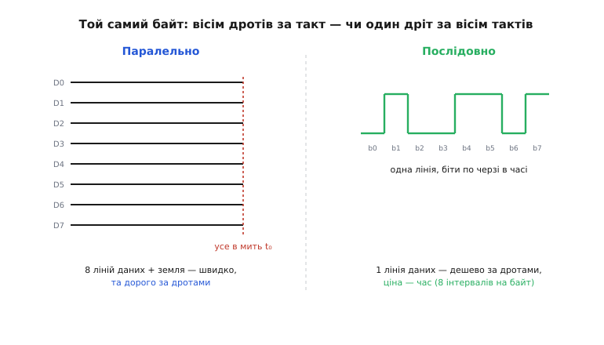
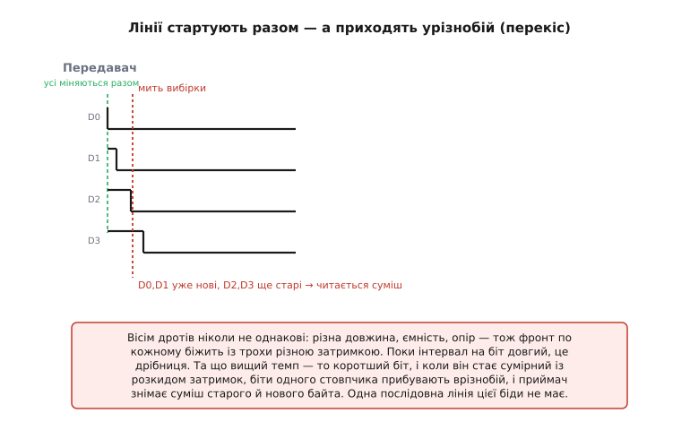
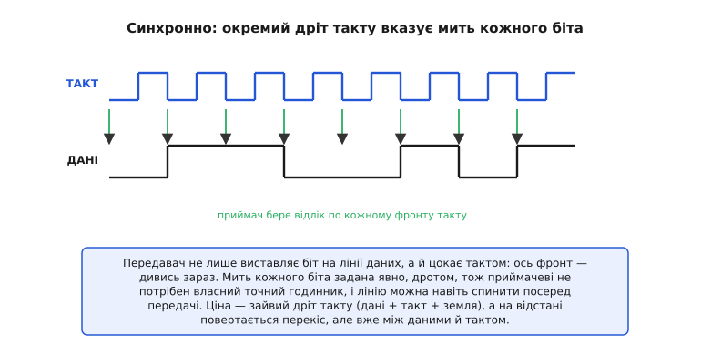
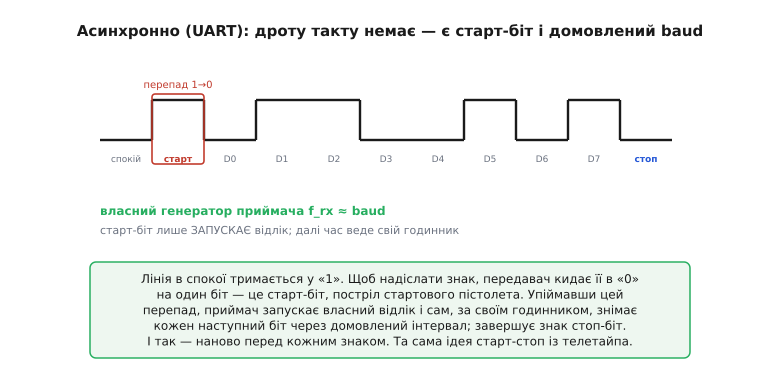
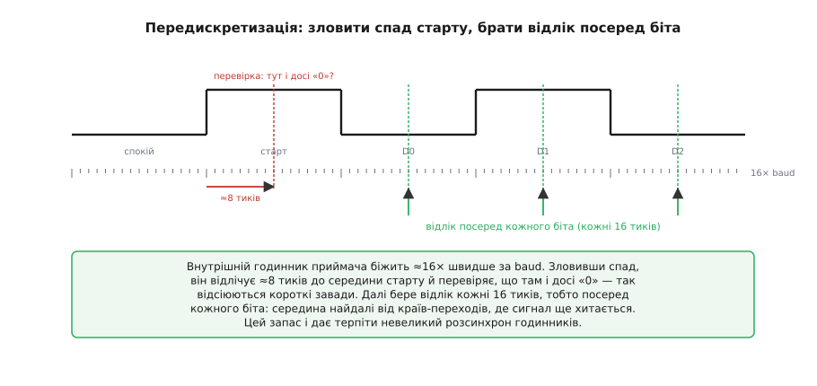
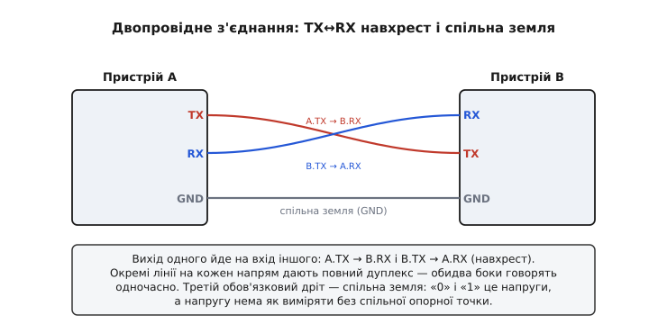
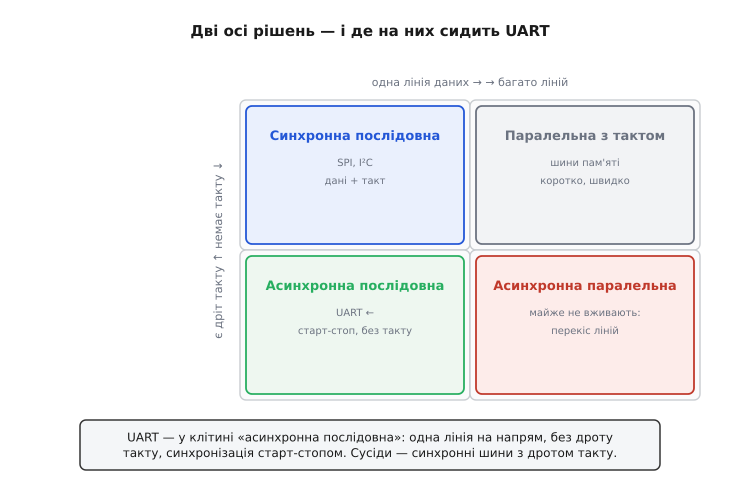

# Асинхронна передача

Уся ця тема — про два рішення, які приймає за тебе послідовний порт, щойно ти його відкриваєш, і які пояснюють геть усе подальше. Уяви найпростіше завдання: перекинути один **байт** — вісім біт — з мікросхеми A в мікросхему B по дротах. Здавалося б, дрібниця. Та вже тут доводиться відповісти на два глибокі питання. **Перше:** вісім біт надіслати **усі разом** (кожен своїм дротом) чи **один за одним** (усі по одному дроту, але в часі)? **Друге:** як приймач дізнається, **коли саме** дивитися на лінію, щоб упіймати кожен біт? UART (*Universal Asynchronous Receiver-Transmitter* — універсальний асинхронний приймач-передавач) дає на ці питання конкретні відповіді — «послідовно» й «асинхронно», — і обидві варто зрозуміти до кісток, бо з них випливає і кількість дротів, і швидкість **baud**, і навіть класичні помилки новачка.

### Паралельно чи послідовно: дроти проти часу

Байт — це вісім біт. Найочевидніший спосіб перекинути його швидко — дати кожному біту **свій дріт** і виставити всі вісім рівнів одночасно. Це **паралельна** передача (*parallel*): за один такт переходить цілий байт. Саме так працювали ранні комп'ютерні шини, старі принтерні порти й досі працюють внутрішні шини пам'яті — там, де дроти короткі, а швидкість критична.

Альтернатива — пустити всі вісім біт **одним** дротом, **один за одним** у часі: спершу перший біт, потім другий, і так усі вісім. Це **послідовна** передача (*serial*): один провідник, але вісім часових інтервалів на байт.


*Той самий байт двома способами. Ліворуч (паралельно): вісім ліній D0…D7 несуть свої біти одночасно, приймач знімає весь байт у мить t₀ — швидко, але це 8 ліній плюс земля. Праворуч (послідовно): одна лінія, по якій біти йдуть по черзі в часі — дротів менше, ціна — час.*

На перший погляд паралель — очевидний переможець: цілий байт за такт проти восьми тактів. Та в реальному пристрої вирішують не лише такти. По-перше, **дроти коштують**. Кожна паралельна лінія — це окремий **вивід** (*pin*) на корпусі мікросхеми, а виводи — найдефіцитніший ресурс мікроконтролера. Восьмибітна паралельна шина з'їдає вісім ніжок лише на дані, та ще керувальні лінії й землю — десяток виводів на один периферійний пристрій. Послідовна лінія обходиться **однією** лінією даних на напрямок плюс спільна земля.

> 🔧 **Навіщо це.** Це питання «бюджету ніжок». У типового мікроконтролера лише кілька десятків придатних виводів, і витратити десять із них на один давач — розкіш, якої ніхто не дозволить. Саме послідовні лінії дають змогу маленькому чіпу спілкуватися з десятком периферій: кожна забирає одну-дві ніжки, а не порт цілком. Коли проєктуєш плату, ти майже завжди обираєш послідовний інтерфейс не тому, що він «гарніший», а тому, що **ніжок банально не вистачає** на паралельний.

**Порахуймо, скільки дротів насправді.** Порівняймо, у що обходиться перекинути байти між мікроконтролером і периферійним чіпом:

```
паралельна 8-бітна шина : 8 даних + 1 строб + 1 земля        = 10 дротів
синхронна послідовна    : 1 дані + 1 такт + 1 земля           = 3 дроти
асинхронна (UART)        : 1 TX + 1 RX + 1 земля               = 3 дроти (і одразу двобічна!)
```

Різниця в три з гаком рази — і це лише для **одного** периферійного пристрою. Якщо їх кілька, паралельна шина або множить дроти, або змушує городити складне розділення спільної шини; послідовні ж лінії дешево масштабуються. Уже звідси видно, чому світ малих систем — послідовний.

### Чому паралель програє навіть у швидкості: перекіс

Можна було б подумати, що паралель — це «дорого, зате швидко», і там, де швидкість важливіша за дроти, перемагає вона. Дивовижно, але **ні**: на високих швидкостях і відстанях паралель програє послідовній лінії не лише ціною, а й **самою швидкістю**. Винний у цьому ефект на ім'я **перекіс** (*skew*).

Річ у тім, що вісім паралельних дротів ніколи не бувають абсолютно однакові: вони трохи різної довжини, з трохи різною ємністю й опором, тож сигнал по кожному біжить із трохи різною затримкою. Поки біт «довгий» (тобто інтервал на один біт набагато більший за розкид цих затримок), це не біда — усі біти встигають усталитися задовго до моменту вибірки. Але що вищий темп, то **коротший** інтервал на біт — і коли він стає сумірним із розкидом затримок, біти одного «стовпчика» починають прибувати **врізнобій**.


*На передавачі всі біти міняються одночасно (зелена лінія). Та на приймачі їхні фронти розповзаються через різні затримки ліній. У мить вибірки D0 і D1 уже перемкнулися на нові значення, а D2 і D3 — ще ні: приймач читає суміш старого й нового байта і отримує сміття. Що вищий темп — то коротший біт і тим згубніший перекіс.*

Ось чому паралельну шину неможливо без кінця прискорювати: рано чи пізно інтервал на біт впирається в перекіс ліній, і далі — лише помилки. А **одна** послідовна лінія цієї біди не має взагалі: міжлінійного перекосу немає, бо лінія одна, тож її можна тактувати незрівнянно вище. Саме тому майже всі сучасні швидкі інтерфейси — USB, SATA, PCIe, Ethernet — попри інтуїцію «паралель = швидше», зроблені **послідовними**. Додайте сюди ще й **перехресні завади** (*crosstalk*) між тісними паралельними доріжками — і стане ясно, чому індустрія масово пішла в серіал.

> 🔧 **Навіщо це.** Запам'ятай цей контрінтуїтивний факт: **на відстані послідовне — швидше**. Він рятує від типової помилки «зроблю паралельно, щоб було швидко». Для зв'язку між платами, по кабелю, на будь-якій помітній швидкості правильна відповідь майже завжди — послідовна лінія. Паралель лишилася тільки там, де дуже коротко й дуже синхронно (всередині чіпа чи між сусідніми чіпами пам'яті).

### Дві відповіді на питання «де біт»: такт чи домовленість

Отже, передаємо послідовно: біти біжать одним дротом один за одним. Та одразу постає друге, тонше питання. Приймач бачить на лінії напругу, що то піднімається, то падає. Як йому зрозуміти, **де закінчується один біт і починається наступний** — коли саме знімати відлік? Якщо «дивитися» не в ті моменти, можна порахувати один біт двічі або проґавити інший. На це є **дві** принципово різні відповіді, і вибір між ними — друге велике рішення UART.

**Відповідь перша — синхронна.** Пустити поряд із даними **окремий дріт такту** (*clock*). Передавач не лише виставляє біт на лінії даних, а й «цокає» тактом: ось фронт — дивись зараз. Приймач знімає відлік строго по фронту такту й ніколи не помиляється з моментом.


*Синхронна передача: лінія ТАКТ цокає, лінія ДАНІ несе біти, і приймач бере відлік по кожному фронту такту (зелені стрілки). Мить кожного біта задана явно, дротом — приймачеві не треба власного точного годинника. Ціна — зайва лінія: дані + такт + земля. Так влаштовані [синхронні послідовні шини](topic:com-devices/spi-bus).*

Це надійно й просто до краси: працює на будь-якій швидкості, її можна навіть зупинити посеред байта — приймач просто чекає наступного цокання. Ціна — **зайвий дріт** (такт), а на відстані ще й повертається той самий перекіс, але вже між даними й тактом.

**Відповідь друга — асинхронна.** Не тягти дроту такту взагалі. Натомість обидві сторони **наперед домовляються про швидкість** — скільки сигнальних одиниць за секунду, тобто **baud** (одиниця названа на честь телеграфіста Еміля Бодо; докладніше — у [телеграфному родоводі цього кадру](topic:com-devices/async-serial/hist-baudot.md)). Лінія в спокої тримається у «1»; коли треба надіслати знак, передавач кидає її в «0» на один біт — це **старт-біт**, сигнал «увага, знак почався». Упіймавши цей перепад, приймач запускає **власний** відлік часу й сам, за своїм годинником, знімає кожен наступний біт через домовлений інтервал; завершує знак **стоп-біт**. І так — наново перед **кожним** знаком.


*Асинхронна передача (UART): лінія даних — одна, дроту такту немає. Старт-біт (перепад 1→0) лише запускає відлік; далі приймач веде час власним генератором f_rx, налаштованим приблизно на ту саму швидкість, що й передавач. Синхронізація відбувається наново щознаку — рівно та сама ідея старт-стоп із телетайпа.*

Це і є вибір UART: **асинхронна послідовна** лінія. Сам термін це й проговорює: «асинхронна» (грец. *a-* — «без» + *syn-chronos* — «спільний час») означає лінію **без спільного такту**. Виграш величезний — лише дві лінії даних (TX і RX) плюс земля, жодного дроту такту. Ціна теж конкретна: обидві сторони мусять мати **власний досить точний годинник** і **наперед збігтися у швидкості**. Не збіглися — приймач відлічуватиме біти не в тому темпі, відліки «попливуть», і замість тексту полізе сміття.

> 🔧 **Навіщо це.** Ось чому `Serial.begin(9600)` ти пишеш на **обох** кінцях лінії й чому найперша підозра, коли в моніторі замість слів крякозябри, — **різний baud**. UART не передає свого такту дротом; він покладається на те, що твій годинник і годинник співрозмовника однаково розуміють, що таке «9600 біт за секунду». Це й робить його таким дешевим (два дроти) і водночас таким вимогливим до попередньої домовленості.

### Як приймач знаходить біти без дроту такту

Лишилося пояснити механізм, який робить асинхронність надійною: як саме приймач, не маючи дроту такту, влучає точно в кожен біт? Секрет — у **передискретизації** (*oversampling*). Внутрішній тактовий генератор приймача біжить набагато швидше за швидкість передачі — типово в **16 разів**. Тобто на кожен біт припадає близько шістнадцяти внутрішніх «тиків».


*Приймач стежить за лінією на швидкості ≈16× baud. Зловивши спад (старт-біт), він відлічує ≈8 тиків до середини старту й перевіряє, що там і досі «0» (так відсіюються короткі завади). Далі він знімає відлік кожні 16 тиків — тобто посередині кожного біта. Середина — найдалі від обох країв, де сигнал уже точно усталився.*

Логіка така. Поки лінія в спокої («1»), приймач чекає. Щойно з'являється спад до «0» — це, можливо, старт-біт. Приймач відлічує половину біта (≈8 тиків із 16) і дивиться: якщо посередині все ще «0» — старт справжній (а якби це була коротка завада, лінія вже повернулася б у «1», і хибний старт відкидається). Переконавшись, приймач далі знімає відлік **через кожні 16 тиків** — і щоразу влучає точно в **середину** чергового біта. Чому посередині? Бо краї біта — місце переходів, де сигнал ще хитається; а середина найстабільніша й найдалі від сусідів. Ця ж передискретизація дає змогу терпіти невеликий розсинхрон годинників: навіть якщо твій годинник трохи «бреше», відлік усе одно лишається в межах правильного біта.

> 🔧 **Навіщо це.** Вибірка посередині біта плюс передискретизація — це причина, чому UART так стійко працює, попри те, що годинники двох пристроїв ніколи не ідентичні, а на лінії трапляються короткі викиди. Наскільки саме можуть розійтися годинники, поки відлік не «з'їде» у сусідній біт, — це питання **допуску на розсинхрон**, яке прив'язане до [узгодженої швидкості baud](topic:com-devices/baud-rate) і піддається точному підрахунку. Тут досить розуміти **механізм**: старт ловить початок, середина біта дає стабільний відлік.

### Той самий байт у коді: один такт лінії

Щоб «послідовно й асинхронно» перестало бути абстракцією, перекиньмо один байт **самотужки**, шарпаючи ногою мікроконтролера, без апаратного UART. Це й називають програмною емуляцією (*bit-banging*): сам ставиш на вивід «0» чи «1» і сам витримуєш час кожного біта. Тут видно обидва наші рішення водночас — біти йдуть **по одному дроту в часі** (послідовно), а ритм тримає **власна затримка**, а не дріт такту (асинхронно).

Уся арифметика — в одному числі: скільки тривати кожному біту. Воно прямо випливає з baud.

**Умова.** Передаємо байт `0x41` (літера «A») на швидкості 9600 бод, кадр «8N1» — старт + 8 біт даних + 1 стоп, без парності. Знайдемо тривалість біта й випишемо порядок рівнів на лінії.

```
тривалість одного біта = 1 / 9600 бода ≈ 104.17 мкс
0x41 = 0100 0001b ;  UART шле молодшим бітом уперед (LSB first)
порядок на лінії:  старт(0) 1 0 0 0 0 0 1 0 стоп(1)
                          └ біти 0x41 від D0 до D7 ┘
```

Тепер той самий порядок — робочим C для типового мікроконтролера: ставимо рівень і чекаємо рівно один біт.

:::tabs
```cpp
#define BIT_US (1000000UL / 9600UL)   /* 104 мкс на біт при 9600 бод */

void uart_tx_byte(uint8_t b) {
    gpio_write(TX_PIN, 0);            /* старт-біт: лінія йде в «0» */
    delay_us(BIT_US);
    for (uint8_t i = 0; i < 8; i++) { /* 8 біт даних, молодший уперед */
        gpio_write(TX_PIN, b & 1);
        delay_us(BIT_US);
        b >>= 1;
    }
    gpio_write(TX_PIN, 1);            /* стоп-біт: лінія назад у спокій «1» */
    delay_us(BIT_US);
}
```
```micropython
from machine import Pin
import time

BIT_US = 1000000 // 9600            # 104 мкс на біт при 9600 бод
tx = Pin(TX_PIN, Pin.OUT)

def uart_tx_byte(b):
    tx.value(0)                     # старт-біт: лінія йде в «0»
    time.sleep_us(BIT_US)
    for _ in range(8):              # 8 біт даних, молодший уперед
        tx.value(b & 1)
        time.sleep_us(BIT_US)
        b >>= 1
    tx.value(1)                     # стоп-біт: лінія назад у спокій «1»
    time.sleep_us(BIT_US)
```
:::

**Висновок.** Десяток рядків коду — і ось він, увесь UART-передавач: один старт-біт, вісім бітів даних молодшим уперед, один стоп-біт, і між кожним — та сама затримка на `BIT_US`. Приймач на тому кінці робить дзеркальне: ловить спад старту й сам відлічує ті самі ≈104 мкс до середини кожного біта. Більш нічого в «послідовно й асинхронно» немає — лише один дріт, по якому біти йдуть у часі, і дві сторони, що наперед домовилися про довжину біта.

### Як це виглядає на столі: TX, RX і спільна земля

Перекладімо все це на дроти між двома реальними пристроями. У кожного є вивід **TX** (*transmit* — передавач, **вихід**) і вивід **RX** (*receive* — приймач, **вхід**). Очевидне, але вкрай важливе правило: вихід одного має йти на вхід іншого. Тобто **TX першого — на RX другого**, а **TX другого — на RX першого**. З'єднання йде **навхрест** (*crossover*).


*Два пристрої з'єднують навхрест: A.TX → B.RX і B.TX → A.RX. Оскільки лінії розділені, обидва напрямки працюють одночасно — це повний дуплекс (*full duplex*). Третя обов'язкова лінія — спільна земля: рівні «0» і «1» — це напруги, а напругу нема як виміряти без спільної опорної точки.*

Окремі лінії на кожен напрямок дають приємний бонус: пристрої можуть говорити **одночасно** в обидва боки, не чекаючи одне на одного, — це **повний дуплекс** (*full duplex*): одна лінія тільки передає, друга тільки приймає, тож вони не заважають одна одній. А ще зверни увагу на третій дріт — **спільну землю** (*GND*). Без неї нічого не працюватиме, і ось чому: «0» і «1» у цифровій лінії — це [рівні **напруги**](topic:hw-digital/logic-levels-as-ranges), а напруга завжди вимірюється **відносно** чогось. Якщо в двох пристроїв нема спільної опорної точки, приймач просто не має відносно чого судити, де «високо», а де «низько».

> 🔧 **Навіщо це.** Найчастіша помилка новачка — з'єднати **TX із TX**: обидва пристрої тоді кричать у вихід один одному, і нічого не чують. Друга за частотою біда — **забути спільну землю**, особливо коли пристрої живляться від різних джерел: лінія начебто з'єднана, а в моніторі хаос. Запам'ятай мінімальний послідовний кабель: **TX, RX, GND** — три дроти, TX і RX навхрест, земля спільна. Це врятує не одну годину налагодження.

### Карта світу послідовних ліній

Відступімо на крок і складемо все докупи. Ми зробили два незалежні вибори: **послідовно** (а не паралельно) і **асинхронно** (а не синхронно). Ці дві осі задають просту карту, на якій UART займає своє місце — і видно, де живуть його сусіди.


*Дві осі рішень. По горизонталі — скільки ліній даних (одна чи багато); по вертикалі — чи є окремий дріт такту. UART сидить у клітині «асинхронна послідовна»: одна лінія на напрям, без дроту такту, синхронізація старт-стопом. Синхронні послідовні шини (з дротом такту) — у сусідній клітині; паралель із тактом лишилася для коротких швидких шин; а асинхронна паралель майже не вживається, бо перекіс ліній робить її марною.*

Ця карта — дороговказ по всьому світу послідовних ліній. UART — це **асинхронна послідовна** лінія: гранично дешева за дротами, зате вимоглива до попередньої домовленості про швидкість. Сусідня клітина — [**синхронні** послідовні шини](topic:com-devices/spi-bus), де повертається дріт такту, але натомість зникає потреба тримати точні годинники й домовлятися про baud. У кожного підходу — своя ціна й своя сфера, і знати цю карту означає правильно обирати інтерфейс під задачу.

Коли зрозуміло, **чому** UART послідовний і асинхронний, природно постає питання, **з чого саме** складається той [кадр UART](topic:com-devices/uart-frame), що біжить лінією: де там старт-біт, скільки біт даних, навіщо біт парності й що таке стоп-біт.

---
