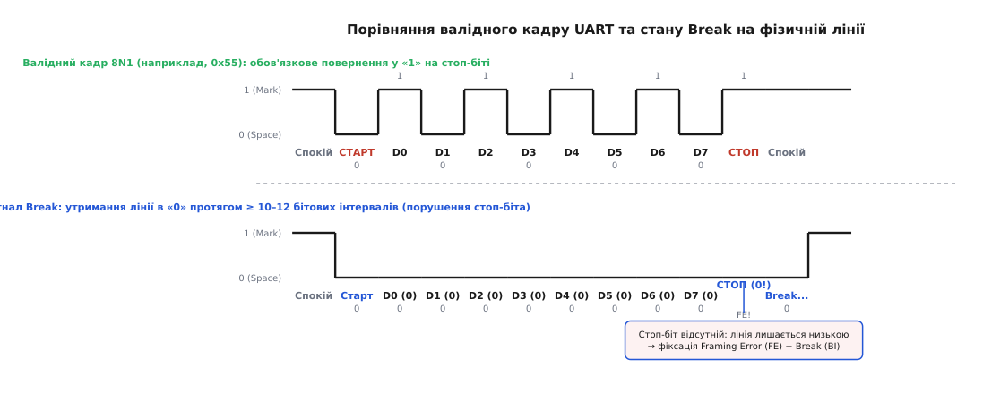
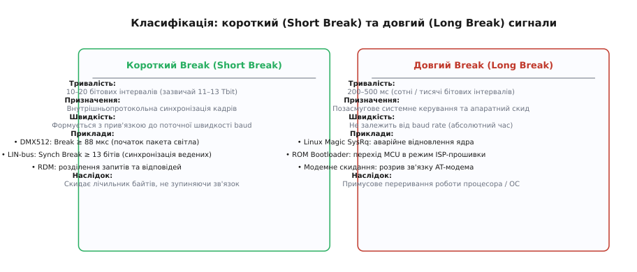
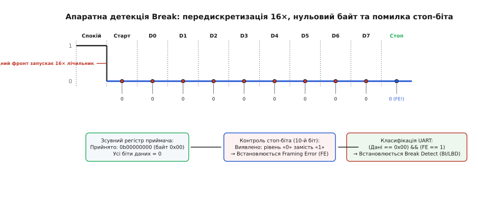
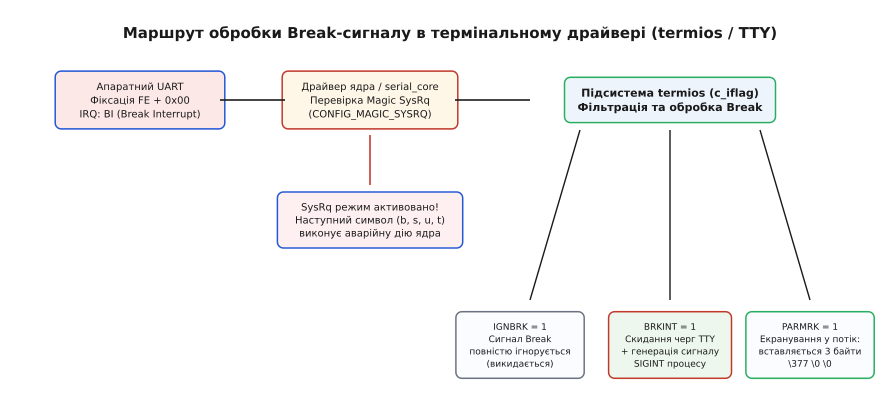
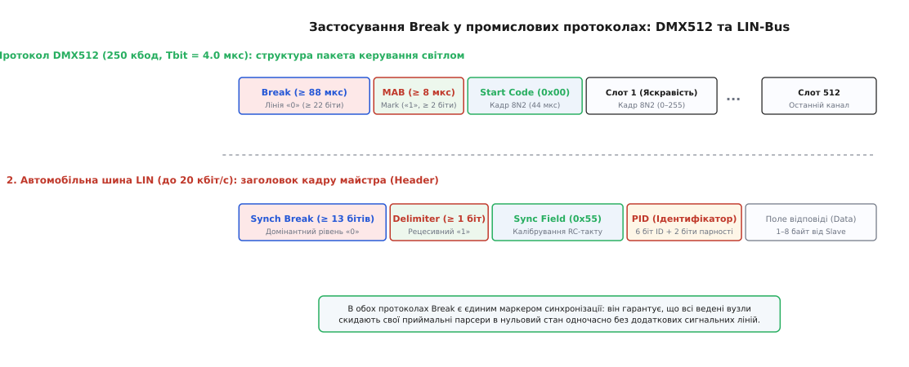

# Break-сигнал UART

<preknowlist>
- [Асинхронна послідовна передача](topic:com-devices/async-serial) — як приймач і передавач узгоджують бітові інтервали без окремої лінії тактового сигналу.
- [Кадр UART](topic:com-devices/uart-frame) — будова стандартного знака на лінії: старт-біт, біти даних, біт парності та стоп-біт високого рівня.
- [Швидкість baud](topic:com-devices/baud-rate) — тривалість одного бітового інтервалу й розрахунок часових характеристик лінії.
- [Шина LIN](topic:com-devices/lin-bus) — однопровідна автомобільна шина на базі UART, що використовує сигнал Break для синхронізації ведених вузлів.
- [Магічний SysRq](topic:sys-unix/magic-sysrq) — механізм ядра Linux для аварійного керування системою через послідовну консоль.
</preknowlist>

Коли послідовна асинхронна лінія втрачає синхронізацію через імпульсну заваду чи збій тактового генератора, приймач починає нарізати потік бітів на кадри з випадковим зсувом фази. Усередині такого розсинхронізованого потоку будь-який надісланий передавачем службовий символ — чи то нульовий байт `0x00`, чи код скидання `0xFF`, чи керуюча послідовність ASCII — буде розірваний на частини й проковтнутий приймачем як звичайне корисне навантаження. Оскільки лінія UART не має окремого дроту тактування чи апаратного сигналу стробування кадрів, передача даних усередині звичайного байтового алфавіту принципово не здатна вивести приймальний автомат із глухого кута. Щоб гарантовано примусити обидві сторони скинути стан і повернутися до спільної точки відліку, потрібен фізичний сигнал поза смугою передачі даних — стан, який не може утворитися за жодної комбінації валідних бітів.

Цим позасмуговим примітивом є **сигнал Break** (з англ. *UART Break Condition* або *Line Break* — стан розриву лінії). Він полягає у навмисному й тривалому утриманні сигнальної лінії передачі в домінантному низькому логічному рівні протягом інтервалу, що суттєво перевищує повну тривалість стандартного кадру.

Уся подальша робота протоколів освітлення DMX512, автомобільних мереж LIN, системних аварійних консолей Linux Magic SysRq та внутрішньосхемних завантажувачів мікроконтролерів спирається на цей простий фізичний факт: якщо лінія не повертається у високий рівень на позиції стоп-біта, це не помилка зв'язку, а категорична команда почати все заново.

---

### Фізична природа та анатомія Break на лінії

У стані спокою (англ. *Idle*) лінія передачі UART постійно утримується у високому логічному рівні. В термінології послідовного зв'язку цей рівень називають **Mark** (з англ. *mark* — мітка, рівень логічної «1», напруга VCC у TTL/CMOS логіці або від -3V до -15V у стандарті [RS-232](topic:com-medium/rs485-multidrop-bus)). Низький рівень називають **Space** (з англ. *space* — пропуск, рівень логічного «0», 0V у TTL або від +3V до +15V у RS-232).

Будь-який стандартний кадр UART (наприклад, поширений формат 8N1) підпорядковується залізному часовому контракту:
1. Кадр починається зі спадного фронту — переходу лінії з високого рівня в низький, який формує **старт-біт** тривалістю в 1 бітовий інтервал (`Tbit = 1 / baud`).
2. Далі передаються біти корисних даних (від D0 до D7, молодшим бітом уперед).
3. Після даних може йти необов'язковий біт парності.
4. Кадр **обов'язково** завершується **стоп-бітом** (або двома стоп-бітами), під час якого лінія **повертається у високий рівень Mark (логічну «1»)** щонайменше на 1 бітовий такт.

З цього правила випливає фундаментальне обмеження: за будь-якого значення байта даних лінія не може безперервно залишатися у стані логічного нуля довше, ніж триває старт-біт разом із бітами даних. Навіть якщо передається байт `0x00` (вісім нулів підряд) без біта парності, низький рівень утримується рівно `1 + 8 = 9` бітових інтервалів. На 10-му бітовому інтервалі передавач зобов'язаний підняти лінію у високий рівень для формування стоп-біта.


*Порівняння стандартного кадру 8N1 для байта 0x55 та сигналу Break на фізичній лінії. У валідному кадрі стоп-біт обов'язково повертає напругу до високого рівня Mark. У стані Break лінія утримується в нулі понад 10–12 бітових інтервалів, порушуючи стоп-біт.*

Якщо передавач навмисно утримує лінію TX у нульовому стані Space протягом **10, 11, 12 або більше бітових інтервалів підряд**, він порушує контракт кадрування. Це тривале перебування лінії в нулі й називається **сигналом Break**.

Історично ця назва виникла в епоху механічних телетайпів, де спеціальна клавіша буквально розривала струмову петлю зв'язку. Детальний екскурс у механіку телеграфних апаратів наведено у вставці [історія клавіші Break: від струмової петлі телетайпа до цифрового UART](topic:com-devices/break-signal-uart/hist-break-key.md).

---

### Осцилографічний аналіз: як виглядає Break на різних фізичних рівнях

На екрані цифрового осцилографа або логічного аналізатора вигляд сигналу Break залежить від використовуваного фізичного трансивера:

1. **TTL / CMOS логіка (UART 3.3V або 5V)**:
   - Спокій (Mark): постійна напруга `+3.3V` (або `+5.0V`).
   - Сигнал Break: напруга падає до `0.0V` і залишається нульовою протягом усього часу розриву.
   - Повернення у спокій: крутий підйом до `+3.3V` (MAB або Idle).

2. **Інтерфейс RS-232 (інвертована логіка напруги)**:
   - Спокій (Mark / «1»): негативна напруга від `-5V` до `-12V`.
   - Сигнал Break (Space / «0»): позитивна напруга від `+5V` до `+12V`.
   - Зміна полярності при Break є прямою протилежністю TTL-рівням, що забезпечується мікросхемами драйверів (наприклад, MAX232).

3. **Диференціальний інтерфейс RS-485 (протокол DMX512 / RDM)**:
   - Сигнал передається парою провідників `Data+` (лінія A) та `Data-` (лінія B).
   - Спокій (Mark / «1»): напруга на лінії `A` вища за напругу на лінії `B` (`VA - VB > +200 мВ`).
   - Сигнал Break (Space / «0»): трансивер змінює полярність, і напруга на лінії `A` стає нижчою за лінію `B` (`VA - VB < -200 мВ`) щонайменше на 88 мікросекунд.

---

### Три інженерні підходи до генерації Break у прошивці

Коли перед розробником постає завдання згенерувати сигнал Break у мікроконтролері, на практиці застосовують один із трьох інженерних підходів, кожен із яких має свої переваги та межі застосування:

```
┌─────────────────────────┬───────────────────────────────┬────────────────────────────────────────┐
│ Метод генерації         │ Принцип роботи                │ Сфера застосування та обмеження       │
├─────────────────────────┼───────────────────────────────┼────────────────────────────────────────┤
│ 1. Апаратний біт SBK    │ Запис 1 у регістр CR1/LCR.    │ Протокол LIN, стандартні кадри 10–13   │
│    (Send Break)         │ Контролер сам шле 10–11 нулів │ бітів. Не підходить для довгих пауз.   │
├─────────────────────────┼───────────────────────────────┼────────────────────────────────────────┤
│ 2. Тимчасовий перехід   │ Пін TX перемикається в GPIO   │ Протокол DMX512, прецизійні мікросе-   │
│    у режим GPIO Output  │ Output Low, таймер міряє час. │ кундні паузи. Вимагає чистоти черги.  │
├─────────────────────────┼───────────────────────────────┼────────────────────────────────────────┤
│ 3. Хитрість із занижен- │ Швидкість baud ділиться на 2, │ USB-UART мости без прямого GPIO-       │
│    ням швидкості baud   │ і шлеться звичайний байт 0x00 │ контролю. Генерує еквівалент 18 бітів. │
└─────────────────────────┴───────────────────────────────┴────────────────────────────────────────┘
```

1. **Апаратний біт `SBK` (Send Break)**:
   Найпростіший спосіб. Програма записує одиницю у відповідний біт конфігурації UART. Апаратний блок самостійно формує послідовність нульових бітів фіксованої довжини (10 бітів для 8-бітного кадру або 11 бітів для 9-бітного), після чого генерує стоп-біт і автоматично скидає біт `SBK`. Цей метод ідеально підходить для шини LIN, але непридатний для DMX512, де потрібна тривалість у 22 біти.

2. **Тимчасовий перехід виводу TX у режим GPIO**:
   Найбільш універсальний та точний метод для мікроконтролерів. Дочекавшись завершення передачі останнього байта (прапорець `TC=1`), програма змінює конфігурацію мультиплексора виводів GPIO, притискає пін до землі через звичайний регістр виводу на потрібну кількість мікросекунд (за таймером), потім піднімає його в одиницю на час MAB і повертає альтернативну функцію UART.

3. **Програмна хитрість із заниженням швидкості baud (Baud Rate Halving)**:
   Якщо пристрій підключений через простий апаратний USB-перетворювач, який не підтримує точного мікросекундного біт-бенгінгу, застосовують математичний трюк: швидкість порту тимчасово зменшують удвічі (наприклад, зі 250 кбод до 125 кбод) і відправляють звичайний байт `0x00`. Для віддаленого приймача, який продовжує працювати на швидкості 250 кбод, цей один низькошвидкісний байт виглядає як суцільний низький рівень тривалістю рівно 18–20 швидких бітових інтервалів, що сприймається як бездоганний сигнал Break.

---

### Короткий та довгий Break: дві часові шкали

У сучасній цифровій електроніці та системному програмуванні розрізняють два принципово різні класи сигналу Break, які відрізняються тривалістю та призначенням: **Short Break** (короткий) та **Long Break** (довгий).


*Класифікація сигналів Break: короткий сигнал прив'язаний до поточної швидкості лінії та використовується для пакетного кадрування; довгий сигнал має абсолютну тривалість у сотні мілісекунд і слугує для позасмугового системного скидання.*

#### Короткий Break (Short Break)

Короткий Break має тривалість від **10 до 20 бітових інтервалів** поточної швидкості лінії (зазвичай 11–13 бітів). Його довжина жорстко прив'язана до частоти тактового генератора UART (`baud rate`).

Призначення короткого Break — внутрішньопротокольна синхронізація без внесення значних часових затримок у передачу. Він використовується як маркер початку нового пакета або повідомлення в мультиплексних шинах:
- У протоколі **DMX512** короткий Break тривалістю не менше 88 мкс сповіщає всі освітлювальні прилади, що наступний байт буде нульовим слотом (першим каналом яскравості).
- У шині **LIN** ведучий вузол генерує заголовок із `Synch Break` довжиною щонайменше 13 бітових інтервалів, щоб розбудити ведені мікроконтролери та скинути їхні програмні парсери.

Короткий Break сприймається апаратним приймачем як рівно один збійний кадр із нульовим байтом, після чого нормальний обмін даними продовжується на тій самій швидкості.

#### Довгий Break (Long Break)

Довгий Break триває значно довше — від **200 до 500 мілісекунд** (а в деяких промислових системах — кілька секунд). Така тривалість вимірюється сотнями й тисячами бітових інтервалів і не залежить від налаштованої швидкості baud.

Довгий Break застосовується для радикальних дій поза смугою даних:
- **Апаратне скидання зв'язку (Link Reset)**: примусове повернення модемів, перетворювачів інтерфейсів чи підключених периферійних модулів у базовий початковий стан.
- **Вхід у режим завантажувача (ROM Bootloader / ISP)**: утримання лінії RX у нулі під час подачі живлення або зняття сигналу Reset перемикає мікроконтролер у режим перепрошивки пам'яті через UART.
- **Аварійний виклик Magic SysRq у Linux**: відправка довгого Break через термінал змушує драйвер ядра перехопити керування навіть у випадку, коли графічна підсистема чи стек користувацьких процесів повністю зависли.

---

### Механізм апаратної детекції на стороні приймача

Як саме апаратний блок UART усередині мікроконтролера чи комп'ютерного чіпа розуміє, що на лінії стався саме Break, а не звичайна послідовність нулів?

Усередині приймача UART працює цифровий кінцевий автомат (FSM), тактований внутрішнім генератором із передискретизацією (зазвичай 16× від частоти передачі бітів).


*Крок за кроком: спадний фронт запускає 16-кратний лічильник; 8 вибірок даних дають нулі; 10-та вибірка очікує високий рівень стоп-біта, але фіксує нуль. Збіг FE=1 та Data=0x00 активує прапорець Break.*

Розгляньмо послідовність дій автомата приймача, коли на лінію надходить сигнал Break:

1. **Захоплення спадного фронту**: Лінія у спокої була у стані «1». Початок сигналу Break тягне лінію до «0». Приймач фіксує спадний перепад напруги та запускає лічильник вибірок (передвибірка 16×).
2. **Перевірка старт-біта**: На 8-му такті лічильника (середина першого бітового інтервалу) приймач зчитує рівень на лінії. Рівень дорівнює «0» — старт-біт визнано дійсним.
3. **Зсув бітів даних**: Кожні 16 тактів генератора (тобто посередині кожного наступного бітового інтервалу) автомат зчитує значення лінії та засуває його у вхідний зсувний регістр (Shift Register):
   - Інтервал 1 (D0): зчитано `0`.
   - Інтервал 2 (D1): зчитано `0`.
   - Інтервал 3 (D2): зчитано `0`.
   - Інтервал 4 (D3): зчитано `0`.
   - Інтервал 5 (D4): зчитано `0`.
   - Інтервал 6 (D5): зчитано `0`.
   - Інтервал 7 (D6): зчитано `0`.
   - Інтервал 8 (D7): зчитано `0`.
   У результаті зсувний регістр містить значення `0b00000000` (байт `0x00`).
4. **Контроль стоп-біта (фатальний збій)**: На 10-му бітовому інтервалі (або 11-му при контролі парності) автомат приймача очікує знайти високий логічний рівень Mark («1»), який зобов'язаний завершувати будь-який коректний кадр UART.
5. **Фіксація помилки кадрування (Framing Error)**: Оскільки передавач продовжує утримувати Break, на вході замість «1» присутній «0». Приймач фіксує апаратну помилку **Framing Error (FE)** і виставляє відповідний біт статусу.
6. **Класифікація події Break**: Апаратна логіка аналізує комбінацію умов:
   ```
   Умова Break = (Прийнятий байт == 0x00) І (Прапорець FE == 1)
   ```
   Якщо обидві умови виконано, контролер класифікує подію не як випадкове спотворення стоп-біта одиничною завадою, а як **UART Break Condition**. Контролер встановлює спеціальний апаратний прапорець **Break Detect / Break Interrupt (BI / BRKDET / LBDF)** і генерує відповідне переривання процесора.

#### Розрахунок допуску на розсинхронізацію при детекції Break

Чому стандарт LIN вимагає від ведучого формувати Break довжиною не менше 13 бітів, тоді як ведений вузол фіксує розрив уже при 11 бітах?

Причина полягає в допуску на дрейф тактової частоти дешевих RC-генераторів ведених вузлів. Якщо тактовий генератор веденого вузла поспішає або відстає на величину `Δf`:
- Якщо генератор веденого поспішає на +15%, номінальні 13 бітів передавача розтягуються для веденого до `13 × 1.15 = 14.95` бітових інтервалів.
- Якщо генератор веденого відстає на -15%, ті самі 13 бітів передавача стискаються для веденого до `13 × 0.85 = 11.05` бітових інтервалів.

Встановлюючи поріг апаратної детекції на рівні 11 бітів, стандарт гарантує, що навіть за максимального температурного дрейфу в ±15% ведений вузол безпомилково зафіксує розрив лінії та не сплутає його зі звичайним кадром даних (довжина якого для веденого ніколи не перевищить `9 × 1.15 = 10.35` бітів нуля).

#### Поведінка вхідного буфера FIFO при отриманні Break

Різні родини мікроконтролерів та мікросхем UART по-різному обробляють запис нульового байта у чергу FIFO при виявленні Break:
- **Архітектура 16550 / PC UART**: Контролер записує байт `0x00` у FIFO-буфер, але водночас маркує цей конкретний елемент черги спеціальними бітами помилок у паралельному регістрі стану (біти `FE` та `BI`). Коли програма вичитує цей байт, вона зобов'язана попередньо перевірити регістр стану `LSR`, щоб відрізнити справжній нуль даних від сигналу Break.
- **Мікроконтролери STM32**: При виявленні Break у регістрі `USART_ISR` (або `SR`) піднімаються прапорці `FE` (Framing Error) та `LBDF` (LIN Break Detect Flag, якщо ввімкнено LIN-режим). Зсувний регістр містить `0x00`, але запис у чергу прийому залежить від конфігурації маскування помилок.
- **Мікроконтролери ESP32**: Апаратний блок містить окремий лічильник тривалості імпульсів і генерує виділене переривання `UART_BRK_DET_INT`, не змішуючи подію Break зі звичайним потоком даних у FIFO.

---

### Робота з Break на рівні операційної системи та терміналів (Linux / POSIX)

В операційних системах сімейства Linux та POSIX-сумісних UNIX обробка сигналу Break інтегрована в ядро через драйвери послідовних портів (`serial_core`) та термінальну підсистему `termios`.


*Маршрут проходження сигналу Break через рівні ядра: від апаратного переривання UART через перехоплення Magic SysRq до фільтрації прапорцями termios (IGNBRK, BRKINT, PARMRK).*

Коли термінальний порт отримує сигнал Break від підключеного пристрою, його подальша доля визначається конфігурацією структури `struct termios`, а саме прапорцями поля `c_iflag`:

1. **`IGNBRK` (Ignore Break)**:
   Якщо встановлено біт `IGNBRK`, драйвер термінала повністю ігнорує сигнал Break. Подія мовчки відкидається, жодні байти не потрапляють у буфер читання програми, і жодні сигнали процесу не генеруються.
2. **`BRKINT` (Break Interrupt)**:
   Якщо `IGNBRK` вимкнено, а `BRKINT` увімкнено, драйвер ядра при отриманні Break негайно скидає (очищає) вхідну та вихідну черги термінала (`flush`) і надсилає групі процесів переднього плану сигнал **`SIGINT`** (еквівалент натискання комбінації `Ctrl+C`). Це класична поведінка терміналів для зупинки завислих програм.
3. **`PARMRK` (Mark Parity and Break Errors)**:
   Якщо `IGNBRK` та `BRKINT` скинуто в 0, але ввімкнено `PARMRK`, термінальний драйвер перетворює подію Break на спеціальну трьохбайтову екрановану послідовність у вхідному потоці даних:
   ```
   \377 \0 \0   (у шістнадцятковому вигляді: 0xFF 0x00 0x00)
   ```
   Це дозволяє користувацькій програмі читати потік через стандартний виклик `read()` і безпомилково розпізнавати моменти виникнення Break без низькорівневих викликів `ioctl`.
4. **Режим за замовчуванням (якщо всі прапорці скинуто)**:
   Якщо `IGNBRK=0`, `BRKINT=0` та `PARMRK=0`, сигнал Break читається програмою як один нульовий байт `\0` (`0x00`).

Повний довідник системних викликів, керуючих запитів `ioctl(TIOCSBRK)` та карт регістрів мікроконтролерів винесено в окрему вставку [регістри та системний API керування сигналом Break у UART](topic:com-devices/break-signal-uart/api-break-control.md).

---

### Застосування у промислових та вбудованих протоколах

У багатьох галузевих стандартах сигнал Break є не аварійною подією, а штатною частиною повсякденного обміну даними.


*Структура пакетів у протоколах DMX512 та LIN: Break слугує обов'язковим маркером початку транзакції, після якого обов'язково йде високий рівень розділювача (MAB або Delimiter).*

#### 1. Світловий протокол DMX512 (ANSI E1.11 / USITT)

Стандарт **DMX512-A** є основою керування театральним світлом, концертними прожекторами, стробоскопами та дим-машинами. Фізично він реалізований поверх інтерфейсу RS-485 і працює на фіксованій швидкості **250 000 бод** (тривалість одного біта `Tbit = 4.0 мкс`, кадр 8N2 триває 44.0 мкс).

Протокол DMX512 є надзвичайно мінімалістичним: усередині пакета немає адрес пристроїв. Пакета складається з послідовності до 512 байтів (слотів), де кожен байт задає яскравість одного каналу (від 0 до 255). Перший прилад на сцені забирає слот 1, другий — слот 2, і так далі.

Як приймач дізнається, де саме починається слот 1? Завдяки сигналу Break:
1. **DMX Break**: Контролер світлового пульта переводить лінію в низький рівень «0» щонайменше на **88 мікросекунд** (22 бітових інтервали). Усі 512 приладів на сцені фіксують помилку кадрування й одночасно скидають свої внутрішні лічильники каналів у нуль.
2. **Mark After Break (MAB)**: Контролер повертає лінію у високий рівень «1» щонайменше на **8 мікросекунд** (2 біти). Цей інтервал необхідний, щоб приймачі завершили обробку переривання Break і були готові ловити наступний старт-біт.
3. **Start Code**: Передається перший стандартний кадр UART (байт `0x00` для димерів).
4. **Слоти даних (1–512)**: Послідовно передаються байти значень каналів.

У розширеному протоколі **RDM** (Remote Device Management, ANSI E1.20), який дозволяє двосторонній зв'язок між пультом та приладами, сигнал Break використовується для розвороту напрямку напівдуплексної шини RS-485. Після отримання запиту з власним Break прилад вичікує захисний інтервал, формує власний Break у відповідь і надсилає діагностичні дані (температуру лампи, помилки датчиків, поточну адресу).

Без сигналу Break протоколи DMX512 та RDM не змогли б працювати: найменша завада на лінії змістила б нумерацію всіх освітлювальних приладів до перезавантаження живлення.

#### 2. Автомобільна шина LIN (Local Interconnect Network)

Шина **LIN** ([LIN-bus](topic:com-devices/lin-bus)) застосовується в автомобілях для керування недорогими вузлами комфорту: електросклопідйомниками, дзеркалами, клімат-контролем та замками дверей. Вона працює на швидкостях від 1 000 до 20 000 бод по єдиному сигнальному дроту.

Ведені вузли LIN зазвичай побудовані на ультрадешевих мікроконтролерах, які не мають точного кварцового резонатора й тактуються від нестабільного внутрішнього RC-генератора, частота якого плаває залежно від температури двигуна.

Ведучий вузол (Master) починає кожну транзакцію із заголовка (Header):
1. **Synch Break**: Ведучий примусово утримує шину в домінантному стані «0» протягом **≥ 13 бітових інтервалів**. Ведені вузли, налаштовані на детекцію розриву довжиною ≥ 11 бітів, виявляють Break і прокидаються зі сплячого режиму.
2. **Break Delimiter**: Лінія відпускається у високий рівень «1» щонайменше на **1 бітовий такт**.
3. **Sync Byte (`0x55`)**: Ведучий передає калібрувальний байт `0x55` (у двійковому вигляді: `01010101b`). Чергування перепадів «0-1-0-1-0-1-0-1» дозволяє таймерам ведених вузлів виміряти точну тривалість біта ведучого й автоматично підлаштувати свій дільник швидкості UART ([дробовий дільник baud](topic:com-devices/fractional-baud)).
4. **Protected Identifier (PID)**: Ведучий передає ідентифікатор команди, після чого адресований ведений вузол надсилає дані.

---

### Системне керування: завантажувачі, USB-мости та Magic SysRq

Позасмугова природа Break робить його незамінним інструментом для системного адміністрування, мостів USB-UART та прошивки мікроконтролерів.

#### Вхід у завантажувач мікроконтролера (ISP Bootloader)

Багато виробників мікросхем (зокрема NXP, Silicon Labs, Espressif та виробники стільникових модемів Quectel/SIMCom) вбудовують у постійну пам'ять (ROM) чіпа заводський завантажувач для відновлення прошивки через UART.

Щоб перевести чіп у режим прошивки без використання додаткових фізичних кнопок чи спеціальних ніжок `BOOT0`, хост-комп'ютер утримує лінію RX мікроконтролера в низькому рівні (Break) під час перезавантаження чіпа лінією Reset. Заводський завантажувач, прокинувшись, перевіряє стан піна RX: якщо там зафіксовано тривалий нуль, мікроконтролер зупиняє запуск основної програми з Flash-пам'яті й переходить у режим прийому нової прошивки.

#### Особливості емуляції Break у мікросхемах USB-UART

У сучасних комп'ютерах фізичні COM-порти майже повністю витіснені USB-перетворювачами (чіпи FTDI FT232R, Silicon Labs CP2102, Prolific PL2303, WCH CH340).

У таких пристроях виклик `tcsendbreak()` або `ioctl(TIOCSBRK)` не може керувати виводом TX безпосередньо за наносекунди:
1. Драйвер операційної системи формує спеціальний службовий USB-пакет керування (Control Transfer) із кодом команди `SET_BREAK_ON`.
2. Пакет передається через шину USB до внутрішнього мікроконтролера моста.
3. Апаратна логіка моста примусово перемикає вихідну ніжку TX у логічний нуль.
4. Після завершення паузи хост надсилає другий USB-пакет `SET_BREAK_OFF`.

Через квантування кадрів шини USB (інтервал фреймів 1 мс у Full-Speed USB) генерація коротких сигналів Break (наприклад, 88 мкс для DMX512) через стандартний виклик `tcsendbreak()` за допомогою USB-перетворювачів стає нестабільною: тривалість може коливатися від 1 до 3 мілісекунд. Для точних протоколів застосовують спеціалізовані мікроконтролери з власним таймером або пряме керування швидкістю baud (відправка байта `0x00` на заниженій удвічі швидкості).

#### Аварійне відновлення ядра через Magic SysRq

У середовищі Linux системна послідовна консоль (Serial Console, `/dev/ttyS0` або `/dev/ttyAMA0`) є останнім рубежем зв'язку з сервером чи вбудованим процесором. Якщо ядро заблокувалося взаємним блокуванням (deadlock) або вичерпало всю пам'ять і перестало відповідати по мережі SSH, звичайне введення символів не спрацює.

У цьому випадку оператор відправляє через термінальну програму сигнал Break. Драйвер послідовного порту ядра перехоплює Break на рівні переривання порту (`uart_handle_break()`) і перемикає обробник консолі в режим [магічного SysRq](topic:sys-unix/magic-sysrq).

Наступний введений символ виконує системну операцію безпосередньо в контексті ядра:
- `Break + 's'` — негайне скидання брудних буферів дисків у файлову систему (`sync`);
- `Break + 'u'` — аварійне перемонтування всіх дисків у режим лише для читання (`read-only remount`);
- `Break + 'b'` — негайне апаратне перезавантаження процесора (`reboot`);
- `Break + 't'` — виведення стеку викликів усіх заблокованих потоків ядра для пошуку причини збою;
- `Break + 'w'` — роздруківка задач у непереривному сні (Uninterruptible Sleep / стан D).

---

### Апаратні пастки та крайові випадки

Робота з сигналом Break на практиці пов'язана з кількома підступними апаратними та програмними граблями, які можуть паралізувати роботу системи:

```
                  Типові апаратні граблі з лінією Break
┌──────────────────────────────────────┬────────────────────────────────────────┐
│ Симптом / Проблема                   │ Фізична причина та спосіб лікування   │
├──────────────────────────────────────┼────────────────────────────────────────┤
│ 1. 100% завантаження CPU та шторм   │ Від'єднання кабелю або вимкнення       │
│    переривань Framing Error          │ передавача при «плаваючому» вході RX.  │
│                                      │ Лікування: апаратний pull-up 4.7–10 кОм│
├──────────────────────────────────────┼────────────────────────────────────────┤
│ 2. Проковтування першого байта       │ Занадто короткий MAB / Delimiter.      │
│    даних після Break                 │ Приймач не встигає скинути прапорець   │
│                                      │ FE до приходу нового старт-біта.       │
├──────────────────────────────────────┼────────────────────────────────────────┤
│ 3. Дрейф тривалості Break            │ Програмне формування паузи циклами     │
│    у DMX/LIN протоколах              │ під час зміни частоти ядра (DVFS).     │
│                                      │ Лікування: апаратні таймери або GPIO.  │
└──────────────────────────────────────┴────────────────────────────────────────┘
```

#### 1. Плаваючий вхід RX та шторм переривань при від'єднанні кабелю

Найбільш класична помилка схемотехніки: розробник підключає лінію RX мікроконтролера безпосередньо до роз'єму без зовнішнього резистора підтяжки (англ. *pull-up resistor*).

Поки кабель підключено, передавач утримує лінію у високому рівні «1». Але коли кабель від'єднують або передавач знеструмлюють, високоімпедансний вхід RX залишається «висіти в повітрі». Під дією витоків або наведених завад потенціал на піні падає до 0V.

Для мікроконтролера цей нуль виглядає як **нескінченний сигнал Break**. Приймач UART кожні 10 бітових тактів генерує переривання Framing Error / BI. Ядро мікроконтролера виявляється затиснутим у нескінченному циклі обробки переривань (Interrupt Storm), процесор завантажується на 100%, а основна програма зависає.

**Лікування**: обов'язкове встановлення підтягуючого резистора номіналом 4.7–10 кОм між лінією RX та шиною живлення VCC (або активація внутрішньої підтяжки `PULLUP` у мікроконтролері), а також програмне маскування переривання FE після виявлення першої серії помилок.

#### 2. Недостатній інтервал Mark After Break (MAB)

Після завершення низького рівня Break передавач зобов'язаний витримати паузу високого рівня Mark (MAB у DMX512 або Delimiter у LIN) перед відправкою першого байта даних.

Якщо передавач підніме лінію у високий рівень лише на долю мікросекунди й одразу кинеться передавати старт-біт першого байта, приймач не встигне зафіксувати фронт переходу. Його внутрішній автомат, який ще виходить зі стану обробки помилки стоп-біта, сприйме старт-біт як продовження сигналу Break, і перший корисний байт буде безповоротно втрачено.

Повну реалізацію генератора та детектора Break для мікроконтролерів і Linux на мовах C та C++ розібрано у вставці [практична генерація та детекція сигналу Break у коді](topic:com-devices/break-signal-uart/proj-break-detection.md).

---

### Підсумок

Сигнал Break — це єдиний апаратний засіб позасмугової взаємодії в асинхронних лініях UART, позбавлених виділених ліній стробування чи скидання. Порушуючи базовий контракт кадрування за рахунок утримання лінії в нулі на позиції стоп-біта, Break дозволяє гарантовано вивести з розсинхронізації будь-який протокольний автомат, відкалібрувати частоту дешевих ведених вузлів у шинах LIN і DMX512 або аварійно втрутитися в роботу завислої операційної системи.
