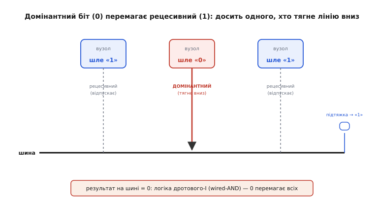
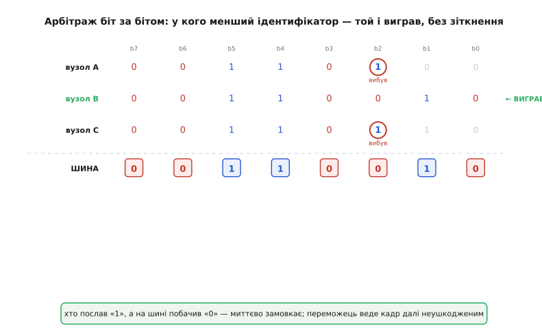
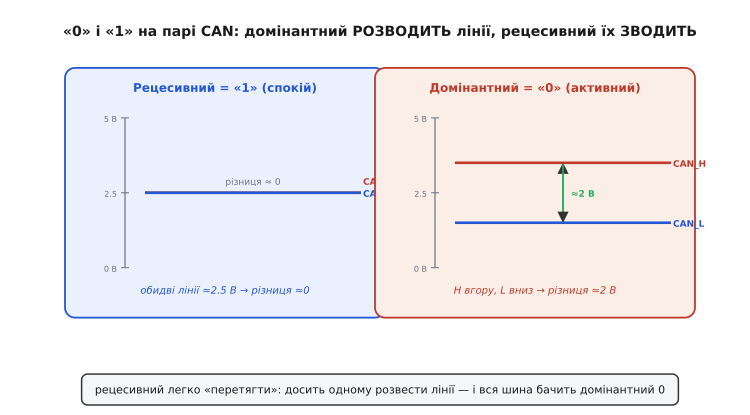

# Арбітраж CAN

Уявімо десяток блоків керування в автомобілі, з'єднаних однією парою дротів: блок гальм, двигун, подушки безпеки, приладова панель. Кожен час від часу має щось сказати решті, і жоден не питає дозволу — вони просто починають говорити, коли треба. Рано чи пізно двоє захочуть у ту саму мить. У звичайній мережі це **зіткнення** (*collision*): сигнали накладаються, обидва повідомлення псуються, доводиться замовкнути й спробувати ще раз. Марна витрата часу — а в машині повідомлення «тисни гальма» не має права чекати, поки хтось там доб'ється своєї черги.

CAN (*Controller Area Network* — «мережа контролерів») розв'язує це напрочуд елегантно. Коли двоє починають одночасно, зіткнення **не руйнує** обидва кадри. Натомість прямо під час передачі, біт за бітом, шина сама тихо вирішує, чий кадр важливіший, — і той **іде далі без жодної затримки, ніби нічого й не сталося**, а другий увічливо замовкає й чекає. Ніхто нічого не перепосилає, жодного біта не втрачено. Цей механізм зветься **арбітраж** (від латинського *arbiter* — «суддя, третейський»), і вся його краса — в одному фізичному трюку, з якого решта випливає сама.

### Дві нерівноправні «одиниці»

Почнімо з питання, яке звучить дивно: а що, як зробити логічний «0» і логічну «1» **нерівноправними**? Щоб один із них завжди перемагав другого на спільному дроті?

У звичайній логіці 0 і 1 симетричні: обидва — просто рівні напруги. Але шину можна збудувати інакше. Уявімо лінію з **підтяжкою** до спокійного стану, до якої кожен вузол під'єднаний так, що вміє робити лише одне активне діло — **тягти лінію вниз**. Відпустив — лінія сама повертається у спокій завдяки підтяжці; потягнув — лінія йде вниз, і байдуже, скільки інших її «відпускають». Один-єдиний вузол, що тягне, пересилює будь-яку кількість тих, хто не тягне.

У CAN ці два стани звуться **рецесивний** (*recessive* — «той, що поступається») і **домінантний** (*dominant* — «панівний»):

```
рецесивний = логічна «1» = вузол ВІДПУСКАЄ лінію (спокій, підтяжка тримає)
домінантний = логічна «0» = вузол АКТИВНО веде лінію (перемагає)
```

Правило шини з цього виходить просте й невблаганне: **якщо хоч один вузол шле домінантний (0), уся шина стоїть у домінантному (0)**; рецесивний (1) на шині буває лише тоді, коли **всі** вузли відпустили лінію. Це в точності поведінка логічного **І** (*AND*): результат — «1», лише якщо всі входи «1»; варто одному дати «0» — і вихід «0». Тому таке з'єднання називають **дротовим-І** (*wired-AND*): логічну операцію виконують не вентилем усередині мікросхеми, а самими дротами, тим, як вони з'єднані.


*Два вузли відпускають лінію (шлють рецесивний «1»), один активно тягне її вниз (домінантний «0»). Підтяжка сама тримала б «1», але один домінантний вузол пересилює всіх: на шині — 0. Це і є логіка дротового-І.*

> 🔧 **Навіщо це.** Уся хитрість арбітражу тримається саме на цій асиметрії. Якби 0 і 1 були рівноправні, два вузли, що ведуть лінію в різні боки, просто билися б струмами й псували сигнал — звичайне зіткнення. А коли один стан завжди «сильніший», зіткнення перетворюється на **тихе голосування**: перемагає той, хто веде домінантний, і всі це бачать однаково, без псування.

### Побітове голосування: хто першим поступиться

Тепер найголовніше. Кожен вузол, поки передає, **водночас слухає власну шину** — читає той рівень, що реально встановився, і порівнює зі своїм наміром. І тут спрацьовує залізне правило:

> Виставив рецесивний (1), а на шині бачиш домінантний (0) — значить, хтось інший тягне лінію, і твоє повідомлення **не єдине**. Ти негайно замовкаєш і слухаєш далі. Виставив домінантний (0) і бачиш домінантний — усе гаразд, це ти або такий самий, як ти; ведеш далі.

Чому цього досить, щоб розсудити суперечку без псування? Бо кадр CAN починається з **ідентифікатора** (*identifier* — числа, що каже, *про що* це повідомлення), і його передають **старшим бітом уперед**. Двоє вузлів, що почали одночасно, шлють свої ідентифікатори синхронно, біт у біт. Поки біти однакові — на шині те саме, обидва бачать свій намір і обидва ведуть далі. Щойно біти розійшлися, один із них шле рецесивний (1), а другий — домінантний (0). Дротове-І робить на шині **0**. Той, хто хотів 1, бачить чужий 0 — і за правилом миттєво відступає. Той, хто вів 0, бачить свій же 0 — і **навіть не помічає**, що поряд хтось був: жоден його біт не спотворений, кадр іде далі суцільним потоком.


*Три вузли шлють ідентифікатори синхронно, старший біт ліворуч. Поки біти збігаються, усі ведуть. На біті, де вузли A і C виставили «1», а B — «0», шина за дротовим-І стала в «0»: A і C бачать чужий домінантний і замовкають, B веде свій кадр далі неушкодженим. Переміг найменший ідентифікатор.*

Звідси випадає й спосіб задавати **пріоритет**. Домінантний — це 0; він перемагає на першому ж біті, де хтось інший має 1. Отже виграє той ідентифікатор, у якого раніше стоїть 0 замість 1, — тобто **менше двійкове число**. Правило коротке й його варто закарбувати:

```
менший ідентифікатор  →  вищий пріоритет
ідентифікатор 0x000    →  найважливіше повідомлення в мережі
```

Тому проєктувальник мережі роздає найтерміновішим повідомленням (аварія, гальма) **малі** ідентифікатори, а рутинним (температура, лічильники) — великі. І вся система пріоритетів працює **без жодного центрального розпорядника**: шина сама, самою фізикою дротів, щоразу пропускає вперед найважливіше.

Ще один тонкий, але важливий наслідок: арбітраж **не втрачає пропускної здатності**. У звичайній мережі зіткнення — це викинутий час: обидва кадри загинули, канал стояв дарма. У CAN переможець веде свій кадр далі тим самим потоком, без жодної паузи; програвши, вузол просто дочекається кінця чужого кадру й повторить спробу. Ані біта ефіру не змарновано на саму суперечку. Формально це відносять до сімейства **CSMA/CR** (*Carrier Sense Multiple Access with Collision Resolution* — «множинний доступ із опитуванням носія й розв'язанням зіткнень»): на відміну від звичного CSMA/CD, де зіткнення *виявляють і руйнують*, тут його **розв'язують на льоту**.

### Чому все це вимагає диференційної пари

Голосування працює тільки за однієї умови: **усі вузли на шині мусять бачити той самий рівень в один і той самий момент**. Якби один вузол читав «домінантний», а другий у ту саму мить — «рецесивний», голосування розсипалося б: двоє вирішили б, що обидва виграли, і повели далі несумісні кадри. Тож CAN потрібен фізичний рівень, де рівень шини **однозначний для всіх** і стійкий до завад, — бо автомобіль повний електричного бруду від запалювання, генератора, двигунів.

Тому дані по CAN ідуть **диференційною парою** — двома дротами, **CAN_H** і **CAN_L**, а біт кодують не рівнем одного дроту, а **різницею** між ними. Рецесивний (1) — це коли обидва дроти підтягнуті до спільного рівня близько 2.5 В: різниця майже нульова. Домінантний (0) — коли активний вузол **розводить** дроти: CAN_H піднімає, CAN_L опускає, і різниця стає близько 2 В. Приймач дивиться лише на різницю, тож завада, що однаково наводиться на обидва дроти, у ній скорочується.

> 🔗 CAN кладе біти на диференційну пару — два дроти, де корисне живе в **різниці** напруг, а спільна для обох завада віднімається й зникає. Саме тому CAN тримається серед автомобільних завад і на десятках метрів дроту. Загальний принцип пари (чому різниця стійка, а скручування додає захист) розібрано окремо.
> [Диференційна пара](root:com-medium/differential-pair)


*Рецесивний (спокій, «1»): обидві лінії ≈2.5 В, різниця ≈0 — і вся підтяжка сама повертає шину сюди. Домінантний («0»): активний вузол розводить CAN_H угору, CAN_L униз, різниця ≈2 В. «Розвести» легко пересилює «звести», тому 0 і перемагає.*

Тепер видно, **чому саме домінантний перемагає** на рівні фізики: щоб отримати рецесивний, треба, щоб **усі** відпустили пару й вона сама зійшлася до 2.5 В; а домінантний ставить **будь-який один** вузол, активно розвівши дроти. Зробити активно завжди сильніше, ніж чекати, поки всі відпустять, — звідси й уся асиметрія голосування.

### Пастка, на якій спотикаються: пріоритетне голодування

З того, що арбітраж завжди пропускає менший ідентифікатор, випливає незручний бік. Уяви, що якийсь вузол зі своєю дрібною бідою шле повідомлення з **дуже малим** ідентифікатором надто часто. Щоразу, коли він і хтось інший стартують разом, виграє він. Якщо шина завантажена, повідомлення з великими ідентифікаторами можуть **чекати надто довго** — а то й ніколи не дочекатися вікна. Це **пріоритетне голодування** (*priority starvation*): низькопріоритетний трафік застряє під навалою високопріоритетного.

Тому ідентифікатори не роздають навмання. Проєктувальник рахує, як часто й наскільки терміново шле кожне повідомлення, і будує бюджет шини так, щоб навіть у найгіршому збігу найповільніше повідомлення встигло у свій строк. Практичне правило прошивки: **не спамити** малими ідентифікаторами; лишати справді малі номери тільки тому, що дійсно критичне за часом.

**Приклад: хто виграє арбітраж.** Хай два вузли одночасно почали кадр. Перший шле ідентифікатор `0x2A0`, другий — `0x2C0` (обидва 11-бітні). Порівняймо їх старшими бітами вперед і знайдімо, де голосування розсудить:

```pseudocode
0x2A0 = 010 1010 0000
0x2C0 = 010 1100 0000
        └┬─┘└┬───────
   збігаються   тут перше розходження:
   (010 1)      вузол 0x2A0 шле 0 (домінантний),
                вузол 0x2C0 шле 1 (рецесивний)
шина = дротове-І = 0  →  0x2C0 бачить чужий 0, замовкає
0x2A0 (менше число) виграв і веде кадр далі
```

Менше число перемогло — рівно як обіцяло правило. А ось як це виглядає в прошивці: у CAN-контролері **не пишуть арбітраж вручну** — залізо робить його само. Драйвер лише кладе ідентифікатор у поле кадру й віддає команду передати; якщо вузол програв арбітраж, контролер сам, без участі програми, дочекається вільної шини й **повторить спробу того самого кадру**:

:::tabs
```cpp
// Заповнюємо кадр CAN і віддаємо на передачу.
// Арбітраж, повтор після програшу і збіг бітів — усе робить контролер САМ.
CAN_TxFrame f;
f.id       = 0x2A0;      // менший id → вищий пріоритет у мережі
f.ext      = false;      // 11-бітний (стандартний) ідентифікатор
f.len      = 2;
f.data[0]  = 0x9C;
f.data[1]  = 0x40;

can_transmit(&f);        // ставимо в чергу; втратив арбітраж — контролер повторить сам
```
```python
import can

# Заповнюємо кадр CAN і віддаємо на передачу.
# Арбітраж, повтор після програшу і збіг бітів — усе робить контролер САМ.
frame = can.Message(
    arbitration_id=0x2A0,           # менший id → вищий пріоритет у мережі
    is_extended_id=False,           # 11-бітний (стандартний) ідентифікатор
    data=[0x9C, 0x40],              # len виводиться з довжини data
)

bus.send(frame)          # ставимо в чергу; втратив арбітраж — контролер повторить сам
```
:::

Уся суть — у тому, що після `can_transmit` програмі **нема чого робити**: вона не слухає шину, не лічить біти, не вирішує, хто виграв. Контролер під час передачі сам звіряє кожен виставлений біт із рівнем на шині й, помітивши на рецесивному біті чужий домінантний, тихо відступає і бере кадр на повтор. Тому CAN такий зручний у прошивці: складна фізика голосування захована в залізі, а програміст оперує лише ідентифікатором і даними.

### Розширений ідентифікатор і трохи історії

Спершу ідентифікатор був **11-бітний** — це 2048 можливих номерів. Для однієї машини вистачало, та коли CAN пішов у складніші системи, номерів стало мало, і додали **розширений** формат із **29-бітним** ідентифікатором — уже понад 536 мільйонів номерів. Голосування від цього не змінилося ні на йоту: більше бітів — довша ділянка арбітражу, той самий принцип «менше число перемагає». Обидва формати мирно живуть на одній шині; за однакового початку 11-бітний кадр за домовленістю про службовий біт виходить трохи пріоритетнішим за 29-бітний.

CAN не з'явився з порожнечі — його зробили під конкретну автомобільну біду. [Історію CAN — хто, коли й навіщо його придумав у Bosch](root:com-devices/can-arbitration/hist-can-bosch.md) винесено окремо: там і про те, як у 1980-х дроти в машині розрослися в кілометри джгутів, і хто саме за це взявся, і чому «менший ідентифікатор виграє» виявилося таким вдалим рішенням, що дожило до сьогодні майже незмінним.

Отже, весь арбітраж CAN виростає з однієї-єдиної ідеї — **зробити «0» сильнішим за «1»** на спільній парі дротів. Звідси дротове-І, де один домінантний вузол пересилює всіх. Звідси побітове голосування, де кожен слухає власну шину й відступає, щойно побачить чужий домінантний на місці свого рецесивного. Звідси пріоритет через величину ідентифікатора — і мережа, що сама, без начальника, щоразу пропускає вперед найважливіше повідомлення, не втративши на суперечці ані біта. Скромний фокус із нерівноправними рівнями — а тримає на собі надійність автомобільних мереж уже майже сорок років.

---
