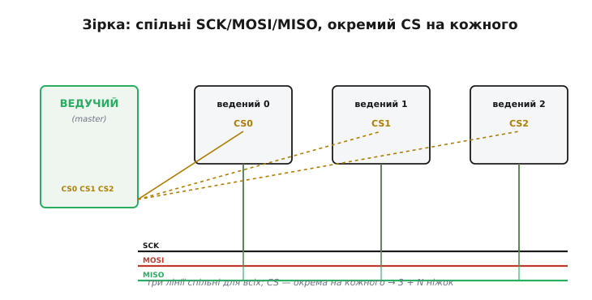
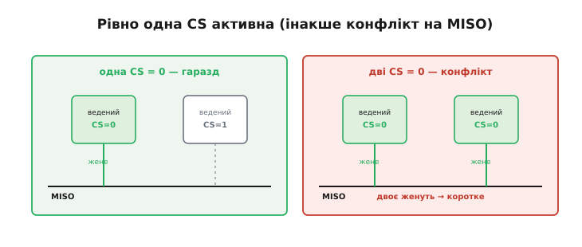
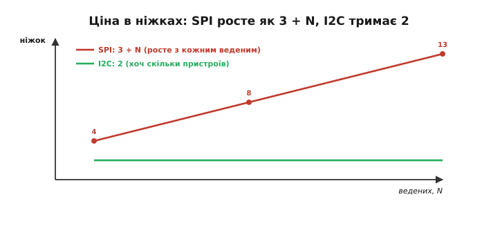
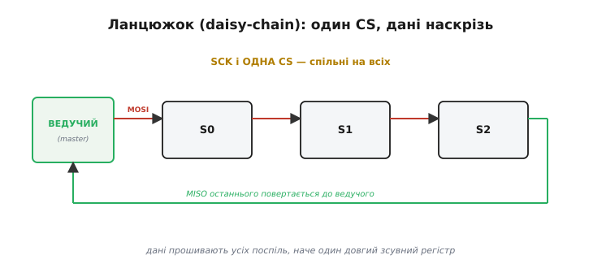
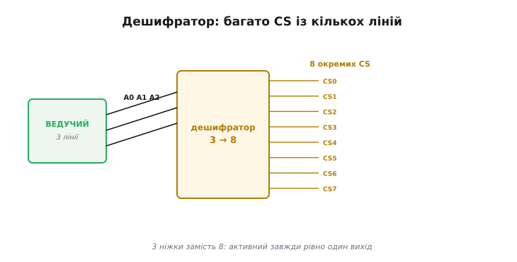
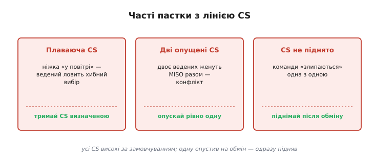

# Вибір кристала (CS)

Уся принада SPI — у швидкості, але платить він **ніжками**, і найвиразніше це видно, коли ведених стає багато. Як посадити на одну SPI-шину п'ять давачів, дисплей і пам'ять? Скільки знадобиться ліній? І що робити, коли ніжок мікроконтролера на всі лінії вибору бракує? Відповідь починається з однієї ніжки на кожен пристрій — лінії **вибору кристала** (*chip select*, скорочено **CS**; інша поширена назва — *slave select*, **SS**). Дослівно це «вибір мікросхеми»: ведучий цією лінією каже конкретному веденому «зараз говорю з тобою».

### Окремий CS на кожного: зіркова топологія

Стандартний спосіб під'єднати кілька ведених — **зірка**: три лінії SCK, MOSI, MISO роблять **спільними** для всіх, а лінію CS дають **кожному свою**.


*SCK, MOSI, MISO ідуть до всіх ведених паралельно — це спільна шина. Лінія CS у кожного власна (CS0, CS1, CS2), і всі вони йдуть від ведучого. Щоб поговорити з потрібним, ведучий опускає рівно його CS у нуль; решта тим часом мовчать і відпускають MISO.*

Логіка проста: дані й такт спільні, а **вибір** — індивідуальний. Ведучий опускає CS того, з ким хоче говорити, обмінюється байтами й піднімає CS назад. Звідси й рахунок ніжок: на **N** ведених треба **3 + N** ліній — три спільні плюс по одній CS на кожного. Ця риса вбудована в саму будову шини, і з неї випливають і головне правило коректної роботи, і головна вада SPI.

> 🔧 **Навіщо це.** Перше, що закладають у схему й у код під багато ведених, — таблиця «який пристрій на якій ніжці CS». Кожному веденому виділяють окремий вивід мікроконтролера, ініціалізують його як вихід і **виставляють у високий рівень ще до першого обміну** — щоб жоден ведений не вважав себе обраним, поки шину не налаштовано.

### Чому активний нуль

Лінію CS майже завжди роблять **активною нулем** (*active-low*): ведений вважає себе обраним, коли на його CS **низький** рівень, а високий — означає «спи». У схемах її тому й позначають із рискою згори або значком заперечення — CS̄, /CS, nCS.

Причина історична й практична. Логічні входи легко й надійно **підтягуються до високого** рівня резистором: поки ведучий ще не ввімкнувся або ніжка на мить «відпущена», підтяжка тримає CS високим, і ведений за замовчуванням мовчить. Якби вибір був активним одиницею, той самий невизначений стан на старті означав би «всі обрані» — і кілька ведених кинулися б на спільну MISO водночас. Активний нуль робить **безпечним саме спокій**: відсутність сигналу — це «нікого не обрано».

```
CS = 1 (високий) → ведений спить, MISO у високому імпедансі
CS = 0 (низький) → ведений обраний, жене MISO й слухає SCK/MOSI
```

### Рівно одна CS активна водночас

Головне правило зіркової шини: у кожну мить **рівно одна** CS може бути опущена. Чому не дві? Обраний ведений [активно жене лінію MISO](topic:com-devices/spi-lines) своїм двотактним виходом. Якщо опустити дві CS, **двоє** ведених женуть MISO одночасно — а це той самий конфлікт, що виникає, коли [два двотактні виходи зустрічаються на одному дроті](topic:hw-digital/open-drain-bus-pullup-sizing): один тягне у високий рівень, другий у низький, і вони коротять живлення на землю через себе.


*Ліворуч: опущена одна CS — MISO жене рівно один ведений, решта у високому імпедансі, усе гаразд. Праворуч: опущено дві CS — двоє ведених женуть MISO разом, лінія коротиться, дані псуються. Тому ведучий тримає всі CS високими й опускає тільки одну.*

Звідси стандартна дисципліна: **усі CS за замовчуванням високі**, і лише на час обміну ведучий опускає рівно одну. Опустити дві — гарантований конфлікт на MISO й зіпсовані дані. Це проста, але критична умова коректної роботи багатьох пристроїв на спільній шині.

### Ціна в ніжках проти I2C

Рахунок «3 + N» має зворотний бік: з кожним новим веденим SPI **з'їдає ще одну ніжку**. Порівняймо з I2C, де додавання пристрою не коштує жодного дроту.


*У SPI кількість ніжок росте як 3 + N: один ведений — 4 ніжки, п'ять — 8, десять — 13. У I2C завжди 2, скільки б пристроїв не висіло на шині. Що більше пристроїв, то відчутніший програш SPI у ніжках.*

**Ніжки на п'ять пристроїв.** Порахуймо для п'яти ведених:

```
SPI: 3 спільні + 5 CS = 8 ніжок
I2C: 2 (SDA + SCL), скільки б пристроїв не було
```

Ось головний козир I2C за багатьох пристроїв: два дроти на всіх проти восьми. Тому дрібні численні давачі частіше вішають на I2C, а SPI лишають для кількох **швидких** пристроїв. Коли ж ніжок усе ж бракує, у SPI є два прийоми, що рятують ситуацію, — кожен зі своєю ціною.

### Ланцюжок: daisy-chain

Перший прийом — **ланцюжкове** з'єднання (*daisy-chain*, дослівно «ланцюжок маргариток» — гірлянда, де кожна ланка чіпляється за попередню). Замість зірки ведених з'єднують **послідовно**: MOSI ведучого йде у перший ведений, його вихід — у другий, і так далі, а MISO останнього повертається до ведучого. І всі вони ділять **один** CS і один SCK.


*Ведені з'єднані в ланцюг: дані ведучого «прошивають» їх один за одним, наче один довгий зсувний регістр. SCK і єдина CS — спільні. Економить ніжки CS, але вимагає підтримки режиму й надсилання даних одразу для всіх ведених у ланцюзі.*

Ідея спирається прямо на [кільце зсувних регістрів](topic:com-devices/spi-bus), що лежить в основі SPI, тільки кілець тепер кілька, з'єднаних у довгий ланцюг. На кожен такт дані зсуваються крізь **усіх** ведених поспіль. Економія очевидна — одна CS на весь ланцюг, — але має ціну: пристрій має **підтримувати** такий режим (не всі вміють), а ведучому щоразу доводиться висувати дані **для всіх** ланок одразу. Daisy-chain поширений у драйверів світлодіодів і каскадів [зсувних регістрів](topic:hw-digital/shift-register), де однотипних пристроїв багато, а керують ними спільно.

### Дешифратор розширює CS

Другий прийом — **дешифратор** (*decoder*, він же *demultiplexer*, «демультиплексор» — пристрій, що з кількох ліній-адрес вибирає один вихід). Якщо потрібно багато окремих CS, але ніжок обмаль, ставлять дешифратор, що з кількох ліній робить багато.


*Дешифратор «3-у-8» перетворює 3 лінії вибору на 8 окремих CS (активна завжди одна). Замість 8 ніжок CS витрачаємо 3 — торгуємо трохи логіки за купу зекономлених ніжок.*

**Економія ніжок дешифратором.** Для восьми ведених:

```
напряму:             3 спільні + 8 CS    = 11 ніжок
з 3→8 дешифратором:  3 спільні + 3 лінії = 6 ніжок
```

Дешифратор перетворює N ліній на 2ᴺ виходів, тож трьома ніжками можна керувати вісьмома CS. Класичний приклад такого «3-у-8» з активними нулем виходами — мікросхема [74HC138](topic:cat-hw-parts/74hc138), у якої виходи саме й розраховані на роль CS. Ціна — додаткова мікросхема й те, що «не вибрати нікого» простим способом уже не вийде (потрібен ще дозвільний вхід, що вимикає всі виходи). Та коли ведених багато, а ніжок мало, це елегантний вихід.

### Своя CS обрамлює кожну транзакцію

Різні ведені на одній шині можуть хотіти **різні** налаштування — свій [режим (CPOL/CPHA)](topic:com-devices/spi-mode-selection) і свою швидкість. Тому параметри задають **на кожну транзакцію**, а її саму обрамляють опусканням і підняттям CS потрібного веденого. Дисплей може хотіти 20 МГц і Mode 0, а АЦП — 1 МГц і Mode 3: перед обміном опускають CS потрібного, відкривають транзакцію з **його** налаштуваннями, обмінюються, закривають транзакцію й піднімають CS.

**Кілька різних ведених на одній шині.** Кожному — своя ніжка CS, свої параметри, активний нуль на час обміну:

:::tabs
```cpp
// у кожного веденого — своя ніжка CS і свої параметри
const int CS_DISP = 10, CS_ADC = 9, CS_FLASH = 8;
SPISettings disp (20000000, MSBFIRST, SPI_MODE0);   // дисплей: швидко
SPISettings adc  ( 1000000, MSBFIRST, SPI_MODE3);   // АЦП: повільніше

void setup() {
  pinMode(CS_DISP, OUTPUT);  digitalWrite(CS_DISP, HIGH);  // усі CS —
  pinMode(CS_ADC,  OUTPUT);  digitalWrite(CS_ADC,  HIGH);  // високі ще
  pinMode(CS_FLASH,OUTPUT);  digitalWrite(CS_FLASH,HIGH);  // до обміну
  SPI.begin();
}

uint16_t readAdc() {
  SPI.beginTransaction(adc);          // режим і швидкість саме АЦП
  digitalWrite(CS_ADC, LOW);          // обрали його: активний нуль
  uint16_t v = SPI.transfer16(0x0000);// обмін (пише й читає водночас)
  digitalWrite(CS_ADC, HIGH);         // відпустили — підняли одразу
  SPI.endTransaction();
  return v;
}
```
```python
from machine import Pin, SPI

# у кожного веденого — своя ніжка CS, усі за замовчуванням високі
cs_disp  = Pin(10, Pin.OUT, value=1)   # усі CS —
cs_adc   = Pin(9,  Pin.OUT, value=1)   # високі ще
cs_flash = Pin(8,  Pin.OUT, value=1)   # до обміну

spi = SPI(0, baudrate=1_000_000, polarity=1, phase=1,   # старт у режимі АЦП:
          firstbit=SPI.MSB)                             # Mode 3, повільніше

def read_adc():
    spi.init(baudrate=1_000_000, polarity=1, phase=1)  # режим і швидкість АЦП
    cs_adc(0)                          # обрали його: активний нуль
    buf = spi.read(2, 0x00)            # обмін (пише й читає водночас)
    cs_adc(1)                          # відпустили — підняли одразу
    return (buf[0] << 8) | buf[1]
```
:::

Кожен ведений має власну ніжку CS; обмін з ним загорнуто в опускання саме його CS у нуль і негайне підняття назад. Інші ніжки CS весь цей час лишаються високими, тож решта ведених шину не чують. Це й є стандартний спосіб працювати з кількома різними веденими на одній шині, не плутаючи їхні режими й швидкості.

### Пастки з CS

Майже всі часті помилки на SPI-шині — про CS.


*Плаваюча CS: ніжку лишили «у повітрі» — ведений ловить хибний вибір (тримай CS визначеною, високою). Дві опущені CS: конфлікт на MISO (опускай рівно одну). CS не піднято між обмінами: наступна команда «злипається» з попередньою (піднімай CS після кожного обміну).*

> 🔧 **Навіщо це.** Золоте правило роботи з CS: **усі лінії CS за замовчуванням високі**, опускаєш **рівно одну** на час обміну й **одразу піднімаєш** після. Звідси три перевірки, коли SPI-пристрій поводиться дивно: чи не лишилася якась CS «плаваючою» (без чіткого рівня при старті), чи не опущено випадково дві, і чи піднімаєш CS між транзакціями. Разом із перевіркою [режиму CPOL/CPHA](topic:com-devices/spi-mode-selection) це покриває переважну більшість «непрацюючих» SPI-шин.

Так із кількох ліній CS і однієї спільної шини виростає вся топологія багатьох пристроїв на SPI: зірка для звичайних випадків, daisy-chain і дешифратор — коли ніжок бракує, і сувора дисципліна «рівно одна CS на час обміну» як умова коректності. Окреме питання — що робить SPI **швидким** і де [межа цієї швидкості та відстані](topic:com-devices/spi-speed): чому шина тягне десятки мегагерц, але годиться лише в межах плати, а не через довгий кабель.

---
