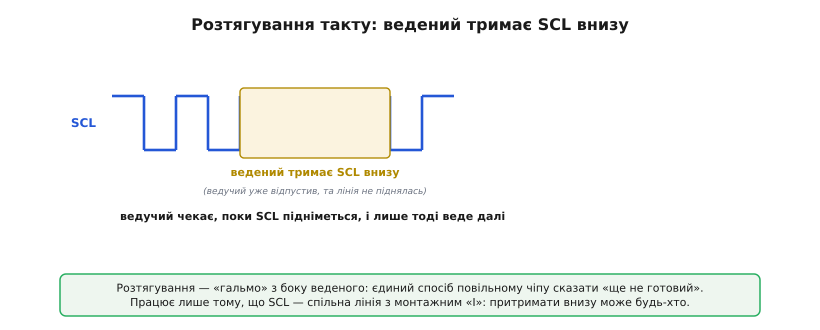
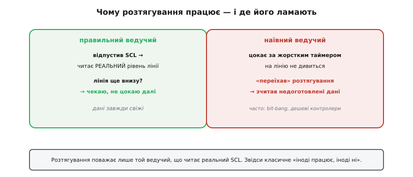
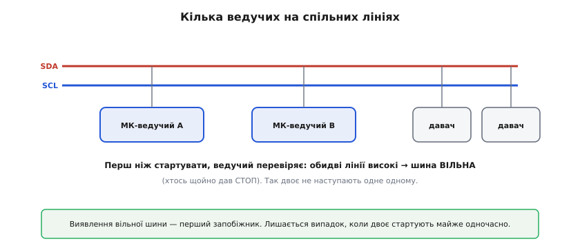
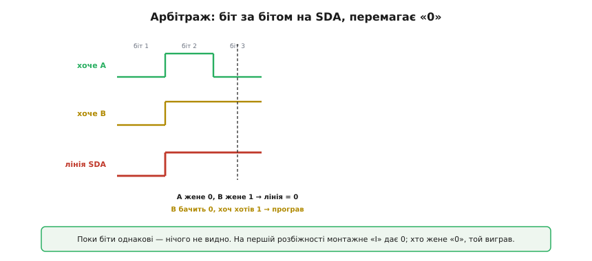
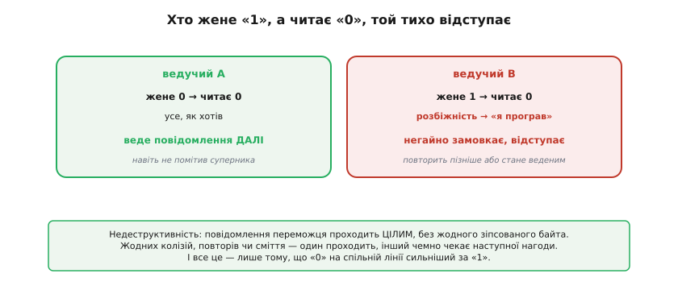
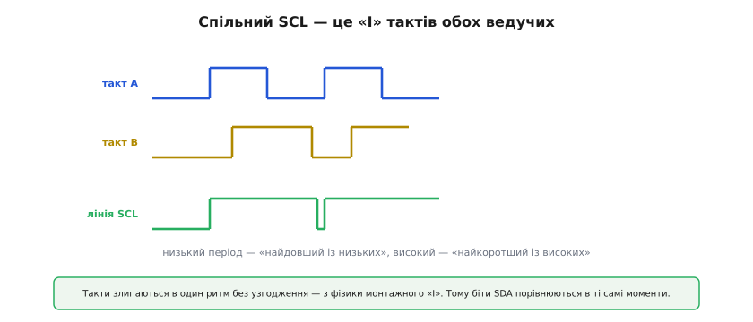
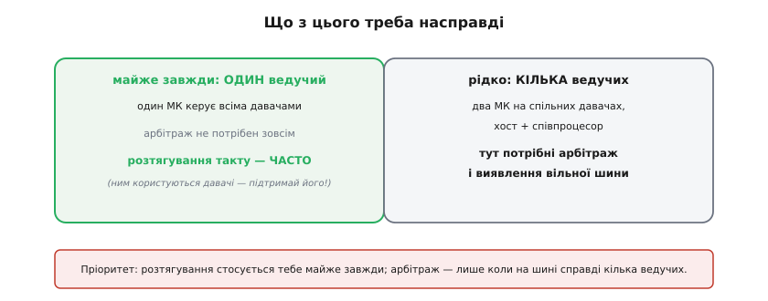

# Розтягування й арбітраж

Звичайний обмін по I2C — ведучий цокає тактом, ведений відповідає — покриває майже все. Та лишаються дві ситуації, рідші, але цілком реальні. Перша: ведений **не встигає** за тактом ведучого й мусить якось попросити часу. Друга: на шині не один ведучий, а **кілька**, і вони можуть заговорити одночасно. I2C розв'язує обидві, не додаючи жодного нового дроту чи сигналу, — тим самим механізмом [відкритого колектора](topic:hw-digital/open-drain-bus-pullup-sizing) (англ. *open collector* — «відкритий колектор»: вихід або тягне лінію вниз, або відпускає, але ніколи не жене «1»), на якому тримається вся шина. Те саме просте правило «тягнути вниз перемагає» дає і притримане «зачекай», і чесне змагання за шину.

### Ведений каже «зачекай»

Повільний ведений потрапляє у скруту: щоб віддати вимір, йому спершу треба його **порахувати** — зробити аналого-цифрове перетворення, обробити результат. А ведучий уже цокає тактом і вимагає даних. У веденого є лише дві лінії, тож сказати «стривай, я ще не готовий» він може тільки через одну з них — і він користується SCL. Ведений просто **тримає SCL низьким** довше, ніж хотів би ведучий.


*Ведучий уже відпустив SCL, щоб підняти його в «1» і дати наступний такт, — але лінія не піднялась: ведений тримає її внизу. Ведучий мусить чекати. Щойно ведений відпускає SCL, лінія підіймається, і обмін триває. Це розтягування такту (англ. clock stretching — «розтягування такту»).*

Працює це лише завдяки відкритому колектору: SCL — спільна лінія з монтажним «І» (англ. *wired-AND* — «з'єднане І»: лінія низька, якщо її тягне вниз хоч один вихід), тож **будь-хто** може притримати її внизу, і ведучий нічого з цим не вдіє, поки ведений не відпустить. По суті це **єдиний** спосіб для веденого вповільнити ведучого — таке собі «гальмо» знизу. Багато давачів ним користуються, коли їм треба час на внутрішню роботу.

### Чому працює й де пастка

Розтягування тримається на одній умові з боку ведучого: він мусить **дивитися на реальний SCL**, а не просто «цокати» за внутрішнім таймером. Відпустив лінію в «1» — перевір, чи вона **справді** піднялась; ні — значить, хтось тримає, і треба чекати. Саме цього вимагає специфікація I2C: ведучий, відпустивши такт у високий рівень, **читає його назад** і не йде далі, поки лінія не стала високою.


*Правильний ведучий, відпустивши SCL, читає реальний рівень лінії й чекає, поки вона підніметься. Наївний ведучий цокає за жорстким таймером, не дивлячись на лінію, — і «переїжджає» розтягування, зчитуючи недоготовлені дані. Це часта вада програмних (bit-bang) реалізацій і дешевих контролерів.*

Ось де ховається підступна біда. Не всі ведучі поважають розтягування: програмні (англ. *bit-bang* — «смикання бітів» вручну, без апаратного блока) реалізації або контролери з жорсткими таймінгами можуть **ігнорувати** притриманий SCL і йти далі за розкладом — а тоді зчитують сміття. Трапляються й ведені з кривим розтягуванням, що тримають лінію довше за будь-який розумний час. Тому це класичне джерело «іноді працює, іноді ні»: на одній платі давач мовчазно віддає правильні дані, на іншій — зрідка псує байт.

> 🔧 **Навіщо це.** Якщо давач **зрідка** віддає сміття або обмін «підвисає», одна з перших підозр — розтягування такту: чи підтримує його твій ведучий? Апаратні I2C-блоки мікроконтролерів зазвичай так, програмні — не завжди. У документації шукай «clock stretching»; якщо ведений його активно використовує, а ведучий не підтримує, — або міняй ведучого на апаратний, або шукай у давача режим без розтягування. Особливо це болить, коли той самий [повільний давач](topic:com-devices/clock-stretch-arbitration/comp-clock-stretching-slave.md) працює на одному контролері й капризує на іншому.

### Кілька ведучих і вільна шина

Друге питання — **кілька ведучих** (англ. *multi-master* — «багатоведучий» режим). I2C дозволяє мати на шині більш ніж один ведучий: наприклад, два мікроконтролери, що ділять спільні давачі, або хост і співпроцесор поряд із ним.


*Два мікроконтролери-ведучі й кілька ведених на спільних лініях. Перш ніж почати обмін, ведучий перевіряє, що шина вільна — обидві лінії високі (тобто хтось щойно дав СТОП). Так двоє не наступають одне одному, якщо не стартують одночасно.*

Перший запобіжник проти зіткнення — **виявлення вільної шини**: ведучий не починає, поки бачить чужий обмін (лінії «зайняті»), а чекає СТОПу й стану спокою, коли обидві лінії високі. Цього досить, доки старти рознесені в часі. Складніший випадок — двоє вирішили почати **майже одночасно**, обидва побачили вільну шину й дали СТАРТ так близько, що жоден не помітив іншого. Саме тут вмикається найкрасивіший механізм I2C.

### Хто жене «0», той виграє

Два ведучі, що стартували разом, починають **арбітраж** (англ. *arbitration*, від лат. *arbiter* — «суддя, посередник») — змагання за шину, що йде **біт за бітом** прямо на лінії SDA. І вирішує його все те саме правило відкритого колектора: «тягнути вниз перемагає».


*Обидва ведучі женуть свої біти на SDA одночасно. Поки біти однакові — нічого не видно. На першому ж біті, де вони різні (тут третій), один жене «1» (відпускає лінію), інший «0» (тягне вниз) — і лінія стає «0» за монтажним «І». Той, хто жене «0», переміг.*

Механізм такий: кожен ведучий, женучи свій біт, **одночасно читає** реальний стан SDA. Поки обидва женуть однакове — лінія саме таке й показує, ніхто нічого не помічає. На першому ж біті, де вони розійшлися, один жене «1» (відпускає), а інший «0» (тягне) — і лінія, за монтажним «І», стає **0**. Той, хто хотів «1», бачить на лінії «0» — і з цієї розбіжності розуміє, що програв.

> 🔧 **Навіщо це.** Перемагає той, у кого менше числове значення адреси (бо старші біти адреси йдуть першими, а «0» б'є «1»). Тож якщо ти проєктуєш систему з двома ведучими й хочеш, щоб один мав негласний пріоритет на шині, **дай йому меншу адресу** — він стабільно вигризатиме арбітраж у конкурента. Дрібниця, але вона рятує, коли два контролери раз у раз труться за спільний давач.

### Як переможений розуміє програш

Цей момент і є серцем арбітражу: переможений мусить дізнатися про поразку **сам**, без жодного сигналу від суперника.


*Ведучий B жене «1» (відпускає SDA), та читає на лінії «0» — розбіжність. Це означає «я програв»: B негайно замовкає й відступає (стане веденим або повторить пізніше). Ведучий A жене «0» і читає «0» — усе, як хотів; він навіть не помітив суперника й веде своє повідомлення далі.*

Найкрасивіше тут — **недеструктивність** (англ. *non-destructive arbitration*): жоден байт не псується. Переможений (B) тихо відступає, щойно виявив розбіжність, а повідомлення переможця (A) проходить **цілим** — A навіть не дізнається, що поряд хтось був. Жодних колізій, повторів чи зіпсованих даних: один проходить, інший чемно чекає наступної нагоди. І все це — знову лише завдяки тому, що «0» на спільній лінії сильніший за «1».

### Спільний такт сам збігається

Щоб двоє чесно порівнювали біти, вони мають **бачити однакові такти**. І це теж улаштовується саме собою через монтажне «І» — тепер уже на лінії SCL.


*Спільний SCL — це «І» тактів обох ведучих: лінія низька, поки хоч один тримає її внизу, і висока, лише коли всі відпустили. Тому низький період виходить «найдовший із низьких», високий — «найкоротший із високих», і обидва ведучі автоматично йдуть у ногу — а отже, порівнюють біти SDA в одні й ті самі моменти.*

Так такти кількох ведучих злипаються в один спільний ритм без жодного окремого узгодження — просто з фізики відкритого колектора. Це й робить арбітраж справедливим: обидва учасники крокують синхронно, тож «перший біт, де вони розійшлися» однаково визначений для обох.

### Що з цього треба насправді

Тверезий практичний підсумок важить не менше за механіку, бо рятує від переоцінки складності.


*Переважна більшість систем — з одним ведучим (один мікроконтролер керує всіма давачами); там арбітраж не потрібен зовсім, а от розтягування такту трапляється часто, бо ним користуються давачі. Кілька ведучих (два МК на спільних давачах, хост і співпроцесор) — рідкісний випадок, де вже потрібні арбітраж і виявлення вільної шини.*

> 🔧 **Навіщо це.** Розстав пріоритети правильно. Розтягування такту стосується тебе майже завжди: переконайся, що твій ведучий його підтримує, інакше частина давачів капризуватиме. Арбітраж же на практиці потрібен рідко — лише коли на шині справді кілька ведучих; у звичайному проєкті «один МК + купа давачів» про нього можна не думати. Та знати, що він є й працює недеструктивно, корисно: побачивши на платі два процесори на спільній I2C, ти вже не здивуєшся, що вони не заважають одне одному.

### Як це виглядає в коді

Обидва механізми зводяться до одного: ведучий завжди **читає лінію назад** після того, як її відпустив. Для розтягування — чекає, поки SCL справді підніметься; для арбітражу — звіряє прочитаний біт SDA з тим, який жене. Ось як це чинить програмний (bit-bang) ведучий, що поважає розтягування:

**Умова:** ведучий відпустив SCL, щоб дати високий рівень такту. Перед роботою з даними треба дочекатися, поки лінія реально стане високою, — і не зависнути назавжди, якщо ведений завис.

```c
// SCL — відкритий колектор: high = відпустити (ввід), low = тягнути вниз
static int scl_release_and_wait(void) {
    scl_release();                  // відпускаємо: підтяжка тягне лінію в «1»
    int guard = 10000;              // запобіжник від зависання
    while (scl_read() == 0) {       // ведений ще тримає SCL внизу?
        if (--guard == 0)
            return -1;              // розтягування занадто довге → помилка шини
    }
    return 0;                       // лінія піднялась — такт справді високий
}
```

Арбітраж — той самий прийом «жени й перечитай», але вже на SDA: відпустивши лінію під «1», ведучий мусить переконатися, що на ній і справді «1»; інакше хтось жене «0» — і ми програли.

```c
// Жене один біт на SDA й перевіряє, чи не програно арбітраж.
// Повертає 0 — біт пройшов; -1 — арбітраж програно (жали 1, прочитали 0).
static int sda_drive_bit(int bit) {
    if (bit) sda_release();         // «1» = відпустити лінію
    else     sda_pull_low();        // «0» = тягнути вниз
    if (scl_release_and_wait() < 0) // піднімаємо такт, поважаючи розтягування
        return -1;
    int seen = sda_read();          // читаємо лінію САМЕ під час високого SCL
    scl_pull_low();                 // завершуємо такт
    if (bit == 1 && seen == 0)      // хотіли «1», лінія «0» → нас перебили
        return -1;                  // програш: негайно замовкнути й відступити
    return 0;
}
```

Видно, що жодного окремого «модуля арбітражу» немає: уся логіка — це чесне читання лінії назад. Апаратний I2C-блок робить те саме всередині й піднімає прапорець «arbitration lost», коли прочитаний біт не збігся з тим, що він жене.

Прикметно, що і розтягування такту, і арбітраж, і синхронізація тактів працюють без жодного окремого механізму: одне-єдине правило «`0` на спільній лінії сильніший за `1`» дає і притримане «зачекай», і недеструктивне змагання за шину, і спільний ритм кількох ведучих. Та сама фізика [відкритого колектора](topic:hw-digital/open-drain-bus-pullup-sizing), на якій тримається передача звичайного байта, безкоштовно вирішує й ці два крайні випадки. А коли механіка шини зрозуміла до кінця, лишається перетворити її на практичне вміння — узяти реальний незнайомий давач і за [його регістровою картою](topic:com-devices/register-map) «заговорити» з ним: увімкнути, налаштувати, прочитати вимір.

---
