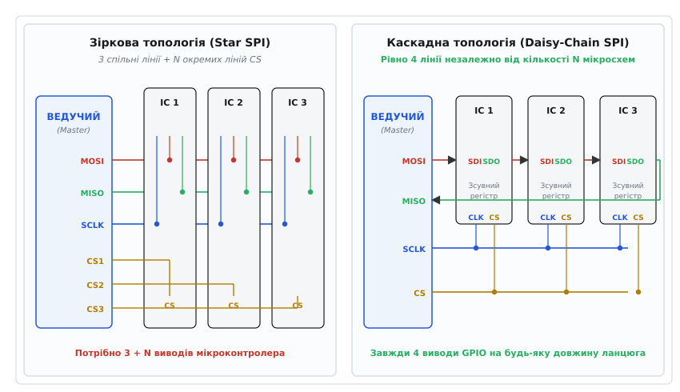
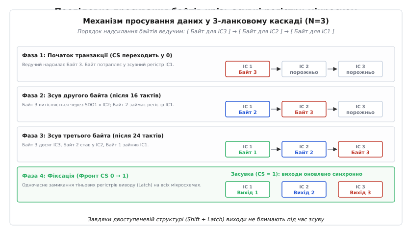
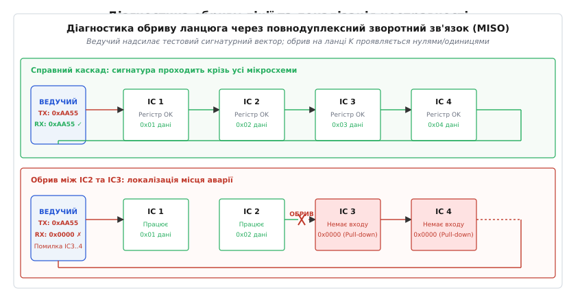
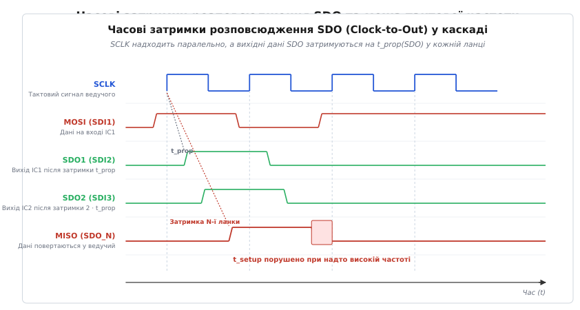

# Daisy-chain у SPI

<preknowlist>
- [Вибір кристала (CS)](topic:com-devices/chip-select) — вибір мікросхеми, активний нуль та зіркова топологія шини SPI.
- [Лінії та топологія SPI](topic:com-devices/spi-lines) — призначення ліній SCLK, MOSI, MISO та напрямки передачі даних.
- [Зсувний регістр](topic:hw-digital/shift-register) — синхронний зсув бітів по тактовому сигналу.
- [Часові параметри SPI](topic:com-devices/spi-timing) — часи встановлення, утримання та затримки розповсюдження.
</preknowlist>

Коли на друкованій платі світлодіодної панелі необхідно встановити 32 драйвери постійного струму для керування 512 каналами підсвічування, або в системі керування тяговою батареєю електромобіля (BMS) потрібно об'єднати 16 мікросхем моніторингу осередків, класична зіркова топологія SPI заходить у глухий кут. Підключення 32 пристроїв за стандартною схемою вимагає 32 окремих ліній вибору кристала (Chip Select, CS), що спалює 32 виводи GPIO мікроконтролера, змушує встановлювати каскади зовнішніх дешифраторів адреси та перетворює трасування друкованої плати на переплетення десятків сигнальних доріжок. Якщо вільні виводи процесора вичерпані або гальванічна ізоляція між високовольтними модулями не дозволяє тягнути паралельний пучок дротів, інтерфейс SPI перемикають у режим послідовного каскаду — **Daisy-chain**.

Замість того щоб підводити індивідуальну лінію вибору до кожного чипа, усі мікросхеми вмикають послідовно в єдиний інформаційний конвеєр. Вихід даних першої мікросхеми стає входом для другої, вихід другої — входом для третьої, а тактова лінія та лінія вибору кристала залишаються спільними для всього ланцюга. Контролер керує довільною кількістю пристроїв за допомогою рівно чотирьох виводів, розглядаючи весь каскад як один гігантський розподілений зсувний регістр.

### Схемотехніка та топологія зсувного каскаду

У класичній зірковій конфігурації SPI всі ведені пристрої підключаються до ліній даних паралельно: вивід MOSI ведучого підводиться до входів SDI всіх ведених, а виходи SDO всіх мікросхем об'єднуються на спільній лінії MISO. Щоб уникнути короткого замикання між двотактними виходами мікросхем, ведучий опускає в нуль лінію CS рівно одного чипа, переводячи виходи всіх інших у високоімпедансний стан (Z-стан).

У каскадній топології Daisy-Chain (дослівно — «вінок із маргариток», послідовний ланцюжок) принцип підключення змінюється кардинально:
- Вивід **MOSI (Master Out, Slave In)** мікроконтролера підключається виключно до входу **SDI (Serial Data In)** найпершої мікросхеми в ланцюзі (IC1).
- Вихід **SDO (Serial Data Out)** мікросхеми IC1 з'єднується коротким провідником із входом **SDI** другої мікросхеми (IC2).
- Вихід **SDO** мікросхеми IC2 підключається до входу **SDI** мікросхеми IC3, і так далі по всьому ланцюгу до останнього елемента IC_N.
- Вихід **SDO** останньої мікросхеми IC_N повертається назад до мікроконтролера на вхід **MISO (Master In, Slave Out)**.
- Тактова лінія **SCLK** та лінія вибору **CS** залишаються паралельними (*multi-drop*): вони підводяться одночасно до однойменних виводів кожної мікросхеми в каскаді.


*Зіркова топологія вимагає 3 + N виводів контролера та десятки індивідуальних доріжок CS. Каскад Daisy-Chain об'єднує мікросхеми в послідовний ланцюг і використовує рівно 4 лінії GPIO незалежно від кількості чипів.*

У такій схемі апаратні витрати мікроконтролера зафіксовані раз і назавжди:
```
N = 1 пристрій   → 4 виводи GPIO (MOSI, MISO, SCLK, CS)
N = 8 пристроїв  → 4 виводи GPIO
N = 64 пристрої  → 4 виводи GPIO
```

Кожна мікросхема всередині містить `K`-розрядний зсувний регістр (типово 8, 12, 16 або 24 біти). Коли `N` таких мікросхем об'єднані в ланцюг, з погляду мікроконтролера вони утворюють єдиний суцільний зсувний регістр сумарною довжиною `L = N · K` бітів.

> 🔧 **Навіщо це.** Daisy-Chain — це головний схемотехнічний прийом у системах із великою кількістю однотипних каналів вводу/виводу: матричних світлодіодних табло, промислових блоках релейних комутаторів (на мікросхемах TPIC6C595), багатоканальних платах цифро-аналогових перетворювачів (ЦАП) та системах контролю заряду акумуляторних батарей (BMS). Замість розведення громіздкого джгута проводів плата розводиться локальними короткими перемичками від чипа до чипа.

Історія виникнення цієї концепції та її перехід від перших телефонних комутаторів до сучасних стандартів докладно розкриті у вставці [📜 Еволюція каскадування зсувних регістрів: від перших телеком-систем до ізольованих шин BMS](topic:com-devices/daisy-chain-spi/hist-shift-cascade.md).

---

### Протокольна логіка: формування N-байтового кадру та порядок зсуву

Оскільки каскад працює як черга FIFO (*First-In, First-Out* — першим зайшов, першим вийшов), рух інформації в ньому підпорядковується жорсткому правилу зворотного порядку завантаження.

Уявімо ланцюг із трьох 8-бітних мікросхем (`N = 3, K = 8`). Загальна довжина кадру становить 24 біти (3 байти). Мікроконтролер хоче записати:
- Байт `0x11` у мікросхему IC1;
- Байт `0x22` у мікросхему IC2;
- Байт `0x33` у мікросхему IC3.

Якщо ведучий надішле байт `0x11` першим, то після передачі всіх 24 тактових імпульсів цей перший байт пройде крізь IC1, крізь IC2 і зрештою осяде в найвіддаленішому регістрі IC3. Байт, надісланий другим (`0x22`), зупиниться в IC2. А байт, надісланий останнім (`0x33`), залишиться в першій мікросхемі IC1.

```
Порядок слів у буфері контролера: [ Байт для IC3 ] ──► [ Байт для IC2 ] ──► [ Байт для IC1 ]
                                    (0x33)               (0x22)               (0x11)
                                      │                    │                    │
                                      ▼                    ▼                    ▼
Фінальний стан регістрів:           [ IC3 ]              [ IC2 ]              [ IC1 ]
```


*Покрокове проходження трьох байтів крізь каскад: перший надісланий байт проштовхується в останню мікросхему IC3, а останній залишається в IC1. За наростаючим фронтом CS стан зсувних регістрів синхронно замикається у вихідних засувках.*

#### Послідовність фаз транзакції
1. **Ініціалізація кадру (CS Assert):** Мікроконтролер опускає спільну лінію CS у низький логічний рівень (`CS = 0`). Це переводить внутрішні вузли всіх мікросхем каскаду в режим зсуву та дозволяє тактування.
2. **Синхронний зсув даних (Clocking):** Ведучий генерує рівно `N · K` тактових імпульсів на лінії SCLK. На кожному активному фронті такту (наприклад, наростаючому в режимі SPI Mode 0):
   - Кожен чип фіксує значення біта на своєму вході SDI;
   - Внутрішній зсувний регістр зсуває свій вміст на один розряд у бік старшого або молодшого біта;
   - Найстарший біт регістра виштовхується на вихід SDO та стає доступним на вході SDI наступного чипа.
3. **Фіксація результату (CS De-assert & Latch):** Після передачі останнього біта ведучий повертає лінію CS у високий логічний рівень (`CS = 1`). Наростаючий фронт CS слугує глобальним стробом фіксації (*Latch*), який одночасно переносить вміст зсувного регістра у вихідні каскади всіх чипів.

Якщо ведучий надішле менше тактів, ніж `N · K`, дані застрягнуть у проміжних регістрах і жоден чип не отримає правильного значення. Якщо ж ведучий згенерує зайві такти, дані виштовхнуться за межі каскаду в лінію MISO, а в регістри IC1 запишуться останні біти, що залишилися на лінії MOSI.

---

### Двоступенева архітектура: чому виходи не мерехтять під час зсуву

Якби зовнішні виводи мікросхеми (ніжки керування транзисторами, світлодіодами чи обмотками реле) були безпосередньо підключені до тригерів зсувного регістра, виникала б катастрофічна проблема: під час проштовхування 24 або 64 бітів крізь ланцюг усі проміжні значення з'являлися б на вихідних ніжках. Світлодіоди хаотично спалахували б під час кожного обміну, а силові реле брязкали б контактами.

Щоб запобігти цьому явищу, будь-яка мікросхема з підтримкою Daisy-Chain будується за **двоступеневою схемою** (*double-buffered architecture*):

```
       SDI ──► [ 8-бітний зсувний регістр (Shift Register) ] ──► SDO
                                │ │ │ │ │ │ │ │  (паралельна шина переносу)
                                ▼ ▼ ▼ ▼ ▼ ▼ ▼ ▼
   CS/LATCH ─► [ 8-бітний регістр зберігання (Storage Latch) ]
                                │ │ │ │ │ │ │ │
                                ▼ ▼ ▼ ▼ ▼ ▼ ▼ ▼
                               Q0 Q1 Q2 Q3 Q4 Q5 Q6 Q7  (фізичні виходи)
```

1. **Перший ступінь — динамічний зсувний регістр:** Працює виключно під час активного низького стану `CS = 0`. Він приймає послідовний потік бітів з лінії SDI та передає його на SDO. Його стан постійно змінюється, але він повністю ізольований від фізичних виходів чипа.
2. **Другий ступінь — статичний регістр-засувка (Storage / Shadow Latch):** Зберігає незмінний стан виходів протягом усього часу передачі кадру.
3. **Момент передачі:** У момент переходу `CS: 0 → 1` апаратна логіка формує короткий внутрішній строб, який за один такт копіює весь байт або слово з першого регістра в другий.

У результаті всі `N` пристроїв каскаду оновлюють свої вихідні напруги, ШІМ-коефіцієнти чи стани ключів в один і той самий фізичний момент часу — з точністю до одиниць наносекунд.

---

### Узгодження режимів SPI (CPOL/CPHA) та фазові пастки

Усі мікросхеми в одному каскаді зобов'язані підтримувати та працювати в **однаковому режимі SPI** (*SPI Mode 0, 1, 2 або 3*). Найпоширенішим для каскадів є режим **Mode 0** (`CPOL = 0, CPHA = 0`), де:
- Лінія SCLK у стані спокою має низький рівень (`0`);
- Вихідні дані SDO змінюються за спадним фронтом такту (`1 → 0`);
- Вхідні дані на виводі SDI фіксуються (стробуються) за наростаючим фронтом такту (`0 → 1`).

Також широко застосовується режим **Mode 3** (`CPOL = 1, CPHA = 1`), у якому лінія такту в спокої висока, дані виставляються за наростаючим фронтом, а зчитуються за спадним.

```
Режим Mode 0 (CPOL=0, CPHA=0):
  SCLK:    ___/‾‾‾\___/‾‾‾\___/‾‾‾\___
  SDI:     ----< Біт 0 >---< Біт 1 >--  (Зчитування за наростаючим фронтом ↑)
  SDO:     --------< Біт 0 >---< Біт 1 > (Зміна за спадним фронтом ↓)
```

#### Фазова несумісність змішаних режимів
Якщо розробник помилково спробує об'єднати в один каскад мікросхему з Mode 0 (зчитування по наростанню) та мікросхему з Mode 1 (зчитування по спаду), каскад повністю вийде з ладу. Перший чип зсуватиме дані на півтакту пізніше або раніше, ніж очікує другий чип, що зруйнує фазову синхронізацію між виводом SDO попереднього чипа та входом SDI наступного. У результаті дані зсунуться на випадкову кількість бітів.

---

### Повнодуплексне зчитування та діагностика обриву ланцюга

Шина SPI за своєю фізичною природою є повнодуплексною (*full-duplex*): у той самий момент, коли ведучий висуває біт з лінії MOSI, він одночасно зчитує біт із лінії MISO.

У каскаді Daisy-Chain цей механізм перетворюється на замкнену інформаційну петлю (*Loopback Loop*). Коли ведучий завантажує в каскад нову порцію керуючих даних, попередній вміст регістрів мікросхем не зникає безслідно: він послідовно виштовхується крізь ланцюг і повертається по лінії MISO назад у приймальний буфер контролера.

```
Транзакція k:    Контролер TX ──► [ IC1 (нові) ] ──► [ IC2 (нові) ] ──► Контролер RX
                                        │                   │
                                  (старий стан)       (старий стан)
                                        │                   │
Транзакція k+1:  Контролер TX ──► [ IC1 (нові+1) ] ──► [ IC2 (нові+1) ] ──► Контролер RX (читає стан k)
```

Ця властивість відкриває два критично важливі системні механізми:
1. **Зчитування вимірювань і телеметрії:** Для каскадів АЦП або мікросхем моніторингу акумуляторів (наприклад, Analog Devices LTC6811) завантаження конфігурації вимірювання одночасно витягує з каскаду результати оцифрування напруг, отримані в попередньому циклі.
2. **Апаратна самодіагностика та локалізація місця обриву:** У розподілених системах із довгими шлейфами завжди існує ризик механічного пошкодження дроту, окислення контактів у рознімі або виходу з ладу однієї з мікросхем.


*Якщо ланцюг цілий, тестова сигнатура 0xAA55 проходить крізь усі мікросхеми та повертається на MISO. При обриві між IC2 та IC3 приймач фіксує нулі або одиниці, що дозволяє миттєво локалізувати аварійну ланку.*

#### Алгоритм локалізації дефекту
Щоб перевірити цілісність ланцюга з `N` мікросхем, мікроконтролер виконує діагностичну процедуру:
1. Ведучий формує тестовий вектор із `N` унікальних сигнатурних слів: `[ Sig_N, Sig_{N-1}, ..., Sig_2, Sig_1 ]` (наприклад, послідовні числа `0x01, 0x02, ..., 0x0N`).
2. Виконується перша транзакція: тестові слова заповнюють зсувні регістри мікросхем `IC1..IC_N`.
3. Виконується друга транзакція: мікроконтролер надсилає фіктивний кадр (наприклад, нулі) і зчитує потік бітів, що повертається по лінії MISO.
4. Якщо ланцюг непошкоджений, мікроконтролер отримає точно свій тестовий вектор `[ Sig_1, Sig_2, ..., Sig_N ]`.
5. Якщо між мікросхемами `IC_k` та `IC_{k+1}` стався фізичний обрив лінії або відсутнє живлення `IC_{k+1}`:
   - Вхід SDI мікросхеми `IC_{k+1}` підтягується внутрішнім резистором до `0` або `1`;
   - Усі мікросхеми після місця обриву (`IC_{k+1}..IC_N`) заповнюються суцільними нулями (`0x00`) або одиницями (`0xFF`);
   - Контролер отримує валідні дані лише для перших `k` мікросхем, а починаючи з індексу `k+1` бачить сміття або константу.

Це дозволяє програмі не просто виявити аварійний стан, а точно вказати номер збійної мікросхеми на платі чи сегменті кабелю без використання додаткових вимірювальних приладів.

---

### Схемотехнічні пастки: паразитне живлення через ESD-діоди

Типовою апаратною проблемою в розгалужених каскадах є явище **паразитного зворотного живлення** (*Parasitic Back-Powering through ESD Diodes*).

Кожен цифровий вхід інтегральної мікросхеми містить захисні діоди електростатичного розряду (ESD Clamps), один із яких увімкнений між входом SDI та шиною живлення V_DD, а другий — між входом SDI та землею GND.

```
            V_DD (Живлення чипа)
              ▲
              │
             ───  Верхній ESD-діод
             ▲ 
              │
SDI (Вхід) ───┼──► До внутрішньої логіки регістра
              │
             ───  Нижній ESD-діод
             ▲ 
              │
              ▼
             GND
```

Якщо в ланцюзі з кількох мікросхем одна проміжна мікросхема IC_k втрачає контакт із шиною живлення V_DD (наприклад, через перегорання запобіжника чи непропай ніжки):
1. Високий логічний рівень 3.3 В з лінії SDO попередньої мікросхеми IC_{k-1} надходить на вхід SDI знеструмленої мікросхеми IC_k.
2. Струм через верхній ESD-діод перетікає у внутрішню шину V_DD знеструмленого чипа.
3. Мікросхема частково «оживає» від напруги 2.0–2.6 В, але її внутрішні тактові тригери працюють нестабільно (*Brown-out state*).
4. Вихід SDO видає спотворені або плаваючі логічні рівні, що блокує роботу всіх наступних мікросхем у каскаді, хоча вони підключені до нормального живлення.

**Заходи захисту в схемотехніці:**
- Встановлення послідовних резисторів номіналом 100–470 Ом на кожній міжчиповій лінії SDO–SDI. Це обмежує струм через ESD-діоди до безпечних мікроамперів і запобігає паразитному підживленню збійного чипа.
- Використання мікросхем із входами підвищеної стійкості (*5V-tolerant / Fail-Safe Logic*), внутрішні захисні структури яких не мають прямого діода на шину живлення V_DD.

---

### Часові обмеження: нагромадження затримок розповсюдження (t_prop)

Головним фізичним бар'єром, що обмежує максимальну тактову частоту та довжину каскаду Daisy-Chain, є **асиметрія поширення тактового сигналу та сигналу даних**.

Тактовий сигнал SCLK надходить від мікроконтролера до всіх мікросхем паралельно. Фронт такту досягає виводів CLK кожної мікросхеми практично одночасно (з різницею лише в частки наносекунди через довжину доріжок).

Натомість сигнал даних рухається крізь кремнієву структуру мікросхеми. Після того як спадний фронт такту надходить на мікросхему IC1, її вихідний каскад виставляє новий біт на виводі SDO не миттєво, а з затримкою розповсюдження `t_prop(SDO)` (у документації позначається як `t_co` — *Clock-to-Output Delay* або `t_valid`). Для стандартних логічних мікросхем серії 74HC ця затримка становить від 15 до 35 нс при напрузі живлення 5 В і може сягати 50–70 нс при живленні 3.3 В.

```
Мікросхема IC1:  SCLK ──┐ (Спадний фронт)
                        ▼
                 SDO1 ──► [ Затримка t_prop1 ≈ 25 нс ] ──► Вхід SDI2 мікросхеми IC2
```


*Тактовий сигнал SCLK подається паралельно, але дані на виходах SDO затримуються на t_prop. Якщо період такту T_sclk занадто малий, затримані дані не встигають виконати умову часу встановлення t_setup для наступного чипа.*

Для того щоб друга мікросхема IC2 стабільно зафіксувала біт за наступним активним фронтом SCLK, дані на її вході SDI2 мають з'явитися заздалегідь — щонайменше за час встановлення `t_setup(SDI)` до приходу фронту такту:

```
T_clk_low ≥ t_prop(SDO) + t_trace + t_setup(SDI)
```

Де:
- `T_clk_low` — тривалість напівперіоду низького рівня тактового сигналу SCLK;
- `t_prop(SDO)` — максимальний час від фронту такту до стабілізації виходу SDO передавача;
- `t_trace` — час проходження сигналу по друкованій доріжці між мікросхемами (приблизно 6–7 пс на кожен міліметр доріжки у текстоліті FR-4);
- `t_setup(SDI)` — мінімально необхідний час встановлення даних на вході SDI приймача перед фіксуючим фронтом такту.

#### Чи нагромаджується затримка між сусідніми мікросхемами?
Поширена помилка початківців — вважати, що між сусідніми ланками затримка множиться на кількість мікросхем `N`. Це не так: оскільки кожна мікросхема тактується синхронно від спільної лінії SCLK, її внутрішній зсувний регістр діє як синхронний регенератор (ретранслятор). Затримка `t_prop` між IC1 та IC2 становить рівно одну величину `t_prop`, між IC2 та IC3 — також одну `t_prop`.

**Але затримка критично нагромаджується для мікроконтролера на зворотній лінії MISO!**
Дані, які виштовхуються з останньої мікросхеми IC_N, мають пройти зворотний шлях до мікроконтролера. Якщо тактова лінія навантажена десятками входів, фронт SCLK затягується сумарною ємністю, що створює фазовий зсув (*Clock Skew*). Якщо сумарна затримка перекриває допустимий інтервал стробування апаратного SPI-модуля мікроконтролера, ведучий почне зчитувати біти з помилкою зсуву на 1 такт.

#### Розрахунок граничної тактової частоти каскаду
Розрахуємо максимальну безпечну частоту шини для каскаду з мікросхем 74HC595 при живленні 3.3 В за найгірших умов за паспортом (Datasheet):
```
t_prop_max(SDO) = 45 нс
t_setup_min(SDI) = 20 нс
t_trace ≈ 5 нс (для доріжки довжиною 70 см)
t_margin = 10 нс (запас надійності та температурний дрейф)

T_clk_low_min = 45 + 5 + 20 + 10 = 80 нс
```

При симетричному тактовому сигналі з шпаруватістю 50% повний період такту дорівнює:
```
T_sclk_min = 2 · T_clk_low_min = 2 · 80 нс = 160 нс
f_sclk_max = 1 / 160 нс ≈ 6.25 МГц
```

Спроба запустити такий каскад на стандартній частоті SPI 10 МГц чи 20 МГц неминуче призведе до спотворення даних між сусідніми чипами через порушення часу встановлення `t_setup`.

Детальний порівняльний аналіз чистих синхронних каскадів, адресних шин та високовольтних ізольованих систем isoSPI наведено у вставці [🔌 Архітектурні типи Daisy-Chain інтерфейсів: від «німого» зсуву до адресних та ізольованих каскадів](topic:com-devices/daisy-chain-spi/comp-daisy-architectures.md).

---

### Покрокове простеження сигналу через логічний аналізатор

Щоб наочно побачити динаміку проходження кадру крізь каскад, розглянемо часовий зріз роботи 4-ланкового 16-бітного каскаду (`N = 4, K = 16`, разом 64 такти SCLK).

| Інтервал тактів | Сигнал на MOSI (вхід IC1) | Стан SDO1 (вхід IC2) | Стан SDO2 (вхід IC3) | Стан SDO3 (вхід IC4) | Сигнал на MISO (вихід IC4) |
| :--- | :--- | :--- | :--- | :--- | :--- |
| **Такти 1 .. 16** | Слово для IC4 | Старий стан IC1 | Старий стан IC2 | Старий стан IC3 | **Старий стан IC4** (читає CPU) |
| **Такти 17 .. 32** | Слово для IC3 | **Слово для IC4** | Старий стан IC1 | Старий стан IC2 | **Старий стан IC3** (читає CPU) |
| **Такти 33 .. 48** | Слово для IC2 | Слово для IC3 | **Слово для IC4** | Старий стан IC1 | **Старий стан IC2** (читає CPU) |
| **Такти 49 .. 64** | Слово для IC1 | Слово для IC2 | Слово для IC3 | **Слово для IC4** | **Старий стан IC1** (читає CPU) |
| **Фронт CS (Latch)** | Фіксація слів | Регістри закриті | Регістри закриті | Регістри закриті | Одночасне оновлення виходів |

З таблиці чітко видно хвилеподібний рух даних: слово для найдальшої мікросхеми IC4 передається на перших 16 тактах і протягом наступних 48 тактів подорожує крізь усі проміжні мікросхеми, досягаючи свого місця призначення точно перед підняттям лінії CS.

---

### Приклад програмної реалізації: формування та відправка каскадного кадру

Нижче наведено базовий приклад формування передавального буфера у зворотному порядку та виконання повнодуплексної транзакції мовами C та сучасного C++.

:::tabs
```c
#include <stdint.h>
#include <stdbool.h>

#define CHAIN_LENGTH  4   /* 4 мікросхеми в каскаді */

/* Прототипи апаратних функцій HAL */
extern void hal_gpio_write_cs(bool level);
extern void hal_spi_transmit_receive(const uint8_t *tx, uint8_t *rx, uint16_t len);

/* Відправка 16-бітних слів на 4 каскадні мікросхеми */
void daisy_chain_update_4x16(const uint16_t values[CHAIN_LENGTH], uint16_t feedback[CHAIN_LENGTH]) {
    uint8_t tx_buf[CHAIN_LENGTH * 2];
    uint8_t rx_buf[CHAIN_LENGTH * 2];

    /* Пакування слів у передавальний буфер у ЗВОРОТНОМУ порядку:
       Слово для IC4 передається першим, слово для IC1 — останнім */
    for (int i = 0; i < CHAIN_LENGTH; ++i) {
        int rev_index = (CHAIN_LENGTH - 1) - i;
        uint16_t word = values[rev_index];
        tx_buf[i * 2 + 0] = (uint8_t)(word >> 8);    /* Старший байт (MSB) */
        tx_buf[i * 2 + 1] = (uint8_t)(word & 0xFF);   /* Молодший байт (LSB) */
    }

    /* Початок кадру: активний рівень CS */
    hal_gpio_write_cs(false);

    /* Апаратна повнодуплексна передача 8 байтів */
    hal_spi_transmit_receive(tx_buf, rx_buf, sizeof(tx_buf));

    /* Кінець кадру: наростаючий фронт CS фіксує дані у засувках (Latch) */
    hal_gpio_write_cs(true);

    /* Розпакування зчитаних даних зі зворотного потоку */
    for (int i = 0; i < CHAIN_LENGTH; ++i) {
        int rev_index = (CHAIN_LENGTH - 1) - i;
        uint16_t hi = rx_buf[i * 2 + 0];
        uint16_t lo = rx_buf[i * 2 + 1];
        feedback[rev_index] = (uint16_t)((hi << 8) | lo);
    }
}
```
```cpp
#include <cstdint>
#include <array>
#include <span>

inline constexpr std::size_t ChainLength = 4;

/* Зовнішні апаратні виклики платформового рівня */
extern void hal_gpio_write_cs(bool level);
extern void hal_spi_transmit_receive(const std::uint8_t* tx, std::uint8_t* rx, std::size_t len);

/* Типобезпечна відправка масиву слів у каскад */
void daisyChainUpdate(std::span<const std::uint16_t, ChainLength> values,
                      std::span<std::uint16_t, ChainLength> feedback) noexcept {
    std::array<std::uint8_t, ChainLength * 2> txBuf{};
    std::array<std::uint8_t, ChainLength * 2> rxBuf{};

    // Заповнення буфера передачі у зворотному порядку (FIFO-компенсація)
    for (std::size_t i = 0; i < ChainLength; ++i) {
        std::size_t revIndex = (ChainLength - 1) - i;
        std::uint16_t word = values[revIndex];
        txBuf[i * 2 + 0] = static_cast<std::uint8_t>(word >> 8);
        txBuf[i * 2 + 1] = static_cast<std::uint8_t>(word & 0xFF);
    }

    // Початок транзакції
    hal_gpio_write_cs(false);

    hal_spi_transmit_receive(txBuf.data(), rxBuf.data(), txBuf.size());

    // Фіксація даних у вихідних засувках за фронтом CS
    hal_gpio_write_cs(true);

    // Розпакування зворотних діагностичних даних
    for (std::size_t i = 0; i < ChainLength; ++i) {
        std::size_t revIndex = (ChainLength - 1) - i;
        auto hi = static_cast<std::uint16_t>(rxBuf[i * 2 + 0]);
        auto lo = static_cast<std::uint16_t>(rxBuf[i * 2 + 1]);
        feedback[revIndex] = static_cast<std::uint16_t>((hi << 8) | lo);
    }
}
```
:::

Повноцінний промисловий драйвер із підтримкою перевірки статусу, фонового DMA-обміну та автоматичного виявлення місця обриву наведено у вставці [⚙️ Практичний драйвер каскадної шини SPI з повнодуплексною діагностикою](topic:com-devices/daisy-chain-spi/proj-cascade-driver.md).

---

### Реальні інженерні застосування

Каскадні структури SPI є фундаментальним будівельним блоком у кількох спеціалізованих галузях електроніки:

1. **Драйвери світлодіодних екранів та підсвічування (LED Displays & Video Walls):**
   Мікросхеми на кшталт **Texas Instruments TLC5940** (16 каналів, 12-бітний ШІМ) та **Macroblock MBI5026** розроблені спеціально для каскадування. У великих відеоекранах сотні таких драйверів з'єднуються в єдиний послідовний ланцюг. Відеопроцесор надсилає сотні байтів колірних градацій у єдиному потоці, після чого один спільний імпульс засувки (XLAT / Latch) миттєво оновлює яскравість усіх пікселів модуля без розриву кадру (*tearing*).
2. **Системи керування високовольтними тяговими батареями (BMS у EV та ESS):**
   У високовольтних блоках електромобілів (Tesla, Porsche, Nissan Leaf) використовують мікросхеми моніторингу **Analog Devices LTC6811 / LTC6813** або **Texas Instruments BQ79616**. Кожен такий чип вимірює напругу 12–18 акумуляторних осередків. Каскадне з'єднання чипів за допомогою ізольованого інтерфейсу **isoSPI** дозволяє центральному блоку BMS опитувати до 16 мікросхем по одній екранованій витій парі, забезпечуючи гальванічну ізоляцію до 2–4 кВ між високовольтною батареєю та низьковольтним мікроконтролером.
3. **Блоки керування промисловими індуктивними навантаженнями та реле:**
   Мікросхеми **TPIC6C595** (8-канальні драйвери низького боку на базі силових DMOS-транзисторів із захисними діодами) об'єднуються в ланцюги по 8–16 штук на платах шасі автоматики. Це дозволяє мікроконтролеру керувати 128 контакторами та електромагнітними клапанами 24 В за допомогою трьох стандартних ліній процесора.

---

### Інженерні компроміси та обмеження каскадної топології

Незважаючи на колосальну економію виводів мікроконтролера, вибір Daisy-Chain вимагає врахування низки фундаментальних апаратних обмежень:

#### 1. Падіння пропускної здатності та нагромадження затримки оновлення
У зірковій топології для зміни стану одного веденого пристрою ведучий передає лише його 1 або 2 байти. У каскаді Daisy-Chain адресація відсутня, тому **для модифікації хоча б одного біта на одній мікросхемі ведучий зобов'язаний повністю перезаписати весь каскад**.

Якщо в ланцюзі встановлено 64 мікросхеми по 16 бітів, мінімальний розмір транзакції становить:
```
Кадр = 64 · 16 біт = 1024 біти (128 байтів)
```
При тактовій частоті 1 МГц передача одного кадру займає трохи більше 1 мс. Якщо системі потрібно терміново вимкнути одне аварійне реле, команда зможе дійти до нього лише після передачі всіх 1024 бітів.

#### 2. Вразливість до одиничної відмови (Single Point of Failure)
У зірковій топології вихід із ладу одного веденого чипа зазвичай не впливає на працездатність інших (якщо його вихід SDO не закоротив лінію MISO). У чистому зсувному каскаді Daisy-Chain вихід із ладу будь-якої проміжної мікросхеми, пропадання її живлення або обрив доріжки SDO повністю розриває конвеєр для всіх наступних пристроїв ланцюга.

#### 3. Ємнісне навантаження ліній SCLK та CS (Fan-out)
Хоча лінії даних SDO/SDI розбиті на короткі відрізки «чип-чип», тактова лінія SCLK та лінія вибору CS підключаються до всіх `N` мікросхем паралельно. Кожен вхід мікросхеми вносить вхідну ємність близько 5–10 пФ.

Для ланцюга з 30 мікросхем сумарна паразитна ємність лінії досягає:
```
C_total = 30 · 8 пФ + C_pcb ≈ 280–350 пФ
```
Пряме підключення такої лінії до стандартного виводу GPIO мікроконтролера призводить до затягування фронтів сигналу, сильного дзвону (*ringing*) та хибного спрацьовування тригерів через паразитні відбиття хвилі. Для усунення цієї проблеми на довгих платах обов'язково встановлюють проміжні буферні мікросхеми (наприклад, 74LVC244) або послідовні демпферні резистори 22–47 Ом біля виходу кожного драйвера.

---

### Цілісність сигналів і правила трасування друкованих плат

Надійність роботи високошвидкісного каскаду Daisy-Chain на практиці визначається топологією друкованої плати. Неправильне трасування перетворює навіть бездоганну схемотехніку на джерело випадкових збоїв.

#### 1. Дисципліна зворотного струму та суцільна площина землі
Усі сигнальні доріжки каскаду (особливо лінія SCLK та міжчипові лінії SDI–SDO) мають проходити безпосередньо над суцільним шаром опорної землі (Ground Plane). Будь-які розрізи в площині землі під сигнальними трасами змушують зворотний високочастотний струм огинати перешкоду по широкому контуру, що створює значну паразитну індуктивність та викликає взаємні електромагнітні наводки (Crosstalk) між сусідніми мікросхемами.

#### 2. Демпфування та узгодження хвильового опору
Двотактні цифрові виходи мікроконтролера та виходи SDO логічних мікросхем мають низький внутрішній опір (близько 15–25 Ом). Хвильовий опір друкованих мікросмужкових ліній на стандартному склотекстоліті FR-4 зазвичай становить 50–65 Ом.
- На виході SCLK мікроконтролера та на кожному виході SDO встановлюють послідовний узгоджувальний резистор (Series Source Termination) номіналом 22–33 Ом, розміщений якомога ближче до вихідного виводу мікросхеми.
- Резистор підсумовується з вихідним опором драйвера, утворюючи повний опір близько 50 Ом, що точно відповідає імпедансу доріжки та повністю гасить паразитні відбиття сигналів і викиди напруги (*overshoot / undershoot*).

#### 3. Топологія тактування для великих каскадів
Коли кількість мікросхем у каскаді перевищує 12–16 штук або фізична довжина плати перевищує 40 см, просте шлейфове підключення SCLK стає неефективним через накопичення фазового зсуву.
- Застосовують деревоподібне тактування (*Clock Tree Distribution*) за допомогою спеціалізованих тактових буферів із низьким власним перекосом (*Zero-Delay / Low-Skew Clock Drivers*).
- Тактовий сигнал від процесора подається на буфер 1:4 або 1:8, який роздає синхронні клони такту на окремі групи по 4 мікросхеми однаковими за довжиною доріжками. Це гарантує, що фазова різниця такту між першим і останнім чипом не перевищуватиме 500 пс.

---

### Порівняльний інженерний баланс: Star SPI проти Daisy-Chain

| Критерій порівняння | Зіркова топологія (Star SPI) | Каскадна топологія (Daisy-Chain SPI) |
| :--- | :--- | :--- |
| **Кількість виводів GPIO** | Зростає лінійно: `3 + N` | Завжди фіксована: рівно `4` (MOSI, MISO, SCLK, CS) |
| **Складність розведення друкованої плати** | Висока: кожна лінія CS тягнеться від процесора | Низька: прості короткі перемички між сусідніми мікросхемами |
| **Час точкового оновлення 1 чипа** | Мінімальний: передається лише `1` слово | Високий: обов'язкова передача всіх `N` слів каскаду |
| **Одночасність оновлення виходів** | Послідовна (по черзі) або вимагає спільної лінії Sync | Ідеальна апаратна одночасність (за єдиним фронтом CS) |
| **Стійкість до відмови вузла** | Висока: пошкодження одного чипа не блокує інші | Критична: обрив однієї ланки перериває роботу всього конвеєра |
| **Підтримка різних швидкостей/режимів** | Так (індивідуальні налаштування під кожен CS) | Ні (усі чипи мають ділити єдиний режим та швидкість) |
| **Діагностика обриву лінії** | Непряма (через відсутність відповіді чипа) | Пряма локалізація місця обриву за сигнатурним зсувом |
