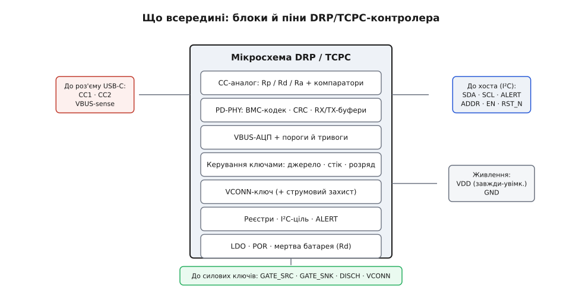
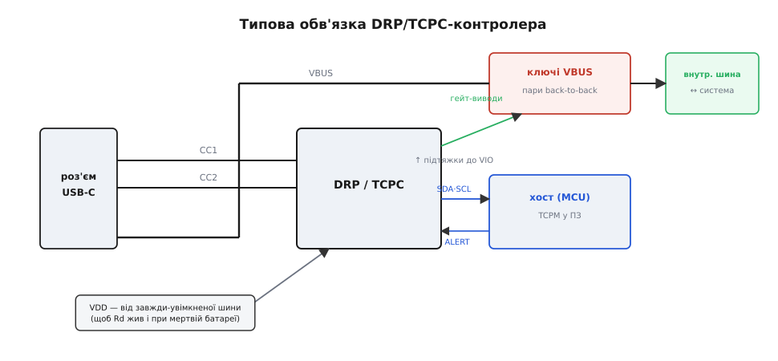
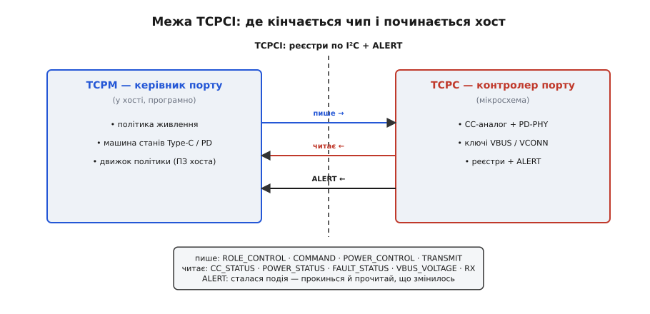

# 📋 Виводи, обв'язка й реєстри дворольового контролера

Коли треба, щоб один порт USB-C і давав живлення, і брав, і на льоту міняв напрям, усю цю логіку зазвичай кладуть в одну мікросхему. Найдивовижніше тут те, що про цілий **клас** таких мікросхем можна говорити взагалі без назв і партномерів — бо їхній інтерфейс до головного процесора **заморозила** галузева специфікація USB Type-C Port Controller Interface, скорочено **TCPCI**. Реєстр за тією самою адресою означає те саме в кожного виробника, тож мікросхеми різних заводів взаємозамінні на рівні коду. Саме ця заморозка й дає право розглядати «мікросхему дворольового контролера» як клас, а не як конкретну модель. Тут розберемо саме те, що не залежить від виробника: із чого вона зроблена всередині, які має виводи, що на них вішають і де проходить межа між чипом і програмою.

Голими руками дворольовий порт склали б із купи розсипу: аналоговий вузол, що емулює резистори на лінії керування, приймач-передавач цифрових переговорів, вимірювач напруги на шині, драйвери силових ключів, ключ живлення кабелю, трохи логіки — і все це треба ще й засинхронізувати. Мікросхема-контролер згортає цей розсип в один корпус і показує назовні рівно два обличчя: **аналогове**, повернуте до роз'єму й силових ключів, і **цифрове**, повернуте до процесора.

## Що всередині: блок-схема

Пройдімо мікросхему за сигналом — від роз'єму досередини.


*Один корпус, сім блоків. Ліворуч блоки дивляться на роз'єм (CC, VBUS), знизу — на силові ключі, праворуч — на процесор по I²C. Аналогова частина й цифрова частина навмисно рознесені по різні боки чипа.*

**CC-аналог.** Найпершими до лінії керування (CC) підходять програмовані джерела струму й компаратори. Це фізичне втілення гри на CC: чип то виставляє підтяжку вгору Rp («можу бути джерелом»), то підтяжку вниз Rd («можу бути стоком»), то опір Ra на «зайвому» виводі, а компаратори читають, яку термінацію тримає партнер. Усе, що на [лінії CC резистори Rp/Rd безмовно оголошують ролі](root:com-devices/type-c-cc), тут перетворюється на керовані струми й пороги напруги.

**PD-двигун (PHY).** Поверх тієї самої CC їдуть цифрові переговори Power Delivery. Їх кодують [самотактованим кодом BMC](root:com-devices/bmc-encoding) — рівні перемикаються так, що такт вшитий у самі дані. Блок містить кодер-декодер BMC, лічильник контрольної суми (CRC) і буфери прийому-передачі (RX/TX): процесор складає повідомлення, а PHY зсуває його бітами в кабель і назад.

**Вимірювач VBUS.** Окремий аналого-цифровий перетворювач (АЦП) стежить за напругою на силовій шині через дільник. З цього одного вимірювання виростає багато: є напруга чи нема, чи не перескочила вона поріг понаднапруги, чи впала нижче межі відключення, коли зцідити шину до безпечного нуля.

**Керування ключами.** Вузол, що подає команди на силові ключі: окремо на бік джерела, окремо на бік стоку, окремо на розрядку. У «сигнальних» чипах це логічні виводи вмикання зовнішніх ключів; у «силових» — справжні гейт-драйвери, а часом і самі силові транзистори всередині корпусу.

**VCONN-ключ.** Маленький керований ключ, що подає живлення на той вивід CC, який у реверсивному роз'ємі лишився без справи, — щоб нагодувати чип у кабелі.

**Реєстри, I²C-ціль і ALERT.** Серце цифрового боку: файл реєстрів, приймач шини I²C у ролі веденого пристрою та вивід тривоги ALERT, яким чип сіпає процесор, коли щось сталося.

**Живлення й скид.** Внутрішній лінійний стабілізатор годує решту блоків, схема ввімкнення при подачі живлення (POR) приводить усе в чистий стан, а окрема схема мертвої батареї тримає Rd живим ще до того, як з'явиться прошивка.

## Типова цоколівка

Виводи корпусу розкладають групами за призначенням — і групи ці однакові в усьому класі, хоч би скільки виводів мав конкретний корпус.

```
CC1, CC2      аналог, до роз'єму   Rp/Rd/Ra, BMC-сигнал PD, комутація VCONN
VBUS / VBSNS  аналог, вимір        АЦП міряє VBUS: є/нема, над-/недонапруга, пороги
GATE_SRC      вихід керування      пара ключа-джерела: внутрішня шина → VBUS
GATE_SNK      вихід керування      пара ключа-стоку:   VBUS → наша система
DISCH         розрядка             злити VBUS у безпечний нуль (внутр. ключ+резистор)
VCONN         живлення + ключ      подати живлення в кабель на «зайвий» CC
SDA, SCL      цифровий, I²C        реєстровий інтерфейс до хоста
ALERT / IRQ   цифровий, вихід      відкритий стік: «сталася подія, прочитай мене»
ADDR          strap                вибір I²C-адреси (щоб кілька портів жили на шині)
EN, RST_N     керування            увімкнення / скид чипа
VDD, GND      живлення             від завжди-увімкненої шини (щоб Rd не помер)
```

Дві речі варто вихопити відразу. По-перше, **CC1 і CC2 — це і термінація, і PD-сигнал, і дорога для VCONN**: три різні ролі на двох виводах, які чип розводить у часі й перемиканням. По-друге, **ALERT — з відкритим стоком**: він лише притягує лінію до землі, а вгору її тягне зовнішня підтяжка, тож на одну лінію переривання можна повісити кілька чипів, і кожен смикне її, коли має що сказати.

> 🔧 **Навіщо це.** Вивід ADDR здається дрібницею, поки у вас один порт. Та щойно портів два (док-станція, монітор із роз'єднувачем), вони сидять на одній шині I²C — і тоді strap на ADDR у кожного чипа розводить їх по різних адресах. Переплутаєте strap на двох однакових чипах — і процесор говоритиме з одним, думаючи, що з двома.

## Типова обв'язка

Тепер повісимо на ці виводи зовнішній світ.


*Мінімальна обв'язка сигнального TCPC: на CC — прямо роз'єм, на гейтах — зовнішні силові ключі, на I²C — підтяжки до логічної шини хоста, на VDD — завжди-увімкнене живлення. Силовий шлях VBUS іде повз чип, чип лише кермує ключами.*

На **CC1/CC2** вішають фактично сам роз'єм (плюс, за потреби, дрібний захист від розрядів). Ніяких зовнішніх резисторів термінації — чип сам і є термінацією. На **гейтові виводи** підвішують зовнішні силові ключі: пару [спина-до-спини для боку джерела](root:hw-power/mosfet-back-to-back) і таку саму пару для боку стоку, кожна — щоб у закритому стані глушити струм в обидва боки. Бік джерела майже завжди роблять [м'яким верхнім ключем](root:hw-power/load-switch), що піднімає напругу плавно й душить пусковий кидок. У «силовому» різновиді чипа ці ключі вже всередині, і зовнішнього нічого не треба.

На **SDA/SCL** ставлять підтяжки до логічної шини хоста (VIO), а не до VBUS — інтерфейс має жити в світі процесора. Номінал підтяжок — не з голови: він затиснутий між двома межами.

**Підтяжки I²C: між «встигнути» і «не спалити стік».**
```
верхня межа (швидкодія): фронт t_r ≈ 0.85 · R · C ≤ 300 нс   (Fast-mode 400 кГц)
   C_шини = 120 пФ  →  R ≤ 300·10⁻⁹ / (0.85 · 120·10⁻¹²) ≈ 2.9 кОм
нижня межа (струм стоку): I_OL ≤ 3 мА при V_OL = 0.4 В, живлення VIO = 3.3 В
   R ≥ (3.3 − 0.4) / (3·10⁻³) ≈ 0.97 кОм
підсумок: беремо ~2.2 кОм — і фронт устигає, і вихідний стік не перевантажено
```

На **VDD** подають живлення — і ось найтонше місце обв'язки. Спокуса взяти живлення чипа з тієї самої VBUS, якою він кермує, обертається пасткою: розряджений пристрій не матиме звідки живити контролер, а отже не виставить Rd — і зарядка його не побачить. Тому VDD ведуть від завжди-присутньої шини (маленька постійна лінія, окреме джерело чи спеціальний вивід мертвої батареї), щоб термінація стоку трималася й на цілком розрядженому приладі. На **ALERT** — підтяжка до VIO й дротик у вивід переривання процесора. Оце й уся мінімальна обв'язка: чип у центрі, роз'єм ліворуч, силові ключі зверху, процесор праворуч.

## TCPC чи TCPM: де проходить межа

Тепер найважливіше в усьому класі — де саме мікросхема закінчується й починається програма. Специфікація провела цю межу навмисно й назвала обидва боки.


*Уся розмова чипа й хоста — це запис і читання реєстрів по I²C плюс лінія ALERT як дзвінок у двері. Хост пише команди й політику, чип віддає стан і сіпає ALERT, коли щось змінилось. Однакові адреси реєстрів роблять чипи взаємозамінними.*

**TCPC** (англ. *Type-C Port Controller* — «контролер порту») — це руки: аналог CC, PD-PHY, ключі VBUS/VCONN і файл реєстрів. Він не має власної політики; він робить те, що написано в реєстрах, і піднімає ALERT, коли трапилась подія. **TCPM** (*Type-C Port Manager* — «керівник порту») — це мозок: машина станів Type-C і Power Delivery плюс політика живлення, яка вирішує, ким бути й що пропонувати. І цей мозок цілком може бути **програмою** на головному процесорі — так, наприклад, влаштовані програмні керівники в операційних системах (у Windows це розширення класу драйверів, у Linux — окремий модуль керівника порту), що ганяють машину станів, спираючись на голий TCPC.

Зустрічаються вони на файлі реєстрів. TCPM **пише** керувальні реєстри — `ROLE_CONTROL` (яку термінацію виставити, чи чергувати), `COMMAND` (разові дії на кшталт «почни шукати з'єднання»), `POWER_CONTROL` (VCONN, розрядка), `TRANSMIT` (відправити PD-повідомлення). TCPM **читає** реєстри стану — `CC_STATUS` (що на CC зараз), `POWER_STATUS` (чи є VBUS, чи джерелю я), `FAULT_STATUS` (що згоріло), `VBUS_VOLTAGE` (скільки вольтів намиряв АЦП), буфер прийому. А `ALERT` — це дзвінок: чип смикає лінію, TCPM прокидається й читає, що ж змінилось.

> 🔧 **Навіщо це.** Межа TCPCI — це і є та причина, чому ми взагалі можемо описувати цей клас без партномера. Оскільки набір реєстрів і їхні адреси заморожені, ви пишете код керівника **раз**, а тоді міняєте TCPC одного виробника на TCPC іншого — і код не помічає підміни. Автономний різновид ховає керівника у власний мікроконтролер і показує назовні свій, вищого рівня набір команд: хостові простіше (кілька коротких доручень замість цілої машини станів), але ви втрачаєте стандарт — команди вже фірмові.

Як цими реєстрами користуватися насправді — у якому порядку писати їх на старті й що читати за тривогою ALERT — з робочим C-кодом показано у вставці [⚙️ Підняти дворольовий контролер по I²C](root:com-devices/dual-role-controller/proj-drp-controller-ic.md).
