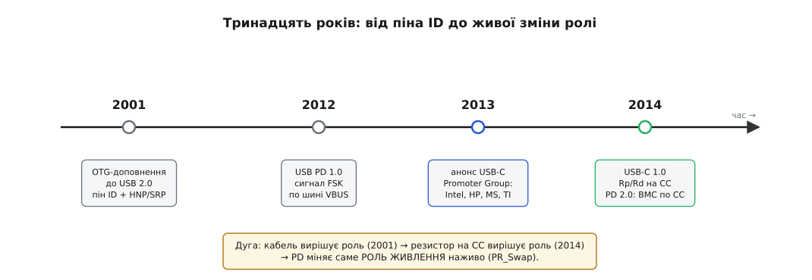
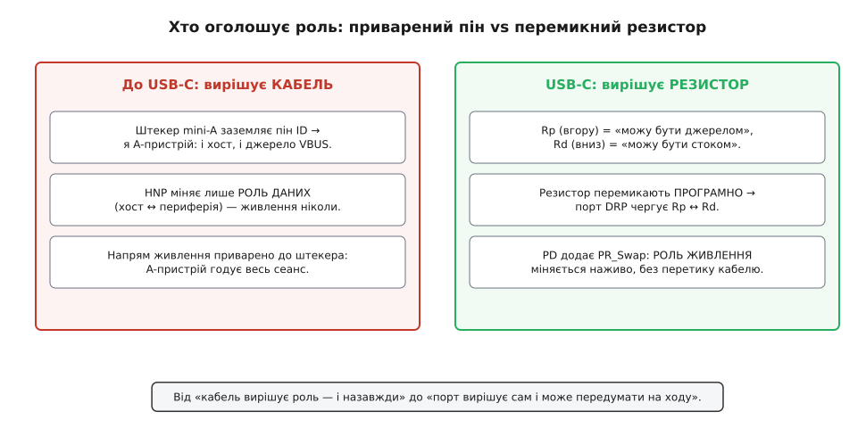

# 📜 Хто тут головний: від піна ID до гри резисторів

USB народжувався з простим і жорстким устроєм світу: є один хазяїн — і всі решта йому коряться. Комп'ютер (хост) роздає адреси, планує кожну передачу, вирішує, кому й коли говорити; клавіатура, миша, флешка — німа периферія, що озивається лише коли її спитали. Навіть живлення тече в одну, назавжди зашиту сторону: 5 вольтів завжди від хоста до пристрою, ніколи навпаки. Поки в кімнаті завжди був комп'ютер, ця асиметрія була не вадою, а зручністю — усе питання «хто головний» розв'язувала сама форма роз'єму. Класичний USB мав два несумісні штекери: плаский прямокутний тип A встромлявся тільки в хост, квадратний тип B — тільки в периферію. Кабель фізично не давав з'єднати два комп'ютери чи дві флешки. Напрям був у міді.

А тоді USB виліз із-під стола. З'явилися цифрові фотоапарати, кишенькові органайзери, перші смартфони — і вони захотіли розмовляти **одне з одним**, без комп'ютера-посередника. Фотоапарат хоче віддати знімки прямо на принтер; телефон — скинути контакти на інший телефон. І тут проста ієрархія «хост і всі решта» зайшла в глухий кут: якщо зустрічаються два пристрої, а обидва вміють бути лише периферією, то **немає кому бути хостом**. Двоє мовчать, чекаючи наказів від хоста, якого нема. Уся історія, яку ми зараз розгорнемо, — це тринадцятирічний пошук відповіді на одне питання: як дати двом рівним пристроям на ходу домовитися, хто з них цього разу головний, — і, згодом, хто кого годує.

*Тринадцять років еволюції одного питання. Кожна віха зсувала «хто головний» усе далі від жорсткого роз'єму до перемикного резистора й живих цифрових переговорів.*

## Первородний гріх: у USB завжди був один хазяїн

Щоб відчути, наскільки радикальною була зміна ролей, треба спершу зрозуміти, як глибоко асиметрія сиділа в самій кістці USB. Хост — не просто «той, хто дає струм». Це єдиний диригент шини: він роздає пристроям адреси під час підмикання (нумерація — англ. *enumeration*), він задає розклад усіх пакетів, він ініціює кожну передачу. Периферія не має права навіть писнути, поки хост її не опитає. Така будова робить протокол простим і дешевим — в одному вузлі весь розум, в інших сама покора, — але вона зашиває однобічність усюди, аж до силового дроту: VBUS (лінія живлення роз'єму) завжди виходить із хоста й входить у периферію.

Класичні роз'єми чесно втілювали цю однобічність механічно. У штекера типу A й типу B по чотири контакти — VBUS, дві сигнальні лінії D+/D−, земля — і жодного способу сказати «а тепер я побуду хостом». Роль була не станом, який можна змінити, а **геометрією**: який кінець кабелю куди влазить. Це чудово працювало, доки на одному кінці завжди сидів комп'ютер. І геть не працювало, щойно на обох кінцях опинилися рівні гаджети.

> 🔧 **Навіщо це знати.** Уся складність сучасного дворольового порту — гра резисторів, цифрові переговори, зціджування VBUS перед зміною напряму — виросла саме з боротьби проти цього первородного гріха. Розуміючи, що USB **народився** однобічним, ви бачите: кожен шар «розуму» на CC-лінії й у Power Delivery додано, щоб приховати чи оминути асиметрію, зашиту ще 1996 року. Це не примхи стандарту — це шрами від початкового устрою.

## 2001-й: роль на п'ятому піні

Перша відповідь прийшла у грудні 2001 року — доповненням **USB On-The-Go** (англ. *on the go* — «на ходу», «в дорозі») до специфікації USB 2.0. Уточнену редакцію 1.0a випустили 24 червня 2003-го. Розробляла його робоча група USB Implementers Forum (USB-IF) на прямий запит галузі портативних пристроїв, і мета була проста: дозволити двом сумісним зі стандартом пристроям поговорити безпосередньо, без комп'ютера, — уперше за історію USB. *(Усталено: OTG-доповнення до USB 2.0, ревізія 1.0 — грудень 2001; 1.0a — 24 червня 2003; USB-IF.)*

Технічно розв'язок був відвертим костуром — і саме тому повчальним. Класичні чотири контакти не вміли виражати роль, тож OTG додав **п'ятий контакт — пін ID** (від *identification* — розпізнавання) у нових малих роз'ємах mini-USB, а згодом micro-USB. Ідея елементарна: роль пристрою читається з того, **як під'єднано цей пін у штекері, який у вас увіткнули**. Штекер mini-A (і пізніше micro-A) має пін ID замкнений на землю; штекер mini-B — пін ID висить у повітрі (не під'єднаний). Пристрій дивиться на свій ID: якщо земля — «у мене А-кінець кабелю, я **A-пристрій**»; якщо висить — «у мене B-кінець, я **B-пристрій**». *(Усталено: пін ID заземлено у штекері типу A, лишено вільним у типі B; заземлений ID → A-пристрій, вільний → B-пристрій.)*

І ця A/B-роль одразу тягла за собою все інше. **A-пристрій** за замовчуванням стає хостом і — головне — **джерелом живлення**: саме він подає VBUS. **B-пристрій** стартує периферією й споживачем. Щоб один роз'єм міг прийняти обидва штекери, вигадали гніздо mini-AB (і micro-AB) — з тим самим п'ятим контактом, готовим і до заземленого, і до вільного ID. Дворольовий пристрій носив таке гніздо й дізнавався свою роль тієї миті, коли ви вирішували, яким кінцем кабелю його вжалити. Роль стала читабельною — але вирішував її, як і раніше, **кабель**, тільки тепер не формою штекера, а станом одного піна в ньому.

## HNP: передати паличку розмови, але не миску з їжею

Костур із піном ID мав кричущу ваду, і найкраще її видно на канонічному прикладі, задля якого OTG і затівали, — фотоапарат і принтер. Щоб надрукувати знімки без комп'ютера, хостом мусить бути **фотоапарат** (це в ньому сидить драйвер принтера, це він командує друком). Але уявіть, що кабель увіткнули A-кінцем у принтер: тоді за правилом піна ID хостом призначено принтер, а камеру — периферією. Усе задом наперед, і друкувати нема як. Змушувати користувача пильнувати, яким саме кінцем куди тикати, — програш; половина людей встромить навпаки.

Тому OTG приніс **HNP — Host Negotiation Protocol** (протокол узгодження хоста). HNP дозволяє двом безпосередньо з'єднаним пристроям **помінятися ролями хоста й периферії вже під час сеансу, програмно, не чіпаючи кабель**. Той, хто стартував периферією, може попросити стати хостом, коли попередній хост звільнив шину, — і естафета розмови переходить без жодного перетику. *(Усталено: HNP міняє ролі хост/периферія без фізичної зміни кабелю.)*

І ось тут — найтонше місце всієї історії, об яке спотикалися інженери. **HNP міняє тільки роль даних — хто хост, а хто периферія. Роль живлення він не чіпає взагалі.** Хоч би скільки разів партнери передавали одне одному «право говорити», VBUS весь сеанс подає той самий A-пристрій — той, чий кінець кабелю заземлив пін ID. Сам сеанс OTG за визначенням і є проміжок, доки A-пристрій тримає VBUS. A-пристрій може стати периферією за даними — і все одно лишатися джерелом живлення для того, хто тепер ним командує. *(Усталено: A-пристрій постачає VBUS упродовж усього сеансу навіть тоді, коли за даними став периферією; HNP міняє роль даних, не роль живлення.)*

Дві естафетні палички — «хто веде розмову» й «хто кого годує» — виявилися намертво розчепленими. Першу OTG навчився передавати; друга лишалася прибитою до штекера. Можна було передати паличку розмови, але не миску з їжею. І це не недогляд, а пряме породження костура: раз роль живлення прочитана з піна ID у конкретному штекері, то поки цей штекер стирчить, напрям живлення змінити нема чим.

Був у OTG і акуратний штрих для економних на батареї — **SRP, Session Request Protocol** (протокол запиту сеансу). Він дозволяв B-пристрою **попросити** A-пристрій увімкнути VBUS, коли той його зняв заради економії. У класичному USB розпоряджатися живленням шини міг лише хост; SRP дав і periферійному кінцю право постукати «увімкни, будь ласка, я хочу почати». Дрібниця, але показова: уже 2001 року стандарт намацував ідею, що навіть слабший бік має мати голос щодо живлення. *(Усталено: SRP дозволяє B-пристрою запитати ввімкнення VBUS; ініціює тільки B-пристрій і лише за знеструмленої шини.)*

## Чому пін ID муляв: зоопарк штекерів і приварений напрям

За десять років життя з OTG у інженерів і користувачів накопичилося глухе роздратування, і воно мало три корені.

Перший — **зоопарк штекерів і гнізд**. Щоб виразити роль формою заліза, довелося наплодити цілу таксономію: mini-A, mini-B, mini-AB, потім micro-A, micro-B, micro-AB. Штекери типу A й гнізда AB на полицях крамниць майже не траплялися — пересічна людина все життя бачила лише кабель із micro-B на кінці (той самий, що заряджав телефони до USB-C). Тобто механізм, який мав давати гнучкість, на практиці ховався від користувача, а інженерам додавав варіантів роз'ємів, кабелів і перевірок сумісності.

Другий — **напрям живлення, приварений до штекера**. Хоч би як гарно HNP перекидав роль даних, миска з їжею стояла нерухомо. Пристрій, який фізично міг і давати, і брати струм, усе одно був змушений оголосити напрям живлення наперед — тим кінцем кабелю, що заземлив ID, — і тримати його весь сеанс. Для павербанка, доку чи телефона, які по-справжньому хочуть то давати, то брати, це було вузьке горло.

Третій — **крихкість самого костура**. Роль трималася на одному контакті й одному стані «земля / повітря». Бруд, знос, кепський кабель, вставлений не тим кінцем, — і пристрій або мовчав, чекаючи неіснуючого хоста, або впирався не в ту роль. Механізм працював, але був тендітний і геть не гнучкий: змінити рішення можна було лише перетиком кабелю.

Усі три болячки мали спільний корінь: **роль читали з фізичного стану роз'єму, а фізичний стан не перемкнеш програмою.** Щоб роль стала по-справжньому рухомою, її оголошення треба було відірвати від геометрії штекера й перенести туди, чим може розпоряджатися сам пристрій.

## USB-C викидає костур: замість піна — резистор

Перелом принесла нова конструкція роз'єму. 3 грудня 2013 року **USB 3.0 Promoter Group** — консорціум із Intel, Hewlett-Packard, Microsoft, Renesas Electronics і Texas Instruments — оголосив, що почав розробку роз'єму нового покоління; готову «USB Type-C Cable and Connector Specification» ревізії 1.0 випустили 11 серпня 2014 року. Публічним обличчям і головою групи був (і лишається) Бред Сондерс (Brad Saunders) з Intel. *(Усталено: анонс розробки USB-C — 3 грудня 2013; специфікація USB Type-C 1.0 — 11 серпня 2014; Promoter Group: HP, Intel, Microsoft, Renesas, Texas Instruments; голова — Brad Saunders.)*

USB-C зробив роз'єм **реверсивним** — його можна встромити будь-яким боком, і немає більше «A-кінця» й «B-кінця». А це відразу вбивало старий трюк: пін ID працював лише тому, що штекери A і B різні; коли кінці стали однаковими й симетричними, розрізняти роль формою штекера вже неможливо в принципі. Костур мусив зникнути — і його викинули.

Замість піна ID USB-C приніс **гру резисторів на лінії CC** (англ. *Configuration Channel* — канал конфігурації). Замість «заземлив/не заземлив один контакт» — акуратна пара підтяжок. Бік, готовий **давати** живлення (низхідний порт, DFP), вішає на CC підтяжку вгору, до плюса, — резистор **Rp**. Бік, готовий **брати** (висхідний порт, UFP), вішає підтяжку вниз, до землі, — резистор **Rd**. Кожен бачить, який рівень напруги встояв на CC, і з нього читає і свою роль, і роль партнера, і навіть орієнтацію кабелю. *(Усталено: у USB-C джерело (DFP) виставляє на CC підтяжку Rp вгору, споживач (UFP) — Rd вниз; роль читається з рівня на CC.)*

Різниця з піном ID — не косметична, а принципова, і в ній уся суть. Пін ID був **приварений**: його стан задавав штекер, і програмно його не переставиш. А резистор на CC пристрій чіпляє **сам** — і може **перемкнути підтяжку в будь-яку мить**. Саме тому дворольовий порт (DRP) уміє **чергувати**: він поперемінно виставляє то Rp, то Rd, ніби питаючи в обидва боки «побути мені джерелом? а стоком?», і застигає в тій ролі, яку прийняв партнер. Роль з властивості кабелю стала **станом самого пристрою** — м'яким, перемикним, керованим. Механіку цього чергування й самі підтяжки детально розібрано в темі [резистори CC у USB-C](topic:com-devices/type-c-cc): підтяжки Rp/Rd, ролі DFP/UFP/DRP і те, як пасивний резистор безмовно оголошує, хто джерело, а хто стік.

*Той самий обов'язок — оголосити роль — колись виконував приварений до штекера пін, а тепер виконує резистор, який пристрій може перемкнути програмою. Ця дрібна на вигляд заміна й відв'язала роль від кабелю.*

## Останній крок: PD навчив міняти саме живлення

Та навіть гра резисторів на CC сама собою вирішує лише **початковий** напрям — той, що встоявся тієї миті, коли пристрої зчепилися. Щоб розвернути живлення **наживо**, не перетикаючи кабель (а це вже не роль даних, як у HNP, а та сама «миска з їжею», яку OTG так і не навчився передавати), потрібні справжні цифрові переговори поверх фізики. Їх приносить **USB Power Delivery (PD)**.

У PD цікава власна передісторія, що добре пояснює, чому все зійшлося саме на CC. Першу специфікацію **USB PD 1.0 випустили 5 липня 2012 року — ще до USB-C**, і замислена вона була для старих роз'ємів A/B. Тому й сигнал вона слала дивним на теперішній погляд способом — частотною маніпуляцією (англ. *frequency-shift keying*, FSK) прямо **по силовій лінії VBUS**: цифрові переговори підмішували до самої напруги живлення. Спосіб працював, але був громіздкий і прив'язаний до застарілих гнізд, і широкого визнання так і не здобув. *(Усталено: USB PD 1.0 — 5 липня 2012; сигналізація FSK по VBUS; орієнтована на легасі-роз'єми; поширення не набула.)*

Коли надійшов USB-C зі своєю лінією CC, PD переосмислили. У редакції 2.0 (2014) переговори **зняли з VBUS і перенесли на CC**, а кодування замінили на надійніше — двофазне манчестерське BMC (англ. *biphase mark coding*). Тепер той самий тонкий провід CC, що пасивними резисторами оголошував початкову роль, ще й ніс живу цифрову розмову між портами. Інтерес до старого FSK по VBUS згас. *(Усталено: у PD 2.0 сигналізацію перенесено з VBUS на CC із кодуванням BMC; PD-переговори йдуть по лінії CC.)*

І аж тепер, маючи на одному дроті і фізичне оголошення ролі, і цифровий канал, USB-C з PD зробив те, про що OTG міг лише мріяти, — **зміну ролі живлення, PR_Swap (power role swap)**. Партнери по PD домовляються словами й міняються місцями джерела та стоку **наживо, на встромленому кабелі**; при цьому вони перемикають і самі підтяжки — хто мав Rp, бере Rd, і навпаки, — щоб фізичне оголошення ролі збіглося з новою домовленістю. Естафетна паличка живлення, тринадцять років прибита до штекера, нарешті пішла з рук у руки. Механізм самих переговорів — повідомлення, контракт «напруга плюс струм», підтвердження — розібрано в темі [USB Power Delivery](topic:com-devices/usb-pd): цифровий діалог по CC, що дозволяє двом портам не просто ввімкнути живлення, а й погодити його рівень і напрям.

Варто чесно розділити два «обміни ролями», щоб не плутати їх, як плутали свого часу інженери. HNP у OTG міняв **роль даних** (хто хост) — і не торкався живлення. PR_Swap у PD міняє **роль живлення** (хто джерело) — зовсім інша естафета, окрема від того, хто веде дані. USB-C із Power Delivery уперше дав обидві палички в руки й дозволив передавати кожну незалежно та на ходу.

## Повне коло

Відступімо на крок і подивімося на всю дугу. USB народився з одним хазяїном, і роль була вкарбована у форму штекера — жорстко, назавжди. OTG 2001 року вперше зробив роль **читабельною станом контакту**: заземлений чи вільний пін ID у тому кінці кабелю, що вам увіткнули, — і навчив передавати паличку розмови через HNP, лишивши, однак, живлення прибитим до штекера. USB-C 2014 року **відв'язав роль від кабелю зовсім**, замінивши приварений пін перемикним резистором Rp/Rd на CC, — тепер оголошення ролі стало м'яким станом самого пристрою. А Power Delivery, переїхавши з VBUS на ту саму CC, приніс **живу зміну саме ролі живлення** — PR_Swap, те, чого OTG так і не зміг.

Один пін ID → пара резисторів Rp/Rd → цифровий PR_Swap: тринадцять років дороги від «кабель вирішує роль — і назавжди» до «порт вирішує сам і може передумати на ходу». І коли сьогодні ноутбук уранці живиться від зарядки, а ввечері тим самим гніздом заряджає телефон, у цьому буденному жесті — уся ця історія: асиметрія, зашита ще 1996 року, костур із п'ятим піном, розчеплені естафети даних і живлення й нарешті резистор, який пристрій навчився перемикати сам.

---
