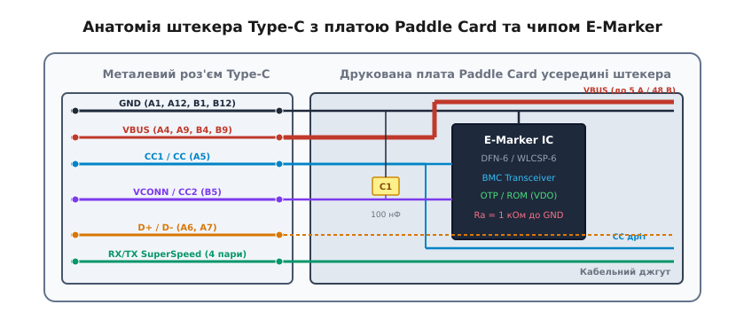
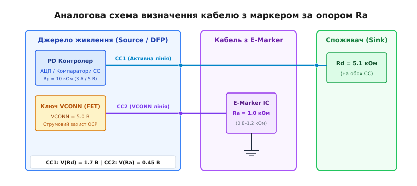
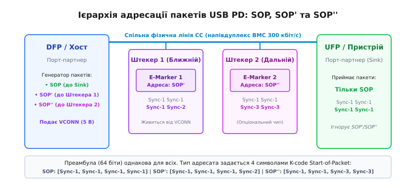
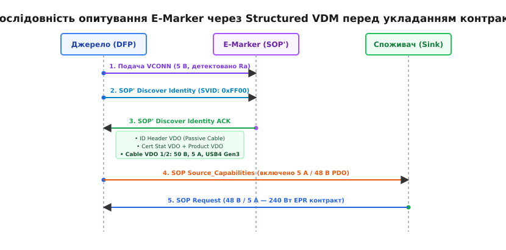
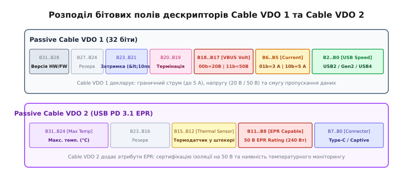
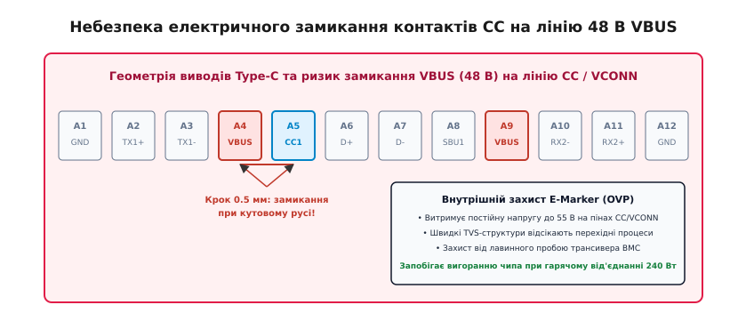

# E-Marker: чип автентифікації кабелю

<preknowlist>
- [Type-C без PD: резистори CC](root:com-devices/type-c-cc) — фізичне призначення ліній CC1/CC2, дільник Rp/Rd, визначення ролей DFP/UFP та орієнтації штекера.
- [USB Power Delivery](root:com-devices/usb-pd) — протокол цифрових переговорів по лінії CC, послідовність укладання силових контрактів та перемикання напруг.
- [USB PD EPR: живлення до 240 Вт](root:com-devices/usb-pd-epr) — розширений діапазон живлення до 48 В, вимоги до потрійної готовності (джерело, кабель, пристрій) та церемонія EPR_Mode.
- [Кодування BMC у Type-C](root:com-devices/bmc-encoding) — двофазне маркувальне кодування (BMC), пакети K-кодів SOP/SOP'/SOP'' та апаратний контроль цілісності CRC-32.
</preknowlist>

Коли крізь звичайний мідний провідник пропускають електричний струм силою 5 ампер, закон Джоуля — Ленца перетворює будь-яку паразитну неоднорідність контакту на джерело інтенсивного виділення тепла. Якщо опір зношеного або забрудненого гнізда роз'єму становить лише 0.15 Ом, теплова потужність, що виділяється в об'ємі кількох кубічних міліметрів штекера, сягає майже чотирьох ватів. У закритому пластиковому корпусі штекера такий розігрів за лічені хвилини оплавляє діелектрик, окислює контакти й спричиняє коротке замикання силової шини на сусідні сигнальні лінії.

Ситуація ускладнюється тим, що ззовні кабелі з тонким проводом калібру AWG 28 (розраховані щонайбільше на 3 А) та кабелі з потовщеними жилами AWG 20–22 (здатні тримати 5 А) виглядають абсолютно однаково. Обидва закінчуються ідентичними роз'ємами USB Type-C. Якщо джерело живлення потужністю 100 Вт або 240 Вт почне видавати максимальний струм у невідомий дріт наосліп, безпека всієї системи опиняється під загрозою.

Щоб унеможливити цю небезпеку, стандарт USB Type-C та специфікація USB Power Delivery вивели кабель із категорії пасивних металевих провідників у категорію активних цифрових пристроїв. Будь-який кабель, здатний працювати зі струмом понад 3 А (аж до 5 А в режимах 100 Вт SPR та 240 Вт EPR) або передавати дані на швидкостях USB 3.2 Gen1/Gen2 (5–10 Гбіт/с) та USB4 (20–120 Гбіт/с), зобов'язаний містити всередині штекера спеціалізовану інтегральну мікросхему — електронний маркер (англ. *Electronically Marked Cable*, E-Marker).

```
P_втрат = I² · R
= 5² · 0.15          [струм I = 5 А, опір контакту R = 0.15 Ом]
= 25 · 0.15
= 3.75 Вт            [потужність локального теплового розігріву штекера]
```

## Електродинамічна необхідність маркування: опір жил та скін-ефект

Причина обов'язкового використання E-Marker полягає у фізичних законах протікання струму та поширення високочастотних сигналів.

Розглянемо стандартний кабель завдовжки 2 метри. Якщо такий кабель виготовлено з тонкого дроту калібру AWG 28 (площа перерізу міді близько 0.08 мм²), питомий опір кожної жили становить приблизно 0.21 Ом на метр. З урахуванням прямого та зворотного проводів загальний опір силового кола сягає:

```
R_петлі = 2 · L · R_пит
= 2 · 2.0 · 0.21     [довжина L = 2 м, опір жили R_пит = 0.21 Ом/м]
= 0.84 Ом            [повний опір силової петлі VBUS та GND]
```

Якщо пустити по такому кабелю струм силою 5 А, спад напруги на проводах становитиме:

```
ΔV = I · R_петлі
= 5 · 0.84           [струм I = 5 А, опір петлі R = 0.84 Ом]
= 4.20 В             [падіння напруги на кабелі]
```

При вихідній напрузі джерела 5 В до споживача дійде лише 0.8 В, а в самому кабельному джгуті виділиться понад 20 Вт теплової потужності, що неминуче розплавить ізоляцію. 

Натомість силова кабельна збірка на 5 А використовує мідні жили калібру AWG 20–21 (переріз 0.52 мм², опір близько 0.033 Ом/м), де сумарний спад напруги при струмі 5 А становить лише 0.66 В, а теплові втрати розсіюються по всій довжині кабелю без ризику перегріву. Оскільки споживач не може виміряти товщину міді всередині ізоляції до початку навантаження, чип E-Marker виступає єдиним гарантом того, що дріт фізично здатний пропустити 5 А.

Другий аспект — передача гігабітних цифрових потоків. На частотах 10–20 ГГц (протоколи USB 3.2 Gen2, USB4 Gen3 та Thunderbolt 4) глибина проникнення струму в товщу міді через скін-ефект зменшується до величини менше 0.5 мкм. Високочастотне загасання в діелектрику та міжсимвольна інтерференція (*Inter-Symbol Interference*, ISI) різко спотворюють очну діаграму сигналу. Контролер хоста не може запустити лінії SuperSpeed на максимальній швидкості наосліп: йому необхідно знати паспортне значення затримки розповсюдження сигналу (*Cable Latency*) та частотну категорію екранування, які чип E-Marker повідомляє у своїх дескрипторах.

## Фізична будова штекера та плата Paddle Card

Мікросхема E-Marker не може розміщуватися всередині довгого гнучкого джгута проводів: вона встановлюється на крихітній допоміжній друкованій платі (*paddle card*), впаяній між контактними пелюстками металевого роз'єму Type-C та жилами кабелю всередині литого пластикового корпусу штекера.


*Анатомія штекера Type-C з монтажною платою Paddle Card та чипом E-Marker. Наскрізні силові шини VBUS і GND проходять широкими полігонами, а сигнальні контакти CC1/CC2 підведені до мікросхеми.*

Друкована плата штекера виконує роль перехідного комутатора:
- Силові лінії `VBUS` (контакти A4, A9, B4, B9) та `GND` (A1, A12, B1, B12) розводяться широкими мідними полігонами на внутрішніх і зовнішніх шарах плати для мінімізації власного опору (менше 10–15 мОм);
- Високошвидкісні диференційні пари SuperSpeed (TX1/RX1, TX2/RX2) проходять наскрізь у вигляді узгоджених смугових ліній з хвильовим опором 90 Ом;
- Лінія конфігурації `CC1` (контакт A5) проходить крізь кабель наскрізним окремим проводом до протилежного штекера, забезпечуючи цифровий канал переговорів між портами, і водночас відгалужується до входу трансивера E-Marker;
- Контакт `CC2` (B5), який при з'єднанні перетворюється на лінію `VCONN`, підключається до виводу живлення мікросхеми E-Marker.

Конструкція, де мікросхема встановлена лише в одному штекері кабельної збірки, зветься кабелем з одним маркером (*Single-Ended Marked Cable*). Якщо ж кабель містить два контролери (по одному в кожному кінці штекера), вони функціонують незалежно: кожен обслуговує свій кінець з'єднання. Детальний розбір кремнієвої структури, внутрішніх вузлів LDO, трансиверів та схем OVP-захисту наведено у вставці [🔌 Архітектура чипа E-Marker](root:com-devices/e-marker/comp-emarker-ic.md).

## Живлення мікросхеми: шина VCONN та аналогове детектування Ra

Оскільки в момент під'єднання кабелю силова шина VBUS повністю знеструмлена (напруга 0 В задля безпеки), мікросхема E-Marker не може живитися від неї. Стандарт передбачає виділену лінію живлення допоміжної електроніки — шину **VCONN** (англ. *Voltage Connection*).

У реверсивному роз'ємі Type-C присутні два симетричні контакти каналу конфігурації: CC1 та CC2. Кабельний джгут містить лише один фізичний дріт CC, що з'єднує контакт CC1 першого штекера з контактом CC1 другого. Другий контакт (CC2) у кабелі не має наскрізного з'єднання — він підведений лише до чипа всередині власного штекера.

```
Джерело (DFP)                 Кабель з E-Marker                 Споживач (Sink)
┌──────────────┐             ┌─────────────────┐               ┌──────────────┐
│  Rp (10 кОм) │──► CC1 ────►│ Наскрізний дріт ├──────► CC1 ──►│ Rd (5.1 кОм) │
│              │             │                 │               │              │
│  Rp (10 кОм) │──► CC2 ────►│ Ra (1.0 кОм) ───┼─► GND         │ Rd (5.1 кОм) │
└──────────────┘             └─────────────────┘               └──────────────┘
```

Щоб джерело зрозуміло, що в кабелі присутній електронний маркер, чип E-Marker постійно утримує на своєму виводі живлення внутрішній аналоговий опір підтяжки до землі **Ra** (номінал 1.0 кОм, нормативний допуск стандарту від 800 Ом до 1200 Ом).

Процес розпізнавання відбувається за чітким аналоговим алгоритмом:
1. До під'єднання кабелю джерело виставляє підтяжки `Rp` (або стабільні джерела струму) на обидва свої контакти CC1 і CC2.
2. При підключенні кабелю зі споживачем на одному з контактів CC джерела утворюється дільник напруги `Rp / Rd` (де `Rd` = 5.1 кОм), а на другому контакті — дільник `Rp / Ra` (де `Ra` = 1.0 кОм).
3. Компаратори та АЦП контролера джерела вимірюють напруги на обох виводах:
   - Вивід із напругою близько 1.6–1.8 В (рівень `vRd`) однозначно визначається як **активна лінія зв'язку CC**, що підключена до споживача;
   - Вивід із напругою близько 0.4–0.5 В (рівень `vRa`) визначається як **лінія живлення маркера кабелю**.

```
V_CC1 = V_внутр · Rd / (Rp + Rd)
= 5.0 · 5100 / (10000 + 5100)      [джерело 3 А: Rp = 10 кОм, Rd = 5.1 кОм]
= 5.0 · 5100 / 15100
≈ 1.69 В                           [попадає у вікно детектування vRd]

V_CC2 = V_внутр · Ra / (Rp + Ra)
= 5.0 · 1000 / (10000 + 1000)      [джерело 3 А: Rp = 10 кОм, Ra = 1.0 кОм]
= 5.0 · 1000 / 11000
≈ 0.45 В                           [попадає у вікно детектування vRa]
```


*Аналогова схема визначення орієнтації та наявності маркера кабелю. Компаратори джерела розрізняють рівні напруги на дільниках Rp/Rd (1.69 В) та Rp/Ra (0.45 В).*

Переконавшись у наявності опору `Ra`, джерело відкриває внутрішній силовий польовий транзистор і подає на лінію CC2 постійну напругу **VCONN = 5.0 В** (зі струмовим обмеженням від 100 мА до 1 А залежно від класу порту). Чип E-Marker оживає, завантажує свої конфігураційні таблиці та переходить у режим очікування цифрових команд.

> 🔧 **Навіщо це.** Якщо спроєктувати пристрій-споживач і помилково замкнути контакти CC1 та CC2 разом одним резистором 5.1 кОм (як це трапилося в першій ревізії одноплатного комп'ютера Raspberry Pi 4), пристрій нормально працюватиме з простими кабелями без маркерів. Але при спробі під'єднати кабель з E-Marker опір `Ra` чипа опиниться в паралелі з `Rd` пристрою, сумарний опір впаде нижче 800 Ом, і розумне джерело живлення вирішить, що на лінії коротке замикання, та відмовиться вмикати VBUS. Правило непорушне: контакти CC1 та CC2 пристрою повинні мати два повністю ізольовані резистори `Rd` по 5.1 кОм кожен.

## Комутація живлення при зміні ролей (VCONN Swap)

У складних дворольових системах (наприклад, ноутбук, підключений до монітора з вбудованим блоком живлення) ролі джерела та споживача енергії можуть змінюватися динамічно без фізичного висмикування роз'єму. Ця процедура зветься перемиканням силових ролей (*Power Role Swap*, PR_Swap).

Якщо початковий постачальник живлення відключає свій силовий перетворювач, постає питання: як забезпечити безперервне живлення мікросхеми E-Marker, аби кабель не втратив зв'язок і не скинув параметри узгодженого альтернативного режиму DisplayPort?

Для цього протокол USB PD реалізує спеціальну процедуру **VCONN Swap**:
1. Порт, який наразі живить шину VCONN, надсилає повідомлення `VCONN_Swap`.
2. Партнер відповідає підтвердженням `Accept`.
3. Приймач вмикає власне джерело 5 В на свій пін VCONN, переходячи у стан паралельного живлення (*Make-Before-Break*).
4. Початкове джерело знімає свою напругу з лінії VCONN.
5. Приймач надсилає завершальне повідомлення `PS_RDY`.

Завдяки цьому чип E-Marker не відчуває навіть короткочасного просідання напруги живлення, продовжуючи безперервно утримувати контекст налаштувань ліній SuperSpeed.

## Адресація пакетів на спільній лінії: SOP, SOP' та SOP''

Після подачі напруги VCONN лінія конфігурації CC стає спільною напівдуплексною цифровою шиною, якою повинні одночасно спілкуватися три сторони: джерело (DFP), кабель (E-Marker) та споживач (UFP). Усі пакети передаються тим самим фізичним методом BMC (*Biphase Mark Coding*) зі швидкістю 300 кбіт/с.

Щоб повідомлення, адресовані кабелю, не сприймалися споживачем як команди керування живленням, протокол USB PD використовує канальну адресацію на рівні спеціальних службових маркерів початку кадру — впорядкованих наборів символів K-кодів (англ. *Ordered Sets*).

```
                               Фізична лінія CC
              ┌─────────────────────────────────────────────────┐
              │                                                 │
      ┌───────┴──────┐                                  ┌───────┴──────┐
      │  Джерело DFP │                                  │ Споживач UFP │
      └───────┬──────┘                                  └───────┬──────┘
              │ ── SOP (Керування живленням VBUS) ─────────────►│
              │                                                 │
              │ ── SOP' (Опитування ближнього маркера) ─►┌──────┴──────┐
              │                                          │  E-Marker 1 │
              │                                          └─────────────┘
              │                                                 │
              │ ── SOP'' (Опитування дальнього маркера) ─►┌─────┴──────┐
              │                                           │  E-Marker 2 │
              │                                           └─────────────┘
```

Кожен пакет USB PD починається з 64-бітової преамбули (чергування нулів та одиниць `010101...` для синхронізації ФАПЧ приймача), за якою йде послідовність із чотирьох 5-бітових символів канального коду 4b/5b:

| Тип адресації | Послідовність K-кодів | Призначення та адресат |
| :--- | :--- | :--- |
| **SOP** (*Start of Packet*) | `Sync-1, Sync-1, Sync-1, Sync-1` | Прямий зв'язок між двома портами (DFP ↔ UFP). Кабельні маркери повністю ігнорують ці пакети |
| **SOP'** (*Start of Packet Prime*) | `Sync-1, Sync-1, Sync-1, Sync-2` | Зв'язок між портом-контролером та маркером кабелю, розташованим у **ближньому штекері** |
| **SOP''** (*Start of Packet Double Prime*) | `Sync-1, Sync-1, Sync-3, Sync-3` | Зв'язок між портом-контролером та маркером кабелю, розташованим у **дальньому штекері** |


*Ієрархія адресації пакетів USB PD. Преамбула однакова для всіх пакетів, а 4 символи K-коду на початку кадру точно визначають, хто саме повинен обробляти пакет: кінцевий порт (SOP) чи один із чипів у штекерах кабелю (SOP' / SOP'').*

Кабельний маркер є виключно пасивним відповідачем (*Slave*): він ніколи не ініціює передачу самостійно й не генерує повідомлень без попереднього запиту. E-Marker постійно прослуховує лінію CC. Коли апаратний декодер виявляє префікс `SOP'`, чип зчитує повідомлення, обчислює контрольну суму CRC-32 і, якщо пакет адресований йому, готує відповідь.

## Протокол Structured VDM: отримання цифрового паспорта кабелю

Для читання параметрів кабелю використовується підмножина протоколу PD — структуровані повідомлення, визначені виробником (англ. *Structured Vendor Defined Messages*, Structured VDM). 

Взаємодія відбувається за строго регламентованою послідовністю кроків:

```
DFP (Джерело)                                          E-Marker (SOP')
      │                                                       │
      │── 1. Подача VCONN (виявлено Ra на CC2) ──────────────►│ (Чип завантажується)
      │                                                       │
      │── 2. SOP' Discover Identity Request (SVID: 0xFF00) ──►│ (Обчислює CRC-32)
      │                                                       │
      │◄─ 3. SOP' Discover Identity ACK ──────────────────────│ (Відправляє масив VDO)
      │      [ID Header | Cert Stat | Product | Cable VDO]    │
      │                                                       │
      ▼ (DFP перевіряє ліміт струму: 5 А, напруга 50 В)
```

1. **Ініціалізація запиту.** Джерело формує пакет `Discover Identity Request` з адресацією `SOP'`. У заголовку VDM встановлюється стандартний ідентифікатор консорціуму `SVID = 0xFF00` (*USB-IF Standard*), тип `Structured VDM`, тип команди `REQ` (00b) та код операції `Discover Identity` (0x01).
2. **Обробка чипом.** E-Marker приймає запит, перевіряє коректність контрольної суми CRC-32 та генерує відповідь `Discover Identity ACK`.
3. **Передача дескрипторів VDO.** У тілі відповіді чип повертає структурований масив 32-бітових слів даних — об'єктів VDO (*Vendor Data Objects*), що містять повний паспорт кабельної збірки.
4. **Таймаут відповіді.** Специфікація виділяє на відповідь суворе часове вікно `tVDMResponse` тривалістю не більше 30 мс. Якщо за цей час E-Marker не відповів (або на лінії стався збій CRC), джерело повторює запит до трьох разів (`nCapsCount = 3`). Якщо відповіді немає — джерело робить остаточний висновок: між пристроями встановлено звичайний немаркований кабель зі струмовим лімітом **не більше 3 А** та напругою **до 20 В**.


*Повна часова діаграма послідовності переговорів. Лише після успішного опитування E-Marker через SOP' та підтвердження спроможності 5 А / 50 В джерело має право запропонувати споживачу 100-ватні або 240-ватні профілі живлення.*

## Структура дескрипторів кабелю (VDO)

Інформаційний паспорт кабелю закодований у послідовності 32-бітових слів. 


*Розподіл бітових полів дескрипторів Cable VDO 1 та Cable VDO 2, що визначають граничні струми, напруги, смугу пропускання даних та наявність температурного сенсора.*

Повний синтаксис та бітові карти всіх полів зафіксовані в специфікації USB-IF:
- **`ID Header VDO`:** Визначає базовий тип пристрою. У бітах B29..B27 закодовано тип продукту: `011b` для пасивного кабелю (*Passive Cable*) або `100b` для активного (*Active Cable*). Молодші 16 бітів (B15..B0) містять офіційний `USB Vendor ID (VID)` виробника.
- **`Cert Stat VDO`:** Зберігає 32-бітовий тестовий сертифікаційний ідентифікатор `XID` (або `TID`), наданий акредитованою випробувальною лабораторією USB-IF під час проходження офіційної сертифікації кабелю.
- **`Product VDO`:** Містить 16-бітовий ідентифікатор моделі виробу `PID` (B31..B16) та версію апаратної ревізії `bcdDevice` (B15..B0).
- **`Passive Cable VDO 1`:** Головний функціональний дескриптор:
  - Біти **B18..B17 (`Maximum VBUS Voltage`):** допустима напруга ізоляції. Значення `00b` декларує максимальну напругу 20 В (діапазон SPR до 100 Вт), а значення `11b` декларує напругу до 50 В (діапазон EPR до 240 Вт);
  - Біти **B6..B5 (`VBUS Current Capability`):** максимальний струм провідників. `01b` — 3 А; `10b` — 5 А;
  - Біти **B2..B0 (`USB Highest Speed`):** швидкісна категорія ліній передачі даних: `000b` — лише USB 2.0 (480 Мбіт/с); `001b` — USB 3.2 Gen1 (5 Гбіт/с); `010b` — USB 3.2 Gen2 / USB4 Gen2 (10 Гбіт/с); `011b` — USB4 Gen3 (40 Гбіт/с); `100b` — USB4 Gen4 (80/120 Гбіт/с).
- **`Passive Cable VDO 2` (введений у специфікації USB PD 3.1):** Спеціалізований дескриптор для кабелів підвищеної потужності EPR 240 Вт:
  - Біти **B31..B24 (`Max Temp`):** максимальна робоча температура оболонки та штекера в °C (наприклад, 105 °C);
  - Біти **B15..B12 (`Thermal Sensor`):** наявність інтегрованого кремнієвого термодатчика в штекері;
  - Біти **B11..B8 (`EPR Capable`):** прапорець апаратної сертифікації на напругу 50 В.

Повний довідник бітових масок, значень констант та правил декодування зібрано в документі [📋 Дескриптори Structured VDM та VDO](root:com-devices/e-marker/api-vdm-descriptors.md), а готову бібліотеку на мовах C та C++20 для вбудованих мікроконтролерів представлено у проєкті [⚙️ Розбір та валідація дескрипторів кабелю на C/C++](root:com-devices/e-marker/proj-vdm-decoder.md).

## Конфігурація альтернативних режимів (Alternate Modes)

Окрім силових параметрів живлення, чип E-Marker бере пряму участь у налаштуванні альтернативних режимів передачі мультимедійних даних: **DisplayPort Alternate Mode** та **PCI Express / Thunderbolt**.

Коли користувач підключає монітор 4K або 8K через кабель Type-C, відеокарта комп'ютера не може просто перемкнути лінії SuperSpeed у режим DisplayPort: спершу необхідно з'ясувати частотні можливості кабелю.

Процедура узгодження виконується в кілька етапів:
1. Хост надсилає команду `SOP' Discover SVIDs`. Кабель повертає список підтримуваних стандартів, де присутній SVID `0xFF01` (VESA DisplayPort).
2. Хост надсилає команду `SOP' Discover Modes` із параметром `SVID = 0xFF01`.
3. E-Marker повертає спеціалізований дескриптор `DisplayPort Cable VDO`, де зазначено:
   - Підтримку швидкостей передачі: DP 1.4 HBR3 (8.1 Гбіт/с на лінію) або DP 2.1 UHBR10 / UHBR20 (до 20 Гбіт/с на лінію);
   - Конфігурацію контактів (*Pin Assignment*): розкладка `Pin Assignment C` (всі 4 пари SuperSpeed віддаються під відеопотік 8K) або розкладка `Pin Assignment D` (2 пари під DisplayPort 4K, а 2 пари залишаються для передачі даних USB 3.2 Gen2 зі швидкістю 10 Гбіт/с);
   - Наявність пасивних ліній `SBU1/SBU2`, необхідних для передачі допоміжного каналу DisplayPort AUX Channel (керування яскравістю, передача EDID монітора та HDCP).
4. Лише після отримання позитивної відповіді від кабелю хост надсилає команду `Enter Mode`, перемикаючи внутрішній мультиплексор роз'єму.

## Автентифікація USB Type-C та захист від підробок

Оскільки бітові поля дескрипторів VDO в простих мікросхемах E-Marker зберігаються у відкритому вигляді, недобросовісні виробники дешевих кабелів можуть прошити значення «5 А / 50 В» у пам'ять мікросхеми, розпаяної на тонкому проводі AWG 28. Такий фальсифікований кабель формально відповість на запит `Discover Identity`, але під час передачі 240 Вт перегріється.

Для запобігання фальсифікаціям консорціум USB-IF розробив протокол криптографічної автентифікації — **USB Type-C Authentication Specification**.

```
Хост / Джерело (Ініціатор)                            Кабель із крипто-чипом
           │                                                     │
           │── 1. Запит ланцюжка сертифікатів (AUTH_GET_CERT) ──►│
           │                                                     │
           │◄─ 2. Сертифікат X.509, підписаний USB-IF CA ────────│
           │                                                     │
           ▼ (Перевірка підпису за вшитим публічним ключем USB-IF)
           │                                                     │
           │── 3. Генерація випадкового числа Nonce (Challenge) ─►│
           │                                                     │
           │◄─ 4. Цифровий підпис ECDSA P-256 (Response) ────────│
           │                                                     │
           ▼ (Верифікація підпису: кабель справжній та сертифікований)
```

Криптографічний захист будується на асиметричній криптографії:
1. Контролер E-Marker містить у захищеній захищеній від зчитування зоні кремнію унікальний закритий ключ (*Private Key*) та сертифікат відкритого ключа стандарту X.509, підписаний кореневим центром сертифікації USB-IF (*Root Certificate Authority*).
2. Джерело живлення запитує сертифікат кабелю командою `AUTH_GET_CERT` і перевіряє дійсність цифрового підпису за допомогою вшитого в пам'ять джерела публічного кореневого ключа USB-IF.
3. Якщо сертифікат дійсний, джерело генерує 256-бітове псевдовипадкове число (*Challenge Nonce*) і відправляє його чипу в кабелі.
4. Апаратний криптографічний співпроцесор E-Marker обчислює геш за алгоритмом SHA-256 та формує цифровий підпис за стандартом **ECDSA на еліптичній кривій NIST P-256**.
5. Джерело перевіряє отриманий підпис. Лише після успішної автентифікації контролер джерела активує видачу максимального струму 5 А та дозволяє активацію розширеного діапазону напруг EPR (до 48 В).

Якщо кабель повертає недійсний сертифікат або не підтримує криптографічний виклик, корпоративні ноутбуки, медичне обладнання чи потужні док-станції обмежують споживання безпечним рівнем 3 А (60 Вт) або блокують передачу конфіденційних даних по шині USB4.

## Термічний моніторинг у режимі EPR (240 Вт)

При передачі 240 Вт (48 В при струмі 5 А) розрив силового кола під навантаженням або висмикування штекера спричиняє виникнення потужної електричної дуги. Ба більше, мікроскопічний знос контактного шару золота або потрапляння пилу здатні збільшити перехідний опір контакту VBUS з 15 мОм до 0.5 Ом.

У цьому випадку на контакті виділятиметься катастрофічна теплова потужність:

```
P = I² · R_контакту
= 5² · 0.5           [струм I = 5 А, пошкоджений контакт R = 0.5 Ом]
= 25 · 0.5
= 12.5 Вт            [еквівалент точкового паяльника всередині роз'єму]
```

Для запобігання пожежі мікросхеми E-Marker стандарту USB PD 3.1 містять вбудовані кремнієві датчики температури, розташовані безпосередньо біля симетричних контактних пелюсток роз'єму. 

Контролер джерела періодично опитує дескриптор `Passive Cable VDO 2` або надсилає структуровані запити телеметрії. Якщо температура штекера перевищує встановлену безпечну межу (зазвичай 80–90 °C), джерело живлення миттєво ініціює процедуру плавного зниження струму до 3 А або надсилає команду `Hard Reset`, повністю вимикаючи подачу напруги VBUS за час менше 5 мс.

## Ризик високовольтного замикання на VBUS (48 В)

Геометрія контактної групи роз'єму USB Type-C створює специфічний апаратний ризик для мікросхеми E-Marker. Відстань між сусідніми контактами гнізда становить лише 0.5 мм. Силовий контакт `VBUS` (A4/B9) розташований безпосередньо поруч із сигнальним контактом `CC1` (A5) та контактом `VCONN` (B5).


*Небезпека електричного замикання між пінами VBUS (48 В) та CC/VCONN при кутовому висмикуванні штекера. Внутрішній OVP-захист чипа E-Marker витримує постійну напругу 55 В, запобігаючи пробою.*

Під час неакуратного витягання кабелю під кутом або механічного розхитування роз'єму пружні контакти штекера можуть на частки мікросекунди перемкнути лінію 48 В VBUS на лінію CC1 або VCONN. Якщо мікросхема E-Marker розрахована лише на низьковольтне живлення 5 В, такий інцидент спричиняє лавинний пробій кремнієвих p-n переходів, деструкцію кристала та повне виведення кабелю з ладу.

Сучасні сертифіковані мікросхеми E-Marker для кабелів EPR проєктуються за технологією діелектричної ізоляції (*SOI / High-Voltage BCD*) і мають інтегровані швидкодіючі супресори, що витримують постійну напругу зміщення **до 50–55 В DC** на лініях CC та VCONN, гарантуючи живучість кабелю при будь-яких гарячих перемиканнях під повним навантаженням.

## Практична діагностика та інженерний аналіз кабелів

При налагодженні апаратури та перевірці кабелів у лабораторії розробник має у своєму розпорядженні кілька методів зчитування E-Marker:

1. **Апаратні USB-тестери з режимом E-Marker Reader.** Портативні прилади (наприклад, Power-Z KM003C або FNIRSI FNB58) мають автономне джерело живлення, самостійно подають напругу VCONN 5.0 В на контакт CC2, надсилають команду `SOP' Discover Identity` і відображають розшифровані поля VDO на власному дисплеї (VID виробника, струм 3 А / 5 А, напругу 20 В / 50 В та швидкість USB 2.0 / USB 3.2 / USB4).
2. **Професійні аналізатори протоколу USB PD.** Пристрої апаратного перехоплення трафіку (Total Phase USB Power Delivery Analyzer, Ellisys USB Explorer 350) підключаються в розрив лінії CC і записують повний потік необроблених пакетів BMC із фіксацією часових інтервалів `tVDMResponse`, преамбул та контрольних сум CRC-32.
3. **Читання через налагоджувальні інтерфейси операційної системи.** В операційних системах Linux стан підключеного кабелю та його дескриптори можна переглянути через підсистему Type-C у віртуальній файловій системі `sysfs` за шляхом `/sys/class/typec/portX/portX-plug0/`.

## Підсумок: тристороння архітектура узгодження

Електронний маркер кабелю докорінно змінює класичну модель підключення «джерело — навантаження». Завдяки E-Marker екосистема USB Type-C / USB PD перетворилася на замкнену тристоронню систему цифрового узгодження, де кожне підвищення напруги чи струму можливе лише за абсолютної згоди всіх трьох учасників:

1. **Джерело (Source / DFP)** заявляє свої максимальні енергетичні можливості, живить маркер напругою VCONN та ініціює опитування;
2. **Кабель (E-Marker)** виступає незалежним апаратним паспортом та обмежувачем безпеки, звітуючи про допустимий струм (3 А або 5 А), граничну напругу (20 В або 50 В), швидкість шини даних та температуру;
3. **Споживач (Sink / UFP)** аналізує надані ліміти й формує силовий запит, який гарантовано не перевищує спроможності жодної ланки в ланцюзі.

Цей трирівневий протокольний бар'єр дозволяє безпечно передавати колосальну потужність 240 Вт та гігабітні потоки даних крізь тонкий універсальний кабель, виключаючи людський фактор, помилки користувача та ризики займання електроніки.
