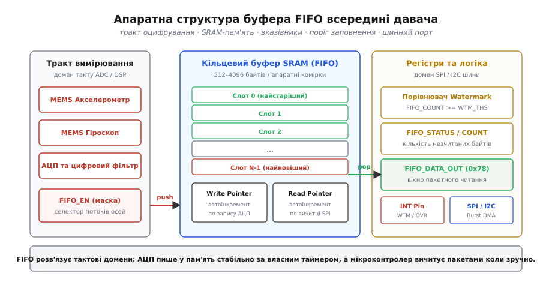
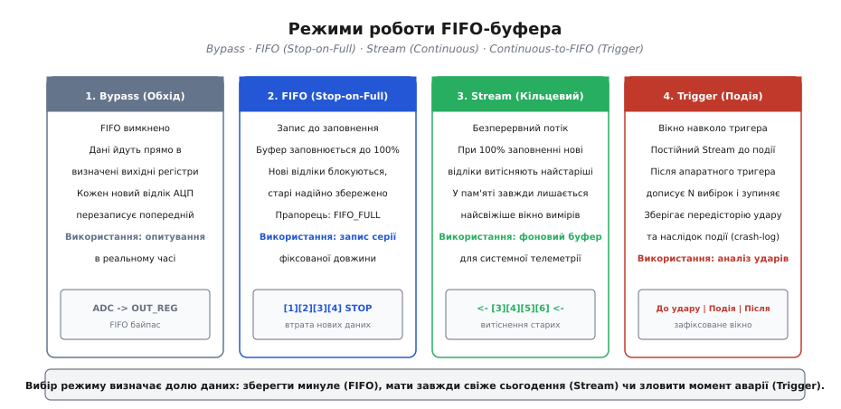
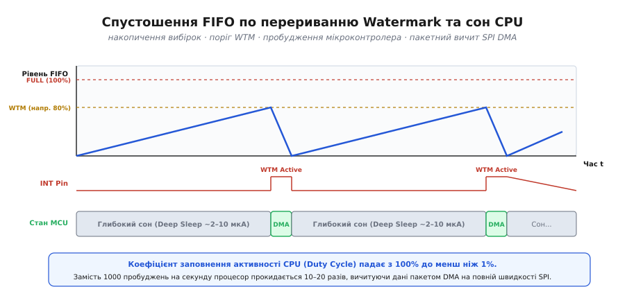
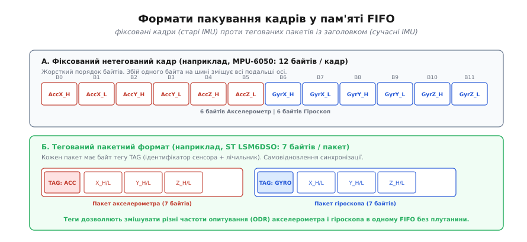

# FIFO-регістри в давачах

<preknowlist>
- [Регістрова карта](root:com-devices/register-map) — адреси комірок, R/W доступ та бітові поля конфігурації.
- [Шина SPI](root:com-devices/spi-bus) — повнодуплексний синхронний обмін та пакетне читання.
- [Шина I2C](root:com-devices/i2c-bus) — транзакції з автоінкрементом адреси регістра.
</preknowlist>

Шестиосьовий інерційний сенсор (MEMS IMU), що працює на стандартній для навігаційних систем та квадрокоптерів частоті дискретизації 1 кГц, генерує новий 12-байтовий вектор вимірів (три осі акселерометра плюс три осі гіроскопа) кожну мілісекунду. Якщо мікроконтролер вичитує кожен такий вектор поодинці через окреме переривання готовності даних (*Data Ready*, DRDY), процесорне ядро змушене прокидатися 1000 разів на секунду. Кожне пробудження вимагає збереження контексту регістрів у стек, запуску шинного контролера [I2C](root:com-devices/i2c-bus) або [SPI](root:com-devices/spi-bus), передачі командного байта адреси та очікування вичитування корисного навантаження. За такої організації обміну ядро витрачає до 25% усього обчислювального бюджету виключно на накладні витрати протоколу зв'язку, а середній струм споживання мікроконтролера зростає з фонових 5 мкА до 8–15 мА, розряджаючи стандартну дискову літієву батарею CR2032 (ємністю 220 мАг) менш ніж за 20 годин роботи. Ба більше, будь-яка затримка в обробці переривання (наприклад, стирання сторінки Flash-пам'яті або виконання вищого за пріоритетом мережевого завдання) призводить до того, що внутрішній вихідний регістр датчика затирається наступним результатом перетворення АЦП, викликаючи незворотну втрату вибірок та накопичення фазової помилки в інтегральних фільтрах орієнтації.

Для розв'язання цієї проблеми в кремній сучасних цифрових сенсорів та радіочастотних трансиверів інтегрують апаратний буфер FIFO (*First-In, First-Out*, англ. «першим прийшов — першим пішов»). Буфер накопичує виміри у внутрішній пам'яті SRAM кристала, повністю ізолюючи темп генерації даних АЦП від темпу їх вичитування центральним процесором. Це дозволяє мікроконтролеру перебувати у стані глибокого сну сотні мілісекунд поспіль, прокидатися лише після накопичення великого блоку даних і спустошувати буфер за одну високошвидкісну пакетну транзакцію.

---

### Апаратна топологія FIFO у кристалі сенсора

Усередині інтегральної мікросхеми цифрового сенсора блок FIFO розташовується безпосередньо на стику двох фізично та функціонально ізольованих тактових доменів: внутрішнього конвеєра первинної обробки (мікроелектромеханічні чутливі елементи MEMS, аналого-цифровий перетворювач АЦП, цифровий сигнальний процесор DSP та блок децимації) і зовнішнього послідовного інтерфейсу зв'язку (контролер шин SPI або I2C).


*Апаратний буфер FIFO працює як міст між двома тактовими доменами: АЦП пише виміри в SRAM за стабільним внутрішнім генератором, а шинний інтерфейс вичитує їх пакетами за тактами хост-процесора.*

Фізично FIFO реалізується у вигляді виділеного масиву статичної оперативної пам'яті (SRAM) обсягом від 512 байтів (у сенсорах попереднього покоління InvenSense MPU-6050) до 3–4 кілобайтів (у сучасних STMicroelectronics LSM6DSO чи TDK InvenSense ICM-42688). Логіка керування пам'яттю організована за схемою кільцевого масиву з двома незалежними апаратними вказівниками:

1. **Вказівник запису (*Write Pointer*):** Автоматично інкрементується внутрішнім цифровим автоматом сенсора щоразу, коли АЦП та вбудовані цифрові фільтри низьких частот закінчують черговий цикл перетворення та формують вибірку. Частота оновлення запису жорстко синхронізована із внутрішнім опорним генератором сенсора та визначається регістром конфігурації вихідної частоти даних (*Output Data Rate*, ODR).
2. **Вказівник читання (*Read Pointer*):** Інкрементується логікою послідовного порту щоразу, коли хост-мікроконтролер вичитує черговий байт із вікна регістра даних FIFO. Швидкість зчитування визначається виключно тактовою частотою зовнішньої шини (наприклад, SCK до 10–24 МГц для швидкісного SPI).

#### Арбітраж доступу до пам'яті та двопортова SRAM

У моменти, коли зовнішній хост вичитує дані на максимальній швидкості SPI, а внутрішній АЦП одночасно завершує перетворення нового відліку, виникає потенційний конфлікт шини пам'яті. У простих сенсорах застосовують однопортову SRAM із часовим розділенням доступу (*Time-Division Multiplexing*, TDM): пріоритет запису завжди віддається АЦП, а операція читання шини призупиняється на один внутрішній такт. У прецизійних датчиках використовується повноцінна двопортова пам'ять (*Dual-Port SRAM*), яка має роздільні адресні декодери та лінії даних для запису і читання, що усуває будь-які затримки на шині.

#### Розв'язка асинхронних доменів тактування (Clock Domain Crossing)

Головна перевага апаратного буфера полягає в усуненні залежності між періодом збору вимірів та періодом їх обробки. Внутрішній АЦП працює на стабільній власній часовій базі з нульовим джитером. Зовнішній хост-процесор може мати плаваючий час реакції, бути заблокованим іншими перериваннями або взагалі змінювати власну тактову частоту для економії живлення — це жодним чином не впливає на процес оцифрування фізичних величин.

Для безпечної передачі значень вказівників між доменом АЦП та доменом зовнішньої шини апаратний контролер пам'яті використовує двоетапну синхронізацію через код Грея (*Gray code*). У коді Грея при переході між будь-якими двома сусідніми числами змінюється лише один біт. Це унеможливлює виникнення метастабільних станів та помилкових стрибків значень лічильника, коли мікроконтролер зчитує статус буфера саме в ту наносекунду, коли АЦП дописує черговий байт у пам'ять.

Різниця між поточним значенням вказівника запису та вказівника читання формує значення апаратного лічильника заповнення (*FIFO Count*). Це значення безперервно надходить на внутрішній цифровий компаратор, який порівнює його із заздалегідь записаним у регістри порогом вотермарка (*Watermark Threshold*). Коли кількість накопичених слів перевищує цей поріг, компаратор миттєво активує сигнал на фізичній ніжці переривання сенсора (INT1 або INT2), сповіщаючи мікроконтролер.

---

### Регістрова організація та механіка доступу

Керування буфером FIFO та вичитування його вмісту здійснюється через стандартизований блок у загальній [регістровій карті](root:com-devices/register-map) пристрою. Цей блок складається з трьох ключових груп регістрів: селектори каналів запису, регістри контролю стану та вікно пакетного читання.

#### 1. Селектори каналів та конфігурація джерел (FIFO_CONFIG / FIFO_EN)

Ці регістри визначають, які саме чутливі елементи та службові блоки підключаються до конвеєра запису в пам'ять SRAM. Окремі біти дозволяють гнучко формувати склад кадру:

- `ACCEL_FIFO_EN` — увімкнення запису тривісного акселерометра (6 байтів на вибірку: осі X, Y, Z);
- `GYRO_FIFO_EN` — увімкнення запису тривісного гіроскопа (6 байтів на вибірку);
- `TEMP_FIFO_EN` — дозвіл збереження температури кристала (1–2 байти);
- `EXT_SENS_FIFO_EN` — запис даних допоміжних датчиків (наприклад, зовнішнього магнітометра чи барометра, підключеного до допоміжної шини Sensor Hub);
- `TIMESTAMP_FIFO_EN` — додавання апаратної мітки часу (*Timestamp*) із вбудованого 32-бітного таймера.

Можливість вибіркового вимкнення окремих джерел є критичною для оптимізації автономності: якщо система виконує лише розпізнавання кроків чи положення спокою, відключення енергоємного гіроскопа дозволяє скоротити обсяг кадру з 12 до 6 байтів, подвоюючи час безпечного перебування мікроконтролера в режимі сну при тій самій ємності буфера.

#### 2. Лічильники кількості даних та прапорці стану (FIFO_COUNT / FIFO_STATUS)

Перед початком зчитування мікроконтролер повинен знати точну кількість доступних корисних байтів. Для цього сенсор надає 16-бітний апаратний лічильник, представлений двома регістрами: `FIFO_COUNTH` (старший байт) та `FIFO_COUNTL` (молодший байт):

```
Кількість незчитаних байтів = (FIFO_COUNTH << 8) | FIFO_COUNTL
```

Поруч із лічильником розміщується регістр діагностичних прапорців (*Status Register*), де найважливішими є:

- `FIFO_WTM_IA` (*Watermark Interrupt Active*): встановлюється в `1`, коли кількість байтів у пам'яті досягла або перевищила встановлений поріг вотермарка.
- `FIFO_FULL_IA` (*FIFO Full Interrupt Active*): сигналізує про 100% заповнення доступного обсягу пам'яті SRAM.
- `FIFO_OVR_IA` (*FIFO Overrun / Overflow Interrupt Active*): фіксує аварійну подію переповнення, коли АЦП намагався записати черговий відлік у переповнений буфер.

#### 3. Вікно пакетного доступу (FIFO_DATA_OUT / FIFO_R_W)

Вичитування даних не вимагає перебору різних числових адрес пам'яті SRAM. Увесь масив накопичених вибірок доступний через **єдину фіксовану адресу регістра** (наприклад, `0x78` у ST LSM6DSO або `0x30` у TDK ICM-42688).

Коли мікроконтролер ініціює операцію пакетного читання (*Burst Read*) за адресою `FIFO_DATA_OUT`, сенсор видає байт, на який вказує поточний *Read Pointer*. Після передачі кожного байта внутрішній апаратний автомат сенсора автоматично інкрементує *Read Pointer* на одиницю та декрементує лічильник `FIFO_COUNT`. При цьому адреса на самій шині зв'язку залишається незмінною: хост може вичитати весь накопичений обсяг пам'яті за одну нерозривну транзакцію, утримуючи лінію Chip Select (CS) у низькому рівні.

Детальний побітовий аналіз регістрових карт та форматів прапорців для сімейств ST, InvenSense, Bosch та Nordic наведено у довіднику [повною регістровою специфікацією](root:com-devices/fifo-register/api-fifo-registers.md).

---

### Чотири апаратні режими роботи буфера

Залежно від цілей системи контролер FIFO може функціонувати в одному з чотирьох стандартизованих режимів, що задаються полем `FIFO_MODE` у регістрах налаштування.


*Чотири режими роботи FIFO визначають реакцію пам'яті на заповнення: прямий обхід (Bypass), фіксація перших даних (FIFO), постійне оновлення найсвіжіших даних (Stream) та захоплення аварійного вікна події (Trigger).*

#### 1. Режим прямого обходу (*Bypass Mode*)

У режимі обходу буфер FIFO повністю вимкнено, а його внутрішня пам'ять знеструмлена або скинута в початковий стан. Результати перетворення АЦП потрапляють безпосередньо у вихідні регістри осей (наприклад, `ACCEL_XOUT_H/L`). Кожен новий вимір АЦП безумовно перезаписує попереднє значення.

Цей режим застосовується під час первинного старту та калібрування сенсора, у контурах стабілізації з ультранизькою затримкою (де час реакції важливіший за накопичення), або для перевірки працездатності чутливих елементів через внутрішній тест (*Self-Test*).

#### 2. Режим однократного заповнення (*FIFO Mode / Stop-on-Full*)

У цьому режимі запис вибірок починається з нульового індексу пам'яті та триває доти, доки буфер не заповниться на 100%. Щойно місткість вичерпано, сенсор виставляє прапорець `FIFO_FULL` і **повністю блокує запис будь-яких нових даних**. Усі наступні результати перетворення АЦП ігноруються.

**Призначення:** Збереження фіксованої послідовності вимірів заданої довжини від початкового моменту часу. Наприклад, для аналізу вібраційного спектра ротора або сейсмічного сигналу системі потрібно зафіксувати рівно 512 послідовних точок для виконання швидкого перетворення Фур'є (FFT). Режим FIFO гарантує, що початкова ділянка сигналу залишиться абсолютно недоторканою.

#### 3. Кільцевий потоковий режим (*Stream Mode / Continuous Mode*)

У потоковому режимі процес запису ведеться безперервно. Якщо буфер заповнюється на 100%, кожен новий відлік АЦП **автоматично витісняє найстаріший відлік** у пам'яті: вказівник читання примусово зміщується вперед слідом за вказівником запису. У пам'яті завжди зберігається найсвіжіший часовий зріз останніх `N` мілісекунд роботи.

**Призначення:** Неперервний фоновий моніторинг телеметрії в реальному часі. Якщо мікроконтролер був тимчасово зайнятий тривалим системним завданням і не встиг вичитати дані вчасно, він не зупиняє датчик. Після звільнення ядро прочитає найактуальніші виміри, хоча в регістрі стану буде зафіксовано прапорець втрати застарілих даних (`FIFO_OVR`).

#### 4. Тригерний режим збереження події (*Continuous-to-FIFO / Trigger Mode*)

Цей комбінований режим спроєктовано спеціально для запису аварійних ситуацій, ударів, падіння обладнання або різких маневрів.

Робота відбувається у два послідовні етапи:
1. **До події:** Буфер працює в потоковому кільцевому режимі (*Stream Mode*), постійно оновлюючи найстаріші вибірки новими.
2. **Момент події:** Коли вбудований апаратний детектор сенсора (наприклад, поріг удару `High-G Interrupt` або вільне падіння `Free-Fall`) фіксує аварію, сенсор перемикається в режим Stop-on-Full.
3. **Після події:** Буфер записує ще задану кількість вибірок після удару, після чого остаточно заморожує запис.

У результаті мікроконтролер отримує повноцінний «чорний ящик» (*crash log*): детальний часовий графік параметрів руху за 200 мс **до удару** (передісторія події) та за 200 мс **після удару** (наслідки).

---

### Мультисенсорна агрегація та підсистема Sensor Hub

Сучасні 6-осьові інерційні модулі містять спеціалізований апаратний блок — **Sensor Hub** (майстер допоміжної шини I2C). Цей блок дозволяє сенсору самостійно керувати зовнішніми цифровими датчиками (наприклад, 3-осьовим магнітометром або високоточним барометром) без залучення головного мікроконтролера.

Сенсор-майстер періодично опитує підключені мікросхеми за власним таймером і пакує їхні виміри прямо у свій буфер FIFO. Завдяки цьому хост-мікроконтролер отримує об'єднаний мультимодальний потік (акселерометр + гіроскоп + магнітометр + тиск) через єдиний інтерфейс SPI.

```
┌──────────────────────────────────────────────────────────┐
│              MEMS IMU (Master Sensor Hub)                │
│                                                          │
│  [ Внутрішній АЦП ] ──► Accel/Gyro ────┐                 │
│                                        │                 │
│  [ Допоміжний I2C ] ──► Магнітометр ───┼──► [ FIFO RAM ] ├──► SPI DMA ──► MCU
│  (Sensor Hub Port)  ──► Барометр ──────┘    (3–4 КБ)     │
└──────────────────────────────────────────────────────────┘
```

Оскільки різні фізичні величини вимагають принципово різної частоти опитування (наприклад, гіроскоп — 1000 Гц, акселерометр — 200 Гц, магнітометр — 50 Гц, барометр — 10 Гц), внутрішній блок децимації формує змішаний потік. Кожен пакет забезпечується унікальним тегом або заголовком, що дозволяє парсеру однозначно ідентифікувати приналежність кожного байта.

---

### Фізичні обмеження шин: чому SPI витісняє I2C у роботі з FIFO

При виборі фізичного інтерфейсу між сенсором та мікроконтролером швидкість вичитування буфера має вирішальне значення для загального енергетичного балансу.

Порівняємо часові витрати на спустошення 512-байтового буфера:

1. **Шина I2C у режимі Fast Mode (400 кГц):**
   Кожен байт на шині I2C вимагає 9 тактів (8 бітів даних плюс 1 біт підтвердження ACK), а також старт- та стоп-послідовності. Загальний час передачі складає:
   ```
   t_i2c = (512 байти + 2 службові) · 9 біт / 400 000 Гц
   t_i2c = 4626 біт / 400 000 Гц
   t_i2c ≈ 11.56 мс
   ```
   Протягом усіх 11.56 мс підтягувальні резистори шини I2C розсіюють струм через відкриті колектори, а контролер DMA або ядро утримуються в активному стані.

2. **Шина SPI на тактовій частоті 10 МГц:**
   Шина SPI передає байти суцільним потоком без ACK-бітів та накладних пауз між байтами:
   ```
   t_spi = (512 байти + 1 адреса) · 8 біт / 10 000 000 Гц
   t_spi = 4104 біт / 10 000 000 Гц
   t_spi ≈ 0.41 мс
   ```

Вичитування через SPI завершується у **28 разів швидше**, ніж по I2C Fast Mode. Це скорочує час перебування мікроконтролера в активному режимі з 11.56 мс до часток мілісекунди, дозволяючи системі миттєво повернутися у стан глибокого сну.

---

### Механізм Watermark та інженерний розрахунок енергоспоживання

Головна мета застосування FIFO у батарейних вбудованих пристроях — це мінімізація коефіцієнта заповнення активності процесора (*CPU Duty Cycle*). Замість того, щоб утримувати мікроконтролер у постійній готовності до прийому поодиноких байтів, система використовує переривання за порогом заповнення — **Watermark (WTM)**.


*Періодичне вичитування буфера через SPI DMA по перериванню Watermark дозволяє мікроконтролеру спати понад 99% часу, скорочуючи середній струм споживання на порядки.*

#### Механіка роботи порогу Watermark

Поріг вотермарка — це число в регістрі `FIFO_CTRL1/2`, яке задає рівень накопичення слотів, при якому сенсор повинен згенерувати апаратний імпульс або рівень на лінії `INT`.

Розглянемо числовий приклад: нехай повний обсяг FIFO складає 512 слотів (3584 байти при 7 байтах на слот), а поріг вотермарка встановлено на `WTM = 256` слотів. При частоті оцифрування `ODR = 1000 Гц`:
- Сенсор накопичує вибірки самостійно.
- Протягом 256 мс на лінії `INT` утримується пасивний стан. Мікроконтролер перебуває у стані глибокого сну (Deep Sleep), споживаючи лише 2–10 мкА для підтримки пам'яті та таймера пробудження.
- На 256-й мілісекунді апаратний лічильник сенсора досягає значення 256. Лінія `INT` миттєво переходить в активний стан.
- Сигнал активує зовнішнє переривання мікроконтролера (EXTI).
- Ядро процесора за 2–5 мікросекунд налаштовує контролер DMA на пакетне вичитування 1792 байтів по шині SPI на частоті 10 МГц.
- Тривалість вичитування 1792 байтів апаратним контролером DMA складає:

```
t_dma = 1792 байти · 8 біт / 10 000 000 Гц
t_dma = 14336 біт / 10 000 000 Гц
t_dma ≈ 1.43 мс
```

- Після спустошення буфера сенсор автоматично опускає лінію `INT`, і вся система знову переходить у стан сну на наступні 256 мс.

#### Електрична схемотехніка лінії переривання INT

Для надійної роботи в умовах низького енергоспоживання конфігурація вихідного каскаду ніжки переривання сенсора має суттєве значення. Більшість датчиків дозволяють програмно обрати тип виходу через конфігураційний регістр `CTRL3_C` або `INT_PIN_CFG`:
- **Двотактний вихід (Push-Pull, Active-High):** Забезпечує круті фронти наростання сигналу з мінімальним часом переходу, що є оптимальним для швидкого пробудження одного мікроконтролера.
- **Відкритий стік (Open-Drain, Active-Low):** Дозволяє об'єднати лінії переривань від кількох різних датчиків (наприклад, IMU, магнітометра та барометра) на єдиний вхідний пін EXTI мікроконтролера за схемою «Монтажне АБО» (*Wired-OR*). У цьому випадку лінія підтягується до живлення зовнішнім резистором 10–47 кОм, запобігаючи виникненню наскрізних струмів при одночасному спрацьовуванні кількох джерел.

#### Розрахунок запасу латентності (*Latency Budget*)

Встановлення порогу вотермарка на максимальну місткість пам'яті (`WTM = FULL = 512`) є грубою інженерною помилкою. Якщо поріг стоїть на 100%, сигнал переривання з'явиться лише тоді, коли в буфері не залишиться жодного вільного байта. Якщо в цей самий момент процесор обслуговує інше критичне переривання (наприклад, протокольний стек Bluetooth Low Energy або операцію запису у Flash-пам'ять) і затримає старт транзакції навіть на 1 мс, наступний відлік АЦП викличе аварійне переповнення (*FIFO Overrun*) та незворотну втрату даних.

Безпечний поріг вотермарка `WTM_safe` розраховується з урахуванням максимально допустимого часу затримки реакції операційної системи реального часу `T_latency_max`:

```
WTM_safe = FIFO_TOTAL_SLOTS - (T_latency_max · ODR)
```

**Приклад розрахунку запасу часу.** Нехай буфер вміщує `FIFO_TOTAL_SLOTS = 512` вибірок при частоті `ODR = 1000 Гц`. Максимальний час блокування планувальника RTOS критичними секціями становить `T_latency_max = 50 мс`:

```
Запас слотів = T_latency_max · ODR
Запас слотів = 0.050 с · 1000 Гц
Запас слотів = 50 вибірок

WTM_safe = 512 - 50
WTM_safe = 462 вибірки
```

Встановлення порогу `WTM = 462` слоти гарантує системі цілих 50 мс гарантованого запасу часу на пробудження та запуск шини до виникнення переповнення.

#### Порівняльна енергетична модель системи

Зіставимо середній струм споживання мікроконтролера в трьох типових архітектурах збору даних при роботі від джерела живлення 3.0 В (струм активного режиму MCU: 10 мА, струм глибокого сну: 5 мкА, частота вимірів: 1 кГц):

| Режим роботи системи | Час активності ядра на секунду | Коефіцієнт заповнення (Duty Cycle) | Середній струм споживання MCU | Час життя від CR2032 (220 мАг) |
| :--- | :--- | :--- | :--- | :--- |
| **Постійне опитування (Polling)** | 1000 мс / с | 100.0% | 10.0 мА | ~22 години |
| **Переривання готовності (DRDY 1 кГц)** | ~250 мс / с | 25.0% | 2.50 мА | ~3.6 доби |
| **FIFO Watermark (WTM = 256 слотів) + DMA** | ~5.6 мс / с | 0.56% | 0.061 мА (61 мкА) | **~150 діб (5 місяців)** |

Використання буфера FIFO у поєднанні з DMA скорочує енергоспоживання системи більш ніж у 40 разів порівняно зі схемою DRDY і в 160 разів порівняно з постійним опитуванням.

---

### Формати кадрування та самосинхронізація потоку

Вичитування великого масиву байтів із FIFO вимагає надійного та швидкого розбору структур даних на боці мікроконтролера. В індустрії датчиків MEMS сформувалися два основні формати кадрування.


*Порівняння нетегованого формату фіксованої довжини та сучасного тегованого пакетного формату з апаратною самосинхронізацією.*

#### 1. Нетеговані кадри фіксованої довжини (архітектура MPU-6000 / MPU-6050)

У сенсорах перших поколінь буфер FIFO являв собою простий масив «сирих» байтів без додаткових службових маркерів. При увімкненні акселерометра та гіроскопа датчик циклічно записував 12-байтові кадри:

```
[AccX_H][AccX_L][AccY_H][AccY_L][AccZ_H][AccZ_L][GyrX_H][GyrX_L][GyrY_H][GyrY_L][GyrZ_H][GyrZ_L]
```

**Критичний недолік фіксованого формату:** Повна вразливість до десинхронізації. Якщо внаслідок імпульсної завади на шині лінія тактування пропустить один імпульс або якщо в результаті переповнення з пам'яті випаде непарна кількість байтів, весь подальший потік зміститься на один байт. Молодший байт осі X почне сприйматися як старший байт осі Y, а дані гіроскопа змішаються з акселерометром. Оскільки в потоці немає міток початку кадру, програмний драйвер не здатний самостійно виявити фазовий зсув. Єдиним способом відновлення є повна зупинка та апаратне скидання буфера (*FIFO Reset*).

#### 2. Теговані пакети з апаратними заголовками (архітектура ST LSM6DSO / ICM-42688 / Bosch BMA400)

Сучасні сенсори використовують пакетний формат із динамічним тегуванням. Кожна порція вимірів пакується в апаратний слот, що відкривається обов'язковим байтом тегу або заголовка (*TAG / Header*).

У сімействі ST LSM6DSO кожен слот має фіксовану довжину 7 байтів:
- **Байт 0: `TAG`** — 5-бітний код джерела даних (`0x01` — гіроскоп, `0x02` — акселерометр, `0x03` — температура, `0x04` — мітка часу) та 2-бітний лічильник підпорядкування.
- **Байти 1–6: `Payload`** — три 16-бітні осі X, Y, Z у форматі доповняльного коду (*Two's Complement*, Little-Endian).

:::tabs
```c
// Формат тегованого 7-байтового кадру на мові C
typedef struct {
    uint8_t tag;
    int16_t x;
    int16_t y;
    int16_t z;
} __attribute__((packed)) SensorFifoPacket;
```
```cpp
// Ідіоматичний формат тегованого кадру на мові C++ з типізованим переліком
#include <cstdint>

enum class SensorTagType : uint8_t {
    Gyroscope   = 0x01,
    Accelerometer = 0x02,
    Temperature = 0x03,
    Timestamp   = 0x04
};

#pragma pack(push, 1)
struct SensorFifoPacket {
    uint8_t tag;
    int16_t x;
    int16_t y;
    int16_t z;

    [[nodiscard]] SensorTagType type() const noexcept {
        return static_cast<SensorTagType>((tag >> 3) & 0x1F);
    }
};
#pragma pack(pop)
```
:::

**Переваги тегованого кадрування:**
1. **Мультиплексування різних частот дискретизації:** Акселерометр може працювати на частоті 52 Гц, а гіроскоп — на частоті 833 Гц. Сенсор самостійно чергує пакети в буфері відповідно до їх готовності, а приймач коректно розбирає потік за значенням тегу без прив'язки до жорсткого чергування.
2. **Апаратна стійкість до збоїв:** Якщо випадкова завада змістить вказівник читання, парсер миттєво виявить невалідний код тегу і зможе автоматично відновити вирівнювання кадру без перезапуску датчика.

Повний вихідний код низькорівневого драйвера з парсингом тегів, налаштуванням DMA та обробкою подій кільцевого буфера наведено у проектній інструкції [інженерну реалізацію драйвера вичитування](root:com-devices/fifo-register/proj-burst-dma-reader.md).

---

### Буфери FIFO у бездротових трансиверах

Принцип FIFO-регістрів однаково ефективно застосовується не лише в інерційних сенсорах, а й у радіотрансиверах короткого радіуса дії (Nordic Semiconductor nRF24L01+, Texas Instruments CC1101, Semtech SX1262 LoRa).

Однак внутрішня архітектура FIFO радіомодулів має суттєві відмінності:

```
Радіоефір ◄─── [ TX FIFO (3 слоти по 32 байти) ] ◄─── SPI Запис (MCU)
Радіоефір ───► [ RX FIFO (3 слоти по 32 байти) ] ───► SPI Читання (MCU)
```

1. **Роздільні фізичні черги передачі та прийому:** Радіочіпи містять два повністю незалежні буфери — **TX FIFO** (черга передавача) та **RX FIFO** (черга приймача).
2. **Слотова пакетна структура:** На відміну від потокового байтового масиву сенсорів, буфер трансивера організований у вигляді черги фіксованих пакетних слотів (наприклад, 3 рівні по 32 байти у nRF24L01+). Доступ здійснюється цілими атомарними пакетами.
3. **Автоматичне апаратне керування чергою:**
   - Коли хост записує пакет у TX FIFO через команду SPI `W_TX_PAYLOAD`, радіомодуль самостійно формує преамбулу, додає контрольну суму [CRC](root:com-modulation/crc), вмикає підсилювач потужності та відправляє кадр в ефір.
   - У разі використання автоматичного підтвердження (*Auto-ACK*) пакет залишається в TX FIFO доти, доки від приймача не надійде квитанція про успішний прийом. Якщо вичерпано ліміт повторних спроб, встановлюється прапорець переривання `MAX_RT`.
   - Прийом пакетів з ефіру автоматично наповнює RX FIFO. Якщо мікроконтролер не встигає вичитувати пакети і всі 3 рівні заповнюються (`RX_FULL = 1`), радіомодуль перестає приймати нові кадри з ефіру, відхиляючи їх без відправки сигналу підтвердження ACK.

Для запобігання зависанню радіотракту протоколи трансиверів передбачають обов'язкові інструкції швидкого очищення буферів: `FLUSH_TX` та `FLUSH_RX`, які скидають покажчики черг без перезавантаження конфігураційних регістрів радіочастотного тракту.

---

### Підсумкові правила інженерного проєктування

1. **Завжди вичитуйте лічильник заповнення перед початком Burst-транзакції:** Ніколи не покладайтеся на припущення про фіксовану кількість байтів у пам'яті. Зчитуйте 16-бітний регістр `FIFO_COUNT` або використовуйте заздалегідь відомий поріг вотермарка, щоб уникнути читання байтів-заповнювачів порожнечі (`0x00`/`0xFF`), які сенсор видає при вичерпанні буфера.
2. **Уникайте використання переривання 100% заповнення (FIFO FULL):** Завжди конфігуруйте систему на переривання `Watermark` із запасом 10–20% від повної місткості SRAM для гарантованого покриття латентності операційної системи реального часу.
3. **Контролюйте стан лінії Chip Select (CS) під час SPI DMA:** Внутрішній апаратний автоінкремент вікна `FIFO_DATA_OUT` діє лише всередині єдиної нерозривної транзакції. Короткочасний підйом CS у високий рівень завершує сесію читання FIFO у сенсорі.
4. **Використовуйте апаратне скидання при виявленні збою тегів:** Якщо парсер фіксує невідомий код тегу або якщо в системі виник прапорець `FIFO_OVR`, негайно виконайте послідовність скидання (переведення в Bypass mode з поверненням у Continuous mode) для відновлення гарантованого фазового вирівнювання осей.
