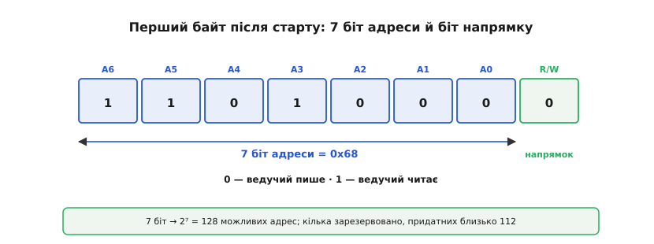
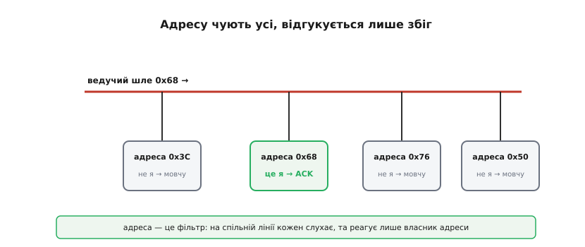
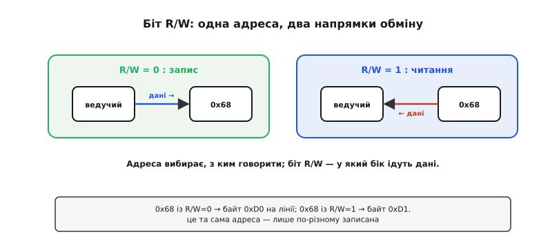
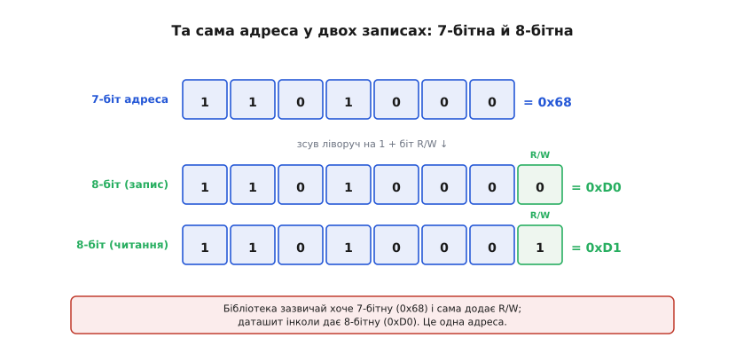
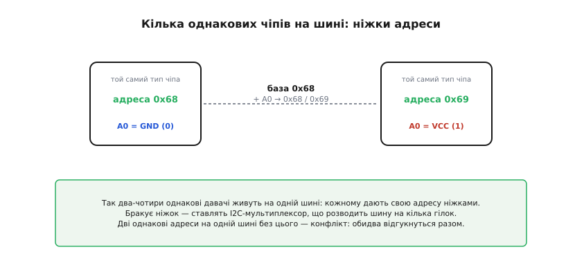
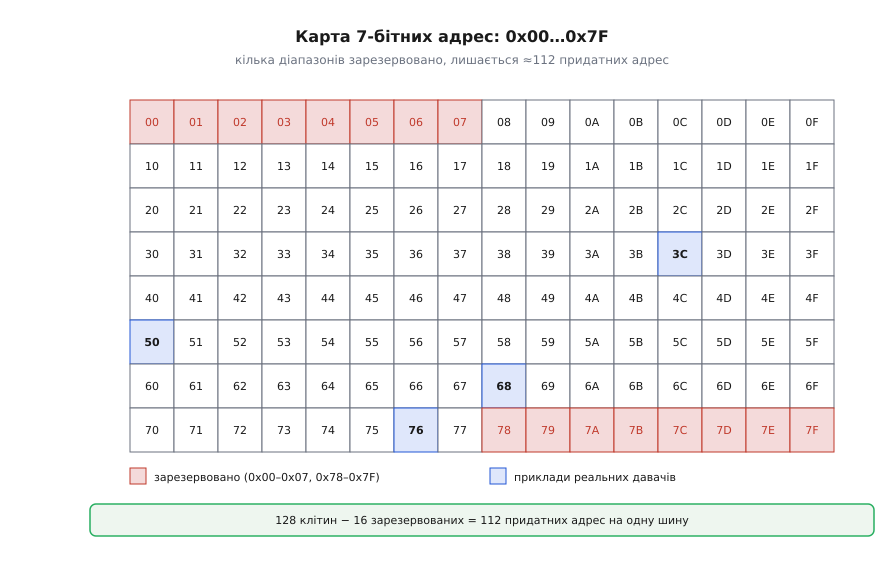
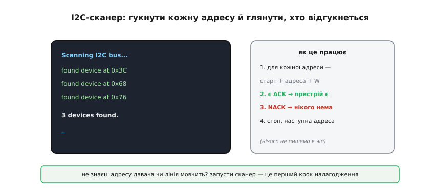

# Адресація I2C

На спільній лінії висить десяток пристроїв, і всі вони «чують» одне й те саме. Як ведучому поговорити саме з потрібним — з гіроскопом, а не з барометром? Відповідь закладена в I2C (*Inter-Integrated Circuit*, «між інтегральними схемами») від народження: кожному веденому дають **адресу**, а обмін завжди починається з того, що ведучий цю адресу **називає**. Ідея проста, але має кілька практичних тонкощів, одна з яких — найвідоміша пастка всього I2C, на якій спотикається чи не кожен новачок.

### Перший байт: 7 біт адреси плюс напрямок

Щойно ведучий почав обмін, перше, що він посилає, — це **байт адреси**. Влаштований він так: **сім** старших біт несуть адресу веденого, а **восьмий** (наймолодший) — це окремий **біт напрямку R/W** (*Read/Write*, «читати/писати»).


*Біти A6…A0 — це 7-бітна адреса веденого (тут 0x68), а останній біт R/W каже напрямок: 0 — ведучий писатиме, 1 — читатиме. Сім біт дають 2⁷ = 128 можливих адрес, з яких кілька зарезервовано, тож придатних близько 112.*

Чому саме **7** біт? Це початковий вибір фірми Philips, яка створила I2C на початку 1980-х: 128 адрес видавалося з головою для плати телевізора, а вкласти адресу в один байт разом із бітом напрямку — зручно й ощадливо. Біт R/W тут не випадковий «довісок»: він одразу, ще на адресному байті, каже всім, у який бік підуть наступні дані — від ведучого до веденого (запис, 0) чи назад (читання, 1).

### Адресу чують усі, відгукується один

Як працює вибір на спільній лінії? Ведучий виставляє адресний байт — і його бачать **усі** ведені одразу. Але кожен порівнює почуту адресу зі **своєю** — і реагує лише той, у кого збіглося.


*Ведучий шле 0x68. Кожен ведений звіряє цю адресу зі своєю: давач 0x68 упізнає себе й відповідає підтвердженням ACK, а 0x3C, 0x76, 0x50 розуміють, що це не до них, і мовчать. Адреса працює як фільтр на спільній лінії.*

Це і є суть адресації: на спільній шині адреса слугує **фільтром**. Усі слухають, але озивається лише власник адреси — він підтверджує прийом, притягнувши лінію вниз (саме той трюк [відкритого колектора](topic:hw-digital/open-drain-bus-pullup-sizing), яким на I2C формують [підтвердження ACK](topic:com-devices/start-stop-ack)). Решта пасивно чекає кінця чужого обміну.

### Біт R/W: один чіп, два напрямки

Восьмий біт заслуговує окремого погляду. Адреса вибирає, **з ким** говорити; біт R/W задає, **у який бік** підуть дані.


*Той самий ведений 0x68: з R/W = 0 ведучий пише в нього (дані йдуть від ведучого), з R/W = 1 читає з нього (дані йдуть назад). Адреса незмінна, міняється лише напрямок наступного обміну.*

На практиці майже кожна транзакція з давачем поєднує обидва напрямки: спершу ведучий **пише** (каже, який регістр його цікавить), потім **читає** (забирає звідти дані). Тому біт R/W — не екзотика, а щоденний інструмент: саме з цих «запис-потім-читання» складаються реальні [звертання до чіпів](topic:com-devices/i2c-transaction).

### Класична пастка: 0x68 чи 0xD0?

Тепер — найвідоміша плутанина I2C, через яку згаяно безліч годин. Що насправді летить лінією, коли адреса 0x68, а R/W = 0? Адресні біти займають позиції з 7-ї до 1-ї, R/W — найнижчу. Тобто **повний байт** на лінії — це адреса, **зсунута ліворуч на один біт**, плюс R/W.


*«Чиста» 7-бітна адреса = 0x68. А 8-бітний байт на лінії — це 0x68, зсунута ліворуч на 1, із бітом R/W унизу: 0xD0 для запису й 0xD1 для читання. Це одна адреса, лише по-різному записана.*

**Звідки беруться 0xD0 і 0xD1.** Порахуймо обидва записи для давача з 7-бітною адресою 0x68. У прошивці це звичайний зсув і додавання біта напрямку:

:::tabs
```c
uint8_t addr7  = 0x68;                 // 7-бітна адреса з даташита: 110 1000

uint8_t wbyte = (addr7 << 1) | 0;      // 1101 0000 = 0xD0  (запис, R/W=0)
uint8_t rbyte = (addr7 << 1) | 1;      // 1101 0001 = 0xD1  (читання, R/W=1)
```
```python
addr7 = 0x68                           # 7-бітна адреса з даташита: 110 1000

wbyte = (addr7 << 1) | 0               # 1101 0000 = 0xD0  (запис, R/W=0)
rbyte = (addr7 << 1) | 1               # 1101 0001 = 0xD1  (читання, R/W=1)
```
:::

Ось де пастка: один даташит напише «адреса пристрою — **0x68**» (7-бітна), інший — «адреса запису **0xD0**, читання **0xD1**» (8-бітні), а бібліотека (як-от `Wire` в Arduino) очікує від тебе **7-бітну** 0x68 і сама додає R/W. Якщо ж передати їй 8-бітну 0xD0, вона зсуне її ще раз — і звернеться до зовсім іншої адреси, а пристрій «не знайдеться». Тому, побачивши адресу, завжди питай себе: це **7-бітна** чи вже з бітом R/W?

> 🔧 **Навіщо це.** Це найчастіша причина «не бачу давача на шині». Бібліотеки Arduino/`Wire` хочуть **7-бітну** адресу (0x68). Якщо в даташиті число парне й удвічі більше за очікуване (0xD0) — це 8-бітна форма, поділи її на 2, щоб дістати 7-бітну. Сумнів — запусти I2C-сканер (нижче) і подивись, на якій 7-бітній адресі реально відгукується чіп.

### Кілька однакових чіпів: ніжки адреси

Адреса чіпа здебільшого **частково зашита** виробником: кожен тип давача має свою «базову» адресу. Але що, як треба поставити на шину **два однакові** давачі — наприклад, два однакові гіроскопи? Їхні фіксовані адреси збіглися б, і обидва відповідали б разом — конфлікт. Тому виробники лишають кілька **молодших** біт адреси налаштовними — через **ніжки** (часто звуться A0, A1, A2).


*Два однакові давачі з базою 0x68: під'єднавши ніжку A0 до землі, дістаємо 0x68, а до живлення — 0x69. Тепер вони мають різні адреси й мирно живуть на одній шині. Бракує комбінацій ніжок — ставлять I2C-мультиплексор, що розводить шину на окремі гілки.*

Так на одну шину вдається посадити кілька однакових чіпів: кожному ніжками A0/A1/A2 задають свою адресу. Якщо ніжок-варіантів не вистачає (а буває потрібно багато однакових давачів), на допомогу приходить [I2C-мультиплексор](topic:com-devices/i2c-addressing/api-i2c-mux.md) (*multiplex*, лат. «багаторазовий») — мікросхема, що розводить одну шину на кілька окремих гілок, по одній на групу однакових пристроїв, тож на кожній гілці адреса 0x68 знову вільна; лишається [вибрати гілку й опитати давачі за нею в коді](topic:com-devices/i2c-addressing/proj-i2c-mux-scan.md). Та головне правило незмінне: **дві однакові адреси на одній шині — це конфлікт**, і його треба усунути ще на етапі проєктування.

### Карта адрес і зарезервовані

Не всі 128 комбінацій 7-бітної адреси вільні: частину Philips зарезервувала під службові потреби.


*Простір адрес 0x00…0x7F. Червоні клітини (0x00–0x07 і 0x78–0x7F) — зарезервовані: зокрема 0x00 — «загальний виклик» усім одразу, а діапазон 0x78–0x7B відведено під 10-бітну адресацію. Сині — приклади реальних давачів. Зарезервовано 16 адрес, тож придатних лишається 112.*

**Звідки «112».** Порахуймо вільні адреси:

```
усього 7-бітних адрес = 2⁷ = 128
зарезервовано: 0x00…0x07 (8) + 0x78…0x7F (8) = 16
придатних = 128 − 16 = 112
```

Цих 112 адрес з головою для будь-якої плати. А якщо колись забракло б і їх — у стандарті є **10-бітна** адресація: ведучий шле спеціальний зарезервований префікс 11110xx, де два біти xx — це старша частина адреси, а решта вісім ідуть наступним байтом. Так адрес стає тисячі; щоправда, у дрібних системах її майже не вживають.

### I2C-сканер

Залишається найкорисніший практичний інструмент усієї теми. Оскільки ведений **підтверджує** свою адресу, можна просто **перебрати** всі адреси підряд і подивитися, хто озветься. Це й робить **I2C-сканер**.


*Сканер по черзі «гукає» кожну адресу від 0x08 до 0x77: старт, адреса, біт запису. Прийшов ACK — пристрій на цій адресі є; NACK — нікого нема. Нічого в чіп не записуючи, лише перевіряючи відгук, сканер за частку секунди складає список усіх пристроїв на шині.*

Логіка проста: для кожної адреси ведучий шле старт і адресний байт — і дивиться на відповідь. ACK означає «тут хтось є», NACK — «порожньо». Жодних даних у пристрій не пишуть, тож сканування безпечне. Увесь сканер на Arduino вкладається в кілька рядків:

:::tabs
```cpp
#include <Wire.h>

void setup() {
  Wire.begin();
  Serial.begin(115200);

  for (uint8_t addr = 0x08; addr <= 0x77; addr++) {   // лише придатний діапазон
    Wire.beginTransmission(addr);        // старт + 7-бітна адреса + біт W
    if (Wire.endTransmission() == 0) {   // 0 == прийшов ACK на адресу
      Serial.print("found device at 0x");
      Serial.println(addr, HEX);         // друкуємо саме 7-бітну адресу
    }
  }
}

void loop() {}
```
```python
from machine import I2C, Pin

i2c = I2C(0, scl=Pin(22), sda=Pin(21))   # створюємо шину

for addr in i2c.scan():                  # scan() сам перебирає 0x08…0x77 і вертає тих, хто дав ACK
    print("found device at 0x{:02X}".format(addr))   # друкуємо саме 7-бітну адресу
```
:::

`Wire.beginTransmission()` лише ставить у чергу адресу, а сам байт зі стартом виходить на лінію аж у `Wire.endTransmission()`; її нульовий код повернення й означає отриманий ACK. Результат — список адрес, на яких реально сидять пристрої.

> 🔧 **Навіщо це.** I2C-сканер — перше, що варто запустити, коли підключив новий давач або коли шина «мовчить». Він одразу відповідає на два питання: чи пристрій **взагалі живий** на шині (відгукується?) і на якій **7-бітній адресі** він сидить (а отже, чи правильну адресу ти даєш бібліотеці). Якщо сканер не бачить нічого — біда не в адресі, а нижче: підтяжки, живлення, дроти. Якщо бачить пристрій на несподіваній адресі — це і є та сама плутанина 7-біт/8-біт.

Адресація відповідає на питання «з ким говорити», але лишає осторонь найдрібніші, проте вирішальні деталі: як саме ведучий **позначає** початок і кінець обміну й як ведений **підтверджує** кожен прийнятий байт. Ці чотири сигнали — [старт, стоп, ACK і NACK](topic:com-devices/start-stop-ack) — і є «розділові знаки» мови I2C.

---
