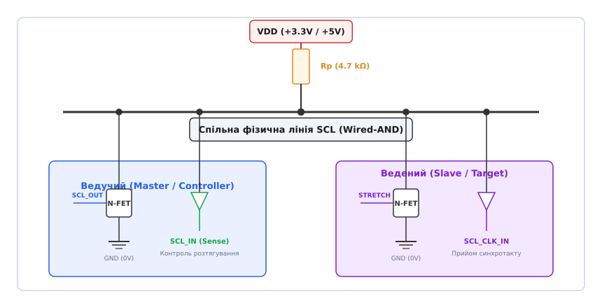
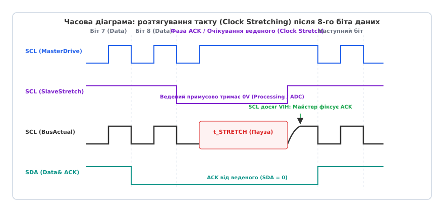
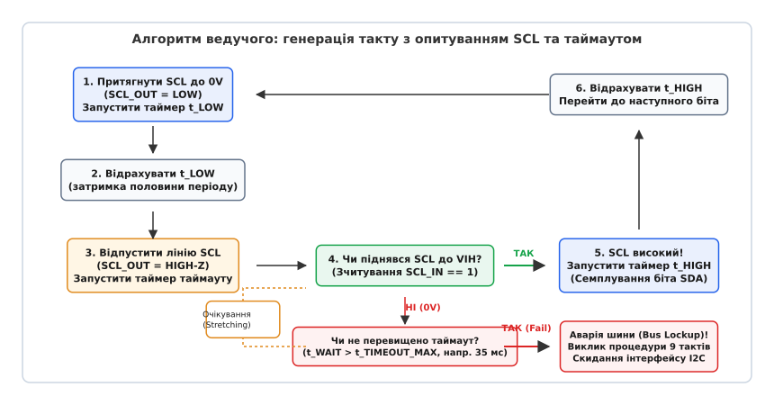
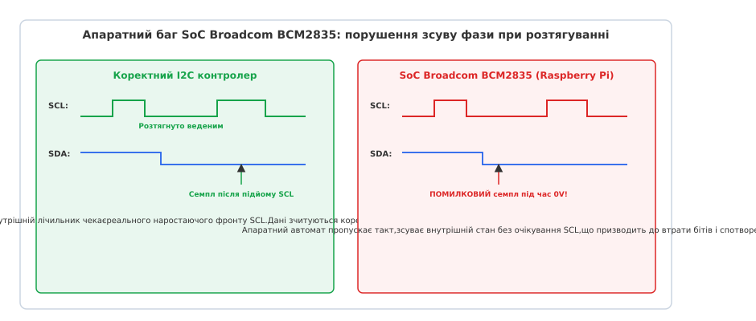
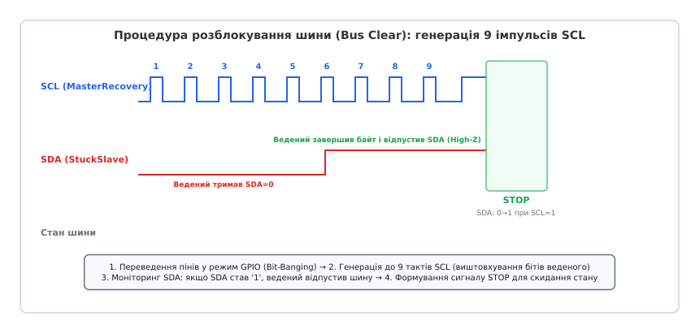

# Clock stretching у I2C

<preknowlist>
- [Двопровідна шина: лінія даних і лінія такту](topic:com-devices/i2c-bus) — фізичні лінії SDA та SCL, розподіл ролей між ведучим і веденим.
- [Відкритий колектор](topic:hw-digital/open-drain-bus-pullup-sizing) — схемотехніка відкритого стоку, підтягувальні резистори та логіка монтажного «І».
- [Сигнали СТАРТ, СТОП та підтвердження ACK/NACK](topic:com-devices/start-stop-ack) — дев'ятибітний цикл передачі та вікна дійсності даних.
- [Транзакція I2C](topic:com-devices/i2c-transaction) — послідовність адресних байтів, зміна напрямку передачі та повторний старт.
- [Протокол SMBus](topic:com-devices/smbus-bus-design) — стандартизовані часові обмеження системної шини та таймаути.
</preknowlist>

Коли ведучий мікроконтролер надсилає команду зчитування 24-бітного результату вимірювання до цифрового барометричного сенсора або запускає запис сторінки в мікросхему пам'яті EEPROM на частоті шини 400 кГц, передача одного байта триває лише 22.5 мікросекунди. Водночас аналого-цифровому перетворювачу (АЦП) всередині сенсора для завершення інтегрування сигналу потрібно 10–25 мілісекунд, а внутрішньому зарядному насосу Flash/EEPROM для фіксації заряду в комірках пам'яті — близько 5 мілісекунд. Якщо ведучий контролер продовжить тактувати лінію SCL зі стандартною швидкістю, ведений пристрій не встигне надати дані: чергові байти будуть втрачені, зсувний регістр видасть нульове або сміттєве значення `0xFF`, а стан внутрішніх регістрів буде спотворено.

Шина I2C вирішує цю проблему керування потоком (англ. *flow control*) безпосередньо на фізичному рівні без введення додаткових ліній сигналізації готовності (на зразок ліній переривань DRDY чи апаратних ліній CTS/RTS). Цей механізм називається **розтягуванням тактового сигналу** (англ. *clock stretching*, від *stretch* — тягнути, розтягувати): ведений пристрій примусово утримує спільну лінію такту SCL у низькому логічному рівні 0V, тимчасово заморожуючи автомат станів ведучого доти, доки внутрішні апаратні операції веденого не завершаться.

### Фізичний рівень: монтажне «І» на лінії такту

Можливість веденого пристрою втручатися в роботу тактового генератора ведучого випливає з електричної схемотехніки шини I2C. На відміну від класичних інтерфейсів із двотактним вихідним каскадом (Push-Pull, де вихід активного пристрою жорстко підключається або до `V_DD`, або до `GND`), обидві лінії I2C — SDA і SCL — побудовані за схемою **відкритого стоку** (англ. *open-drain*, для польових N-MOSFET транзисторів) або **відкритого колектора** (англ. *open-collector*, для біполярних NPN-транзисторів).

Лінія SCL фізично підтягнута до напруги живлення `V_DD` через спільний резистор `R_p`. Кожен підключений до шини чіп (як ведучий, так і всі ведені) має вихідний N-канальний транзистор, стік якого з'єднаний із лінією SCL, а витік — із загальною землею `GND` (0V).


*Схемотехніка відкритого стоку на лінії SCL. Підтягувальний резистор `R_p` забезпечує логічну одиницю лише тоді, коли вихідні N-FET транзистори ведучого та веденого одночасно закриті (High-Z). Якщо хоча б один транзистор відкривається на землю, лінія набуває рівня 0V.*

Таке електричне з'єднання реалізує функцію **монтажного «І»** (англ. *wired-AND*). Якщо позначити стан відпускання лінії транзистором пристрою як логічну «1» (стан високого імпедансу, High-Z), а відкриття транзистора на землю як «0», результуюча логічна напруга на фізичній лінії описується булевим виразом:

```
SCL_bus = Master_release ∧ Slave1_release ∧ Slave2_release ∧ ... ∧ SlaveN_release
```

З цього рівняння випливає два фундаментальні правила:
1. **Жоден пристрій не може самостійно встановити на лінії напругу `V_DD`.** Одиниця на лінії з'являється виключно пасивно — за рахунок витікання струму крізь резистор-підтяжку `R_p`, коли *всі* пристрої на шині одночасно закрили свої вихідні ключі.
2. **Будь-який окремий пристрій може одноосібно притягнути всю лінію до 0V.** Достатньо відкрити один транзистор, щоб закоротити шину на землю, незалежно від того, скільки інших мікросхем намагаються її відпустити.

Саме ця асиметрія дозволяє веденому пристрою заблокувати розвиток тактового сигналу: ведучий вважає, що він дозволив лінії піднятися до одиниці, але фізична лінія залишається притиснутою до нуля стороннім транзистором веденого.

### Алгоритм замкненого циклу ведучого: опитування SCL

Поширена інженерна помилка полягає в уявленні, нібито ведучий I2C просто видає прямокутні імпульси на вивід SCL за фіксованим таймером. Якби ведучий працював «наосліп», розтягування такту було б неможливим.

Справжній контролер I2C генерує такт через **замкнений цикл зворотного зв'язку** (англ. *closed-loop clock generation*). Кожен тактовий імпульс формується з обов'язковим апаратним контролем фактичного стану на виводі мікросхеми через вхідний буфер із тригером Шмітта.


*Часова діаграма Clock Stretching. Після 8-го біта даних ведений притягує SCL до 0V. Ведучий після відліку `t_LOW` відпускає свій транзистор (переходить у High-Z), але бачить низький рівень лінії. Таймер `t_HIGH` зупиняється на час `t_STRETCH` до моменту, поки ведений не закриє свій ключ.*

Розгляньмо крок за кроком, що відбувається всередині автомата станів ведучого при формуванні кожного такту:

1. **Формування низького рівня (`t_LOW`):**
   Ведучий відкриває свій нижній N-FET транзистор, притягуючи SCL до 0V. Запускається внутрішній лічильник часу низького стану `t_LOW` (для Standard-mode 100 кГц мінімальне значення `t_LOW = 4.7 мкс`, для Fast-mode 400 кГц — `1.3 мкс`).
2. **Відпускання лінії (перехід у High-Z):**
   Після закінчення інтервалу `t_LOW` ведучий закриває свій N-FET транзистор. Вивід ведучого переходить у стан високого імпедансу. Ведучий очікує, що резистор `R_p` зарядить паразитну ємність шини `C_b`, і напруга підніметься вище порогу логічної одиниці (`V_IH = 0.7 · V_DD`).
3. **Опитування лінії (SCL Sensing):**
   Ведучий зчитує логічний стан із вхідного буфера SCL.
   * *Сценарій А (ведений встигає):* Якщо ведений не активував розтягування, лінія SCL піднімається до `V_DD`. Ведучий фіксує перехід 0 → 1 і **лише в цей момент** запускає таймер високого стану `t_HIGH` (`4.0 мкс` для 100 кГц, `0.6 мкс` для 400 кГц).
   * *Сценарій Б (ведений розтягує такт):* Якщо ведений утримує свій транзистор відкритим, напруга на лінії SCL залишається на рівні 0V (`V_OL ≤ 0.4V`). Вхідний буфер ведучого фіксує логічний нуль.
4. **Фаза очікування (`t_STRETCH`):**
   Ведучий зупиняє свій внутрішній тактовий генератор і залишається у стані очікування з відпущеним власним транзистором. Низький рівень на шині триває стільки, скільки цього вимагає ведений.
5. **Відновлення тактування:**
   Щойно ведений завершує внутрішні обчислення, він закриває свій транзистор. Лінія SCL під дією струму через `R_p` піднімається до `V_DD`. Вхідний буфер ведучого нарешті фіксує рівень `V_IH`.
6. **Відлік `t_HIGH` та фіксація даних:**
   Ведучий відраховує інтервал `t_HIGH`, під час якого стробує (зчитує) стан лінії SDA, після чого знову відкриває свій транзистор на землю, формуючи спадний фронт наступного такту.


*Автомат станів ведучого з апаратною підтримкою Clock Stretching та захистом від дедлоку через лічильник таймауту.*

Таким чином, період тактового імпульсу `T_SCL` при розтягуванні динамічно збільшується:

```
T_SCL = t_LOW + t_STRETCH + t_r + t_HIGH
```

де `t_r` — тривалість наростання фронту через резистор `R_p` і ємність шини, а `t_STRETCH` — час утримання лінії веденим пристроєм.

### Точки застосування Clock Stretching у кадрі I2C

Ведений пристрій не розтягує такт хаотично: утримання лінії прив'язане до конкретних протокольних фаз транзакції I2C. Залежно від внутрішньої архітектури веденого розтягування відбувається в одній із чотирьох точок:

#### 1. Розтягування на рівні байта (Byte-level stretching)
Найпоширеніший випадок у мікросхемах із апаратним буфером. Ведений пристрій приймає повний 8-бітний байт даних або адреси, видає на 9-му такті біт підтвердження ACK (притягує SDA до 0V), після чого притягує лінію SCL до 0V і утримує її.
*Причина:* веденому процесору потрібен час, щоб викликати підпрограму обробки переривання (ISR), скопіювати прийнятий байт із апаратного регістра `I2C_RX_DR` у кільцевий буфер оперативної пам'яті або перевірити коректність адреси регістра.

#### 2. Розтягування на рівні біта (Bit-level stretching)
Характерне для надзвичайно простих або перевантажених мікроконтролерів, де ведений вузол реалізовано суто програмно (бітбанґінг веденого).
*Причина:* мікроконтролер веденого обробляє кожен окремий спадний фронт SCL через зовнішнє переривання GPIO. Якщо ядро процесора в цей момент зайняте обслуговуванням іншого високопріоритетного переривання (наприклад, таймера ШІМ або переривання АЦП), ведений притримує SCL на рівні 0V перед кожним окремим бітом, поки не буде готовий виставити або зчитати значення на SDA.

#### 3. Розтягування під час фази адресації (Address-phase stretching)
Відбувається одразу після надсилання ведучим 7-бітної або 10-бітної адреси та біта R/W.
*Причина:* ведений чіп перебуває в режимі глибокого енергозбереження (Deep Sleep / Standby) з вимкненою основною тактовою частотою. Сигнал СТАРТ і перші адресні біти пробуджують внутрішній RC-генератор або блок фазового автопідстроювання частоти (PLL). Ведений утримує SCL на рівні 0V до повної стабілізації внутрішнього тактування, після чого формує біт ACK.

#### 4. Розтягування при читанні (Read-phase stretching)
Коли ведучий надсилає запит на читання (R/W = 1), ведений зобов'язаний виставити старший біт (MSB, Bit 7) першого байта відповіді на лінію SDA ще до початку наростаючого фронту SCL.
*Причина:* якщо запитувані дані формуються апаратним АЦП або обчислюються математичним сопроцесором (наприклад, калібрувальні коефіцієнти цифрового гіроскопа), ведений утримує SCL на рівні 0V перед першим бітом читання, доки результат не буде завантажено в апаратний зсувний регістр передавача.

### Розрахунок підтягувальних резисторів та вплив ємності шини

Стабільність роботи механізму Clock Stretching безпосередньо залежить від правильного вибору опору підтягувального резистора `R_p`. Оскільки підйом напруги на лінії SCL після закриття вихідного транзистора веденого відбувається виключно пасивно через резистор `R_p`, будь-яка надлишкова паразитна ємність монтажу `C_b` затягує наростаючий фронт сигналу.

Опір резистора `R_p` обмежений двома критичними фізичними рамками:

#### 1. Мінімальний допустимий опір (`R_p(min)`)
Якщо обрати `R_p` занадто малим, крізь відкритий транзистор веденого або ведучого протікатиме надмірний струм замикання на землю. Це призведе до зростання залишкової напруги низького рівня `V_OL` вище допустимого порогу (`0.4V` для Standard/Fast mode):

```
R_p(min) = (V_DD - V_OL(max)) / I_OL
```

Для типової напруги живлення `V_DD = 3.3V`, максимальної залишкової напруги `V_OL(max) = 0.4V` та гарантованого ввімкненого струму вихідного каскаду `I_OL = 3 мА`:

```
R_p(min) = (3.3 - 0.4) / 0.003 = 2.9 / 0.003 ≈ 966.7 Ом ≈ 1 кОм
```

#### 2. Максимальний допустимий опір (`R_p(max)`)
Якщо обрати `R_p` занадто великим, струму буде недостатньо для швидкого заряджання сумарної паразитної ємності шини `C_b` (вхідні ємності мікросхем `C_in ≈ 10 пФ` на пристрій плюс погонна ємність доріжок і кабелів `≈ 50–100 пФ/м`). Час наростання фронту `t_r` (час переходу від `0.3 · V_DD` до `0.7 · V_DD`) перевищить ліміт специфікації (`1000 нс` для Standard-mode, `300 нс` для Fast-mode):

```
t_r = 0.8473 · R_p · C_b
R_p(max) = t_r(max) / (0.8473 · C_b)
```

Для Fast-mode (`t_r(max) = 300 нс`) при ємності шини `C_b = 200 пФ`:

```
R_p(max) = 300·10^(-9) / (0.8473 · 200·10^(-12)) = 300 / 0.16946 ≈ 1770 Ом ≈ 1.8 кОм
```

Якщо інженер помилково встановить стандартний резистор `R_p = 10 кОм` при сумарній ємності `C_b = 200 пФ`, час наростання становитиме `t_r ≈ 1.69 мкс`. Ведучий мікроконтролер після відпускання SCL перебуватиме у стані фальшивого очікування (Stretching), оскільки напруга на лінії підніматиметься до рівня розпізнавання логічної одиниці `V_IH` майже два повних тактових періоди.

### Синхронізація такту в мультимайстерних конфігураціях (Multi-Master Clock Sync)

Фізичний принцип монтажного «І» на лінії SCL використовується не лише веденими для утримання паузи, але й для **автоматичної синхронізації тактових генераторів кількох ведучих**, якщо вони одночасно намагаються захопити шину.

Коли два ведучі (Майстер 1 та Майстер 2) одночасно починають транзакцію:
1. Кожен майстер відкриває свій транзистор на землю і відраховує свій власний внутрішній інтервал `t_LOW`.
2. Той майстер, у якого інтервал `t_LOW` коротший (наприклад, Майстер 1 із частотою 100 кГц проти Майстра 2 із частотою 80 кГц), першим закінчує відлік і відпускає лінію SCL у High-Z.
3. Проте фізична лінія SCL не піднімається, оскільки Майстер 2 із довшим `t_LOW` продовжує утримувати її транзистором на рівні 0V.
4. Майстер 1 бачить через вхідний буфер, що SCL = 0, переходить у стан очікування і не запускає свій таймер `t_HIGH`.
5. Щойно Майстер 2 закінчує свій відлік `t_LOW` і закриває свій транзистор, лінія SCL нарешті наростає до `V_DD`.
6. Обидва майстри одночасно фіксують перехід 0 → 1 і паралельно запускають свої лічильники `t_HIGH`.
7. Той майстер, у якого період `t_HIGH` коротший, першим притягує SCL до нуля, примушуючи іншого майстра завершити свій високий стан.

У результаті результуючий тактовий сигнал на шині має **найдовший низький стан `t_LOW`** (визначений найповільнішим пристроєм) та **найкоротший високий стан `t_HIGH`** (визначений найшвидшим майстром). Таким чином, механізм Clock Stretching є фундаментальною основою безконфліктного арбітражу шини I2C.

Про історичні передумови появи цього механізму в перших мікроконтролерах Philips та його еволюцію можна дізнатися у вставці [Від мікроконтролерів 8048 до скасування в I3C: еволюція тактового узгодження](topic:com-devices/i2c-clock-stretching-timing-budget/hist-clock-stretching.md).

### Апаратні пастки: дефект контролера Broadcom BCM2835 (Raspberry Pi)

Clock Stretching є обов'язковою частиною офіційної специфікації NXP I2C-bus Specification (документ UM10204). Проте в реальному кремнії розробники мікроконтролерів нерідко припускаються грубих помилок при проєктуванні логіки очікування SCL.

Найвідомішим у світі прикладом такого апаратного дефекту є системний контролер BSC (Broadcom Serial Controller), інтегрований у систему на кристалі **Broadcom BCM2835**, на базі якої побудовані комп'ютери Raspberry Pi 1, Raspberry Pi 2, Raspberry Pi Zero та модулі Compute Module.


*Механізм апаратного багу в SoC Broadcom BCM2835. Внутрішній кінцевий автомат контролера пропускає фазу очікування SCL і виконує семплування SDA під час нульового рівня шини.*

#### Суть апаратного дефекту BCM2835

Внутрішній кінцевий автомат блоку BSC містить фатальну помилку в синхронізаторі фаз:
1. Контролер перевіряє стан лінії SCL лише в строго фіксований момент часу — на початку переходу до стану високого рівня.
2. Якщо ведений пристрій починає розтягувати такт на кілька наносекунд пізніше (коли лінія вже мала б почати наростати), або якщо ємність шини `C_b` затягує наростання фронту, внутрішній лічильник BCM2835 не зупиняється.
3. Апаратний автомат BSC вважає, що такт триває у штатному режимі. Він відраховує час `t_HIGH` і здійснює стробування (семплування) лінії SDA **прямо в той момент, коли лінія SCL фізично притиснута до нуля**.
4. Коли ведений нарешті відпускає SCL, контролер BCM2835 сприймає реальний наростаючий фронт не як завершення поточної фази очікування, а як початок *наступного* такту.
5. Відбувається зміщення бітової сітки: контролер втрачає один біт, інтерпретує біт підтвердження ACK як біт даних, надсилає помилковий сигнал СТОП або генерує коротку паразитну голку (глітч), яка збиває внутрішній автомат веденого.

Внаслідок цього дефекту підключення до апаратного I2C Raspberry Pi популярних мікросхем із розтягуванням такту (наприклад, сенсорів якості повітря CCS811, давачів температури й вологості SHT21 / HTU21D, мікросхем годинників реального часу DS1307) призводить до регулярного зчитування спотворених байтів, помилок контрольної суми CRC та спонтанних зависань шини.

#### Інженерні методи обходу (Workarounds)

Для систем із дефектними апаратними контролерами застосовують чотири інженерні рішення:

1. **Програмний I2C через GPIO (Bit-Banging):**
   У конфігурації ядра Linux для Raspberry Pi (`/boot/config.txt`) замість апаратного модуля `i2c_arm` підключають оверлей `i2c-gpio`:
   ```ini
   dtoverlay=i2c-gpio,i2c_gpio_sda=2,i2c_gpio_scl=3,i2c_gpio_delay_us=5
   ```
   Драйвер `i2c-gpio` виконує повну програмну емуляцію з чесним опитуванням вхідного стану SCL, повністю нівелюючи апаратний баг ціною незначного завантаження центрального процесора.
2. **Переведення сенсорів у режим No Hold Master:**
   Якщо давач підтримує альтернативний протокол роботи (як-от режим *No Hold Master* у сенсорах Sensirion/Silicon Labs), ведучий не очікує завершення перетворення на шині, а періодично надсилає повторні запити зчитування. Поки вимірювання триває, ведений відповідає NACK, не розтягуючи такт SCL.
3. **Радикальне зниження тактової частоти:**
   Зниження частоти I2C зі 100 кГц до 10–20 кГц збільшує тривалість фаз `t_LOW` і `t_HIGH`, що зменшує ймовірність потрапляння точки початку розтягування у критичне вікно збою кінцевого автомата SoC.
4. **Використання додаткового мікроконтролера-моста:**
   Між центральним процесором і повільними сенсорами встановлюють дешевий мікроконтролер (наприклад, STM32 або RP2040), який має бездоганну апаратну підтримку Clock Stretching, зчитує сенсори у власний буфер і віддає їх процесору по протоколу SPI або через коректний I2C без розтягування.

Повний розбір написання промислового програмного драйвера наведено у вставці [Програмний ведучий I2C із розпізнаванням Clock Stretching та відновленням шини](topic:com-devices/i2c-clock-stretching-timing-budget/proj-bitbang-stretching.md).

### Проблема мертвого блокування шини (Bus Deadlock) та таймаути SMBus

Хоча Clock Stretching надає зручний інструмент узгодження швидкостей, за своєю природою він несе критичну системну загрозу: **потенційну вразливість до вічного дедлоку** (англ. *unrecoverable bus lockup*).

У базовій специфікації I2C (NXP UM10204) максимальний час розтягування такту `t_STRETCH` є **необмеженим**. Якщо ведений пристрій зависає під час утримання лінії SCL на рівні 0V (унаслідок апаратного збою ядра, провалу живлення Brown-out, програмного зациклення або електростатичного розряду), лінія SCL залишається заземленою назавжди. Жоден інший пристрій на платі більше не зможе відправити сигнал СТАРТ чи передати хоча б один біт. Уся шина I2C повністю вмирає.

#### Стандартизація часових лімітів у SMBus

Для подолання цієї вразливості в промисловому стандарті [SMBus (System Management Bus)](topic:com-devices/smbus-bus-design) було запроваджено жорсткі часові обмеження, які згодом стали стандартом де-факто для всієї надійної мікроелектроніки:

1. **Граничний таймаут низького рівня (`t_TIMEOUT`):**
   * Мінімальне значення: `25 мс`.
   * Максимальне значення: `35 мс`.
   Якщо лінія SCL утримується в низькому рівні довше за `35 мс`, це фіксується як апаратна аварія шини. Ведений пристрій зобов'язаний апаратно скинути свій інтерфейс (через внутрішній Watchdog) і негайно перевести свій вивід SCL у стан високого імпедансу High-Z. Ведучий контролер зобов'язаний зафіксувати таймаут і перервати транзакцію.

2. **Кумулятивне розтягування веденого (`t_LOW:SEXT`):**
   Сумарний накопичений час розтягування такту одним веденим пристроєм у межах передачі одного цілісного повідомлення (від СТАРТ до СТОП) не повинен перевищувати **25 мс**. Це запобігає ситуаціям, коли ведений робить сотні дрібних розтягувань по 200 мкс, монополізуючи шину.

3. **Кумулятивне розтягування ведучого (`t_LOW:MEXT`):**
   Сумарний час утримання SCL ведучим між байтами в межах одного повідомлення обмежено значенням **10 мс**.

| Параметр шини | Стандарт I2C (NXP) | Стандарт SMBus 2.0 / 3.0 | Наслідок перевищення |
| :--- | :--- | :--- | :--- |
| **Мінімальна частота SCL** | 0 кГц (постійний струм DC) | 10 кГц | Спрацьовує апаратний таймаут |
| **Максимальний `t_STRETCH`** | Не обмежений (безкінечність) | 35 мс (`t_TIMEOUT`) | Примусове скидання інтерфейсу веденого |
| **Кумулятивний `t_LOW:SEXT`** | Не регламентується | 25 мс | Переривання транзакції |
| **Поведінка при дедлоку** | Вічне зависання шини | Апаратний скид за таймером | Автоматичне самовідновлення |

### Процедура аварійного розблокування шини (Bus Recovery)

Якщо на шині сталася аварія, пов'язана із зависанням пристрою (найчастіше це зависання веденого з утриманням лінії SDA на рівні 0V при перезавантаженні ведучого посеред операції читання), застосовують стандартну апаратну процедуру розблокування шини — **генерацію 9 імпульсів такту** (англ. *9-clock bus clear procedure*).


*Процедура очищення шини (Bus Clear). Ведучий перемикає вивід SCL у режим програмного керування GPIO і генерує 9 імпульсів такту для виштовхування завислого біта з регістра веденого, після чого формує сигнал СТОП.*

Алгоритм відновлення складається з чотирьох кроків:
1. Ведучий контролер переводить свої виводи I2C у режим програмного керування GPIO з емуляцією відкритого стоку.
2. Ведучий перевіряє стан лінії SDA. Якщо SDA = 1, шина вже вільна. Якщо SDA = 0, ведений утримує нуль, очікуючи чергового стробу SCL.
3. Ведучий генерує до 9 послідовних тактових імпульсів на лінії SCL (перемикаючи SCL: 0V → High-Z → 0V з періодом 10–20 мкс). На кожному такті ведений пристрій зсуває свій внутрішній апаратний регістр на один біт праворуч.
4. Максимум після 8 бітів даних ведений доходить до 9-го біта — фази ACK/NACK, де він зобов'язаний відпустити лінію SDA. Щойно ведучий фіксує, що SDA піднялася до одиниці, він генерує легітимний сигнал СТОП (перехід SDA з 0 в 1 при високому SCL). Шина повертається в робочий стан спокою.

### Розрахунок реальної пропускної здатності шини

Оцінимо на конкретному інженерному прикладі, як Clock Stretching впливає на реальну швидкість опитування групи сенсорів на шині I2C.

**Розрахунковий приклад:**
Нехай на шині I2C Fast-mode (`f_SCL = 400 кГц`, номінальна тривалість одного біта `t_bit = 2.5 мкс`) опитуються три пристрої:
* Пристрій А: EEPROM пам'ять (швидкий апаратний інтерфейс, час розтягування `t_stretch = 0 мкс`).
* Пристрій Б: АЦП термопари (час інтегрування та розтягування такту на фазі читання `t_stretch = 8 мс = 8000 мкс`).
* Пристрій В: Давач тиску (час перетворення `t_stretch = 1.5 мс = 1500 мкс`).

Транзакція зчитування складається з:
1. Байт адреси запису + ACK (9 бітів) = `22.5 мкс`;
2. Байт адреси регістра + ACK (9 бітів) = `22.5 мкс`;
3. Повторний СТАРТ + байт адреси читання + ACK (9 бітів) = `22.5 мкс`;
4. Зчитування 2 байтів даних + ACK/NACK (18 бітів) = `45.0 мкс`;
5. Сигнали START/STOP оверхед `≈ 10.0 мкс`.

Сумарний час передачі протокольних бітів без розтягування:

```
t_proto = 22.5 + 22.5 + 22.5 + 45.0 + 10.0 = 122.5 мкс
```

Повний час транзакції для кожного сенсора з урахуванням розтягування такту:

```
T_EEPROM = t_proto + 0 = 122.5 мкс
T_Pressure = t_proto + 1500 = 1622.5 мкс
T_Thermocouple = t_proto + 8000 = 8122.5 мкс
```

Реальна пропускна здатність опитування сенсора термопари:

```
F_effective = 1 / T_Thermocouple
            = 1 / 0.0081225 с
            ≈ 123.1 транзакцій/с
```

Корисний обсяг переданих даних за секунду (2 байти корисного навантаження за транзакцію):

```
Throughput = 123.1 · 2 байти = 246.2 байт/с
```

Номінальна пропускна здатність шини 400 кбіт/с становить `50 кбайт/с`. Через Clock Stretching ефективне використання шини для цього сенсора впало у **200 разів** (`246 байт/с` проти `50 кбайт/с`).

Цей розрахунок доводить: використання Clock Stretching для тривалих перетворень монополізує шину. Якщо ведучому необхідно часто опитувати швидкі пристрої (наприклад, EEPROM або дисплей), повільні сенсори з розтягуванням понад `1 мс` слід або виносити на окрему шину I2C, або переводити в асинхронний режим опитування (*No Hold Master*) без розтягування такту.

> 🔧 **Навіщо це.** Якщо ваш проєкт зависає раз на кілька годин або днів без видимих причин — у 90% випадків винен некоректний Clock Stretching. Перше правило системного інженера: завжди перевіряйте, чи не використовує обраний сенсор утримання SCL, перевіряйте підтримку розтягування в апаратному I2C вашого мікроконтролера, налаштовуйте апаратний таймаут SMBus (35 мс) і обов'язково інтегруйте процедуру 9-тактового відновлення шини під час старту та обробки помилок.

### Високошвидкісний режим (High-Speed Mode 3.4 Мбіт/с) та відмова в MIPI I3C

У міру зростання вимог до швидкості інтерфейсів розтягування такту зазнало суттєвих обмежень:

#### High-Speed Mode (3.4 Мбіт/с у I2C)
У режимі Hs-mode шина I2C використовує активні генератори струму замість пасивних резисторів `R_p`, щоб забезпечити надшвидке наростання фронтів `t_r ≤ 10 нс`. Через це розтягування такту в Hs-mode суворо обмежене: веденому дозволено розтягувати такт **лише на фазі біта підтвердження ACK/NACK після байта адреси**. Розтягування такту між окремими бітами даних у режимі 3.4 Мбіт/с заборонено специфікацією.

#### Повна відмова в стандарті MIPI I3C
Сучасний наступник I2C — стандарт **MIPI I3C** — перейшов на двотактне керування (Push-Pull) на швидкостях 12.5 Мбіт/с і вище. Оскільки в Push-Pull лінія SCL жорстко перемикається верхнім і нижнім транзисторами ведучого, монтажне «І» стає фізично неможливим.
У стандарті I3C механізм Clock Stretching було **повністю ліквідовано**. Замість блокування такту ведені пристрої тепер повідомляють про завершення вимірювань за допомогою внутрішньосмугових переривань (In-Band Interrupts, IBI) на лінії SDA, що усунуло проблему дедлоків шини на рівні архітектури.

---

### Підсумковий інженерний чекліст

1. **Електрична основа:** Clock Stretching можливий лише завдяки логіці монтажного «І» на схемотехніці відкритого стоку з пасивним підтягувальним резистором `R_p`.
2. **Контроль ведучого:** Ведучий контролер зобов'язаний перевіряти фактичний логічний рівень на виводі SCL після відпускання лінії і не починати відлік `t_HIGH`, поки напруга не досягне `V_IH`.
3. **Апаратні дефекти:** Деякі процесори (зокрема SoC Broadcom BCM2835 у Raspberry Pi) некоректно обробляють розтягування такту. Для роботи з такими чипами використовують програмну емуляцію `i2c-gpio` або режим *No Hold Master*.
4. **Захист від дедлоку:** Необмежений Clock Stretching загрожує системним зависанням. Промислові системи повинні реалізовувати таймаут SMBus (25–35 мс) із автоматичним скиданням інтерфейсу.
5. **Процедура Bus Clear:** При виявленні заблокованої лінії SDA ведучий виконує відновлення шини шляхом генерації до 9 імпульсів SCL з наступним формуванням сигналу СТОП.
