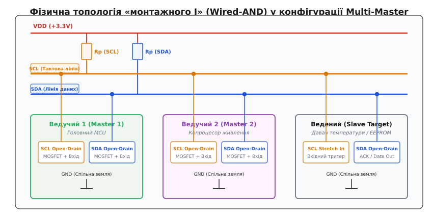
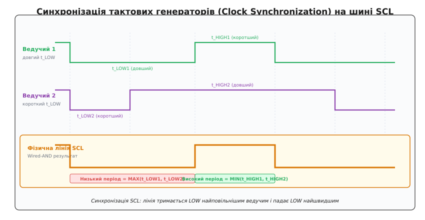
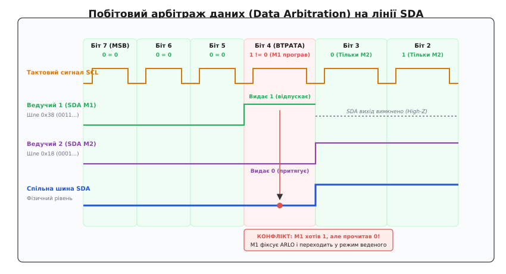
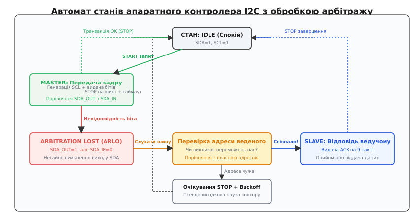
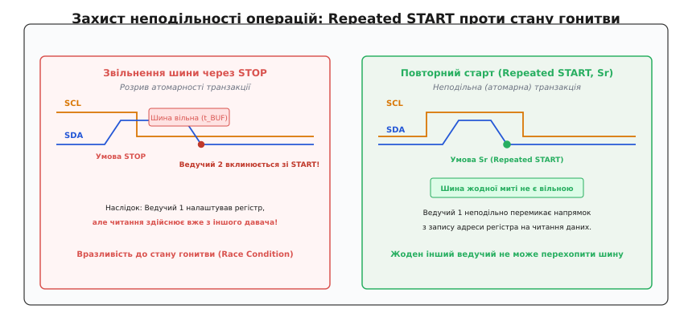

# Кілька ведучих на I2C

<preknowlist>
- [Шина I2C](topic:com-devices/i2c-bus) — фізичний рівень з лініями SDA/SCL, відкритим стоком і підтяжками.
- [Відкритий колектор](topic:hw-digital/open-drain-bus-pullup-sizing) — схемотехніка об'єднання виходів з підтяжкою без короткого замикання.
- [Сигнали START, STOP та біт ACK](topic:com-devices/start-stop-ack) — формування умов початку й завершення транзакції та підтвердження байтів.
- [Адресація I2C](topic:com-devices/i2c-addressing) — 7-бітний адресний простір, біт R/W та адресація ведених пристроїв.
- [Транзакція I2C](topic:com-devices/i2c-transaction) — структура кадру, покажчики регістрів та операції запису й читання.
</preknowlist>

На платі керування польотного контролера або промислового інвертора поруч працюють два незалежні мікроконтролери: головний обчислювальний процесор телеметрії та автономний копроцесор моніторингу системи живлення. Обидва чіпи під'єднані до спільної шини I2C (*Inter-Integrated Circuit*, стандарт NXP UM10204) з напругою живлення 3.3 В, на якій розташовані спільні периферійні мікросхеми: давач струму, енергонезалежна пам'ять конфігурації EEPROM та мікросхема годинника реального часу RTC. Обидва мікроконтролери є повноправними ведучими (*multi-master*): кожен із них має право самостійно ініціювати сеанс зв'язку в довільний момент часу без зовнішнього дозволу.

У мить, коли шина перебуває в стані електричного спокою, внутрішні таймери обох контролерів одночасно відраховують інтервал опитування, і обидва вузли з різницею в кількадесят наносекунд починають формувати сигнал початку обміну, притягуючи лінію даних SDA до нульового потенціалу. Якби фізичний інтерфейс використовував стандартні двотактні цифрові виходи (*push-pull*), таке одночасне ввімкнення призвело б до прямого електричного короткого замикання між ключами верхнього й нижнього плеча, а накладання двох нескоординованих тактових генераторів зруйнувало б часові інтервали кожного біта.

Шина I2C вирішує проблему одночасного доступу принципово інакше: без виділених ліній вибору кристала, без центрального арбітра та без руйнування інформаційних кадрів. Архітектура спирається на два скоординовані апаратні механізми: синхронізацію тактових генераторів на лінії такту SCL та побітовий безвтратний арбітраж на лінії даних SDA.

### Фізична основа: «монтажне І» та стан вільної шини

Фізичний рівень I2C повністю виключає апаратне зіткнення вихідних каскадів завдяки схемотехніці з відкритим стоком (*open-drain*) або відкритим колектором (*open-collector*). Жоден пристрій на шині — ані ведучий, ані ведений — фізично не здатний подати високий рівень напруги (3.3 В або 5.0 В) на лінію через активний транзистор.


*Спільні лінії SCL та SDA підтягнуті до джерела живлення VDD через зовнішні резистори Rp. Кожен вузол містить польовий транзистор з відкритим стоком для притягування лінії до землі (GND) та вхідний буфер з тригером Шмітта для неперервного моніторингу фактичного стану лінії.*

Кожен сигнальний вивід мікроконтролера складається з двох паралельних вузлів: вихідного польового N-канального MOSFET-транзистора, стік якого з'єднаний із лінією шини, а витік — із загальною землею GND, та чутливого вхідного компаратора з тригером Шмітта, що безперервно вимірює миттєву напругу безпосередньо на мідній доріжці плати.

Коли контролер бажає виставити на лінію логічну одиницю `1`, він закриває свій транзистор. Вивід переходить у стан високого електричного імпедансу (*High-Z*), і лінія піднімається до напруги живлення `VDD` завдяки зовнішньому резистору підтяжки `Rp`. Коли ж контролер виставляє логічний нуль `0`, він відкриває транзистор, з'єднуючи лінію із землею і створюючи струм розряду паразитної ємності, що опускає напругу до залишкового рівня `VOL ≤ 0.4 В`.

Така топологія реалізує логічну функцію «монтажного І» (*Wired-AND*). Якщо хоча б один вузол на шині відкриває свій ключ і притягує лінію до землі, уся лінія набуває стану логічного нуля, незалежно від того, скільки інших пристроїв намагаються тримати свої виходи закритими:

```
Рівень лінії = Вузол_1 · Вузол_2 · ... · Вузол_N

Таблиця станів для двох ведучих:
┌──────────┬──────────┬─────────────────┬──────────────────┐
│ Ведучий 1│ Ведучий 2│ Фізичний рівень │ Логічний стан    │
├──────────┼──────────┼─────────────────┼──────────────────┤
│ 1 (High-Z)│ 1 (High-Z)│ VDD (через Rp) │ 1 (Рецесивний)   │
│ 1 (High-Z)│ 0 (GND)  │ 0 В (через M2)  │ 0 (Домінантний)  │
│ 0 (GND)  │ 1 (High-Z)│ 0 В (через M1)  │ 0 (Домінантний)  │
│ 0 (GND)  │ 0 (GND)  │ 0 В (M1 || M2)  │ 0 (Домінантний)  │
└──────────┴──────────┴─────────────────┴──────────────────┘
```

Звідси випливає фундаментальне правило пріоритетів I2C: логічний нуль є **домінантним рівнем** (*dominant level*), а логічна одиниця — **рецесивним рівнем** (*recessive level*). Домінантний стан завжди пересилює рецесивний без жодного ризику виникнення наскрізних струмів чи теплового перевантаження кристала.

#### Визначення вільної шини та час відновлення t_BUF

Перш ніж будь-який ведучий отримає право розпочати транзакцію, він зобов'язаний переконатися, що шина вільна (*Bus Free*). Стан спокою визначається одночасною наявністю високого логічного рівня `1` на обох фізичних лініях SDA та SCL протягом мінімального часу захисного інтервалу `t_BUF` (*Bus free time between a STOP and START condition*).

Згідно зі специфікацією NXP UM10204, мінімальна тривалість `t_BUF` становить:
- У стандартному режимі (Standard-mode, 100 кГц): `t_BUF ≥ 4.7 мкс`.
- У швидкісному режимі (Fast-mode, 400 кГц): `t_BUF ≥ 1.3 мкс`.
- У режимі Fast-mode Plus (Fm+, 1 МГц): `t_BUF ≥ 0.5 мкс`.

Якщо ведучий зафіксував умову зупинки `STOP` (перехід SDA з низького рівня на високий за умови високого SCL), внутрішній апаратний таймер відраховує інтервал `t_BUF`. Тільки після успішного завершення цього відліку без сторонніх перепадів напруги контролер має право згенерувати сигнал `START` (перепад SDA з високого рівня на низький за високого SCL).

Проте якщо два ведучі чекали завершення попередньої передачі третього пристрою, їхні таймери `t_BUF` закінчаться практично одночасно. Обидва контролери почнуть формувати спадний фронт на лінії SDA. У цей момент виникає стан конкуренції, який потребує негайної синхронізації такту та побітового арбітражу.

### Синхронізація такту: поєднання незалежних генераторів SCL

Кожен мікроконтролер має власний внутрішній тактовий генератор або кварцовий резонатор, параметри якого відрізняються через технологічний розкид, температурний дрейф і програмні налаштування переддільників. Наприклад, перший ведучий може генерувати такт із частотою 98 кГц, а другий — 103 кГц. Крім того, фази їхніх генераторів зміщені в часі.

Щоб передача даних була коректною, обидва ведучі мусять працювати в єдиній, суворо узгодженій часовій сітці. Це досягається механізмом синхронізації такту (*Clock Synchronization*) на лінії SCL, що працює за принципом побітового утримання.


*Результуючий сигнал на лінії SCL формується за правилом монтажного І: тривалість низького стану визначається найповільнішим ведучим, а тривалість високого стану переривається найшвидшим.*

Процес синхронізації розгортається циклічно на кожному окремому біті й складається з чотирьох послідовних фаз:

#### 1. Фіксація спадного перепаду (HIGH-to-LOW)
Щойно будь-який із ведучих (той, чий таймер високого стану закінчився першим) відкриває свій транзистор і притягує лінію SCL до нуля, фізична лінія SCL переходить у низький стан. Решта ведучих, які ще перебували у фазі високого рівня, миттєво фіксують спадний фронт на лінії SCL через свої вхідні буфери, примусово скидають залишок свого лічильника високого стану й одночасно запускають власні таймери низького періоду `t_LOW`.

#### 2. Формування низького періоду (LOW Period)
Кожен ведучий починає відраховувати власну запрограмовану тривалість низького стану: `t_LOW1`, `t_LOW2` тощо. Той ведучий, чий період `t_LOW` є коротшим (швидший контролер), завершує відлік першим і закриває свій вихідний транзистор, намагаючись відпустити лінію SCL у високий стан `1`.

Однак лінія SCL не може піднятися до напруги живлення, оскільки транзистор другого (повільнішого) ведучого все ще відкритий і замкнений на землю. Швидший ведучий вимірює стан лінії SCL, бачить, що вона залишається на рівні нуля, і переходить у стан апаратного очікування (*Clock Wait State*).

#### 3. Формування висхідного перепаду (LOW-to-HIGH)
Фізична напруга на лінії SCL починає зростати лише тоді, коли останній, найповільніший ведучий завершує свій період `t_LOW` і закриває свій вихідний транзистор. Підтягувальний резистор `Rp` заряджає паразитну ємність шини, і лінія SCL піднімається до високого рівня `VDD`.

Усі під'єднані ведучі одночасно детектують перетин порогу логічної одиниці на лінії SCL і саме в цю спільну мить одночасно запускають свої лічильники високого періоду `t_HIGH`.

#### 4. Формування високого періоду (HIGH Period)
Ведучі починають відлік тривалості високого стану: `t_HIGH1`, `t_HIGH2`. Той контролер, чий таймер `t_HIGH` закінчується першим (найшвидший вузол), першим відкриває свій транзистор і притягує лінію SCL до землі. Це знову переводить шину у фазу 1, скидаючи таймери повільніших ведучих.

#### Математичний підсумок синхронізації SCL

У результаті апаратного монтажного об'єднання формується єдиний синхронізований тактовий сигнал, параметри якого визначаються граничними характеристиками генераторів:

```
t_LOW(синхр)  = MAX(t_LOW1, t_LOW2, ..., t_LOWN)
t_HIGH(синхр) = MIN(t_HIGH1, t_HIGH2, ..., t_HIGHN)

Повний період синхронізованого такту:
T_SCL = t_LOW(синхр) + t_HIGH(синхр) + t_r + t_f
```

де `t_r` — тривалість наростання сигналу (визначається добутком `Rp · Cb`), а `t_f` — тривалість спаду сигналу.

Цей механізм гарантує дві речі:
- **Дані завжди стабільні:** Високий рівень SCL (вікно валідності даних) триває рівно стільки, скільки дозволяє найшвидший передавач, не перевищуючи допустимих меж.
- **Жоден біт не губиться:** Низький рівень SCL триває рівно стільки, скільки потрібно найповільнішому вузлу для підготовки наступного біта на лінії SDA або для обробки черги переривань.

### Побітовий арбітраж даних: безвтратне голосування на SDA

Коли тактові генератори синхронізовано на лінії SCL, обидва ведучі починають передавати інформаційні біти на лінії SDA. Передача починається зі старшого біта (MSB) адресного байта: семи бітів адреси веденого пристрою, за якими йде восьмий біт напрямку передачі `R/W` (0 — запис, 1 — читання).

Арбітраж (*Arbitration*) — це процес визначення того, який саме з кількох ведучих отримає монопольне право на завершення поточної транзакції. Він відбувається безпосередньо на лінії даних SDA одночасно з передачею корисного сигналу, не вимагаючи жодних додаткових службових тактів.


*Ведучий 1 шле адресу 0x38 (0011 1000b), а Ведучий 2 — адресу 0x18 (0001 1000b). На біті 4 Ведучий 1 видає одиницю (High-Z), але виявляє нуль від Ведучого 2. Ведучий 1 миттєво фіксує втрату арбітражу й вимикає вихід, а Ведучий 2 продовжує передачу без жодного спотворення.*

#### Правило побітового порівняння
Кожен ведучий керує лінією SDA за загальним стандартом I2C:
1. Зміна значення біта на лінії SDA дозволена **тільки тоді, коли SCL перебуває в низькому стані** (`SCL = 0`).
2. Стан лінії SDA є валідним і фіксується приймачами **тільки тоді, коли SCL перебуває у високому стані** (`SCL = 1`).

Під час кожного такту, коли лінія SCL піднімається у високий стан, передавальний мікроконтролер не просто утримує свій стан виходу, а **зчитує фактичний логічний рівень на лінії SDA** через свій вхідний буфер і порівнює його з бітом, який він щойно намагався передати:

```
b_out — значення біта, виставлене внутрішнім регістром передавача (0 або 1)
b_in  — фізичний рівень, зчитаний компаратором із лінії SDA (0 або 1)

Критерій перевірки:
Якщо b_out == b_in:
    Арбітраж триває успішно, контролер зберігає право передачі.
Якщо b_out == 1 І b_in == 0:
    ВТРАТА АРБІТРАЖУ (Arbitration Lost)!
    Контролер негайно вимикає вихідний транзистор лінії SDA.
```

Розглянемо покроково сценарій зіткнення двох ведучих, зображений на часовій діаграмі:

**Початкові умови:**
- Ведучий 1 намагається звернутися до сенсора з адресою `0x38` (двійковий код: `0011 1000b`) у режимі запису (`R/W = 0`). Повний перший байт: `0111 0000b` (з урахуванням зсуву адреси ліворуч).
- Ведучий 2 намагається звернутися до іншого сенсора з адресою `0x18` (двійковий код: `0001 1000b`) у режимі запису (`R/W = 0`). Повний перший байт: `0011 0000b`.

**Хід арбітражу за тактами:**
1. **Біт 7 (MSB):** Обидва ведучі видають `0`. На лінії SDA встановлюється `0`. Обидва зчитують `0`. Результат: збіг, обидва продовжують роботу.
2. **Біт 6:** Ведучий 1 видає `1` (відпускає лінію в High-Z). Ведучий 2 видає `0` (відкриває транзистор і тягне SDA до GND).
   - Завдяки «монтажному І» фізична лінія SDA набуває значення домінантного нуля (`0`).
   - Ведучий 2 перевіряє лінію: хотів `0`, отримав `0` — усе гаразд, передача триває.
   - Ведучий 1 перевіряє лінію: хотів виставити рецесивну `1`, але бачить на фізичній лінії чужий домінантний `0`!
   - Ведучий 1 усвідомлює, що на шині присутній інший передавач із вищим пріоритетом.

У ту ж саму мікросекунду внутрішня логіка Ведучого 1 блокує свій вихідний буфер SDA, залишаючи його у стані High-Z. Ведучий 1 повністю припиняє будь-які спроби впливати на лінію SDA до кінця поточної транзакції.

#### Чому арбітраж I2C є безвтратним (Lossless)
Найважливіша властивість арбітражу I2C — його **неруйнівний характер** (*non-destructive arbitration*). 

Зверніть увагу на поведінку Ведучого 2 у наведеному прикладі: оскільки його транзистор притягував лінію SDA до нуля на 6-му біті, вихід Ведучого 1 (який намагався відпустити лінію в одиницю) жодним чином не спотворив фізичний сигнал. Ведучий 2 навіть не знає, що поруч існував конкурент: його адресний байт дійшов до адресата абсолютно неушкодженим, ведений пристрій відповість підтвердженням `ACK` на дев'ятому такті, і транзакція завершиться на повній швидкості без затримок і без втрати байтів.

#### Пріоритет адрес і даних
Оскільки нуль є домінантним рівнем, математичне правило арбітражу формулюється просто: **що менше числове значення передаваного байта, то вищий пріоритет він має на шині**.

1. **Пріоритет адрес ведених:** Пристрій з адресою `0x18` (`00011000b`) завжди виграє арбітраж у пристрою з адресою `0x38` (`00111000b`), оскільки містить нуль у більш старшому розряді.
2. **Пріоритет операцій запису над читанням:** Якщо два ведучі одночасно намагаються звернутися до одного й того самого веденого (наприклад, адреса `0x68`), один із бітом запису `W` (`0`), а другий із бітом читання `R` (`1`), арбітраж виграє операція запису на 8-му такті адресного байта.
3. **Пріоритет загального виклику:** Спеціальна адреса загального виклику (*General Call Address* `0x00`, двійковий код `0000 0000b`) має абсолютний найвищий пріоритет на шині й виграє арбітраж у будь-якого іншого сеансу звертання.

Арбітраж не обмежується адресним байтом. Якщо два ведучі одночасно надсилають абсолютно однакову адресу однаковому веденому пристрою (наприклад, обидва пишуть у регістр конфігурації), арбітраж триватиме далі — на байті номера регістра та на наступних байтах даних, аж поки не трапиться перший біт, де значення даних у ведучих розійдуться.

### Негайний перехід у режим веденого: реакція автомата станів

Коли мікроконтролер виявляє втрату арбітражу, апаратний блок інтерфейсу I2C генерує подію `ARLO` (*Arbitration Lost*) і змінює стан внутрішнього автомата.


*Після фіксації помилки ARLO контролер негайно вимикає вихідний транзистор SDA, залишає увімкненим компаратор власної адреси й за потреби неподільно переходить у режим веденого (Slave RX/TX).*

Тут виникає критичний сценарій розподілених систем, про який часто забувають розробники початкового рівня: **переможець арбітражу міг звертатися саме до того контролера, який щойно програв арбітраж!**

Уявімо вузол А (головний процесор з власною адресою веденого `0x50`) та вузол Б (копроцесор з адресою `0x52`). 
- Вузол А вирішив надіслати команду вузлу Б (посилає адресу `0x52`).
- У ту саму мить вузол Б вирішив передати дані вузлу А (посилає адресу `0x50`).
- Оскільки адреса `0x50` (`0101 0000b`) має нуль у 2-му біті, а адреса `0x52` (`0101 0010b`) має там одиницю, вузол Б програє арбітраж на цьому біті.

Якщо вузол Б після втрати арбітражу просто вимкне периферійний модуль I2C, станеться аварія: вузол А продовжує надсилати байти адреси `0x50`, очікуючи підтвердження від вузла Б, але вузол Б «образився і заснув». На 9-му такті ніхто не виставить `ACK`, вузол А отримає помилку `NACK`, і зв'язок розірветься.

Стандарт NXP вимагає від апаратного контролера суворої поведінки:
1. **Збереження синхронізації:** Контролер, що програв арбітраж, зобов'язаний продовжувати приймати зовнішній такт SCL і читати решту адресних бітів до кінця поточного байта.
2. **Порівняння адреси:** Прийняті 7 біт порівнюються з внутрішніми регістрами власних адрес контролера (`Own Address 1` / `Own Address 2`).
3. **Автоматична зміна ролі:** Якщо адреса переможця збіглася з власною адресою контролера, автомат станів миттєво перемикається в режим веденого (*Slave Receiver* або *Slave Transmitter*), на 9-му такті видає домінантний нуль `ACK` і починає приймати корисне навантаження.
4. **Обробка чужого кадру:** Якщо передана адреса належить іншому чипу на платі, переможений контролер залишається в пасивному стані до моменту виявлення умови `STOP` на шині, після чого драйвер додає випадкову затримку й планує повтор власної перерваної передачі.

Як побудувати обробник переривань для коректної обробки цієї послідовності в прошивці мікроконтролера, детально розібрано у вставці [обробка втрати арбітражу I2C у багатомайстровій системі](topic:com-devices/i2c-multimaster/proj-multimaster-arbitration.md).

### Повторний старт (Repeated START): захист атомарності та гонитва

У багатьох сценаріях обміну з периферією транзакція складається з двох послідовних фаз: запису та читання. Класичний приклад — читання вимірів з регістрового сенсора (акселерометра, термометра чи мікросхеми годинника RTC):
- **Фаза 1:** Ведучий звертається до давача в режимі запису (`Address + W`) і передає один байт — номер внутрішнього регістра (наприклад, `0x3B`).
- **Фаза 2:** Ведучий звертається до того ж давача в режимі читання (`Address + R`) і приймає байти вимірів.


*Використання умови STOP між фазами звільняє шину на час t_BUF, дозволяючи сторонньому ведучому вклинитися й змінити покажчик регістра. Повторний старт (Sr) утримує шину в зайнятому стані, гарантуючи атомарність подвійної транзакції.*

#### Небезпека розділення через STOP (Стан гонитви)
Якщо розробник завершить першу фазу формуванням сигналу `STOP`, на шині виникне стан електричного спокою, і лічильник вільного часу `t_BUF` почне відлік. 

Щойно мине `1.3 мкс`, другий ведучий, який давно чекав своєї черги, зафіксує вільну шину, видасть сигнал `START` і звернеться до того самого давача (або іншого пристрою), записавши туди інший номер регістра (наприклад, `0x00`).

Коли перший ведучий знову отримає доступ і спробує прочитати дані, внутрішній покажчик регістрів давача вже буде змінено чужим запитом. Перший ведучий прочитає сміття замість очікуваних даних прискорення, навіть не підозрюючи про підміну. Виникає класичний стан гонитви (*race condition*).

#### Рішення: Неподільний повторний старт (Repeated START, Sr)
Для запобігання перехопленню шини протокол I2C надає спеціальну конструкцію — **повторний старт** (*Repeated START*, позначається символом `Sr`).

Повторний старт генерується без попереднього виставлення сигналу `STOP`:
1. Після прийому біта `ACK` останнього байта першої фази ведучий утримує лінію SCL на низькому рівні.
2. Ведучий відпускає лінію SDA у високий рівень `1` (поки SCL залишається `0`).
3. Ведучий дозволяє лінії SCL піднятися у високий рівень `1`.
4. Перебуваючи у високому стані SCL, ведучий примусово притягує лінію SDA до нуля `0`.

Ця послідовність відповідає точному визначенню умови `START`, але оскільки сигналу `STOP` перед нею не було, **шина жодної наносекунди не перебувала у стані спокою** (`BUSY = 1`). Усі інші контролери на платі бачать, що шина зайнята, їхні таймери `t_BUF` заблоковані, і жоден сторонній ведучий не має права ініціювати транзакцію.

#### Арбітраж під час умови Repeated START
Якщо два ведучі одночасно змагалися за шину і їхні перші байти випадково збіглися, арбітраж продовжує діяти й під час формування умови `Sr`:
- Якщо перший ведучий формує умову `Repeated START` (притягує SDA до нуля за високого SCL), а другий ведучий намагається передати біт даних `1` (відпускає SDA за високого SCL), перший ведучий перемагає в арбітражі завдяки домінатному нулю.
- Якщо перший ведучий формує `Repeated START` (тягне SDA до нуля), а другий ведучий намагається згенерувати `STOP` (відпускає SDA в одиницю за високого SCL), перший ведучий виграє арбітраж, а другий фіксує помилку невідповідності шини й відключається.

### Часові обмеження, ємність шини та схемотехнічні пастки

Фізична реалізація багатомайстрової мережі висуває підвищені вимоги до розрахунку пасивних компонентів та аналізу паразитних ємностей друкованої плати.

#### Розрахунок резисторів підтяжки Rp та паразитний розсинхрон
На відміну від двотактних виходів, тривалість наростання імпульсу `t_r` на шині I2C повністю визначається часом заряджання сумарної ємності провідників і входів мікросхем `Cb` через резистор `Rp`:

```
t_r ≈ 0.8473 · Rp · Cb
```

Номінал резистора підтяжки `Rp` обмежений двома жорсткими рамками:

```
                  VDD − VOL(max)
Rp(min) = ──────────────────────────────
                     IOL

                     t_r(max)
Rp(max) = ──────────────────────────────
                 0.8473 · Cb
```

де `IOL` — максимальний струм, який здатні відводити в землю вихідні транзистори мікросхем (за стандартом `IOL = 3 мА` для Standard/Fast mode та `20 мА` для Fast-mode Plus), а `VOL(max) = 0.4 В`.

Для типової напруги живлення `VDD = 3.3 В` та ємності шини `Cb = 150 пФ` у режимі Fast-mode (`t_r(max) = 300 нс`):
- `Rp(min) = (3.3 - 0.4) / 0.003 ≈ 966 Ом`
- `Rp(max) = 300·10⁻⁹ / (0.8473 · 150·10⁻¹²) ≈ 2360 Ом`

Оптимальним вибором для надійного арбітражу буде номінал `Rp = 1.5–2.0 кОм`.

```
Типовий розрахунок часового бюджету Fast-mode (400 кГц):
┌──────────────────────────────────────┬─────────────┬─────────────┐
│ Параметр                             │ Стандарт    │ Факт (2 кОм)│
├──────────────────────────────────────┼─────────────┼─────────────┤
│ Тривалість такту (T_SCL)             │ ≥ 2500 нс   │ 2500 нс     │
│ Низький стан SCL (t_LOW)             │ ≥ 1300 нс   │ 1400 нс     │
│ Високий стан SCL (t_HIGH)            │ ≥ 600 нс    │ 800 нс      │
│ Час наростання (t_r)                 │ ≤ 300 нс    │ 254 нс      │
│ Час спаду (t_f)                      │ ≤ 300 нс    │ 15 нс       │
│ Час вибірки даних (t_SU:DAT)         │ ≥ 100 нс    │ 300 нс      │
└──────────────────────────────────────┴─────────────┴─────────────┘
```

#### Проблема розкиду порогів спрацьовування вхідних компараторів
Вхідні буфери різних мікроконтролерів мають різну схемотехніку тригерів Шмітта. Стандарт I2C визначає порогові рівні напруги:
- Рівень логічного нуля: `VIL = 0.3 · VDD` (для 3.3 В це `0.99 В`).
- Рівень логічної одиниці: `VIH = 0.7 · VDD` (для 3.3 В це `2.31 В`).

Якщо фронт наростання лінії SCL затягнутий через занадто великий опір `Rp` або надмірну ємність кабелю, перший мікроконтролер перетне свій внутрішній поріг `VIH` на 150 нс раніше, ніж другий мікроконтролер із менш чутливим входом. 

У результаті перший контролер почне відлік свого високого періоду `t_HIGH` раніше й раніше опустить лінію SCL до нуля, ще до того, як другий контролер устигне надійно зафіксувати біт на лінії SDA. Це призводить до фатальних помилок валідації даних та хибного спрацьовування прапорця втрати арбітражу `ARLO`.

Щоб запобігти цьому:
- Тривалість наростання фронту `t_r` повинна становити не більше третини від мінімального значення `t_HIGH`.
- На лініях SDA та SCL обов'язково встановлюють вбудовані апаратні фільтри придушення високочастотних імпульсних завад (*Glitch Suppression Filters*), що ігнорують будь-які сплески тривалістю менше `t_SP ≤ 50 нс`.

### Програмна архітектура: повторні спроби, бекоф та запобігання дедлокам

На програмному рівні підтримка кількох ведучих вимагає від драйвера відмови від примітивних блокувальних циклів опитування прапорців (*polling*).

#### Чому миттєвий повтор призводить до блокування (Live-lock)
Якщо два мікроконтролери керуються періодичними таймерами RTOS з однаковим квантом часу (наприклад, 100 Гц), вони постійно намагатимуться розпочати транзакцію в один і той самий момент.

Якщо вузол, що програв арбітраж, спробує повторити транзакцію негайно після появи сигналу `STOP`, він знову зіткнеться з наступним кадром переможця або повторно увійде в колізію з його черговою спробою. Виникає стан динамічного зациклення (*live-lock*), коли шина постійно зайнята арбітражем, а корисна пропускна здатність падає до нуля.

#### Стратегія експоненційного псевдовипадкового відступу
Для розв'язання конфліктів у програмному драйвері застосовують адаптивний алгоритм псевдовипадкового експоненційного відступу (*Exponential Backoff with Jitter*), подібний до алгоритмів мереж Ethernet CSMA/CD:

```
T_wait = T_base · (2^k − 1) · rand(0.5 ... 1.5)
```

де:
- `T_base` — тривалість передачі одного байта (близько 100 мкс для 100 кГц або 25 мкс для 400 кГц).
- `k` — поточний номер невдалої спроби передачі (обмежується значенням `k_max = 4...5`).
- `rand()` — псевдовипадковий множник для рандомізації фази повторного старту між двома вузлами.

#### Діагностика та усунення апаратного дедлоку
У рідкісних випадках (наприклад, апаратне перезавантаження одного з ведучих безпосередньо посеред арбітражу або збій веденого пристрою під час видачі `ACK`) лінія SDA може виявитися примусово затиснутою в нуль транзистором завислого чіпа.

Оскільки лінія SDA заблокована на рівні нуля, жоден інший ведучий не може розпочати транзакцію, вважаючи, що шина постійно зайнята іншим сеансом зв'язку.

Для виходу з такого дедлоку драйвер ведучого контролера повинен реалізовувати процедуру аварійного відновлення шини (*Bus Recovery Procedure*):
1. Програмно переналаштувати вивід SCL у режим стандартного двотактного виходу GPIO (*General Purpose Output*).
2. Згенерувати пачку з 9 послідовних тактових імпульсів на лінії SCL з частотою 50–100 кГц.
3. Під час генерації імпульсів завислий ведений пристрій, який очікував завершення свого байта, виштовхне залишок бітів і відпустить лінію SDA у стан High-Z.
4. Після звільнення лінії SDA ведучий генерує правильну послідовність сигналу `STOP`, відновлюючи стан спокою шини.

### Зведення характеристик арбітражу I2C

| Властивість | Реалізація в I2C | Інженерний наслідок |
|:---|:---|:---|
| **Фізичний рівень** | Відкритий стік (Open-Drain) + підтяжка Rp | Повна електрична безпека при одночасному ввімкненні виходів |
| **Логіка колізій** | Монтажне І (Wired-AND): 0 — домінантний, 1 — рецесивний | Логічний нуль завжди пересилює логічну одиницю |
| **Синхронізація SCL** | Утримання лінії SCL найповільнішим вузлом | Єдина часова сітка; безпечна робота пристроїв із різними частотами |
| **Механізм арбітражу** | Побітове порівняння SDA_OUT та SDA_IN під час SCL = HIGH | Безвтратний (Lossless) арбітраж; переможець не зазнає затримок |
| **Пріоритет шини** | Менше числове значення адреси та даних має вищий пріоритет | Загальний виклик (0x00) та операції запису мають найвищий пріоритет |
| **Реакція на поразку** | Негайний перехід SDA в High-Z, перевірка збігу власної адреси | Можливість негайно відповісти переможцю як ведений пристрій |
| **Захист транзакцій** | Повторний старт (Repeated START, Sr) без звільнення шини | Атомарний доступ до регістрів без ризику перехоплення шини |

Завдяки комбінації монтажного І, синхронізації SCL та побітового арбітражу SDA шина I2C забезпечує надійну спільну роботу кількох обчислювальних ядер на одній платі без необхідності використання складних апаратних комутаторів або додаткових сигнальних ліній керування.
