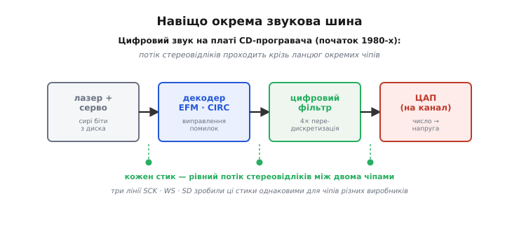

# 📜 Як народилася I2S: шина під цифровий звук компакт-диска

Абревіатури обманюють. Ти дивишся на «I2S» і майже певно читаєш його як молодшого брата I²C — «I-квадрат-щось». Але квадрата тут немає, і схожість оманлива: **I²C** — це *Inter-Integrated Circuit*, «між інтегральними схемами», універсальна дротова балачка про будь-що; **I2S** — це *Inter-IC Sound*, «звук між мікросхемами», і слово *Sound* тут не окраса, а вся суть. Це шина, яку зробили під одну-єдину річ — рівний потік звукових відліків між чіпами. Щоб зрозуміти, чому вона така аскетична (три дроти, жодних адрес, жодного підтвердження) і чому ця аскеза пережила десятиліття, треба повернутись у момент, коли цифровий звук уперше ринув у дім звичайної людини.

## Момент, коли звуку раптом стало багато

До кінця 1970-х цифровий звук жив у студіях і лабораторіях. Пересічний слухач мав вініл і касету — суцільний **аналоговий** сигнал від голки чи магнітної стрічки просто до підсилювача. Усередині програвача не було чого «пересилати цифрою»: голка гойдала струм, струм ішов у динамік, крапка.

Компакт-диск усе змінив. У 1979 році Philips (Ейндговен, Нідерланди) і Sony (Токіо, Японія) зібрали спільну робочу групу інженерів, щоб зробити цифровий звуковий диск. Групу вели **Кес Схаугамер Іммінк** (нід. *Kees Schouhamer Immink*) з боку Philips і **Тошітада Дої** (яп. *土井利忠*, *Toshitada Doi*) з боку Sony. За рік суперечок і дослідів народився документ, який назвали **Red Book** (одна з «Райдужних книг» — серії специфікацій CD, кожна свого кольору обкладинки). Він і задав те, що зараз здається очевидним: звук на диску — це **лінійна імпульсно-кодова модуляція** (LPCM), два канали, **знакові 16-бітні відліки**, узяті **44 100 разів на секунду**.

> 🔧 **Навіщо це.** Числа 44.1 кГц і 16 біт — не абстракція з підручника, а прямий предок частот, які ти й досі виставляєш у тактовому дереві мікроконтролера, заводячи I2S. WS цокатиме рівно з частотою відліків, SCK — у стільки разів швидше, скільки біт у кадрі. Тобто параметри, про які Philips і Sony сперечались у 1979-му, лишились «зашитими» в кожен аудіоінтерфейс, який ти конфігуруєш сьогодні.

Побічний, але вирішальний наслідок цього стандарту: щоб перетворити ці числа назад на звук, усередині програвача тепер мусила працювати ціла **фабрика цифрової обробки**. Диск віддає сирі біти; їх треба декодувати, виправити помилки (подряпини й пил — не рідкість), відфільтрувати, і аж тоді віддати на цифро-аналоговий перетворювач. І кожен із цих кроків у ті часи був окремою мікросхемою.

## Ланцюг чіпів, у якому загубилася звичайна шина

Погляньмо, що діялося на платі першого масового програвача Philips CD100 (1982). Сигнал ішов ланцюгом окремих кристалів: декодер каналу, блок виправлення помилок, цифровий фільтр із передискретизацією і, нарешті, ЦАП. Між кожною парою сусідніх чіпів тік **безперервний потік стереовідліків**.


*Цифровий звук у CD-програвачі проходить крізь низку окремих мікросхем: декодер, виправлення помилок, цифровий фільтр, ЦАП. Кожен стик між сусідніми чіпами — місце, де треба ганяти рівний потік лівих і правих відліків. Саме множина таких однакових стиків і породила потребу в спільній звуковій лінії, щоб чіпи різних виробників розуміли одне одного без перекладача.*

Тепер уяви себе інженером Philips, який має з'єднати цей ланцюг. Кожен стик — це не «переслати пакет» і не «прочитати регістр»; це **лити відліки рівномірно, роками, без єдиної паузи**, поки грає музика. І цих стиків багато, а мікросхеми на них можуть бути від різних відділів чи навіть різних виробників. Постає банальне, але дошкульне питання: за яким саме правилом два сусідні чіпи мають домовлятись про звук?

Тут і криється мотивація, яку сама специфікація I2S формулює в першому ж реченні напрочуд сухо: *«Багато цифрових звукових систем виходить на споживчий ринок — компакт-диск, цифрова аудіокасета, цифрові звукопроцесори, цифровий звук телебачення»*. Тобто справа не в одному диску. Раптом **скрізь** усередині побутової техніки з'явився цифровий звук, який тече від чіпа до чіпа, і кожен виробник ліпив цей стик по-своєму. Далі специфікація каже, навіщо стандарт: *«Стандартизовані структури зв'язку конче потрібні і виробникові апаратури, і виробникові мікросхем, бо збільшують гнучкість системи»*. Гнучкість тут — дуже конкретна річ: якщо стик усюди однаковий, ЦАП одного виробника стає до фільтра іншого без переробки плати.

А чому не взяли готову шину? На платі вже жили [I²C](root:com-devices/i2c-bus) (той самий Philips винайшов її на початку 1980-х для керування) і скоро [SPI](root:com-devices/spi-bus). Обидві вміють возити байти. Але жодна не лягала під звук, і причина глибша, ніж «повільно».

## Чому звук не влазив у наявні шини

Звук має рису, якої немає в керуванні чи в передаванні файлу: він **безперервний і жорстко прив'язаний до часу**. Відлік номер N мусить піти рівно через 1⁄44100 секунди після відліку N−1 — не раніше, не пізніше. Це геть інша задача, ніж «прочитати температуру, коли зручно».

Розберімо на пальцях, де ламаються універсальні шини. I²C і SPI задумані під **транзакції**: господар шини вихоплює лінію, проганяє порцію байтів, відпускає. Між порціями — паузи, поки процесор зайнятий чимось іншим. Для регістра давача це нормально: прочитав, коли треба, і забув. Для звуку — катастрофа: щойно між двома відліками з'явиться нерівномірна пауза, потік «дрижить» у часі, а на виході ЦАП це чути як спотворення. Крім того, ці шини не знають, **де межа слова** й **який зараз канал** — лівий чи правий. Треба було б домовлятися про це окремим протоколом згори, а це знову різнобій між виробниками.

Philips пішов іншим шляхом: не тягнути звук через загальну шину, а зробити **вузьку спеціалізовану лінію**, у якій усі складнощі звуку враховані **апаратно, в самій формі сигналу**. Так у лютому 1986 року й з'явилася специфікація I2S. Три дроти, кожен з однією ясною роллю:

```
SCK  — такт біта: цокає на кожен окремий біт
WS   — вибір слова: 0 = лівий канал, 1 = правий; б'ється з частотою відліків
SD   — самі числа-відліки, старшим бітом уперед
```

Уся своєрідність — у середньому дроті. **WS** (*Word Select*) — це те, чого немає в жодній «звичайній» шині: окремий сигнал, що дротом, апаратно, каже, чий зараз канал і де межа між словами. Поділ на лівий/правий тут не додано протоколом згори — він **вбудований у саму шину**. І безперервність теж вбудована: SCK з WS біжать рівно, без пауз, бо їх задає ведучий-генератор, а не примхливий процесор. Дві головні біди звуку — нерівномірність у часі й невизначеність меж — зникли не завдяки складнішому протоколу, а завдяки одному зайвому дроту й простому правилу.

> 🔧 **Навіщо це.** Ось чому й досі, коли новий аудіочіп «мовчить», перше, що ловлять логічним аналізатором, — саме WS: його частота має точно дорівнювати частоті відліків. Ця перевірка існує лише тому, що Philips свідомо винесла ритм звуку в окремий дріт замість того, щоб ховати межі слів у потоці даних, як роблять асинхронні шини. Одне інженерне рішення 1986 року — і одна лінія одразу каже, чи правильний темп у всієї системи.

## Що означає «мінімалізм пережив десятиліття»

Тепер найцікавіше. Специфікацію I2S опублікували **1 лютого 1986 року**, переглянули **5 червня 1996-го**, а наступного разу торкнулись аж **17 лютого 2022-го** — і то здебільшого косметично: NXP (спадкоємець Philips Semiconductors) переписала документ під новий фірмовий стиль і замінила застарілі терміни *master/slave* на *controller/target*. Понад тридцять п'ять років — і **сама суть не змінилась ні на біт**. Для швидкоплинної електроніки це майже нечувано. Чому?

Причина парадоксальна: I2S вижила **саме завдяки тому, чого в ній немає**. Вона не намагалась передбачити майбутнє — вона зробила рівно те, що треба звуку, і зупинилась. Немає адрес, бо на звуковому стику зазвичай двоє: джерело й перетворювач, вибирати нікого. Немає підтвердження прийому (ACK), бо потік однобічний і безперервний — нікому й нема коли відповідати. Немає навіть зашитої розрядності слова: завдяки хитрому зсуву фронту WS на один такт передавач із 16-бітними словами й приймач, налаштований на 24 біти, все одно порозуміються. Кожне «нема» — це відсутність припущення, яке з часом застаріло б.

Порівняй із долею шин, що намагались бути розумнішими. Багато «повних» звукових інтерфейсів обростали режимами, регістрами, обов'язковими контролерами — і старіли разом зі своєю епохою. I2S лишалась настільки дурною й прямою, що її можна було безкарно **розширювати збоку**, не чіпаючи ядро. Коли дельта-сигма ЦАП забажали набагато швидший внутрішній такт, поруч просто додали окрему лінію **MCLK** (зазвичай 256·fs) — а три оригінальні дроти лишились ті самі. Коли захотіли більше каналів, ніж стерео, наростили **TDM** — кілька слів у кадрі — знову ж таки поверх незмінної основи.

Саме тому три лінії 1986 року стали **де-факто спільною мовою** всього цифрового звуку, хоч формально це лише документ однієї компанії. Придивись, де вони живуть сьогодні:

- Аудіокодеки й ЦАП/АЦП будь-якого виробника мають вхід I2S як щось само собою зрозуміле — стик між чіпами такий самий, як мріяв Philips.
- **SAI** (*Serial Audio Interface*) у мікроконтролерах STM32 — це, по суті, гнучкіша обгортка навколо того самого поділу SCK/WS/SD, що вміє і чистий I2S, і його родичів (left-/right-justified, TDM).
- **ESP32** несе аж два апаратні блоки I2S; на ньому масово роблять інтернет-радіо й голосові пристрої, ллючи звук у копійчаний підсилювач напряму трьома дротами.
- Навіть цифрові **MEMS-мікрофони** віддають звук по I2S — той самий WS тепер розрізняє не стереоканали динаміків, а лівий і правий мікрофон у масиві.

Жоден із цих пристроїв не існував, коли писали специфікацію. Але всім їм підійшов той самий аскетичний стик — бо він від початку описував не конкретну техніку 1986 року, а **саму природу звукового потоку**: рівні відліки, чіткі межі слів, явний поділ каналів. Природа звуку не змінилась — і стандарт не мусив.

## Чия ж це заслуга — і без легенд

Тут варто бути точним, бо історію техніки легко звести до одного героя чи однієї країни, а насправді вона майже завжди колективна.

**Компакт-диск** — не «винахід Philips» і не «винахід Sony», а **спільна робота обох**, і документально це видно навіть у дрібницях. Класичний приклад — суперечка про розрядність: у Philips **уже був готовий 14-бітний ЦАП** (мікросхема TDA1540), і компанія тягла до 14 біт; Sony наполягала на 16. Перемогли **16 біт і 44.1 кГц**. Philips, аби не поступитись зовсім, обійшла свій «застарілий» 14-бітний ЦАП тим самим цифровим фільтром із **чотирикратною передискретизацією й формуванням шуму**, витиснувши з 14 біт якість, близьку до 16-бітної. Тобто навіть усередині одного табору рішення народжувалось з інженерного компромісу, а не з осяяння генія.

**I2S** — це вже вужче: специфікацію видала конкретно **Philips Semiconductors** (згодом виокремлена в NXP), і тут авторство компанії безсумнівне — це її документ. Але важливо не перебільшити й це. I2S не «винайшла звук по дроту» — послідовна передача цифрового аудіо між чіпами існувала й у студійній техніці; Philips зробила інше й теж цінне: **стандартизувала** стик так вдало, що ним добровільно почала користуватись уся галузь. Різниця між «мати ідею», «зробити робочу реалізацію» і «створити стандарт, який прижився» тут дуже наочна — і саме третє, а не міфічне «перші придумали», зробило I2S тим, чим вона є.

Щодо статусу цих тверджень: дати специфікації (1 лютого 1986, 5 червня 1996, 17 лютого 2022) і авторство Philips узяті прямо з титулу й тексту офіційного документа NXP — це **усталений факт**. Спільне авторство CD, імена Іммінка й Дої, суперечка 14 проти 16 біт, чипсет CD100 з TDA1540 — усе задокументовано в матеріалах Philips/Sony і сходиться в кількох незалежних джерелах, тож теж **усталене**. Ніяких «таємних першовідкривачів» чи національних пріоритетних міфів навколо I2S немає — і вигадувати їх не треба: це чесна історія двох інженерних компаній, голландської та японської, які спершу разом зробили диск, а тоді одна з них навела лад у тому, як звук тече між мікросхемами всередині плеєра.

І в цьому, мабуть, головний урок цієї маленької шини. Її не проєктували, щоб пережити епоху. Її проєктували, щоб чесно розв'язати одну конкретну задачу — і зробили це так точно, без зайвого й без пихи, що задача виявилась вічною, а разом із нею й розв'язок.
