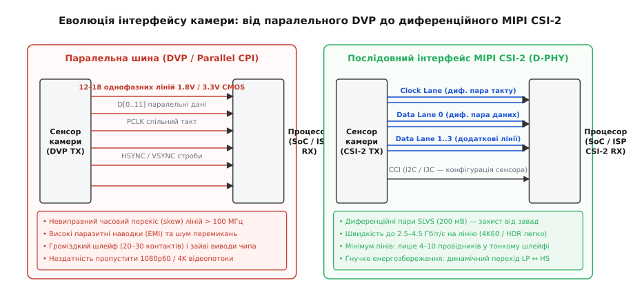
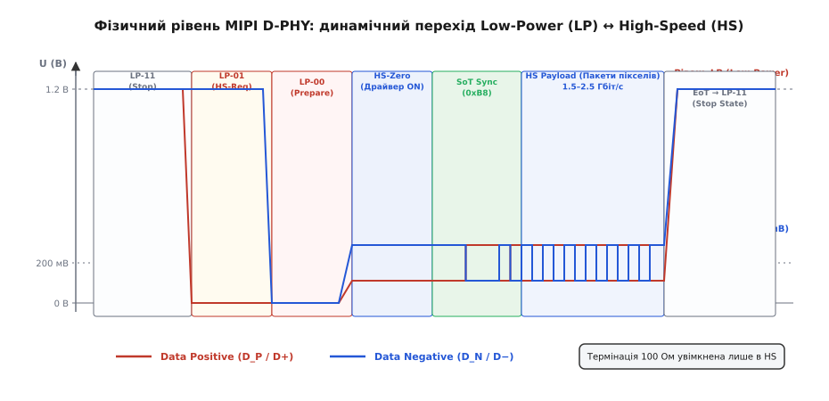
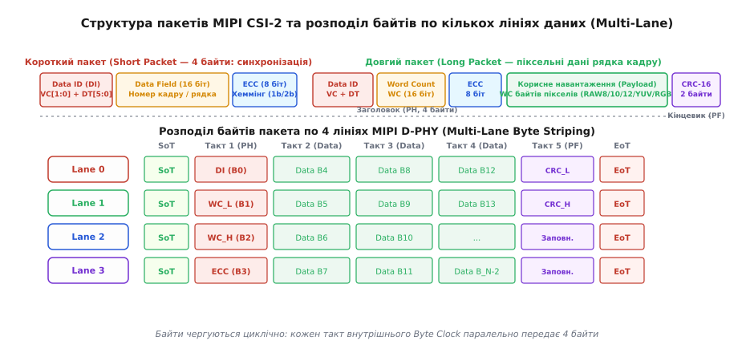
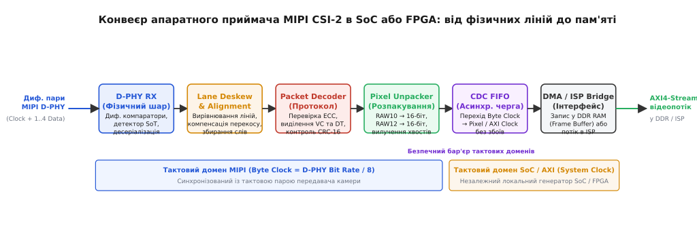

# MIPI CSI-2: послідовний інтерфейс камери

<preknowlist>
- [Диференціальна сигналізація LVDS](root:com-devices/lvds) — передача інформації різницею напруг у витій парі для придушення синфазних завад.
- [SerDes](root:com-modulation/serdes) — перетворення паралельних слів у високошвидкісний послідовний потік і відновлення на стороні приймача.
- [Шина I²C](root:com-devices/i2c) — повільний двопровідний інтерфейс, на базі якого реалізовано канал конфігурації сенсора (CCI).
- [Асинхронна черга FIFO](root:hw-digital/async-fifo) — безпечне передавання даних між незалежними тактовими доменами без ризику метастабільності.
- [Контрольна сума CRC](root:com-protocol/crc-in-firmware) — поліноміальний розрахунок контрольних сум для виявлення пошкоджених блоків даних.
</preknowlist>

Сучасний матричний сенсор зображення з роздільною здатністю 4K під час знімання зі швидкістю 60 кадрів на секунду та 10-бітною глибиною оцифрування формує безперервний потік сирих піксельних відліків зі швидкістю понад 5 гігабітів на секунду. Якщо спробувати передати цей потік за традиційною схемою паралельного інтерфейсу — проклавши десять окремих провідників для розрядів даних, лінію піксельного такту та строби рядкової й кадрової синхронізації, — система моментально впирається у фізичний бар'єр. На частотах перемикання понад 100 МГц різниця затримок між доріжками плати перевищує тривалість бітового вікна, одночасне перемикання десятка однофазних CMOS-виводів створює потужні радіозавади для сусідніх антен мобільного пристрою, а широкий шлейф на 20–30 контактів неможливо прокласти крізь поворотні механізми стабілізатора камери або компактного корпусу смартфона.

Для подолання цієї кризи мобільна індустрія перейшла від паралельних шин до спеціалізованого стандарту диференційного послідовного з'єднання — **MIPI CSI-2** (англ. *Mobile Industry Processor Interface Camera Serial Interface 2*). Цей протокол об'єднав високу пропускну здатність диференційних ліній, динамічне енергозбереження з вимкненням швидкісних передавачів у паузах між рядками, гнучку пакетизацію потоку з апаратною корекцією помилок та мультиплексування декількох логічних потоків в одному фізичному лінку.

### Чому паралельна шина камери вичерпала себе

Класичний цифровий інтерфейс відеосенсора, відомий як **DVP** (англ. *Digital Video Port*) або паралельний CPI (англ. *Camera Parallel Interface*), будувався на принципі прямого відображення внутрішньої матриці сенсора на вивідні ніжки чипа. Конструкція складалася з 8, 10 або 12 паралельних ліній даних `D[0..N]`, лінії піксельного такту `PCLK` (англ. *Pixel Clock*), стробу початку рядка `HSYNC` (англ. *Horizontal Synchronization*) та стробу початку кадру `VSYNC` (англ. *Vertical Synchronization*). Кожен такт сигналу `PCLK` фіксував на паралельних виводах значення одного пікселя у рівнях напруги 1.8 В або 3.3 В стандартної однофазної логіки CMOS.

Доки роздільна здатність обмежувалася форматами VGA (640 × 480) або 720p за помірної частоти 30 кадрів на секунду, частота такту `PCLK` не перевищувала 25–40 МГц. За періоду такту у 25–40 наносекунд незначні розбіжності в довжині провідників на друкованій платі або гнучкому шлейфі викликали перекіс часу прибуття (англ. *skew*) лише у кілька сотень пікосекунд. Це становило мізерну частку бітового вікна, і приймач без помилок фіксував стабільні логічні рівні.

Ситуація кардинально зламалася зі зростанням роздільної здатності сенсорів:
1. **Часовий перекіс (Clock-to-Data Skew):** Для передавання відео Full HD (1080p60) тактову частоту `PCLK` довелося підняти вище 148 МГц, що скоротило бітове вікно до 6.7 нс, а для 4K вона перевищила б 500 МГц із тривалістю вікна менше ніж 2 нс. У гнучких шлейфах через варіації діелектричної проникності та неідеальне трасування перекіс сигналів сягає 1–2 нс. У результаті, коли фронт `PCLK` приходить на приймач, частина ліній даних ще не встигає встановитися в новий стан, а інша вже перемикається, руйнуючи значення пікселя.
2. **Електромагнітна інтерференція (EMI) та шум перемикання:** Десять або дванадцять паралельних провідників CMOS із розмахом напруги 1.8 В, що перемикаються одночасно за кілька сотень пікосекунд, створюють величезні пікові струми `dI/dt`. Це спричиняє явище індуктивного стрибка землі (англ. *ground bounce*) та генерує потужне електромагнітне випромінювання на гармоніках тактової частоти. У смартфонах або безпілотниках цей шум безпосередньо глушить чутливі радіоприймачі стільникового зв'язку (LTE/5G), Wi-Fi, Bluetooth та супутникової навігації GNSS.
3. **Обмеження кількості виводів і габаритів:** Паралельна шина разом із лініями живлення, аналогової фільтрації та службовою шиною конфігурації вимагає 20–30 фізичних контактів на роз'ємах сенсора та процесора. Це здорожчує корпусування мікросхем, збільшує площу кремнієвого кристала і робить шлейф камери занадто жорстким.


*Зліва: класична паралельна шина DVP вимагає до 18 однофазних провідників CMOS, генерує сильні електромагнітні завади і страждає від перекосу затримок на частотах вище 100 МГц. Справа: диференційний інтерфейс MIPI CSI-2 на фізичному рівні D-PHY передає гігабітні потоки всього по 2–5 диференційних парах із низьким розмахом сигналу (200 мВ), скорочуючи габарити і усуваючи завади.*

Виходом став перехід до послідовного диференційного передавання на низьковольтних рівнях із застосуванням спеціалізованих фізичних рівнів сімейства MIPI PHY.

---

### Фізичний рівень D-PHY: подвійне життя ліній (LP та HS)

Більшість сенсорів камери використовують фізичний рівень **MIPI D-PHY** (буква «D» походить від римської цифри 500, оскільки початкова специфікація орієнтувалася на швидкість 500 Мбіт/с на лінію, хоча сучасні ревізії сягають 2.5–4.5 Гбіт/с).

Головна архітектурна особливість D-PHY — це **асиметричний двомодовий інтерфейс**. Фізичний канал складається з однієї тактової диференційної пари (англ. *Clock Lane*) та від однієї до чотирьох (рідше до восьми) диференційних пар даних (англ. *Data Lanes*). Кожна така пара дротів вміє динамічно перемикатися між двома принципово різними електричними станами без застосування додаткових комутаційних реле чи зовнішніх ключів.

#### Режим високої швидкості (High-Speed, HS)
Призначений виключно для потокового передавання корисного навантаження (пакетів пікселів).
- **Тип сигналу:** диференційний низьковольтний сигнал за стандартом SLVS (англ. *Scalable Low-Voltage Signaling*).
- **Рівні напруги:** синфазна напруга (англ. *common-mode voltage*) становить близько 200 мВ, а диференційний розмах між провідниками пари `D+` та `D−` становить усього `ΔV = 200 мВ` (від 100 мВ до 300 мВ відносно землі).
- **Термінація:** на стороні приймача паралельно входу підключається диференційний резистор термінації опором 100 Ом.
- **Швидкість:** від 80 Мбіт/с до 2.5 Гбіт/с (і до 4.5 Гбіт/с у D-PHY v2.0+) на кожну лінію даних.
- **Перевага:** низький розмах напруги мінімізує енергію перемикання ємності ліній, а диференційна топологія забезпечує захист від синфазного шуму та практично нульове електромагнітне випромінювання назовні.

#### Режим низького споживання (Low-Power, LP)
Призначений для передавання сигналів керування, встановлення стану шини та глибокого енергозбереження під час пауз.
- **Тип сигналу:** два незалежних однофазних сигнали CMOS (окремо на дроті `D+` та окремо на `D−`).
- **Рівні напруги:** логічний нуль — 0 В, логічна одиниця — 1.2 В.
- **Термінація:** внутрішній резистор 100 Ом на приймачі **відмикається**, вхід переходить у високоімпедансний стан (Hi-Z), що виключає постійне витікання струму.
- **Швидкість:** низька, не більше 10 Мбіт/с.
- **Перевага:** статичний струм споживання наближається до нуля, оскільки немає постійного струмового зміщення, характерного для диференційних пар.

Навіщо сенсору поєднувати ці два світи? Матриця камери формує зображення рядками. Між завершенням передавання одного рядка та початком наступного завжди є пауза (англ. *horizontal blanking*, H-Blank), а між кадрами — тривала міжкадрова пауза (англ. *vertical blanking*, V-Blank). Замість того, щоб у холостому режимі безперервно ганяти гігабітні диференційні послідовності та споживати десятки міліватів струму батареї смартфона, передавач D-PHY миттєво переводить лінію в режим LP (стан зупинки `LP-11`), вимикаючи високошвидкісні драйвери.


*Електричні стани лінії D-PHY під час переходу з режиму енергозбереження LP (1.2 В) у режим швидкісного передавання HS (диференційний розмах 200 мВ). Передавач формує послідовність LP-11 → LP-01 → LP-00 → HS-Zero, видає синхропослідовність SoT (0xB8) і починає передавати корисні пакети пікселів, після чого через стан EoT повертається в режим LP-11.*

#### Послідовність переходу між LP та HS станами
Щоб приймач зміг безпечно під'єднати термінацію 100 Ом, зафіксувати старт швидкісного пакета та налаштувати апаратне стробування, стандарт визначає сувору послідовність станів:

1. **Стан зупинки (Stop State / LP-11):** Обидва провідники `D+` та `D−` утримуються на рівні 1.2 В. Це пасивний стан очікування між пакетами.
2. **Запит передавання (HS-Request / LP-01):** Провідник `D+` падає в 0 В, а `D−` залишається на рівні 1.2 В. Для приймача це сигнал підготувати внутрішню логіку до прийому даних.
3. **Підготовка мосту (HS-Prepare / LP-00):** Обидва дроти падають у 0 В на визначений таймінгами інтервал часу. Приймач вмикає внутрішню термінацію 100 Ом.
4. **Увімкнення HS-драйвера (HS-Zero / HS-Go):** Передавач перемикається в диференційний режим і видає нульовий диференційний рівень протягом часу, необхідного для стабілізації аналогових перехідних процесів у лінії.
5. **Синхронізаційна послідовність (Start of Transmission, SoT):** Передавач видає строго визначений байт синхронізації — послідовність `00011101` (у шістнадцятковому вигляді `0xB8`, якщо молодший біт передається першим). Апаратний компаратор приймача шукає цей шаблон; щойно його знайдено, приймач точно фіксує границю першого байта пакета і починає потоковий прийом.
6. **Передавання пакетів (HS Burst):** Потік корисних пакетів передається на повній швидкості інтерфейсу.
7. **Завершення передавання (End of Transmission, EoT):** Передавач видає короткий сигнал завершення (HS-Trail), вимикає швидкісні драйвери, і лінія через стрибок напруги повертається у вихідний стан `LP-11`.

#### Тактування: Source-Synchronous DDR
На відміну від інтерфейсів на кшталт PCIe або SATA, де тактовий сигнал витягується безпосередньо з переходів даних через схему CDR ([SerDes](root:com-modulation/serdes)), стандарт MIPI D-PHY використовує окрему тактову лінію (Clock Lane). Тактовий сигнал генерується сенсором і передається за принципом **DDR** (англ. *Double Data Rate*): вибірка бітів на лініях даних здійснюється як за наростальним, так і за спадним фронтом тактового сигналу.

Це означає, що за бітової швидкості 1.5 Гбіт/с на лінію тактовий генератор працює на частоті всього 750 МГц, що суттєво спрощує проєктування передавача сенсора та знижує загальні втрати в тракті.

#### Альтернатива: MIPI C-PHY
У новіших мобільних флагманах поруч із D-PHY використовується стандарт **MIPI C-PHY**. Замість диференційних пар C-PHY використовує так звані «тріо» (англ. *trio*) — групи з трьох провідників (`A`, `B`, `C`). C-PHY відмовився від окремої тактової лінії: такт вбудовано безпосередньо в переходи сигналів тріо. Завдяки трифазній трирівневій модуляції кожен переданий символ кодує 2.28 біта інформації. Тріо C-PHY на швидкості 3 Гвиб/с забезпечує пропускну здатність 6.84 Гбіт/с всього по трьох провідниках, що є ще ефективнішим з погляду щільності роз'ємів.

---

### Пакетизація потоку: Короткі й Довгі пакети

На канальному рівні (англ. *Packet Level Protocol*) MIPI CSI-2 не маніпулює окремими бітами — базовою неподільною одиницею інформації є **байт**.

Усі дані, що надходять від сенсора, упаковуються в пакети двох типів: **короткі пакети** (Short Packets) та **довгі пакети** (Long Packets).

```
КОРОТКИЙ ПАКЕТ (Short Packet — 4 байти):
┌──────────────┬──────────────────────────────┬──────────────┐
│ Data ID (1B) │      Data Field (2 байти)    │   ECC (1B)   │
│  VC + DT     │  Номер кадру / Номер рядка   │ Хеммінг 1b/2b│
└──────────────┴──────────────────────────────┴──────────────┘

ДОВГИЙ ПАКЕТ (Long Packet — від 6 до 65541 байтів):
┌──────────────────────────────┬──────────────────────┬──────────────┐
│    Packet Header (PH, 4B)    │  Payload (WC байтів) │  PF (2 байти)│
│  DI (1B) + WC (2B) + ECC(1B) │  Пікселі / Метадані  │    CRC-16    │
└──────────────────────────────┴──────────────────────┴──────────────┘
```

#### Короткі пакети (Short Packets)
Мають фіксовану довжину **рівно 4 байти** і не містять корисного піксельного навантаження. Їхня функція — синхронізація кадрової структури відеопотоку та передавання статусних повідомлень:

1. **Байт 0 — Data ID (DI):** Містить 2 біти віртуального каналу `VC[1:0]` та 6 бітів типу даних `DT[5:0]`.
2. **Байти 1..2 — Data Field:** 16-бітне інформаційне поле. Для синхронізації кадру тут передається номер поточного кадру (Frame Number), для синхронізації рядка — номер рядка, а для загальних команд — 16-бітний код параметра.
3. **Байт 3 — ECC (Error Correction Code):** Контрольна сума на основі модифікованого коду Хеммінга, що захищає попередні 3 байти.

Головні типи коротких пакетів:
- **Frame Start (FS, DT = 0x00):** Сповіщає приймач про початок нового кадру. Замінює аналоговий фронт сигналу `VSYNC` паралельних шин.
- **Frame End (FE, DT = 0x01):** Сповіщає про повне завершення передавання кадру.
- **Line Start (LS, DT = 0x02) та Line End (LE, DT = 0x03):** Опційні пакети, що обрамляють кожен окремий рядок (замінюють `HSYNC`). Більшість сучасних сенсорів не відправляють окремі LS/LE заради економії пропускної здатності, оскільки кожен довгий пакет пікселів сам по собі позначає передавання цілого рядка.

#### Довгі пакети (Long Packets)
Використовуються для передавання масивів пікселів (кожного окремого рядка зображення) або блоків службових метаданих сенсора. Довжина довгого пакета є змінною і складається з трьох структурних частин:

1. **Заголовок пакета (Packet Header, PH) — 4 байти:**
   - `Data ID` (1 байт): 2 біти номера віртуального каналу `VC` + 6 бітів типу піксельного формату `DT`.
   - `Word Count` (WC, 2 байти): 16-бітне беззнакове число (Little-Endian), яке вказує **точну кількість байтів** у корисному навантаженні (Payload) — від 0 до 65535 байтів.
   - `ECC` (1 байт): Контрольний код Хеммінга, який виправляє 1-бітову помилку та виявляє 2-бітові помилки в полях `DI` та `WC`.
2. **Корисне навантаження (Payload) — WC байтів:**
   - Послідовність байтів сирих пікселів або метаданих. Довжина завжди строго дорівнює значенню `Word Count`.
3. **Кінцевик пакета (Packet Footer, PF) — 2 байти:**
   - 16-бітна контрольна сума `CRC-16-CCITT`, розрахована над усіма байтами поля Payload.


*Вгорі: формат 4-байтного короткого пакета (синхронізація) та довгого пакета (піксельні дані рядка із заголовком PH, навантаженням Payload і кінцевиком CRC-16). Внизу: апаратний розподіл байтів суцільного пакета по 4 лініях даних D-PHY (Byte Striping).*

#### Розподіл байтів по лініях (Multi-Lane Distribution)
Якщо інтерфейс сконфігуровано на роботу з 2 або 4 лініями даних, потік байтів пакета автоматично розподіляється між лініями за принципом циклічного чергування (англ. *byte striping*):
- Байт 0 (DI) іде в лінію Data Lane 0;
- Байт 1 (WC_L) іде в лінію Data Lane 1;
- Байт 2 (WC_H) іде в лінію Data Lane 2;
- Байт 3 (ECC) іде в лінію Data Lane 3;
- Байт 4 (перший байт пікселів) знову йде в Data Lane 0, і так далі по колу.

Усі активні лінії даних одночасно починають передавання зі стартової послідовності SoT і одночасно завершують передавання. Якщо кількість байтів у пакеті не кратна кількості ліній, вільні позиції в останньому такті заповнюються спеціальними невалідними байтами заповнення, які апаратно відсікаються приймачем на основі лічильника `Word Count`.

Повний перелік типів даних, структурні таблиці всіх службових полів і формати розширення віртуальних каналів винесено в [довідник форматів пакетів та типів даних MIPI CSI-2](root:com-devices/mipi-csi2/api-packet-format.md).

---

### Віртуальні канали та пакування пікселів (Data Types)

#### Віртуальні канали (Virtual Channels, VC)
Поле `VC` у заголовку пакета дозволяє розділити одну фізичну шину MIPI CSI-2 на кілька незалежних логічних потоків даних. Це вирішує три важливі інженерні задачі:

1. **Мультисенсорні модулі:** Один модуль може містити основну кольорову камеру високої роздільної здатності (потік передається з тегом `VC = 0`) та сенсор глибини ToF (англ. *Time-of-Flight*, потік із `VC = 1`). Обидва потоки надходять на один апаратний порт процесора, але внутрішній демультиплексор направляє їх у різні буфери пам'яті.
2. **Апаратний HDR (High Dynamic Range):** Сенсор одночасно зчитує матрицю з короткою витримкою (для яскравих ділянок сцени) і з довгою витримкою (для тіней). Рядки короткої витримки позначаються як `VC = 0`, а довгої — як `VC = 1`. Процесор ISP отримує обидва кадри в реальному часі й зшиває їх без розривів.
3. **Автомобільні концентратори (SerDes Deserializers):** Чотири камери кругового огляду автомобіля підключаються коаксіальними кабелями до мікросхеми-десеріалізатора (наприклад, TI FPD-Link або Analog Devices GMSL), яка об'єднує всі чотири відеопотоки в один 4-лінійний вихід MIPI CSI-2, маркуючи камери каналами `VC0`, `VC1`, `VC2` та `VC3`.

#### Конфігурація сенсора: інтерфейс CCI (I2C)
Важливо зазначити: високошвидкісні диференційні лінії MIPI CSI-2 є **суворо односпрямованими** — вони передають дані виключно від камери до процесора.

Для налаштування сенсора (задання роздільної здатності, часу експозиції, аналогового підсилення, балансу білого, перемикання режимів роботи) поруч із лініями MIPI завжди прокладається повільна двопровідна шина керування, яку в специфікаціях називають **CCI** (англ. *Camera Control Interface*). Електрично та протокольно CCI повністю сумісний із класичною [шиною I²C](root:com-devices/i2c) (працює на частотах 100 кГц, 400 кГц або 1 МГц із 16-бітною адресацією внутрішніх регістрів сенсора). У нових стандартах замість I2C впроваджується швидша шина I3C.

#### Формати пікселів (Data Types) та оптимізація шини
Аналого-цифровий перетворювач (АЦП) сучасного сенсора оцифровує заряд пікселя не у 8 бітів, а в 10, 12 або 14 бітів динамічного діапазону. Як передати 10-бітні відліки шиною, де базовою одиницею є 8-бітний байт?

Якби контролер доповнював кожен 10-бітний піксель нулями до найближчого кратного 16 бітам слова (2 байти на піксель), то 37.5% пропускної здатності дорогоцінного швидкісного каналу витрачалося б на передавання нулів. Тому MIPI CSI-2 визначає спеціальні схеми щільного пакування бітів:

```
СХЕМА ПАКУВАННЯ 4 ПІКСЕЛІВ RAW10 У 5 БАЙТІВ:
Байт 0: [  P0[9:2]  ] -> Старші 8 бітів пікселя 0
Байт 1: [  P1[9:2]  ] -> Старші 8 бітів пікселя 1
Байт 2: [  P2[9:2]  ] -> Старші 8 бітів пікселя 2
Байт 3: [  P3[9:2]  ] -> Старші 8 бітів пікселя 3
Байт 4: [ P3[1:0] | P2[1:0] | P1[1:0] | P0[1:0] ] -> Хвости (молодші біти)
```

Блок із 4 пікселів по 10 бітів (усього 40 бітів) передається рівно за 5 байтів (`40 бітів ÷ 8 = 5 байтів`). Перші чотири байти несуть старші 8 бітів кожного з чотирьох пікселів, а п'ятий байт містить двійкові хвости — по два молодших біти для кожного пікселя. Шина завантажена на 100% корисною інформацією без жодного байта надлишковості.

Аналогічні схеми застосовано для форматів RAW12 (2 пікселі по 12 бітів = 24 біти = 3 байти) та RAW14 (4 пікселі по 14 бітів = 56 бітів = 7 байтів). Практичний алгоритм програмного розпакування такого потоку з векторною оптимізацією розібрано в [проєкті розпакування RAW10 та перевірки цілісності CSI-2](root:com-devices/mipi-csi2/proj-raw10-unpacker.md).

Крім сирих даних мозаїки Баєра (RAW), стандарт підтримує формати упакованого кольору YUV (YUV422, YUV420), прямий RGB (RGB888, RGB565) для камер із вбудованим процесором обробки, а також формат **Embedded Data (DT = 0x12)**. Пакети вбудованих даних передаються на початку або наприкінці кадру і містять точні копії регістрів сенсора на момент експозиції (поточну витримку, температуру сенсора, статус фокусування), що критично для роботи алгоритмів автоекспозиції в ISP.

---

### Надійність передачі: виправлення помилок ECC та контроль CRC

Швидкість у кілька гігабіт на секунду в умовах шумного радіочастотного середовища неминуче стикається з ризиком випадкових імпульсних завад. В інтерфейсі CSI-2 захист даних розділено на два рівні з принципово різною стратегією.

#### Чому заголовок пакета потребує апаратного виправлення (ECC)
Якщо через випадкову заваду спотвориться хоча б один біт у полі корисних пікселів кадру, на екрані з'явиться мікроскопічна цятка неправильного кольору в одному пікселі, яку людське око навіть не помітить.

Але якщо завада пошкодить **заголовок пакета** (Packet Header) — наприклад, змінить біти поля `Word Count` або `Data Type`, — наслідки будуть катастрофічними:
- Приймач не зможе визначити правильну границю пакета;
- Відлік байтів зміститься, контролер не знайде кінцевик пакета (Packet Footer) і збиється з такту;
- Увесь рядок або весь наступний кадр розсиплеться на некоректні зміщені байти.

Тому 24 біти заголовка (`DI` + `WC`) захищено 8-бітним полем **ECC** на основі розширеного коду Хеммінга. Контролер формує 6 бітів паритету `P[5:0]`, кожен з яких обчислюється як сума за модулем 2 (XOR) від певної комбінації бітів заголовка:

```
P0 = D0 ⊕ D1 ⊕ D2 ⊕ D4 ⊕ D5 ⊕ D7 ⊕ D8 ⊕ D10 ⊕ D11 ⊕ D13 ⊕ D14 ⊕ D16 ⊕ D20 ⊕ D21 ⊕ D23
P1 = D0 ⊕ D1 ⊕ D3 ⊕ D4 ⊕ D6 ⊕ D7 ⊕ D9 ⊕ D10 ⊕ D12 ⊕ D13 ⊕ D15 ⊕ D17 ⊕ D20 ⊕ D22 ⊕ D23
P2 = D0 ⊕ D2 ⊕ D3 ⊕ D5 ⊕ D6 ⊕ D7 ⊕ D11 ⊕ D12 ⊕ D13 ⊕ D18 ⊕ D19 ⊕ D20 ⊕ D22 ⊕ D23
P3 = D1 ⊕ D2 ⊕ D3 ⊕ D8 ⊕ D9 ⊕ D10 ⊕ D11 ⊕ D12 ⊕ D13 ⊕ D14 ⊕ D15 ⊕ D18 ⊕ D19 ⊕ D21 ⊕ D22 ⊕ D23
P4 = D4 ⊕ D5 ⊕ D6 ⊕ D7 ⊕ D8 ⊕ D9 ⊕ D10 ⊕ D11 ⊕ D12 ⊕ D13 ⊕ D14 ⊕ D15 ⊕ D16 ⊕ D17 ⊕ D21 ⊕ D22 ⊕ D23
P5 = D16 ⊕ D17 ⊕ D18 ⊕ D19 ⊕ D20 ⊕ D21 ⊕ D22 ⊕ D23
```

На стороні приймача апаратний декодер обчислює синдром помилки:
1. **Синдром = 0:** Заголовок ідеальний, дані приймаються без затримок.
2. **Синдром вказує на 1-бітову помилку:** Апаратна логіка приймача **миттєво відновлює пошкоджений біт** прямо в конвеєрі («на льоту»), лічильник виправлених помилок `ERR_ECC_CORRECTED` інкрементується, а потік кадрів не переривається.
3. **Синдром вказує на 2-бітову помилку:** Подвійна помилка не підлягає відновленню (Fatal ECC Error). Пакет бракується, контролер генерує апаратне переривання, запобігаючи запису сміття в оперативну пам'ять процесора.

#### Контроль цілісності корисного навантаження (CRC-16)
Для захисту масиву пікселів (Payload) застосовується класичний 16-бітний циклічний надлишковий код `CRC-16-CCITT` з генераторним поліномом `x¹⁶ + x¹² + x⁵ + 1` (шістнадцятковий коефіцієнт `0x1021`) і початковим значенням `0xFFFF` ([Контрольна сума CRC](root:com-protocol/crc-in-firmware)).

Чому для пікселів не використовують відновлення помилок (ECC), а обмежуються виявленням (CRC)?
- Корекція сотень тисяч байтів пікселів вимагала б значного збільшення накладних витрат каналу (від 10% до 25% додаткових бітів паритету).
- У реальному потоковому відео повторне надсилання пошкодженого пакета (ARQ retransmission) неможливе, оскільки сенсор не має оперативної пам'яті для зберігання минулих рядків і невпинно жене нові кадри.
- Приймач, зафіксувавши невідповідність CRC у кінцевику пакета, виставляє прапорець помилки `CRC_ERROR`. Процесор ISP або відеокодек просто маскує цей рядок — наприклад, копіюючи пікселі з попереднього рядка кадру (просторове маскування дефектів), що робить збій непомітним для глядача.

---

### Апаратний конвеєр приймача в SoC та FPGA

Перетворення високошвидкісних диференційних імпульсів із виводів чипа на структурований масив зображення в оперативній пам'яті вимагає злагодженої роботи багаторівневого апаратного конвеєра приймача (CSI-2 Receiver Controller).


*Шлях відеопотоку всередині мікросхеми SoC або FPGA: від аналогових диференційних компараторів D-PHY RX через блоки десеріалізації, вирівнювання перекосу ліній (Deskew), розпакування пікселів та асинхронну чергу CDC FIFO до системної шини AXI4-Stream та пам'яті DDR.*

Конвеєр складається з шести послідовних функціональних ступенів:

1. **Блок фізичного рівня (D-PHY RX Core):**
   - Містить аналогові диференційні приймачі з керованою термінацією 100 Ом та однофазні LP-компаратори.
   - Автомат станів відстежує послідовність виходу з режиму зупинки `LP-11 → LP-01 → LP-00 → HS-Zero`.
   - Цифровий корелятор шукає синхробайт `SoT (0xB8)`. Щойно комбінацію зафіксовано, вмикається схема десеріалізації (SerDes), яка перетворює послідовні біти в паралельні байти із частотою внутрішнього такту `Byte Clock = Bit Rate / 8`.

2. **Блок вирівнювання ліній (Lane Deskew & Alignment FIFO):**
   - У 4-лінійній конфігурації через незначні розбіжності довжин доріжок на платі або всередині кристала байт синхронізації `SoT` на лінії Data Lane 3 може прийти на 1–2 такти пізніше, ніж на Data Lane 0.
   - Кожна лінія заводить свій потік байтів у невелику внутрішню чергу FIFO. Блок Deskew затримує вичитування з перших ліній доти, доки всі активні лінії не зафіксують свій `SoT`. Лише після цього байти з усіх ліній вирівнюються в одне спільне паралельне слово шини.

3. **Депакетизатор та валідатор протоколу (Packet Depacketizer):**
   - Виділяє заголовок пакета `PH` (4 байти), розраховує синдром Хеммінга та виправляє можливу 1-бітову помилку.
   - Зчитує тип даних `DT` і номер віртуального каналу `VC`. Якщо це короткий пакет `FS`/`FE`, контролер оновлює лічильник кадрів і генерує системне переривання для операційної системи.
   - Якщо це довгий пакет, контролер завантажує значення `Word Count` у внутрішній лічильник байтів і починає пропускати піксельні дані далі за конвеєром, паралельно оновлюючи значення поточної контрольної суми CRC-16.
   - Після відліку `WC` байтів перевіряється кінцевик `PF`: якщо розрахований CRC збігається з прийнятим, рядок вважається валідним.

4. **Розпакувальник пікселів (Pixel Unpacker):**
   - Перетворює щільно упакований потік байтів (наприклад, 5 байтів RAW10) у повнорозмірні слова внутрішньої шини процесора.
   - Кожен 10-бітний відлік розміщується в окремому 16-бітному полі (з нульовими старшими бітами `[15:10]`), формуючи стандартний потік інтерфейсу **AXI4-Stream** (сигнали `TDATA`, `TVALID`, `TLAST`, `TUSER`).

5. **Безпечний перехід тактових доменів (Clock Domain Crossing, CDC FIFO):**
   - Фізичний інтерфейс D-PHY працює від тактового сигналу `Byte Clock`, який генерується сенсором і має пачковий (переривчастий) характер під час переходів у режим LP.
   - Внутрішній процесор обробки зображення (ISP) та системна шина пам'яті SoC (AXI/NoC) працюють від власного стабільного генератора тактової частоти `Pixel Clock` або `AXI Clock`.
   - Для запобігання втрати даних та виключення метастабільності тригерів потік пропускається крізь [асинхронну чергу FIFO](root:hw-digital/async-fifo) із лічильниками на кодах Грея.

6. **Міст DMA та передавання в ISP:**
   - Модуль прямого доступу до пам'яті (DMA) записує розпаковані рядки у виділений кадровий буфер (Frame Buffer) в оперативній пам'яті DDR.
   - Якщо в SoC інтегровано апаратний процесор зображення (ISP), потік пікселів може надходити безпосередньо в конвеєр обробки без проміжного запису в DDR RAM, де виконуються віднімання темнового струму, баланс білого та [демозаїка Баєра](root:sf-visual/bayer-demosaic).

---

### Практика проєктування та типові апаратні пастки

Під час трасування плат і написання драйверів для інтерфейсу MIPI CSI-2 інженери найчастіше стикаються з набором специфічних проблем:

1. **Внутрішньопарний та міжпарний перекіс (Intra-pair & Inter-pair Skew):**
   - Різниця довжин провідників усередині однієї диференційної пари (`D+` відносно `D−`) не повинна перевищувати **0.15 мм** (близько 1 пс часової розбіжності), інакше порушується диференційний баланс, зростає синфазна завада і закривається «око» діаграми сигналу.
   - Різниця між різними парами даних та тактовою парою допускається значно більшою (до **0.5–1.0 мм**), оскільки блок Deskew приймача компенсує стабільні затримки між лініями.

2. **Неперервність площини заземлення:**
   - Диференційні доріжки D-PHY з хвильовим опором 100 Ом (або 50 Ом однофазного опору кожної лінії) повинні проходити над суцільною, нерозірваною площиною землі (GND reference plane).
   - Будь-який перетин доріжками щілин у полігоні живлення чи землі викликає стрибок характеристичного імпедансу, відбиття сигналу та завалює фронти високошвидкісних імпульсів.

3. **Таймінги переходу LP ↔ HS (Параметри `t_CLK-PREPARE` та `t_HS-PREPARE`):**
   - Найчастіша причина ситуації, коли «лінк MIPI не піднімається і драйвер бачить лише темряву», полягає в невідповідності калібрування часових затримок у реєстрах D-PHY RX приймача.
   - Якщо приймач увімкне термінацію 100 Ом раніше, ніж передавач закінчить фазу `LP-00`, напруга на лінії впаде достроково, і апаратний компаратор не зафіксує старт SoT. Усі параметри затримок (`t_PREPARE`, `t_ZERO`, `t_TRAIL`) повинні строго розраховуватися в драйвері на основі поточної бітової частоти інтерфейсу.

> 🔧 **Навіщо це.** Якщо під час запуску вбудованої Linux-системи камера не віддає кадри, діагностику починають із читання статусних регістрів CSI-2 контролера (в ядрах Linux за це відповідає підсистема V4L2 та медіа-контролер). Якщо лічильник помилок `SoT Sync Error` постійно зростає — проблема у фізичних таймінгах переходу `LP → HS` або поганій якості сигналу на платі. Якщо зростає лічильник `ECC Error` у заголовках — на лініях присутній сильний шум або неправильно налаштовано порядок ліній (Lane Mapping). Якщо ж фіксуються помилки `FIFO Overflow` — пропускна здатність системної шини AXI або пам'яті DDR недостатня для прийому кадру з поточною роздільною здатністю, і контролер захлинається вхідним потоком.
