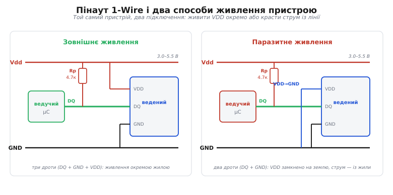

# 📋 Довідник 1-Wire: рівні, таймінги, команди

Це сторінка-контракт: усе, чим ведучий керує лінією 1-Wire і розмовляє з пристроєм — рівні на дроті, мікросекундні таймінги обох швидкостей і точні байти команд — зведено в таблиці, щоб тримати під рукою, а не вишукувати в даташиті. Числа звірено з двома першоджерелами Analog Devices / Maxim: таймінги ведучого — за прикладною нотаткою AN126 «1-Wire Communication Through Software», а вікна пристрою й набір команд — за даташитом давача температури DS18B20 (rev. 042208), узятим тут за наскрізний приклад.

<preknowlist>
- [Відкритий стік](root:hw-digital/open-drain-output) — вихід, що вміє лише притягувати лінію до нуля, а вгору не штовхає; на цьому тримається спільна жила 1-Wire.
- [Резистор-підтяжка](root:hw-digital/floating-pullups) — резистор до живлення, що тримає вільну лінію високою, поки її ніхто не тягне вниз.
- [CRC](root:com-modulation/crc) — контрольна сума, якою в 1-Wire захищено заводську адресу й прочитану пам'ять.
</preknowlist>

## Сигнали й рівні

Уся шина — це один сигнальний дріт DQ і спільна земля; живлення або йде окремою жилою, або його немає зовсім (паразитний режим). Рівень на лінії задають не напругою, а тим, хто її притискає до нуля.

| Сигнал | Роль |
| --- | --- |
| **DQ** | єдина двоспрямована сигнальна жила: дані, такт-як-час і (за паразиту) живлення |
| **GND** | спільна земля — обов'язковий зворотний провідник |
| **Vdd** | живлення 3.0–5.5 В: окремою жилою або, за паразиту, замкнене на GND |

Електрика лінії — прямий наслідок [відкритого стоку](root:hw-digital/open-drain-output):

- **Спокій = високий рівень.** Вільну лінію тримає вгорі єдина [підтяжка](root:hw-digital/floating-pullups) Rp ≈ 4.7 кОм до Vdd.
- **Активний рівень — низький.** Будь-який пристрій (чи ведучий) або притягує DQ до 0, або від'єднується; «1» силою не подає ніхто. Притиснув хоч один — на всій шині 0 (монтажне І).
- **Сильна підтяжка.** Для «голодних» операцій (конверсія, запис EEPROM) за паразиту ведучий на час замикає Vdd→DQ міцним ключем — не пізніше **tSPON = 10 мкс** після команди — і тримає весь час операції.
- **Ємність входу** пристрою ≈ 25 пФ; вона з підтяжкою задає час наростання лінії, а отже, стелю довжини й швидкості шини.


*Зліва — зовнішнє живлення: три дроти (DQ + GND + VDD до Vdd). Справа — паразитне: два дроти, ногу VDD пристрою замкнено на землю, і струм він краде з жили DQ, поки та висока. Підтяжка Rp ≈ 4.7 кОм спільна для обох.*

> ⚠️ За паразиту, якщо притиск скидання затягнути **понад 960 мкс**, внутрішній конденсатор пристрою може розрядитися так, що станеться скид живлення. Тому притиск скидання роблять близько 480 мкс, не довше.

## Таймінги ведучого: що подати на лінію

Кожну з чотирьох операцій ведучий будує з того самого руху — «притиснути / відпустити / зачекати». Затримки позначено літерами **A–J**; їхні значення (окремі для стандартної та форсованої швидкості) — у таблиці нижче.

| Операція | Послідовність кроків |
| --- | --- |
| **Запис «1»** | тягне ↓ на **A**, відпускає, чекає **B** |
| **Запис «0»** | тягне ↓ на **C**, відпускає, чекає **D** |
| **Читання** | тягне ↓ на **A**, відпускає, чекає **E**, знімає біт, чекає **F** |
| **Скидання** | чекає **G**, тягне ↓ на **H**, відпускає, чекає **I**, знімає присутність (0 = є пристрій), чекає **J** |

**Затримки A–J (мкс), рекомендація AN126** — надійний набір для більшості пристроїв і ліній:

| Літера | Що це | Стандарт | Overdrive |
| --- | --- | --- | --- |
| **A** | притиск для запису-«1» і для читання | 6 | 1.0 |
| **B** | пауза після запису-«1» (решта слота + відновлення) | 64 | 7.5 |
| **C** | притиск для запису-«0» | 60 | 7.5 |
| **D** | пауза після запису-«0» | 10 | 2.5 |
| **E** | пауза перед миттю вибірки читання | 9 | 1.0 |
| **F** | від вибірки до кінця слота | 55 | 7 |
| **G** | пауза перед скиданням | 0 | 2.5 |
| **H** | притиск скидання | 480 | 70 |
| **I** | пауза до вибірки присутності | 70 | 8.5 |
| **J** | відновлення після скидання | 410 | 40 |

Що з цих чисел випливає прямо:

```
слот (один біт)   = A+B = C+D = A+E+F = 70 мкс (стандарт) ≈ 8.5–10 мкс (overdrive)
мить вибірки читання  = A+E = 15 мкс від спаду (стандарт)
вибірка присутності   = через I = 70 мкс після відпускання лінії
повне скидання        = G+H+I+J ≈ 960 мкс (стандарт)
пропускна здатність   ≈ 1 біт / 70 мкс ≈ 14.3 кбіт/с (стандарт), ≈ 100 кбіт/с (overdrive)
```

*(Дрібна розбіжність у самій AN126: таблиця рекомендує для overdrive A = 1.0 і E = 1.0, а код-приклад тієї ж нотатки бере A = 1.5 і E = 0.75. Обидва варіанти влучають у вікна пристроїв; тут наведено значення з підсумкової таблиці.)*

## Вікна пристрою: у що треба влучити

Таблиця вище — це одна безпечна **точка**; даташит пристрою задає **вікно** навколо неї, у межах якого біт ще читається правильно. Ось вікна DS18B20:

| Символ | Параметр | Min | Max |
| --- | --- | --- | --- |
| **tSLOT** | тривалість слота (один біт) | 60 | 120 |
| **tREC** | відновлення між слотами | 1 | — |
| **tLOW1** | притиск ведучого для «1» | 1 | 15 |
| **tLOW0** | притиск ведучого для «0» | 60 | 120 |
| **tRDV** | коли ведучий має зняти біт читання | — | 15 |
| **tRSTL** | притиск скидання | 480 | — |
| **tRSTH** | висока після скидання | 480 | — |
| **tPDHIGH** | пауза від відпускання до присутності | 15 | 60 |
| **tPDLOW** | притиск присутності (робить пристрій) | 60 | 240 |
| **tSPON** | увімкнути сильну підтяжку не пізніше | — | 10 |

*(Усі числа — мікросекунди.)*

> 🔧 **Навіщо це.** Дві таблиці — не дублювання, а два боки контракту. Даташит пристрою каже **діапазон**: притиск для «1» має тривати 1–15 мкс (tLOW1), а біт читання зняти **не пізніше** 15 мкс (tRDV). AN126 обирає одну точку **всередині** кожного такого вікна, яка витримує ще й розкид ліній: притиск-«1» A = 6 мкс (у [1, 15]), вибірку читання на A+E = 15 мкс (край tRDV), притиск скидання H = 480 мкс (= tRSTL). Пишеш ведучого — цілься в точку AN126; налагоджуєш чужий чи довгу лінію — перевіряй, чи не вийшов за вікно даташита.

## Скидання і присутність

Будь-який сеанс починає ведучий довгим притиском, а пристрій відповідає власним — це і синхронізація, і перевірка «чи є хто на шині».

```
ведучий тягне ↓ ≥ 480 мкс          (tRSTL)         — «усім скинутись»
ведучий відпускає, лінія спливає вгору
пристрій мовчить 15–60 мкс          (tPDHIGH)
пристрій сам тягне ↓ 60–240 мкс     (tPDLOW)        — імпульс присутності «я тут»
ведучий знімає рівень через ≈ 70 мкс після відпускання (I):
   низько → пристрій є; високо → шина порожня
```

## ROM-команди: адресування

Перший байт після присутності задає, як цього разу адресувати шину. Це загальний набір 1-Wire; праворуч позначено, які з команд розуміє DS18B20.

| Команда | Байт | На шині | Дія | DS18B20 |
| --- | --- | --- | --- | --- |
| **Read ROM** | `0x33` | лише 1 | пристрій віддає свій 64-бітний ROM | ✓ |
| **Match ROM** | `0x55` | будь-скільки | + 8 байтів ROM; далі слухає лише збіг | ✓ |
| **Skip ROM** | `0xCC` | будь-скільки | адресу не називають — відповідають усі | ✓ |
| **Search ROM** | `0xF0` | будь-скільки | обхід дерева адрес: зібрати всі ROM | ✓ |
| **Alarm Search** | `0xEC` | будь-скільки | як Search, але лише пристрої зі зведеним прапорцем тривоги | ✓ |
| **Overdrive-Skip ROM** | `0x3C` | OD-здатні | Skip + перехід у форсований режим | — |
| **Overdrive-Match ROM** | `0x69` | OD-здатні | Match + перехід у форсований режим | — |
| **Resume** | `0xA5` | будь-скільки | знову вибрати останній Match/Search-пристрій без повторної адреси | — |

DS18B20 працює **лише на стандартній швидкості**, тож команд переходу в overdrive (`0x3C`, `0x69`) і `Resume` не має — вони належать форсованим пристроям (наприклад, DS2408, ключам DS1990A). Байт `0x33` — це Read ROM; не плутати з роздільністю. *(Статус звірки: `0x3C` підтверджено кодом AN126; `0x69` — усталене значення Overdrive-Match у документації 1-Wire.)*

## Функційні команди DS18B20

Після адресування йде вже конкретна дія обраного пристрою. Це набір саме DS18B20 — в іншого чипа він свій, шукати в його даташиті.

| Команда | Байт | Дія | Що далі |
| --- | --- | --- | --- |
| **Convert T** | `0x44` | почати вимір температури | слоти читання: 0 = рахує, 1 = готово; за паразиту — сильна підтяжка на весь tCONV |
| **Read Scratchpad** | `0xBE` | віддати 9 байтів пам'яті | читати 9 байтів (можна урвати достроково скиданням) |
| **Write Scratchpad** | `0x4E` | записати TH, TL, конфіг | надіслати **рівно 3 байти** (у байти 2, 3, 4) |
| **Copy Scratchpad** | `0x48` | TH, TL, конфіг → [EEPROM](root:hw-components/eeprom) | tWR ≈ 10 мс; за паразиту — сильна підтяжка |
| **Recall E²** | `0xB8` | EEPROM → scratchpad | слоти читання: 0 = триває, 1 = готово |
| **Read Power Supply** | `0xB4` | спитати режим живлення | слот читання: 0 = паразит, 1 = зовнішнє |

## Пам'ять DS18B20: scratchpad і роздільність

Команда `0xBE` віддає 9 байтів по черзі, молодшим уперед. Останній — [CRC](root:com-modulation/crc) решти восьми: ведучий рахує його сам і звіряє, щоб не взяти на віру спотворене число.

| Байт | Вміст |
| --- | --- |
| **0** | Температура, молодший байт (LSB) |
| **1** | Температура, старший байт (MSB) |
| **2** | TH / користувацький байт 1 |
| **3** | TL / користувацький байт 2 |
| **4** | Регістр конфігурації (роздільність) |
| **5** | Резерв |
| **6** | Резерв |
| **7** | Резерв |
| **8** | CRC байтів 0–7 |

Байт 4 — регістр конфігурації виду `0 R1 R0 1 1 1 1 1`; біти **R1 R0** задають роздільність, а з нею — час конверсії:

| R1 R0 | Роздільність | Крок | tCONV (max) |
| --- | --- | --- | --- |
| `00` | 9 біт | 0.5 °C | 93.75 мс |
| `01` | 10 біт | 0.25 °C | 187.5 мс |
| `10` | 11 біт | 0.125 °C | 375 мс |
| `11` | 12 біт | 0.0625 °C | 750 мс |

Температура — 16-бітне число в доповняльному коді, з ціною молодшого біта **1/16 °C** (на 12 бітах). Розшифрувати два байти означає скласти їх у знакове ціле й поділити на 16:

**Приклад: розшифрувати два байти температури.**

```
scratchpad[0] = 0x91   (LSB)
scratchpad[1] = 0x01   (MSB)
raw = (0x01 << 8) | 0x91 = 0x0191 = 401
T   = 401 / 16 = +25.0625 °C

від'ємна:
scratchpad[1:0] = 0xFF5E  як int16 = 0xFF5E − 0x10000 = −162
T   = −162 / 16 = −10.125 °C
```

У коді це рівно один зсув, одне «або» і ділення — знаковий тип робить доповняльний код сам:

```c
int16_t raw = ((int16_t)scratch[1] << 8) | scratch[0];
float   t_celsius = raw / 16.0f;   // 12 біт: 1 молодший біт = 1/16 °C
```

## Мінімальний обмін: прочитати температуру

Найкоротший робочий сеанс, коли на шині кілька давачів і треба адресувати один конкретний. Вимір довгий, тож усе розбито на дві транзакції: «почни» і, перегодя, «віддай».

**Умова: адресоване (Match ROM) читання температури з одного DS18B20.**

```
[Reset] → Presence            початок сеансу, пристрій озвався
0x55  Match ROM               + 8 байтів 64-бітного ROM потрібного давача
0x44  Convert T               запустити вимір
    ... чекати tCONV (≤ 750 мс на 12 біт); за паразиту — сильна
        підтяжка ввімкнена не пізніше tSPON = 10 мкс після 0x44

[Reset] → Presence            нове скидання
0x55  Match ROM               + ті самі 8 байтів ROM
0xBE  Read Scratchpad
    читати 9 байтів: [0..1] — температура, [8] — CRC байтів 0–7
    T = int16(byte1:byte0) / 16.0  °C
```

Якщо давач на шині один — замість `0x55` і восьми байтів ROM ставлять `0xCC` (Skip ROM): диктувати адресу нема кому. Кістяк лишається той самий: **скидання → адресування → дія**, а точні числа таймінгів і байти команд — у таблицях вище.
