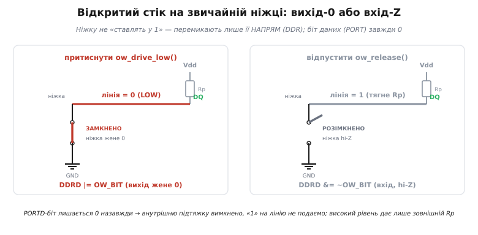
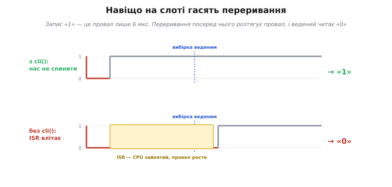

# 🔌 Ведучий 1-Wire на голій ніжці: біт-бенг у C

Ведучого 1-Wire не конче купувати окремою мікросхемою — його можна викласти з однієї цифрової ніжки, кількох точних затримок і жорсткого правила «не дай себе перервати». Нижче розгорнуто робочий C-код такого програмного ведучого для мікроконтролера: чотири базові операції — скидання, запис біта, читання біта — і байти поверх них. Приклад орієнтовано на ATmega328P (Arduino Uno, 16 МГц), але вся логіка переноситься на будь-який МК зі звичайним GPIO.

Чому саме «біт-бенг» (англ. *bit-banging* — «вибивання бітів» руками процесора): у 1-Wire немає окремого дроту такту, тож увесь ритм ведучий відлічує сам, мікросекундними паузами. Отже, весь драйвер — це два вміння: **перемикати ніжку між двома станами** і **точно відмірювати час** між перемиканнями.

## Уся шина — це дві дії над однією ніжкою

На спільній жилі 1-Wire ніхто не подає «1» силою: пристрій або **притискає** лінію до нуля, або **відпускає** її, і тоді високий рівень дає зовнішній резистор-підтяжка. Це дисципліна [відкритого стоку](topic:hw-digital/open-drain-output), і програмний ведучий мусить її дотримуватися так само, як залізний. Тобто в коді потрібні рівно два рухи: «притиснути вниз» і «відпустити в hi-Z». Ніякого «вивести одиницю».

На AVR це виходить елегантно — грою з реєстром напряму. У кожної ніжки є три реєстри: `DDRx` (напрям: вихід чи вхід), `PORTx` (що виводити або чи ввімкнена внутрішня підтяжка) і `PINx` (реальний рівень на ніжці). Хитрість: **біт у `PORTx` тримаємо в нулі назавжди**, а перемикаємо лише напрям:

```c
#include <avr/io.h>
#include <avr/interrupt.h>
#include <util/delay.h>          // _delay_us — цикл-точні паузи при F_CPU

#define OW_BIT   (1 << PD2)      // жила висить на ніжці PD2 (цифровий 2 на Uno)

// PORTD-біт завжди 0: як вихід ніжка дає нуль; як вхід — просто відпущена (hi-Z).
static inline void    ow_drive_low(void) { DDRD |=  OW_BIT; }  // вихід-0 → притиснули
static inline void    ow_release(void)   { DDRD &= ~OW_BIT; }  // вхід-Z  → відпустили
static inline uint8_t ow_sample(void)    { return (PIND & OW_BIT) ? 1 : 0; }

void ow_init(void) {
    PORTD &= ~OW_BIT;   // ніколи не подаємо «1»: біт даних лишається 0
    DDRD  &= ~OW_BIT;   // старт як вхід — лінія відпущена, її тримає підтяжка Rp
}
```

Чому це справді відкритий стік. Коли `DDR`-біт = 1 (вихід), а `PORT`-біт = 0, ніжка **жене нуль** — це наше «притиснути». Коли `DDR`-біт = 0 (вхід), а `PORT`-біт теж 0, внутрішня підтяжка вимкнена, і ніжка стає **високоомним входом**: вона нікуди не тягне, а лінію догори підіймає зовнішній Rp. Виходить точно «притиснути / відпустити», і жодного стану, у якому ніжка подавала б плюс на жилу.


*Притиснути = ніжку у вихід (DDR=1), і оскільки PORT=0, вона жене нуль. Відпустити = ніжку у вхід (DDR=0), hi-Z, і лінію підіймає лише зовнішній Rp. PORT-біт незмінно 0, тож «1» силою на жилу не потрапляє ніколи.*

## Годинник із порожніх циклів

Другий інструмент — точна затримка на мікросекунди. Тут криється пастка, у яку легко впасти: **не можна відмірювати час порожнім циклом `for`**. Оптимізатор бачить цикл, що нічого не робить, і викидає його геть — затримка зникає. Щоб цикл вижив, лічильник довелося б оголосити [`volatile`](topic:sf-lang/volatile), але вгадати кількість ітерацій під конкретну частоту важко, і при перекомпіляції все попливе.

Правильно — узяти цикл-точну затримку, яку дає компілятор. На AVR це `_delay_us()` з `<util/delay.h>`: знаючи `F_CPU`, вона розгортається в точно відраховану низку тактів. Одна умова — **аргумент має бути сталою часу компіляції**; змінна сюди затягне повільну арифметику з рухомою комою й зіпсує точність. Саме тому в коді нижче кожна пауза — окреме число, а не параметр.

## Таймінги — з таблиці, не зі стелі

Значення пауз не вигадують: вони прямо взяті зі стандарту — фірмової довідки Maxim (нині Analog Devices) *Application Note 126, «1-Wire Communication Through Software»*. Там усі паузи позначено літерами A…J (у мкс, стандартна швидкість):

```c
// таймінги 1-Wire, стандартна швидкість (Maxim AN126, мкс)
#define OW_A   6     // провал запису-«1» / стартовий провал читання
#define OW_B  64     //   відновлення після запису-«1»
#define OW_C  60     // провал запису-«0» (майже весь слот)
#define OW_D  10     //   відновлення після запису-«0»
#define OW_E   9     // від відпускання до миті вибірки читання
#define OW_F  55     //   добити слот читання
#define OW_H 480     // скидання: довгий провал
#define OW_I  70     //   від відпускання до вибірки присутності
#define OW_J 410     //   добити вікно скидання
```

Одне число варто витлумачити окремо. Ведений під час читання визначається дуже рано, тож ведучий знімає рівень на **A + E = 6 + 9 = 15-й мікросекунді** від спаду — поки слабенька підтяжка ще не встигла підняти лінію назад. Проґавиш це вікно — прочитаєш сміття.

## Чотири форми в часі

Тепер із двох рухів і затримок складаються самі слоти. Запис — це «притиснути на скільки треба, відпустити, добити слот»; різниця «1» від «0» лише в довжині провалу:

```c
void ow_write_bit(uint8_t bit) {
    uint8_t sreg = SREG;      // 1) запам'ятати стан переривань
    cli();                    // 2) критична ділянка — нас не можна спиняти
    if (bit) {                //    запис «1»: короткий провал
        ow_drive_low();
        _delay_us(OW_A);      //    6 мкс низько
        ow_release();
        SREG = sreg;          // 3) відновити переривання
        _delay_us(OW_B);      //    відновлення — тут переривання вже не завадять
    } else {                  //    запис «0»: тримаємо майже весь слот
        ow_drive_low();
        _delay_us(OW_C);      //    60 мкс низько
        ow_release();
        SREG = sreg;
        _delay_us(OW_D);
    }
}
```

Читання — той самий стартовий спад, але після відпускання слово за веденим, і ведучий лише підглядає рівень у 15-у мікросекунду:

```c
uint8_t ow_read_bit(void) {
    uint8_t sreg = SREG;
    cli();
    ow_drive_low();
    _delay_us(OW_A);          // стартовий спад — 6 мкс
    ow_release();             // відпускаємо: далі говорить ведений
    _delay_us(OW_E);          // чекаємо до вікна вибірки (разом 15 мкс від спаду)
    uint8_t bit = ow_sample();// знімаємо рівень: висока = «1», низька = «0»
    SREG = sreg;
    _delay_us(OW_F);          // добиваємо слот
    return bit;
}
```

## Скидання й присутність

Кожну розмову відкриває пара «скидання → присутність»: ведучий тримає лінію низько надовго, відпускає й дивиться, чи хтось у відповідь сам притисне жилу. Ті самі рухи, тільки довші:

```c
// повертає 1, якщо на шині озвався хоч один пристрій, інакше 0
uint8_t ow_reset(void) {
    uint8_t sreg = SREG;
    ow_release();             // хай лінія спокійно висока
    cli();
    ow_drive_low();
    _delay_us(OW_H);          // 480 мкс низько — «усім скинутись»
    ow_release();
    _delay_us(OW_I);          // 70 мкс — і дивимось на імпульс присутності
    uint8_t present = (ow_sample() == 0);  // 0 на лінії = хтось притиснув = є пристрій
    SREG = sreg;
    _delay_us(OW_J);          // добиваємо вікно скидання
    return present;
}
```

## Критична ділянка: чому `cli()`

Тепер — про `cli()` й `SREG`, що обрамляють кожен слот, бо це серце надійності всього драйвера. Носій біта тут — **час**, а не рівень. Запис «1» — це провал завдовжки лише 6 мкс. Що станеться, коли рівно посеред цього провалу спрацює [переривання](topic:hw-arch/interrupts) — таймер, UART, будь-що — і процесор на 20–30 мкс піде його обслуговувати?

Провал **розтягнеться**. Замість піднятися на 6-й мікросекунді, лінія лишиться низькою, поки ISR не поверне керування. А ведений тим часом зніме рівень у своє вікно — і побачить не короткий провал «1», а довгий провал «0». **Біт перевернувся**, і ведучий про це навіть не дізнається.


*Угорі: з `cli()` провал триває рівно 6 мкс, у мить вибірки лінія вже висока — ведений читає «1». Унизу: без заборони переривань ISR влітає в провал, той росте за мить вибірки, і той самий слот прочитується як «0».*

Тому на час критичних мікросекунд драйвер **забороняє переривання**. Зверни увагу на ідіому збереження стану: не просто `cli()` … `sei()`, а `sreg = SREG; cli(); … SREG = sreg;`. Різниця важлива: якщо в місці виклику переривання вже були вимкнені, грубий `sei()` увімкнув би їх передчасно й поламав щось у зовнішньому коді. Збереження й відновлення `SREG` повертає рівно той стан, що був, — типова обережність під час роботи з [критичними ділянками](topic:sf-tasks/critical-sections).

> 🔧 **Навіщо це.** Оце й є та сама причина, чому 1-Wire «не терпить, коли ведучого смикають». Кожен слот — крихітна ділянка реального часу, де мікроконтролер мусить бути єдиновладним господарем шини. Заборонивши переривання, ти гарантуєш, що між `ow_drive_low()` і `ow_release()` не встрягне ніщо. Ціна — на ці мікросекунди система глуха до всього іншого; тому слоти й тримають короткими, а важкі переривання виносять за межі обміну.

## Байти поверх бітів

Байтові операції — це просто вісім викликів бітових. Один нюанс: у 1-Wire байт іде **молодшим бітом уперед**, тож і складати, і розбирати треба з молодшого кінця:

```c
void ow_write_byte(uint8_t b) {
    for (uint8_t i = 0; i < 8; i++) {
        ow_write_bit(b & 1);           // молодший біт — перший на дроті
        b >>= 1;
    }
}

uint8_t ow_read_byte(void) {
    uint8_t b = 0;
    for (uint8_t i = 0; i < 8; i++) {
        b >>= 1;                       // звільняємо старший розряд
        if (ow_read_bit()) b |= 0x80;  // прочитаний біт лягає згори…
    }
    return b;                          // …і за 8 зсувів перший біт опиниться в bit0
}
```

Цих п'яти функцій уже досить для справжньої розмови. Ось повний цикл читання температури з давача DS18B20 — «запусти вимір», зачекай, «забери результат»:

```c
ow_reset();
ow_write_byte(0xCC);      // Skip ROM — він на шині один, адресу не диктуємо
ow_write_byte(0x44);      // Convert T — «зміряй температуру»
_delay_ms(750);           // чекаємо, поки чіп рахує (12 біт ≈ 750 мс)

ow_reset();
ow_write_byte(0xCC);      // Skip ROM
ow_write_byte(0xBE);      // Read Scratchpad — «віддай пам'ять із результатом»
uint8_t lo = ow_read_byte();
uint8_t hi = ow_read_byte();
int16_t raw = ((int16_t)hi << 8) | lo;
float celsius = raw / 16.0f;   // у DS18B20 молодший біт = 1/16 °C
```

## Складність і підводні камені

Обчислювальної складності тут як такої нема — усі операції за сталий час; «складність» драйвера ховається в реальному часі й у крихкості таймінгу.

**Швидкість наперед відома.** Слот ≈ 61 мкс, тож байт іде ≈ 490 мкс, а пара «скидання + присутність» — близько 1 мс на кожну транзакцію. Стеля — ≈ 16 кбіт/с: 1-Wire не про потік даних, а про дрібні порції.

**Заборона переривань — теж ціна.** Поки триває `ow_reset()`, переривання вимкнені майже пів мілісекунди (`OW_H` = 480 мкс). Для чутливих до затримок систем це помітно. Тонший підхід — гасити переривання не на весь провал скидання (розтягнутий довгий провал нешкідливий, він і так довгий), а лише навколо **вибірки** присутності; так роблять зрілі бібліотеки. У записі-«0» те саме: розтягнутий довгий провал лишається «0». Тож найпотрібніший захист — саме короткому провалу запису-«1» та миті вибірки читання.

**Затримка на busy-wait марнує процесор.** `_delay_us` — це порожнє крутіння тактів. Там, де кожен такт на рахунку, паузи перекладають на [апаратний таймер](topic:hw-arch/timer-counter): він відлічує мікросекунди сам, а процесор тим часом працює. Складніше, зате не з'їдає весь час ядра на кожен біт.

**Таймінг калібрують під плату.** Код вище припускає `F_CPU` = 16 МГц; на іншій частоті `_delay_us` перерахується сам, але при зміні ніжки чи порту треба виправити `DDR`/`PORT`/`PIN`. І пам'ятай про фізику лінії: довгий шлейф із великою ємністю підіймається повільно, тож задовгий дріт або зависокий Rp можуть з'їсти запас у вікні вибірки.

**Форсований режим — ще жорсткіше.** Якщо чіп це вміє, ті самі слоти вкорочують у рази (у AN126 стандартні 6/64/60 мкс стають 1/7.5/7.5 мкс), і швидкість підскакує до ~125 кбіт/с. Але вікна робляться такими вузькими, що навіть накладні витрати на виклик функції починають важити — тоді біт-бенг доводять асемблерними вставками або віддають окремому апаратному ведучому-мосту, який бере точний час на себе.
