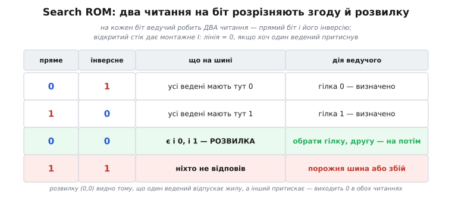
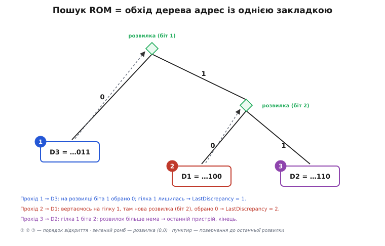

# 🌳 Пошук ROM: як знайти всіх на шині, не знаючи нікого

Ведучий підходить до незнайомої 1-Wire-шини й мусить дізнатися 64-бітні заводські адреси всіх пристроїв на ній — не знаючи наперед ані скількох їх, ані яких. Команда **Search ROM** (0xF0) робить саме це: за кілька повних проходів витягує кожну адресу поіменно, обходячи двійкове дерево можливих адрес. Розберімо, як вона влаштована й чому взагалі працює.

## Чому «хай усі скажуть адресу» не працює — і чому це навіть добре

Найпростіша думка: подати команду «всі, вишліть свої 64 біти» — і слухати. На спільній жилі з відкритим стоком вона провалюється. Пригадаймо фізику лінії: кожен ведений уміє лише притягувати жилу до нуля або відпускати її, а вгору тягне єдина підтяжка. Тому коли двоє відповідають одночасно, лінія показує не «обидві відповіді», а їхнє **монтажне І**: нуль, якщо хоч хтось притиснув. Один пристрій має в цьому біті 0, другий — 1 → ведучий бачить 0. Відповіді змішуються в кашу.

Але змішуються вони **передбачувано** — і саме це важіль. З монтажного І випливає: якщо попросити всіх вислати один-єдиний біт адреси, результат каже не про конкретного веденого, а про **всю компанію разом** — «чи є серед вас бодай один із нулем тут». Це вже не шум, а корисне питання до цілої групи.

## Два читання на біт: згода чи розвилка

Одного читання замало: 0 на лінії означає «хтось має 0», але не каже, чи є заразом і ті, хто має 1. Тому Search ROM на **кожному** біті робить **два** читання підряд:

- перше — **прямий** біт: усі ведені надсилають своє значення цього біта; лінія = І усіх значень;
- друге — **інверсний** біт: усі надсилають доповнення свого значення; лінія = І усіх доповнень.

Пара з двох прочитаних бітів однозначно розкладає ситуацію на чотири випадки.


*На кожен біт — два читання. (0,1) і (1,0) — усі ведені згодні, гілку задано самим бітом. (0,0) — розвилка: серед ведених є і нулі, і одиниці. (1,1) неможлива, поки хтось на шині є, тож означає порожню лінію або збій.*

Ключовий рядок — **(0, 0)**. Прямий = 0 означає «є хтось із нулем»; інверсний = 0 означає «є хтось із одиницею». Разом: у цьому біті серед ведених є **і** нулі, **і** одиниці — це **розвилка**. А пара (1, 1) не трапляється, поки на шині хтось є (не буває, щоб не було ні нулів, ні одиниць), тож вона однозначно сигналить «шина порожня» чи збій зв'язку.

## Розвилка, вибір гілки — і як зайві замовкають

Розвилка — це мить вибору. Ведучий **записує** один біт-напрям (0 або 1). І тут спрацьовує друга половина протоколу: **кожен ведений, чий біт не збігся із записаним, замовкає** до наступного скидання. Тобто запис біта — не просто позначка в пам'яті ведучого, а **відсів**: після нього в розмові лишаються тільки ті, чия адреса продовжується вже обраним префіксом.

Звідси вся картина. 64 біти адреси — це шлях завглибшки 64 у **двійковому дереві**: на кожному рівні гілка «0» або гілка «1». Пристрої — листки цього дерева. На кожному кроці ведучий питає «0, 1 чи обидва?» (два читання) і, коли обидва, обирає гілку (запис), відсікаючи все, що не в ній. Пройшовши всі 64 рівні, він опиняється рівно на одному листку — і в буфері лежить одна повна, справжня адреса. **Один прохід дерева = один знайдений пристрій.**

## Як дістати решту: одна закладка на все дерево

Лишилось зібрати інших. Наївно — тримати стек невідвіданих гілок; але дерево завглибшки 64, пристроїв можуть бути десятки, і на дрібному мікроконтролері шкода і пам'яті, і мороки. Хитрість Search ROM у тому, що стек **не потрібен**: досить **однієї** змінної — `LastDiscrepancy`, номера **найглибшої розвилки, де ведучий пішов у 0, а гілка 1 лишилась незвіданою**.

Правило обходу на кожній розвилці:

- розвилка **глибша** за LastDiscrepancy (номер більший) → іди в **0**, а її номер запам'ятай як «тут ще висить незвідана гілка 1»;
- розвилка **рівно на** LastDiscrepancy → цього разу йди в **1** (минулого разу тут ходив у 0);
- розвилка **мілкіша** за LastDiscrepancy → повтори **той самий** вибір, що й торік (біт із попередньо знайденої адреси).

Наприкінці проходу LastDiscrepancy стає номером **останньої** розвилки, де цього разу обрали 0. Наступний прохід повторює шлях до неї, там звертає в 1 — і досліджує піддерево, якого ще не бачив. А коли черговий прохід не лишив жодної «нульової» розвилки (LastDiscrepancy = 0), звідана вся крона: це був останній пристрій.

По суті, це **обхід дерева в глибину** з єдиною закладкою замість стека. Дерево аж до 2⁶⁴ листків обходиться в сталій пам'яті.


*Три пристрої на трьох показаних бітах. Прохід 1 на розвилці біта 1 звертає в 0 і доходить до D3; закладка стає на цю розвилку. Прохід 2 повторює шлях, звертає в 1, натрапляє на нову розвилку (біт 2), знову бере 0 → D1. Прохід 3 бере на ній 1 → D2; розвилок більше нема — це останній.*

## Робочий код

Пошук стоїть на трьох елементарних операціях нижнього шару — скиданні, записі й читанні одного біта; [їх дає біт-бенг-драйвер ведучого](topic:com-devices/one-wire/proj-bitbang-master.md), що точним таймінгом розгойдує жилу. Тут вони — чорні скриньки:

```c
#include <stdint.h>
#include <stdbool.h>

/* Нижній шар (біт-бенг ведучого) — реалізовано окремо:
   OWReset()      : скидання; true, якщо був імпульс присутності (шина не порожня)
   OWWriteByte(b) : записати байт, молодшим бітом уперед
   OWWriteBit(b)  : записати один біт
   OWReadBit()    : прочитати один біт (монтажне І шини)                     */
bool    OWReset(void);
void    OWWriteByte(uint8_t b);
void    OWWriteBit(uint8_t bit);
uint8_t OWReadBit(void);
```

Стан пошуку живе **між** викликами — це і є та закладка, що дає обійтися без стека:

```c
uint8_t ROM_NO[8];                 /* адреса, що будується цим проходом      */
static int  LastDiscrepancy;       /* найглибша неопрацьована розвилка (1..64)*/
static int  LastFamilyDiscrepancy; /* те саме в межах першого байта (родини)  */
static bool LastDeviceFlag;        /* останній пристрій уже знайдено          */
static uint8_t crc8;               /* накопичувальний залишок CRC             */

/* Команда пошуку: 0xF0 — усі пристрої; 0xEC — лише зі зведеною тривогою */
uint8_t OWSearchCommand = 0xF0;

/* CRC-8/Dallas, поліном X⁸+X⁵+X⁴+1 (віддзеркалений — 0x8C), накопичувальний */
static uint8_t docrc8(uint8_t value)
{
    crc8 ^= value;
    for (int i = 0; i < 8; i++)
        crc8 = (crc8 & 1) ? (crc8 >> 1) ^ 0x8C : (crc8 >> 1);
    return crc8;
}
```

Серце — один прохід дерева. Він або кладе наступну адресу в `ROM_NO`, або каже «більше нікого»:

```c
bool OWSearch(void)
{
    int id_bit_number   = 1;       /* 1..64 — котрий біт адреси зараз          */
    int last_zero       = 0;       /* де цього проходу обрали 0 на розвилці    */
    int rom_byte_number = 0;
    uint8_t rom_byte_mask = 1;
    bool search_result  = false;
    crc8 = 0;

    if (!LastDeviceFlag) {
        if (!OWReset()) {                     /* немає присутності — шина порожня */
            LastDiscrepancy = 0;
            LastDeviceFlag = false;
            LastFamilyDiscrepancy = 0;
            return false;
        }
        OWWriteByte(OWSearchCommand);         /* 0xF0 (або 0xEC для тривоги) */

        do {
            uint8_t id_bit     = OWReadBit(); /* прямий біт   */
            uint8_t cmp_id_bit = OWReadBit(); /* інверсний біт */

            if (id_bit && cmp_id_bit)         /* (1,1) — ніхто не відповів */
                break;                         /* прохід зіпсовано, вийти   */

            uint8_t search_direction;
            if (id_bit != cmp_id_bit) {
                /* (0,1) або (1,0) — усі згодні: гілку задає сам біт */
                search_direction = id_bit;
            } else {
                /* (0,0) — розвилка: є і 0, і 1, обираємо напрям */
                if (id_bit_number < LastDiscrepancy)
                    /* мілкіше за закладку — повторюємо торішній вибір */
                    search_direction = (ROM_NO[rom_byte_number] & rom_byte_mask) ? 1 : 0;
                else
                    /* на самій закладці — тепер 1; глибше за неї — 0 */
                    search_direction = (id_bit_number == LastDiscrepancy) ? 1 : 0;

                if (search_direction == 0) {
                    last_zero = id_bit_number;         /* тут лишилась гілка 1 на потім */
                    if (last_zero < 9)
                        LastFamilyDiscrepancy = last_zero;
                }
            }

            /* записати обраний біт у ROM_NO ... */
            if (search_direction)
                ROM_NO[rom_byte_number] |=  rom_byte_mask;
            else
                ROM_NO[rom_byte_number] &= ~rom_byte_mask;

            /* ... і оголосити його шині: невідповідні ведені замовкають */
            OWWriteBit(search_direction);

            id_bit_number++;
            rom_byte_mask <<= 1;
            if (rom_byte_mask == 0) {                  /* байт зібрано цілком */
                docrc8(ROM_NO[rom_byte_number]);       /* накопичити CRC     */
                rom_byte_number++;
                rom_byte_mask = 1;
            }
        } while (rom_byte_number < 8);                 /* усі 64 біти */

        /* успіх лише якщо пройшли всі 64 біти і CRC зійшовся (залишок 0) */
        if (id_bit_number >= 65 && crc8 == 0) {
            LastDiscrepancy = last_zero;
            if (LastDiscrepancy == 0)
                LastDeviceFlag = true;                 /* глибших розвилок нема — останній */
            search_result = true;
        }
    }

    if (!search_result || ROM_NO[0] == 0) {            /* нічого не знайшли — скинути стан */
        LastDiscrepancy = 0;
        LastDeviceFlag = false;
        LastFamilyDiscrepancy = 0;
        search_result = false;
    }
    return search_result;
}
```

Обгортки «перший» і «наступний» та драйвер-перелік усієї шини:

```c
bool OWFirst(void)                 /* почати пошук спочатку */
{
    LastDiscrepancy = 0;
    LastDeviceFlag = false;
    LastFamilyDiscrepancy = 0;
    return OWSearch();
}

bool OWNext(void)                  /* наступний пристрій; стан лишається від минулого */
{
    return OWSearch();
}

/* Перелічити все, що висить на шині. Повертає кількість знайдених. */
int OWEnumerate(uint8_t addr[][8], int max)
{
    int count = 0;
    for (bool ok = OWFirst(); ok && count < max; ok = OWNext()) {
        /* CRC кожної адреси вже перевірено всередині OWSearch */
        for (int i = 0; i < 8; i++)
            addr[count][i] = ROM_NO[i];   /* зберегти: ROM_NO наступний прохід перепише */
        count++;
    }
    return count;                          /* 0 — шина порожня */
}
```

## Складність, пастки й пошук за тривогою

**Скільки це коштує.** Кожен прохід знаходить рівно один пристрій, тож для *n* пристроїв потрібно *n* проходів (плюс один короткий фінальний виклик, що не чіпає шину). Пам'яті — стало: близько 16 байтів стану, без стека й рекурсії, хоч дерево й має до 2⁶⁴ листків.

**Оцінка: скільки триває перелік десяти давачів.**

```
один прохід = 1 скидання + 64 біти × (2 читання + 1 запис)
            = 1 скидання + 192 часових слоти
скидання + присутність  ≈ 1 мс
192 слоти × 61 мкс       ≈ 11.7 мс
один прохід              ≈ 12.7 мс      (= один знайдений пристрій)
10 пристроїв ≈ 10 × 12.7 ≈ 127 мс
```

Час лінійний до кількості пристроїв, а не до простору адрес — у цьому вся суть обходу дерева проти сліпого перебору 2⁶⁴.

**Пастки.**

- **CRC кожної адреси — не пропускати.** Восьмий байт ROM — це CRC перших семи, тож `crc8` по всіх восьми байтах правильної адреси дає нуль; ця перевірка вбудована в успіх проходу. Спіймала жила заваду посеред обходу — залишок не зійдеться, `OWSearch` поверне false, перелік перезапускають. Прибереш перевірку — дістанеш «привида»: адресу, якої на шині немає.
- **(1,1) посеред проходу.** Обидва читання = 1 означає, що на поточному префіксі не лишилось нікого: пристрій фізично відпав або жила зловила шум. Прохід уривається, недобудована адреса не проходить перевірку довжини й CRC — його просто повторюють.
- **Порожня шина.** Немає імпульсу присутності — `OWReset()` = false, перший же `OWFirst()` повертає false, перелік порожній. Це нормальний стан, а не помилка.
- **Крихкий таймінг — помножений.** Один пристрій — це майже дві сотні критичних слотів, і кожен вимагає точних мікросекунд. На завантаженому МК критичні ділянки роблять із забороною переривань — інакше випадкова затримка перевертає біт посеред обходу й ламає адресу (її, щоправда, спіймає CRC, але прохід доведеться повторити).
- **`ROM_NO` перезаписується.** Кожен прохід кладе в `ROM_NO` нову адресу поверх старої. Хочеш зберегти знайдені — копіюй усі 8 байтів у свій масив одразу в тілі циклу (як у `OWEnumerate` вище).

**Пошук за тривогою (0xEC).** Той самий обхід дерева, лише команда інша — Alarm Search (0xEC замість 0xF0), і відповідають **тільки** ведені зі зведеним прапорцем тривоги. Наприклад, [давач температури DS18B20](topic:cat-hw-sensors/ds18b20) зводить цей прапорець, коли температура вийшла за наперед задані пороги. На шині з десятків давачів це дає дешевий трюк: замість опитувати всіх і читати кожну температуру, ведучий одним пошуком 0xEC дістає адреси **лише тих**, кому є про що доповісти. У коді досить перед `OWFirst()` виставити `OWSearchCommand = 0xEC`.

> 🔧 **Навіщо це.** Search ROM — те, що робить 1-Wire шиною «встромив і працює». Не треба ні наперед знати, що підключено, ні призначати адреси: ведучий сам перелічує все, що висить на жилі, за час, лінійний до кількості пристроїв, і в кількох байтах пам'яті. Той самий обхід із командою 0xEC перетворюється на «опитати лише тих, у кого спрацювала тривога» — основу економних мереж давачів, де більшість часу доповідати нема кому.
