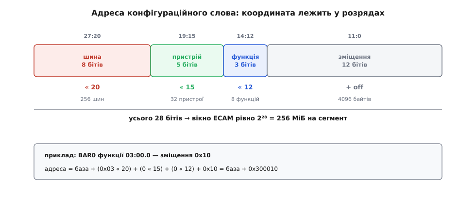
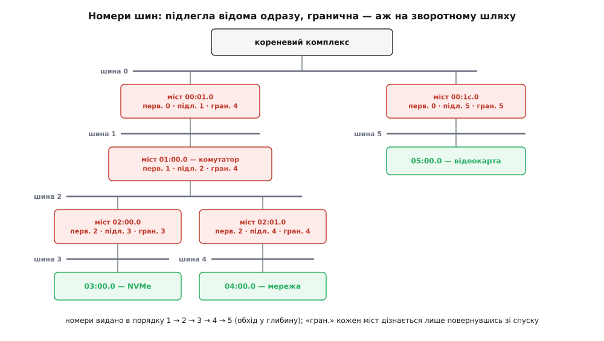

# ⚙️ Перелічування пристроїв PCIe: код, що складає карту машини

`lspci` друкує три десятки рядків — відеокарта, диск, мережа, мости між ними, — і жоден із цих рядків не лежить готовим ані в прошивці, ані в ядрі: їх щоразу складають наново, маючи в руках один-єдиний примітив «прочитай чотири байти конфігураційного простору отут». Тут написано і цей примітив, і весь обхід поверх нього: як із однієї фізичної адреси вирости до повного списку функцій з їхніми ідентифікаторами, класами й розібраними вікнами пам'яті.

## Задача

На вході — одне число: фізична адреса вікна конфігураційного простору. І одна аксіома: шина номер нуль існує завжди, бо це шина самого кореневого комплексу, і з неї починається все.

На виході — таблиця. Для кожної наявної функції: її координата «шина:пристрій.функція», ідентифікатори виробника й пристрою, код класу (щоб знати, що воно взагалі таке), а далі — перелік блоків фізичного адресного простору, які функція просить собі, з розмірами й властивостями кожного.

Обмеження при цьому суворе, і саме воно робить задачу цікавою: код не знає **жодного конкретного пристрою**. Ані таблиці відомих ідентифікаторів, ані драйверів, ані опису плати від виробника. Спитати в заліза можна рівно одне — «що лежить за такою-то координатою», — і все інше доводиться виводити з відповідей на це питання.

## Вікно, крізь яке видно всіх

Конфігураційний простір функції — 4 КіБ, тобто 4096 байтів, і система бачить їх як звичайну пам'ять: кореневий комплекс відкриває вікно у фізичному адресному просторі процесора, де ці 4 КБ кожної функції розкладені підряд. Механізм так і зветься — ECAM (англ. Enhanced Configuration Access Mechanism, розширений спосіб доступу до конфігурації). Процесор виконує звичайне читання з пам'яті, а кореневий комплекс перекладає його на конфігураційний пакет до потрібної функції й чекає відповіді. Для програми це [відображення в пам'ять](root:hw-arch/memory-mapped-io) у чистому вигляді.

Адреса всередині вікна складається з координати. Ось звідки беруться саме такі зсуви:

```
4 КіБ на функцію      → 12 бітів на зміщення всередині простору
8 функцій на пристрій →  3 біти  → зсув функції  = 12
32 пристрої на шину   →  5 бітів → зсув пристрою = 12+3  = 15
256 шин на сегмент    →  8 бітів → зсув шини     = 15+5  = 20
                        ─────────
                        28 бітів → вікно = 2²⁸ = 256 МіБ

адреса = база + (шина << 20) + (пристрій << 15) + (функція << 12) + зміщення
```

Це не домовленість про «зручні» числа — це просто розрядності, вкладені одна в одну й склеєні в одне слово. Тому вікно ECAM на сегмент — завжди рівно 256 МіБ: іншим воно вийти й не могло.


*Координата «шина-пристрій-функція» лежить прямо в розрядах адреси: розрядності 256 · 32 · 8 · 4096 склеєні підряд і дають рівно 28 бітів, тобто 256 МіБ вікна на сегмент.*

Саму базу вікна прошивка публікує в таблиці MCFG — одній із [таблиць ACPI](root:sf-os/acpi-tables), які прошивка лишає операційній системі як опис заліза. У віртуальній машині QEMU з чипсетом q35 ця база — `0xB0000000`, і поруч у карті фізичних адрес видно рівно 256 МіБ під неї. Брати її треба саме з таблиці, а не вписувати числом у код: на іншій платі вона інша, а сегментів у машині може бути кілька, і кожен зі своїм вікном та своїми 256 шинами.

Отже, примітив доступу:

```c
#include <stdint.h>
#include <stdio.h>

/* Початок вікна ECAM цього сегмента (з таблиці MCFG). */
static volatile uint8_t *ecam;

static inline volatile uint32_t *cfg_ptr(uint8_t bus, uint8_t dev, uint8_t fn, uint16_t off)
{
    return (volatile uint32_t *)(ecam + ((uint32_t)bus << 20)
                                      + ((uint32_t)dev << 15)
                                      + ((uint32_t)fn  << 12)
                                      + (off & ~3u));          /* вирівняно на слово */
}

static uint32_t cfg_r32(uint8_t b, uint8_t d, uint8_t f, uint16_t o)
{
    return *cfg_ptr(b, d, f, o);
}

static uint16_t cfg_r16(uint8_t b, uint8_t d, uint8_t f, uint16_t o)
{
    return (uint16_t)(cfg_r32(b, d, f, o) >> ((o & 2) * 8));
}

static uint8_t cfg_r8(uint8_t b, uint8_t d, uint8_t f, uint16_t o)
{
    return (uint8_t)(cfg_r32(b, d, f, o) >> ((o & 3) * 8));
}
```

Дві дрібниці тут не косметичні. По-перше, `volatile` обов'язкове: компілятор не має права ані викидати ці читання як «однакові», ані переставляти їх місцями — за адресою не пам'ять, а жива транзакція до пристрою; докладніше про це — [volatile](root:sf-lang/volatile). По-друге, байт і півслово тут добуваються **зсувом із прочитаного слова**, а не окремим вузьким читанням. Причина не в елегантності: більшість кореневих мостів (а поза x86 — майже всі) приймають конфігураційні звернення лише повними 32-бітними словами, і байтове читання з ECAM на такій платі або віддасть сміття, або впаде.

## Три питання, з яких складається весь обхід

Далі йде вся суть, і вона коротка: обхід тримається на трьох відповідях, які функція дає сама про себе, — і кожна з трьох зчитується з конфігураційного простору за фіксованим зміщенням.

**Питання перше: «ти взагалі тут?»** Окремої лінії «присутній» нема. Читаємо ідентифікатор виробника за зміщенням `0x00`. Якщо за координатою нікого нема, звернення повертається зі статусом «непідтримуваний запит», а кореневий комплекс віддає процесорові суцільні одиниці — `0xFFFF`. Жоден справжній виробник такого ідентифікатора не має саме тому, що це значення зарезервоване під відповідь «нікого». Отже, спосіб дізнатися, чи є пристрій, рівно один: спитати й подивитися, чи відповіли.

**Питання друге: «скільки в тебе функцій?»** Один корпус мікросхеми може містити кілька незалежних функцій — наприклад, двопортова мережева карта показує два порти як дві функції з окремими конфігураційними просторами. Ознака — старший біт байта типу заголовка за зміщенням `0x0E`. Якщо він нуль, функція одна, і питати ще сім координат немає сенсу: це відразу восьмикратна економія на обході.

**Питання третє: «ти міст чи кінцевий пристрій?»** Молодші сім бітів того самого байта дають тип заголовка: `0` — кінцевий пристрій, `1` — міст, за яким висить ціла окрема шина. У мості лежить номер тієї шини — байт за зміщенням `0x19`. Ось і рекурсія: знайшли міст — узяли з нього номер підлеглої шини — пішли туди тим самим кодом.

> 🔧 **Навіщо це.** Третє питання і є те, що робить обхід дешевим. Без нього довелося б перебирати всі 256 можливих номерів шин наосліп. З ним ми відвідуємо рівно ті шини, які справді існують, — бо в кожної з них є міст-предок, і він сам назвав її номер. Дерево обходиться за власними вказівниками, а не пошуком.

## Код обходу

Три питання складаються в три функції, і код майже дослівно повторює абзаци вище:

```c
#define VENDOR_NONE 0xFFFFu

static void     scan_bus(uint8_t bus);      /* взаємна рекурсія зі scan_function */
static void     decode_bars(uint8_t b, uint8_t d, uint8_t f, int count);
static uint64_t bar_size(uint8_t b, uint8_t d, uint8_t f, uint16_t off, int is64);
static void     dump_link(uint8_t b, uint8_t d, uint8_t f);

static void scan_function(uint8_t bus, uint8_t dev, uint8_t fn)
{
    uint16_t vid = cfg_r16(bus, dev, fn, 0x00);
    uint16_t did = cfg_r16(bus, dev, fn, 0x02);
    uint32_t cls = cfg_r32(bus, dev, fn, 0x08) >> 8;    /* клас, підклас, інтерфейс */
    uint8_t  hdr = cfg_r8 (bus, dev, fn, 0x0E) & 0x7Fu; /* тип заголовка без біта багатофункційності */

    printf("%02x:%02x.%u  %04x:%04x  клас %06x\n",
           (unsigned)bus, (unsigned)dev, (unsigned)fn,
           (unsigned)vid, (unsigned)did, (unsigned)cls);

    if (hdr == 0x00) {                       /* кінцевий пристрій: шість BAR-ів */
        decode_bars(bus, dev, fn, 6);
    } else if (hdr == 0x01) {                /* міст: два власні BAR-и й ціла шина за ним */
        decode_bars(bus, dev, fn, 2);
        uint8_t sec = cfg_r8(bus, dev, fn, 0x19);
        if (sec > bus)                       /* захист від циклу на кривому залізі */
            scan_bus(sec);
    }
    dump_link(bus, dev, fn);
}

static void scan_device(uint8_t bus, uint8_t dev)
{
    if (cfg_r16(bus, dev, 0, 0x00) == VENDOR_NONE)
        return;                              /* нема функції 0 — нема пристрою взагалі */

    scan_function(bus, dev, 0);

    if ((cfg_r8(bus, dev, 0, 0x0E) & 0x80u) == 0)
        return;                              /* однофункційний — решту сімки не питаємо */

    for (uint8_t fn = 1; fn < 8; fn++)
        if (cfg_r16(bus, dev, fn, 0x00) != VENDOR_NONE)
            scan_function(bus, dev, fn);
}

static void scan_bus(uint8_t bus)
{
    for (uint8_t dev = 0; dev < 32; dev++)
        scan_device(bus, dev);
}

int main(void)
{
    ecam = map_ecam(mcfg_base_of_segment(0), 256u << 20);
    scan_bus(0);
    return 0;
}
```

Функція `scan_device` спирається на правило «нема нульової функції — нема пристрою», і це не евристика: специфікація вимагає, щоб багатофункційний пристрій обов'язково реалізовував функцію 0. Тому єдиного зонда досить, щоб відкинути порожню координату.

Одна річ у цьому коді специфічна саме для PCIe й економить ще більше. Стара PCI була спільною шиною, і на ній справді могло стояти до 32 пристроїв — звідси й цикл до 32. Але з'єднання PCIe — **точка-в-точку**: за кореневим портом або портом комутатора фізично може бути рівно один пристрій, і його номер завжди 0. Тому на будь-якій шині, крім нульової, перебирати `dev` від 1 до 31 — це 31 зонд у порожнечу. Прошивка, що хоче стартувати швидко, на таких шинах питає тільки нульовий пристрій.

## Хто роздає номери шинам

Наведений обхід читає номери шин із мостів — тобто припускає, що їх уже хтось проставив. Цей «хтось» — прошивка, і вона робить те саме за один обхід у глибину, тільки замість читання пише.

У кожному мості три байти номерів: `0x18` — первинна шина (та, на якій стоїть сам міст), `0x19` — підлегла (перша шина за мостом), `0x1A` — гранична (найбільший номер шини десь під ним). Третій байт і є хитрість. Він потрібен для маршрутизації: коли пакет іде згори вниз, кожен міст дивиться на номер шини-адресата й пропускає пакет донизу, якщо той номер потрапляє у відрізок `[підлегла, гранична]`. Тобто міст мусить знати не тільки свою найближчу шину, а **весь діапазон номерів під собою** — усе піддерево.

Але скільки шин виявиться в піддереві, наперед не знає ніхто. Тому граничний номер ставлять двічі:

```c
static uint8_t next_bus;                     /* лічильник виданих номерів; на старті 0 */

static void assign_bus(uint8_t bus, uint8_t dev, uint8_t fn)
{
    uint8_t sec = ++next_bus;

    cfg_w8(bus, dev, fn, 0x18, bus);         /* первинна  — де стоїть сам міст */
    cfg_w8(bus, dev, fn, 0x19, sec);         /* підлегла  — перша шина за мостом */
    cfg_w8(bus, dev, fn, 0x1A, 0xFF);        /* гранична  — поки що «пропускай геть усе» */

    scan_bus_assign(sec);                    /* спуск у глибину: усі номери під нами > sec */

    cfg_w8(bus, dev, fn, 0x1A, next_bus);    /* тепер справжній максимум піддерева відомий */
}
```

Тимчасове `0xFF` — не недбалість, а необхідність: доки триває спуск, конфігураційні звернення до щойно відкритої шини мусять якось крізь цей міст проходити, а міст пропускає лише те, що влазить у його діапазон. Ставимо діапазон навстіж, спускаємося, повертаємось — і звужуємо до чесної межі. Класичний обхід у глибину, де значення вузла стає відоме лише після повернення з нащадків.


*Кожен міст зберігає відрізок номерів свого піддерева: підлегла шина відома одразу, а гранична — лише після того, як обхід у глибину видав номери всім нащадкам; за цим відрізком міст і вирішує, пропускати пакет донизу чи ні.*

Записи в конфігураційний простір — дзеркало читань, і в них є лише одна незручність: слово лягає цілком, а байт і півслово доводиться вставляти в уже прочитане.

```c
static void cfg_w32(uint8_t b, uint8_t d, uint8_t f, uint16_t o, uint32_t v)
{
    *cfg_ptr(b, d, f, o) = v;                          /* слово лягає цілком */
}

static void cfg_w16(uint8_t b, uint8_t d, uint8_t f, uint16_t o, uint16_t v)
{
    volatile uint32_t *p = cfg_ptr(b, d, f, o);
    unsigned sh = (o & 2) * 8;
    *p = (*p & ~(0xFFFFu << sh)) | ((uint32_t)v << sh); /* читання-зміна-запис */
}

static void cfg_w8(uint8_t b, uint8_t d, uint8_t f, uint16_t o, uint8_t v)
{
    volatile uint32_t *p = cfg_ptr(b, d, f, o);
    unsigned sh = (o & 3) * 8;
    *p = (*p & ~(0xFFu << sh)) | ((uint32_t)v << sh);
}
```

Тут причаїлася пастка, варта окремої уваги. Записати один байт словом можна лише через читання-зміну-запис, а в конфігураційному просторі є біти, що **скидаються записом одиниці** (так позначають помічені помилки). Зачепиш такий біт випадково — і мовчки згубиш запис про помилку, яку хтось збирався прочитати. Для трійки `0x18`–`0x1A` це безпечно, бо в їхньому слові таких бітів нема. А от сусіднє слово моста за зміщенням `0x1C` містить регістр вторинного стану — і сліпе читання-зміна-запис по ньому вже нашкодить.

## BAR: скільки і якої пам'яті просить пристрій

Регістр базової адреси (BAR) — це шість слів від зміщення `0x10` у кінцевого пристрою (і два — у моста). Кожне слово каже, який блок адресного простору функція хоче собі забрати. Молодші біти в ньому — не адреса, а ознаки:

```
 31                                    4   3    2  1   0
┌──────────────────────────────────────┬───┬──────┬────┐
│      базова адреса (біти 31:4)       │ P │ тип  │ 0  │   ← простір пам'яті
└──────────────────────────────────────┴───┴──────┴────┘
 31                                        2        1  0
┌──────────────────────────────────────────┬────────┬───┐
│      базова адреса (біти 31:2)           │ резерв │ 1 │   ← простір вводу-виводу
└──────────────────────────────────────────┴────────┴───┘

біт 0     0 — пам'ять, 1 — простір вводу-виводу (спадщина, у PCIe вживається рідко)
біти 2:1  00 — адреса 32-бітна, 10 — 64-бітна (займає ДВА сусідні слова)
біт 3     P — «допускає випереджальне читання»: читання без побічних дій,
              тож міст може читати наперед і кешувати; для регістрів — заборонено
```

Розбір читається прямо з цієї картинки, з єдиною обережністю щодо 64-бітних BAR-ів: вони з'їдають два слова, тож лічильник треба перескочити, інакше старша половина адреси буде прочитана вдруге — уже як окремий BAR зі сміттям усередині.

```c
static void decode_bars(uint8_t b, uint8_t d, uint8_t f, int count)
{
    for (int i = 0; i < count; i++) {
        uint16_t off = (uint16_t)(0x10 + 4 * i);
        uint32_t lo  = cfg_r32(b, d, f, off);
        if (lo == 0)
            continue;                                  /* BAR не реалізований */

        if (lo & 1u) {                                 /* простір вводу-виводу */
            printf("  BAR%d  I/O   0x%04x\n", i, lo & ~3u);
            continue;
        }

        int      is64 = ((lo >> 1) & 3u) == 2u;
        int      pref = (lo >> 3) & 1u;
        uint64_t base = lo & ~0xFu;
        int      idx  = i;

        if (is64) {
            base |= (uint64_t)cfg_r32(b, d, f, (uint16_t)(off + 4)) << 32;
            i++;                                       /* верхнє слово — частина ЦЬОГО ж BAR-а */
        }

        printf("  BAR%d  MEM%s%s  0x%016llx  розмір %llu\n",
               idx, is64 ? "64" : "32", pref ? " prefetch" : "",
               (unsigned long long)base,
               (unsigned long long)bar_size(b, d, f, off, is64));
    }
}
```

Лишилося дізнатися розмір — а він у BAR-і ніде не записаний. Його добувають фокусом, який тримається на тому, що блок завжди має розмір, кратний степеню двійки, і вирівняний сам на себе: молодші розряди адреси в такому блоці **завжди нулі**, тому пристрій їх просто не реалізовує — вони прошиті нулем і не приймають запису. Отже, пишемо в BAR суцільні одиниці, читаємо назад і дивимось, скільки молодших бітів залишилися нулями: стільки їх і в розмірі.

```c
static uint64_t bar_size(uint8_t b, uint8_t d, uint8_t f, uint16_t off, int is64)
{
    uint16_t cmd = cfg_r16(b, d, f, 0x04);
    cfg_w16(b, d, f, 0x04, (uint16_t)(cmd & ~3u));   /* глушимо декодування: BAR зараз «поїде» */

    uint32_t lo = cfg_r32(b, d, f, off);
    uint32_t hi = is64 ? cfg_r32(b, d, f, (uint16_t)(off + 4)) : 0;

    cfg_w32(b, d, f, off, 0xFFFFFFFFu);
    uint64_t raw = cfg_r32(b, d, f, off) & ~0xFu;
    if (is64) {
        cfg_w32(b, d, f, (uint16_t)(off + 4), 0xFFFFFFFFu);
        raw |= (uint64_t)cfg_r32(b, d, f, (uint16_t)(off + 4)) << 32;
        cfg_w32(b, d, f, (uint16_t)(off + 4), hi);
    }
    cfg_w32(b, d, f, off, lo);                /* повертаємо як було */
    cfg_w16(b, d, f, 0x04, cmd);              /* і вмикаємо декодування назад */

    if (raw == 0)
        return 0;                             /* BAR не реалізований */

    uint64_t mask = is64 ? raw : (raw | 0xFFFFFFFF00000000ull);
    return ~mask + 1;                         /* молодший встановлений біт і є розмір */
}
```

Останній рядок вартий перевірки на числах — це найкоротший спосіб переконатися, що фокус працює:

**Пристрій просить вікно на 1 МіБ, 32-бітний BAR**
```
пишемо              0xFFFFFFFF
читаємо назад       0xFFF00000   ← молодші 20 бітів прошиті нулем
маска (без ознак)   0xFFF00000
доповнюємо згори    0xFFFFFFFFFFF00000    (32-бітний BAR: старша половина — одиниці)
інвертуємо          0x00000000000FFFFF
+1                  0x0000000000100000  =  1 048 576  =  1 МіБ ✔
```

Доповнення старшої половини одиницями — не косметика: без нього інверсія дасть одиниці там, де їх бути не повинно, і замість мегабайта вийде число завбільшки з чотири гігабайти. А глушіння декодування перед записом обов'язкове тому, що на час фокусу вікно пристрою переїжджає в чужу частину адресного простору, і будь-яке чуже звернення в цю мить потрапило б не туди.

Цей замір навмисно написано лише для BAR-ів пам'яті. Для BAR-а вводу-виводу ознак дві, а не чотири, тож маска інша (`~3`), та й старші розряди багато які пристрої взагалі не реалізовують і віддають нулями — виходить окремий випадок із власними винятками, а в PCIe цей простір і так майже не вживають.

## Ланцюг можливостей

Стандартний заголовок займає перші 64 байти, і в нього не влізло майже нічого з того, що додали за тридцять років. Тому все інше живе списком: у регістрі стану (зміщення `0x06`) біт 4 каже, що список є; байт `0x34` вказує на перший елемент; кожен елемент починається з байта-ідентифікатора й байта-вказівника на наступний; нуль — кінець.

```c
static uint8_t find_cap(uint8_t b, uint8_t d, uint8_t f, uint8_t id)
{
    if ((cfg_r16(b, d, f, 0x06) & 0x10u) == 0)
        return 0;                                    /* списку немає взагалі */

    uint8_t p = cfg_r8(b, d, f, 0x34) & 0xFCu;       /* два молодші біти — резерв */
    for (int ttl = 48; p >= 0x40 && ttl; ttl--) {    /* лічильник — від зациклення */
        if (cfg_r8(b, d, f, p) == id)
            return p;
        p = cfg_r8(b, d, f, (uint16_t)(p + 1)) & 0xFCu;
    }
    return 0;
}
```

Лічильник кроків тут не перестраховка з увічливості. Список лежить у самому пристрої, і криве або зіпсоване залізо цілком здатне дати вказівник сам на себе — обхід зациклиться назавжди ще до того, як система встигне завантажитись. Ядро Linux страхує цей самий обхід таким самим лічильником, і з тієї самої причини.

Найчастіші мешканці цього списку — керування живленням (`0x01`), MSI (`0x05`) і MSI-X (`0x11`): саме там драйвер потім пропише, за якою адресою і яким числом пристрій має слати свої [переривання](root:hw-arch/interrupts). А найцікавіша можливість — власне PCIe, ідентифікатор `0x10`. У ній лежить те, чим з'єднання виявилося насправді:

```c
static void dump_link(uint8_t b, uint8_t d, uint8_t f)
{
    static const char *gts[] = { "?", "2.5", "5.0", "8.0", "16.0", "32.0", "64.0" };

    uint8_t cap = find_cap(b, d, f, 0x10);
    if (!cap) return;                                /* не PCIe, а старий PCI-пристрій */

    uint16_t sta = cfg_r16(b, d, f, (uint16_t)(cap + 0x12));   /* Link Status */
    unsigned speed =  sta       & 0x0Fu;             /* 1→2.5 … 6→64 ГТ/с */
    unsigned width = (sta >> 4) & 0x3Fu;             /* стільки смуг натренувалося */

    printf("  з'єднання: %s ГТ/с ×%u\n",
           speed < 7 ? gts[speed] : "?", width);
}
```

Два числа з цього регістра варто читати разом і порівнювати з тим, що пристрій **уміє** (сусідній регістр можливостей з'єднання за зміщенням `cap + 0x0C`, у ньому ті самі два поля). Диск, що вміє ×4 на 16 ГТ/с, а натренувався на ×1 і 2.5 ГТ/с, — це не дивина, а типовий діагноз: або слот поділили між двома роз'ємами, або з'єднання не витягло еквалізацію й відкотилося на нижчу швидкість. Один запуск цього коду відповідає на питання «чому воно вчетверо повільніше, ніж на етикетці» швидше, ніж будь-який замір швидкості.

Розширений простір понад 256 байтів має свій, окремий список — від зміщення `0x100`, і елемент у ньому вже не байтовий, а завширшки в ціле слово:

```c
static void walk_ext_caps(uint8_t b, uint8_t d, uint8_t f)
{
    uint16_t off = 0x100;
    for (int ttl = 48; off >= 0x100 && off < 0x1000 && ttl; ttl--) {
        uint32_t h = cfg_r32(b, d, f, off);
        if (h == 0 || h == 0xFFFFFFFFu)
            return;                                  /* розширених можливостей немає */

        printf("  ext %04x  версія %u  @ %03x\n",
               h & 0xFFFFu, (h >> 16) & 0xFu, (unsigned)off);

        off = (uint16_t)((h >> 20) & 0xFFCu);        /* біти 31:20 — наступний, вирівняний */
    }
}
```

За ідентифікаторами тут ховається все дороге: `0x0001` — розширене звітування про помилки (AER), `0x0003` — унікальний серійний номер пристрою, `0x000E` — ARI, `0x0010` — віртуалізація SR-IOV. Дві перевірки на початку — і на нуль, і на суцільні одиниці — обидві потрібні: пристрій без розширених можливостей віддає нулі, а пристрій зі звичайним 256-байтовим простором на звернення понад межу віддасть одиниці.

## Скільки це коштує

Порахуймо обидва підходи, бо різниця між ними — не косметична.

```
сліпий перебір         256 шин · 32 пристрої · 8 функцій = 65 536 зондів

+ відсікання
  за функцією 0        256 · 32                          =  8 192 зонди
                       (+ 7 на кожен багатофункційний пристрій)

+ рекурсія деревом     (справжніх шин) · 32
                       типовий настільний ПК, ~15 шин:
                       15 · 32                           =    480 зондів

+ «за портом стоїть    32 (нульова шина) + 14 · 1        =     46 зондів
  лише пристрій 0»
```

Один зонд — це не читання з кешу. Це звернення в некешовану пам'ять, яке кореневий комплекс перетворює на конфігураційний пакет і чекає завершення від адресата: сотні наносекунд у найкращому разі, одиниці мікросекунд у звичайному. На таких цінах різниця між 65 536 і 500 — це різниця між помітною паузою на старті й непомітною. Саме тому реальні прошивки не перебирають простір номерів, а йдуть за вказівниками мостів.

## Пастки

**`0xFFFF` не завжди означає «нікого нема».** Ті самі суцільні одиниці прийдуть, якщо пристрій є, але з'єднання ще не натренувалося, пристрій у скиданні або живлення на слот подали щойно. Специфікація вимагає чекати щонайменше 100 мс після скидання, перш ніж слати перший конфігураційний запит, — а сам пристрій має право ще до секунди відповідати «зайнятий, спитай пізніше». Стартувати обхід одразу означає не побачити половини заліза.

**Є окреме значення «я ще не готовий».** Коли пристрій відповідає «спитай пізніше», кореневий порт може або мовчки повторювати запит сам, або показати це програмі — і тоді ідентифікатор виробника читається як `0x0001`. Це зарезервоване значення, і його не можна плутати ані зі справжнім пристроєм, ані з порожнечею: єдина правильна реакція — почекати й перечитати.

**Замір розміру BAR ламає живу систему.** Фокус із записом одиниць переставляє вікно пристрою в чуже місце адресного простору на весь час заміру. Якщо в цю мить драйвер звернеться до свого пристрою — він потрапить не туди, і наслідки будуть від тихого сміття до зупинки машини. Замір — операція прошивки, до того як хтось почав користуватися пристроєм. На робочій системі BAR-и лише читають.

**64-бітний BAR з'їдає два слова.** Наївний цикл по шести словах покаже неіснуючий BAR зі значенням старшої половини адреси. У функції з двома 64-бітними вікнами таких «привидів» буде два.

**Конфігураційний простір завжди від молодшого байта.** Ідентифікатори, зміщення, поля — усе розкладено молодшим байтом уперед, незалежно від того, який [порядок байтів](root:hw-arch/endianness) у процесора. На машині зі зворотним порядком (класично — PowerPC) прочитане слово треба перевертати, інакше `8086:1234` перетвориться на щось невпізнанне.

**Сегмент — не вся машина.** Таблиця MCFG може описувати кілька сегментів, у кожного своє вікно й свої 256 шин. Саме тому `lspci` друкує чотиризначний префікс `0000:` перед координатою. І ще: база у MCFG **завжди відповідає шині 0 сегмента**, навіть якщо діапазон шин цього сегмента починається не з нуля, — арифметика адреси від цього не змінюється, а от очікування «база вказує на першу мою шину» помилкове.

**ARI перекроює саму координату.** Коли пристрій оголошує розширену інтерпретацію ідентифікатора маршрутизації (ARI, ідентифікатор розширеної можливості `0x000E`), поле пристрою зникає, а поле функції розростається до восьми бітів — 256 функцій замість восьми. На такому пристрої (типово це мережева карта з SR-IOV і сотнею віртуальних функцій) наївний цикл `dev × fn` побачить лише перші вісім.

**Із простору користувача Linux видно не все.** Файл `/sys/bus/pci/devices/0000:03:00.0/config` віддає конфігураційний простір через `pread`, але без права `CAP_SYS_ADMIN` читається лише перші 64 байти — тобто стандартний заголовок без жодного ланцюга можливостей. І головне: цей шлях узагалі не є перелічуванням — він показує лише те, що ядро вже знайшло саме. Щоб справді вести обхід із простору користувача, пристрій віддають драйверу через VFIO, де за безпеку його звернень у пам'ять відповідає [IOMMU](root:hw-arch/iommu).

**Дерево змінюється під руками.** Гаряче під'єднання означає, що між двома зондами пристрій міг з'явитися або зникнути. Обхід, що будує карту й вірить у неї вічно, рано чи пізно звертається за координатою, якої вже нема.

Уся ця машинерія — три питання й один примітив читання. Через це той самий за суттю обхід працює і на шині PCI 1992 року, і на шостому поколінні PCIe: змінилося все, що під конфігураційним простором, і майже нічого — у ньому самому.
