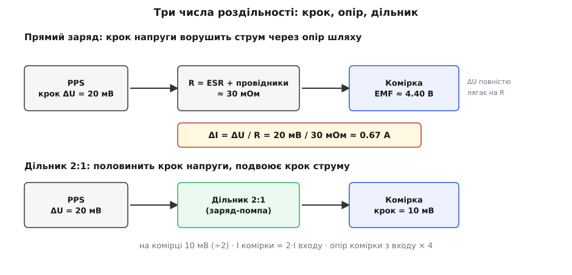
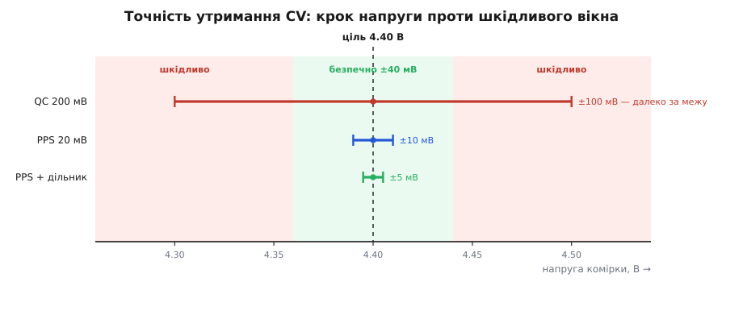
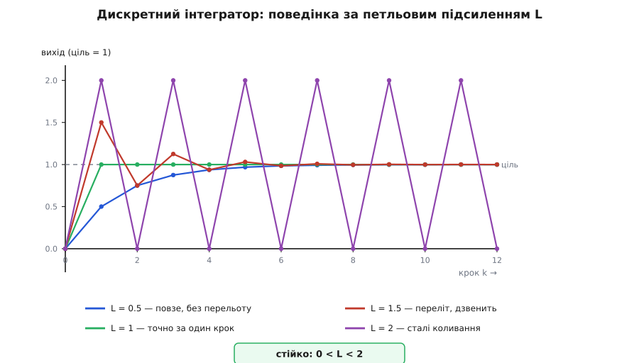

# 🧮 Роздільність PPS: як крок, опір і дільник стають струмом і точністю

> У темі крок PPS у 20 мілівольтів поданий як «досить тонко, щоб сісти на коліно». Тут це «досить тонко» перестає бути на віру. Ми складемо три числа — крок напруги, опір комірки біля коліна й відношення дільника 2:1 — і виведемо з них дві величини, яких у темі нема: **на скільки ампер рухає струм один крок** (роздільність струму) і **як щільно тримається 4.40 В** (точність CV). А наприкінці побачимо найнесподіваніше: те саме мале число 20 мВ диктує не лише точність, а й **стійкість** повільного кола, яким телефон веде батарею, — і диктує рівно тому, що комірка для швидкого заряду навмисно зроблена «жорсткою».

### Означення: що взагалі означає «роздільність» тут

Дистанційне джерело PPS має дві ручки, і в кожної свій найдрібніший поділок, зашитий у стандарт USB Power Delivery: **напруга крутиться по 20 мВ, струм — по 50 мА**. Це не округлення реалізації, а буква специфікації APDO — джерело зобов'язане приймати запити саме з такою сіткою. (Її грубший родич AVS ходить по 100 мВ і взагалі не має обмеження струму — тому для коліна не годиться; тонка сітка живе саме в PPS.)

Але поділок ручки — ще не роздільність результату. Телефонові байдуже, на скільки мілівольтів змінилася напруга на клемах адаптера за два метри кабелю; йому важить, **на скільки ампер** через це змінився струм у комірку і **на скільки мілівольтів** зрушила напруга на самій комірці. Між поділком ручки й цими двома величинами стоїть уся електрика шляху — опір, дільник, сама комірка. Роздільність — це ціна одного поділка, перерахована в те, що справді регулюють. Порахуймо цю ціну.

### Інтуїція: біля коліна комірка — це майже опір

Уся арифметика тримається на одному спрощенні, і воно чесне саме там, де болить. Літієва комірка — складна електрохімія, її [імпеданс](topic:hw-power/battery-impedance) залежить від частоти. Та на масштабі повільного заряду, коли струм міняється не різкими фронтами, а плавно, вона поводиться просто: **джерело сталої напруги (EMF) за маленьким послідовним опором**. Той опір — чиста омічна серцевина комірки, [ESR](topic:hw-analog/internal-resistance), плюс усе, що на шляху струму: провідники, ключ, вимірювальний шунт.

```
модель комірки біля коліна:   V_клем = EMF + I · R
    EMF — повільно повзе вгору, поки комірка набирає заряд
    R   — опір шляху: ESR комірки + провідники + ключ + шунт
```

Щойно ми так на неї дивимося, зв'язок напруги й струму стає лінійним і прозорим. Підняв напругу джерела на ΔU — надлишок над EMF розподілився по єдиному опору R, і струм підскочив на ΔU/R. Це закон Ома, записаний для **приростів**, і саме він перекладає поділок ручки в ампери.


*Три числа роздільності на одній картинці. Угорі — прямий заряд: увесь крок 20 мВ лягає на опір шляху R, і струм зрушує на ΔU/R. Унизу — заряд через дільник 2:1: на комірку доходить лише 10 мВ (напруга ділиться навпіл), струм подвоюється, а опір комірки з боку входу видається вчетверо більшим.*

### ΔI = ΔU/R: роздільність струму

Ось перша величина, і виводиться вона в один рядок. Струм у комірку — це надлишок напруги над EMF, поділений на опір шляху; продиференціюймо по напрузі джерела:

```
I = (U − EMF) / R        →        ΔI / ΔU = 1 / R        →        ΔI = ΔU / R
```

Один поділок напруги коштує ΔU/R ампера струму. Підставмо числа типової пласкої комірки для швидкого заряду — у неї ESR навмисно низький, бо високий гріється й [просаджує напругу під піком](topic:hw-power/battery-sag):

**Приклад (крок струму на прямому шляху).** Пласка комірка, ESR ≈ 15 мОм; провідники, ключ і шунт додають ще ≈ 15 мОм.

```
R  = 15 мОм (ESR) + 15 мОм (провідники+ключ+шунт) = 30 мОм
ΔU = 20 мВ
ΔI = ΔU / R = 0.020 / 0.030 = 0.667 А ≈ 0.67 А
```

Один крок напруги ворушить струм на дві третини ампера. Це багато — і тут ховається перша неочевидна річ. У PPS **дві** ручки, і струм можна регулювати не лише напругою, а й прямо — 50-міліамперовим поділком стелі струму. То яка ручка дає тоншу роздільність струму? Порівняймо їхню ціну в амперах:

```
крутити напругою:  ΔI = ΔU / R = 0.020 / R      (залежить від опору!)
крутити струмом:   ΔI = 0.050 А                  (сталий поділок стелі)

рівні, коли:   0.020 / R* = 0.050   →   R* = 0.020 / 0.050 = 0.40 Ом
```

Виходить поріг R* = 0.4 Ом, і він ділить світ надвоє. Для **жорсткої** комірки (низький R) поділок напруги дає грубий крок струму, а 50 мА — тонкий:

```
R = 30 мОм:   крок напругою = 0.67 А,  крок струмом = 0.05 А
              → струмова ручка тонша в 13 разів
R = 1.0 Ом:   крок напругою = 0.02 А,  крок струмом = 0.05 А
              → напругова ручка тонша (мала, стара чи холодна комірка)
```

Ось чому у [фазі сталого струму](topic:hw-power/li-ion-charger) телефон керує **не напругою, а стелею струму**: він ставить стелю на бажаний струм заряду й підіймає напругу з запасом, а адаптер своїм швидким внутрішнім колом сам витримує ту стелю з роздільністю 50 мА. Для жирної низькоомної комірки це вчетверо-вдесятеро тонше, ніж дала б напругова ручка. Напругова ручка — не для струму; її стихія починається за коліном, у CV.

### Дільник 2:1: чому 20 мВ стають 10 мВ

Коли струм переростає те, що витримує роз'єм, у телефон ставлять [перемикано-конденсаторний дільник](topic:hw-power/charge-pump-conv) із жорстким відношенням: напруга на виході — рівно половина входу, струм — рівно подвоєний. Що це робить із нашими поділками?

Напруга ділиться навпіл — отже, і **крок** напруги ділиться навпіл:

```
V_комірки = V_входу / 2     →     ΔV_комірки = 20 мВ / 2 = 10 мВ
```

Двадцять мілівольтів на вході дільника доходять до комірки як десять. Роздільність напруги на комірці **подвоїлася** — і це прямий виграш для утримання коліна, бо там важить кожен мілівольт.

Зі струмом дзеркально: I_комірки = 2·I_входу, тож і крок струму на комірці подвоюється. А ще дільник робить хитрішу річ — **віддзеркалює опір**. Погляньмо, яким видається опір комірки R₀ з боку входу, куди телефон подає напругу PPS:

```
V_входу = 2 · V_комірки = 2 · (EMF + I_комірки · R₀)
        = 2 · EMF + 2 · (2 · I_входу) · R₀
        = 2 · EMF + 4 · R₀ · I_входу
              ↑
        опір комірки видається як 4·R₀
```

Квадрат відношення: опір із виходу переноситься на вхід помноженим на 2² = 4. П'ятнадцять міліомів ESR із боку входу видаються шістдесятьма. Це не дрібниця для стійкості — до неї ми ще повернемося, — бо «жорсткий» об'єкт із боку керування стає вчетверо «м'якшим». А головний практичний висновок простий: **той самий поділок 20 мВ керує коміркою вдвічі тонше через дільник, ніж напряму.**

### Точність утримання CV: квантування дає ±½ кроку

Тепер друга обіцяна величина — як щільно тримається 4.40 В. У CV-фазі струм майже спав, падіння I·R на опорі мізерне, тож напруга на комірці практично дорівнює тому, що подає джерело, лише перекроєному дільником. Телефон не може поставити будь-яку напругу — лише вузли сітки. Тому справжня напруга комірки завжди сидить у межах **половини поділка** від цілі: ближче вузла нема куди стати.

```
крок, віднесений до комірки → утримання в межах ±½ кроку:

  прямий заряд:   крок 20 мВ  →  ±10 мВ довкола 4.40 В
  через дільник:  крок 10 мВ  →  ±5 мВ

  шкідлива межа (з теми):     понад ±30…50 мВ
    (переліт старить, ризикує осадженням літію)
```

Обидва варіанти PPS сидять глибоко всередині безпечного вікна — з дільником удвічі глибше. А тепер порахуймо, що було б грубою сіткою. Рання [Quick Charge](topic:com-devices/quick-charge) крутила напругу по 200 мВ:

```
QC, крок 200 мВ:   утримання в межах ±100 мВ
                   → утричі за шкідливу межу ±30…50 мВ
```

Сто мілівольт похибки там, де дозволено тридцять. Груба сітка не просто «менш точна» — вона фізично **не має вузла** в безпечному вікні: між 4.30 і 4.50 їй нема на що сісти. Ось чисельна причина, чому коліно вимагає саме дрібного кроку, а не будь-якого.


*Точність утримання = половина кроку, віднесеного до комірки. Крок QC у 200 мВ квантує напругу так грубо, що найближчі вузли лежать за безпечним вікном — комірку нема куди поставити, крім як із перельотом. Крок PPS 20 мВ (±10 мВ), а надто через дільник (±5 мВ), сідає в самій серцевині вікна.*

> 🔧 **Навіщо це.** Тут видно, що «точність» PPS — не про якийсь точний вимір, а про **густоту сітки**. Комірку не можна поставити точніше, ніж стоять вузли, куди її взагалі можна поставити. Двадцять мілівольт — це обіцянка, що між будь-якою потрібною напругою й найближчим досяжним вузлом ніколи не буде більше десяти мілівольт, а через дільник — п'яти. Саме цю обіцянку купує стандарт, обираючи 20 мВ замість 200: не кращий АЦП, а густішу сітку рішень.

### Повільне коло як дискретний інтегратор

Досі ми рахували статику — ціну одного поділка. Але телефон крутить ту ручку **в колі зі зворотним зв'язком**: виміряв, порівняв із ціллю, підкрутив на крок, і так раз у раз (у темі — приблизно раз на 200 мс). Це той самий «виміряти → порівняти → виправити», що й у [ПІД-регуляторі](topic:com-signal/discrete-pid), тільки в найпростішій, чисто інтегральній формі: щоразу додаємо або віднімаємо крок, аж поки похибка не зникне. І в такого кола є своя межа стійкості, яку задає — знову — розмір кроку.

Змоделюймо коло як **дискретний інтегратор** над майже статичним об'єктом. Нехай об'єкт (від напруги джерела до того, що ми тримаємо) має підсилення P, а коло щокроку тягне вихід до цілі з часткою L від похибки:

```
y[k+1] = y[k] + L · (ціль − y[k])       L — петльове підсилення за крок

похибка e[k] = ціль − y[k]:
   e[k+1] = e[k] − L · e[k] = (1 − L) · e[k]
```

Похибка щокроку множиться на (1 − L). Уся стійкість — в одному рядку: вона згасає, лише поки |1 − L| < 1, тобто

```
стійко:   0 < L < 2

  L < 1   повзе до цілі без перельоту (кожен крок недобирає)
  L = 1   «дедбіт» — гасить похибку рівно за один крок
  1<L<2   перелітає й дзвенить згасаючими коливаннями
  L = 2   сталі коливання, коло на межі
  L > 2   переліт росте — коло розгойдується
```


*Одне число L вирішує все. Мале підсилення — повільно, але спокійно. L=1 — ідеал: точно за крок. Понад одиницю з'являється переліт і згасаючий дзвін, а на двійці коло вже не заспокоюється. Той самий поділ на «спокійно / дзвенить / розгойдується», що й у [запасі стійкості](topic:hw-analog/stability-margins) аналогового кола, тільки для крокової сітки.*

### Чому крок мусить бути малим: жорсткий об'єкт має величезне підсилення

Тепер з'єднаймо стійкість зі статикою — і побачимо, чому 20 мВ не забаганка. Підсилення об'єкта в струмовому колі — це вже пораховане ΔI/ΔU = 1/R. Для жорсткої комірки воно **величезне**:

```
P = dI/dU = 1/R = 1/0.030 = 33 А/В

один крок 20 мВ рухає струм на:  P · ΔU = 33 · 0.020 = 0.67 А
а зона нечутливості кола (з коду теми) — лише ±50 мА, тобто 0.1 А завширшки
```

Один крок перестрибує всю зону нечутливості **більш як ушестеро**. Коло фізично не може завмерти всередині: щойно струм вийшов за нижній край, крок підкидає його далеко за верхній, звідти — назад, і струм ходить пилкою амплітудою в цілий крок. Це **граничний цикл** — незгасне тремтіння завбільшки з один поділок, віднесений до виходу:

```
залишкове тремтіння ≈ P · ΔU  (один квант, віднесений до виходу)

  струм, прямий заряд:      0.67 А   ← тому струмом напругову ручку й не крутять
  напруга CV, прямий:       1·20 мВ  →  ±10 мВ
  напруга CV, дільник:      0.5·20 мВ →  ±5 мВ
```

Ось де сходяться всі нитки. Швидкий заряд **вимагає** низького опору — інакше грів і просадка. Низький опір означає величезне підсилення об'єкта 1/R: крихітна зміна напруги дає велику зміну струму. Великий підсил легко переганяє коло за межу L = 2 у дзвін і розгойдування. Єдиний спосіб утримати L = P·(крок/похибка) в безпечному 0…2, маючи такий жорсткий об'єкт, — робити кожну поправку **мізерною**. Звідси й 20 мВ: не «щоб точно», а щоб жорсткий об'єкт не зірвав повільне коло в коливання. А тремтіння, що лишається, дорівнює одному кванту P·ΔU — тож **більший крок дав би пропорційно і більший переліт, і більший дзвін**. Дільник тут допомагає двічі: половинить квант на комірці (±5 мВ замість ±10) і вчетверо віддзеркалює опір, роблячи об'єкт із боку керування м'якшим.

**Приклад (чому коло свідомо повільне).** Складімо докупи всі затримки одного витка.

```
виток кола:            ~200 мс (з коду теми) — приблизно 5 Гц
запит PD + перебіг напруги адаптера:  десятки мс, поки нова напруга встоїться
keep-alive:            запит однаково слати ≤ 10 с, інакше hard reset

висновок: семпл рідший за час, поки адаптер устоюється →
          коло діє на свіжих, а не на застарілих даних →
          зайвої затримки в петлю не додається, межа L < 2 тримається
```

Якби телефон семплював **швидше**, ніж адаптер устигає перебігти на нову напругу, коло діяло б на застарілому вимірі — а зайва затримка в інтеграторі опускає безпечну межу підсилення нижче двійки, і навіть помірний крок починає дзвеніти. Тому коло навмисне ліниве: воно й так не має куди поспішати (напруга комірки повзе повільно), зате рідкий семпл із малим кроком дає широкий запас стійкості. Точний апарат — передатні функції, запас фази на частоті зрізу — для аналогового кола розібрано в [зворотному зв'язку](topic:hw-power/feedback-stability); тут вистачає дискретного «0 < L < 2», бо об'єкт майже без власної динаміки.

### Де це працює в PPS-зарядці

Три числа виявилися однією конструкцією. **Крок 20 мВ** через закон Ома приростів задає роздільність струму ΔU/R і — квантуванням — точність утримання ±½ кроку. **Опір біля коліна** працює в обидва боки: малий R дає тонку напругу, але грубий струм (тому в CC крутять 50-міліамперову стелю, а не напругу) і величезне підсилення 1/R, що змушує коло робити дрібні кроки й не поспішати. **Дільник 2:1** половинить крок на комірці до 10 мВ (утримання ±5 мВ), подвоює струм і вчетверо віддзеркалює опір, пом'якшуючи об'єкт для кола.

Звідси й відповідь на питання, з якого починалася тема: чому саме 20 мВ, а не 200. Двісті мілівольт лишили б комірку без вузла в безпечному вікні — переліт у старіння. Двадцять кладуть найближчий вузол не далі як за 10 мВ (за 5 через дільник) від будь-якої потрібної напруги — і водночас тримають поправку кола досить малою, щоб жорсткий, навмисне низькоомний об'єкт швидкого заряду не зірвав повільну петлю в дзвін. Тонка сітка стандарту — це не про точність вимірювання, а про те, щоб і **утримати** коліно, і **не розгойдати** коло, яким його утримують: одне мале число служить обом.
