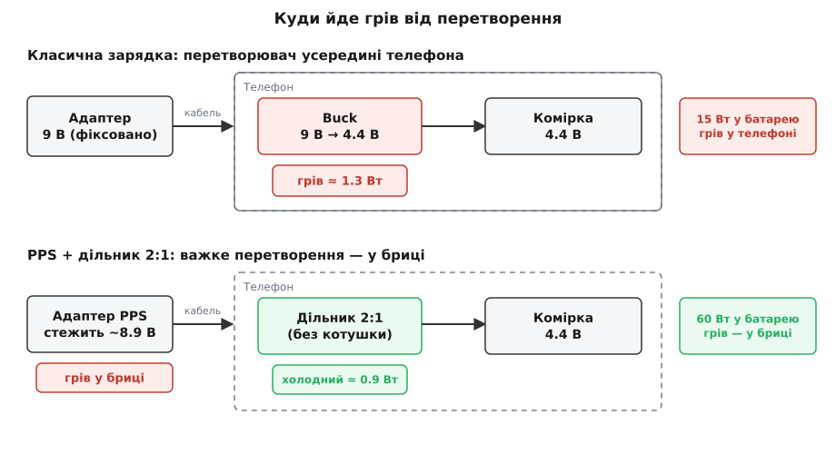
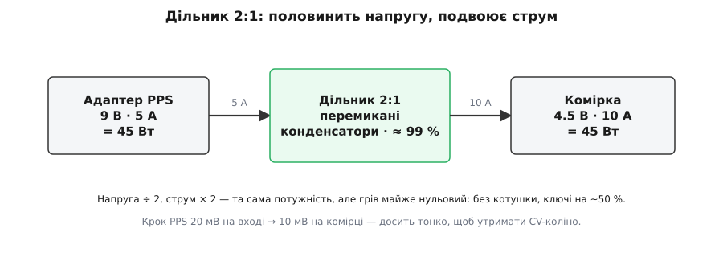
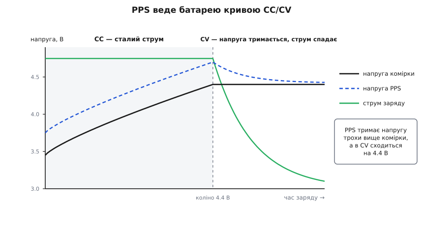

# PPS-зарядка батарей

<preknowlist>
- [USB Power Delivery](root:com-devices/usb-pd) — переговори по лінії CC: джерело шле меню профілів, пристрій просить один, укладається контракт «напруга + струм».
- [Зарядка Li-ion](root:hw-power/li-ion-charger) — крива CC/CV: спершу сталий струм, тоді стала напруга зі спадом струму; саме її PPS і має відтворити.
- [Buck-перетворювач](root:hw-power/buck) — знижувальний перетворювач і те, звідки в ньому береться грів; це той вузол, що PPS виносить із телефона.
</preknowlist>

Літієва комірка — рухома ціль. Щоб її наповнити, треба лити не просто «струм», а точно виточену пару «струм-напруга»: спершу сталий струм, поки комірка набирає заряд, а на її клемах напруга сама повзе вгору; тоді, коли напруга дійшла межі, її треба **утримувати** сталою, а струм хай спадає. І весь цей час напруга на самій комірці мандрує від десь 3.4 до 4.4 вольта. Тепер погляньмо на зарядний блок у розетці: він видає **фіксовані** 5, чи 9, чи 20 вольтів. Між його застиглою напругою й рухомою кривою, якої хоче комірка, зяє провалля — і хтось мусить його закрити, щохвилини переформовуючи фіксований вихід у той CC/CV-профіль, що потрібен саме зараз.

Довго цим «кимось» був знижувальний перетворювач усередині телефона. Він бере адаптерові 9 вольтів і чавить їх до 4.4 — а що чавить, те й гріється: частина потужності осідає в ньому теплом. Поки заряд був млявий, це дрібниця. Та щойно ми захотіли лити у комірку не 10, а 30, 60, 100 ват — грів перетворювача в тісному корпусі телефона став **стіною**. Тепло нема куди дівати: скло, метал, палець користувача — усе поруч, а розсіювати кілька ватів у пласкому корпусі просто нема як. Ось справжня причина, чому звичайне «дай більше вольтів» уперлося в глухий кут і чому знадобилося щось геть інше.

## Ідея: зробити сам адаптер керованим джерелом

Замість того щоб адаптер видавав застиглу напругу, а телефон її перекроював, **PPS** (англ. *programmable power supply* — «програмоване джерело живлення») перевертає розподіл праці. Адаптер стає **тонко керованим** CC/CV-джерелом, яке телефон веде в реальному часі: просить рівно ту напругу й той струм, що зараз потрібні комірці, і крутить їх дрібними кроками — по **20 мілівольтів** напруги й по **50 міліампер** струму. Важке перетворення переїжджає з телефона в настінну брицю, де є простір і корпусу, і повітрю; телефонові лишається майже нічого не перетворювати.

Розподіл виходить такий: телефон — **мозок**, бо тільки він знає свою комірку (її напругу, струм, температуру, скільки ще можна лити); адаптер — **м'язи**, бо саме він тягне важку конверсію потужності, і саме йому є куди подіти грів.

> 🔧 **Навіщо це.** Тепло від перетворення нікуди не зникає — його можна лише **перемістити**. У телефоні воно псує все: гріє комірку (а тепло старить літій), пече в руку, змушує процесор скидати частоту. У настінній бриці ті самі ватти розсіює великий пластиковий корпус із запасом площі. PPS — це, по суті, спосіб винести грів туди, де він нікому не заважає, і саме тому телефон здатен брати 60-100 ват, лишаючись прохолодним.


*Ту саму задачу — наповнити комірку 4.4 В — розв'язано двома шляхами. Зверху: адаптер дає фіксовані 9 В, знижувальний перетворювач у телефоні чавить їх до 4.4 В і гріється сам (≈ 1.3 Вт у корпусі на 15 Вт заряду). Знизу: адаптер PPS стежить за коміркою й дає майже готову напругу, а в телефоні лишається холодний дільник — навіть на 60 Вт грів у телефоні менший, бо важка конверсія переїхала в брицю.*

## Як це їде на USB-PD

PPS не вигадує окремого дроту чи роз'єму — це надбудова над [USB Power Delivery](root:com-devices/usb-pd), тим самим протоколом переговорів по лінії CC. У звичайному PD джерело показує **меню** фіксованих профілів: «5 В, 9 В, 20 В — вибирай рядок». PPS додає в те саме меню особливий пункт — **APDO** (англ. *augmented power data object* — «розширений об'єкт даних живлення»). Він оголошує не точку, а **діапазон**: «умію будь-що від 3.3 до 21 В, до стількох-то ампер, і крутитиму це дрібно». Пристрій, побачивши APDO, тепер просить не готовий рядок, а **конкретне число** з діапазону — скажімо, «дай 4.42 В з обмеженням 3.00 А». Адаптер стає, по суті, лабораторним джерелом на пульті: телефон командує напругою й струмом, ніби крутить ручки на приладі.

Пристрій, що приймає живлення, у стандарті звуть [стік](root:hw-power/usb-pd-sink) (англ. *sink* — «стік», той, хто вбирає потік). І щоб ця дистанційна ручка працювала безпечно, у PPS вбудовано два зустрічні механізми зворотного зв'язку.

**CV проти CL — джерело саме каже, у якому воно режимі.** Стік задає адаптерові **дві** межі одразу: цільову напругу й стелю струму. Далі адаптер поводиться просто. Поки навантаження бере менше за стелю струму — джерело тримає **задану напругу** (режим сталої напруги, CV). Щойно комірка спробувала взяти більше за стелю — джерело **впирається в струм** (режим обмеження струму, CL) і **сам опускає напругу** рівно настільки, щоб струм не переліз стелю. І — головне — адаптер **повідомляє**, у якому він режимі. Це перетворює одну APDO-межу на повноцінну CC-фазу: постав стелю струму на бажаний струм заряду, підніми напругу з запасом — і джерело саме віддасть той струм, просівши напругою до потрібної. Телефон читає прапорець «я в CL» і розуміє, що комірка ще на CC-ділянці.

**Keep-alive — стік мусить озиватися.** Дистанційно кероване джерело, налаштоване на високий струм, не сміє лишатися без нагляду. Тому стандарт вимагає: стік має слати новий запит **щонайменше раз на 10 секунд**. Замовк надовше — адаптер вважає, що співрозмовник загубився, і робить **hard reset**: скидає контракт і повертає безпечні 5 В. Через це запити не мовкнуть, навіть коли нічого не змінюється: телефон раз у раз перепідтверджує ту саму напругу — і цей самий запит слугує сигналом «я живий».

## Чому саме 20 мілівольтів

Дрібний крок — не примха стандарту, а точно те, чого вимагає CV-фаза. Уся інтрига літієвого заряду коїться біля **коліна** — тієї миті, коли комірка дійшла максимальної напруги й струм має плавно спадати. Тут комірку треба втримати на 4.40 вольта з похибкою в кілька десятків мілівольтів, не більше: перелетиш угору — пришвидшиш старіння й ризикуєш осадженням металевого літію; недолетиш — недоллєш ємності. Тепер порівняймо сітки напруг:

**Чому сітка PPS лягає на коліно, а грубіша — ні.**
```
Ціль CV-фази:            утримати комірку на 4.40 В
Шкідлива похибка:        > ±30-50 мВ (переліт старить, осаджує літій)

Сітка Quick Charge (200 мВ):  ... 4.30 | 4.50 ...   — жодного рівня біля цілі
Сітка PPS (20 мВ):            ... 4.38 | 4.40 | 4.42 ...  — точно на коліні
```

Груба сітка на 200 мВ (як у ранніх версіях [Quick Charge](root:com-devices/quick-charge)) просто **перестрибує** ціль: між 4.30 і 4.50 нема на що сісти, а обидва сусіди для CV нікудишні. Сітка PPS у 20 мВ сідає в межах ±10 мВ від 4.40 — рівно та точність, яку вимагає коліно. А оскільки біля коліна комірка поводиться майже як [маленький опір](root:hw-power/battery-impedance) за джерелом напруги, кожен крок напруги ще й переливається у крок струму: при опорі шляху близько 30 мОм 20 мВ ворушать струм на `0.020 / 0.030 ≈ 0.67 А`. Тонша сітка — плавніше керування без ривків. Повну арифметику — як крок напруги, опір комірки й коефіцієнт дільника разом визначають роздільність струму й точність CV, і як це впливає на стійкість керувального кола — розібрано в [математиці роздільності PPS](root:com-devices/pps-charging/math-pps-cv-resolution.md).

## Дві архітектури: пряма зарядка й дільник

Маючи кероване джерело, телефон будує потрібну криву одним із двох способів.

**Пряма (лінійна) зарядка.** Адаптер видає напругу комірки плюс невеликий запас на падіння в кабелі, а в телефоні лишається тільки маловтратний польовий ключ і давачі струму й напруги. Усю CC/CV-криву веде адаптер, а телефон лише коригує запит: поки комірка на CC-ділянці — тримає стелю струму на струмі заряду й підіймає напругу вслід за коміркою, щоб зберігати запас; дійшла до 4.40 — перемикається у CV, притримує напругу на цілі й дає струмові спадати. Такого прямого шляху вистачає десь до 18-27 ват — далі струм у кабелі USB-C стає завеликим.

**Дільник 2:1 — для справді швидкого заряду.** Щоб дати 45, 65, 100+ ват, не роздуваючи струм у кабелі понад ті ампери, що витримує роз'єм, у телефон ставлять **перемикано-конденсаторний дільник** на [заряд-помпі](root:hw-power/charge-pump-conv) з жорстким відношенням 2:1. Адаптер PPS видає **вдвічі вищу** за комірку напругу при помірному струмі — скажімо, 9 В при 5 А, — а дільник **половинить напругу й подвоює струм**: на комірку йде 4.5 В при 10 А. Струм у кабелі лишився п'ятьма амперами (роз'єм щасливий), а в комірку влилося вдесятеро більше, ніж дали б базові USB.


*Дільник ділить навпіл напругу й множить удвічі струм — потужність та сама. Але грів майже нульовий: у ньому нема котушки, а ключі стоять на сталому відношенні ~50 %, тож лишається хіба опір їхніх каналів. Крок PPS 20 мВ на вході дільника перетворюється на 10 мВ на комірці — ще тонше для CV.*

Чому дільник майже не гріється — у самій його будові. У нього **нема дроселя**, лише конденсатори, що перекидаються між входом і виходом; ключі працюють не широтно-імпульсно, а на сталому відношенні близько 50 %, тож у них лишається тільки опір відкритого каналу. Звідси ККД у 97-99 % — недосяжний для звичайного [buck-перетворювача](root:hw-power/buck) з його комутаційними втратами й активним дроселем. А тонкий крок напруги стає ще тоншим: 20 мВ на вході дільника — це лише 10 мВ на комірці, вдвічі точніше для утримання коліна. Телефон і тут веде криву, крутячи напругу PPS у своєму повільному колі, тільки тепер кожен ват майже без сліду доходить до комірки.

## Куди дівається грів — на числах

Уся суть PPS відкривається, щойно порахувати, де осідають ватти. Візьмімо класику й порівняймо.

**Класична зарядка на 15 Вт (адаптер + buck у телефоні).**
```
Комірка:            4.4 В × 3.41 А        = 15.0 Вт у батарею
Buck у телефоні:    ККД ≈ 92 %
Вхід buck:          15.0 / 0.92           = 16.3 Вт
Грів у телефоні:    16.3 − 15.0           ≈ 1.3 Вт  ← у корпусі телефона
```
Ті 1.3 вата вже помітно гріють тонкий корпус. А тепер спробуймо просто «дати більше» цим самим способом: на 30 ват грів buck-а подвоївся б до ~2.5 вата в тому самому корпусі — телефон почав би скидати частоту й пекти в руку. Ось вона, теплова стіна.

**Швидка зарядка на 60 Вт (PPS + дільник 2:1).**
```
Комірка:            4.4 В × 13.6 А        = 60 Вт у батарею
Вхід дільника:      ≈ 8.9 В × 6.9 А       = 61 Вт
Дільник:            ККД ≈ 98.5 %
Грів у телефоні:    61 − 60               ≈ 0.9 Вт  ← у телефоні
Важка конверсія:    у настінній бриці, не в телефоні
```

Порівняймо підсумки: класика лишає в телефоні 1.3 вата на кожні 15 ват заряду; PPS із дільником — лише 0.9 вата на **60** ват. Вчетверо більше потужності в комірку — і **менше** тепла в телефоні. Це не магія й не вищий ККД самого перетворення на порядок: важкі ватти AC/DC-конверсії просто переїхали в брицю, у якої є куди їх подіти. Телефон робить майже безвтратну операцію (дільник), а гарячу — доручає тому, хто може охолонути.


*Як PPS веде батарею. На CC-ділянці струм сталий, а напруга комірки повзе вгору — адаптер тримає свою напругу трохи вище, з запасом на кабель і дільник. Біля коліна 4.4 В телефон переходить у CV: адаптер притримує напругу, і струм плавно спадає. Уся крива — це телефон, що дрібними кроками 20 мВ веде дистанційне джерело за живою коміркою.*

## Як телефон веде криву в коді

Керування зводиться до простого повільного кола. Телефон вимірює струм у комірку, порівнює з ціллю й підкручує запит до адаптера на один крок PPS — це домен прошивки, що ганяє PD-контролер, тож природна мова тут C:

```c
// CC-фаза: тримати струм заряду I_TARGET, підкручуючи напругу PPS по 20 мВ.
// Викликається періодично (раз на ~200 мс), поки комірка не дійшла коліна.
void pps_cc_step(void) {
    int i_ma = batt_current_ma();          // виміряний струм у комірку
    int v_mv = pps_req_mv;                 // поточна запитана напруга

    if (i_ma < I_TARGET_MA - 50)           // струму замало —
        v_mv += 20;                        //   підняти на один крок PPS
    else if (i_ma > I_TARGET_MA + 50)      // забагато —
        v_mv -= 20;                        //   опустити на крок

    if (batt_voltage_mv() >= V_CV_MV)      // комірка дійшла коліна —
        charger_enter_cv();                //   далі веде CV-цикл

    v_mv = clamp(v_mv, APDO_MIN_MV, APDO_MAX_MV);
    pps_request(v_mv, I_TARGET_MA);        // новий APDO-запит — він же keep-alive
    pps_req_mv = v_mv;
}
```

Тут видно й суть, і пастку: кожен виток кола не лише коригує напругу, а й **перепідтверджує контракт** — тому саме це коло не дає спрацювати 10-секундному таймеру. Повне робоче коло — зі станами CC→CV, читанням прапорця CL, компенсацією падіння в кабелі й обробкою відмов — зібрано в [проєкті керування PPS-зарядкою](root:com-devices/pps-charging/proj-pps-cc-loop.md).

## PPS серед протоколів

PPS не впав з неба — це відповідь USB-IF на розбрід власницьких протоколів швидкого заряду. Одні виробники тягли напругу вгору при малому струмі, інші — навпаки, лили низьку напругу великим струмом просто в комірку, вже тоді виносячи перетворювач у бік адаптера. PPS (у складі USB PD 3.0, 2017 рік) звів обидві ідеї в один відкритий стандарт: тонко кероване джерело, доступне будь-кому, а не лише телефонам однієї марки. Хто хоче знати, як саме народилася ця конвергенція — з дат, імен і того, який протокол що зробив першим, — див. [історію появи PPS](root:com-devices/pps-charging/hist-pps-origins.md).

Практичний підсумок простий. Коли пристрій підтримує PPS, зарядний блок перестає бути тупим джерелом фіксованих вольтів і стає **керованим CC/CV-джерелом на пульті** — а телефон, єдиний, хто справді знає свою комірку, веде її ідеальною кривою, лишаючи весь грів там, де на нього ніхто не зважає.
