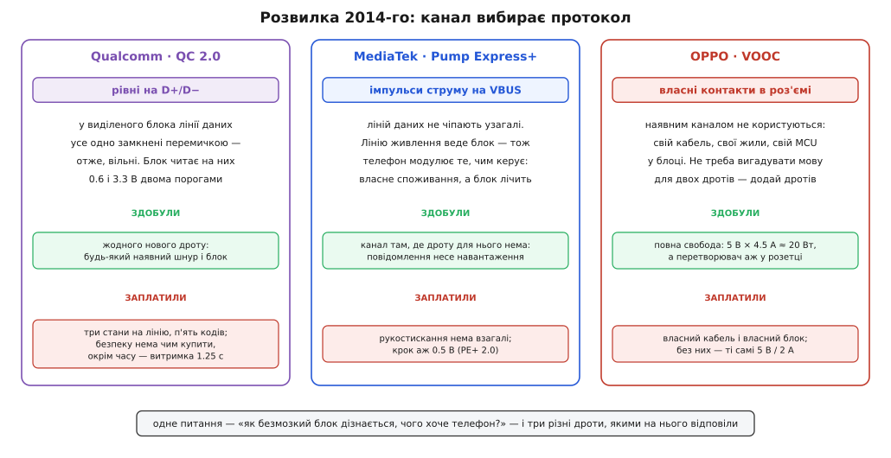
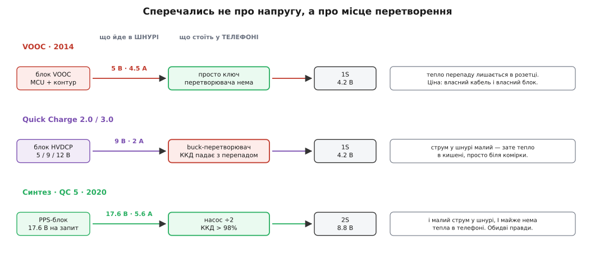
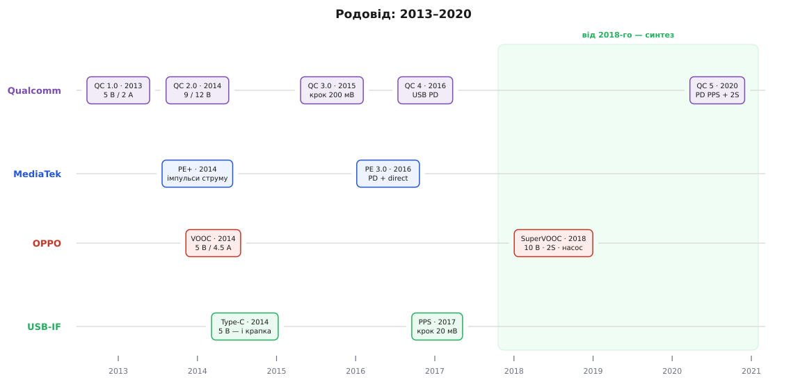

# 📜 Родовід швидкої зарядки: від 5 В/2 А до синтезу

Історію швидкої зарядки зазвичай переказують як список поколінь: спершу було десять ватів, потім дев'ять вольтів, потім крок 200 мВ, потім прийшов стандарт. Список правдивий і майже нічого не пояснює. З нього не видно ані чому все почалося саме з п'яти вольтів, ані чому три команди, розв'язуючи буквально одну задачу, розійшлися в різні боки, ані — найцікавіше — чому наприкінці вони зійшлися назад.

Почнімо з числа, бо весь родовід — це спроби від нього втекти.

## П'ять вольтів, яких ніхто не вибирав для батарей

П'ять вольтів у USB ніхто не вибирав. Їх успадкували.

Логіка TTL (*transistor-transistor logic* — транзисторно-транзисторна логіка) працювала від 5 В: це компроміс 1960-х між завадостійкістю (щоб рівні «нуль» і «одиниця» надійно розрізнялись) і нагрівом (бо вища напруга — це більша розсіяна потужність). Відтоді 5 В стали Vcc усього цифрового світу. Блок живлення персонального комп'ютера мусив мати шину +5 В саме тому, що на ній сиділа логіка. А коли в середині 1990-х проєктували USB, окремої напруги для нього не придумували — просто вивели на роз'єм ту шину, що вже стояла в кожному комп'ютері.

Статус доказовості цієї ланки варто назвати чесно: ланцюжок «TTL → шина +5 В у блоці живлення ПК → VBUS у USB» — стандартне й добре обґрунтоване пояснення, але це **реконструкція причини**, а не цитата: у самій специфікації USB нема речення «ми взяли 5 В, бо TTL». Твердо відомо інше — що 5 В на момент народження USB уже були скрізь, і що шину просто вивели назовні.

А тепер головне. **П'ять вольтів не мають до літію жодного стосунку.** Літієва комірка хоче 3.0–4.4 В; те, що 5 В опинилися *трохи* вище за 4.2 В, — чистий збіг двох незалежних історій. І саме це «трохи» виявилось пасткою, розтягнутою на п'ятнадцять років. Поки телефон мав батарею на 800 мА·год, збігу вистачало з головою: зайві вісім десятих вольта можна було згасити хоч найпростішим лінійним стабілізатором і не думати. Щойно батареї доросли до трьох тисяч, запасу не лишилось ні на струм, ні на перепад — і виявилось, що весь світ живиться від числа, вибраного для логічної родини за тридцять років до появи літій-іонного акумулятора.

Отже, увесь родовід швидкої зарядки — це історія про те, як число з 1960-х зустрілося з хімією 1990-х і не зійшлося з нею.

## Перше покоління, що застаріло того ж року

**Quick Charge 1.0** з'явився 2013 року: 5 В, 2 А, десять ватів, у складі Snapdragon 600. Розійшовся широко — Qualcomm рахував до сімдесяти моделей, серед них Nexus 4 і Lumia 920. (Точний день у вторинних джерелах плаває: трапляється «14 лютого 2013», але надійно підтверджується лише рік — тож день лишімо непевним.)

Ніякої розмови з блоком там ще не було. QC1.0 просто дозволяв брати вдвічі більший струм при тих самих п'яти вольтах — тобто вичавлював максимум із [легасі-механізму розпізнавання зарядного блока](root:com-devices/legacy-charging-dialects), не виходячи за його межі.

А тепер факт, який каже про задум більше за будь-яку презентацію. **Quick Charge 2.0 оголосили 20 лютого 2013 року** — того самого року, коли перше покоління тільки розходилось по пристроях. І в тому оголошенні Qualcomm говорив уже не про десять ватів, а **про шістдесят**: мовляв, вистачить і на тонкий ноутбук.

Шістдесят проти десяти — це не поліпшення, це зміна класу. Отже, в Qualcomm розуміли, що десятиватова стеля — глухий кут, ще **до того**, як перше покоління дійшло до кишень. QC1.0 не був кроком плану; він був стельовою позначкою п'ятивольтового світу, яку поставили й майже одразу переросли. Із цього моменту питання стояло вже не «чи підіймати напругу», а «як про це домовитись».

## Розвилка 2014-го: одне питання, три різні дроти

До 2014-го над тією самою задачею сиділи три команди, і питання в усіх було буквально те саме: **як безмозкий блок дізнається, чого хоче телефон?** А от відповіді розійшлися так, як не розходяться просто «різні протоколи». Кожна команда вибрала **інший фізичний дріт**, яким говорити.

**Qualcomm** узяв **лінії даних**. Логіка залізна: у виділеному зарядному блоці D+ і D− усе одно нічого не роблять — вони замкнені перемичкою. Дроти вже є в кожному кабелі світу, контакти вже є в кожному роз'ємі. Бери й користуйся.

**MediaTek** у **Pump Express Plus** (2014) ліній даних не чіпав узагалі — і знайшов канал, який на перший погляд неможливий: **саму VBUS**. Придивімося, бо це справді красиво. Лінію живлення веде блок; телефон нічого туди «покласти» не може — не він там господар. Зате телефон розпоряджається тим, **скільки звідти брати**. Отже, він модулює власне споживання — смикає струм імпульсами, — а блок стежить за струмом на власному виході й **лічить** ці смикання. Канал з'явився там, де дроту для нього нема: повідомлення несе не напруга, а форма навантаження.

Ціна винахідливості видна одразу. Рукостискання в PE+ **нема взагалі**: блок просто стоїть на п'яти вольтах, доки не почує команду. А крок у PE+ 2.0 — аж 0.5 В на діапазоні 5–20 В, тобто вчетверо грубший за той, який згодом дасть Qualcomm.

**OPPO** відмовилась від головоломки цілком. **VOOC** (від *Voltage Open Loop Multi-step Constant-Current Charging* — багатощаблевий заряд постійним струмом із розімкненим контуром за напругою) на Find 7 у березні 2014-го говорить **власними контактами**: свій кабель, свої жили, свій мікроконтролер у блоці. Не треба вигадувати мову для двох дротів, якщо можна просто додати дротів.

Ось перший урок цієї історії, і він не про зарядку. **Форму протоколу вибрав не інженер, а обмеження.** Qualcomm, узявши D+/D−, дістав три стани на лінію й п'ять кодів — і мусив купувати безпеку **часом**, витримкою в секунду з чвертю, бо платити було більше нічим. MediaTek, узявши струм VBUS, дістав канал зовсім без рукостискання й грубий крок. OPPO, узявши власні дроти, дістала повну свободу — і повну прив'язку. Ніхто з трьох не «вибирав дизайн»; кожен вичавив максимум із того дроту, який йому дозволили чіпати.

> 🔧 **Навіщо це.** Коли доведеться придумувати свій обмін по тому, що є під рукою — один вільний пін, лінія переривання, струм споживання, — не питайте спершу «який протокол кращий». Питайте: **скільки розрізненних станів і скільки часу** дає мій фізичний канал. Решта випливе сама. Уся елегантність Quick Charge — прямий наслідок того, що в нього було дві лінії й нічого більше; уся незграбність Pump Express — наслідок того, що в нього не було й того.


*Одне питання 2014 року — і три різні дроти, якими на нього відповіли. Qualcomm узяв те, що вже було в кожному кабелі, і заплатив крихітним простором кодів. MediaTek знайшов канал там, де дроту для нього нема, — і лишився без рукостискання. OPPO додала власних дротів і купила свободу ціною фірмового кабелю. Канал вибрав протокол, а не навпаки.*

## Чому OPPO погодилася на власний кабель

VOOC зазвичай переказують як «просто більший струм». Там є справжня архітектурна думка, і без неї фінал історії не читається.

Якщо лишаєш 5 В, мусиш гнати ампери: 20 Вт при п'яти вольтах — це 4 А, а специфікація VOOC називає 4.5 А. Крізь micro-USB, розрахований на 1.8 А, стільки не пропхнеш — отже, потрібен свій кабель із товстішими жилами й додатковими контактами. Але щойно ти на це погодився, відкривається головне: тепер **контур регулювання можна перенести в блок**.

Звідси й назва. *Voltage Open Loop* — «розімкнений контур за напругою»: блок не тримає напругу, він **регулює струм щаблями**, а напругу замикає сама комірка — фізично, своєю характеристикою. Мікроконтролер у блоці веде [багатощаблевий постійний струм](root:hw-power/li-ion-charger) безпосередньо, без посередників. Телефонові лишається вимикач і термометр.

І ось наслідок, задля якого все затівалось: у телефоні **нема** [понижувача](root:hw-power/buck), який палить перепад. Тепло перетворення лишається в розетці. Саме тому VOOC-телефон під зарядкою був холодний, і саме тому ним можна було спокійно користуватись — рекламний аргумент, який OPPO експлуатувала роками.

Заплатили за це тим, що весь шлях від розетки до комірки став фірмовим. Загубив кабель — маєш ті самі 5 В / 2 А, як усі. OPPO пішла на цю угоду свідомо. OnePlus ліцензувала ту саму техніку під назвою **Dash Charge** (OnePlus 3, 2016; 5 В / 4 А ≈ 20 Вт), а згодом перейменувала її на **Warp Charge** — після суперечки за торговельну марку зі словом «dash».

## QC3.0: елегантність загнаного в кут

**Quick Charge 3.0** оголосили **14 вересня 2015 року** — для Snapdragon 820, 620, 618, 617 і 430, з обіцянкою пристроїв «наступного року», тобто на 2016-й. (Звідси й розбіжність у джерелах: одні датують QC3.0 2015-м за оголошенням, інші 2016-м за появою в телефонах. Обидві дати правильні, просто про різні події.) Обіцяли 0→80% за 35 хвилин і на 38% вищу ефективність за QC2.0.

Історично цікаве тут інше. QC3.0 — це момент, коли Qualcomm уперся в стелю **власного каналу**, вибраного двома роками раніше. Дві лінії по три стани дають шість комбінацій. Щоб назвати чотири напруги, цього досить. Щоб назвати сотню значень із кроком 200 мВ — ні, і взяти нові стани нізвідки: дротів більше не стане, а рівнів між нулем і 3.3 В надійно не наріжеш дрібніше.

Тому Qualcomm перестав напругу **називати** й почав її **лічити**. Це не поліпшення каналу — це обхід каналу, що вичерпався. Сліпий лічильник QC3.0, який так легко захоплює своєю дотепністю, насправді є рахунком, що прийшов за рішення 2013 року взяти саме D+/D−. Елегантність тут справжня, але це елегантність людини, загнаної в кут: коли назвати число нічим, лишається стукати.

## Суд — і хто здався першим

21 квітня 2016-го інженер Google **Бенсон Лянг** (*Benson Leung*), який тоді методично перевіряв Type-C-кабелі й аксесуари й устиг цим уславитись, відмовився рекомендувати HTC 10 і LG G5. Формулювання було коротке: специфікація Type-C прямо забороняє фірмові методи заряджання, що намагаються міняти VBUS понад 5 В. Причина заборони не в педантизмі — на новому роз'ємі напругу має право міняти лише той механізм, що знає, [хто тут джерело, а хто споживач](root:com-devices/type-c-cc).

Але в цій справі є друга половина, яку в переказах майже завжди гублять: **першим здався не Qualcomm, а MediaTek** — і здався достроково.

**30 травня 2016 року**, за п'ять з половиною місяців до відповіді Qualcomm, MediaTek оголосив **Pump Express 3.0** — перше своє покоління, що говорить [USB Power Delivery](root:com-devices/usb-pd) **замість** модуляції струму на VBUS. І тим самим рухом — **direct charge**: ключ, який пускає струм із блока просто в батарею, обминувши перетворювач у телефоні; розсіювання впало більш ніж удвічі проти PE 2.0. Понад 5 А, 0→70% за 20 хвилин, кристал Helio P20, пристрої — до кінця 2016-го.

Погляньте, що вийшло. Компанія з **найслабшим** власним каналом кинула його першою — і, кинувши, першою ж прийшла до архітектури, якою сьогодні заряджається все: **стандартний PD плюс пряма подача в батарею**. Форма майбутнього синтезу з'явилась у травні 2016-го, у гравця, якому не було чого втрачати. Це, до речі, типовий сюжет: від власного протоколу відмовляється не той, хто найкраще все зрозумів, а той, у кого найменше вкладено.

Про пріоритет варто сказати точно. «Перше у світі рішення з direct charge через Type-C PD» — це формулювання самої MediaTek. Статус: **заява компанії**, правдоподібна за датами, незалежно не підтверджена. На саму *ідею* прямої подачі пріоритету не має ніхто — вона надто очевидна; ідеться лише про першу реалізацію на PD у масовому кристалі.

## Чому «QC4 = PPS» не сходиться з датами

Тепер найтонше місце родоводу. Ходова формула звучить так: «QC4 перейшов на USB PD PPS». Дати цього не дозволяють — принаймні не на момент оголошення.

Розкладімо по документах:

```
17 листопада 2016   QC4 оголошено разом зі Snapdragon 835.
                    Власний реліз Qualcomm: «інтегрує підтримку
                    USB Type-C і USB-PD», INOV третього випуску,
                    Dual Charge, мікросхеми SMB1380/1381,
                    пік ККД 95%, тепловий контроль у реальному часі.
                    Слова «PPS» у релізі НЕМА.

12 січня 2017       Опубліковано USB PD Revision 3.0, Version 1.1 —
                    саме та редакція, що вводить PPS:
                    крок 20 мВ, діапазон 3.3–21 В, струм по 50 мА.
                    Це на ДВА МІСЯЦІ ПІЗНІШЕ за оголошення QC4.

1 червня 2017       QC4+ — обов'язковий Dual Charge++, повернуто
                    сумісність із QC 2.0/3.0 на старих роз'ємах.

8 січня 2018        USB-IF запускає лого «Certified USB Fast Charger»
                    саме для PPS.

27 липня 2020       QC5 — і аж тут Qualcomm сам каже, що узгодження
                    «спирається на наявний стандарт USB PD PPS».
```

Отже, QC4 на момент оголошення — це **сумісність із PD**, а не PPS: редакції з PPS ще просто не існувало опублікованою. Вторинні джерела тут відверто розходяться: одні пишуть, що QC4 підтримує PD 3.0 разом із PPS, інші — що ні QC4, ні QC4+ PPS не реалізують і що PPS з'явився аж у QC5.

Статус доказовості: **спірно**. Твердих опор рівно три — власний реліз QC4 про PPS мовчить; редакція з PPS вийшла на два місяці пізніше; власний реліз QC5 про PPS каже прямо. Усе між ними — реконструкція, і охайніше казати «QC4 пішов до стандарту», ніж «QC4 = PPS».

Але важливіше за саму дату те, **що ця плутанина показує**. Перехід не був рішенням — він був **дрейфом**. Qualcomm не навернувся до стандарту одним рухом: спершу оголосив сумісність, поки стандарт іще дописували; лишив під сподом власний INOV; повернув сумісність зі своїми ж старими поколіннями; і аж коли подвійна комірка із зарядним насосом зробили дрібний крок **потрібним**, сперся на PPS по-справжньому. Не протокол тягнув техніку — техніка тягнула протокол. Тому й дата переходу розмита: переходу як події не було.

## Зрада OPPO власній ідеї — і що вона насправді означала

2018 рік. OPPO Find X Automobili Lamborghini Edition, **SuperVOOC**: **10 В**, 5 А, близько 50 Вт; дві комірки, з'єднані послідовно; зарядний насос, що ділить напругу навпіл. Батарея 3400 мА·год заряджається з нуля до ста за 35 хвилин.

Прочитайте це ще раз. Компанія, чиїм публічним аргументом чотири роки поспіль було «низька напруга — холодніше й безпечніше, телефоном можна користуватись під зарядкою», привезла блок **на десять вольтів**.

Спокусливо назвати це капітуляцією. Але це не вона — і саме тут ховається найкорисніша думка всього родоводу.

Принципом VOOC ніколи не були п'ять вольтів. Принципом було: **не давати телефонові палити перепад**. У 2014-му, маючи власний кабель, цей принцип шанували так — виносили перетворювач аж у блок. Виявилось, що є спосіб пошанувати його **краще**. Візьми дві комірки послідовно (2 × 4.4 = 8.8 В), пошли в кабель подвоєну напругу при вдвічі меншому струмі — і поділи її навпіл просто в телефоні [зарядним насосом](root:hw-power/charge-pump), який у режимі точно ÷2 майже нічого не палить. Тепла в телефоні майже нема — як і хотів VOOC. Ампери в шнурі малі — як хотів Quick Charge.

П'ять вольтів були не принципом, а **реалізацією принципу 2014 року**. Щойно з'явився кращий механізм, реалізацію змінили, а принцип лишився цілий. Це, до речі, точний діагноз усій багаторічній суперечці «низька напруга проти високої»: сперечались не про напругу, а про **місце перетворення** — і не помічали, що це два різні питання, які випадково злиплися в одне через брак кращого заліза.


*Вісь суперечки — не напруга, а місце перетворення. VOOC виніс його в блок: тепло лишається в розетці, ціна — фірмовий кабель. Quick Charge лишив понижувач у телефоні: шнур холодний, зате перепад гріє просто біля комірки. Синтез бере обидві половини — висока напруга в шнурі й майже безвтратне ділення ÷2 перед коміркою, — і платити за це нікому не доводиться.*

## Синтез

**27 липня 2020-го** Qualcomm оголосив **Quick Charge 5** — понад 100 Вт; перший телефон — Xiaomi Mi 10 Ultra. Мікросхеми SMB1396 і SMB1398 зроблені під **2S**-батареї, тобто дві комірки послідовно, і дають понад 98% ККД. Протокол узгодження — [USB PD PPS](root:com-devices/pps-charging).

Порахуймо, що саме там відбувається, бо в цих числах уміщається весь родовід.

**Приклад (100 ватів за архітектурою QC5).** Комірка заряджається до 4.4 В; дві послідовно — 8.8 В. У телефоні стоїть один щабель ділення ÷2, тож у блока просять **подвоєну** напругу пакета:

```
пакет 2S:        2 × 4.4 В    = 8.8 В
просять у PPS:   2 × 8.8 В    = 17.6 В     ← стільки йде в шнур
струм у шнурі:                  5.6 А
потужність:      17.6 × 5.6   ≈ 98.6 Вт

насос ÷2 у телефоні:
до пакета:       17.6 / 2     = 8.8 В
                  5.6 × 2     = 11.2 А
                  8.8 × 11.2  ≈ 98.6 Вт    (мінус ~2% на насосі)

ті самі 98.6 Вт на п'яти вольтах:
                 I = 98.6 / 5 = 19.7 А     ← крізь шнур USB
```

Дев'ятнадцять із половиною ампер крізь USB-кабель — це навіть не «дорого», це неможливо: типовий шнур тримає 3–5 А. Ось де п'ять вольтів помирають остаточно, і помирають вони не від ККД, а від звичайної арифметики.

А тепер подивіться на число **17.6 В** — воно варте окремої уваги. По-перше, це напруга, яку **ніхто не вибирав**: вона просто дорівнює вчетверо взятій напрузі комірки, і жодного «гарного» сенсу в ній нема. По-друге, сітка QC2.0 (5/9/12/20) назвати її не могла — такого щабля в ній нема й бути не може. По-третє, сліпому лічильникові QC3.0 її не можна було б довірити: то були б вісімдесят вісім кроків по 200 мВ від п'яти вольтів, і жодного способу перепитати, куди ти дійшов. Назвати 17.6 В **абсолютним значенням** уміє лише PPS — і тільки тому вся конструкція взагалі існує.

Отже, в одному цьому числі тримаються всі три нитки:

- **17.6 В у шнурі** — правда Quick Charge: висока напруга, малий струм, кабель холодний;
- **поділено навпіл просто перед коміркою** — правда VOOC: телефон не палить перепад;
- **17.6, а не 18** — правда стандарту: значення називають точно й абсолютно, а не намацують.

Синтез — це не компроміс, у якому кожен щось віддав. Це відкриття, що два «протилежні» табори весь час зменшували **різні доданки однієї суми**: Qualcomm — втрати в шнурі, OPPO — втрати в перетворювачі. Сперечатись не було про що; треба було скласти.

І остання деталь, від якої історія замикається. Оскільки QC5 лежить на PD PPS, **фірмовий блок Quick Charge для нього не потрібен**: телефон набере повну швидкість від будь-якого PPS-блока з відповідним діапазоном напруг і струмів. Протокол, що народився як спосіб обійтися без стандарту, дійшов до стану, у якому він більше не потрібен, — і це, як не дивно, найкращий фінал із можливих.


*Три власні доріжки й одна стандартна. Кожна почалася зі своєї відповіді на питання 2014 року — і кожна прийшла в те саме місце: висока напруга в шнурі, ділення ÷2 біля комірки, абсолютні значення лініями CC. MediaTek звернув до стандарту першим (травень 2016), Qualcomm — за півроку, OPPO прийшла з іншого боку, привізши 2018-го подвійну комірку й насос. Дати — за оголошеннями; пристрої щоразу з'являлись на рік пізніше.*

## Що з цього справді винахід

Наостанок — чесний рахунок, бо навколо цієї історії наросло більше «винаходів», ніж їх було.

**Підняти напругу, щоб зменшити втрати, — не винахід нікого.** Втрати в дроті — це `I²R`; отже, при тій самій потужності вища напруга означає менший струм і квадратично менші втрати. Саме тому електрику по країні возять високою напругою, і сперечались про це ще у 1880-х, під час «війни струмів». У 2013-му тут не було чого відкривати. Питання стояло зовсім інакше: не «чи підіймати», а «як домовитись про це двома дротами, які вже прокладені по всій планеті».

Тому внесок кожного варто називати точно — і кожен із них справжній:

- **Qualcomm** зробив не відкриття, а **вдалу угоду**: код, що ліг на дроти, які вже були в кожному кабелі й кожному блоці світу. Нуль нового заліза в роз'ємі — ось чому воно розійшлося. Ціна угоди — три стани на лінію, п'ять кодів і безпека, куплена секундою з чвертю.
- **OPPO** від угоди відмовилась, заплатила власним кабелем — і купила справжню архітектурну ідею: **винести перетворення з телефона**. Ідея пережила саму VOOC і працює сьогодні в кожному флагмані.
- **MediaTek** знайшла третій канал там, де його нібито нема (струм VBUS), а потім першою його кинула — і першою намацала сучасну форму: **стандарт плюс пряма подача**.
- **USB-IF** зробив те, чого не міг зробити жоден із трьох поодинці: **PPS** — дрібний крок, абсолютні значення й право робити це на роз'ємі Type-C законно й однаково для всіх.

Ніхто з них не «винайшов швидку зарядку». Кожен приніс частину: Qualcomm — сумісність, OPPO — архітектуру, MediaTek — розворот, USB-IF — спільну мову. Блок, що лежить сьогодні на столі, — робота комітету в найкращому значенні слова.

А під усім цим і далі лежить те саме число з 1960-х. П'ять вольтів протрималися п'ятнадцять років не тому, що підходили літію, а тому, що **ледь-ледь** його перекривали. Уся швидка зарядка — це п'ятнадцятирічна історія втечі від збігу.
