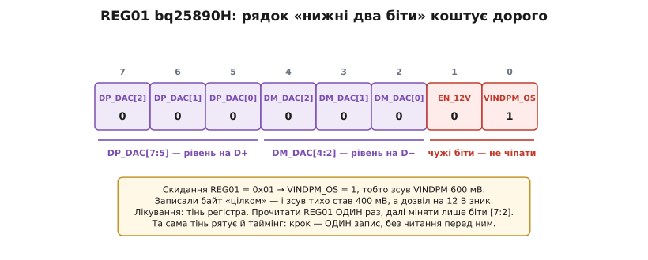
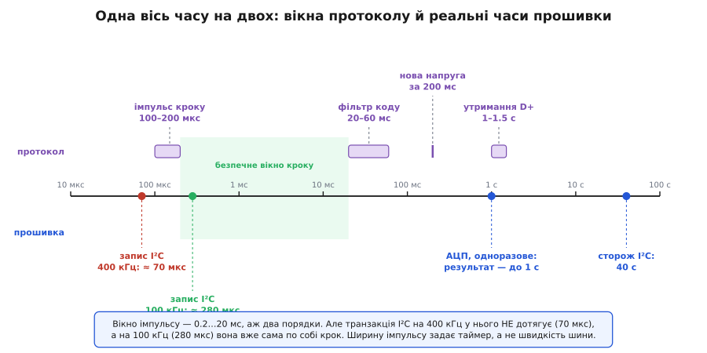
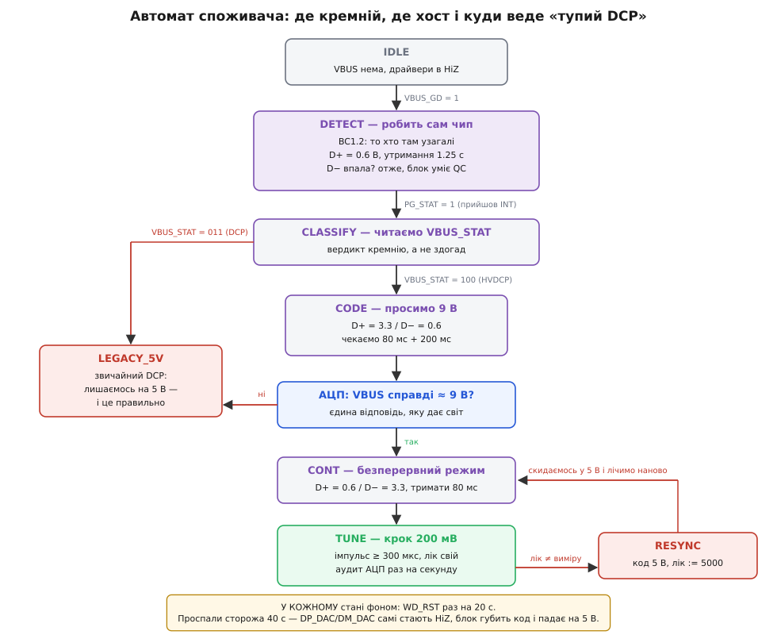

# ⚙️ Автомат HVDCP-споживача: код, що не вірить сам собі

Написати цю прошивку заважає одна обставина, і лежить вона не там, де її шукають. Не в таймінгах — таймінги виписані в даташиті до мілісекунди. Не в рівнях — рівень задає ЦАП одним записом у регістр. Заважає те, що **в каналі немає зворотного боку**. Ви кладете рівні на два дроти — і не отримуєте нічого. Ні підтвердження, ні коду помилки, ні можливості спитати «а яка зараз напруга?». Протокол уміє тільки говорити.

Через це головне рішення тут — не «як надіслати код», а **кому вірити**. Відповідь, до якої доводиться дійти, звучить незатишно: нікому. Зокрема й собі.

## Задача

Залізо звичайне для телефона чи будь-якого пристрою з літієвою коміркою: хост-мікроконтролер, [зарядний чип](topic:hw-power/charger-ic-architecture) **bq25890H** на шині [I²C](topic:com-devices/i2c), а по той бік шнура — QC3.0-блок Class A. Зарядний чип тут не просто понижувач: він сам уміє промацувати лінії даних, має власний АЦП на VBUS і власні драйвери D+/D−. Хост ним керує, а не заміняє його.

Від прошивки треба три речі, і третя — найважливіша:

1. Пройти шлях від «увімкнули в розетку» до «на VBUS стоїть потрібна напруга».
2. Утримувати цю напругу годину-півтори, поки йде заряд.
3. **Не зробити дурниці, коли в розетці звичайний тупий DCP** — а це найпоширеніший випадок із усіх.

Третій пункт варто одразу перестати сприймати як обробку помилки. Блок без Quick Charge — не збій і не виняток: це штатний, законний, найчастіший співрозмовник. Правильна поведінка з ним — лишитися на п'яти вольтах і спокійно заряджатися. Код, у якому ця гілка виглядає як `else { /* error */ }`, уже неправильний за задумом.

## Ідея: три опори

**Перша: це автомат, а не функція.** Спокуса написати рукостискання прямою послідовністю з `delay_ms()` величезна — і фатальна. Найдовша витримка тут — понад секунда. Секунда з чвертю, проведена всередині `delay_ms(1250)`, — це секунда з чвертю, коли пристрій не бачить, що шнур висмикнули, не годує сторожових таймерів, не міряє температуру. Тому автомат: явні стани, явний `qc_tick(now)`, час — **дані**, а не позиція в коді. Заразом це знімає ціле сімейство помилок, бо [скінченний автомат](topic:hw-digital/finite-state-machines) — це якраз спосіб зробити «де ми зараз» видимою величиною, яку можна надрукувати в лог, а не вивести з номера рядка.

**Друга: АЦП — це та відповідь, якої нема в протоколі.** Позаяк квитанції не існує, її треба **виготовити**. Єдиний спосіб дізнатися, чи блок вас узагалі почув, — подивитися на VBUS власним [АЦП](topic:hw-analog/adc). Це не перестраховка й не діагностика: це буквально єдиний зворотний зв'язок у всій системі. Кожне твердження прошивки про напругу мусить рано чи пізно впертися у вимір, інакше воно просто гіпотеза.

**Третя, і вона робить перші дві цікавими: квитанція повільна.** Одноразове перетворення АЦП у цього чипа готове **аж за секунду** (`tCONV`, максимум 1 с). Тобто вимір коштує довше, ніж усе рукостискання разом. Звідси конструкція, якої не вгадаєш наперед: **кроки йдуть відкритим циклом і швидко, а перевірка рідкісна й гуртова**. Ви робите сім кроків за двадцять мілісекунд — і аж за секунду дізнаєтесь, чи вони дійшли. Помилка стає видимою із запізненням на цілу вічність за мірками протоколу, і саме тому в автоматі мусить бути стан «скинутись і почати наново»: коли ви нарешті помітили, що збилися, доганяти вже нема сенсу.

## Рівні — це ЦАП, а не ніжка

Драйвер D+/D− у bq25890H — не GPIO. Це два незалежні джерела напруги з набором пресетів, і керує ними REG01. Ось повний набір кодів (даташит SLUSCC5A):

```
DP_DAC / DM_DAC   рівень на лінії      допуск
   000            HiZ — драйвер ВИМКНЕНО (це НЕ нуль вольтів)
   001            0 В                  −0.15 … +0.15
   010            0.6 В                0.5 … 0.7
   011            1.2 В
   100            2.0 В
   101            2.7 В
   110            3.3 В                3.15 … 3.45
   111            зарезервовано
```

Різниця між `000` і `001` — не формальність, і на ній спотикаються. **HiZ — це «я відпустив лінію», нуль вольтів — це «я тримаю лінію на нулі».** Коли треба прочитати, що на лінії робить блок, драйвер мусить бути в HiZ; коли треба назвати код напруги — мусить тримати рівень. Плутанина між ними дає плаваючу лінію там, де ви думали, що притиснули її до землі.

А тепер найдорожчий рядок даташита. REG01 — це **не** «два поля по три біти й досить»:


*У регістрі рівнів живуть двоє чужих: EN_12V і VINDPM_OS. Скидання REG01 = 0x01, тобто VINDPM_OS = 1. Сліпий запис байта обнуляє обидва — і зсув VINDPM тихо переїжджає з 600 мВ на 400 мВ.*

У бітах `[1:0]` сидять `EN_12V` (дозвіл вбудованій детекції просити дванадцять вольтів) і `VINDPM_OS` — зсув порога, нижче якого зарядник почне підбирати струм, щоб не просадити блок. До ліній даних вони не мають жодного стосунку. Але той, хто напише `write(REG01, (dp << 5) | (dm << 2))`, щоразу писатиме в них нулі. Нічого не зламається — просто зсув VINDPM стане 400 мВ замість 600 мВ, і пристрій почне поводитися трохи інакше на довгому шнурі. Симптом віддалений від причини рівно настільки, щоб його не пов'язали з рукостисканням.

Лікування очевидне — читати-модифікувати-писати. Але тут воно має несподівану ціну, і про неї нижче. Тому справжнє лікування інше: **тінь регістра**. Прочитати REG01 один раз, коли лінії переходять під владу хоста, далі тримати копію в пам'яті й міняти в ній лише біти `[7:2]`.

> 🔧 **Навіщо це.** Тінь регістра тут вирішує дві різні задачі одним прийомом, і це не збіг. Вона зберігає чужі біти — це коректність. І вона робить зміну рівня **однією транзакцією замість двох** — а це, як з'ясується за мить, питання безпеки: тривалість запису на шині безпосередньо задає ширину імпульсу на лініях даних.

## Половина автомата, якої ви не напишете

Тепер неприємне відкриття, яке переставляє всю архітектуру. Щоб провести рукостискання вручну, хост мусить **прочитати D−**: уся розмова тримається на тому, що блок у відповідь на утримання D+ притискає D− донизу. А bq25890H компаратора на D− хостові не показує. Драйвери — тільки на вихід. Прочитати рівень на лінії з-під I²C неможливо в принципі.

Спокусливо назвати це недоглядом. Насправді це межа відповідальності, і проведено її правильно. Річ у тім, що проба D− — не просто питання «чи вмієш ти Quick Charge?». Це **блокування безпеки**, і ось чому.

Звичайний DCP замикає D+ і D− перемичкою. За [BC1.2](topic:com-devices/legacy-charging-dialects) її опір — `RDCP_DAT`, і специфікація дозволяє йому бути будь-яким **від 200 Ом до нуля**: пряме коротке замикання цілком законне. Тепер уявіть, що ви, не перевіривши нічого, виставляєте код дев'яти вольтів — D+ на 3.3 В, D− на 0.6 В:

```
Два джерела напруги, замкнені перемичкою RDCP_DAT:

   RDCP_DAT = 200 Ом → I = (3.3 − 0.6) / 200 = 13.5 мА
   RDCP_DAT = 0 Ом   → I обмежене лише самими драйверами

Даташит нормує ЦАП за струму  I(DP) < 1 мА.
```

Тобто ви зустрічним чином садите два джерела одне на одне, і в законному найгіршому випадку — накоротко. Ось навіщо блок мусить **спершу розімкнути перемичку**, і ось чому пристрій зобов'язаний **побачити**, що D− упала, перш ніж торкатися рівнів. Проба D− — це не ввічливість. Це перевірка, що лінії більше не з'єднані й на них тепер безпечно класти різні напруги.

Звідси й архітектура, і вона не компроміс, а єдина чесна: **першу половину рукостискання робить кремній**. Вбудована детекція `AUTO_DPDM_EN` проганяє BC1.2, тримає D+ на 0.6 В свої 1.25 секунди, промацує D− власними компараторами — і кладе вердикт у `VBUS_STAT`. Хост підхоплює з готового вердикту й веде другу половину: коди напруги та INOV. Шов між ними проходить рівно там, де закінчується те, чого хост фізично не може зробити.

Якби компаратор на D− у вас був — окремий чип, дискретна схема, ніжка АЦП, — перша половина виглядала б так, і ці стани варто побачити, бо саме вони пояснюють, чому 1.25 секунди не можна ані скоротити, ані пропустити:

```c
case M_DCP_SEEN:                        /* BC1.2 сказав: перед нами DCP     */
    dpdm_set((struct code){ DAC_0V6, DAC_HIZ });   /* D+ тримаємо, D− слухаємо */
    go(M_DP_HOLD, now);
    break;

case M_DP_HOLD:
    if (now - t_mark < T_DP_HOLD_MS) break;        /* 1.25 с — і ані мілісекунди менше */
    go(M_DM_CHECK, now);
    break;

case M_DM_CHECK:
    /* Блок мав розімкнути перемичку й притягти D− донизу через ≈20 кОм.  */
    if (dm_below_325mv()) go(M_QC_YES, now);       /* перемичку знято: говорити безпечно */
    else                  go(M_QC_NO,  now);       /* мовчить → перемичка на місці → не чіпати */
    break;
```

Зверніть увагу на `DAC_HIZ` на D− у першому ж рядку: щоб почути відповідь, лінію треба відпустити. І на гілку `M_QC_NO` — вона нічого не «обробляє», вона просто йде геть від ліній.

## Дві шкали часу на одній осі

Перед кодом лишилося звести докупи головне. Протокол кодує зміст **тривалістю** — це відомо. Менш очевидно, що прошивка теж має свої тривалості: транзакція I²C, перетворення АЦП, сторожовий таймер. І ці дві шкали живуть на одній осі та стикаються.


*Вікна протоколу й реальні часи прошивки — не різні світи, а одна вісь. Імпульс кроку мусить бути довшим за фільтр кроку й коротшим за фільтр коду: вікно 0.2…20 мс. Транзакція I²C падає просто в лівий край цього вікна — на 400 кГц не дотягує, на 100 кГц уже сама по собі крок. АЦП повільніший за все рукостискання, а сторож переживе будь-яку витримку протоколу.*

Порахуймо, скільки триває зміна рівня:

**Приклад (ширина імпульсу задається шиною, а не вами).** Запис байта в регістр — це три байти на шині: адреса, номер регістра, дані. Кожен байт — вісім бітів плюс такт підтвердження:

```
транзакція запису = START + 3 × (8 біт + ACK) + STOP ≈ 27 тактів SCL

fSCL = 400 кГц → tтакт = 1 / (400 · 10³) = 2.5 мкс → 27 × 2.5 = 67.5 мкс ≈ 70 мкс
fSCL = 100 кГц → tтакт = 1 / (100 · 10³) = 10  мкс → 27 × 10  = 270  мкс ≈ 280 мкс

Фільтр кроку в блоці: 100 … 200 мкс.
```

Ось і висновок, за який варто заплатити увагою. На 100 кГц **сама транзакція вже довша за фільтр** — імпульс зарахують, навіть якщо ви не додасте жодної затримки. На 400 кГц вона в фільтр **не влазить** — і той самий код, який чудово крокував на повільній шині, почне тихо губити кроки на швидкій. Нічого не зламається помітно: просто напруга виявиться не тією, на яку ви розраховували, а лічильник про це не дізнається.

Тому ширину імпульсу задає **таймер**, а не швидкість шини. У коді нижче це `T_STEP_US = 300` — з запасом над верхньою межею фільтра, незалежно від `fSCL`.

А тепер порахуйте, у що обходиться read-modify-write у цьому ж місці:

```
читання регістра = START + 2 байти + ReSTART + 2 байти ≈ 36 тактів
read-modify-write = 36 + 27 = 63 такти

@ 400 кГц: 63 × 2.5 = 158 мкс        @ 100 кГц: 63 × 10 = 630 мкс
```

Кожен фронт імпульсу подорожчав удвічі, а головне — його тривалість тепер залежить від того, що коїться на шині. Саме тому тінь регістра з попереднього розділу — не оптимізація стилю: у гарячому шляху кроку читати не можна взагалі.

## Код

Автомат цілком. Стани, вердикт кремнію, гілка тупого DCP і аудит ліку — усе на місці:


*Шов проходить по `VBUS_STAT`: до нього — кремній із його 1.25 с і пробою D−, після — хост із кодами й кроками. Гілка «звичайний DCP» веде не в обробку помилки, а в штатний стан, де правильна дія — не робити нічого. Аудит АЦП раз на секунду — єдине місце, де лічильник зустрічається з дійсністю, а `RESYNC` — єдиний спосіб отямитись, бо перепитати напругу нема як.*

```c
/* ── bq25890H: карта регістрів (даташит SLUSCC5A) ─────────────────────── */
#define BQ_ADDR   0x6A          /* 7-бітна адреса на шині                  */

#define REG01     0x01          /* DP_DAC[7:5] | DM_DAC[4:2] | EN_12V | VINDPM_OS */
#define REG02     0x02          /* CONV_START | CONV_RATE | … | AUTO_DPDM_EN */
#define REG03     0x03          /* … | WD_RST(6) | …                        */
#define REG0B     0x0B          /* VBUS_STAT[7:5] | CHRG_STAT[4:3] | PG_STAT(2) */
#define REG11     0x11          /* VBUS_GD(7) | VBUSV[6:0]                  */

#define REG01_DPDM      0xFCu   /* біти [7:2] — наші; [1:0] — ЧУЖІ         */
#define REG02_CONV_RATE (1u << 6)
#define REG03_WD_RST    (1u << 6)
#define REG0B_PG_STAT   (1u << 2)
#define REG11_VBUS_GD   (1u << 7)

#define VBUS_STAT_DCP    3u     /* звичайний DCP: високої напруги не буде   */
#define VBUS_STAT_HVDCP  4u     /* «Adjustable High Voltage DCP» — уміє     */

/* Стеля САМЕ цього чипа: VBUS_OP = 3.9 … 14 В. Двадцять вольтів — смерть. */
#define QC_VBUS_MAX_MV  12000
#define QC_VBUS_MIN_MV   3600   /* нижня межа безперервного режиму QC3.0    */

/* ── Пресети драйвера D+/D− ───────────────────────────────────────────── */
enum dac {
    DAC_HIZ = 0,  /* 000 — драйвер вимкнено; це НЕ нуль вольтів            */
    DAC_0V0 = 1,  /* 001 — 0 В    (−0.15 … +0.15)                          */
    DAC_0V6 = 2,  /* 010 — 0.6 В  (0.5 … 0.7)                              */
    DAC_1V2 = 3,  /* 011 — 1.2 В                                           */
    DAC_2V0 = 4,  /* 100 — 2.0 В                                           */
    DAC_2V7 = 5,  /* 101 — 2.7 В                                           */
    DAC_3V3 = 6,  /* 110 — 3.3 В  (3.15 … 3.45)                            */
};

struct code { enum dac dp, dm; };

static const struct code CODE_5V   = { DAC_0V6, DAC_0V0 };  /* D− у нуль, не в HiZ */
static const struct code CODE_9V   = { DAC_3V3, DAC_0V6 };
static const struct code CODE_CONT = { DAC_0V6, DAC_3V3 };  /* безперервний режим  */
/* CODE_20V = {DAC_3V3, DAC_3V3} свідомо НЕ оголошено: див. «Пастки».      */

/* ── Витримки: усі в одному місці, жодного «магічного» delay в коді ───── */
#define T_DP_HOLD_MS      1300  /* утримання D+ 0.6 В (специфікація 1000…1500):
                                   потрібне лише ручному шляху — тут його
                                   відлічує кремній, і це єдина причина,
                                   чому автомат нижче такий короткий        */
#define T_MODE_MS           80  /* фільтр коду 20…60 мс + запас             */
#define T_NEW_REQUEST_MS   200  /* блок мусить дійти до нової напруги       */
#define T_ADC_PERIOD_MS   1000  /* CONV_RATE=1: свіжий вимір раз на секунду */
#define T_VERIFY_MS  (T_MODE_MS + T_NEW_REQUEST_MS + T_ADC_PERIOD_MS)
#define T_STEP_US          300  /* імпульс кроку; фільтр блока 100…200 мкс  */
#define T_STEP_SETTLE_MS     3  /* усталення напруги після фронту (≈2 мс)   */
#define T_WD_KICK_MS     20000  /* сторож 40 с — годуємо вдвічі частіше     */
#define T_AUDIT_MS        1000  /* як часто звіряти лік із виміром          */

/* ── Формування рівнів: тінь регістра, рівно одна транзакція ──────────── */
static uint8_t reg01;           /* читаємо ОДИН раз, далі тільки пишемо    */

static int dpdm_sync(void) { return bq_read(REG01, &reg01); }

static int dpdm_set(struct code c) {
    reg01 = (uint8_t)((reg01 & ~REG01_DPDM)
                      | ((uint8_t)c.dp << 5) | ((uint8_t)c.dm << 2));
    return bq_write(REG01, reg01);
}

/* ── Вимір VBUS: REG11, зсув 2600 мВ, крок 100 мВ, стеля 15300 мВ ─────── */
static int vbus_mv(int *out) {
    uint8_t r;
    if (bq_read(REG11, &r) < 0) return -1;
    *out = (r & REG11_VBUS_GD) ? 2600 + (r & 0x7F) * 100 : 0;
    return 0;
}

/* ── Кроки INOV ───────────────────────────────────────────────────────── */
/* Угору: короткий фронт на D+. На час імпульсу на лініях стоїть 3.3/3.3 —
   код ДВАДЦЯТИ вольтів. Рятує лише те, що це ненадовго.                  */
static void step_up(void) {
    dpdm_set((struct code){ DAC_3V3, DAC_3V3 });
    delay_us(T_STEP_US);
    dpdm_set((struct code){ DAC_0V6, DAC_3V3 });
    delay_ms(T_STEP_SETTLE_MS);
}

/* Униз: дзеркальний фронт на D−; на час імпульсу — код дванадцяти вольтів. */
static void step_down(void) {
    dpdm_set((struct code){ DAC_0V6, DAC_0V6 });
    delay_us(T_STEP_US);
    dpdm_set((struct code){ DAC_0V6, DAC_3V3 });
    delay_ms(T_STEP_SETTLE_MS);
}

/* ── Автомат ──────────────────────────────────────────────────────────── */
enum st { S_IDLE, S_DETECT, S_CLASSIFY, S_VERIFY, S_CONT, S_TUNE, S_LEGACY, S_RESYNC };

struct qc {
    enum st  st;
    uint32_t t_mark, t_wd, t_audit;
    int      belief_mv;     /* НАШ лік. У протоколі його не існує.         */
    int      target_mv;
};

static void go(struct qc *q, enum st s, uint32_t now) { q->st = s; q->t_mark = now; }
static int  gap(int a, int b) { return a > b ? a - b : b - a; }

void qc_init(struct qc *q, uint32_t now) {
    uint8_t r;
    /* Безперервний АЦП: свіжий VBUS раз на секунду, без опитувань.
       Увага: перший же запис переводить чип у host mode — і вмикає сторожа. */
    if (bq_read(REG02, &r) == 0) bq_write(REG02, (uint8_t)(r | REG02_CONV_RATE));
    q->st = S_IDLE;
    q->t_mark = q->t_wd = q->t_audit = now;
    q->belief_mv = 0;
    q->target_mv = 6400;
}

void qc_tick(struct qc *q, uint32_t now) {
    uint8_t r;
    int mv;

    /* Сторож не залежить від стану — годуємо його поза автоматом. */
    if (now - q->t_wd >= T_WD_KICK_MS) {
        if (bq_read(REG03, &r) == 0) bq_write(REG03, (uint8_t)(r | REG03_WD_RST));
        q->t_wd = now;
    }

    /* Шнур можуть висмикнути в БУДЬ-ЯКОМУ стані — і це не помилка. */
    if (q->st != S_IDLE && bq_read(REG11, &r) == 0 && !(r & REG11_VBUS_GD)) {
        q->belief_mv = 0;
        go(q, S_IDLE, now);
        return;
    }

    switch (q->st) {

    case S_IDLE:
        if (bq_read(REG11, &r) == 0 && (r & REG11_VBUS_GD)) go(q, S_DETECT, now);
        break;

    case S_DETECT:
        /* Ті самі 1.25 с відлічує кремній: BC1.2, утримання D+, проба D−.
           Хостові лишається дочекатися вердикту — або здатися.            */
        if (bq_read(REG0B, &r) == 0 && (r & REG0B_PG_STAT)) go(q, S_CLASSIFY, now);
        else if (now - q->t_mark > 3000) { q->belief_mv = 5000; go(q, S_LEGACY, now); }
        break;

    case S_CLASSIFY:
        if (bq_read(REG0B, &r) < 0) break;
        if (dpdm_sync() < 0) break;         /* тінь REG01 — рівно тут, один раз */
        if ((r >> 5) == VBUS_STAT_HVDCP) {
            dpdm_set(CODE_9V);
            q->belief_mv = 9000;
            go(q, S_VERIFY, now);
        } else {
            /* DCP/SDP/CDP: лінії або замкнені перемичкою, або зайняті даними.
               Драйвери — в HiZ, і руки геть.                              */
            dpdm_set((struct code){ DAC_HIZ, DAC_HIZ });
            q->belief_mv = 5000;
            go(q, S_LEGACY, now);
        }
        break;

    case S_VERIFY:
        /* Фільтр коду + перехід блока + ЦІЛИЙ період АЦП: раніше REG11
           покаже старе значення, і «перевірка» перевірить минуле.         */
        if (now - q->t_mark < T_VERIFY_MS) break;
        if (vbus_mv(&mv) < 0) break;
        if (gap(mv, 9000) < 1000) {
            dpdm_set(CODE_CONT);
            go(q, S_CONT, now);
        } else {
            /* Просили дев'ять, стоїть п'ять. Хоч що казав VBUS_STAT — це не HVDCP. */
            dpdm_set(CODE_5V);
            q->belief_mv = 5000;
            go(q, S_LEGACY, now);
        }
        break;

    case S_CONT:
        /* Не вгадуємо, з якої напруги почався безперервний режим, — питаємо.
           Це ЄДИНЕ місце, де лік можна засіяти правдою, а не здогадом.    */
        if (now - q->t_mark < T_MODE_MS + T_ADC_PERIOD_MS) break;
        if (vbus_mv(&mv) < 0) break;
        q->belief_mv = mv;
        q->t_audit = now;
        go(q, S_TUNE, now);
        break;

    case S_TUNE:
        /* Один крок на такт: 200 мВ — це 3 мс роботи, а не 3 мс чекання.  */
        if (q->belief_mv + 100 < q->target_mv && q->belief_mv < QC_VBUS_MAX_MV) {
            step_up();   q->belief_mv += 200;  break;
        }
        if (q->belief_mv - 100 > q->target_mv && q->belief_mv > QC_VBUS_MIN_MV) {
            step_down(); q->belief_mv -= 200;  break;
        }
        /* Ціль досягнуто — за НАШИМ ліком. Раз на секунду питаємо світ.   */
        if (now - q->t_audit >= T_AUDIT_MS) {
            q->t_audit = now;
            if (vbus_mv(&mv) == 0 && gap(mv, q->belief_mv) > 600) {
                dpdm_set(CODE_5V);            /* єдиний спосіб отямитись   */
                q->belief_mv = 5000;
                go(q, S_RESYNC, now);
            }
        }
        break;

    case S_RESYNC:
        if (now - q->t_mark < T_MODE_MS + T_NEW_REQUEST_MS) break;
        dpdm_set(CODE_CONT);
        go(q, S_CONT, now);
        break;

    case S_LEGACY:
        /* Нічого не робимо — і це вся робота. П'ять вольтів теж заряджають. */
        break;
    }
}
```

Два місця в цьому коді варті окремого погляду, бо вони й є вся стаття.

Перше — `S_CONT`. Це єдиний стан, де `belief_mv` **засівається виміром**. Скрізь інде лічильник — гіпотеза, і тільки тут, увійшовши в безперервний режим, ми чесно питаємо: то з якої напруги ми взагалі стартуємо? Спокуса написати `belief_mv = 9000` тому, що ми ж щойно просили дев'ять, — і є тим самим сліпим лічильником, з якого починаються всі подальші біди.

Друге — `S_LEGACY` із порожнім тілом. Порожнє тіло тут не заглушка й не «дороблю потім». Це найчастіший режим роботи пристрою в реальному світі, і правильна дія в ньому — жодної.

## Складність і пастки

**Імпульс, що затягнувся, — це не втрачений крок, а запит двадцяти вольтів.** Найсерйозніша пастка ховається в `step_up()`. Подивіться, що стоїть на лініях між двома записами: D+ 3.3 В, D− 3.3 В. За таблицею кодів це **двадцять вольтів**. Крок від коду відрізняє тільки тривалість: сплеск на сотні мікросекунд зарахують як 200 мВ, а те саме, витримане понад фільтр коду (20…60 мс), — як команду подати 20 В. Тепер уявіть, що між двома `dpdm_set()` вклинилося переривання, або планувальник RTOS зняв задачу, або I²C розтягнув такти чи програв арбітраж іншому майстрові. Ваш крок на 200 мВ перетворюється на запит двадцяти вольтів — а вхід чипа тримає чотирнадцять. Тому пара записів у `step_up()` — критична секція в найпрямішому сенсі: між ними не можна пускати нікого. І тому `CODE_20V` у цьому коді свідомо не оголошено: код, якого нема, не можна надіслати помилково — а на Class A-блоці та сама осічка дасть «лише» дванадцять, на Class B — рівно двадцять.

> 🔧 **Навіщо це.** Ось практичний висновок, вартий усього розділу: ієрархія витримок у протоколі збігається з ієрархією ціни помилки — і це означає, що **будь-яка затримка у вашому коді зсуває зміст повідомлення в бік небезпечнішого**. Не в бік «не спрацювало». Проспали мікросекунди — сказали не те, що хотіли; проспали мілісекунди — сказали найстрашніше з можливого. Тому тут немає нешкідливих затримок: кожна зайва мілісекунда рухає повідомлення в один-єдиний бік.

**Сторож з'їдає рівні через сорок секунд.** Перший же запис у будь-який регістр переводить bq25890H із default mode у host mode — і з цієї миті ви зобов'язані бити `WD_RST` частіше, ніж раз на 40 секунд (це скидання `WATCHDOG[5:4] = 01`). Прогавили — чип повертається в default mode, і всі регістри, **крім** `IINLIM`, `VINDPM`, `VINDPM_OS`, `BATFET_RST_EN`, `BATFET_DLY` й `BATFET_DIS`, скидаються в типове. Тобто `DP_DAC`/`DM_DAC` самі стають HiZ, блок губить код на лініях — і напруга падає на п'ять вольтів. Симптом виходить фантастично оманливий: пристрій кожні сорок секунд провалюється на 5 В і повзе вгору знову, і виглядає це як хвороба протоколу. Насправді це вчасно не нагодований сторожовий таймер. Зверніть увагу й на протилежний бік списку винятків: `IINLIM` **переживає** скидання, тож обмеження струму лишиться вашим — плутати ці два симптоми не варто.

**Тінь регістра теж може протухнути.** Логічний наслідок попереднього: якщо сторож усе-таки спрацював, `reg01` у пам'яті більше не описує кремній. Тому після кожної підозри на `WATCHDOG_FAULT` тінь треба перечитати `dpdm_sync()`, а не довіряти копії. Це той самий принцип, що й з `belief_mv`: будь-яка модель світу всередині прошивки має термін придатності.

**`PUMPX` — це не крок QC3.0.** У тому ж чипі є біти `EN_PUMPX`, `PUMPX_UP`, `PUMPX_DN`, і назви прямо просяться: ось же, «підняти напругу». Не піддавайтеся. Це Current Pulse Control Protocol — зовсім інша річ: він імпульсно смикає **обмеження вхідного струму** між `IINLIM` і 100 мА, і так розмовляє з адаптерами, що слухають струм, а не лінії даних. До D+/D− він не має жодного стосунку. Увімкнувши його «за компанію», ви отримаєте загадкові провали струму посеред заряду.

**Стеля АЦП нижча за стелю протоколу.** `VBUSV[6:0]` міряє від 2.6 В до 15.3 В. Тобто двадцять вольтів цей чип не те що не переживе — він їх навіть **не покаже**: вимір упреться в 15.3 і мовчки збреше. Ще один аргумент на користь того, щоб код 20 В у прошивці просто не існував.

**Не плутайте «блок дійшов» із «блок мене почув».** Витримка `T_NEW_REQUEST_MS` каже, за скільки блок мусить дійти до нової напруги. Але період АЦП — секунда. Прочитавши REG11 через 280 мс після зміни коду, ви з великою ймовірністю побачите **попереднє** значення й вирішите, що блок не відповів. Звідси `T_VERIFY_MS`, у якому додано цілий період перетворення. Це найдешевша й найчастіша помилка в такому коді: перевірка, що перевіряє минуле.

**Безперервний АЦП не безкоштовний.** `CONV_RATE = 1` тримає ввімкненим REGN LDO і піднімає струм спокою. Для телефона, який і так заряджається, це нічого; для пристрою, що вимірює VBUS у сплячці, — привід перейти на одноразові перетворення й змиритися з їхньою секундою.

**І головне, що варто забрати з усього цього.** Щоразу, коли код тут щось перевіряє, він перевіряє не протокол, а **самого себе**. Протокол не бреше — він просто мовчить. Брешуть наші уявлення: `belief_mv`, тінь `reg01`, віра в те, що записаний байт долетів. Прошивка, яка це визнає й регулярно звіряється з єдиним фізичним фактом, до якого має доступ, — виміряною напругою на VBUS, — працює. Прошивка, яка вірить власному лічильникові, працює теж — рівно доти, доки один імпульс не загубиться. А він загубиться.
