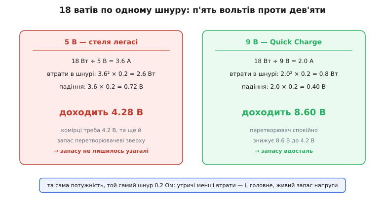
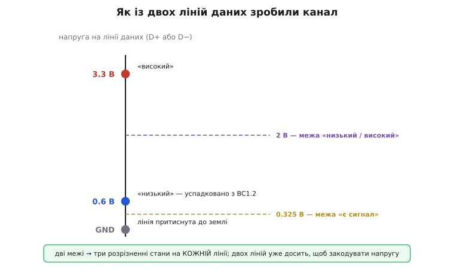
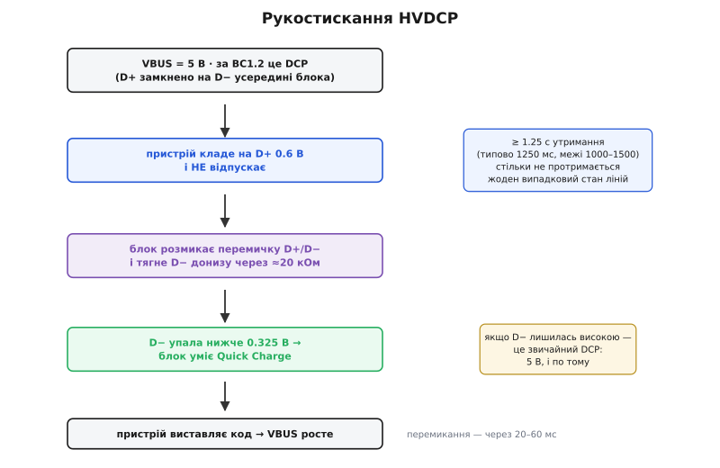
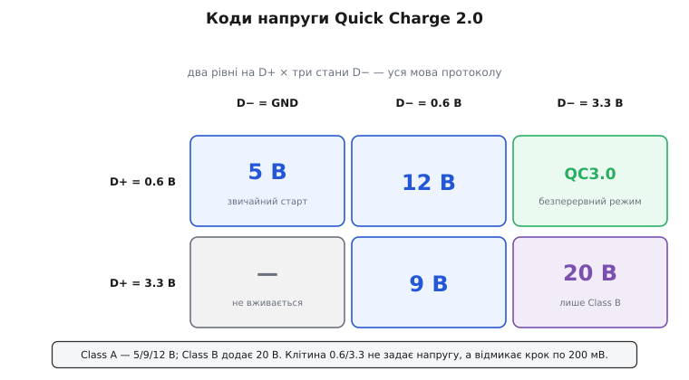
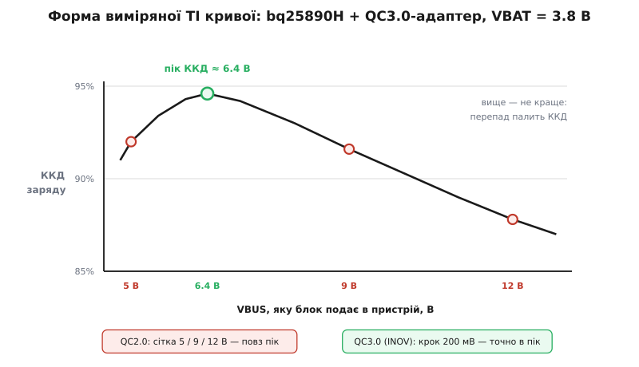

# Quick Charge: протокол швидкої зарядки Qualcomm

<preknowlist>
- [Легасі-зарядка: BC1.2 і кодування D+/D−](topic:com-devices/legacy-charging-dialects) — три типи портів, DCP із замкненими наскрізь D+ і D−, проба лінії напругою 0.6 В. Quick Charge виростає просто з цього механізму.
- [Понижувальний перетворювач](topic:hw-power/buck) — як із вищої напруги роблять нижчу і чому його ККД залежить від перепаду між входом і виходом.
- [Заряджання літію: CC/CV](topic:hw-power/li-ion-charger) — комірка хоче заданий струм при напрузі близько 3.4–4.4 В, а не «скільки дадуть».
- [Прискорений заряд літію](topic:hw-power/fast-charging) — навіщо потрібна більша потужність і чому її вигідно підводити високою напругою.
- [USB Power Delivery](topic:com-devices/usb-pd) — стандартний спосіб домовитися про напругу лініями CC; саме туди Quick Charge зрештою й перейшов.
</preknowlist>

### Стеля в сім із половиною ватів

BC1.2 навчив пристрій упізнавати зарядний блок і брати з нього півтора ампера. При п'яти вольтах це 7.5 вата — і рівно тут легасі-світ закінчується. Батареї тим часом виросли до трьох тисяч мА·год, а вимога стала інша: не «зарядись за ніч», а «зарядись за годину». Треба вдвічі-втричі більше, а потужність — це добуток `P = U × I`. Отже, виходів рівно два: більший струм або вища напруга.

Струм програє, і програє двічі — краще один раз порахувати, ніж міркувати абстрактно.

**Приклад (18 ватів по одному шнуру).** Кабель разом із роз'ємами має опір близько 0.2 Ом (туди й назад; для дешевого шнура це ще оптимістично):

```
P = 18 Вт,  Rшнура = 0.2 Ом

при 5 В:   I = 18 / 5  = 3.6 А
           втрати  = 3.6² × 0.2 = 2.6 Вт    (14% потужності — у шнур)
           падіння = 3.6 × 0.2  = 0.72 В
           доходить: 5 − 0.72   = 4.28 В

при 9 В:   I = 18 / 9  = 2.0 А
           втрати  = 2.0² × 0.2 = 0.8 Вт    (4.4%)
           падіння = 2.0 × 0.2  = 0.40 В
           доходить: 9 − 0.40   = 8.60 В
```

Перша поразка очевидна: втрати квадратичні, тож менший струм ріже їх непропорційно сильно — 2.6 вата проти 0.8. Друга поразка цікавіша, і саме вона вирішує справу. Погляньте на останній рядок кожного стовпчика. При п'яти вольтах до пристрою доходить **4.28 В** — а зарядженій літієвій комірці треба 4.2 В, та ще й понижувачеві потрібен запас зверху, бо знижувати він уміє, а підіймати ні. Тобто п'ятивольтовий світ упирається навіть не в ККД, а в звичайну арифметику: напруги фізично не лишилось, щоб долити останні відсотки. Дев'ять вольтів приходять як 8.6 В — знижуй скільки заманеться.


*Ліворуч п'ять вольтів: 3.6 ампера палять у шнурі 2.6 вата, а до пристрою доходить 4.28 В — менше, ніж треба комірці разом із запасом на перетворювач. Праворуч дев'ять вольтів: удвічі менший струм, утричі менші втрати, і 8.6 В, з яких є що знижувати. Напрям вибрано не заради ККД, а тому, що інакше просто не вистачає напруги.*

> 🔧 **Навіщо це.** Ця пара рядків — відповідь на питання, чому «швидкі» блоки не роблять просто потужнішими на п'яти вольтах. Проєктуючи вхід свого пристрою, рахуйте не потужність, а **напругу, що доходить під повним струмом**: якщо на роз'ємі під навантаженням лишається 4.3 В, жоден понижувач не зробить із них 4.2 В із запасом, хоч би скільки ватів обіцяв блок.

### Як сказати безмозкому блокові «дай дев'ять»

Напрям ясний, а от задача — ні. Виділений зарядний блок (DCP) — це перетворювач із розетки в п'ять вольтів і роз'єм; процесора в ньому нема, домовлятися нема з ким. Єдине, що з'єднує його з пристроєм, крім живлення й землі, — дві лінії даних, і в DCP вони просто **замкнені перемичкою**: увесь його «словниковий запас» — це «я зарядка».

Qualcomm зробив із цієї перемички канал зв'язку. Сталося це не одразу: перше покоління — **Quick Charge 1.0** (2013) — високих напруг іще не знало, воно лише дозволило брати 2 А при тих самих п'яти вольтах, тобто 10 Вт, і вперлося в ту саму стелю. Напругою заграв уже наступник, **Quick Charge 2.0** (2014), і саме звідти походить усе, про що йдеться далі. Ідея пряма: хай блок не просто німо замикає лінії, а **слухає**, які напруги пристрій на них кладе, і перемикає свій вихід. Клас таких блоків так і назвали — **HVDCP** (*High Voltage Dedicated Charging Port* — виділений зарядний порт із високою напругою). Назва точна й важлива: з погляду BC1.2 QC-блок лишається **звичайним DCP**. Тому старий телефон, який про Quick Charge не чув, вмикається в такий блок і спокійно заряджається своїми п'ятьма вольтами: він ніколи не спитає більшого, а блок сам нічого не підійме.

### Дві лінії, три стани

Щоб канал узагалі був, треба спершу домовитись, які рівні на лінії вважати різними. Тут і криється перша елегантність: блок читає кожну лінію **не одним компаратором, а двома**. Перший стоїть на **0.325 В** — це знайома з BC1.2 межа «на лінії взагалі щось є». Другий — на **2 В**: він ділить це «щось» на низьке й високе. Дві межі дають на одній лінії **три** розрізненні стани замість двох:

```
< 0.325 В       → GND: лінію притиснуто до землі
0.325 … 2 В     → «низький», робоче значення 0.6 В
> 2 В           → «високий», робоче значення 3.3 В
```

Робочі рівні 0.6 і 3.3 В вибрано не навмання: кожен сидить із добрим запасом посередині своєї смуги, тож ані шум, ані витік крізь резистор стану не переплутають. А 0.6 В ще й узято готовим — це та сама напруга, якою BC1.2 промацує лінії. Отже, пристрій, що вже вміє легасі-детекцію, уміє й половину заліза Quick Charge.


*Дві межі на одній лінії — 0.325 В («є сигнал») і 2 В («низький чи високий») — розрізняють три стани замість двох: земля, 0.6 В і 3.3 В. Робочі рівні стоять посередині своїх смуг, тож читаються надійно, а 0.6 В успадковано просто з BC1.2. Двох таких ліній уже досить, щоб закодувати напругу.*

Тепер порахуймо, скільки в такому каналі місця. Дві лінії по три стани — дев'ять комбінацій; реально вживають шість (D+ ніколи не притискають до землі), і п'ять із них щось означають. Небагато — але ж і сказати треба всього-на-всього, яку напругу дати.

### Рукостискання: чому цілих 1.25 секунди

Найцікавіше в протоколі — не як передати код, а як **не передати його випадково**. Ціна помилки різко несиметрична: якщо блок підійме напругу до 12 В там, де на неї не чекали, він подасть дванадцять вольтів у вхід, розрахований на п'ять. Це не «трохи неоптимально» — це смерть пристрою. Тому все побудовано так, щоб напруга росла **лише** тоді, коли обидві сторони цього напевно хотіли.

Послідовність така:

1. VBUS з'явилась як 5 В. Пристрій робить звичайну пробу BC1.2 й бачить DCP.
2. Пристрій кладе на D+ рівень 0.6 В — і **тримає**. Не імпульс, не проба: тримає щонайменше **1.25 секунди** (у даташитах це час фільтра сплеску D+ — типово 1250 мс, з допуском 1000–1500).
3. Блок, якщо він уміє QC, за цією ознакою розуміє: у нього просять високої напруги. Він **розмикає** свою перемичку між D+ і D− та притискає D− донизу через резистор близько 20 кОм.
4. Пристрій бачить, що D− упала нижче 0.325 В, — це відповідь «так, я вмію». Якби перед ним був звичайний тупий DCP, лінії лишилися б замкненими, і D− тримала б ті самі 0.6 В, що й D+. Мовчання теж відповідь: лишаємось на п'яти вольтах.
5. Далі пристрій виставляє на дві лінії потрібний код, а блок перемикає вихід, витримавши власний фільтр 20–60 мс.

І тепер видно, навіщо ті 1.25 секунди. Це не затримка й не забаганка — це **запобіжник**. Секунда з чвертю статичного, нетипового рівня на лінії даних — те, чого не буває випадково: ані перехідний процес під час вмикання, ані брязкіт контактів, ані залишки справжнього обміну даними стільки не протримаються. Довге утримання — єдиний спосіб сказати «я не збився, я справді цього хочу» каналом, у якому нема ні контрольних сум, ні адрес. Протокол купує безпеку **часом**, бо більше йому нема чим платити.


*Спершу все як у BC1.2 — п'ять вольтів і DCP. Далі пристрій тримає на D+ 0.6 В понад 1.25 с; блок відповідає тим, що розмикає перемичку й тягне D− донизу через ≈20 кОм. Упала D− нижче 0.325 В — блок уміє Quick Charge; лишилась високою — це звичайний DCP, і розмова скінчена. Довге утримання тут працює запобіжником: ціна хибного спрацювання — 12 В у п'ятивольтовому вході.*

### Код напруги

Після рукостискання лишається назвати число. Уся мова протоколу вміщається в п'ять рядків:

```
   D+        D−         вихід блока
  0.6 В     GND         5 В
  3.3 В     0.6 В       9 В
  0.6 В     0.6 В       12 В
  3.3 В     3.3 В       20 В       (лише Class B)
  0.6 В     3.3 В       безперервний режим (QC3.0)
```

Блоки ділять на два класи: **Class A** тримає 5/9/12 В — це весь телефонний світ; **Class B** додає 20 В і трапляється значно рідше. Контролери всередині блоків мають окремий вхід, що взагалі забороняє високі щаблі, — щоб той самий кристал ставили і в дванадцятивольтовий блок, і в скромніший, який фізично не вміє більше за дев'ять.


*Два рівні на D+ проти трьох станів D− дають шість клітин, п'ять із яких зайняті. Одна клітина випадає з ряду: 0.6/3.3 не називає напругу, а відмикає безперервний режим QC3.0 — саме крізь неї протокол і виріс за межі чотирьох щаблів.*

> 🔧 **Навіщо це.** У даташиті будь-якого зарядного чипа з підтримкою QC ви побачите рівно ці числа: пресети 0.6/3.3 В на виході драйвера D+/D− і пороги 0.325/2 В на вході. Коли «швидка зарядка не вмикається», міряти треба саме їх — і надто часто виявляється, що якийсь дільник чи захисна збірка на платі підтягує лінію не туди, і замість 0.6 В там 1.1 чи 0.3, тобто стан читається неправильно. Протокол при цьому справний, а телефон сумлінно лишається на п'яти вольтах.

### QC3.0: пік, повз який б'є сітка 5/9/12

Здається природним, що чим вища напруга, тим краще: менші втрати в шнурі. Це неправда — і саме на цьому будується наступне покоління.

Річ у тім, що напруга з блока не потрапляє в комірку прямо: між ними стоїть [понижувач](topic:hw-power/buck), і його ККД **падає з перепадом**. Чим більша різниця між входом і виходом, тим менша частка періоду, коли ключ відкритий, тим більшу частку роботи роблять перемикання, а не корисне перенесення заряду. Дев'ять вольтів економлять у шнурі — і палять у самому пристрої, до того ж просто біля батареї, де тепло найшкідливіше.

Отже, є що економити в кабелі й що втрачати в перетворювачі — а це означає, що десь між ними лежить **оптимум**. Його не треба вгадувати: TI його виміряла — зарядний чип bq25890H, справжній QC3.0-адаптер, комірка при 3.8 В. ККД має пік близько **6.4 В** і далі спадає аж до дванадцяти.


*За виміром TI ККД заряду не росте з напругою, а має пік — при комірці 3.8 В він припадає десь на 6.4 В і далі спадає. Груба сітка QC2.0 у цей пік не влучає: п'ять вольтів — замало запасу, дев'ять — уже за піком. Крок 200 мВ у QC3.0 дозволяє стати саме туди, де крива найвища.*

Тепер ясно, що не так із сіткою 5/9/12: у ній просто **нема** значення біля піку. П'ять — замало: під повним струмом на роз'ємі не лишається запасу на перетворювач. Дев'ять — уже за піком. Хоч що вибери, кілька відсотків ККД лишаються на столі, а кілька відсотків від двадцяти ватів — це десяті частки вата тепла рівно там, де його найменше хочеться. Чому оптимум лежить саме там і як він рухається, [видно з двох доданків втрат](topic:com-devices/quick-charge/math-hvdcp-optimum.md): втрати в шнурі спадають як `1/V²`, втрати перетворювача ростуть із перепадом, а сума має мінімум.

**Quick Charge 3.0** (2015) закриває дірку **дрібнішою сіткою**. Механізм названо **INOV** (*Intelligent Negotiation for Optimum Voltage* — розумне узгодження оптимальної напруги), і працює він так: код 0.6/3.3 не задає напругу, а **відмикає безперервний режим**, у якому напругу рухають по одному кроку **200 мВ** у діапазоні від 3.6 до 20 В (Class B; Class A — до 12 В). Крок угору — короткий імпульс на D+ (0.6 → 3.3 → 0.6); крок униз — дзеркальний імпульс на D− (3.3 → 0.6 → 3.3).

Тут варто зупинитися й побачити, **що саме** це за канал, бо в ньому весь характер QC3.0. Напругу не називають — її **накручують**. Це лічильник, а не адреса: щоб із п'яти вольтів дійти до дев'яти, треба надіслати двадцять імпульсів і вірити, що блок нарахував рівно двадцять. Абсолютного значення в протоколі не існує взагалі, тож обидві сторони мусять тримати спільний лік у голові. Загубив синхронізацію — і ти більше не знаєш, яку напругу подаєш; єдиний спосіб отямитись — скинутися в п'ять вольтів і почати спочатку.

### Тривалість як третій вимір

Придивімося до імпульсу кроку уважніше — і протокол клацне на місце. Щоб штовхнути напругу вгору, пристрій на мить піднімає D+ до 3.3 В, тимчасом як D− лишається на 3.3 В. Але ж 3.3/3.3 — це, за таблицею, код **двадцяти вольтів**! Чому блок не перемикається на 20 В?

Бо його розрізняє **тривалість**. Короткий сплеск блок міряє фільтром на сотню-дві мікросекунд і зараховує як **крок**; щоб той самий рівень прочитали як **код напруги**, його треба втримати десятки мілісекунд. Одні й ті самі два дроти, одні й ті самі рівні — а зміст задає час:

```
≈ 100–200 мкс утримання   → один крок 200 мВ
≈ 20–60 мс                → зміна коду напруги / режиму
≈ 1250 мс                 → «я взагалі говорю мовою Quick Charge»
```

Ось де ховається справжня конструкція протоколу. Двох ліній із трьома станами замало, щоб і назвати напругу, і крокувати, і безпечно почати розмову. Тому канал розширили **не третім дротом, а часом**: чим довше тримаєш, тим серйозніше твоє твердження. Мікросекунди — дрібна поправка; мілісекунди — нова напруга; понад секунда — найнебезпечніша заява з усіх, після якої в роз'ємі може з'явитися дванадцять вольтів. Ієрархія витримок точно повторює ієрархію ціни помилки, і в цьому вся інженерна чесність рішення.

**Приклад (крок угору в безперервному режимі).** Рівні на лініях задає ЦАП зарядного чипа — беремо реальну карту регістрів bq25890H, де REG01 тримає пресети драйвера D+/D−:

```c
// Пресети драйвера D+/D− (bq25890H, REG01: DP_DAC[7:5], DM_DAC[4:2]).
enum dac { DAC_HIZ = 0, DAC_0V0 = 1, DAC_0V6 = 2, DAC_1V2 = 3,
           DAC_2V0 = 4, DAC_2V7 = 5, DAC_3V3 = 6 };

#define REG01 0x01

static void dp_dm_set(enum dac dp, enum dac dm) {
    uint8_t v = (uint8_t)((dp << 5) | (dm << 2));
    i2c_write_reg(CHG_ADDR, REG01, v);
}

// Вхід у безперервний режим: D+ = 0.6 В, D− = 3.3 В (рядок таблиці кодів).
static void qc3_enter_continuous(void) {
    dp_dm_set(DAC_0V6, DAC_3V3);
    delay_ms(100);              // фільтр зміни режиму 20–60 мс + запас
}

// Крок +200 мВ: короткий імпульс на D+ (0.6 → 3.3 → 0.6).
// Утримати треба довше за фільтр кроку, але НАБАГАТО коротше за фільтр режиму,
// інакше 3.3/3.3 прочитають як код 20 В.
static void qc3_step_up(void) {
    dp_dm_set(DAC_3V3, DAC_3V3);
    delay_us(300);              // фільтр кроку 100–200 мкс → беремо з запасом
    dp_dm_set(DAC_0V6, DAC_3V3);
    delay_ms(3);                // напруга встигає стати (≈2 мс)
}

// Абсолютного значення протокол не передає — лік ведемо самі.
static int vbus_mv = 5000;

void qc3_goto_peak(void) {
    qc3_enter_continuous();
    while (vbus_mv < 6400) {    // (6400 − 5000) / 200 = 7 кроків
        qc3_step_up();
        vbus_mv += 200;
    }
}
```

Висновок із коду важливіший за сам код: змінна `vbus_mv` — це **єдине** місце, де взагалі існує знання про поточну напругу. У протоколі його нема. Повний автомат рукостискання з усіма витримками, формуванням рівнів і поведінкою на не-QC-блоці — [окремий розбір із робочим кодом](topic:com-devices/quick-charge/proj-qc-sink.md).

> 🔧 **Навіщо це.** Сліпий лічильник — джерело найгидкішого класу помилок у роботі з QC3.0: він ламається **тихо**. Пропустив блок один імпульс через закороткий сплеск чи завади на лінії — і ваша `vbus_mv` більше не відповідає дійсності, а дізнатись про це нізвідки: протокол не має чим спитати «яка зараз напруга?». Тому в реальній прошивці роблять дві речі: **міряють** VBUS власним АЦП замість того, щоб вірити лічильникові, і після будь-якої непевності **скидаються в 5 В** і відлічують заново. Якщо бачите пристрій, який під час заряду раз у раз падає на п'ять вольтів і повзе вгору знову, — швидше за все, він саме так і відновлює лік.

### Куди дівається тепло

Виміряна крива каже дещо ще, і це варто побачити. Пік на 6.4 В при комірці 3.8 В лежить приблизно **у 1.7 раза вище за саму комірку**. Оптимум прив'язаний не до якогось гарного числа вольтів, а **до самої батареї** — і повзе разом із нею, поки та заряджається від 3.4 до 4.4 В. Саме тому дрібний крок узагалі має сенс: ціль рухається, і сітка з чотирьох щаблів за нею не встигає.

А якщо перепад — головний ворог, напрошується зухвала думка: а що, як не знижувати напругу дроселем, а **ділити її навпіл**? [Зарядний насос](topic:hw-power/charge-pump) на перемикних конденсаторах, налаштований рівно на ділення на два, робить це з ККД під 97–98%: у режимі точно ÷2 конденсатори майже не перезаряджаються вхолосту, і палити просто нема на чому. Подайте 8.4 В — отримаєте 4.2 В майже без втрат. Але щоб це працювало, напруга з блока має **весь час дорівнювати подвоєній напрузі комірки**, а та повзе. Тобто потрібен блок, який тримає точно задану напругу з дрібним кроком і рухає її на вимогу. Саме це QC3.0 намацав своїм лічильником — і саме це набагато краще вміє [PPS](topic:com-devices/pps-charging).

### Зіткнення зі стандартом

Тим часом під ногами Quick Charge помінявся ґрунт: прийшов USB-C. І виявилось, що на новому роз'ємі вся конструкція — поза законом.

Специфікація USB Type-C (розділ 4.8.2 у редакції 1.2) прямо забороняє фірмовим методам чіпати VBUS: понад 5 В на цьому роз'ємі має узгоджувати **тільки** Power Delivery. Тобто Quick Charge 2.0/3.0 на роз'ємі Type-C — порушення специфікації. Інженер Google Бенсон Лянг (Benson Leung), який тоді публічно тестував Type-C-кабелі й аксесуари, розписав це ще в листопаді 2015-го, а навесні 2016-го відмовився рекомендувати HTC 10 і LG G5 саме через QC3.0 на USB-C.

Це не педантизм, і причину варто побачити. Type-C свідомо зробили роз'ємом, де обидва кінці рівноправні, а хто джерело й хто споживач — вирішують [лінії CC](topic:com-devices/type-c-cc). Механізм на D+/D− про CC не знає нічого: він припускає стару нерухому картину «блок і телефон» і кладе напругу на VBUS повз єдиний механізм, який на цьому роз'ємі має право її міняти. Пристрій, що чесно дотримується специфікації, чекає на VBUS п'ять вольтів, доки не домовиться інакше лініями CC. Якщо на ту саму шину хтось третій, говорячи іншою мовою, підняв дванадцять — гарантій уже нема ні в кого.

### QC4 і далі: перемога розчиненням

Розв'язка вийшла несподівано мирною. **QC4** (кінець 2016-го, разом зі Snapdragon 835) реалізує **USB PD PPS** — тобто стандарт, а не власний код на лініях даних. **QC4+** (2017) повернув сумісність із QC2.0/3.0 на старих роз'ємах, а **QC5** (27 липня 2020) підняв стелю за сотню ватів.

Назвімо це чесно: Quick Charge не переміг стандарт і не програв йому — він **у нього перейшов**. І та частина, задля якої все затівалось, уціліла й посилилась: PPS дає крок **20 мВ**, удесятеро дрібніший за INOV, і, головне, передає **абсолютне значення** повідомленням лініями CC, а не накручує сліпий лічильник імпульсами. Усе, що QC3.0 намацував навпомацки двома дротами й секундоміром, PPS робить прямо. Сьогодні напис «Quick Charge» на коробці — здебільшого **бренд** над PD PPS плюс зарядна архітектура Qualcomm, а не окремий протокол на D+/D−.

Варто прибрати й поширений міф про «винахід». Ідея підняти напругу замість струму не належить Qualcomm — вона висіла в повітрі, і Qualcomm зробив із неї не відкриття, а **вдалу інженерну угоду**: код, який ліг на вже наявні дроти й не вимагав ані нового роз'єму, ані нового кабелю. Це й був справжній козир, і саме тому Quick Charge розійшовся світом. Що вибір не єдиний, показує сусідній приклад: OPPO зі своїм VOOC (2014, Find 7) пішла **свідомо протилежним шляхом** — лишити п'ять вольтів і підняти струм до чотирьох ампер, винісши понижувач із телефона у блок, щоб тепло перепаду грілося в розетці, а не в кишені. Ціною став власний товстий кабель і власний блок: увесь шлях від розетки до комірки — фірмовий. Обидва підходи мали рацію у своїй половині задачі — і сучасний швидкий заряд, по суті, їхній синтез: висока напруга в кабелі, щоб не гнати ампери крізь шнур (правда Quick Charge), і майже безвтратне ділення її навпіл просто перед коміркою, щоб перепад не грів телефон (відповідь на правду VOOC). Як лінійка дійшла від 5 В/2 А до цього синтезу — [окрема історія](topic:com-devices/quick-charge/hist-qc-lineage.md).

### Підсумок теми

Quick Charge — це відповідь на питання «як попросити в безмозкого блока більше за п'ять вольтів», коли з дротів є лише дві лінії даних. Стеля легасі — 1.5 А при 5 В, тобто 7.5 Вт; підіймати струм не можна, бо втрати в шнурі квадратичні, а головне — під повним струмом до пристрою доходить менше напруги, ніж треба комірці із запасом на перетворювач. Тому підіймають вольти, а канал роблять із того, що є: блок читає кожну лінію двома порогами (**0.325 В** і **2 В**), тож на ній розрізняються **три** стани — земля, 0.6 В і 3.3 В, — а дві лінії дають досить комбінацій, щоб закодувати 5/9/12/20 В. Такий блок зветься **HVDCP** і для старих пристроїв лишається звичайним DCP, тому безпечний. Розмову відкриває утримання 0.6 В на D+ понад **1.25 с**, на яке блок відповідає, розмикаючи перемичку й притискаючи D− донизу; довге утримання тут — запобіжник, бо ціна хибного спрацювання — 12 В у п'ятивольтовому вході. **QC3.0** додає **INOV**: код 0.6/3.3 відмикає безперервний режим із кроком **200 мВ**, і напругу вже не називають, а накручують імпульсами — лічильником без абсолютного значення. Розрізняє крок і код **тривалість** утримання (мікросекунди / мілісекунди / понад секунда), і ця ієрархія витримок точно повторює ієрархію ціни помилки. Дрібний крок потрібен тому, що ККД заряду має **пік** (за виміром TI — близько 6.4 В при комірці 3.8 В), а не росте з напругою, і пік цей повзе разом із батареєю. На роз'ємі USB-C уся конструкція виявилась поза специфікацією (§4.8.2 забороняє фірмовим методам чіпати VBUS), тож **QC4** перейшов на **USB PD PPS** із кроком 20 мВ і абсолютними значеннями, а «Quick Charge» перетворився радше на бренд над стандартом. Що робити з високою напругою далі, коли вона вже дійшла до пристрою, — це вже [прискорений заряд літію](topic:hw-power/fast-charging) і [зарядні насоси](topic:hw-power/charge-pump).
